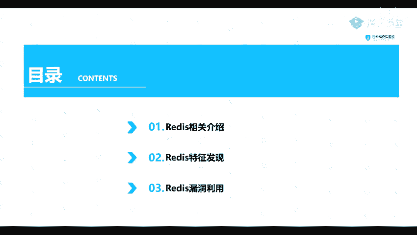
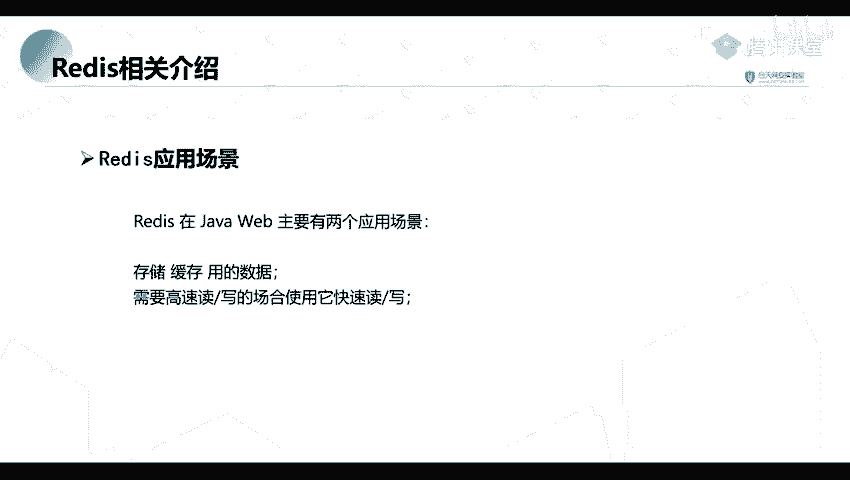
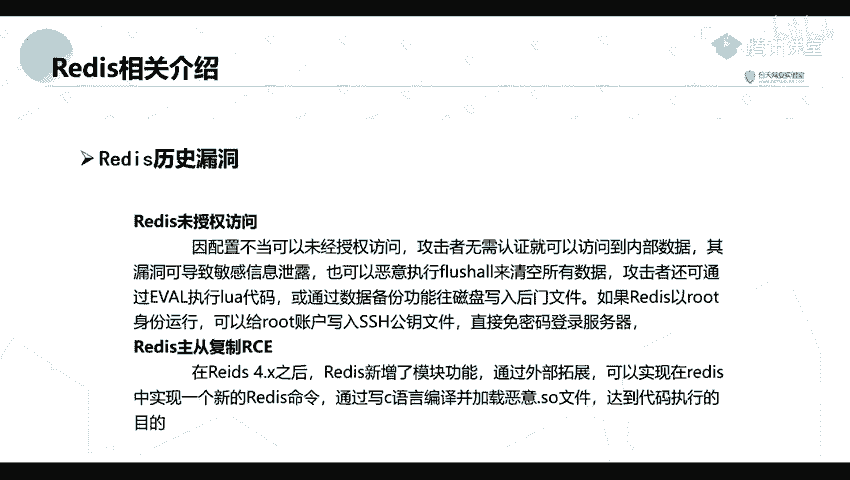

# 网络安全教程：P57：Redis相关介绍 🗄️

在本节课中，我们将要学习Redis数据库及其相关的安全漏洞。Redis是一个高性能的键值对数据库，广泛应用于缓存和高速读写场景。然而，配置不当可能导致严重的安全问题。我们将从Redis的基本介绍开始，然后探讨其常见的漏洞类型和发现方法，最后讲解如何利用这些漏洞。

## Redis简介与背景

上一节我们介绍了课程的整体安排，本节中我们来看看Redis是什么以及它为何重要。

Redis是一个完全开源、遵守BSD协议的高性能键值对（Key-Value）数据库。你可以将其理解为一个简单的、基于内存的数据库。

以下是Redis的主要应用场景：
*   **缓存数据**：用于存储频繁读取但较少变更的数据，以减轻后端数据库的压力。
*   **高速读写场合**：适用于需要处理高并发请求的场景。

什么是高并发场景呢？例如电商平台的双十一促销、抢红包活动或热门演唱会门票售卖。在这些时刻，服务器会在短时间内接收到海量请求。如果仅依赖传统数据库处理，即使系统不崩溃，响应速度也会变得极其缓慢，严重影响用户体验。

缓存之所以有效，是因为在日常数据库访问中，读操作（查询）的次数通常远多于写操作（增删改），比例大约在1:9到3:7之间。传统数据库每次执行SQL查询时，都可能需要从磁盘检索数据，这是一个相对缓慢的过程。Redis通过将数据存储在内存中，极大地加速了数据读取速度。

## Redis历史漏洞概述

了解了Redis的基本用途后，我们来看看它在安全方面存在哪些历史问题。

Redis历史上主要出现过两类高危漏洞：
1.  **未授权访问漏洞**
2.  **主从复制RCE漏洞**

值得注意的是，主从复制RCE漏洞本质上也是由未授权访问问题衍生而来的。

### 未授权访问漏洞

此漏洞由于Redis服务配置不当（例如，未设置密码认证`requirepass`，或将服务绑定在`0.0.0.0`且未设置防火墙规则）导致。攻击者无需认证即可连接到Redis服务并访问内部数据。

该漏洞可能造成以下危害：
*   **敏感信息泄露**：直接读取数据库中的键值对数据。
*   **数据丢失**：执行`FLUSHALL`命令清空所有数据库。
*   **写入WebShell**：利用Redis的数据持久化或备份功能，向磁盘写入恶意文件（如WebShell）。
*   **服务器沦陷**：如果Redis服务以`root`权限运行，攻击者可向服务器`~/.ssh/authorized_keys`文件写入自己的公钥，从而实现免密SSH登录，完全控制服务器。

### 主从复制RCE漏洞

这个漏洞出现在Redis 4.x/5.x版本中。Redis新增了模块功能，允许通过外部扩展在Redis中实现新的命令。攻击者可以构造一个恶意的Redis模块（编译为`.so`文件），然后利用Redis的主从复制机制，让目标Redis服务器从攻击者控制的“主节点”加载该恶意模块。

简单来说，主从复制RCE漏洞就是诱使目标Redis服务器加载外部的恶意`.so`文件，从而达到远程代码执行的目的。

## 本节课总结

本节课中我们一起学习了Redis数据库的基础知识及其核心安全漏洞。我们了解到Redis是一个高性能的键值存储，常用于缓存和高并发场景。同时，我们也重点分析了因配置不当引发的**未授权访问漏洞**和由此衍生的**主从复制RCE漏洞**，明确了这些漏洞可能导致的敏感信息泄露、数据破坏乃至服务器被完全控制的严重后果。理解这些是进行后续漏洞发现与利用的基础。