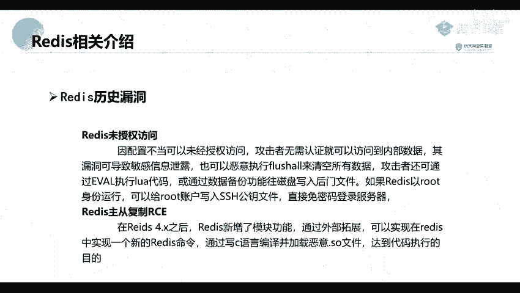
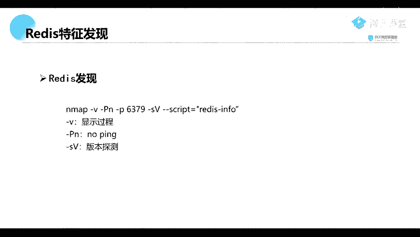
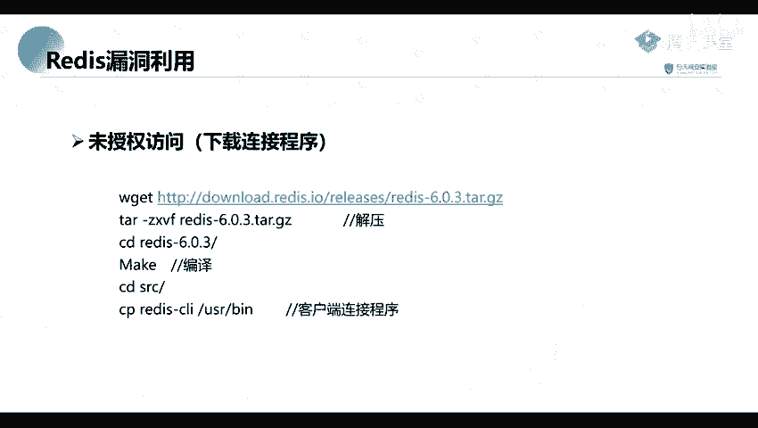

# 网络安全教程：P58：57.Redis特征发现



在本节课中，我们将学习如何识别和发现网络中的Redis服务。Redis是一种常见的内存数据库，其默认配置可能存在未授权访问漏洞，因此准确发现它是渗透测试中的重要一步。

## Redis服务特征


上一节我们介绍了信息收集的重要性，本节中我们来看看Redis服务具体有哪些可供识别的特征。

Redis服务具有几个明显的特征。首先，它默认绑定在**6379**端口上。在进行信息收集和端口扫描时，6379端口是需要重点关注的目标，因为它常常与Redis未授权访问漏洞相关联。

其次，Redis服务不使用常见的HTTP协议进行通信。这意味着我们无法通过普通的网页浏览器来访问它。要连接和操作Redis，必须使用其专用的客户端工具。

## 如何发现Redis服务

了解了Redis的特征后，我们来看看如何利用工具主动发现网络中的Redis服务。核心方法是使用端口扫描技术。

我们可以使用Nmap这一强大的网络扫描工具来发现Redis。以下是一个针对Redis服务的扫描命令示例：

```bash
nmap -v -Pn -p 6379 --script redis-info <目标IP>
```

以下是该命令中关键参数的解释：
*   **-v**：显示详细的扫描过程。
*   **-Pn**：跳过主机发现（Ping扫描），直接扫描指定IP。
*   **-p 6379**：指定扫描6379端口。
*   **--script redis-info**：使用Nmap的`redis-info`脚本进行扫描，该脚本能更准确地识别Redis服务并获取其信息。

执行此命令后，如果目标IP的6379端口开放且运行着Redis服务，Nmap将返回成功识别的结果。

## 漏洞利用思路



当我们成功发现一个开放的Redis服务后，由于它可能存在未授权访问漏洞，接下来的步骤通常是尝试直接连接。

如果目标Redis服务未设置密码认证（即存在未授权访问漏洞），攻击者可以直接使用Redis客户端连接到该服务，并执行数据读写、配置文件修改等操作，从而可能进一步获取服务器权限。



本节课中我们一起学习了Redis服务的核心特征、如何使用Nmap命令发现网络中的Redis服务，并简要了解了发现后的基本利用思路。掌握这些是进行Redis未授权访问漏洞测试的基础。