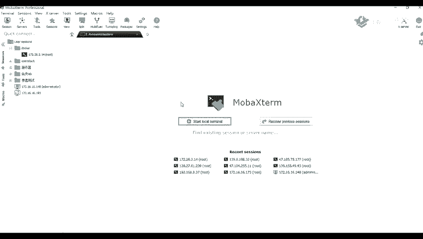
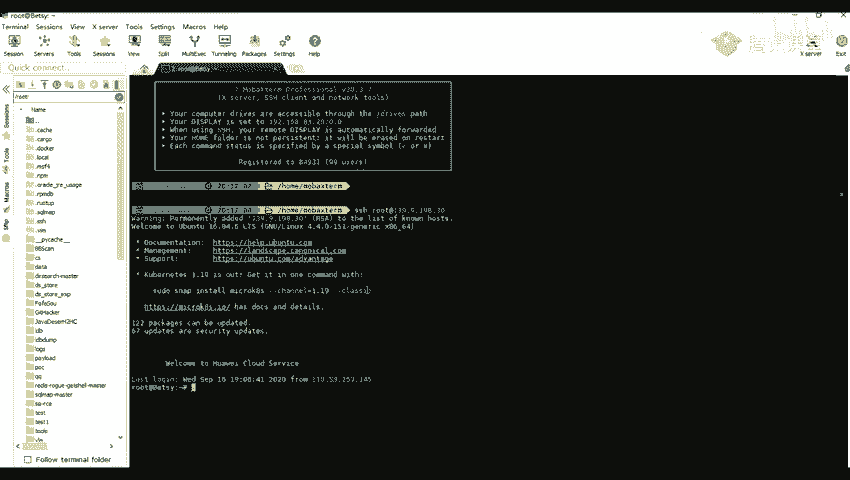

# 网络安全教程：P60：暴力破解介绍及应用场景 🔓

## 概述
在本节课中，我们将要学习网络安全中的一项重要技术——暴力破解。我们将了解暴力破解的基本概念、常用工具、字典的作用以及其常见的应用场景。通过本课的学习，你将能够理解暴力破解的原理，并知道在哪些情况下可以应用这项技术。

## 暴力破解介绍及应用场景

暴力破解指的是使用枚举的方式来尝试破解用户的信息。具体流程是使用事先收集好的字典，对目标进行不断的尝试，直到枚举成功。这个过程比较容易理解。

暴力破解通常用于枚举弱口令、验证码，以及其他用户上传的WebShell代码等信息。

### 常用字典
以下是关于暴力破解常用字典的介绍。字典是暴力破解成功与否的关键因素之一。

*   我们一般可以在网络上搜索到相关的字典。例如，可以搜索“弱口令字典”来获取资源。
*   也可以自己生成字典，或者使用脚本根据关键词快速生成相关的弱口令字典。
*   除了爆破用户名和密码，我们还可以使用字典对敏感文件路径等进行爆破。
*   网络上存在许多收集好的字典，例如包含了2011年至2019年Top 100弱口令以及Top 1000密码的字典，还有服务器密码字典、后台管理密码字典、数据库密码字典等。

那么，什么是弱口令呢？弱口令是指仅包含简单数字或字母的口令。例如：`123`、`123456`、`root`、`admin`、`password`等，或者一些简单的英文单词。这类口令非常容易被破解，从而导致用户的计算机、网站或个人隐私信息遭到泄露。

在当前许多系统中，用户名和密码是主要的身份验证方式。口令就如同家门的钥匙。如果他人掌握了进入你家的钥匙，你的安全、财产和隐私就极易遭受威胁。而弱口令就相当于把家门钥匙放在了门口的垫子下面。

### 常见密码破解工具
上一节我们介绍了字典，本节中我们来看看有哪些工具可以利用这些字典进行破解。以下是几种常见的密码破解工具：

*   **Burp Suite**：我们在之前讲解Burp Suite时提到过它的Intruder模块，该模块可用于进行爆破攻击。
*   **Hydra**：这是一个功能强大的网络登录破解工具，支持多种协议和服务，如HTTP、MySQL等。
*   **Metasploit**：该框架中也包含了许多用于爆破的模块或攻击载荷（Payload）。
*   **自定义脚本**：此外，我们还可以在网络上搜索各种密码破解脚本，例如用于破解Wi-Fi、RDP、VNC或压缩包密码的脚本。

破解的成功率很大程度上取决于字典是否足够强大。如果字典中包含了正确的密码，理论上就可以破解成功。

### 暴力破解的应用场景
了解了工具和字典后，我们来看看暴力破解一般适用于哪些场景。以下是暴力破解的几个典型应用场景：

*   **爆破验证码**：如果网站登录时的验证码没有设置过期时间限制，那么验证码也可以被尝试爆破。
*   **不含验证码的后台**：许多网站后台的管理登录界面可能不包含验证码，而前台用户登录则需要。这类后台是爆破的常见目标。
*   **各种应用程序**：例如phpMyAdmin（Web端数据库管理工具）、Tomcat（中间件）、MySQL数据库等的登录入口。
*   **各种协议**：可以对FTP、HTTP、SSH、RDP等多种协议进行爆破。例如，我们通常使用SSH协议登录Linux服务器。连接命令格式为：`ssh username@ip_address`。如果没有保存密码，则需要输入密码进行验证，这个过程就可能成为爆破的目标。

## 总结
本节课中，我们一起学习了暴力破解技术。我们了解了暴力破解是通过枚举字典来尝试破解用户信息的方法，认识了弱口令的概念及其危害，并介绍了常用的破解字典和工具（如Burp Suite、Hydra）。最后，我们探讨了暴力破解的典型应用场景，包括验证码、无验证码后台、各类应用程序及网络协议的登录破解。理解这些基础知识是进行安全测试和防御的重要一步。