# 网络安全教程：P61：暴力破解Tomcat后台 🔓

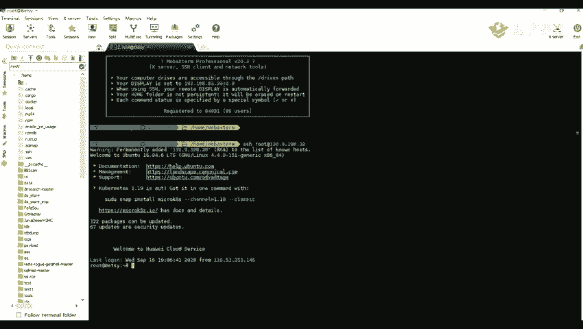

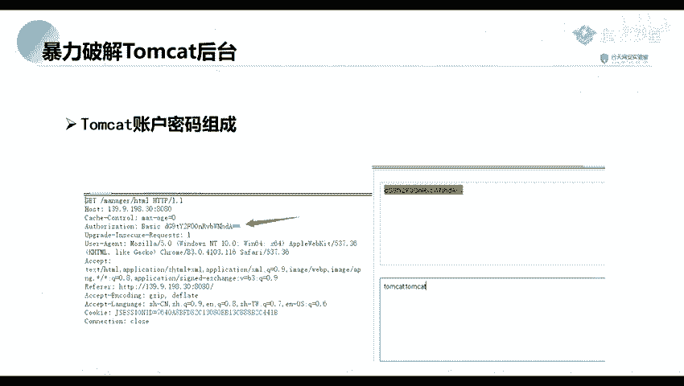

在本节课中，我们将学习如何对Tomcat管理后台进行暴力破解，并利用获取的权限部署WebShell，从而获取目标服务器的控制权。整个过程涉及抓包分析、密码构造、字典爆破以及WAR包的制作与部署。

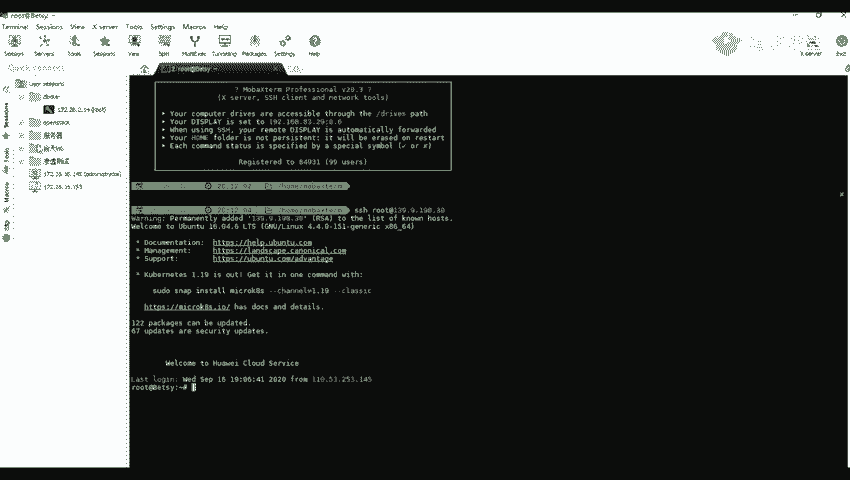

---

## 分析Tomcat认证机制

上一节我们介绍了基本的爆破概念，本节中我们来看看Tomcat后台的认证方式。

首先访问Tomcat默认管理后台路径 `/manager/html`，会出现一个需要输入用户名和密码的登录框。


为了进行爆破，我们需要了解其密码的传输格式。使用Burp Suite抓取登录请求包。


在Burp Suite的Repeater模块中查看抓到的请求。可以看到请求头中包含一个 `Authorization` 字段，其值是一串Base64编码的字符串。


使用Burp Suite的Decoder模块对该字符串进行Base64解码。解码后的格式为：`用户名:密码`。

**核心传输格式公式**：
`Authorization: Basic {Base64(用户名:密码)}`

这表明Tomcat使用HTTP基本认证（Basic Authentication），并将“用户名:密码”的字符串进行Base64编码后传输。

---

## 配置Burp Suite进行爆破

了解了认证格式后，我们就可以在Burp Suite中配置Intruder模块进行暴力破解。

1.  **发送到Intruder**：将抓到的登录请求包发送到Intruder模块。
2.  **设置攻击位置**：在 `Positions` 标签页，清除所有自动标记，只选中 `Authorization` 字段中Base64编码后的那部分字符串，点击 `Add §` 将其标记为爆破点。
3.  **选择攻击类型**：攻击类型（Attack type）选择 `Sniper` 即可。

### 配置Payload（字典）

接下来配置用于生成爆破字典的Payload。

在 `Payloads` 标签页进行以下设置：

1.  **选择Payload类型**：由于我们需要自定义“用户名:密码”的格式，因此选择 `Custom iterator`（自定义迭代器）。
2.  **配置迭代器**：
    *   **Position 1**：添加用户名字典项（如：`tomcat`, `admin`, `root`）。
    *   **Position 2**：添加一个静态值 `:`（冒号）。
    *   **Position 3**：添加密码字典项（如：`tomcat`, `123456`, `password`, `admin`）。

以下是配置示例：
```
Position 1 (用户名): tomcat, admin
Position 2 (分隔符): :
Position 3 (密码): tomcat, 123456
```
生成的组合将是：`tomcat:tomcat`, `tomcat:123456`, `admin:tomcat`, `admin:123456`。

3.  **添加编码规则**：在 `Payload Processing` 部分，点击 `Add`，选择 `Encode` -> `Base64-encode`。这会将我们生成的“用户:密码”字符串自动进行Base64编码。
4.  **禁用URL编码**：取消勾选 `Payload Encoding` 选项，防止Burp对冒号等字符进行额外的URL编码。

完成以上配置后，点击 `Start attack` 开始爆破。

---

## 识别爆破成功结果

爆破开始后，我们需要从大量请求中筛选出成功的那个。

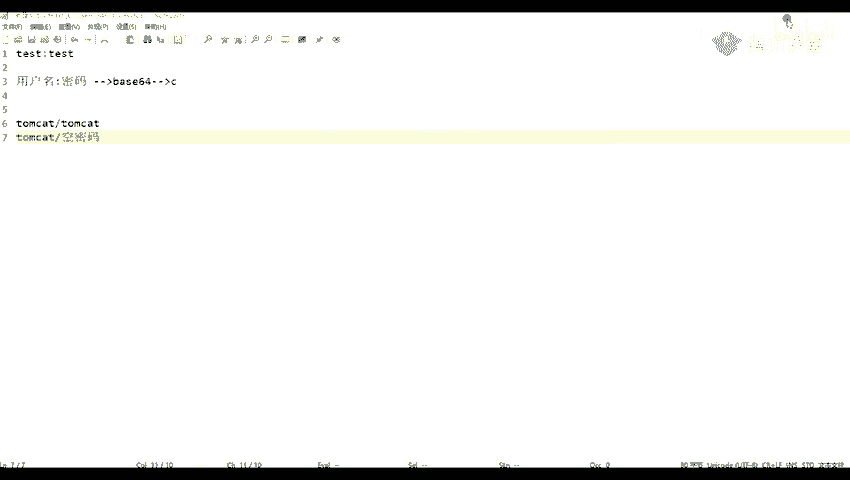

以下是两种主要的筛选方法：

1.  **根据状态码（Status）**：登录成功通常返回 `200` 状态码，而失败返回 `401`。在结果列表中按状态码排序，找到状态码为200的请求。
2.  **根据响应长度（Length）**：成功登录和失败登录返回的页面大小通常不同。找到响应长度与其他请求明显不同的那一条。

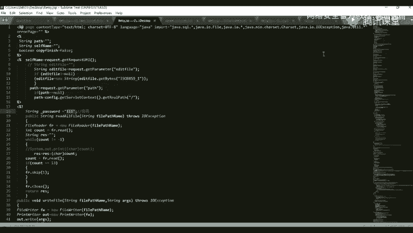


通过筛选，我们找到了一个状态码为200、长度与众不同的请求。其Payload值为 `dG9tY2F0OnRvbWNhdA==`。

使用Decoder模块对其进行Base64解码，得到明文：`tomcat:tomcat`。

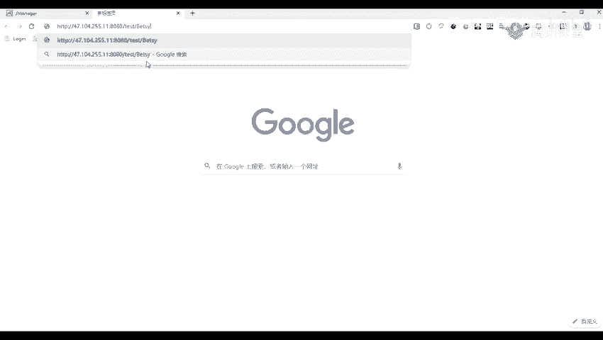

至此，我们成功爆破出Tomcat后台的管理员账号密码为 `tomcat` / `tomcat`。

> **注意**：Tomcat 6及以上版本可能引入了账户锁定机制，连续多次失败尝试会导致账户被临时锁定。因此在实际测试中，优先尝试常用默认口令（如tomcat/tomcat, admin/admin）是更高效的方法。

---

## 部署WebShell获取控制权

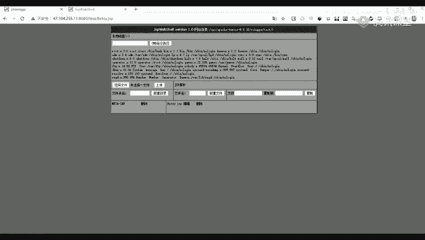

成功登录Tomcat管理后台（`/manager/html`）后，我们可以通过部署WAR包来获取WebShell。

### 制作WAR包

WAR（Web Application Archive）是Java Web应用程序的打包格式。我们可以将一个包含WebShell的JSP程序打包成WAR文件。

1.  准备一个JSP的WebShell文件（例如 `cmd.jsp`）。
2.  使用jar命令将其打包：
    ```bash
    jar -cvf shell.war cmd.jsp
    ```
    这条命令会将 `cmd.jsp` 打包成名为 `shell.war` 的文件。

### 部署并访问WebShell

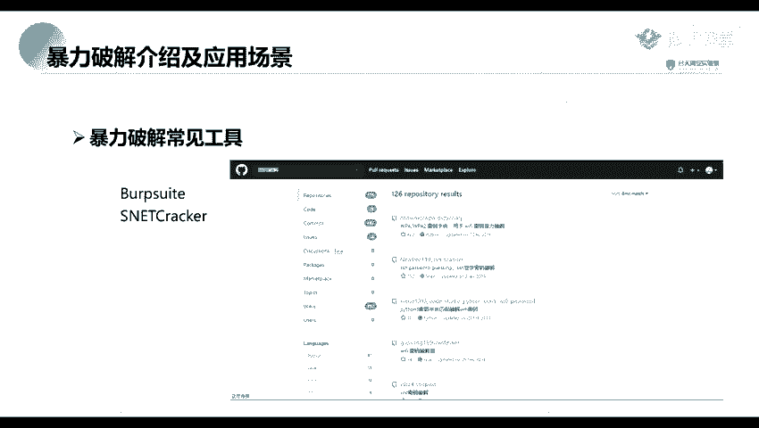

1.  在Tomcat管理后台的 “WAR file to deploy” 区域，选择制作好的 `shell.war` 文件并点击部署。
2.  部署成功后，会生成一个对应的应用路径，如 `/shell`。
3.  访问WebShell：`http://目标IP:端口/shell/cmd.jsp`。
4.  在WebShell页面中，即可执行系统命令，如 `ls`, `whoami`, `cat /etc/passwd` 等，从而控制服务器。

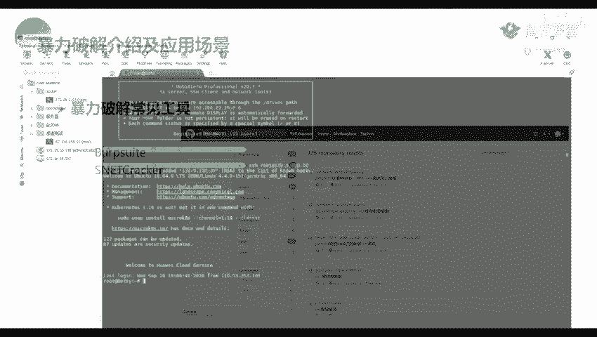


---

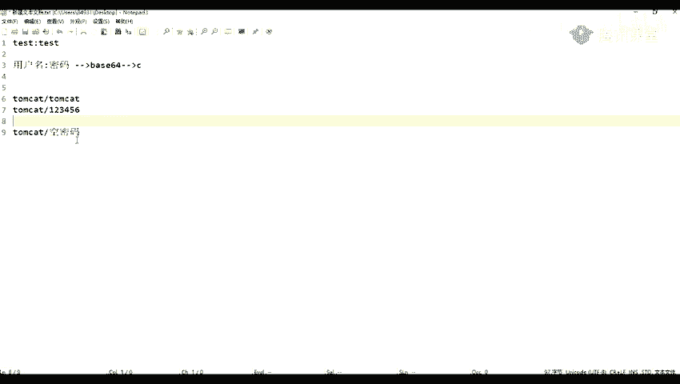

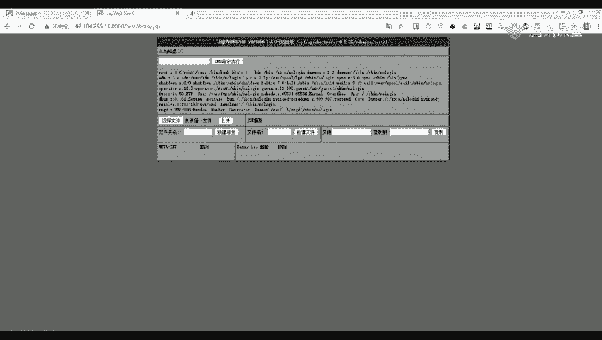

## 拓展：使用其他工具进行爆破

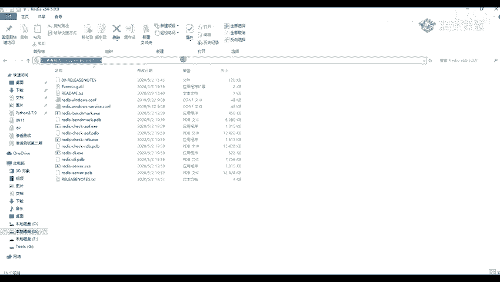

除了Burp Suite，还有一些专用工具可用于爆破，例如 **超级弱口令检查工具**。

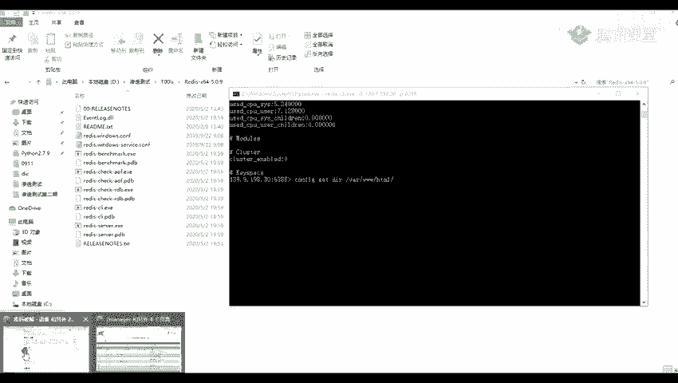


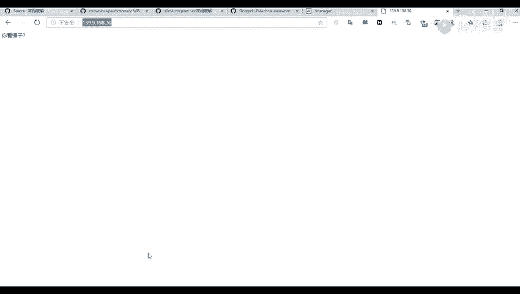

该工具支持多种协议（如MySQL、FTP、SSH、Tomcat等）的弱口令检测，内置丰富字典，图形化界面操作简单。
1.  选择目标协议（如 `Tomcat`）。
2.  输入目标地址和端口。
3.  导入或使用内置的用户名/密码字典。
4.  点击检查，工具会自动进行爆破并显示结果。

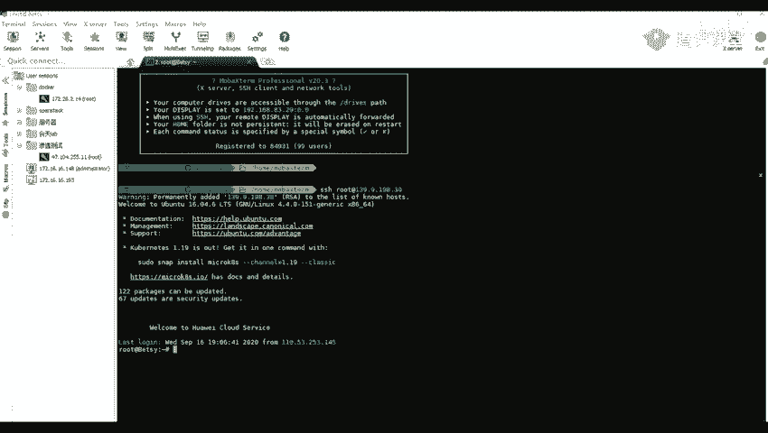


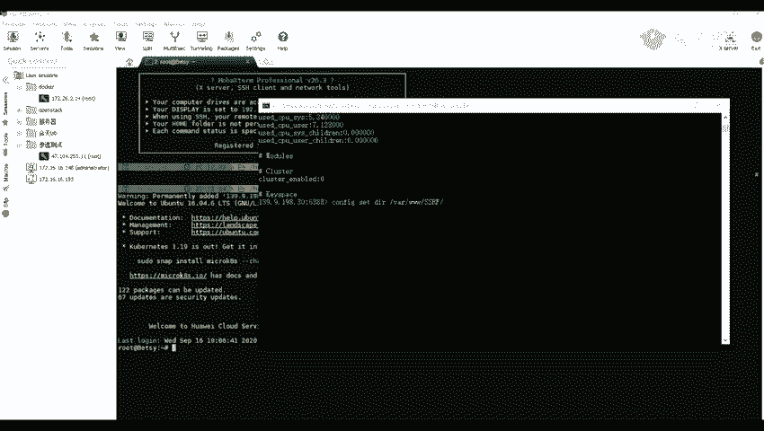

---

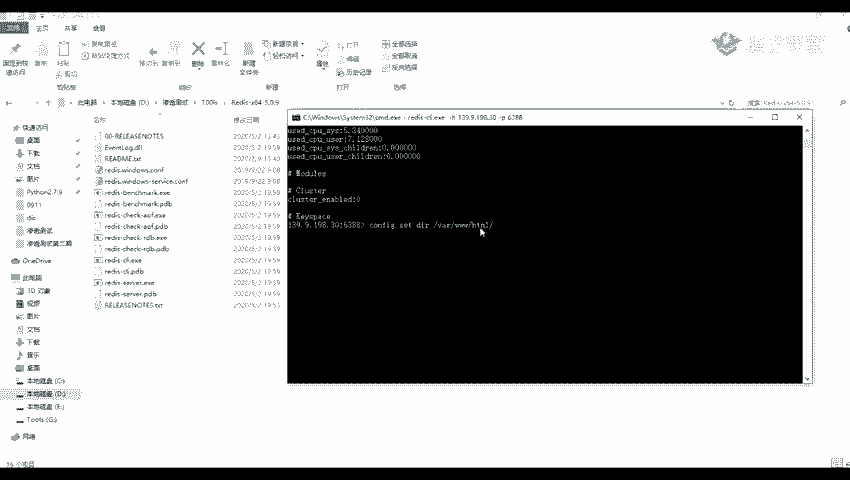

## 总结与注意事项

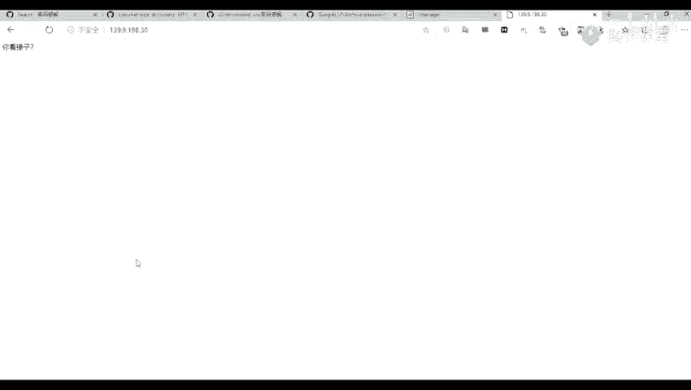

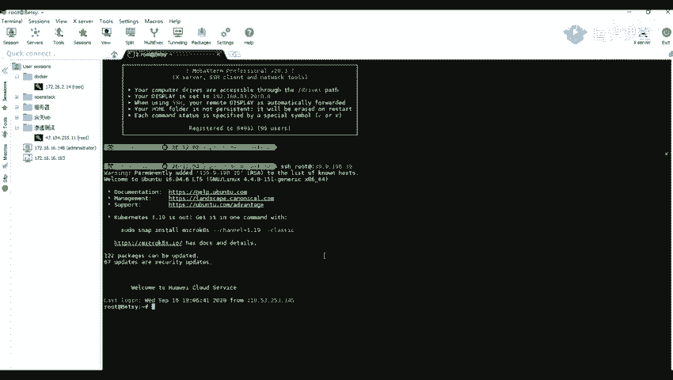

本节课中我们一起学习了针对Tomcat管理后台的完整攻击流程：

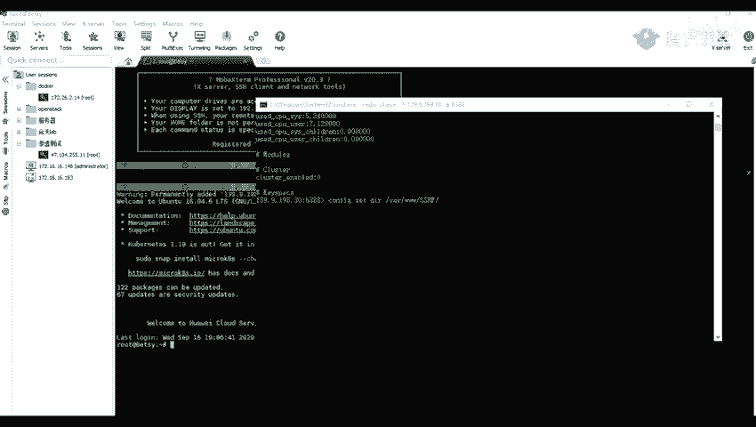

1.  **信息收集**：发现Tomcat后台路径 (`/manager/html`)。
2.  **机制分析**：通过抓包分析，确认其使用HTTP基本认证，传输格式为 `Base64(用户名:密码)`。
3.  **暴力破解**：利用Burp Suite的Intruder模块，配置自定义迭代器生成有效载荷，并进行Base64编码后爆破。通过状态码和响应长度筛选成功结果。
4.  **权限提升**：利用获取的权限，在管理后台上传并部署包含WebShell的WAR包，从而获得目标服务器的命令执行能力。

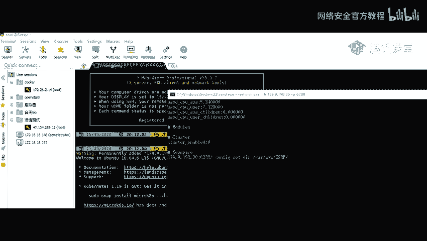

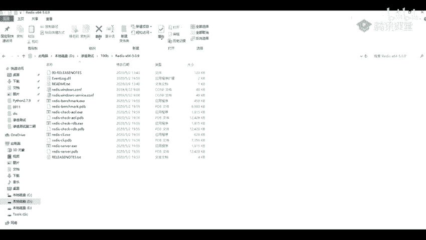

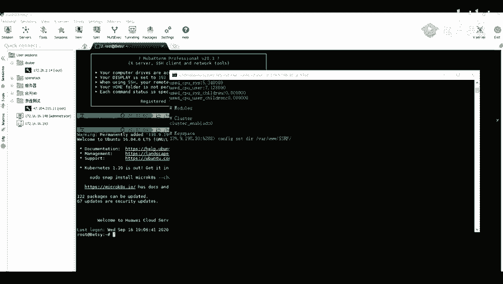

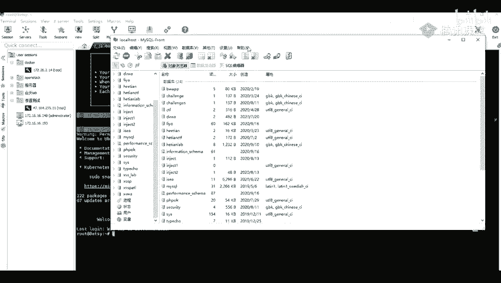

**关键注意事项**：
*   高版本Tomcat可能存在的爆破锁定机制。
*   实战中应优先尝试常用默认口令。
*   获取WebShell后，操作需谨慎，并遵守法律法规和授权范围。

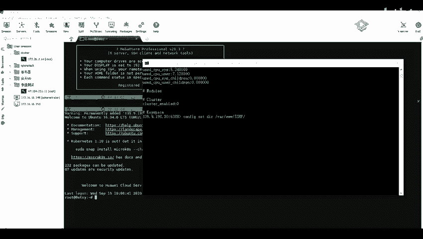

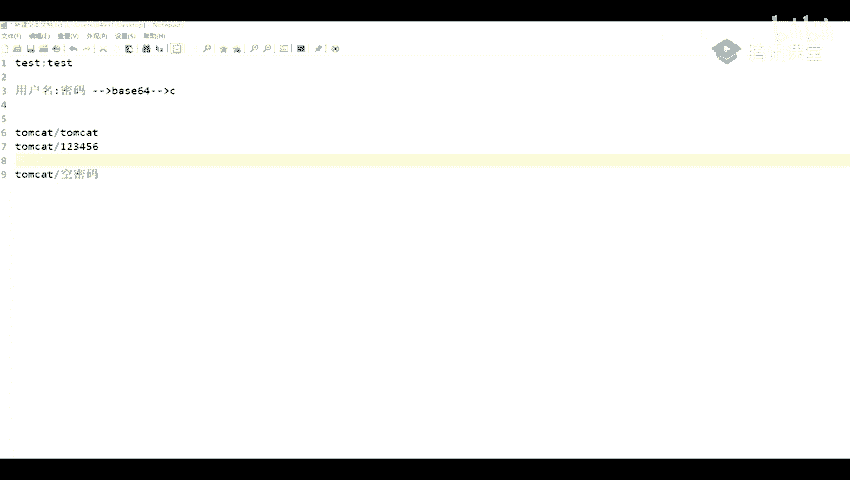

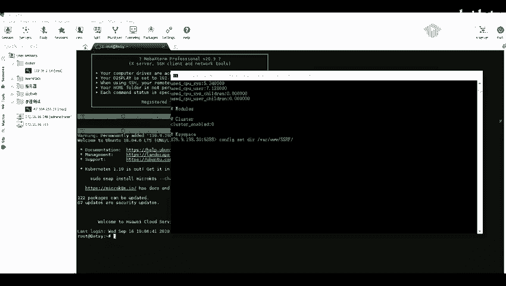

通过本课的学习，你应该掌握了对Tomcat这类服务进行认证破解的基本方法和后期渗透思路。请务必在合法授权的环境中进行练习。