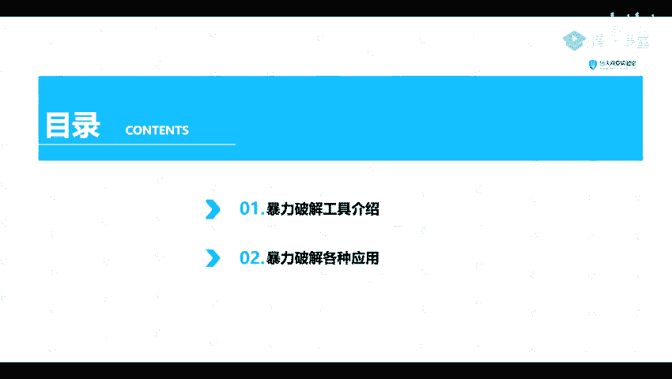
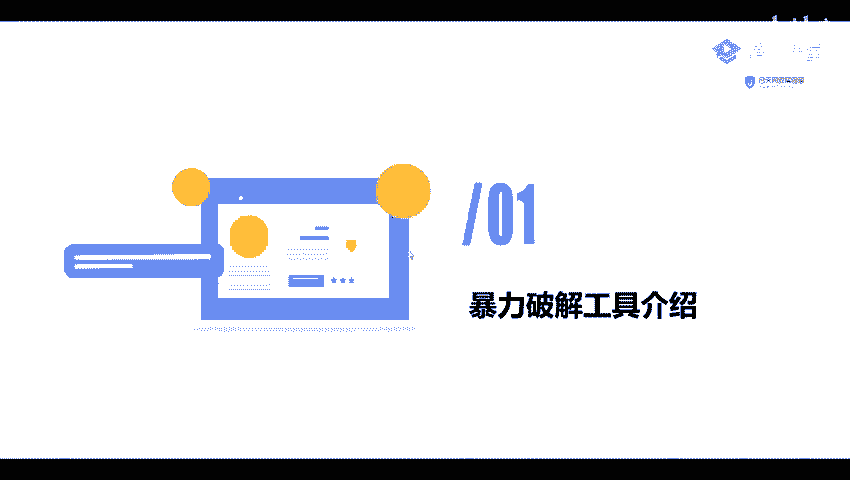
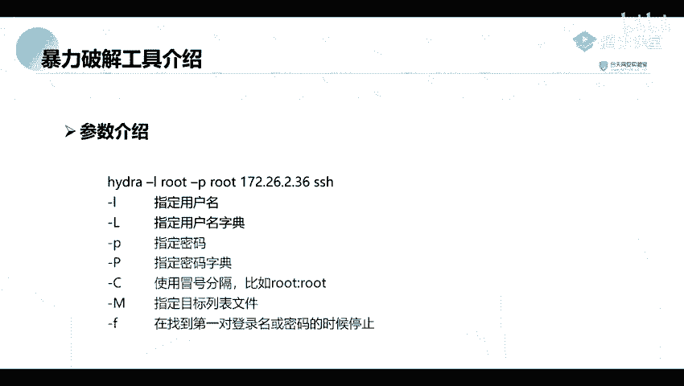

# 网络安全教程：P62：暴力破解工具介绍 🛠️

在本节课中，我们将学习两种用于密码暴力破解的工具：Hydra（九头蛇）和Metasploit框架中的扫描模块。课程分为两部分：首先介绍Hydra工具的基本参数和使用方法，然后了解如何利用Metasploit的辅助模块进行扫描。

## 暴力破解工具介绍

上一节我们介绍了密码破解的基本概念，本节中我们来看看具体的工具应用。首先介绍的是一款名为Hydra（中文常称为“九头蛇”）的开源暴力破解工具。

Hydra支持对多种协议和服务进行暴力破解，例如FTP、MySQL、HTTP等。该工具已内置在Kali Linux渗透测试系统中，可以直接使用。

### Hydra工具参数解析

要使用Hydra，首先需要了解其常用命令行参数。以下是几个核心参数及其功能的介绍：

*   **-l**：指定单个用户名。
*   **-L**：指定一个包含多个用户名的字典文件。
*   **-p**：指定单个密码。
*   **-P**：指定一个包含多个密码的字典文件。
*   **-C**：使用冒号分隔的“用户名:密码”格式文件（例如 `root:123456`）。
*   **-M**：指定一个包含多个目标IP或主机名的文件，用于批量攻击。
*   **-f**：在找到第一对正确的用户名和密码后，立即停止破解。

## Metasploit框架中的扫描模块

除了独立的Hydra工具，我们还可以利用功能更强大的渗透测试框架——Metasploit。Metasploit Pro是其中一款强大的商业版本，其社区版已内置在Kali Linux中。

在后续课程中，我们将深入讲解Metasploit框架。它包含一个名为`auxiliary/scanner`的辅助模块集，专门用于对各种服务进行扫描和探测。

例如，该模块集中包含针对MySQL数据库用户名密码的暴力破解扫描器，以及针对其他常见应用（如我们之前课程提到过的Oracle等）的扫描模块。

---

本节课中我们一起学习了两种主流的密码暴力破解工具。首先详细介绍了Hydra的命令行参数和使用场景，然后简要了解了Metasploit框架中`auxiliary/scanner`模块的用途，为后续的实际操作打下基础。