# 网络安全教程：P64：Metasploit目录结构 🗂️

在本节课中，我们将要学习Metasploit框架（简称MSF）的目录结构。了解其内部文件组织是有效使用这个强大渗透测试工具的第一步。我们将从框架概述开始，逐步深入到其核心目录和模块，并学习如何启动和进行基本操作。

## 概述

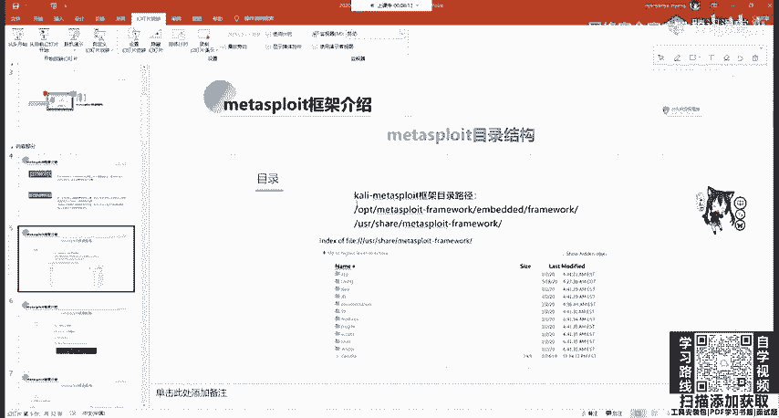

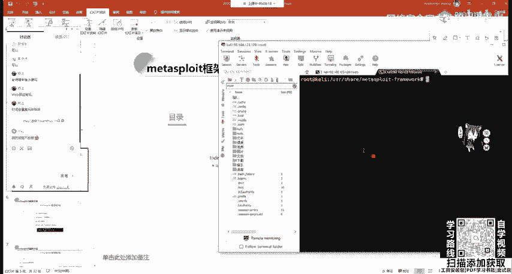

Metasploit（MSF）是一个高度模块化的开源安全漏洞利用和测试框架。它集成了大量常见的系统服务漏洞利用脚本（Exploit）和攻击载荷（Payload），并持续更新。掌握其目录结构有助于我们理解其工作原理并高效地调用各种模块。

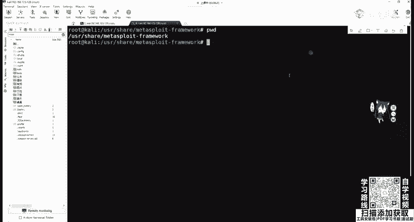

## Metasploit框架简介

Metasploit框架（MSF）是最受欢迎的渗透测试工具之一。它涵盖了渗透测试的全过程，允许测试人员利用现有的漏洞利用模块和攻击载荷进行测试，而无需从零开始深入研究每个漏洞的底层细节。

当然，深入调试漏洞（例如MS17-010）能帮助我们更深刻地理解漏洞成因，这对于进阶学习很有价值。但对于入门阶段，我们可以先专注于学习如何使用框架本身。

在Kali Linux系统中，Metasploit通常是预装的。其安装路径在新版Kali中通常位于 `/usr/share/metasploit-framework`。这个目录包含了框架的所有核心文件。

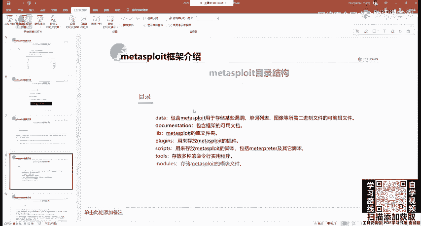

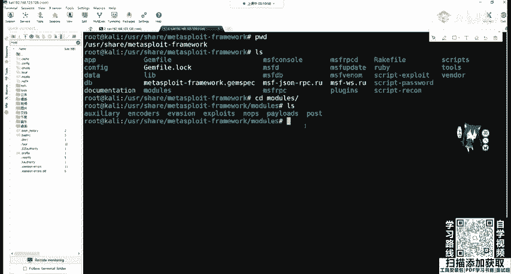

## 目录结构详解

上一节我们介绍了MSF的基本概念和安装位置，本节中我们来看看其核心目录的具体内容。进入 `/usr/share/metasploit-framework` 目录，可以看到以下主要文件夹：

以下是各目录功能的简要说明：

*   **data**： 用于存储某些漏洞所需的二进制文件、可编辑文件以及其他数据。
*   **documentation**： 包含框架的相关文档。
*   **lib**： 库文件夹，包含MSF的核心库文件。
*   **plugins**： 插件文件夹，用于扩展框架功能。
*   **scripts**： 脚本文件夹，包含一些辅助性的Ruby脚本。
*   **tools**： 工具文件夹，包含一些独立的命令行工具。
*   **modules**： **这是最重要的目录**，包含了MSF所有的功能模块。我们对渗透测试的自动化利用，主要就是通过调用此目录下的模块文件来实现。

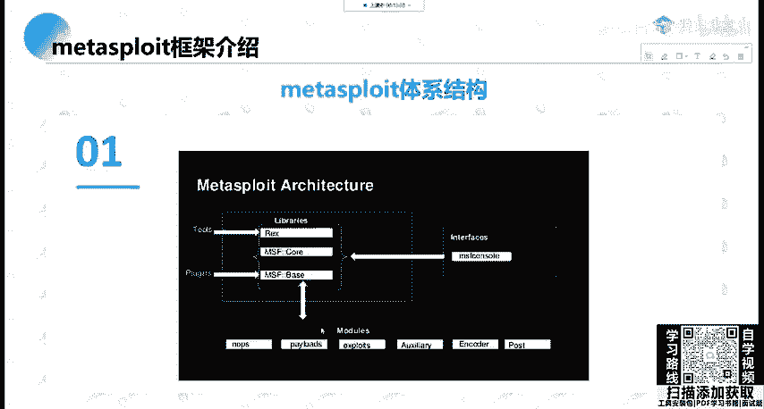

## 核心模块目录

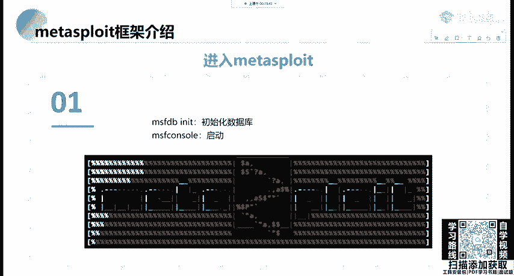

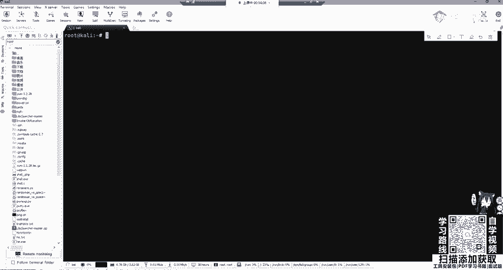

了解了整体目录后，我们聚焦到最关键的 `modules` 目录。使用 `cd modules` 命令进入后，可以看到7个子目录，它们代表了MSF的不同功能类别。

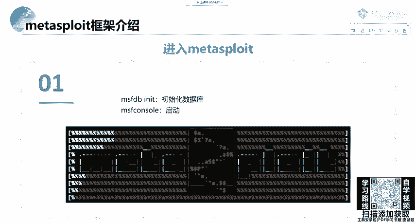

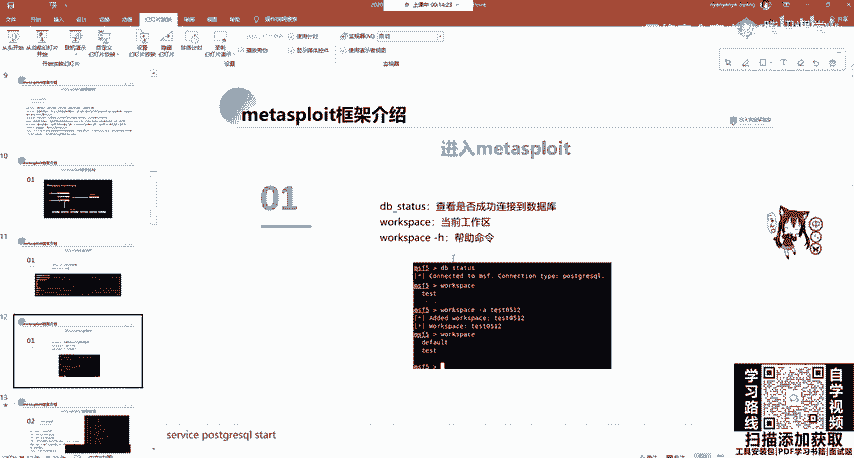

以下是每个子目录的详细说明：

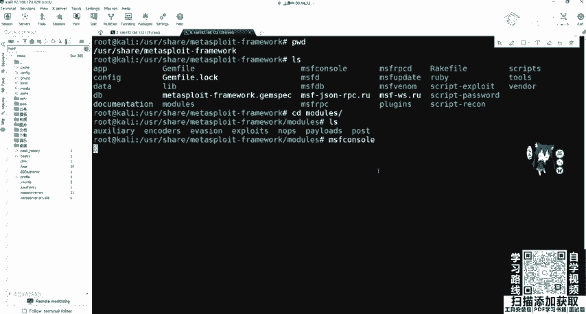

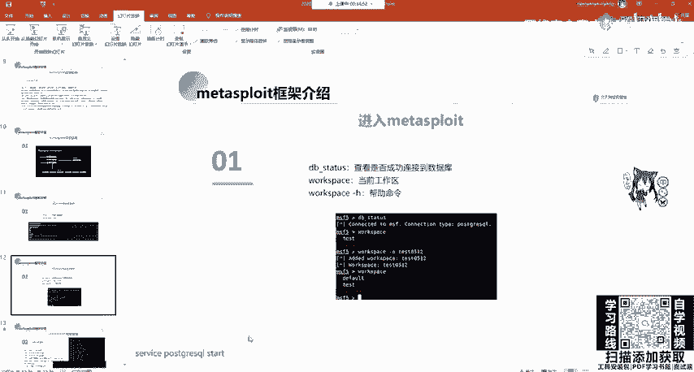

1.  **auxiliary（辅助模块）**： 用于辅助渗透，主要进行前期信息收集、漏洞扫描和探测。例如端口扫描、弱密码爆破、漏洞验证等。
2.  **exploits（漏洞利用模块）**： 包含针对主流软件或系统漏洞的利用脚本（Exploit）。这是发起攻击的核心部分。
3.  **payloads（攻击载荷模块）**： 包含在攻击成功后，在目标机器上执行的代码，用于反弹Shell（例如，获取 `bash` 或 `cmd` 权限）。
4.  **post（后渗透模块）**： 在成功获取目标Shell（建立Meterpreter会话）后使用。用于进行提权、内网代理、信息搜集等后续操作。
5.  **encoders（编码器模块）**： 用于对攻击载荷（Payload）进行编码和加密，目的是绕过入侵检测系统（IDS）或杀毒软件（AV）的检测。
6.  **nops（空指令模块）**： 用于生成“空指令”（NOP sled）。在汇编中，`NOP`指令（机器码 `0x90`）不执行任何操作，常用于缓冲和绕过某些基于规则的系统检查。
7.  **evasion（躲避模块）**： 用于生成免杀（Antivirus Evasion）的攻击载荷。

## 框架体系与基本操作

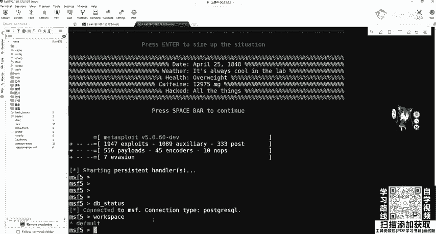

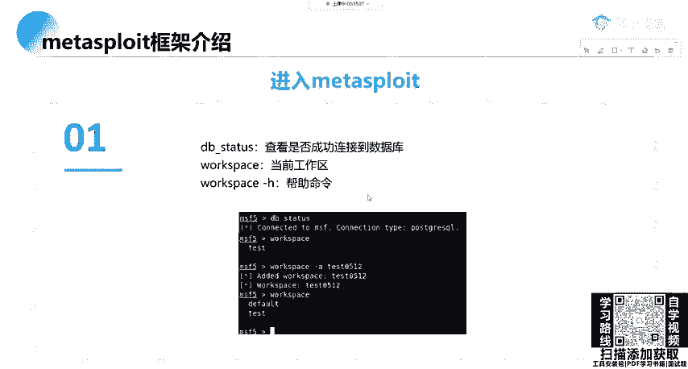

Metasploit的体系结构围绕其核心库文件构建。我们通过 `msfconsole` 这个命令行接口来调用这些库，进而使用上述的各种模块。

### 启动MSF控制台

首先，可以选择初始化数据库（用于保存扫描结果、会话等信息，非必需但推荐）。命令如下：
```bash
msfdb init
```
初始化后，使用以下命令启动控制台：
```bash
msfconsole
```
启动后，命令行提示符会从普通的Shell变为 `msf6 >`，表示已进入MSF工作环境。

### 基础命令与信息收集

在 `msfconsole` 中，可以执行一些基础命令：
*   `db_status`： 检查是否成功连接到PostgreSQL数据库。
*   `workspace`： 查看当前工作区（默认为`default`）。可以使用 `workspace -a [名称]` 创建并切换到新工作区。

MSF能够支持渗透测试的全过程，包括信息收集阶段。它内置了Nmap的功能：
*   `db_nmap`： 用法与标准Nmap完全相同，但扫描结果会自动存入MSF数据库。例如：
    ```bash
    db_nmap -sS -A 192.168.1.0/24
    ```

### 使用辅助模块进行扫描

除了调用外部工具，更“原生”的方式是使用MSF自身的辅助模块。例如，进行TCP SYN半开端口扫描：

1.  搜索相关模块：
    ```bash
    search portscan
    ```
2.  使用指定的扫描模块：
    ```bash
    use auxiliary/scanner/portscan/syn
    ```
3.  查看需要设置的参数：
    ```bash
    show options
    ```
4.  设置目标IP地址（例如 `192.168.1.129`）：
    ```bash
    set RHOSTS 192.168.1.129
    ```
5.  运行模块：
    ```bash
    run
    # 或者
    exploit
    ```

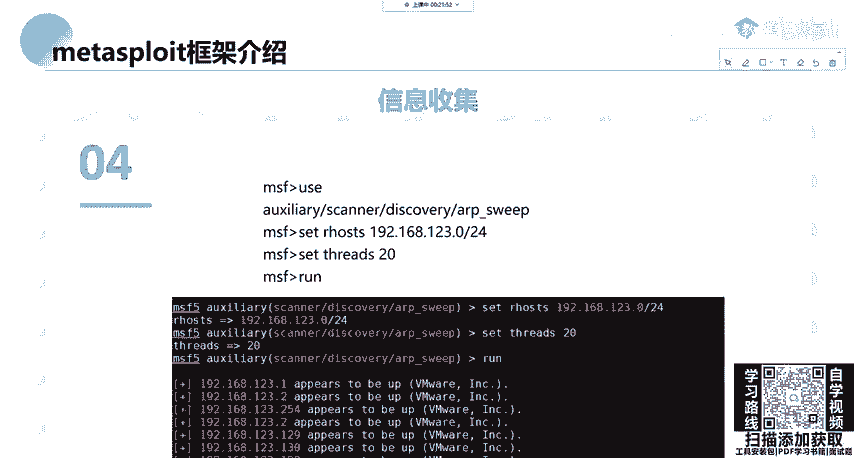

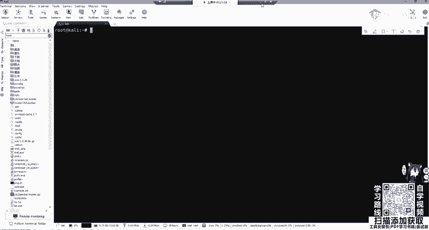

同样，也可以进行内网主机发现（C段扫描）：
```bash
use auxiliary/scanner/discovery/arp_sweep
set RHOSTS 192.168.1.0/24
run
```

## 总结

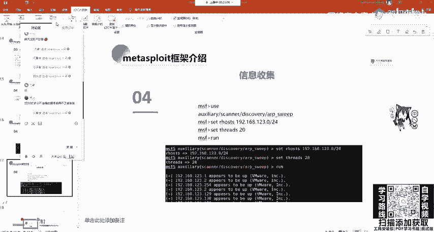

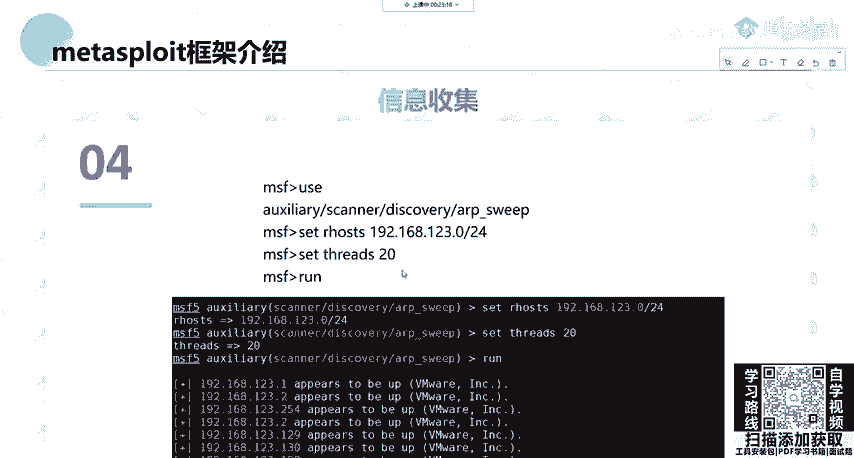

本节课中我们一起学习了Metasploit框架的目录结构。我们从框架概述开始，明确了其核心目录的作用，特别是包含了所有功能模块的 `modules` 目录及其下的七个子类别。接着，我们学习了如何启动 `msfconsole` 控制台，并实践了使用数据库、工作区以及利用辅助模块进行基本的端口扫描和主机发现。理解这些基础是后续深入学习漏洞利用、后渗透等技术的关键。