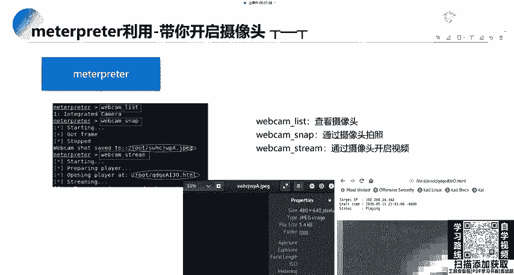
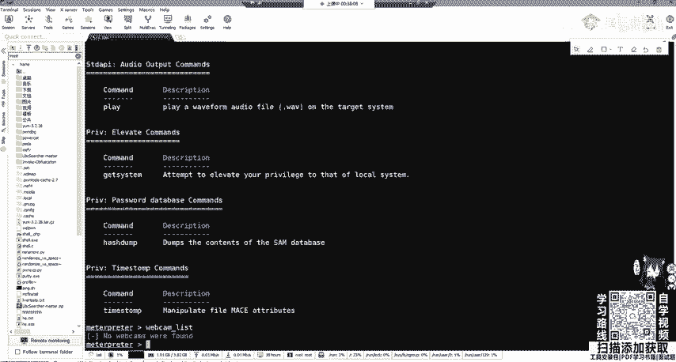
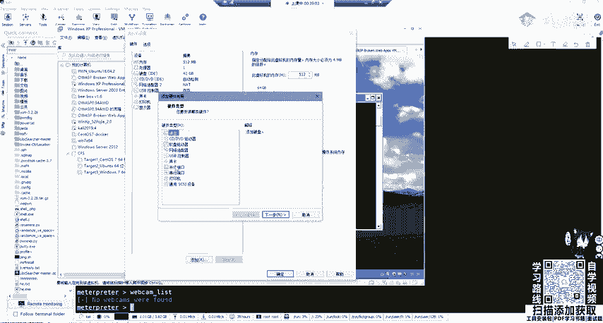
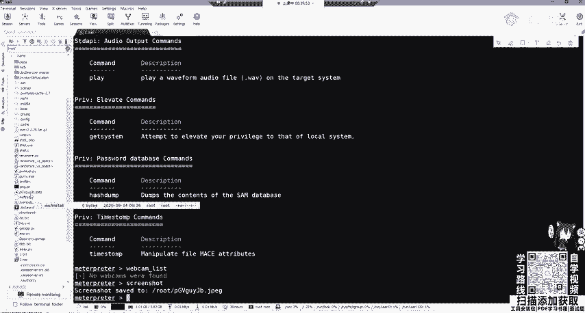
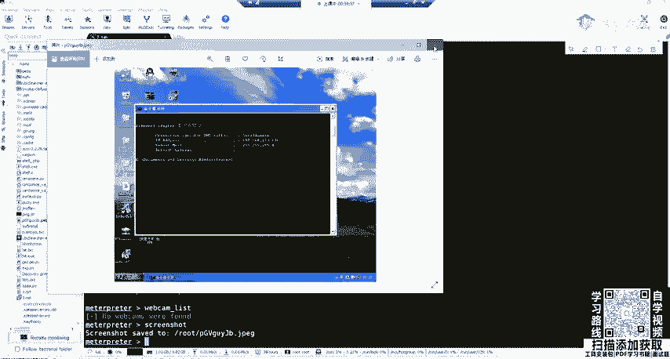
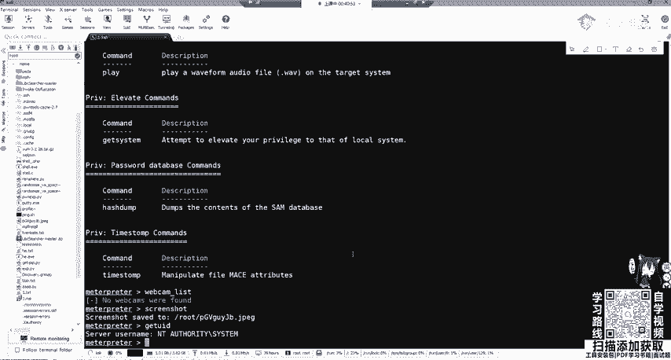
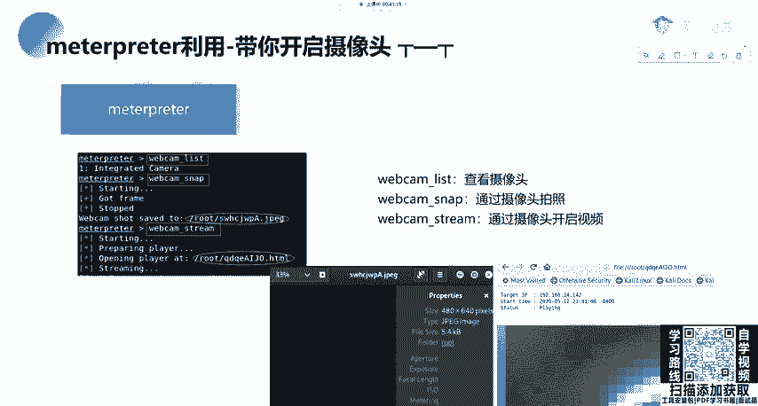
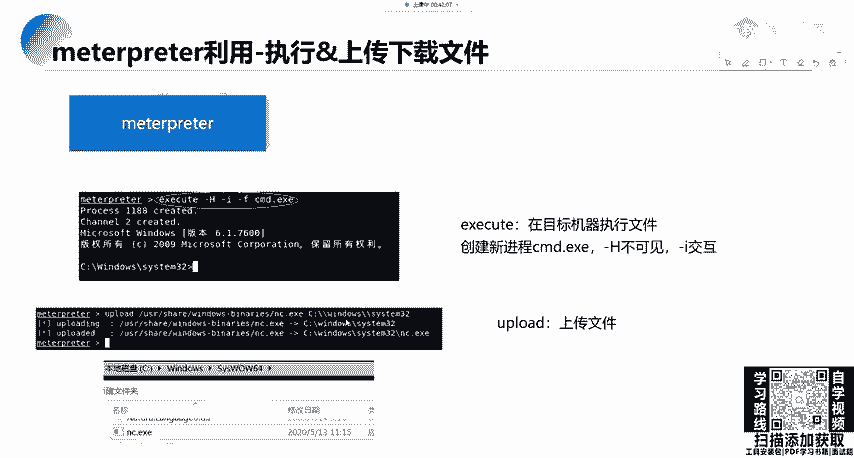
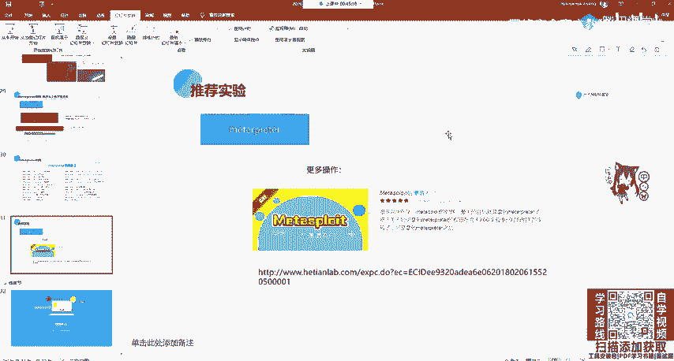

# 网络安全教程：P67：Meterpreter 利用


## 概述
在本节课中，我们将学习 Meterpreter 这一强大的后渗透工具的基本用法。我们将了解如何利用 Meterpreter 进行系统信息收集、文件操作、摄像头控制等，并熟悉其常用命令。



---

## 转换 Meterpreter 会话
上一节我们介绍了如何获取初始的 Shell 会话。本节中我们来看看如何将其转换为功能完整的 Meterpreter 会话。



如果获取到的是一个普通的 Shell 或功能受限的 Meterpreter 会话，可以使用 `sessions -u` 命令加上会话 ID 进行升级转换。
```bash
sessions -u <session_id>
```
请注意，此转换过程有可能会失败。



---

## Meterpreter 基础命令
成功进入 Meterpreter 会话后，输入 `?` 或 `help` 可以查看所有可用的命令。





以下是 Meterpreter 支持的主要功能类别：
*   **系统交互**：执行命令、管理进程。
*   **文件系统操作**：上传、下载文件。
*   **信息收集**：获取系统信息、用户权限。
*   **设备控制**：摄像头、屏幕控制。
*   **网络操作**：端口转发等。

---



## 摄像头与屏幕控制
除了渗透测试，Meterpreter 也可以用于演示一些安全风险，例如控制摄像头和屏幕。

以下是相关的操作命令：
*   **`webcam_list`**：列出可用的摄像头设备。
*   **`webcam_snap`**：通过摄像头拍摄一张照片。
*   **`webcam_stream`**：开启摄像头实时视频流（可通过 Web 接口访问）。
*   **`screenshot`**：对目标屏幕进行截屏。
*   **`screenshare`**：实时查看目标屏幕。



> **注意**：要控制虚拟机内的摄像头，需先在虚拟机设置中连接主机的摄像头设备。



---

## 系统命令与文件操作
现在，我们来学习如何与目标系统进行深入交互。

首先，可以查看当前用户权限和系统进程：
*   **`getuid`**：查看当前 Meterpreter 会话的用户权限（例如是否为 `SYSTEM` 管理员）。
*   **`ps`**：查看目标机器上运行的进程列表。

Meterpreter 的一个重要功能是调用系统命令行：
*   **`shell`**：直接获取一个系统 Shell（如 Windows 的 `cmd.exe`）。
*   在获得的 Shell 中，可以执行创建用户、删除文件等操作。

此外，还可以在攻击机和目标机之间传输文件：
*   **`upload`**：将本地文件上传到目标主机。
    ```bash
    upload /local/path/file.exe C:\\target\\path\\file.exe
    ```
*   **`download`**：从目标主机下载文件到本地。

---



## 常用命令回顾
我们已经介绍了多个功能，现在对 Meterpreter 最常用的命令进行总结。

以下是渗透测试中频繁使用的核心命令：
*   **`background`**：将当前 Meterpreter 会话置于后台运行。
*   **`sysinfo`**：获取目标系统的详细信息（如操作系统、计算机名）。
*   **`shell`**：获取系统命令行界面。
*   **`ps`**：查看系统进程。
*   **`upload`/`download`**：文件传输。
*   **`getuid`**：检查当前权限。
*   **`run killav`**：尝试关闭杀毒软件（**注**：此命令对现代杀毒软件通常无效）。

---

## 总结与拓展
本节课中我们一起学习了 Meterpreter 的基本利用方法，包括会话转换、命令执行、文件操作和设备控制。

Meterpreter 的功能远不止于此，其强大之处在于模块化，可以通过各种漏洞（如 Web 漏洞、服务漏洞、CVE 漏洞）获得初始访问权限，并在此基础上进行深度后渗透。掌握其基础流程是关键。

**学习建议**：
1.  **动手实践**：在虚拟机环境中搭建靶机，完整复现攻击流程。
2.  **总结记录**：将操作步骤、命令和遇到的问题整理成笔记或博客，便于复习和知识沉淀。
3.  **拓展学习**：可以搜索“Meterpreter 后渗透”相关实验教程进行更深入的练习。

仅仅通过课程无法精通 Meterpreter，持续的实践和总结是掌握网络安全技能的唯一途径。