# 网络安全教程：P68：Cobalt Strike简介 🛡️

在本节课中，我们将学习渗透测试工具Cobalt Strike的简介、核心功能、安装配置以及基本使用方法。

## 什么是Cobalt Strike？

Cobalt Strike（简称CS）是一款团队作战渗透测试神器。它分为客户端及服务端。服务端可以对应多个客户端，而一个客户端又可以连接多个服务端。

CS集成了渗透测试中经常使用的功能，包括：
*   端口转发与扫描
*   多模式的端口监听
*   Windows可执行程序生成
*   Windows动态链接库生成
*   Java应用程序生成
*   Office宏代码生成

同时，CS也能帮助我们克隆浏览器相关信息、克隆钓鱼网站等。

## Cobalt Strike与Metasploit的关系

Cobalt Strike经常与Metasploit框架进行联动，两者结合能显著提升渗透测试效率。

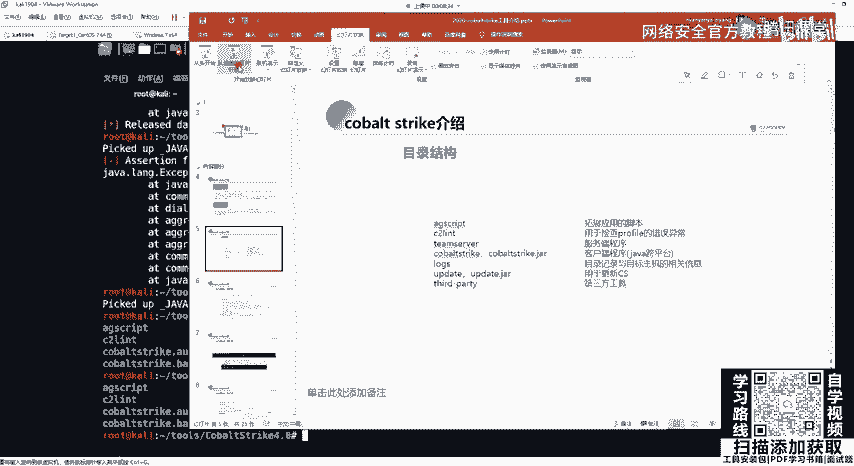

Metasploit（MSF）是一款开源的渗透测试框架，我们通常使用其命令行接口`MSFconsole`。MSF也具有图形化界面，名为Armitage。

**Cobalt Strike实际上是Armitage的增强版**，并且是商业软件。CS 2.0版本仍依托于MSF框架，但从3.0版本开始，CS已成为独立的平台。本教程使用的是CS 4.0版本。

## 目录结构解析

了解工具目录结构有助于后续使用。以下是Cobalt Strike的主要目录和文件：

*   **`script/`**：存放CS的拓展应用脚本，支持插件和脚本拓展，文件以`.cna`结尾。
*   **`c2lint`**：用于检查profile配置文件的错误或异常。
*   **`teamserver`**：服务端主程序。
*   **`cobaltstrike.jar`**：客户端程序。
*   **`logs/`**：存放日志文件。
*   **`update/`**：用于更新Cobalt Strike。
*   **`third-party/`**：存放第三方工具。

## 服务端安装与启动

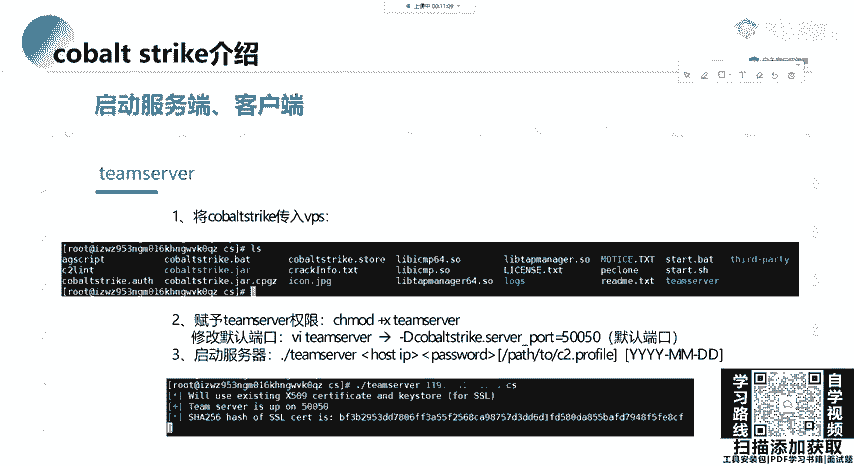

上一节我们介绍了CS的目录结构，本节中我们来看看如何安装和启动服务端。

Cobalt Strike服务端只能运行在Linux操作系统上，并且需要Java环境。

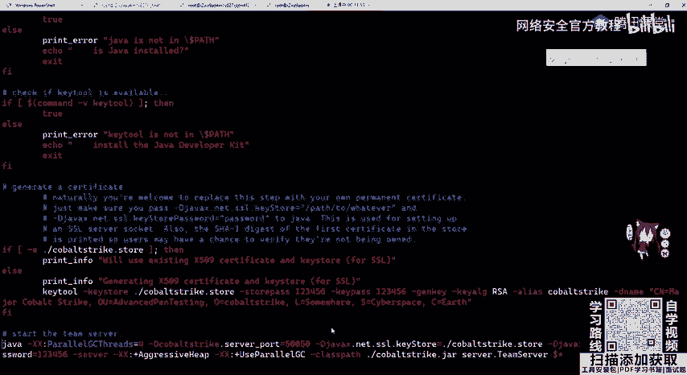

**安装Java环境（以CentOS为例）**：
如果使用Kali Linux，Java环境通常已预装。如果是自行购买的VPS服务器，可以使用Yum包管理器安装：
```bash
yum install -y java-1.8.0*
```

**启动服务端**：
1.  将整个Cobalt Strike文件夹上传到服务器。
2.  为`teamserver`文件添加可执行权限：
    ```bash
    chmod +x teamserver
    ```
3.  启动服务端，需要指定服务器IP和连接密码：
    ```bash
    ./teamserver <你的服务器IP地址> <连接密码>
    ```
    例如：`./teamserver 123.123.123.123 password`
    服务端默认监听**50050**端口，可以在`teamserver`脚本中修改。

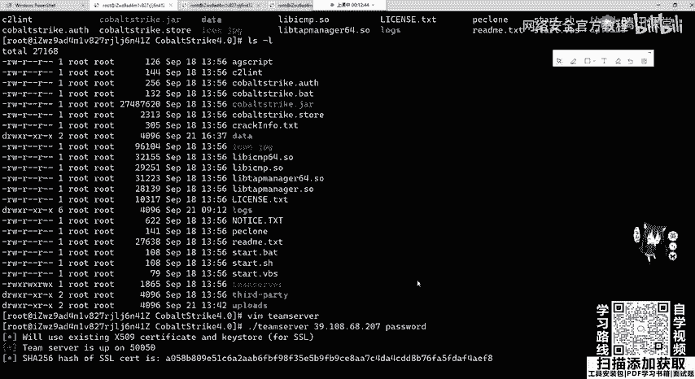

## 客户端连接与使用

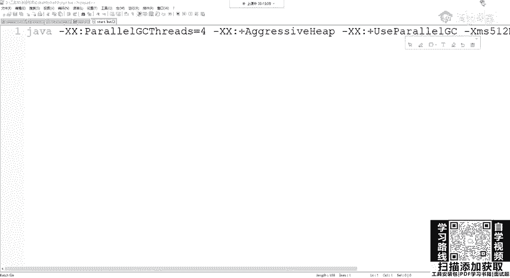

服务端启动后，我们可以在本地使用客户端进行连接。

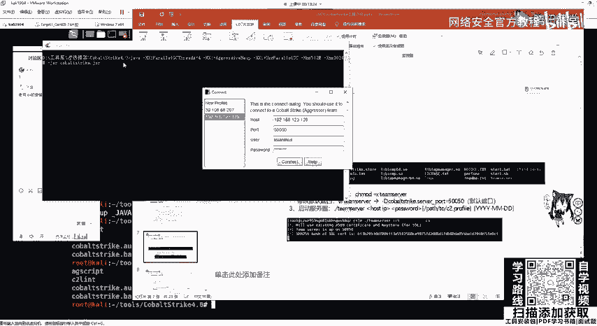

客户端程序位于Cobalt Strike文件夹中：
*   Windows系统：运行 `cobaltstrike.bat`
*   Linux系统：运行 `start.sh`

启动客户端后，会弹出连接窗口，需要填写以下信息：
*   **Host**：服务器IP地址，例如 `123.123.123.123:50050`
*   **User**：任意用户名（用于区分多个客户端）
*   **Password**：启动服务端时设置的密码

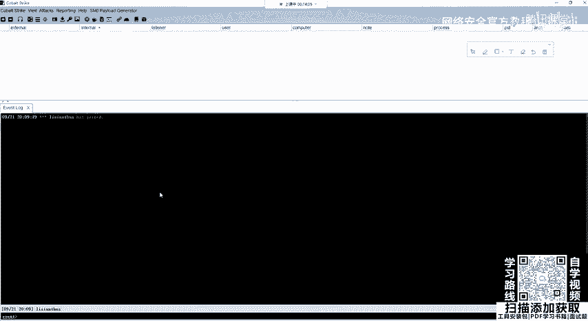

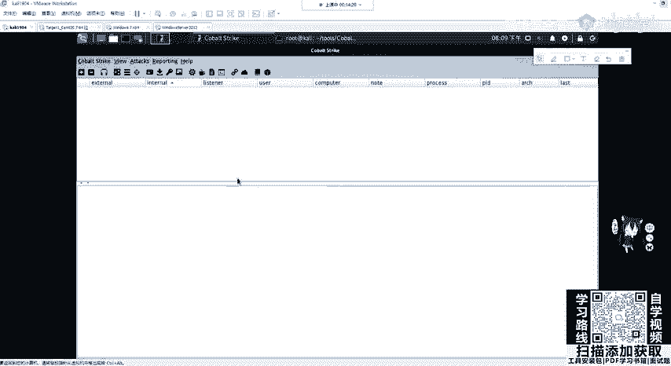

填写完毕后，点击“Connect”即可连接到团队服务器。

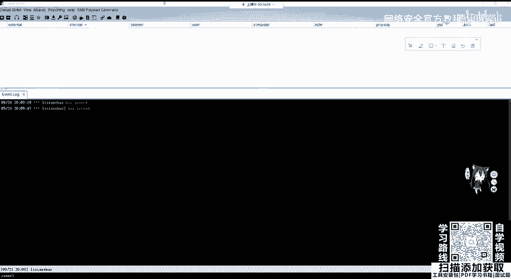

**一个客户端连接多个服务端**：
在客户端菜单栏点击 `Cobalt Strike` -> `New Connection`，即可添加并连接到新的服务端。

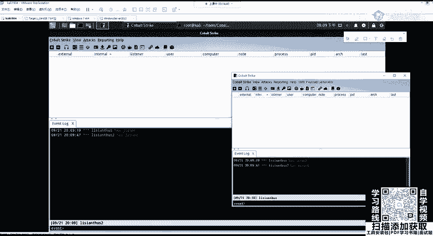

---

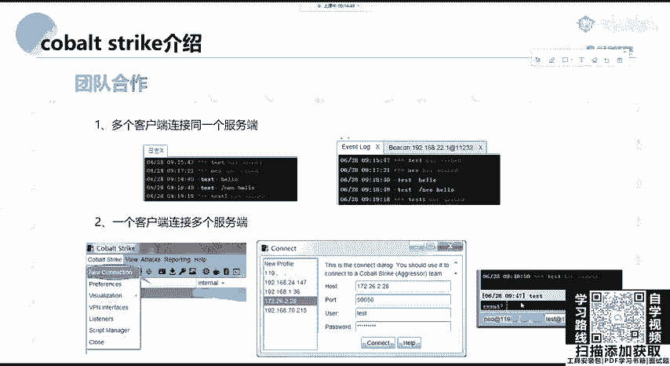

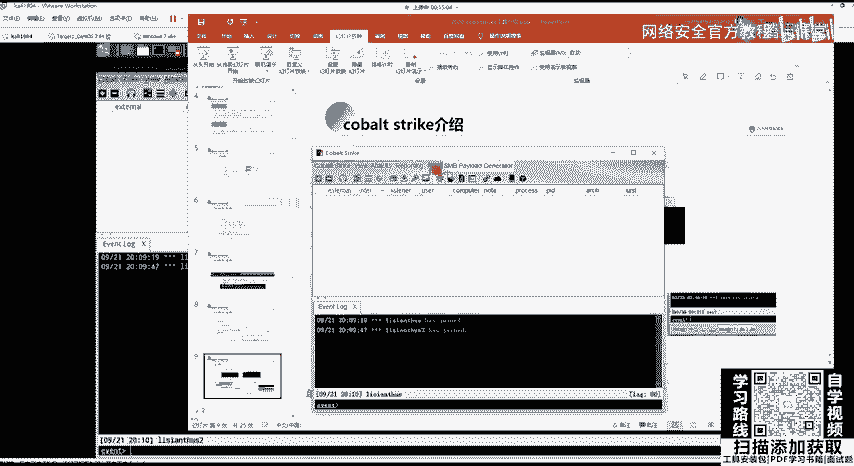

本节课中我们一起学习了Cobalt Strike的基本概念、它与Metasploit的关系、目录结构、服务端的安装启动方法以及客户端的连接方式。掌握这些是使用CS进行后续渗透测试操作的基础。