# Cobalt Strike 实战教程：P71：70. Cobalt Strike 实战演习 🎯

在本节课中，我们将学习 Cobalt Strike 的基本实战流程，包括如何通过 Web Delivery 攻击方式使靶机上线，以及如何进行内网信息收集。课程内容将涵盖从创建监听器到执行后渗透的完整步骤。

## 使用 Web Delivery 使靶机上线

上一节我们介绍了 Cobalt Strike 的基本界面，本节中我们来看看如何使用 Web Delivery 这种攻击方式。

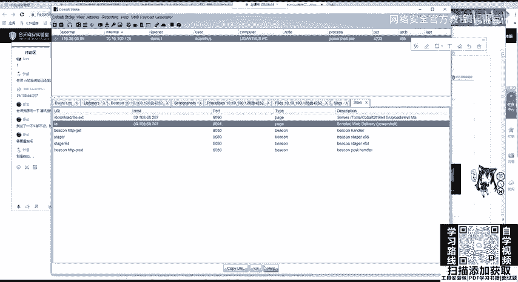

我们可以使用其他监听器或攻击模块使主机上线。例如，使用 **Scripted Web Delivery** 模块。此操作同样需要开启端口，由于 9090 端口已被占用，这里我们设置为 9091。

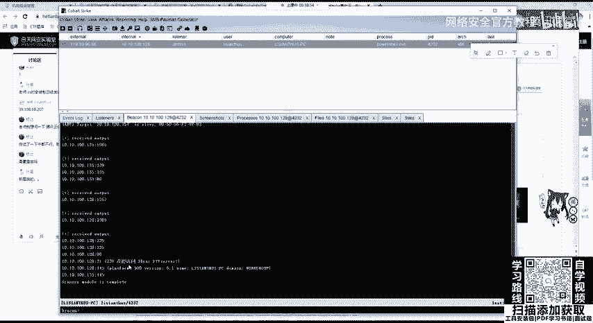

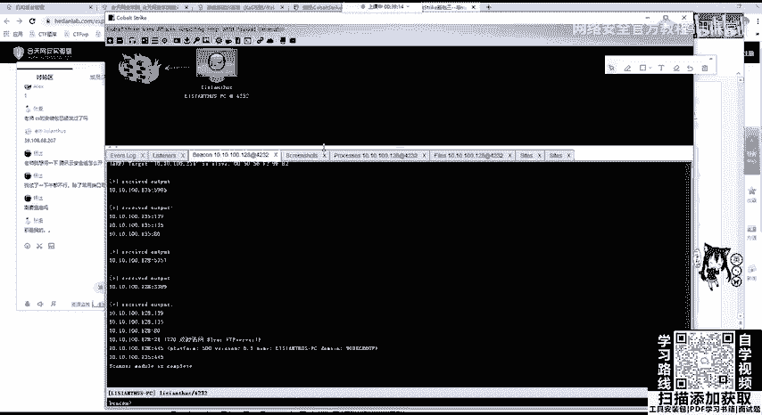

该模块也需要设置 Payload，即监听器。我们所有的操作都基于 Cobalt Strike 服务端上的监听器端口，用于发送 Stage 或其他命令。

以下是设置步骤：
1.  选择 Payload 类型。`bitsadmin` 是 Windows 操作系统自带的下载程序，`PowerShell` 和 `Python` 也是常用选项。
2.  如果选择 `PowerShell` 生成，则会生成一条对应的命令。
3.  在靶机的运行环境中执行这条命令，即可达到同样的效果，使靶机上线。

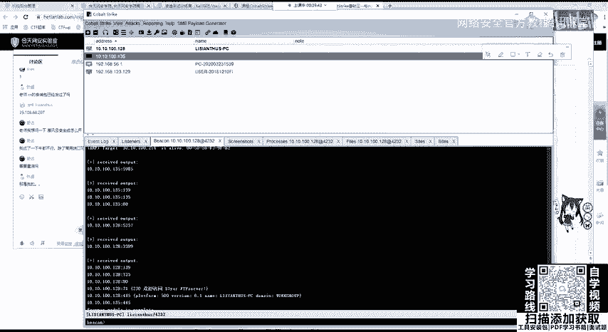

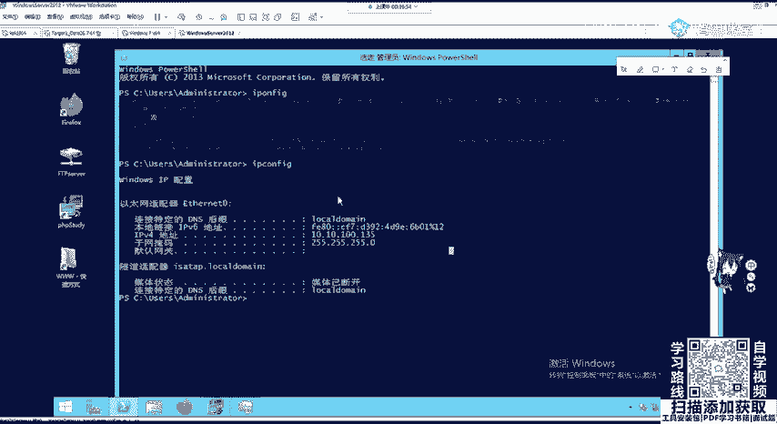

## 管理 Web 服务

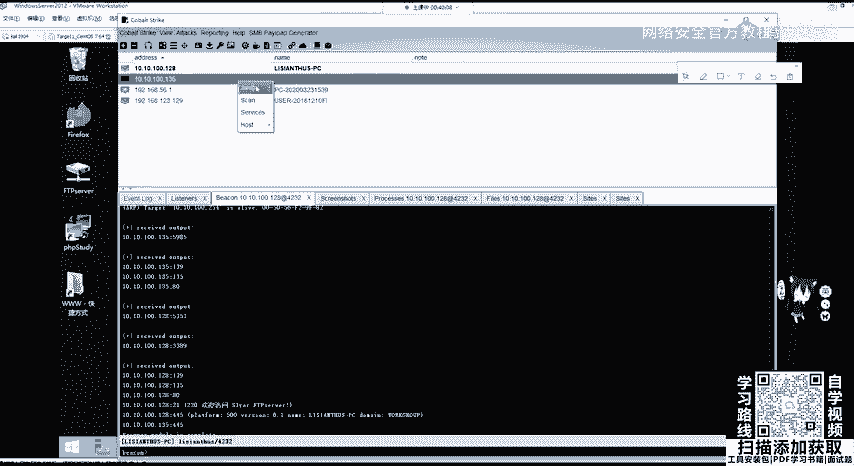

如何删除我们开启的这些服务呢？可以点击 **Manage Web Server** 或 **Attack -> Web Drive-by -> Manage**，它们会导向同一个管理页面。

在该页面中，可以看到我们开启的端口，例如 9091 端口的 PowerShell Web Delivery 服务和 9090 端口的 HTML 应用。

以下是管理操作：
*   可以点击 **Copy URL** 复制生成的攻击链接。如果在初始设置时没有复制，可以在这里进行复制。
*   如果想关闭某个服务，直接点击下方的 **X** 按钮即可将其关闭。

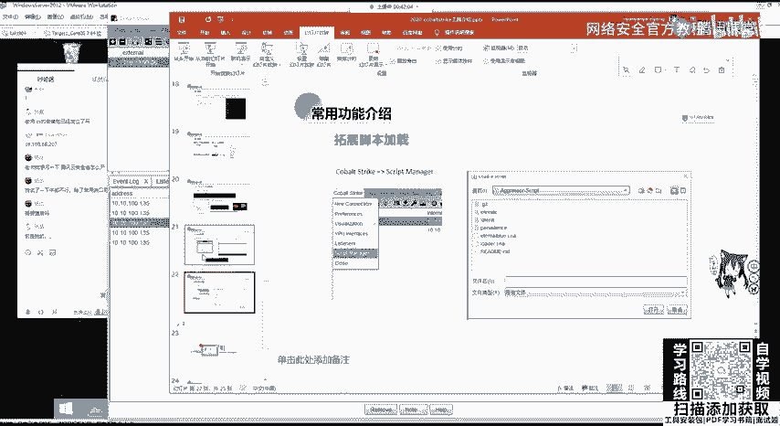

## 查看扫描结果与切换视图

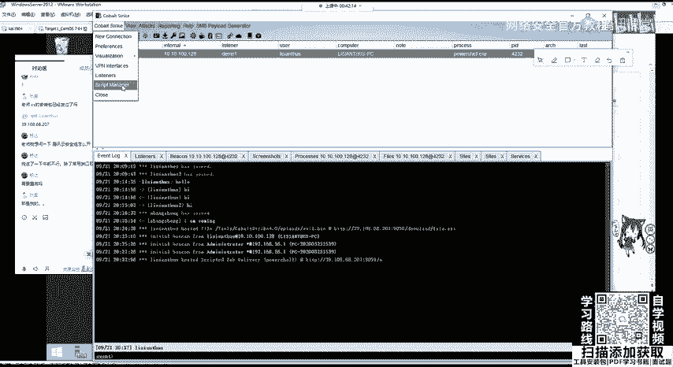

我们可以在界面下方看到端口扫描已经完成。扫描完成后，我们可以在 **View** 菜单上切换视图，或者直接使用以下三个命令：
*   `sessions`
*   `targets`
*   `table`

首先，我们看 **Sessions** 视图，这里显示了已上线的靶机会话。

第二个是 **Targets** 视图，这里列出了扫描发现的目标主机。

第三个是 **Table** 视图。可以看到发现了新的主机，例如 IP 地址为 `192.168.1.129` 的机器（即我们上线的机器）及其所在的内网地址。还发现了另一台 IP 为 `192.168.1.135` 的机器，这是一台不通外网的内网服务器（例如 Windows Server 2012）。

我们同样可以将其扫描出来。在 **Targets** 的扫描结果中，可以右键点击目标，选择 **Services** 查看其开放的服务，例如 80、135、445 等端口。根据开放的服务，可以考虑是否存在 MS17-010 或其他漏洞。

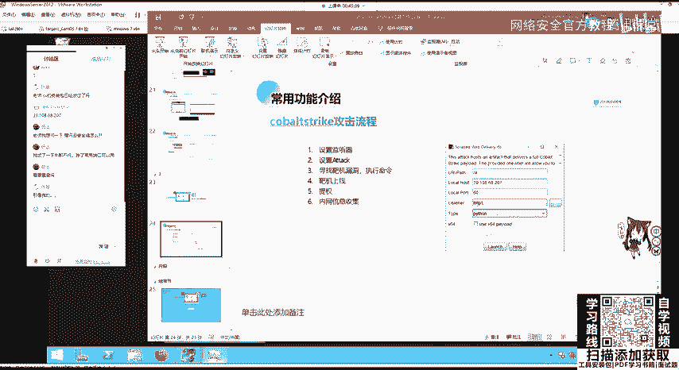

## Cobalt Strike 攻击流程概述

Cobalt Strike 的攻击流程与 Metasploit 类似，因为在其 3.0 版本之前尚未与 Metasploit 分离。其攻击流程非常简单直接。

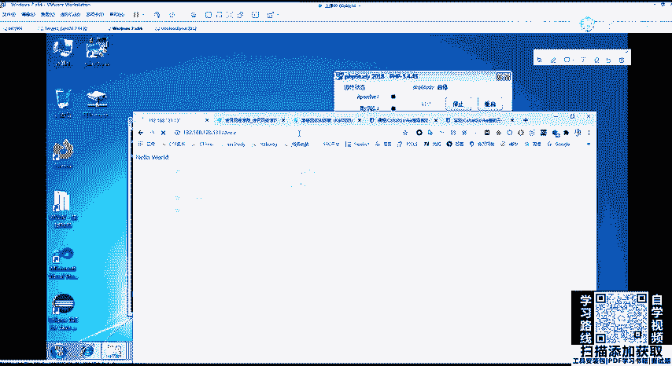

以下是标准攻击流程：
1.  **创建监听器 (Listener)**：在 Cobalt Strike 服务端设置一个监听端口，等待靶机连接。
2.  **设置攻击模块 (Attack)**：选择攻击方式，例如 `HTML Application`、`Scripted Web Delivery`、`Office` 宏等。
3.  **寻找并利用靶机漏洞执行命令**：无论使用哪种攻击方式，最终都会生成一串命令（如 PowerShell、Python 脚本或 Shellcode）。我们需要通过靶机的漏洞（如命令注入、文件上传获取 WebShell）来执行这串命令。
4.  **靶机上线**：命令成功执行后，靶机会主动连接我们的监听器，从而上线。
5.  **权限提升 (Privilege Escalation)**：初始获得的权限通常有限（如 Windows 已登录用户权限、Linux 普通用户权限）。需要进行提权，在 Windows 上目标是 `SYSTEM` 权限，在 Linux 上是 `root` 权限。
6.  **后渗透与横向移动**：获得高权限后，可以进行内网信息收集（如端口扫描、C段扫描）、配置代理，并利用诸如 `SMB Beacon` 等技术进行横向移动，扩大控制范围。

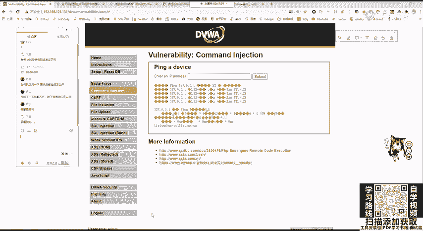

## 实战演示：通过 DVWA 命令注入上线

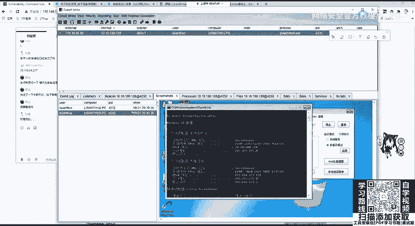

现在，我们举一个具体的例子来演示整个流程。我们仍然使用 DVWA 作为靶场环境。

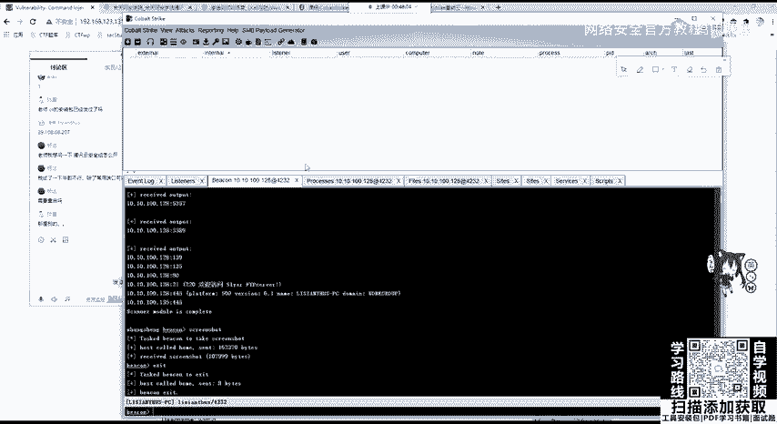

首先，访问我们的靶机 IP（例如 `192.168.123.131`）下的 DVWA 页面。DVWA 包含了 OWASP Top 10 的常见 Web 漏洞，并且可以设置难度级别（Low, Medium, High, Impossible）。

我们切换到 **Command Injection** 模块。这里，我们可以利用漏洞执行系统命令。例如，输入 `127.0.0.1 & whoami`，它会执行后面的 `whoami` 命令。

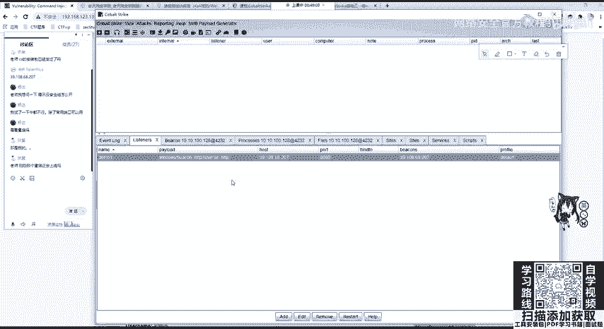

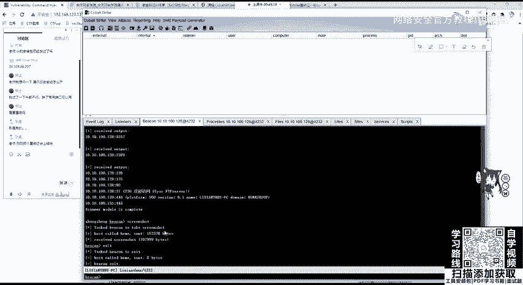

接下来，在 Cobalt Strike 中：
1.  我们已经创建好监听器。
2.  生成攻击：选择 **Attack -> Scripted Web Delivery**，选择我们的监听器，设置端口（例如 9090），并选择 `PowerShell` 作为 Payload 类型。生成后，会得到一个 URL 链接。
3.  执行命令：将生成的 PowerShell 命令复制到 DVWA 的命令注入输入框中并提交。
4.  等待上线：靶机会尝试从该 URL 下载并执行 Payload，从而连接我们的 Cobalt Strike 服务端。稍等片刻，即可看到靶机上线。

**关于进程管理**：如果想让靶机下线，可以在 Cobalt Strike 的会话列表中，先选择会话并点击 **Sleep** 使其休眠，然后再 **Remove** 移除。如果直接 `Remove`，该进程可能仍在运行并会尝试重连。

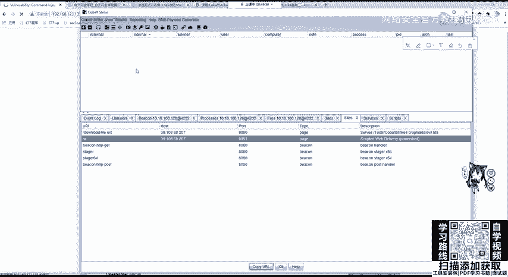

**重要提醒**：Cobalt Strike 和 Metasploit 是功能强大的渗透测试框架，集成了大量用于探测、利用和后渗透的工具。**严禁在未获得明确授权的情况下对任何系统进行测试**，否则可能触犯法律。这些工具仅应在合法的渗透测试或安全评估工作中使用。

## 扩展功能与脚本

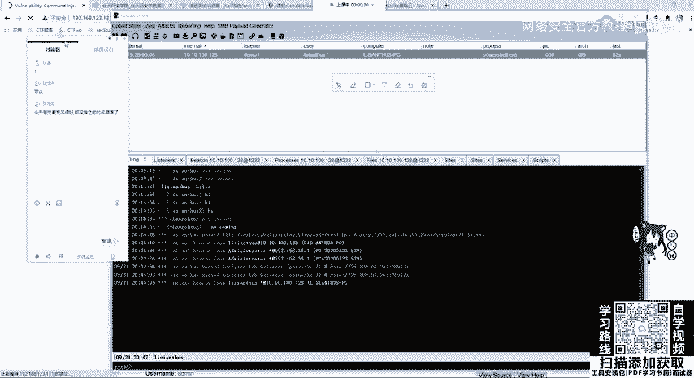

Cobalt Strike 支持通过加载第三方 `.cna` 脚本进行功能扩展。用户可以从 GitHub 等平台搜索相关脚本。

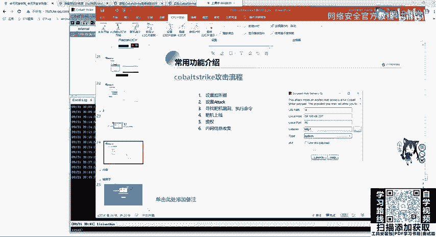

加载脚本的方法很简单：
1.  在 Cobalt Strike 客户端，点击 **Script Manager**。
2.  点击 **Load**，选择你的 `.cna` 脚本文件路径。
3.  加载成功后，在 **Scripts** 列表的 **Ready** 列会显示对勾。

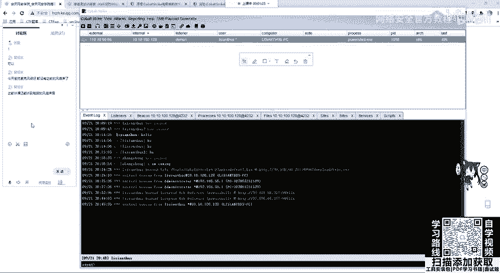

## 总结

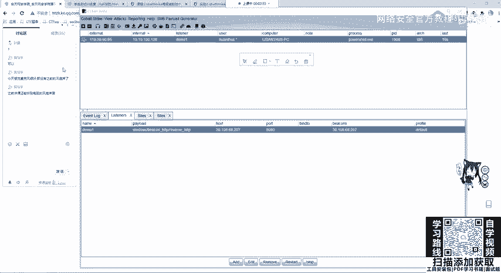

本节课中，我们一起学习了 Cobalt Strike 的实战应用。我们掌握了通过 **Scripted Web Delivery** 方式使靶机上线的完整流程，包括设置监听器、生成攻击载荷、利用 Web 漏洞执行命令。我们还学习了如何管理 Web 服务、查看扫描结果和切换视图，并对 Cobalt Strike 标准的攻击流程（监听器 -> 攻击模块 -> 漏洞利用 -> 上线 -> 提权 -> 横向移动）有了清晰的认识。最后，我们通过 DVWA 的命令注入漏洞完成了一次完整的实战演示。请务必牢记，所有操作必须在合法授权的环境下进行。