# 网络安全教程：P72：Cobalt Strike攻击流程详解 🛡️

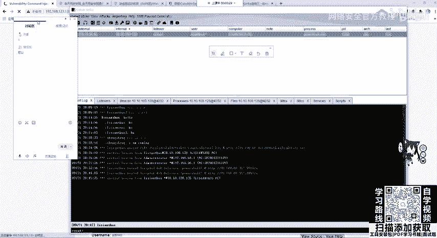

在本节课中，我们将详细学习Cobalt Strike（CS）的完整攻击流程，包括靶机上线、权限提升、凭证获取等核心操作。课程内容将确保初学者能够理解并掌握每一步的关键概念。

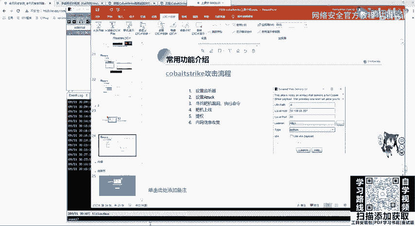

---

## 靶机上线与权限确认

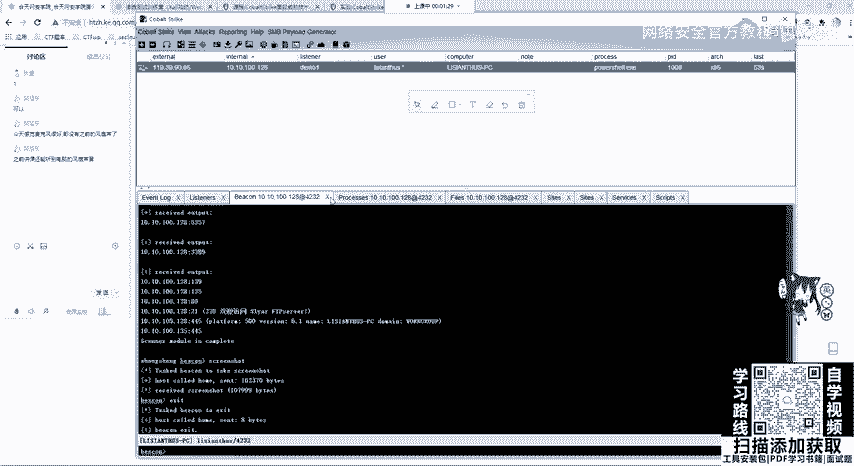

上一节我们介绍了如何设置监听器，本节中我们来看看如何确认靶机已成功上线并获取初始权限。

当靶机成功执行我们的载荷后，它就会连接到Cobalt Strike服务器并上线。此时，我们获得的是一个普通用户权限。可以通过交互式Shell来验证这一点。

*   首先，设置`sleep`时间为2秒，以加快响应速度（默认60秒较慢）。
*   在Cobalt Strike的Beacon控制台中，输入命令`shell whoami`来查看当前用户身份。注意，执行系统命令需要在前面加上`shell`关键字。

**示例命令：**
```shell
sleep 2
shell whoami
```
执行后，如果显示的是普通用户名（例如`user`或`administrator`），则表明我们当前是低权限用户。

---

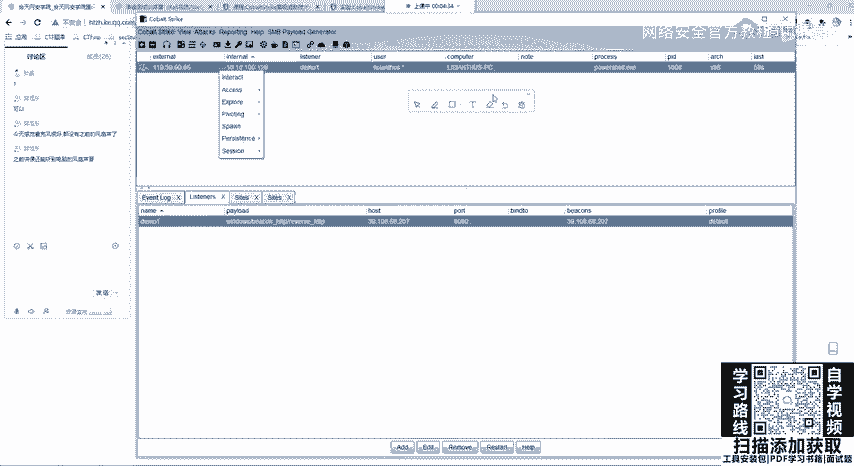

## 权限提升（提权）

拿到低权限后，下一步目标就是提升到系统最高权限（`SYSTEM`）。

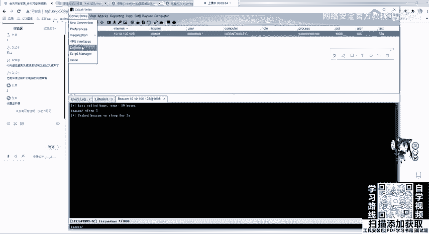

以下是提权操作步骤：

1.  **选择监听器**：在Cobalt Strike的菜单中，点击 `Attacks` -> `Scripted Web Delivery`（或利用其他提权模块），但核心是选择我们之前创建的监听器（例如`demo1`）。
2.  **选择攻击脚本**：在弹出的界面中，`Choose`我们需要使用的攻击脚本。例如，可以选择`MS16-135`漏洞利用脚本。Cobalt Strike内置了一些脚本，也可以通过加载第三方插件进行拓展。
3.  **执行攻击**：点击`Launch`，Cobalt Strike会自动将选定的攻击脚本发送到目标靶机并执行。

如果提权成功，Cobalt Strike界面会提示`success`，并且会上线一个新的Beacon会话。这个新会话的用户会显示为`SYSTEM`，表明我们已获得最高权限。

**关键点**：每个Beacon会话（Session）都需要单独设置`sleep`时间。请务必为新获得的`SYSTEM`权限会话也设置`sleep 2`。

---

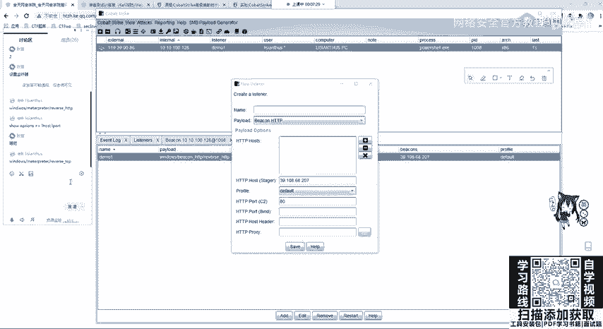

## 凭证获取与横向移动

在获得`SYSTEM`权限后，我们就可以执行更高级的操作，例如获取系统凭证和进行横向移动。

我们可以运行以下命令来获取密码哈希或明文密码：

*   **哈希抓取**：使用`hashdump`命令。该命令会从NTDS.dit数据库或本地SAM中读取用户的密码哈希值。
    ```shell
    hashdump
    ```
*   **明文密码抓取**：使用`mimikatz`模块。在Beacon中输入`logonpasswords`命令，它会尝试从系统内存中读取登录凭证（包括明文密码）。
    ```shell
    logonpasswords
    ```

执行`logonpasswords`后，如果成功，结果中会显示用户名和对应的密码（例如`123456`）。获取到的凭证可以用于访问其他网络资源或进行横向移动（例如使用`psexec`或`smbexec`）。

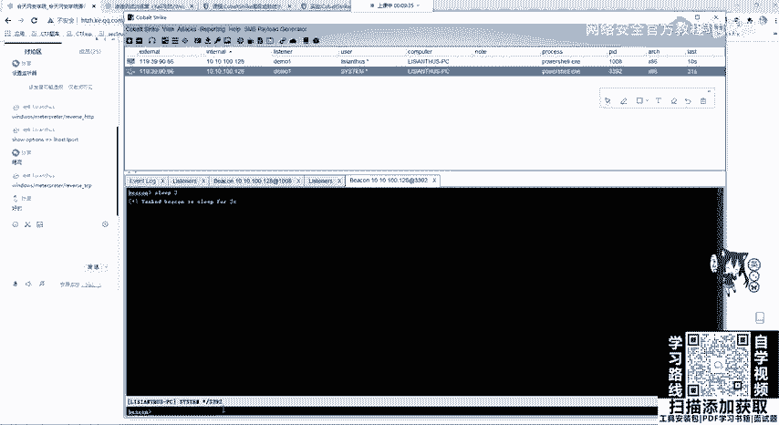

**注意**：如果目标系统的`Admin$`共享被关闭，某些横向移动方法可能会失败。此时，可以考虑使用进程迁移（Process Migration）等技术，将Beacon会话迁移到其他稳定进程（如`explorer.exe`）中，也可以与Metasploit（MSF）进行联动来实现。

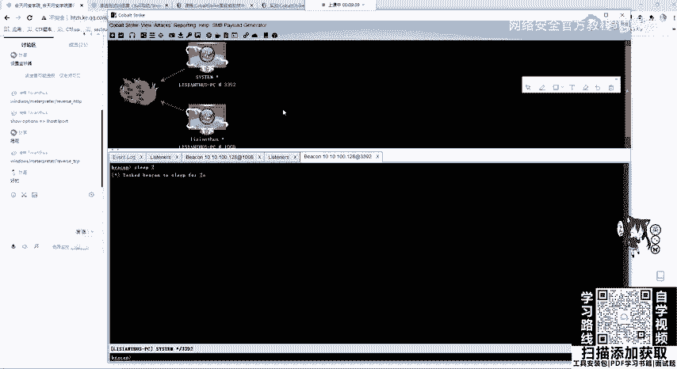

---

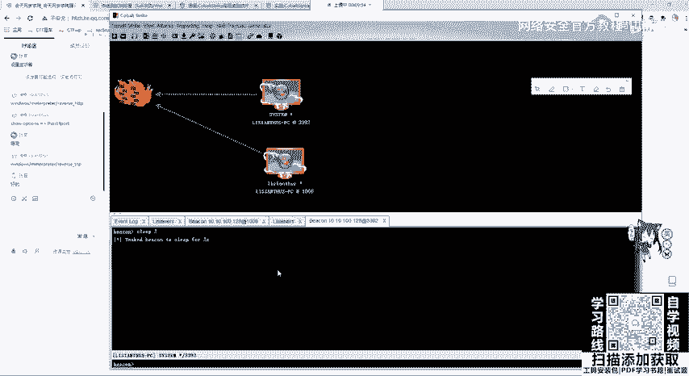

## 与Metasploit（MSF）联动

Cobalt Strike可以与Metasploit框架联动，从而利用MSF更丰富的漏洞利用模块和后渗透功能。

联动的基本思路是：将Cobalt Strike的Beacon会话“传递”给Metasploit，然后在MSF中操作。具体操作通常涉及以下步骤：

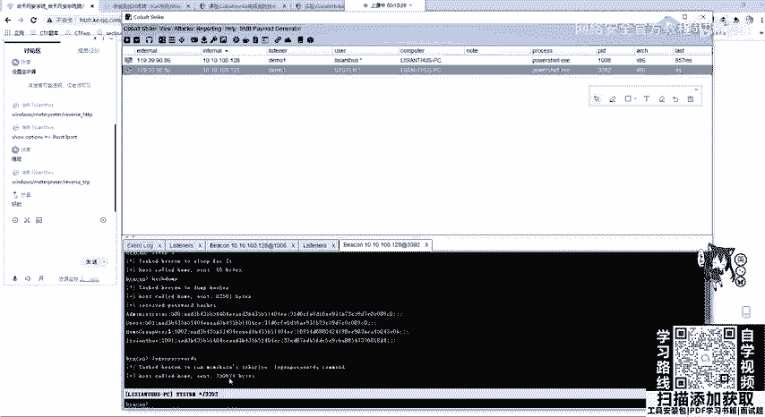

1.  在Cobalt Strike中，通过`Foreign HTTP`或`SMB Beacon`等方式，配置一个指向MSF监听地址和端口的“外部监听器”。
2.  在Metasploit中，设置对应的`exploit/multi/handler`监听。
3.  在已上线的Beacon中，通过`spawn`命令派生一个连接到MSF监听器的新的Payload进程。

这样，一个新的Meterpreter会话就会在Metasploit中上线，之后就可以使用MSF的全部功能进行后续渗透测试。

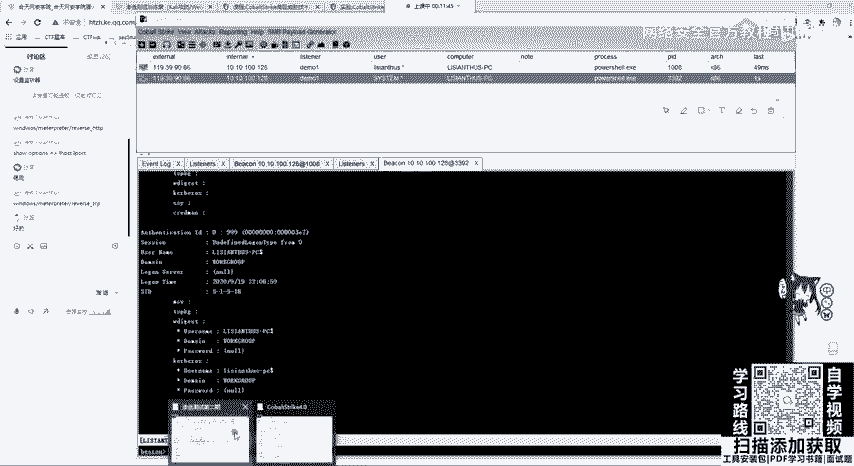

---

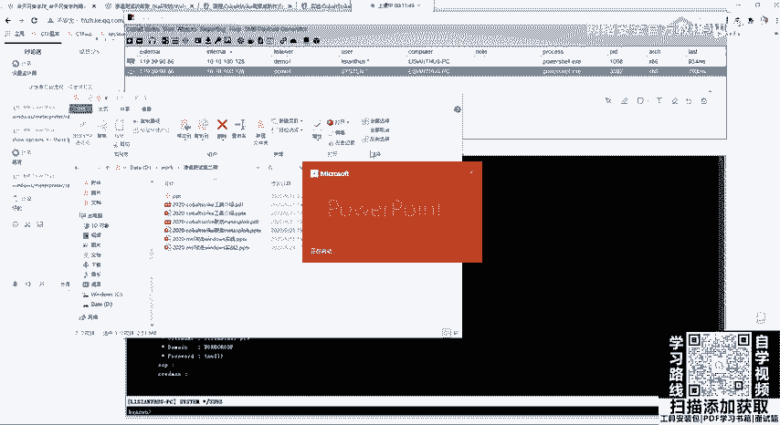

本节课中我们一起学习了Cobalt Strike从靶机上线、权限提升到凭证获取的完整攻击流程。我们明确了如何确认权限、使用内置或扩展脚本进行提权、以及获取系统凭证的方法。最后，还了解了Cobalt Strike与Metasploit联动的基本概念。掌握这些步骤是进行内网渗透测试的基础。