# 网络安全教程：P73：CS联动MSF之Socks代理 🚀

在本节课中，我们将学习如何利用Cobalt Strike（CS）与Metasploit Framework（MSF）进行联动，重点掌握通过Socks代理实现内网穿透的技术。我们将从环境搭建开始，逐步讲解代理的配置与使用方法。

## 环境拓扑介绍

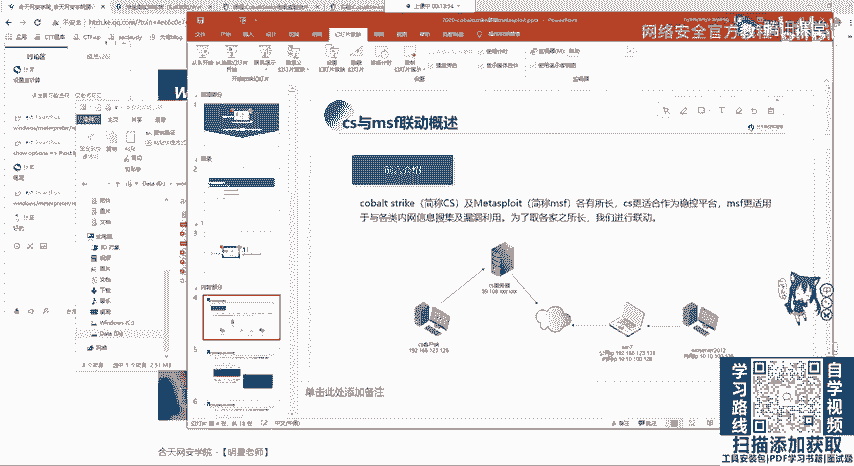

上一节我们介绍了联动的基本概念，本节中我们来看看具体的实验环境。为了清晰地演示，我们搭建了以下网络拓扑。

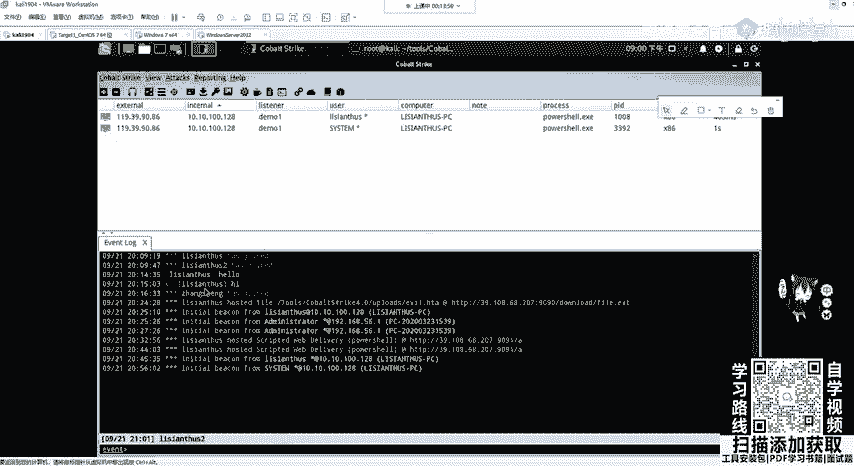

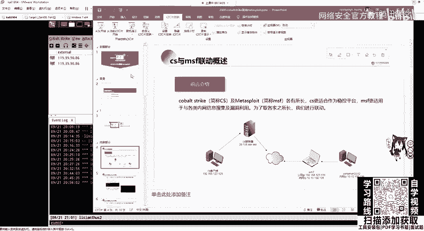

以下是实验环境中的关键节点及其IP地址：

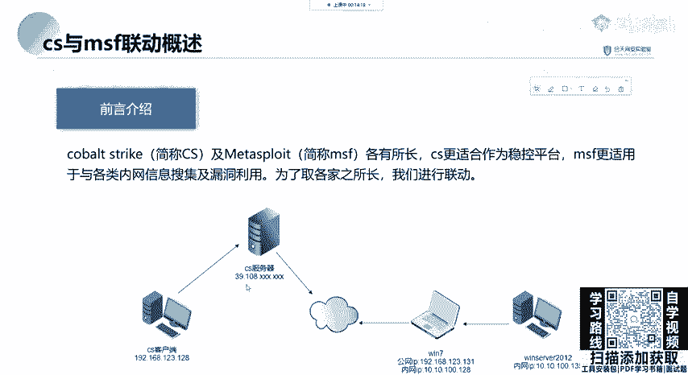

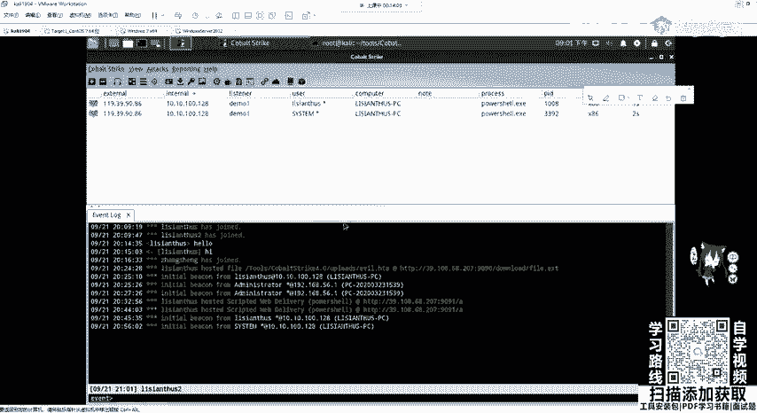

*   **CS客户端**：运行在Windows和Kali系统上，用户分别为`CS1`和`ZCN2`。其IP地址为`192.168.123.128`。
*   **CS服务器**：部署在公网VPS上，IP地址为`39.108.x.x`。CS客户端将连接至此服务器。
*   **靶机1 (Windows 7)**：配置了双网卡。
    *   网卡1（NAT）：IP为`192.168.131.x`，可访问互联网。
    *   网卡2（内网）：IP为`10.10.100.128`，处于内网中。
*   **靶机2 (内网机器)**：IP为`10.10.100.135`，仅能通过内网访问，无法从外网直接连接。

这个拓扑的核心挑战在于，我们的CS客户端和服务器都无法直接访问位于`10.10.100.0/24`网段的内网机器。

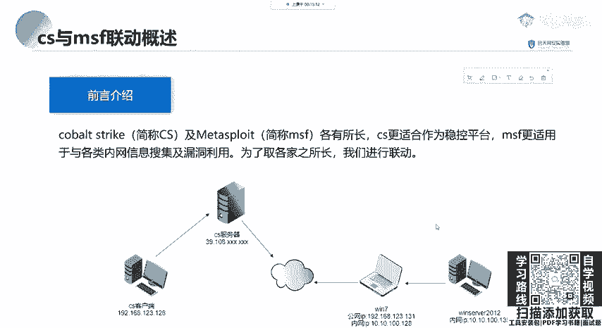

## 开启Socks代理服务

了解了环境后，我们来看看如何在CS中开启Socks代理。Socks代理是一种网络协议，用于穿透防火墙，使我们能够访问原本无法直接连接的内网或服务器。

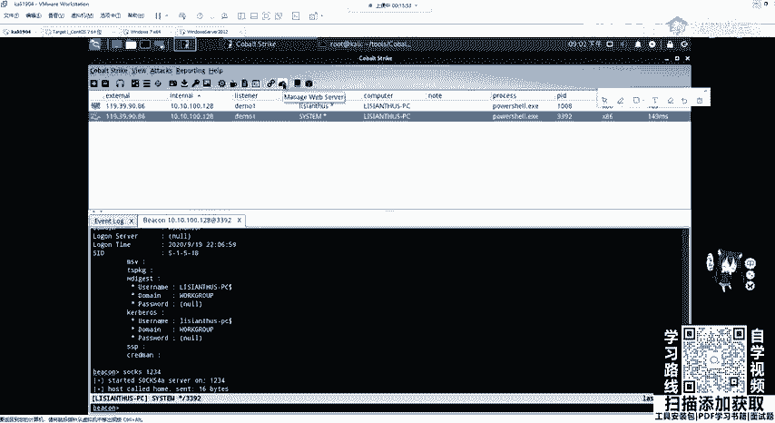

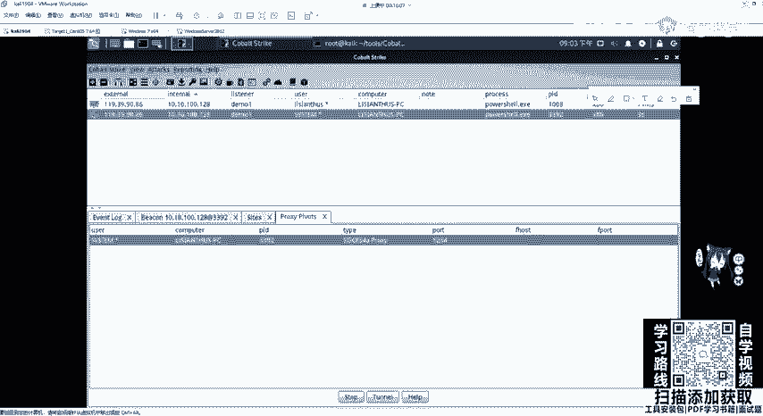

在CS的Beacon控制台中，使用`socks`命令即可开启代理服务。命令格式为：

```bash
socks [端口号]
```

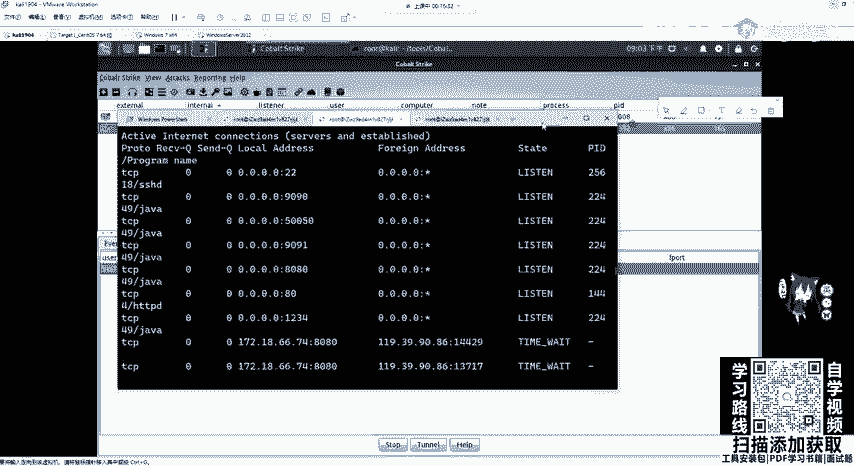

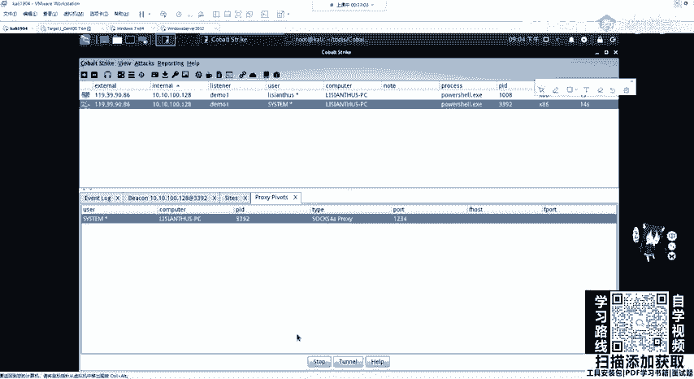

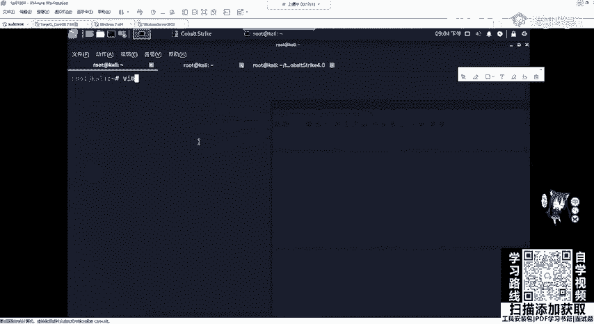

例如，执行`socks 1234`将在CS服务器上开启一个监听在1234端口的Socks4a代理服务。我们可以在CS客户端的`View -> Proxy Pivots`中查看已开启的代理。

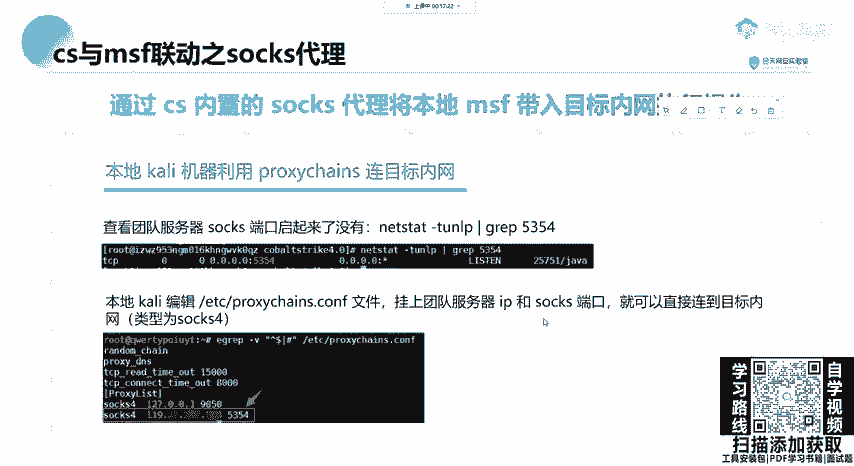

## 配置与使用代理

代理服务开启后，我们需要在攻击机上进行配置才能使用。一个常用的工具是`proxychains`，它可以强制任何TCP连接通过指定的代理。

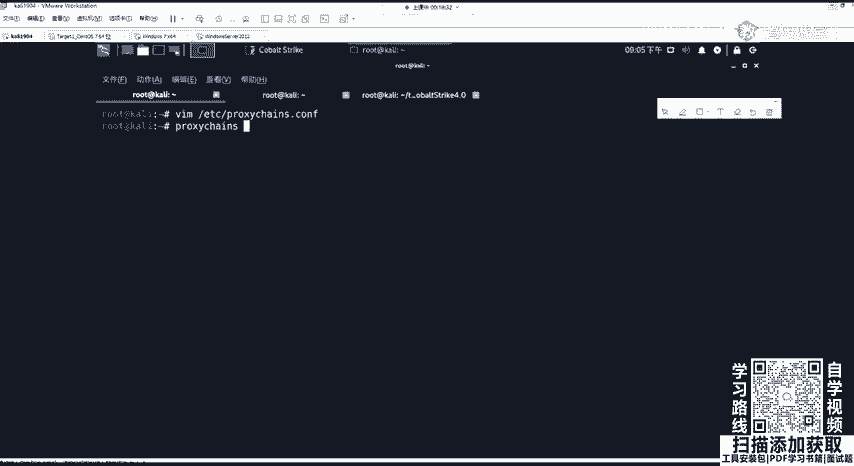

以下是配置`proxychains`的步骤：

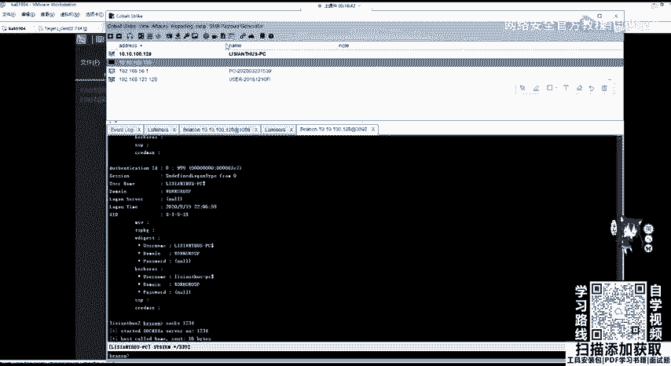

1.  编辑配置文件：`vim /etc/proxychains.conf`
2.  在文件末尾的`[ProxyList]`部分，添加代理服务器信息。例如：
    ```
    socks4 39.108.x.x 1234
    ```
3.  保存并退出。

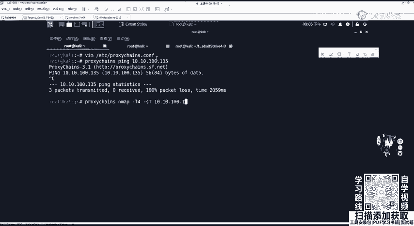

配置完成后，在需要走代理的命令前加上`proxychains`即可。例如，要扫描内网机器`10.10.100.135`的端口，由于Socks代理工作在TCP层，不支持ICMP协议，因此需要使用`-Pn`参数跳过Ping检测：

```bash
proxychains nmap -sT -Pn 10.10.100.135 -p 22,80,135,445,443,3306,3389
```

请注意，通过代理进行扫描速度会显著变慢，因为流量需要经过复杂的路径转发。

## 在MSF中配置全局代理

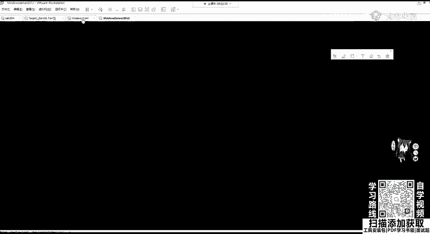

`proxychains`需要为每个命令单独指定代理。如果想更方便地让整个MSF框架的流量都走代理，可以直接在MSF中设置。

首先，在CS中，进入`View -> Proxy Pivots`，找到对应的代理配置，点击`Tunnel`按钮，会生成一段`setg`命令。复制这段命令，在MSF控制台中执行，即可为MSF设置全局代理。

之后，在MSF中使用任何扫描或攻击模块，其流量都会通过CS的Socks代理发出。例如，可以设置SMB扫描模块的目标为内网地址进行探测：

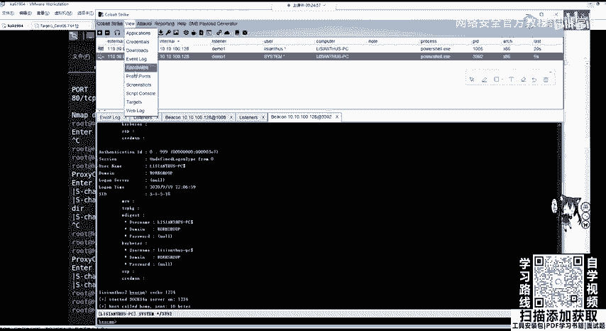

```bash
use auxiliary/scanner/smb/smb_ms17_010
set RHOSTS 10.10.100.135
run
```

## CS与MSF模块联动

CS和MSF各有优势。CS更适合作为稳定的团队协作与内网横向移动控制平台，而MSF则拥有极其丰富的辅助、攻击和编码模块。

我们可以利用CS建立的Socks代理通道，将MSF“带入”内网，从而结合两者的长处。具体方法是：在CS上线的目标主机上，通过`spawn`或`jump`命令派生一个MSF的Meterpreter会话。这样，MSF的会话就会通过CS的通道与攻击者通信，从而利用MSF的强大模块对内网进行深度渗透测试。

## 总结

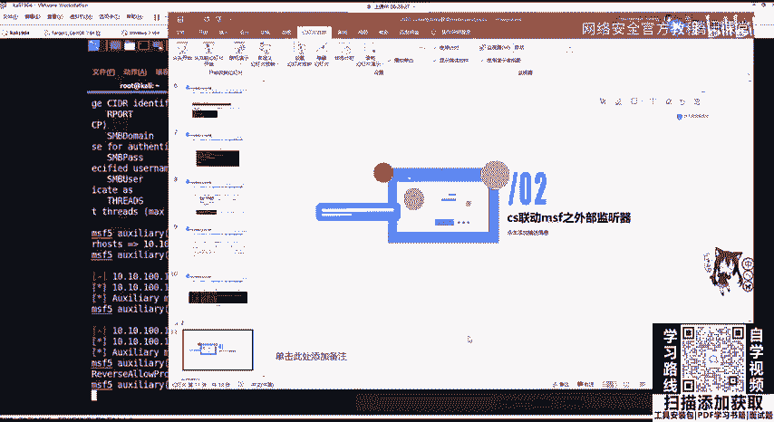

本节课中我们一起学习了CS与MSF联动中Socks代理的核心用法。我们首先搭建了实验环境，理解了网络隔离的场景。然后，我们学会了在CS中开启Socks代理服务，并使用`proxychains`工具或直接在MSF中配置全局代理，使攻击流量能够穿透到内网。最后，我们探讨了结合两者优势进行内网渗透的思路。掌握Socks代理是内网渗透测试中至关重要的一步，它为后续的信息收集和横向移动奠定了基础。