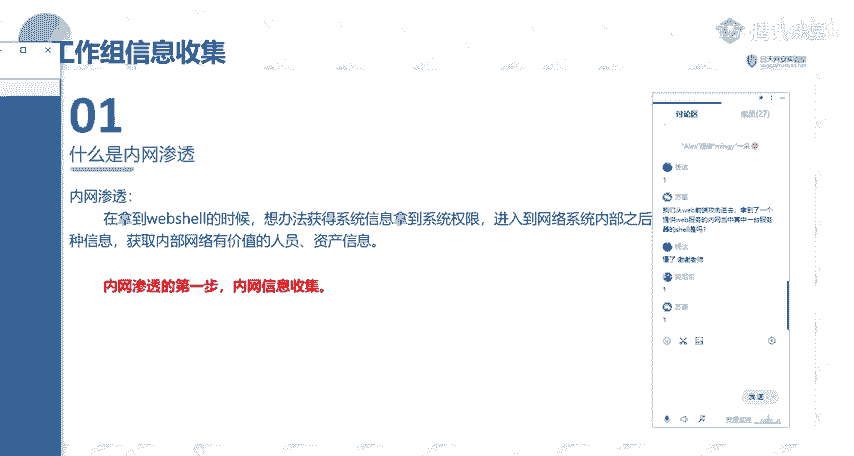
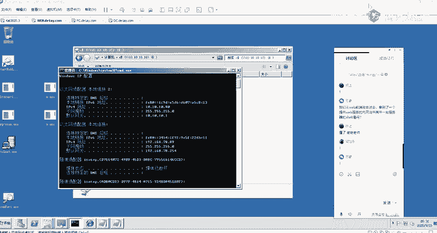
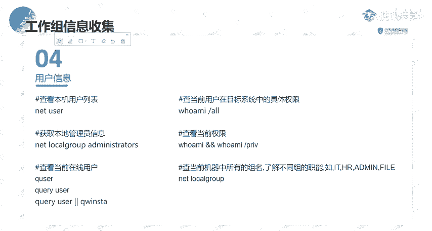
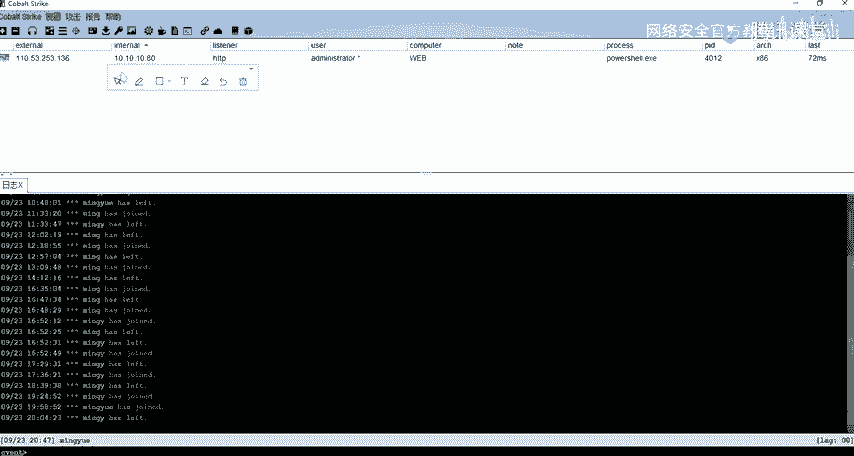
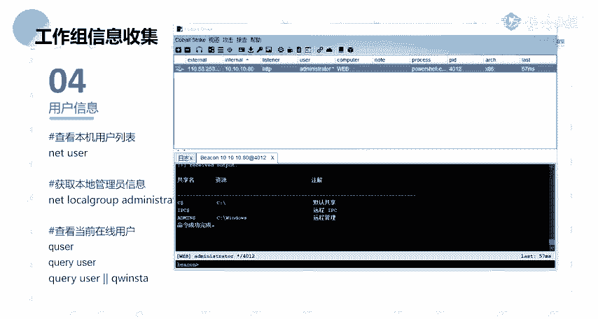
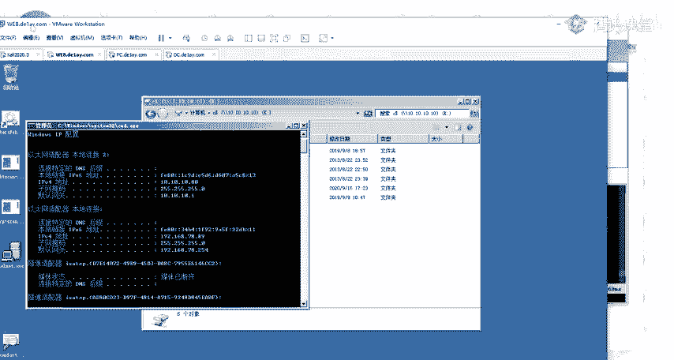
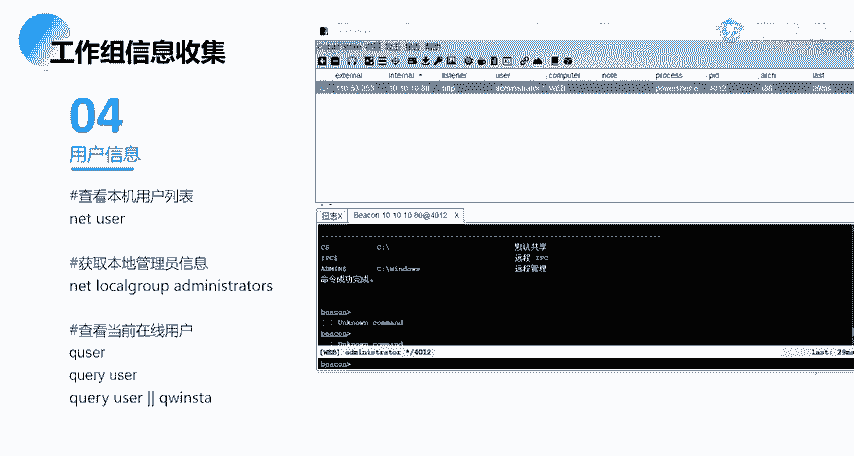
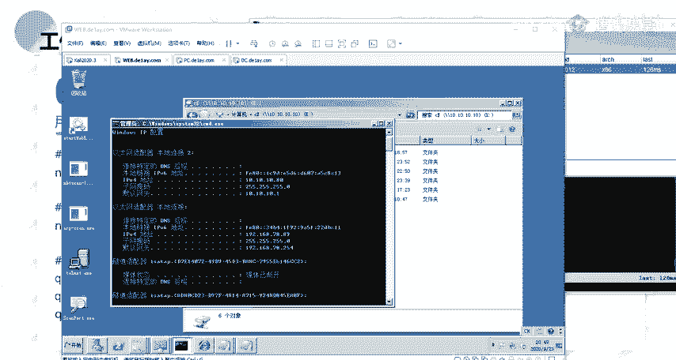
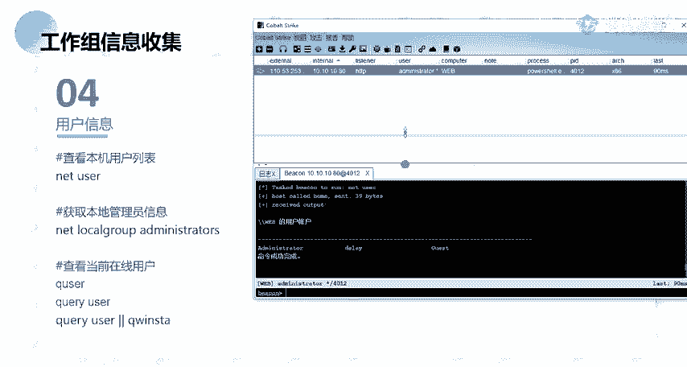

# 网络安全教程：P76：Windows基础信息收集、本机进程信息


## 概述
在本节课中，我们将学习Windows主机的基础信息收集方法。这是内网渗透的第一步，目标是了解目标主机的网络环境、系统配置和用户信息，为后续的横向移动和权限提升打下基础。

---

## 内网环境分析
上一节我们概述了信息收集的重要性，本节中我们来看看如何分析内网环境。这有助于我们理解目标网络的结构和潜在的攻击路径。

内网环境分析主要包括以下几个方面：

1.  **基础环境判断**：包括IP地址、网关、DNS、网络连接状态、本机hosts文件、代理设置以及判断主机是否在域内。
2.  **分析机器所处区域**：判断主机位于DMZ区、办公区、生产区还是核心数据库区等。
3.  **分析机器角色**：判断主机是Web服务器、开发服务器、文件服务器、代理服务器还是数据库服务器等。
4.  **分析进出口流量**：测试主机能否访问外网，以及哪些协议和端口可以出网。

以下是判断网络连通性的常用方法：

*   **TCP协议**：使用 `nc` 命令连接公网IP的指定端口。
    ```bash
    nc -zv <公网IP> <端口号>
    ```
*   **HTTP协议**：尝试访问外网Web服务。
*   **ICMP协议**：使用 `ping` 命令测试，并在公网服务器上用 `tcpdump` 抓包验证。
    ```bash
    # 目标主机执行
    ping <公网IP>
    # 公网服务器执行
    tcpdump -i eth0 icmp
    ```
*   **DNS协议**：使用 `nslookup` 或 `dig` 查询外网域名，并在公网服务器监听53端口。
    ```bash
    # Windows
    nslookup example.com
    # Linux
    dig example.com
    # 公网服务器监听
    nc -lup 53
    ```

---



## 工作组信息收集
了解了内网环境后，我们需要收集更具体的信息。首先从工作组模式开始。工作组是一种简单的对等网络管理模式，所有计算机默认处于名为 `WORKGROUP` 的组中。



在工作组环境中，信息收集的核心是发现网络中的其他主机和共享资源。以下是关键步骤：

1.  **内网网段信息收集**：为纵向渗透（跨网段）做准备。可以通过扫描、检查文件共享记录、浏览器历史、远程桌面连接记录以及分析路由器/交换机配置来发现不同网段。
2.  **本机信息收集**：获取当前主机的详细配置。

以下是常用的本机信息收集命令：

*   **查看系统信息**：
    ```cmd
    systeminfo
    ```
*   **查看网络配置**：
    ```cmd
    ipconfig /all
    ```
*   **查看ARP缓存**：
    ```cmd
    arp -a
    ```
*   **查看路由表**：
    ```cmd
    route print
    ```
*   **查看当前用户**：
    ```cmd
    whoami
    ```
*   **查看所有用户**：
    ```cmd
    net user
    ```
*   **查看本地管理员组**：
    ```cmd
    net localgroup administrators
    ```
*   **查看进程列表**：
    ```cmd
    tasklist
    ```
*   **查看服务列表**：
    ```cmd
    net start
    ```
*   **查看计划任务**：
    ```cmd
    schtasks /query /fo LIST /v
    ```
*   **查看安装的软件**：
    ```cmd
    wmic product get name,version
    ```
*   **查看端口连接**：
    ```cmd
    netstat -ano
    ```
*   **查看共享列表**：
    ```cmd
    net share
    ```
*   **查看会话信息**：
    ```cmd
    net session
    ```
*   **查看补丁列表**：
    ```cmd
    wmic qfe get Caption,Description,HotFixID,InstalledOn
    ```



---













## 总结
本节课我们一起学习了Windows基础信息收集的核心内容。我们首先了解了内网环境分析的重要性及方法，然后重点介绍了在工作组模式下如何进行本机信息收集，并列举了大量实用的命令。掌握这些信息是进行内网渗透测试的基础，能够帮助我们发现潜在的攻击点和薄弱环节。下一节，我们将深入探讨域环境下的信息收集技术。