# 网络安全教程：P85：84. 第三十四天：Metasploit Socks代理

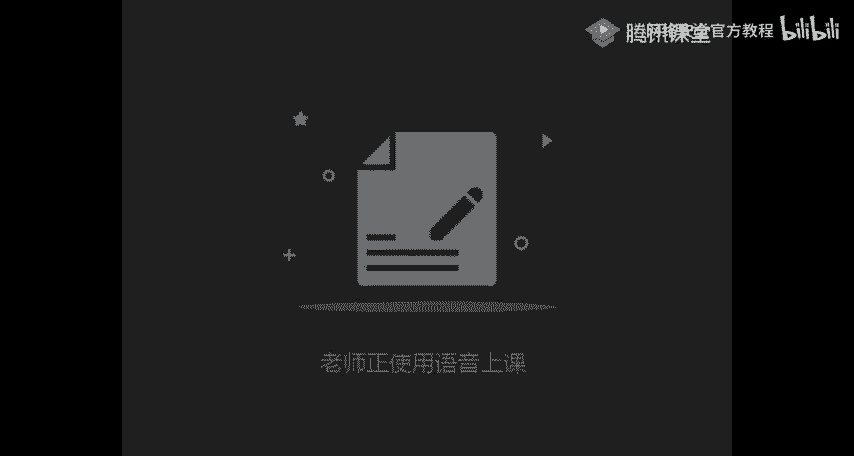

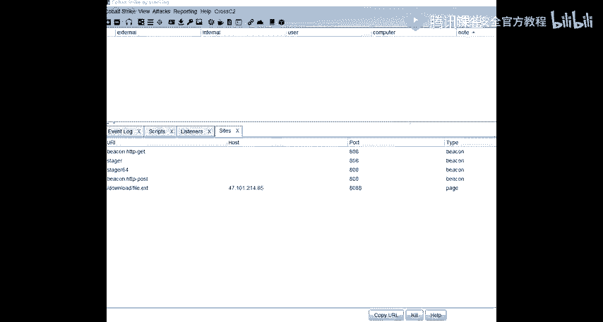

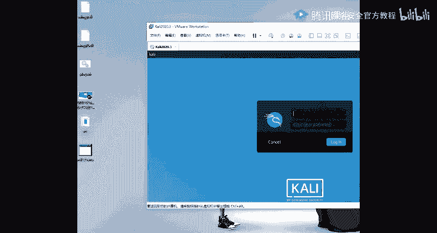

在本节课中，我们将要学习Socks代理的基本概念、常用工具，并通过一个靶场实战演示如何利用Metasploit建立Socks代理通道进行内网穿透。

## 第一部分：Socks代理简介

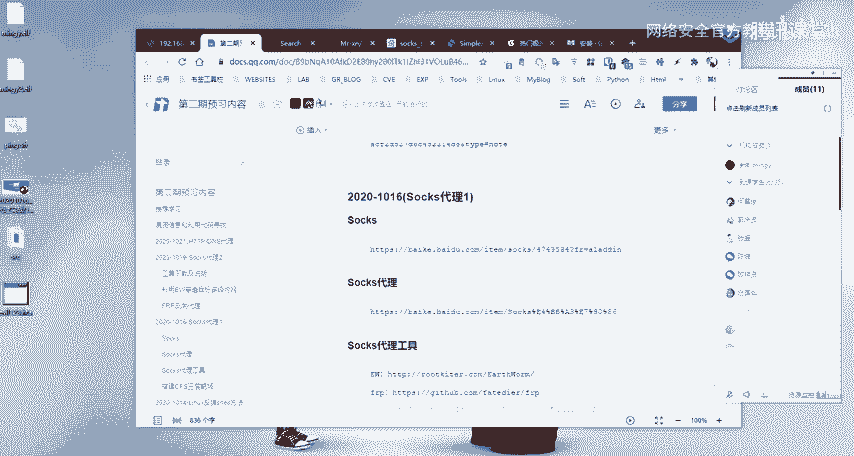

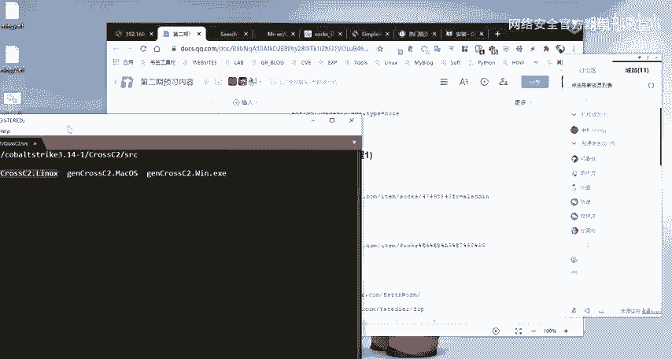

上一节我们介绍了内网穿透的重要性，本节中我们来看看实现内网穿透的一种核心方法——Socks代理。

Socks是一种网络传输协议，主要用于在客户端与外网服务器之间进行通信的中间传递。它充当了客户端（通常位于内网）与外网服务器之间的数据传输通道。

根据OSI或TCP/IP网络模型，Socks会话协议位于表示层与传输层之间。它使用TCP协议来传输数据。

需要注意的一点是，Socks协议不提供传递ICMP信息这类网络层网关服务。ICMP协议（例如我们常用的`ping`命令）位于网络层，而Socks协议工作在会话层并通过TCP/IP传输数据。因此，通过Socks通道无法使用`ping`命令来探测内网其他主机的存活状态。

### 为何使用Socks代理？

在现代网络架构中，内部网络与外部网络之间通常存在隔离设备，如防火墙。这些防火墙系统通常以应用层网关的形式工作，可以控制对Telnet、FTP、SMTP等协议的访问。Socks协议提供了一个框架，使得这些受限制的协议能够安全、透明地穿过防火墙。

### Socks版本区别

以下是Socks4与Socks5两个版本的主要特点与区别：

*   **Socks4**： 它是HTTP代理协议的加强，不仅代理HTTP协议，而且代理所有向外的连接。它没有身份验证功能。
*   **Socks5**： 它对Socks4进行了扩展，增加了对UDP代理和身份验证的支持。Socks5采用了地址解析方案，支持域名和IPv6地址的解析。

### 使用Socks代理须知

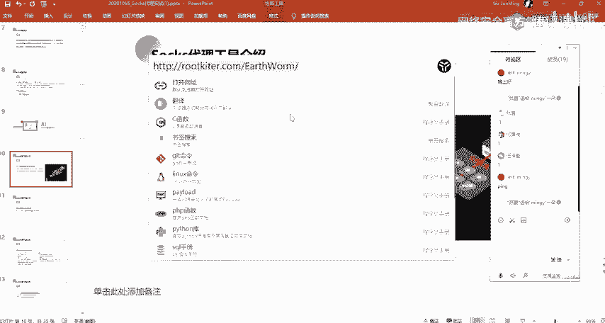

在使用Socks代理时，需要了解以下三点信息：

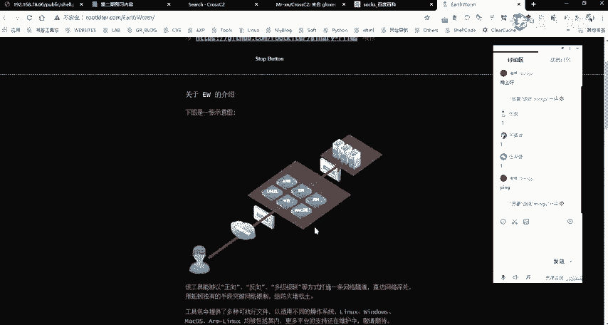

1.  **Socks服务器的IP地址**： 即代理服务器的位置。
2.  **Socks服务器的端口**： 通常默认端口是`1080`。
3.  **是否需要身份验证**： Socks5支持身份验证，可能需要提供用户名和密码。

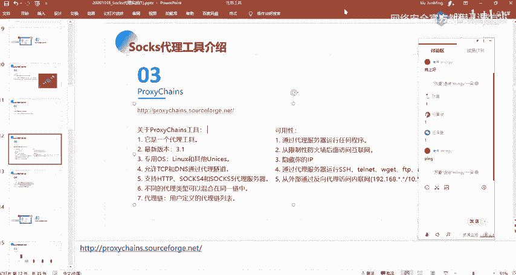

## 第二部分：Socks代理工具

上一节我们了解了Socks代理的基本原理，本节中我们来看看实现Socks代理的一些常用工具。

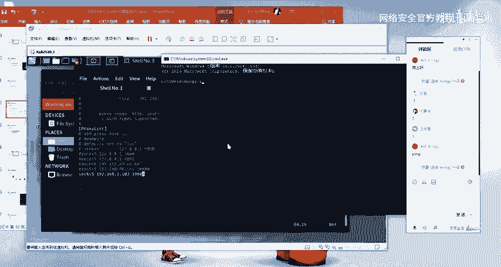

以下是几种常见的Socks代理工具简介：

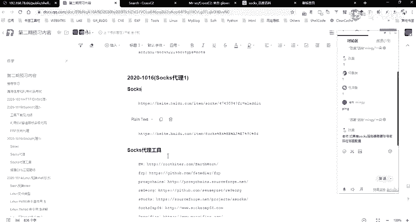

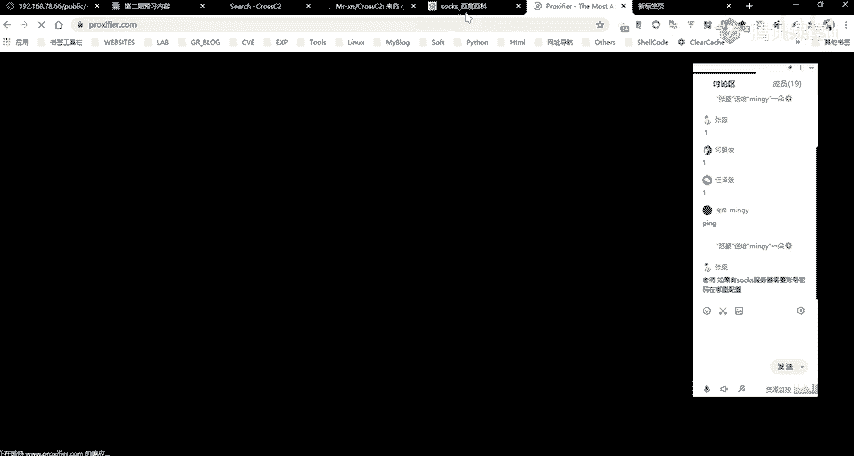

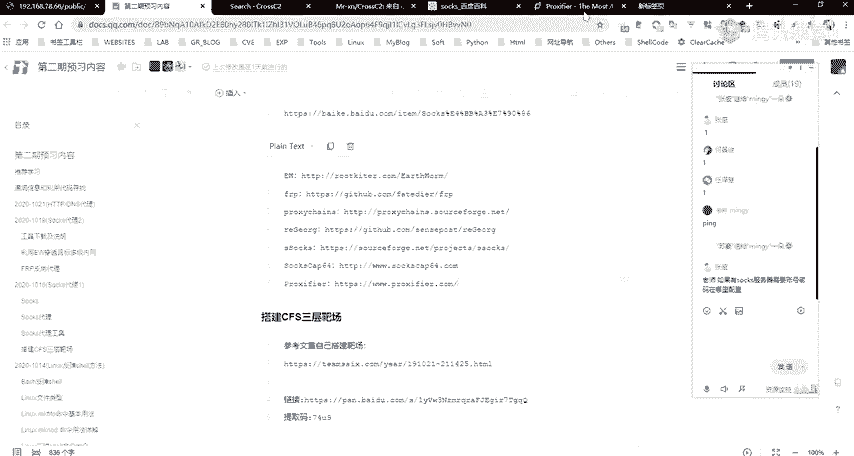

*   **EarthWorm (EW)**： 这是一款便携式的网络穿透工具，功能强大。其主要作用就是进行内网穿透，具备Socks5服务架设和端口转发功能。该工具已停止更新，但相关工具包中可能包含。
*   **FRP**： 一个用于内网穿透的高性能反向代理应用。配置灵活，功能强大，是个人比较推荐使用的工具。我们将在后续课程中详细介绍。
*   **Proxychains**： 在Linux系统中常用的代理工具。它可以使其他应用程序的流量通过指定的代理服务器发出。配置示例（在`/etc/proxychains.conf`末尾添加）：
    ```
    socks5 192.168.1.100 10800
    ```
    使用命令时，在命令前加上`proxychains`即可，例如：`proxychains curl http://example.com`。
*   **其他工具**： 例如`SocksCap`、`Proxyifier`等，是Windows平台上的全局代理工具，可以将本机特定应用程序的流量导入代理通道。

## 第三部分：Socks代理实战

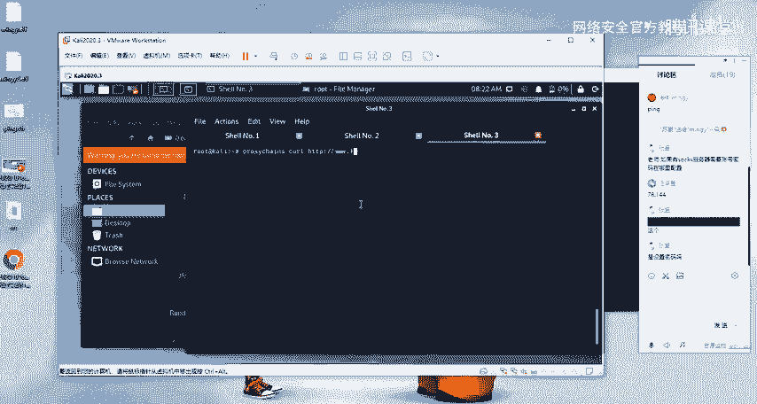

前面我们介绍了Socks代理的理论和工具，本节我们将通过一个具体的靶场实战，演示如何利用Metasploit框架建立Socks代理并进行内网穿透。

### 实战场景介绍

本次实战使用一个三层网络靶场环境（例如CFS三层靶场）。攻击场景如下图所示：

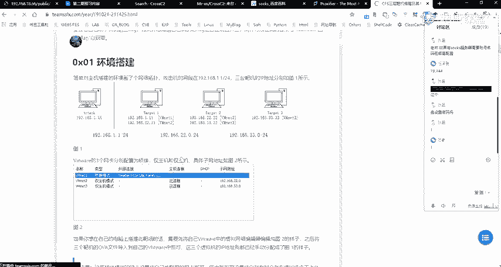

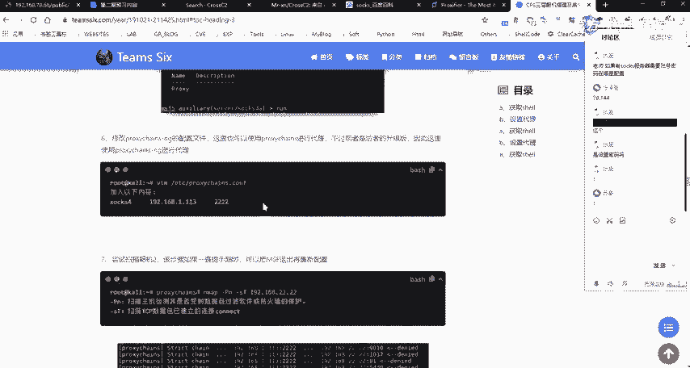

```
攻击者 (Attacker) ---> 公网服务器 (Target 1) ---> 内网机器1 (Target 2) ---> 内网机器2 (Target 3)
```

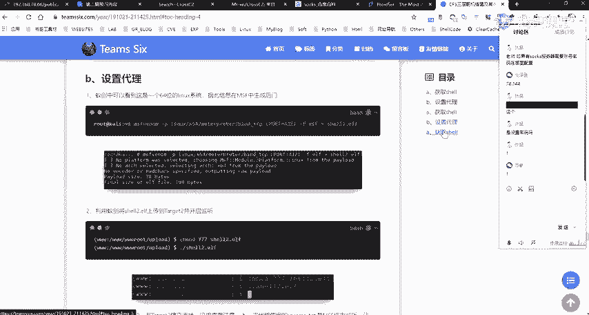

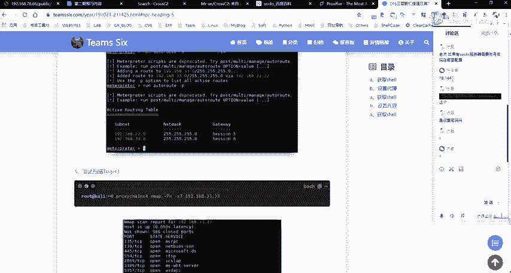

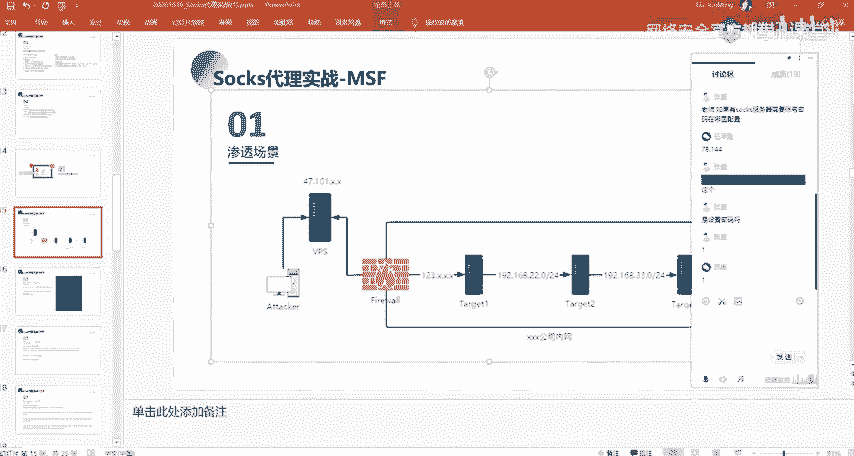

我们的目标是：首先攻陷对外提供服务的公网服务器（Target 1），然后以它为跳板，建立Socks代理通道，进而攻击其内网中的其他机器（Target 2, Target 3）。

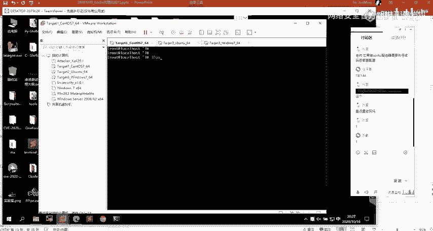

### 实战步骤

**步骤一：信息收集与初始入侵**

面对一个目标IP（例如`192.168.78.66`），第一步通常是进行端口扫描，以发现开放的服务。

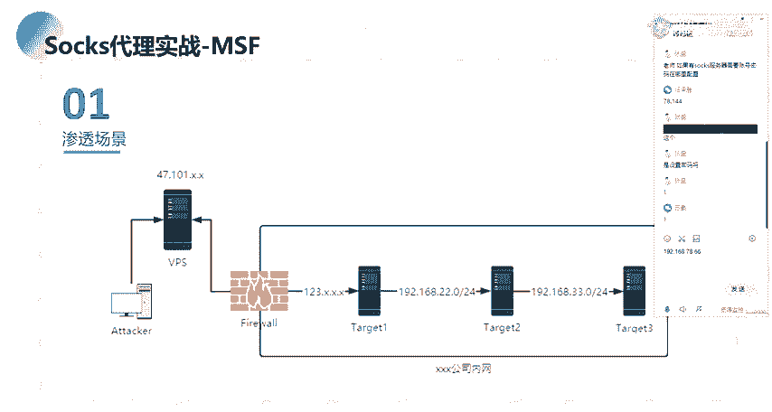

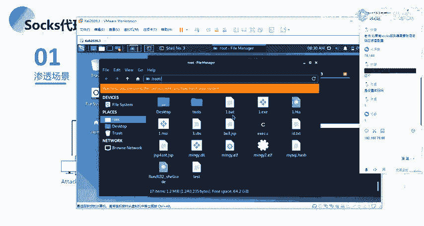

我们可以使用Nmap进行扫描，命令如下：
```bash
nmap -A -T4 -p- --script=vuln 192.168.78.66
```
*   `-A`: 启用操作系统检测、版本检测、脚本扫描和路由追踪。
*   `-T4`: 指定扫描速度。
*   `-p-`: 扫描所有端口（1-65535）。
*   `--script=vuln`: 使用漏洞检测脚本。

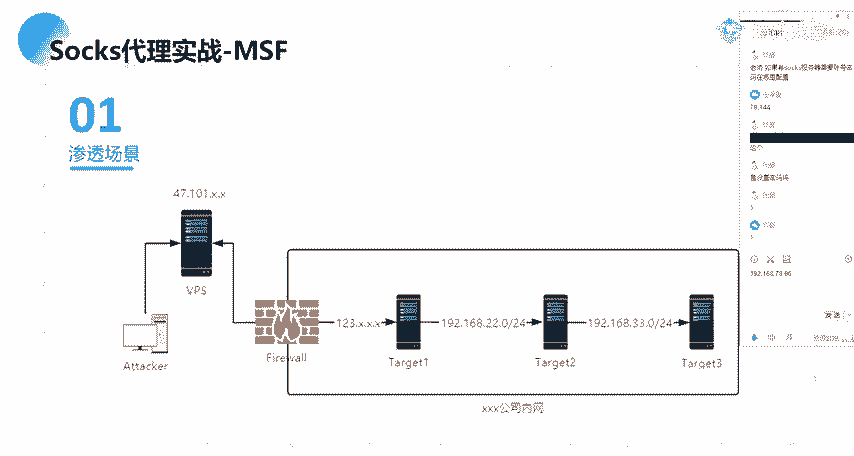

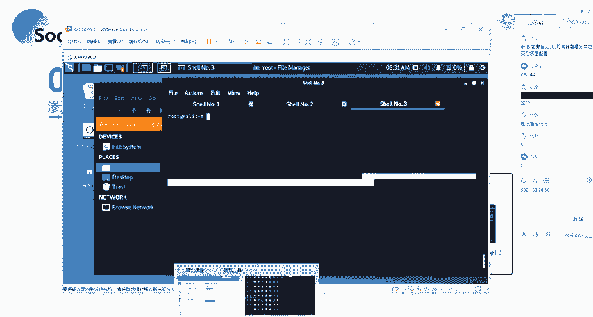

扫描结果可能显示开放了21（FTP）、22（SSH）、80（HTTP）等端口。假设80端口是一个Web服务，但页面内容简单。接下来，我们需要对Web服务进行深入测试，例如：
*   目录/文件枚举。
*   检查是否存在已知的CMS或框架漏洞。
*   手动测试常见的Web漏洞（如SQL注入、XSS、文件包含等）。

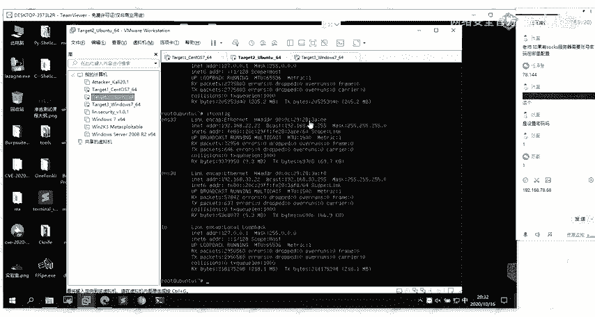

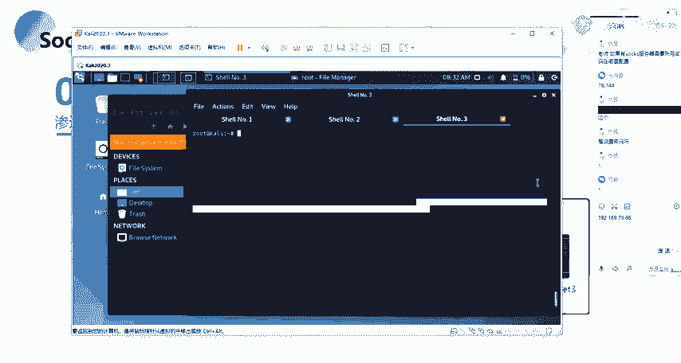

**步骤二：获取跳板机权限**

通过Web漏洞（例如文件上传、命令执行等）成功利用后，我们获得Target 1（公网服务器）的一个反向Shell会话。

在Metasploit中，我们可以使用`exploit/multi/handler`模块接收反弹的Shell，并升级为一个Meterpreter会话，以便获得更强大的功能。

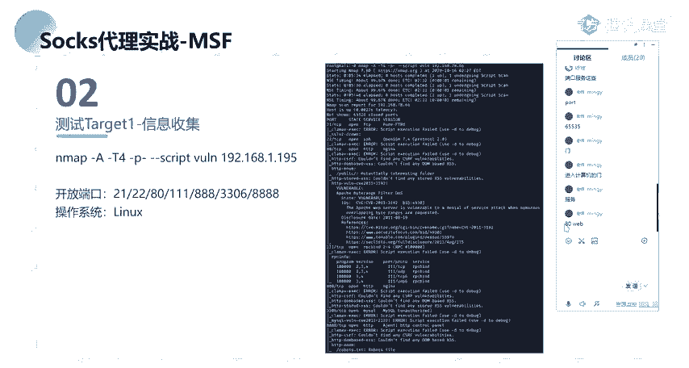

**步骤三：内网探测与Socks代理建立**

1.  **内网信息收集**： 在获得的Meterpreter会话中，使用`ipconfig`或`ifconfig`命令查看跳板机的内网IP地址，例如发现其还有`192.168.22.0/24`网段的IP。
2.  **添加路由**： 为了让Metasploit能够将流量路由到内网，需要添加路由。在MSF的`meterpreter`会话中：
    ```
    run autoroute -s 192.168.22.0/24
    ```
    或者退出到MSF控制台使用：
    ```bash
    route add 192.168.22.0 255.255.255.0 [SESSION_ID]
    ```
3.  **建立Socks代理**： 使用Metasploit的`auxiliary/server/socks_proxy`模块启动一个Socks4a代理服务。
    ```bash
    use auxiliary/server/socks_proxy
    set VERSION 4a
    set SRVPORT 1080
    run
    ```
    这会在攻击机的1080端口启动一个Socks4a代理服务器。

**步骤四：通过代理访问内网**

现在，我们可以配置其他工具，使其流量通过我们刚建立的Socks代理来访问内网。

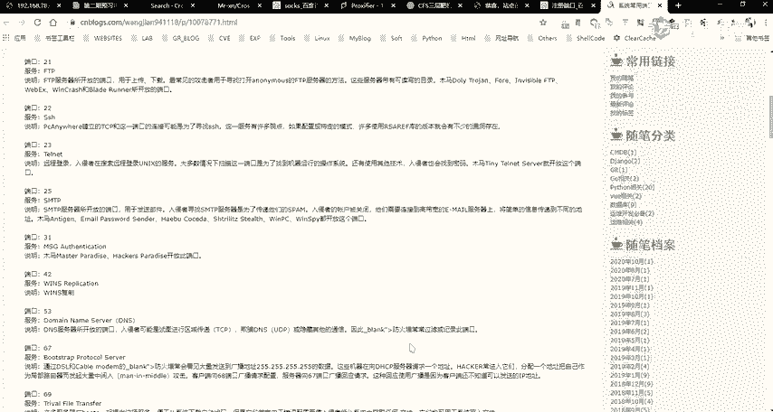

*   **使用Proxychains**： 编辑`/etc/proxychains.conf`，在末尾添加：
    ```
    socks4 127.0.0.1 1080
    ```
    然后使用`proxychains`来运行扫描工具，例如扫描内网主机`192.168.22.128`的端口：
    ```bash
    proxychains nmap -sT -Pn 192.168.22.128
    ```
    *注意：由于Socks代理基于TCP，Nmap的SYN扫描（-sS）可能无效，需使用TCP全连接扫描（-sT）。`-Pn`表示跳过主机发现。*

*   **使用Windows代理工具**： 将如`Nmap for Windows`、远程桌面连接（mstsc）等程序添加到`SocksCap`或`Proxyifier`中，并配置代理为`127.0.0.1:1080 (Socks4)`，这些程序的流量就会通过代理进入内网。

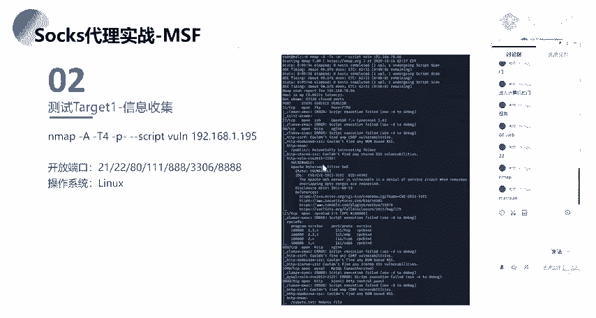

**步骤五：进一步渗透**

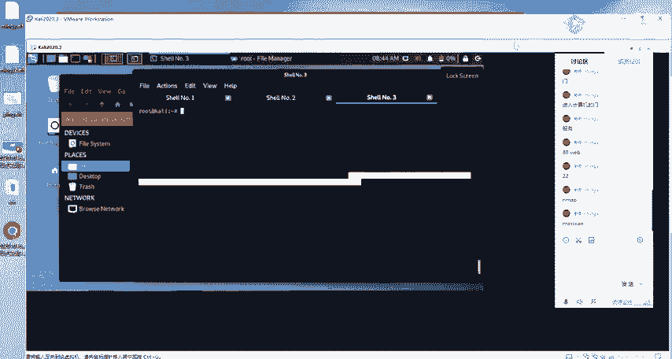

通过代理扫描，我们发现了内网主机（Target 2）开放了新的服务（如80端口）。我们可以继续使用工具（如浏览器配置代理、sqlmap配置代理等）对这些内网服务进行测试和攻击，重复“发现-利用”的过程，直至达成最终目标（如获取域控权限）。

## 总结

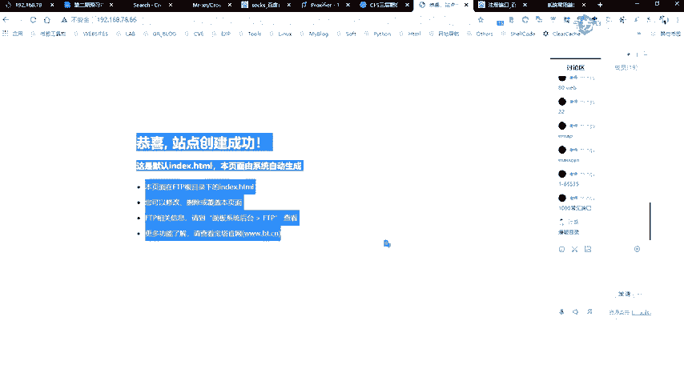

本节课中我们一起学习了Socks代理在内网穿透中的应用。我们首先了解了Socks协议的基本概念和工作原理，然后介绍了几款实用的Socks代理工具。最后，通过一个完整的靶场实战，我们演练了如何利用Metasploit获取跳板机、建立Socks代理路由，并配置其他攻击工具通过该代理对内网目标进行扫描和渗透。掌握Socks代理是进行多层内网渗透的关键技能之一。