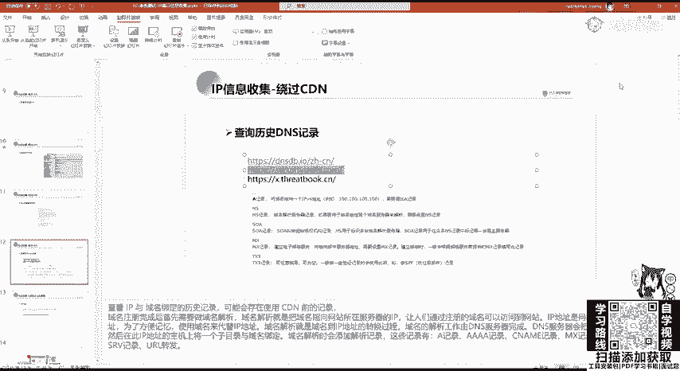
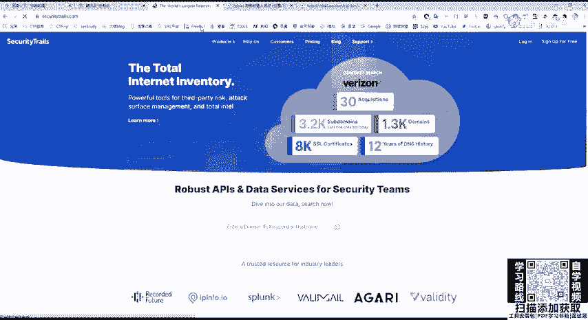
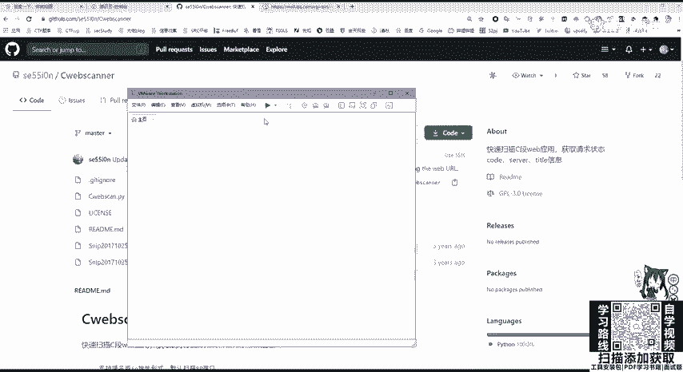
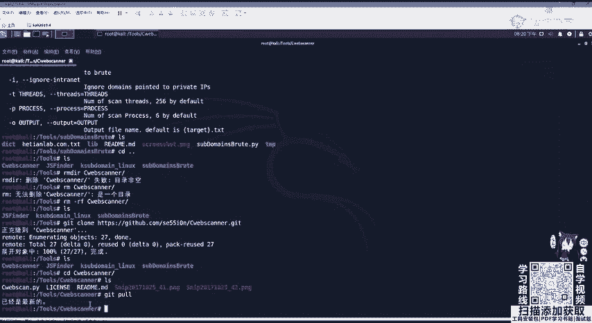
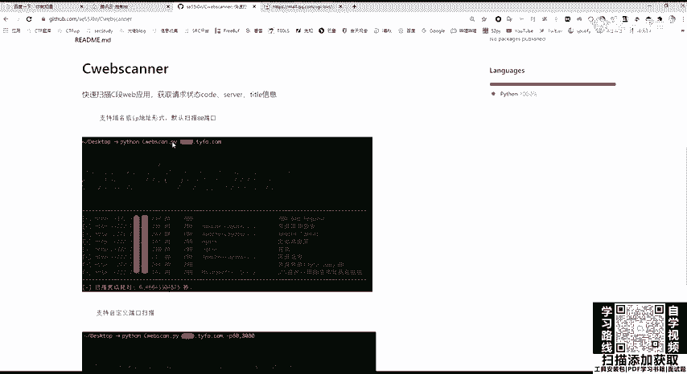
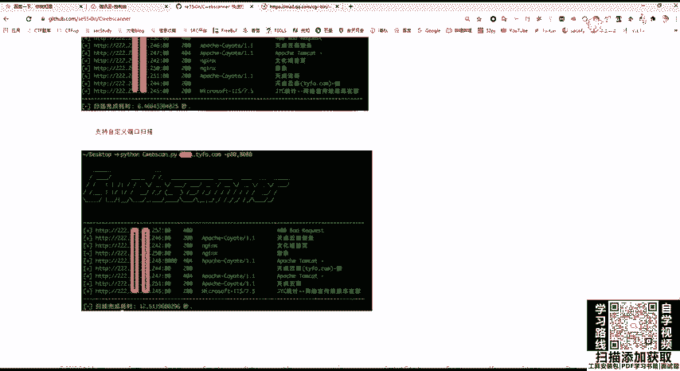
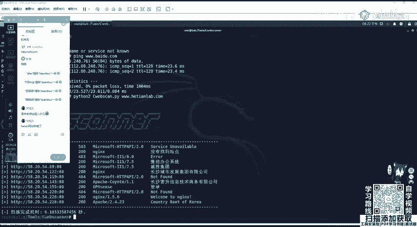

# B站最全网络安全教程，整整1300集，全程干货无废话，别再盲目自学了，看完学不会我退出网安圈！（web安全｜渗透测试｜内网渗透｜CTF） - P29：28.IP信息收集 .mp4 - 网络安全官方教程 - BV15u4y137cQ

IP地址信息收集就是非常重要，因为它是代表我们主机名。当甲方给予大家的这个目标是IP的时候，我们可以通过IP进行反查域名。如果渗透目标为虚拟主机，那么我们通过IP进行反查域名就很有价值。

因为一台物理服务器上面可能运行多个虚拟主机，这些虚拟主机有不同的域名，但通常共用1个IP地址。如果你知道有哪些网站共用这一台服务器拥有同1个IP地地址，那么就可以通过IP进行反查域名。

通过此台服务器上其他的网站漏洞，获取服务器控制权，进而迂回获取渗透目标的权限，这也就是我们经常说到的庞助。这个大家应该用PHP study应该知道，我们在3W目录下可以建多个文件夹。

也就是拥有不同的站点。这些站点它是都是具有一个IP地址的。如果我们是使用真实的服务器，在这一台服务器上可以搭建很多个站点，他们每个站点只是域名不同，而IP是相同的。

就像大家有的时候去挖SRC挖到搜cle注入。搜cle注入你可以看到它这个表就有非常的数据库，包括表非常的多。有可能这不只是这个站的数据库，还有其他旁站的一些数据库。

这又代表这些数据库呢都是存放在一个服务器上面的。那我们可以通过拿到其他网站的漏洞，从而获取服务器权限。通过IT反查域名，还是使用站长之家china z这个web接口进行一个查找。

就web接口直接我们公司的，比如说582054226，就直接查询就可以查到这个域名和天lab。这就非常简单。第二个。如果我们收到的资产是域名，包括进行子域名收集。收集到域名。

我们需要对IEP进行一个服务探测端口探测，需要看它有没有开启my蚁搜cle呀，或是readis或其他的桑巴共享服务等等。那我们就需要知道服务器的IP地址。通过域名查IEP很简单，可以拼一下它拼一下。

就是请求DNS将它转换成。我们的IP地址或者是使用站长之家的web接口进行查询。这里我查询和天la。Yeah。可以看到这个地址是湖南长沙移动联呃长沙联通获取的地址582053226。

还有下面还有一个定位，来看一下，它定的并不是很准确。这个看一下就行，但是他查到了这个IP的1个IP地址。那这里就遇到了一个问题，现在大部分一些SRC网站都是开启了CDN服务。那什么是CDN服务呢？

CDN及内容分发网络。是构建在网络之上的内容分发网络，依靠部署在各地的边缘服务器，通过中心平台的负载均衡等等，使用户就近获取所需内容，降低网络云才，提高访问速率和命中率，这是一个官方的定义。

那CDN具体是什么意思呢？比如我现在在湖南，我需要去访问黑龙江的一台服务器。因为我们湖南离黑龙江物理位置就是物理距离比较大，而且中间呢可能遇会遇到这种各个运营商的交换机，服务器的不停的切换。我们发送给。

黑龙江这个服务器的请求包，包括它返回的响应包就会非常的慢，延迟特别高，甚至有可能会存在一个高丢包率的一个情况。那这时候我们CDN服务就是将黑龙江这个服务器。通过内容分发。

分别分发给每一个省CBN每一个地区CBN服务器的边缘服务器上面，也就是这个做相当于可以简单理解为做一个备份。这时候。我们在湖南省去访问黑龙江的外b服务器，他访问的就不是物理位置的黑龙江。

而是访问了这台外b服务器。在湖南省长沙市CDN边缘服务器的这个备份内容。那这里我们访问的速率这个延迟就大大的降低了。而且丢包率也几乎为0，就会降低网络云塞。那如果我们使用CDN的时候去查找。

一般查找到的就是CBN的1个IP地址，不是网站真实服务器地址。那我们去做一个扫描端口扫描，包括渗透的一个扫描，就没有多大的用处。那我们要绕过CDN去呃拿到真实的IP地址，啊，这里有几种方法。

首先我们要判断是是否使用了这个CDN使用CDN这里还使用了这个站长之家。战场支家是非常的好用。这里我们对站长之家对一个网站进行多地聘。比如说我们聘百度。嗯。我们稍微等待一下。

可以看到几乎每个每一个地区去聘百度，它的延迟都是非常低的是为什么呢？因为百度可以看到，江苏省聘百度和深圳市聘百度，它IP地址啊是不一样的。啊，有39，有220。这是因为百度呢开启了这个CDN服务。

它是一个就近一个访问。那如果没有开启CDN服务的，就比如说公司的核电lab。Yeah。Okay。那拼到的肯定都是1个IP58。那这里他各个省去访问它的速率是也是非常快的啊也是非常快的。

因为它这个线路啊是。商用线路BGP。多地聘可以帮助我们判断服务器是否开启了CDN。那我们这里再看如何去绕过CDN呢？首先就是进行国外访问CDN它的是按流量收费的。并且在中国大陆收费是十分昂贵。

如果你对每一个站都开启了CDN，那它的价格，如果你这个站的访问量比较大，价格是非常高的。所以呢这个CDN一般不会对国外用户进行开启国内的网站。那我们可以利用国外的多地聘进行查找。这里可以。

利用这个国外的多地拼，或者是站长之家，他最后也会拿国外的服务器进行拼，或者是这个。这个外we卡卡这个。卡卡网都行的。可以在这里设置啊，我们可以只让它全选之后点掉，然后点击海外。用海外的这些机房去拼。

就可以看到他是否在外国开启了CTN如果这些国家聘的都是1个IP地址，那这个IP地址就是真真实IP地址。这是其中一种方法。但如果他在国外也驾设了CDN，那就这个办法就行不通。第二。第二种方法。

查询子域名的IEP还是刚刚说过的。因为CDN的价格非常昂贵。当我们架设子域名，也就是开启其他网站的时候，一般啊一些庞站小的站呢不会对它进行CDN架设。那我们通过查询子域名的IP。并且去查询它的C段。

就是同一个网站中的IEP有可能会拿到它的真实服务器IP地址。这查询子子域名IP大家应该知道吧，就是用子域名收集之后拼一下，或是用刚刚的战载之家进行查询即可。第三种方法，查看PHPin文件。

但这里是有限制的。第一个就是这个服务器上必须有PHPin文件。这个文件大家在架设网站的时候，一般会给删掉。所以这个可能性是比较小的。在PP文件里边。

我们可以看到一个server IDDRserv address，它会显示我们服务器的真实地址。如果你是在本地去装PP study去访问PP的话，你看到的是你的内网地址。而在公网服务器上。

你去访问去查看servver address发现这里8918473149即为公网I地址，也就是服务器的真实地址，但这个可能性比较小，一般的网站驾驶管理员都不会把PP info给你。

并且很多网站是SP和GSPpython等等，并没有PP info文件。还有一种方法就是邮件记录邮件服务，在邮件的原始代码中会显示邮件服务器发送的地址。

如果这个邮件服务器和网站的web服务器是搭在一个物理器上面的那就可以找到web服务器的真实IP地址，那这个邮箱的原始内容应该如何查看呢？那，这里就拿这个呃QQ邮箱做一个演示啊，其他的邮箱也都大同小异。

随便看一个。就比如说这个啊。有个漫画网站，那我们去看在这里。我们点击最这边的一个箭头会显示这个啊这个显示原邮件啊，原邮件邮件原文。显示邮件原文之后，在最上面有个received。

from168245106255。那这个就是这个PCU这个网站，它的邮箱服务器的IP地址。如果它是和外国服务器在同一个地方的那这就可以拿到它的真实IP了。那这里我们来稍微看一下它的一个。那IP啊这里。

IP肯定是能拼通的那我们就不看了，那是一个。美国的1个IP地址。最后一种方法也是我觉得啊就是跟多地拼非常常用的一个方法，就是查询历史DNS记录。查询历史DNS记录，我们还是使用这个啊。DNS这个网站。

外国网站进行一个查询。本这查询隔天lab。我都是以公司的这个为例哈，大家可以去看，这也可以看到这些记录，包括他的IP地址。I记录的IP地址。这里我们是看不全的，看不全可以用第二个。第二个大家注册一下。

就可以看到它的完整记录。那为什么查找历史的DNS会去拿到这个IP地址呢？

是因为我们在申请完域名之后，都会对域名和IP进行绑定，也就是进行域名解析。当我们解析完之后啊，第二步有可能才是购买，并且架设CDN服务。有可能一开始啊这个网站管理员搭好了网站测试好之后。

才去购买的CDN服务，或者是后期需要CDN的时候再进行购买。那我们一开始的进行的域名解析，就是把域名和某真实的IP进行绑定。那这些呢这个记录就会放到这一个历史DNS记录里面。那我们就可以进行去查询。

这里比如说啊这个腾讯云。腾讯里里面这个你去做了这个域名申请之后，你需要去添加记录。这添加记录我们可以看记录类型。啊，这是腾讯云。阿里云万网也是一样的那我们可以添加I。我们去查找DNS记录的时候。

也是查找I记录。I记录是什么？用来指定域名的IPV4地址，将域名指向1个IP地址。那我们肯定是需要这个嘛，需要这个之后，它的一个记录值。啊，这个主机的一个记录很简单，就是3W。是可以解析为这个域名。

或者是进行泛解析，或者是二级域名IDC或者是SYZ等等进行二级域名的解析。那么解析好之后，这个域名就会经过呃几个小时之后就会绑定在我们的。这个呃解云解析上面就会解解析到我们的IEP地址。

解析到IP地址之后，有可能才进行一个呃CDCDN的一个开启。开启CDN的话，这里大家如果架设架设网站的话，应该嗯是知道这个。呃，cloode fire这个网站这怎么。这梯子挂了呀。那这里就先不讲了。

这里我们就是呃在架设之后。开启。第第一次进行域米解析，它会保存这个记录里面呢我们可以去查找。他的真实IP地址。绕过CDN的方法，嗯，就上面几点，大家要熟悉，因为有可能一种方法行不通，用另外一种方法。

如果他对全球都开启了CDN架构建服务，并且没有进行一个解析的话，那就没有办法绕过了，这个就没有办法。但是一般进行小站的话，是肯定能找到IP地址的。在找到真实IP之后，我们需要对IP的C段进行主机探测。

什么是C段呢？就是同一网段，比如192。168啊，168点100。点00至255，他们都是属于一个网段里面的。这一个网段在公网里面，如果一个公司去申请IP地址的时候，一般都是相邻的网段。

就是在同一个网段中的相邻IP地址。那我们去探测C段，就会找到这个公司其他的资产，包括主机，这里可以使用N map进行一个探测N map杠SP使用P进行探测。可以加上域名。杠2424就是子网掩码。

255255250就是子网掩码，也可以加上我们的IP地址进行主机探测，存活主机探测，或者是N map它的速度是比较慢的那我们可以使用第三方工具C web scanner进行一个。查询。

那这里我们还是啊大家一定要学会这个用get up。进行安装。

呃，我先把这个虚拟机打开。去克隆软件非常简单，直接把它克隆下来即可啊，这里。这里好像我是给删掉了。Okay。Yeah。Yeah。嗯。Yeah。直接get，然后克隆。把这个地址给粘过来。克隆完成之后啊。

大家说怎么升级升级很简单，直接get，然后who直接这样就可以升级。这里可以看到是最新的，不需要有个升级的。不需要升级的。

那如何使用在get up的这个read me这个markdown里面已经写好了，非常简单，python加上。

CW看点PI再加上我们的这个。嗯，域名可以指定端口，因为刚刚讲过外包服务不仅是80，有可能会自定义为8080或其他端口，或者是HTTPS的443端口。那这里我们来扫描一下。

比如就拿这个和天的进行扫描，加上。本天。那部。点com。加上杠P，我们这个8080端口HTP端口443端口HTPS端口进行一个扫描。Yeah。这里是。要翻咧。还是排第爱。哎，我看一下。Okay。

Yeah。Yeah。Okay。啊，是核天 lab，还加还要加上3W。今天上面。这他默认会扫080端口，所以大家可以看到582054后面这些加上同一C段的就网站，它都会给扫出来。

这里可以看到有其他的一些网站。这就不打开看了，就只是扫描C段。

。

那下面呢我们需要对端口进行收集。