# B站最全网络安全教程，整整1300集，全程干货无废话，别再盲目自学了，看完学不会我退出网安圈！（web安全｜渗透测试｜内网渗透｜CTF） - P68：67.cobaltstrike简介.mp4 - 网络安全官方教程 - BV15u4y137cQ

不。那我们现在再来开始讲。Yeah。Yeah。嗯啊。Yeah。首先我们来看一下什么是co strike。第一节课我会给大家讲解cogo strict的简介，包括常用的功能，一些bacon。

然后讲coba strike的实战演示，如何让靶机上线。首先我们来看什么是CScopen strike简称CS是一款团队作战渗透测试神器。这个不是我们打的那个CS游戏，而是cobat。

是一个渗透测试神器，分为客户端及服务端。服务端可以对应多个客户端，而一个客户端呢又可以连接多个服务端。CS集成了渗透测试中经常使用的端口转发扫描。

包括多模式的端口监听windows可执行程序生成windows动态链接库生成java应用程序生成office红代码生成等，同时也能帮助我们克容浏览器相关信息、克容钓鱼网站等。

那cogle strike它经常在使用中和matta split进行联动，因为它们两个都是非常好的渗透测试框架。如果能将两者进行联动，进行渗透测试，那效率将会翻倍。

那CS和matta split在以前也是有关系的那MSF我们在周五的课程已经讲过是一款开源的框架。mata split我们通常用的接口即为它的一个命令行接口MSFcon。

MSF它也是具有图形化的界面方式的，就是armyage。aritage也就是CS的一个呃相相当于是它的一个呃早期版本。那CS呢就是阿itage的一个增强版，同时它也收费。那CS2。

0还是在依托MS框架的阿itage，但是在3。0之后，这个CS已经单独出来使用了单独的平台。那这里我们用的是三之后的版本是CS4。0。首先我们还是像mlate一样，看一下它的目录结构。

这个目录结构就是在工具包里面的co strike，你可以看到它的一个。目录结构将它直接移到我们的VPS上面就行。VPS就是公网上面的服务器。比如阿里云的轻量用服务器，ESC服务器都行。

或者是如果大家没有没有能力去在公公网中拥有VPS的话，可以将它拖中拖拖到卡利里面进行一个服务端运行。那我们首先看一下它的一个目录结构。啊，这IOS就能看到那这里就直接用PPT来看了。

首先script是CS的拓展应用脚本。我们CS支支持插件和脚本的一个拓展，是点CNN结结尾的，我们可以拓展一些模块。

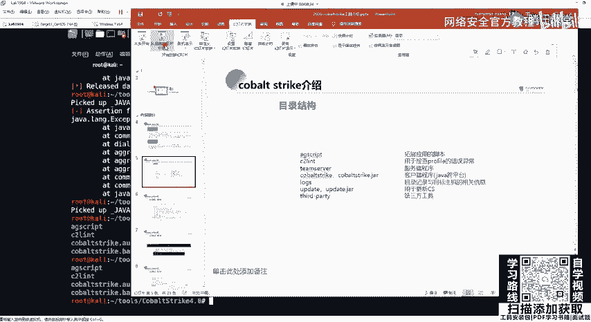

下面C to l是用于检查profile错误异常team server服务端程序co strike点GIR包。

这个是客户端程序ros是日志文件upate是用于更新co strikethird party是d三方工具的一个应用级。Yeah。co的服务服务端只能运行在linux的操作系统，并且需要安装java环境。

如果是使用卡利的话，java是已经安装好的。如果是大家自己购买的VPS服务器，java并没有安装。可以大家可以通过we get下载下来之后进行编译安装，并且配置环境变量。

这在第一节课环境的安装与准备已经讲过，如果大家的VPS是to这里也推荐大家使用sto。因为sto的y是十分的好用。那ym去安装JDK只需要去输入ymint杠Y是指默认选择yes。

因为在安装的过程中会有很多选项，需要我们选择。那我们去安装加88星号会匹配加va8的一些包，你去选择相应的，比如64位的sto，可以选择IMD64版本进行安装。在用亚么安装好之后。

环境变量就不需要我们再配置。因为亚么源的包里面已经帮我们配置好了。在服务器上运行，及把加va装好之后，把cope strike整个文件夹都移到公网的服务器上面。

并且给team server这个文件的服务端去设置可执行权限。我们去查看teme server实际是一个beash脚本，我们可以偷改修改。CS的默认监听端口，它的默认端口是50050，我们可以进行修改。

来这里给大家看一下。

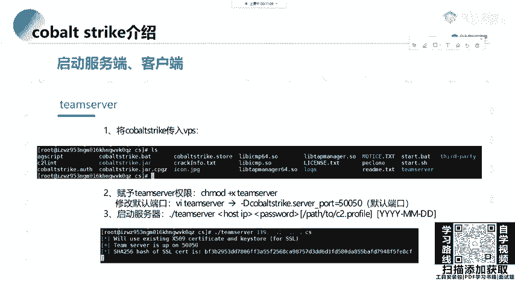

OK在这个里面，我已经装了这个co。那么I一下，需要去给一个team server赋值可执行权限，可以使用CHMOD777设置所有。用户可读可写可执性，也可以使用加X给所有的用户添加可执行权限。

加上team server it的相对路径。我们去VIM查看题目 server，会发现是一个冰袋纸的脚本。在下面我们可以配置它的一个默认端口。

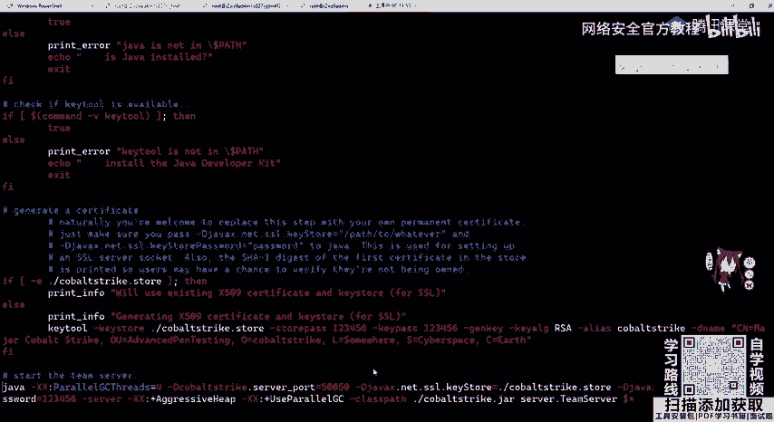

这里退出。打开启动我们的服务端，非常简单，只需要把team server运行，加上我们公网的IP地址。如果你是在carly里面安装的co strike，就加上cardly的网卡地址即可。

那这里我添加公网的一个地址。嗯。啊。第二个参数是我们te server word密码，我们可以把它设置为任意。比如我这里就设置了password。这个时候服务端会运行在50050端口。

那客户端就非常简单了。客户端我们可以在本地直接的进行打开。

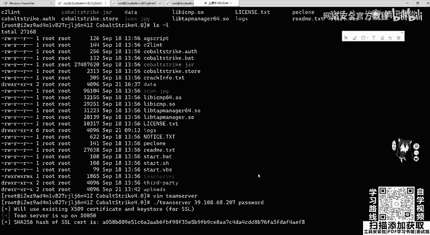

在co strike4。0文件夹里面已经配置好了点bet文件和点SH脚本，分别对应我们windows操作系统的打开co strike和linux操作系统的打开co strike。

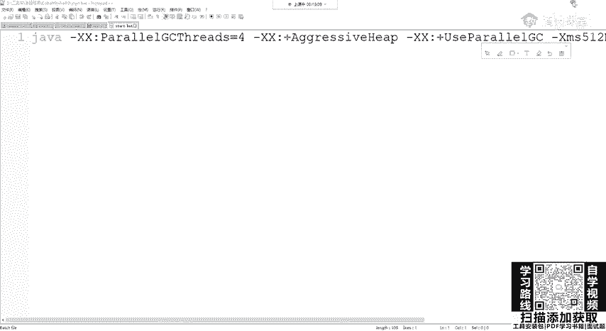

那这里我就以windows操作系统为例。啊，这里我已经创建了快捷方式，在桌面上或者是双击这一个点bedad都可以。

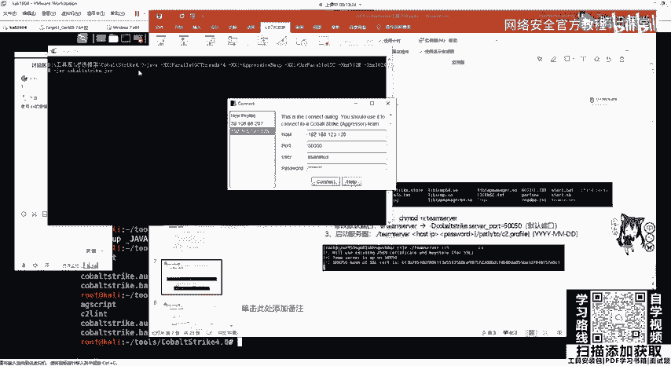

在打开客户端之后，这里会让我们输入host，也就是服务器的IP地址，加上服务器的端口默认。如果没有修改的话，是50050user用户名，这里是随意修改，因为它支持多个客户端去连接服务端。

password输入我们在服务端中设置的密码即为password，点击connect连接。这时候我们就会连接到服务器。因为它只是多用户，我们在他利里面也可以把客户端给开启，是使用我们的start点SH。

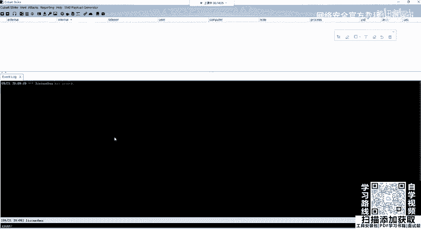

对。开启之后，我们一样user自己设置进行连接。Yeah。

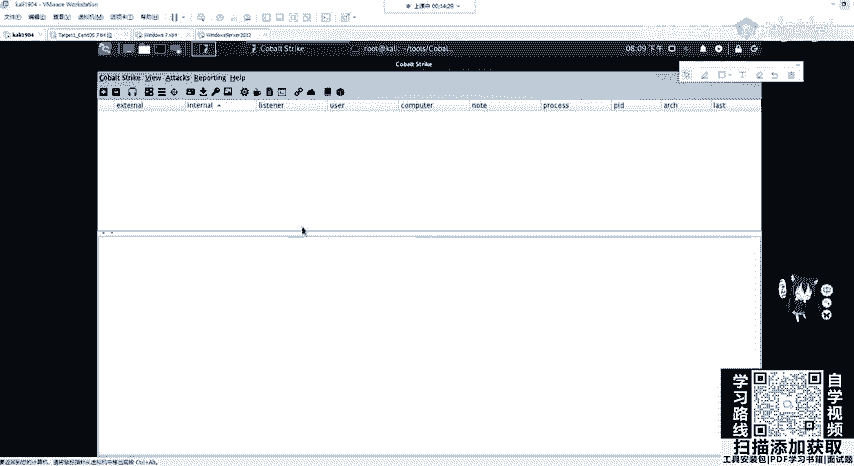

在windows操作系统的一个。显示可以看到两个用户都已经连接过来了，这就是一个客户端去连接服务端。

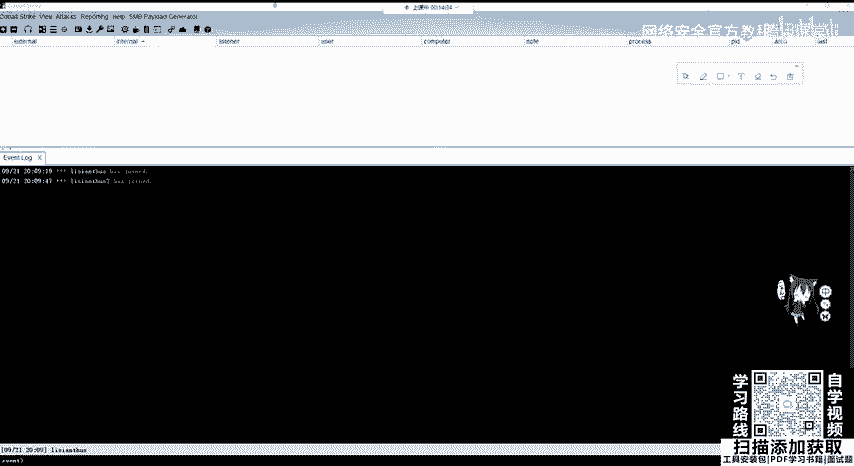

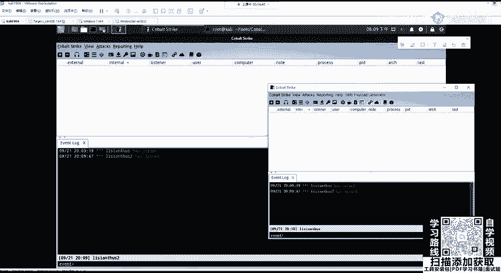

这里也已经讲过了，如果一个客户端想要连连接多个服务端的话，也非常简单。直接在上拉菜单下点CS，然后new connection就可以去连接其他的服服务端。

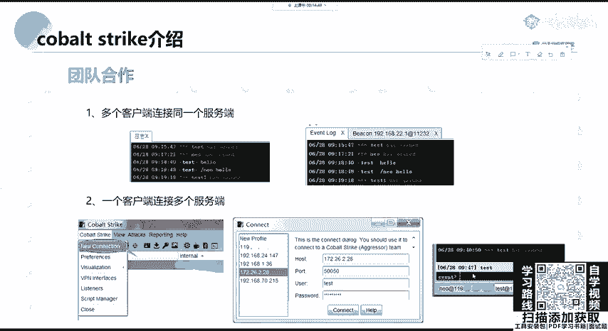

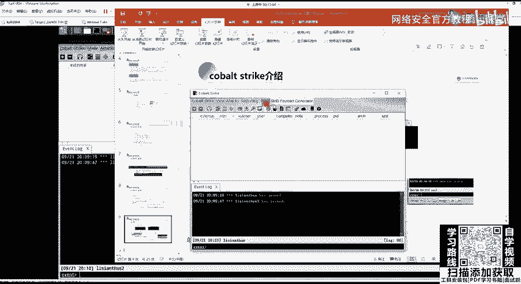

。