# CTF入门教程：11：杂项（上） 🧩


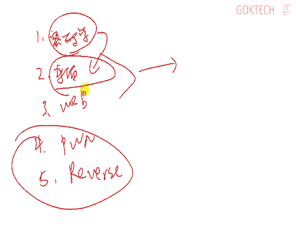


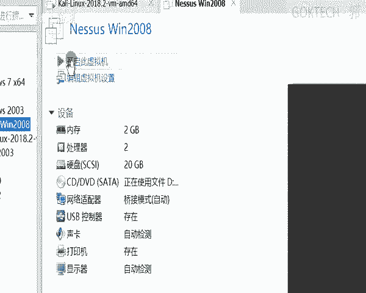

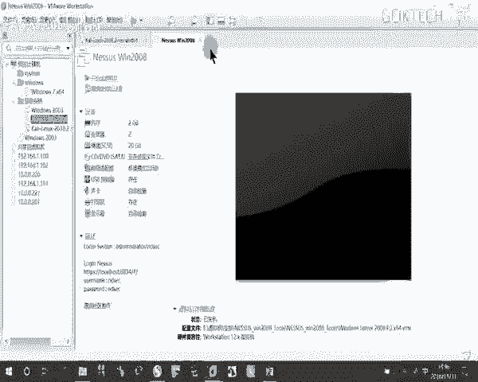

在本节课中，我们将要学习CTF比赛中“杂项”（Misc）类题目的基础知识。杂项题目通常涉及文件分析、信息隐藏和取证等技能，是快速提升得分的题型之一。我们将从文件操作开始，逐步学习如何识别、分离和分析隐藏在各种文件中的信息。

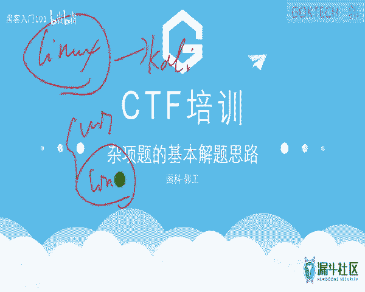

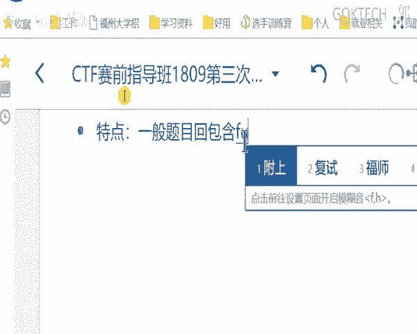

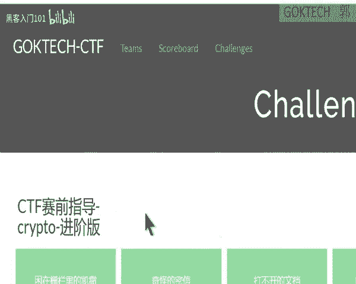

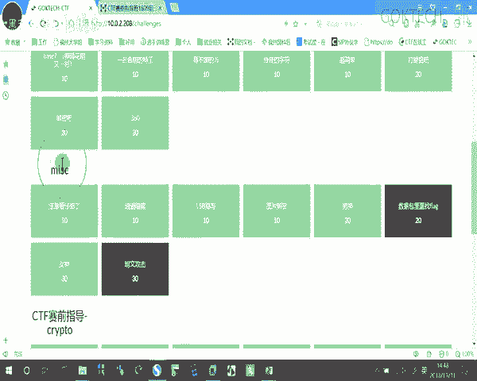

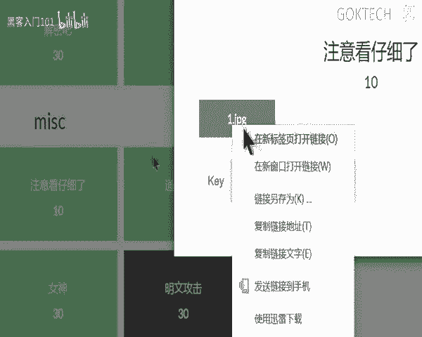

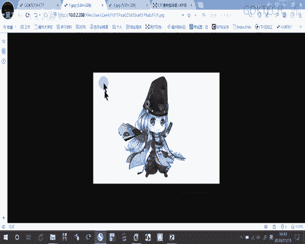

---


## 文件操作与隐写 📁

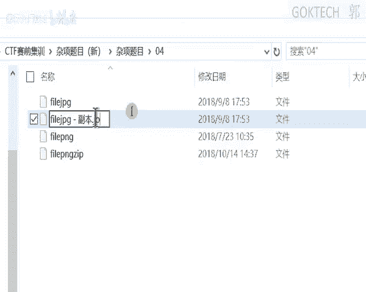

上一节我们介绍了CTF的主要题型分类，本节中我们来看看杂项题目中最基础的部分：文件操作与隐写。杂项题目通常会提供一个或多个附属文件，我们需要使用各种工具对这些文件进行分析，以找到隐藏的`flag`。

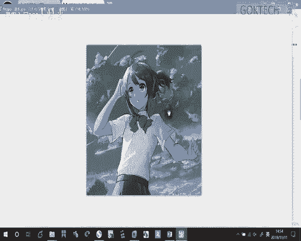

### 如何分析下载的文件

每个文件都有其特定的**文件头**，通过文件头可以识别文件的真实类型。有时出题人会故意修改或隐藏文件扩展名，我们需要通过分析文件头来还原它。

以下是分析文件的两种主要方法：

1.  **手工分析**
    使用十六进制编辑器查看文件头部，并与已知的文件头签名进行比对。
    *   **工具推荐**：
        *   `Notepad++` + `Hex Editor` 插件。
        *   `010 Editor`：功能强大的专业十六进制编辑器。
        *   `WinHex`：CTF工具包中提供的绿色版十六进制编辑器。

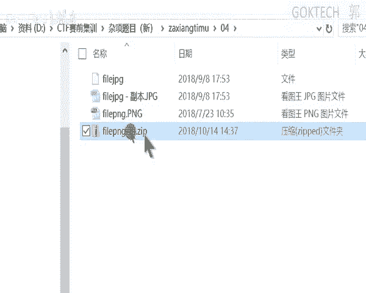

2.  **工具分析**
    使用命令行工具自动识别文件类型。
    *   **命令示例**：在Kali Linux中使用 `file` 命令。
        ```bash
        file suspicious_file
        ```

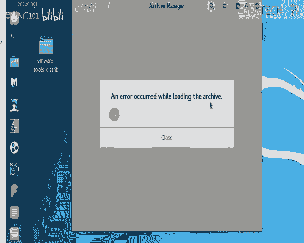

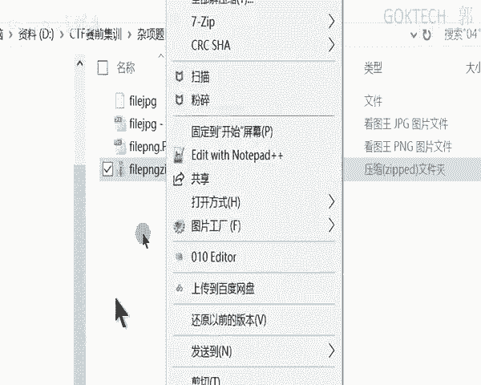

**核心概念**：常见的文件头签名（十六进制）
*   JPEG: `FF D8 FF E0`
*   PNG: `89 50 4E 47`
*   ZIP: `50 4B 03 04`
*   GIF: `47 49 46 38`

**操作流程**：
1.  用十六进制编辑器打开文件。
2.  查看文件头部（前4-8个字节）。
3.  与文件头签名表比对，确定真实类型。
4.  如果文件头损坏或缺失，手动补充正确的文件头。
5.  修改文件扩展名，尝试打开。

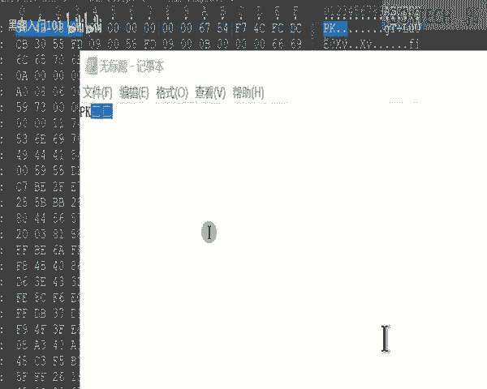

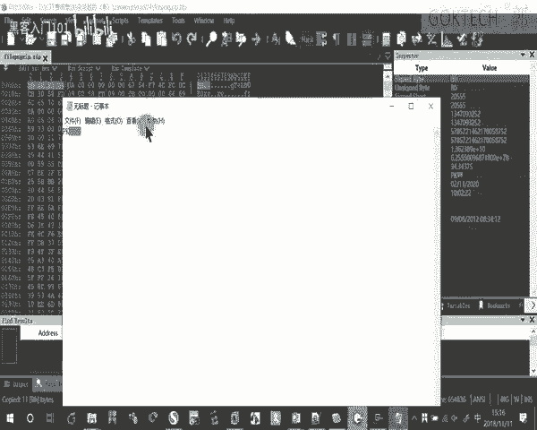

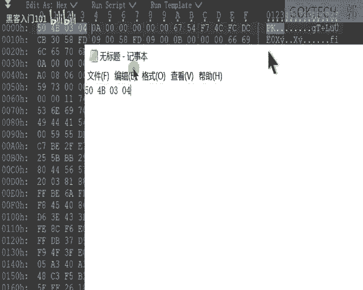

当文件出现无法打开的情况时，需要查看文件头。如果文件头损坏或缺失，需要进行相应的补充。

---

## 文件分离技术 🔍

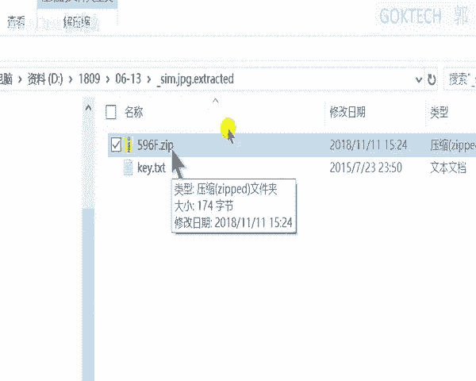

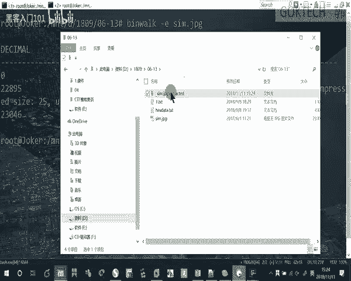

上一节我们学习了如何识别文件类型，本节中我们来看看如何从一个文件中分离出隐藏的其他文件。这通常用于解决“图中有图”或“文件套文件”类的题目。

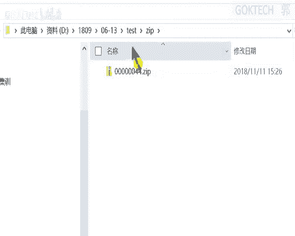

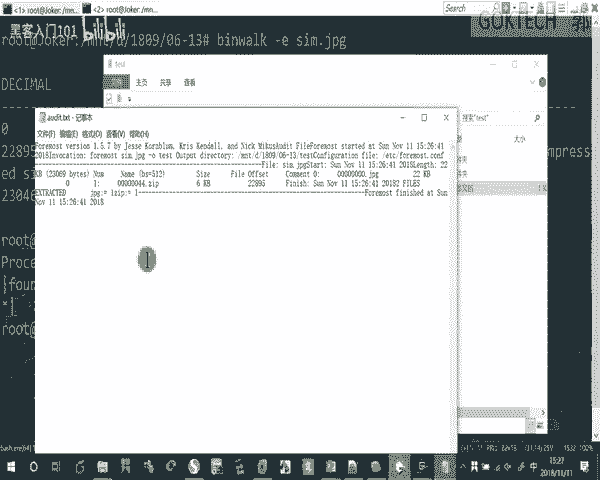

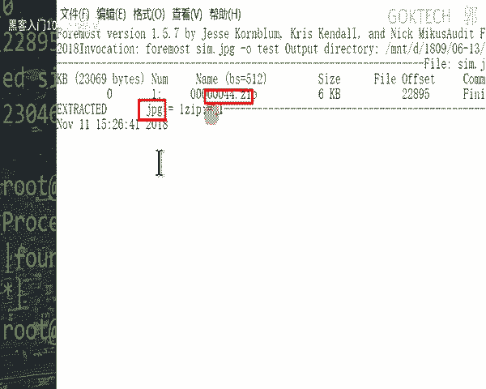

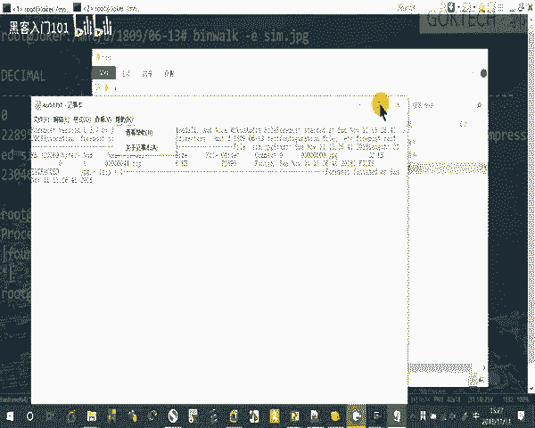

以下是几种文件分离的方法：

1.  **自动化分离**
    使用工具自动扫描并分离出文件中嵌入的所有已知格式文件。
    *   **`binwalk` 命令**：强大的文件分析分离工具。
        ```bash
        binwalk -e target_file.jpg # 分析并分离文件
        ```
    *   **`foremost` 命令**：当 `binwalk` 无法分离时，可以尝试此命令。
        ```bash
        foremost -i target_file.jpg -o output_folder # 分离文件到指定文件夹
        ```

2.  **半自动化/手动分离**
    当文件结构复杂（如数据块交错存放）时，需要手动指定范围进行分离。
    *   **`dd` 命令**：用于按指定偏移量和大小提取文件数据块。
        ```bash
        dd if=combined_file.jpg of=extracted.zip bs=1 skip=22895 count=151 # 从偏移量22895处提取151字节
        ```
        *   `if=`：输入文件
        *   `of=`：输出文件
        *   `bs=`：块大小（字节）
        *   `skip=`：跳过的输入块数
        *   `count=`：要复制的块数
    *   **十六进制编辑器手动操作**：在 `010 Editor` 等工具中，直接搜索文件头签名（如 `50 4B 03 04`），选中从该文件头到文件尾的数据，另存为新文件。

---

## 文件合并与校验 🔗

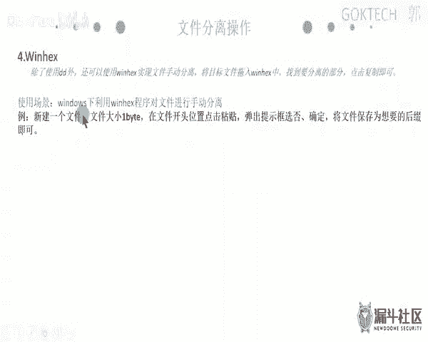

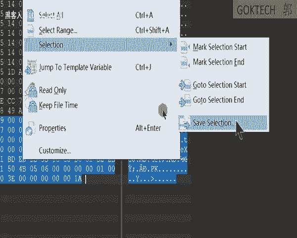

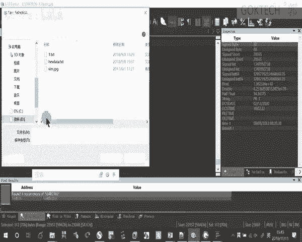

有时题目会将一个文件分割成多个部分，我们需要将它们合并起来。此外，下载或合并后的文件完整性也需要验证。

以下是文件合并与校验的方法：

1.  **文件合并**
    在Linux下，可以使用 `cat` 命令轻松合并多个文件。
    ```bash
    cat part1 part2 part3 > merged_file
    ```
    或者使用通配符按顺序合并：
    ```bash
    cat gif.* > complete.gif
    ```

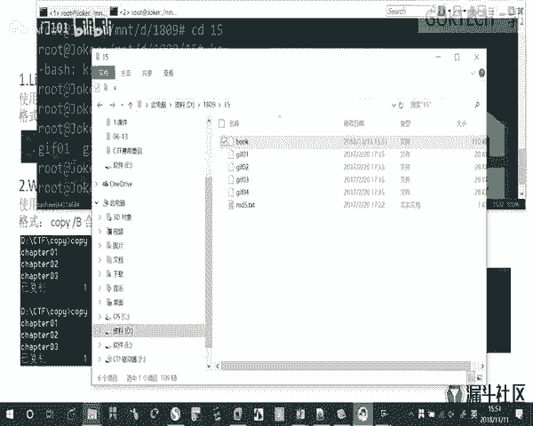

2.  **文件校验（MD5）**
    合并后，需要验证文件的完整性是否与题目提供的校验值一致。
    ```bash
    md5sum merged_file
    ```
    **注意**：这里的MD5校验用于验证文件完整性，与密码学中的MD5哈希**加密**不同，它**不能**逆向还原出原文件。

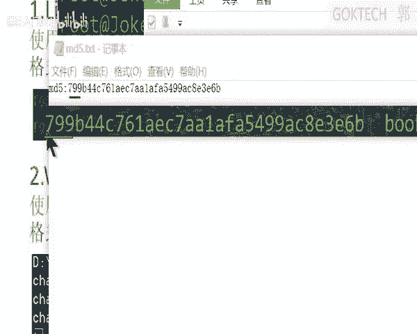

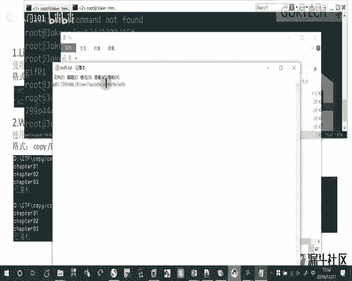

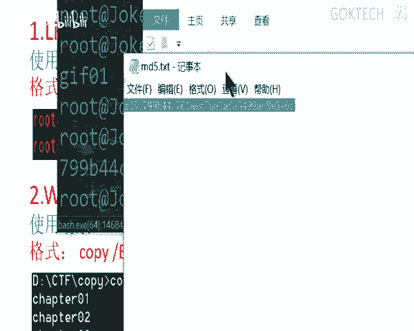

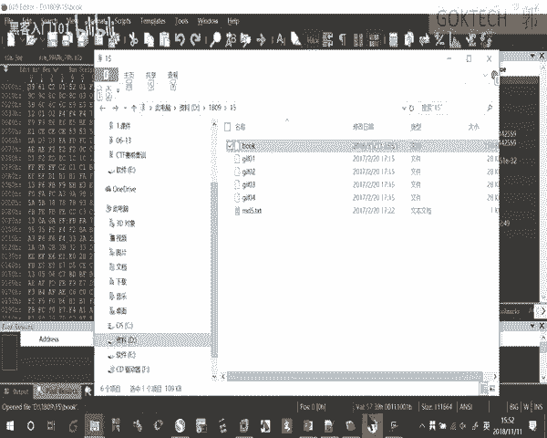

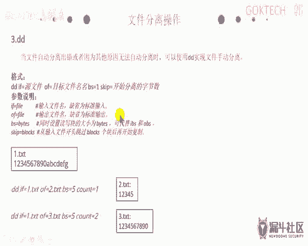


**核心概念**：MD5的雪崩效应
文件内容的微小改变会导致计算出的MD5值发生巨大变化。因此，只要计算出的MD5值与题目提供的前几位相同，通常就可以认为文件完整无误。

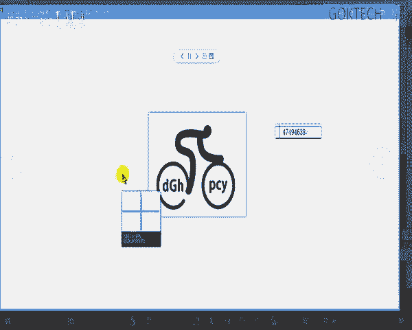

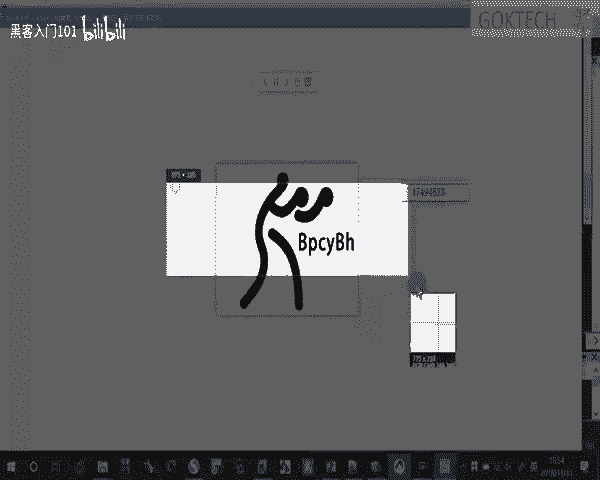

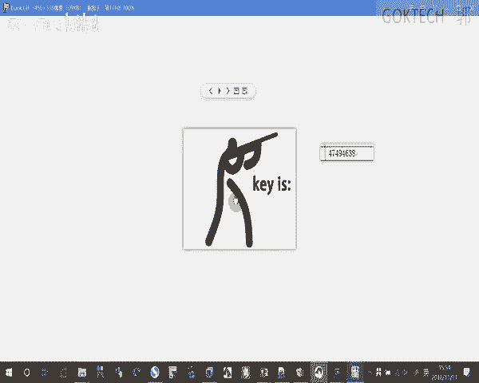

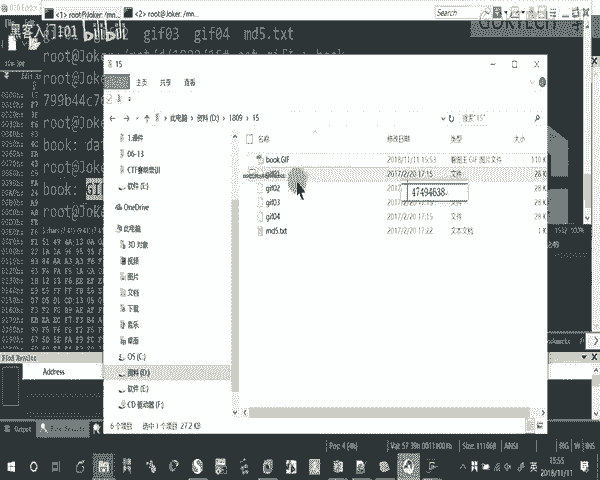


如果合并后的文件仍无法正常打开（例如，被识别为`data`类型），很可能其文件头在分割或传输过程中损坏。此时需要根据文件原本的格式（如GIF），手动修复文件头。

---

## 图片隐写术入门 🖼️

上一节我们处理了通用的文件操作，本节中我们聚焦于杂项中非常常见的一类——图片隐写术。信息可能隐藏在图片的像素、颜色通道、文件元数据甚至多帧动画中。

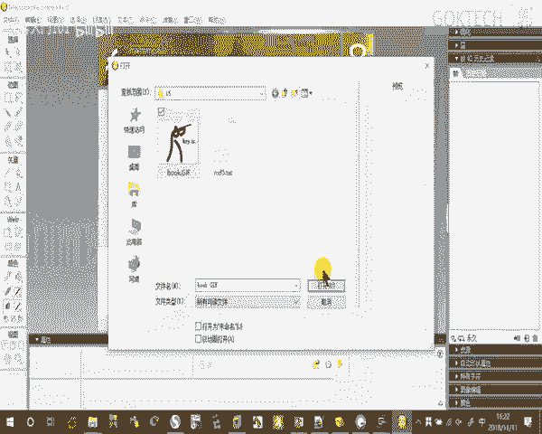

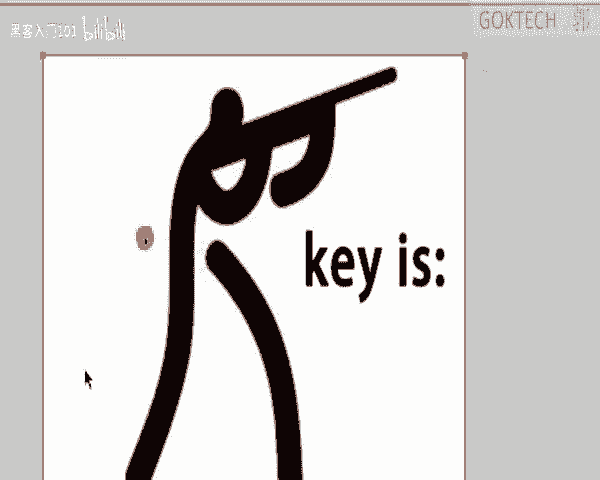

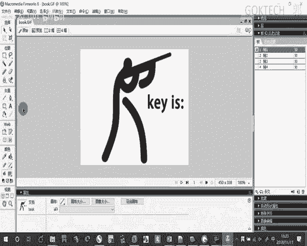

图片隐写主要涉及以下几个方面：

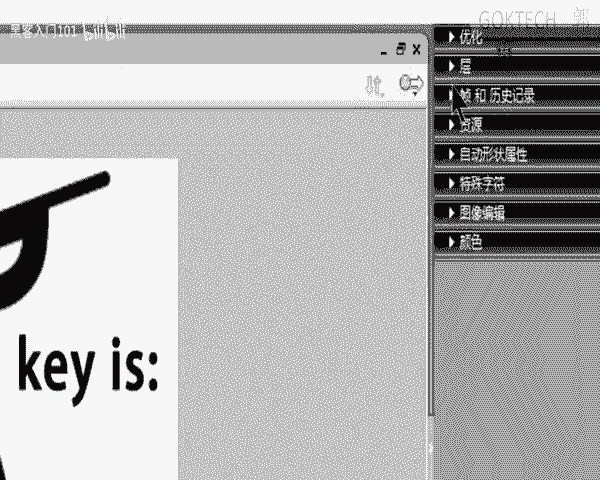


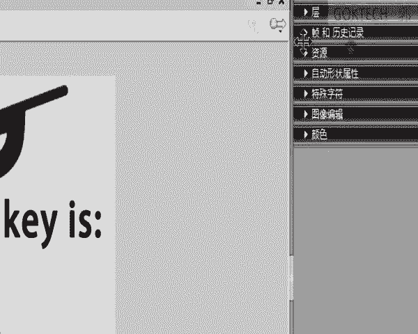

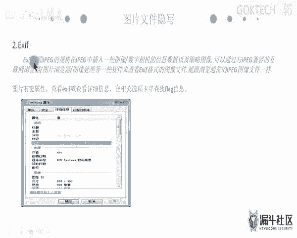

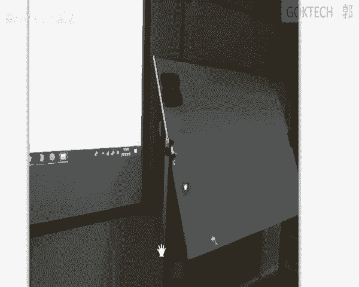

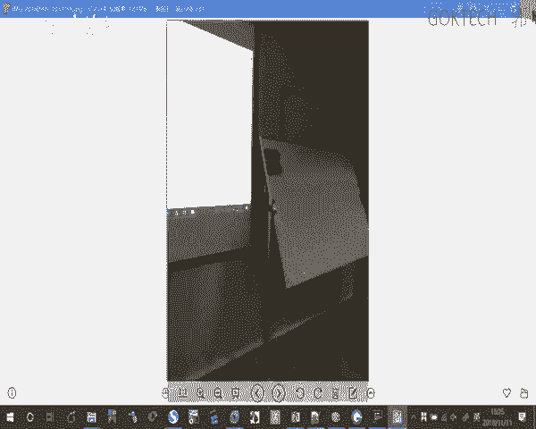

*   **细微颜色差别**：人眼难以察觉的像素颜色变化可能构成二维码或文字信息。
*   **GIF多帧隐藏**：将信息分散在GIF动图的每一帧中。
*   **EXIF信息**：图片的元数据（拍摄时间、设备、GPS坐标等）可能藏有`flag`。可以使用系统属性查看，或Linux下的 `exiftool` 命令。
    ```bash
    exiftool image.jpg
    ```
*   **图片修复**：修复被破坏的图片文件头、校验值或长宽高。
*   **最低有效位隐写**：将信息隐藏在像素RGB值的最低有效位（LSB），对图片观感影响极小。
*   **图片加密**：隐藏文件时加了密码，密码可能藏在文件名或题目描述中。

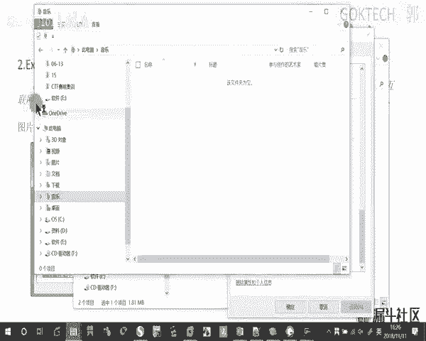

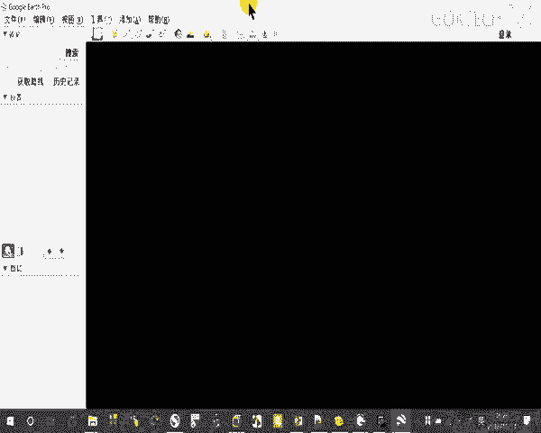

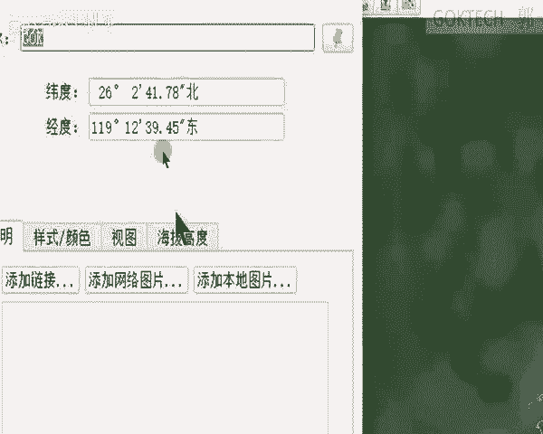

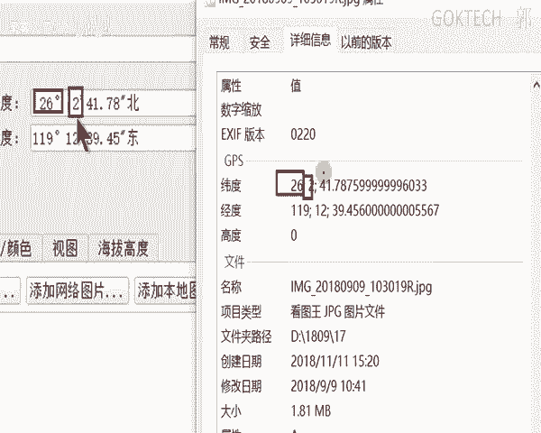

### 常用图片隐写分析工具

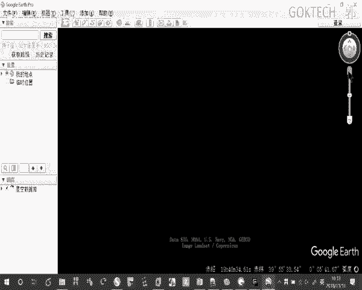

以下是处理图片隐写的几种实用工具和方法：

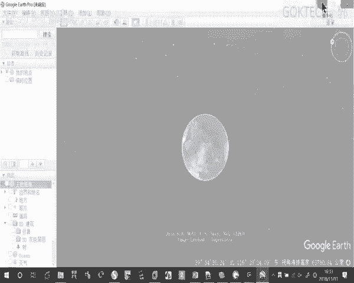


1.  **Firework文件**
    如果图片由Firework软件编辑过，用十六进制编辑器查看时可能在头部发现`Firework`字样。可以使用专用工具或支持图层的软件（如Photoshop）查看其图层和帧，可能发现隐藏信息。

2.  **Stegsolve**
    这是一款非常强大的Java图像分析工具，需安装Java环境。
    *   **功能**：
        *   **通道分离**：查看RGB各个颜色通道。
        *   **LSB隐写分析**：提取RGB最低有效位组合的信息。
        *   **图像对比**：对两张图进行异或、与、或、加减等操作，找出差异。
    *   **使用技巧**：分析LSB隐写时，需要尝试RGB三个通道的不同排列组合顺序（共6种），并在预览中查找可读字符串（如`flag{`）。

3.  **zsteg**
    专门用于检测PNG和BMP图片中LSB隐写的工具（Kali中可能需要手动安装）。
    ```bash
    zsteg image.png
    ```
    它会自动尝试多种LSB组合并直接显示结果。


4.  **在线工具/脚本**
    对于特定类型的LSB隐写，有时可以找到在线的解密工具或别人写好的Python脚本。使用时需要将目标图片与脚本放在同一目录，并运行脚本。
    ```bash
    python lsb_extract.py target_image.png
    ```

**实战技巧**：
*   拿到图片，先尝试能否正常打开。
*   用 `binwalk` 或 `foremost` 检查是否内嵌其他文件。
*   用十六进制编辑器查看文件头尾，看是否有明文`flag`。
*   查看图片属性中的详细信息（EXIF）。
*   使用 `Stegsolve` 进行通道、帧、LSB等全面分析。
*   如果图片是二维码但部分损坏，可以用画图工具修补定位点。

---


## 总结 📝

本节课中我们一起学习了CTF杂项题目的上半部分核心内容。

我们首先学习了**文件操作**，包括如何通过文件头识别文件真实类型，以及当文件头损坏时如何修复。接着，我们深入探讨了**文件分离技术**，掌握了使用 `binwalk`、`foremost` 和 `dd` 命令从复合文件中提取隐藏内容的方法。然后，我们了解了**文件合并与MD5校验**，确保获取的文件完整无误。最后，我们入门了**图片隐写术**，认识了信息可能隐藏的多种方式，并学会了使用 `Stegsolve`、`zsteg` 等工具进行初步分析。


记住处理杂项题目的基本流程：**检查文件类型 -> 分离潜在文件 -> 分析元数据 -> 深入检查隐写（如图片通道、LSB）**。多练习、多积累工具的使用经验，是提升杂项解题能力的关键。下节课我们将继续学习杂项的其他类型，如流量分析和压缩包处理。