# CTF夺旗赛教程：12：杂项（中） 🕵️

在本节课中，我们将深入学习CTF杂项题目中关于文件隐写与图片隐写的核心技术与工具。我们将从文件分析开始，逐步深入到图片隐写、加密图片解密等复杂操作，确保初学者能够掌握基本思路和操作方法。

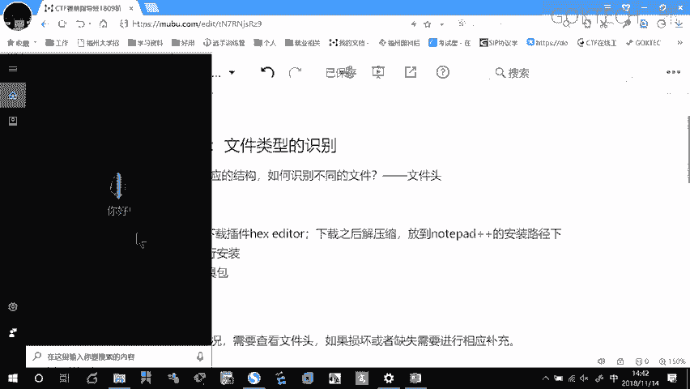

## 文件隐写分析 🔍

上一节我们介绍了杂项题目的基本概念，本节中我们来看看如何分析包含隐写内容的文件。其核心原理在于，每种文件类型都有其独特的**文件头**（File Header），通过识别文件头可以判断文件真实类型。

### 分析方法

分析文件隐写主要有两种方式：手动分析和工具分析。

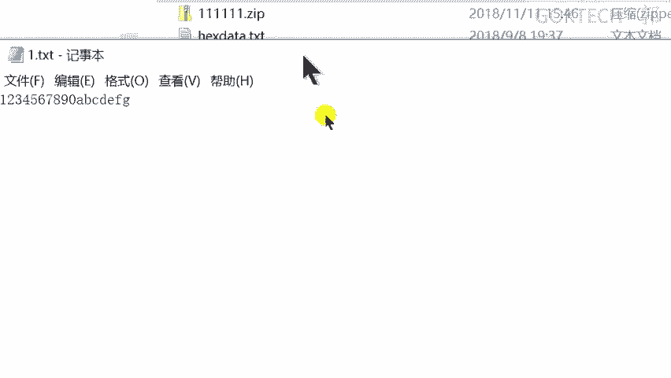

以下是手动分析的步骤：
1.  使用文本编辑器（如Notepad++）的十六进制查看插件，或专业的十六进制编辑器（如010 Editor、WinHex）打开文件。
2.  查看文件起始部分的字节，与**常见文件头类型表**进行比对。
3.  例如，PDF文件的文件头通常为 `%PDF`（十六进制：`25 50 44 46`）。

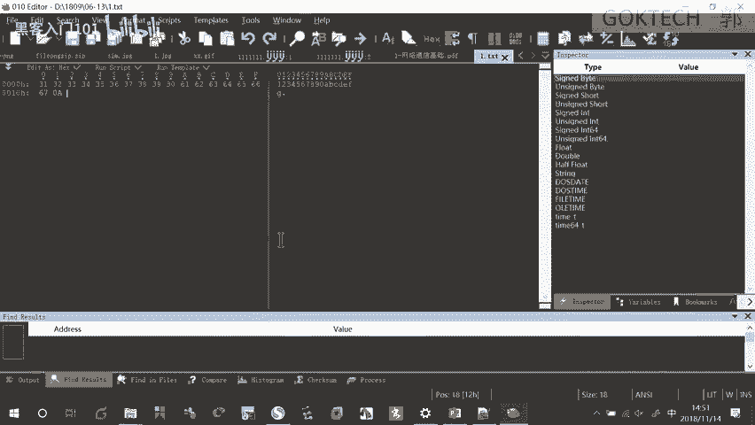

工具分析则更为便捷，例如Linux下的 `file` 命令，可以自动识别文件类型并显示在终端上。

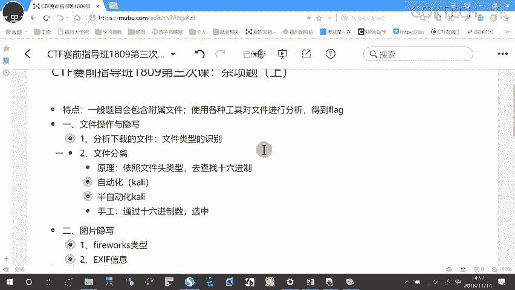

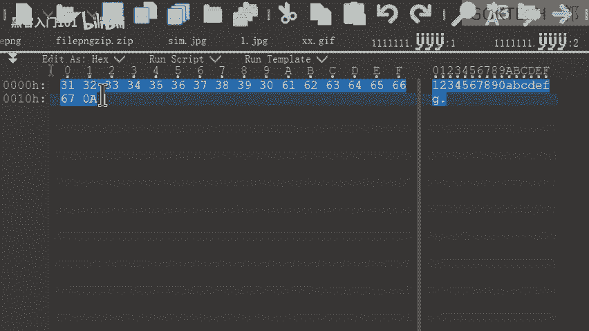

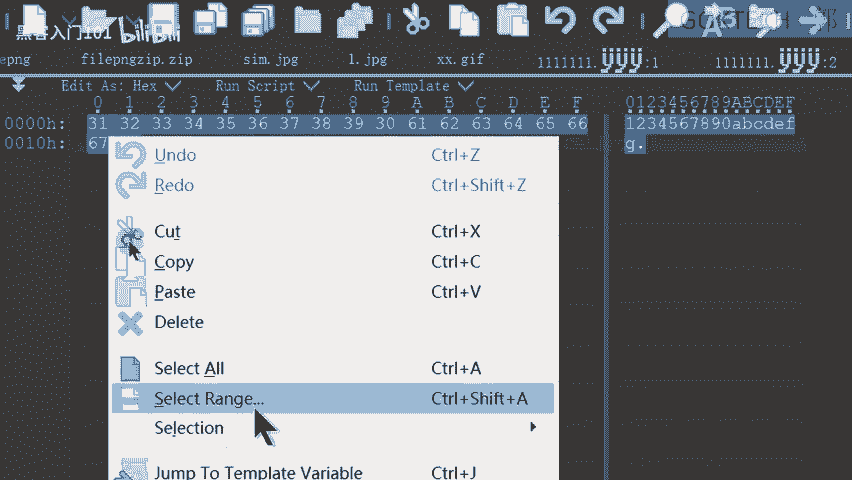

### 文件分离

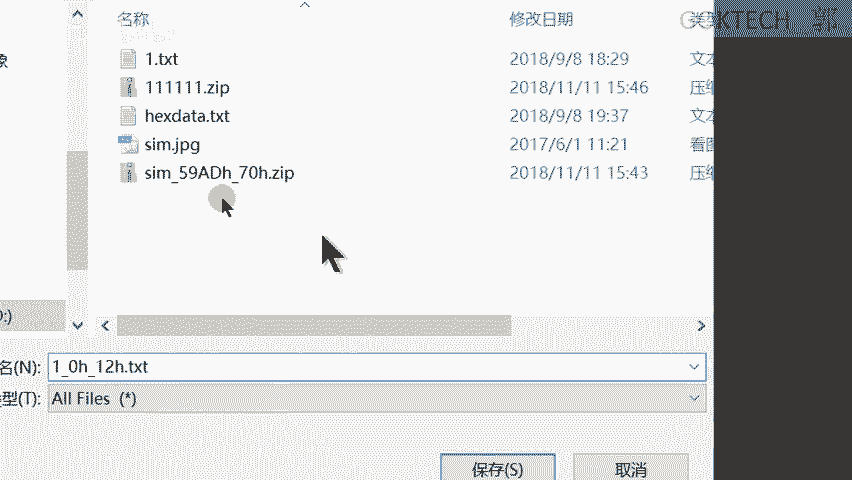

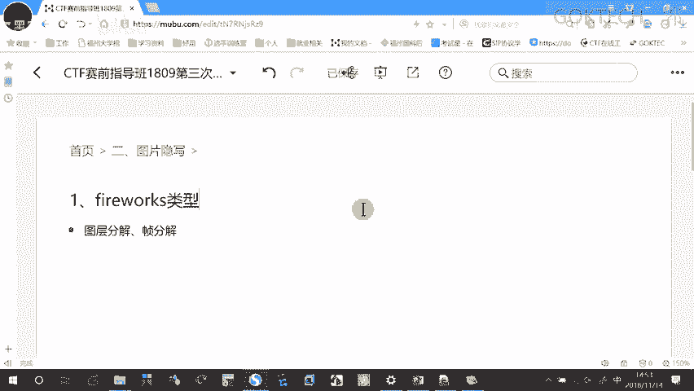

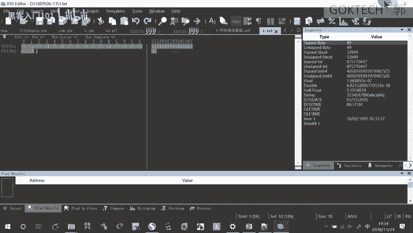

分析出文件可能包含其他隐藏内容后，下一步是进行分离。其原理是依据不同文件的文件头/尾特征，在十六进制数据流中进行查找和切割。

以下是常用的分离方法：
*   **自动化工具**：使用Kali Linux中的 `binwalk` 或 `foremost`。
    *   `binwalk -e` 参数可以自动分析并提取嵌入的文件。
    *   `foremost` 默认按文件类型分类提取。
*   **半自动化命令**：使用 `dd` 命令。该命令依据指定的**块大小**和**数量**进行数据切割。默认块大小（`bs`）的单位是**字节**。
    *   例如：`dd if=输入文件 of=输出文件 bs=1 skip=起始偏移 count=读取字节数`
*   **纯手工方式**：在十六进制编辑器中，手动搜索文件头，选中疑似文件的数据块，然后将其**另存为**一个新文件。

## 图片隐写技术 🖼️

图片是隐写术最常用的载体之一。处理图片隐写需要掌握多种工具和技术。

### 图片分析工具

首先，我们介绍几款关键的图片分析工具。

以下是Fireworks（或类似工具如GIMP、Photoshop）的主要用途：
1.  **处理图层**：题目可能将信息藏在被上层图层遮盖的下层中，分离图层即可发现。
2.  **分解帧**：对GIF等动态图片，可以逐帧查看，关键信息可能只在某一帧显示。

### 图片信息查看

图片文件本身可能包含隐藏信息，如拍摄时间、GPS坐标等。

以下是查看方法：
*   **Windows**：右键图片文件 -> “属性” -> “详细信息”。
*   **Linux**：使用 `exiftool` 命令查看。

### 图像分析工具 (Stegsolve)

`Stegsolve` 是一款强大的图像分析工具，常用于CTF比赛。

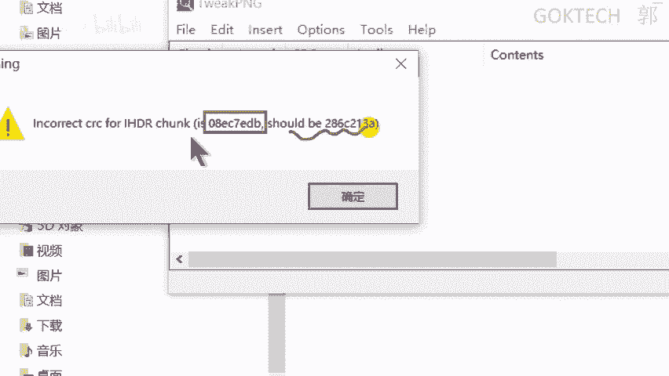

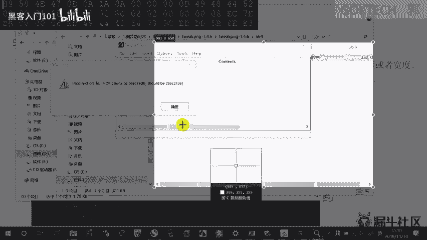

以下是其核心功能：
1.  **通道分离**：分离图片的RGB、HSV等颜色通道，信息可能藏在某个单一通道中。
2.  **最低有效位分析**：提取每个像素颜色值的最低位（LSB），并将这些比特位按规则组合，可能还原出隐藏数据。公式可以理解为：从每个像素通道（如R、G、B）的二进制值中取最后一位。
3.  **图像对比**：对两张看似相同的图片进行异或（XOR）、与（AND）、或（OR）等操作，找出细微差别。

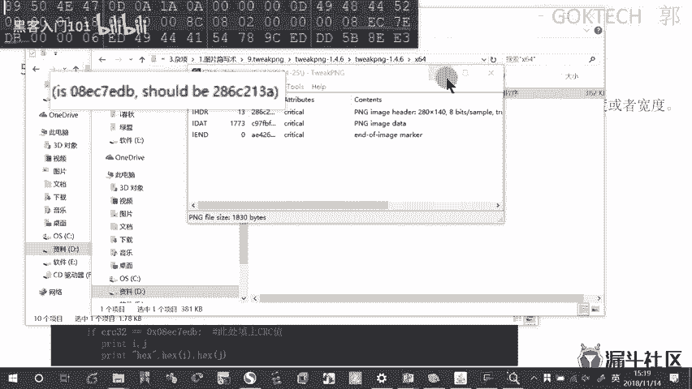

### LSB隐写提取

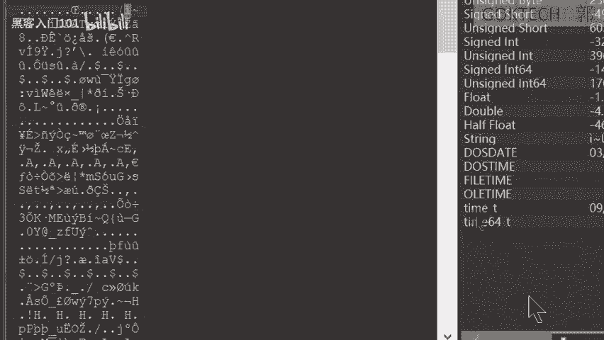

针对最低有效位（LSB）隐写，有专门的提取方法。

以下是提取LSB隐写信息的几种方式：
*   **使用Stegsolve**：在“Analyse”菜单中使用“Extract Data”功能。
*   **使用Python脚本**：例如 `zsteg` 工具（适用于PNG/BMP），在Kali中安装命令为：`gem install zsteg`
*   **运行自定义脚本**：需要Python环境。将脚本和图片放在同一目录，修改脚本中的目标文件名，然后在命令行运行：`python lsb_extract.py`

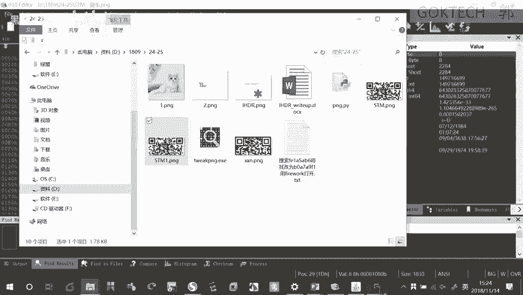

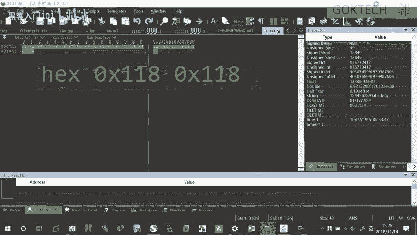

> **注意**：Python 2 和 Python 3 的脚本可能不兼容，请根据脚本要求使用对应版本的Python解释器。

## PNG文件结构修复 🔧

PNG图片的隐写有时会通过修改图像文件头部的关键参数（如图像高度、宽度）或校验值来实现，导致图片无法正常显示。

### 原理

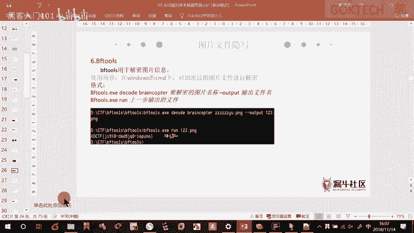

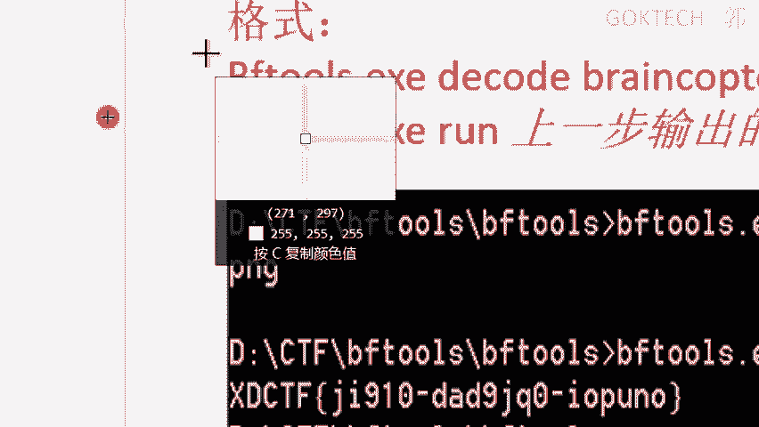

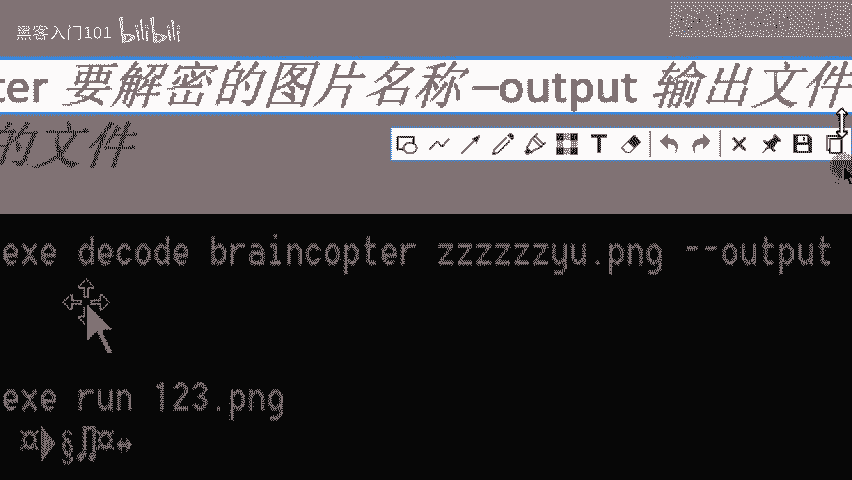

PNG文件头部不仅包含文件类型标识，还包含了**宽度**、**高度**以及**CRC校验值**等信息。图像生成时，会根据宽度和高度计算出一个校验值（如X1）。如果图像被修改（例如高度值被减半），校验值就会变为X2。使用工具校验时，用错误的宽度/高度算出的校验值X3与文件中存储的X2不匹配，从而报错。

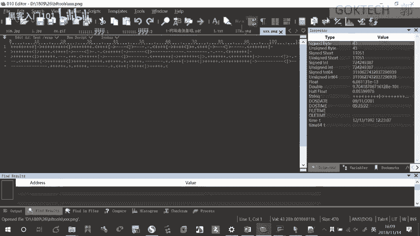

### 修复工具 (TweakPNG)

使用 `TweakPNG` 这类工具可以查看和修复PNG文件头信息。

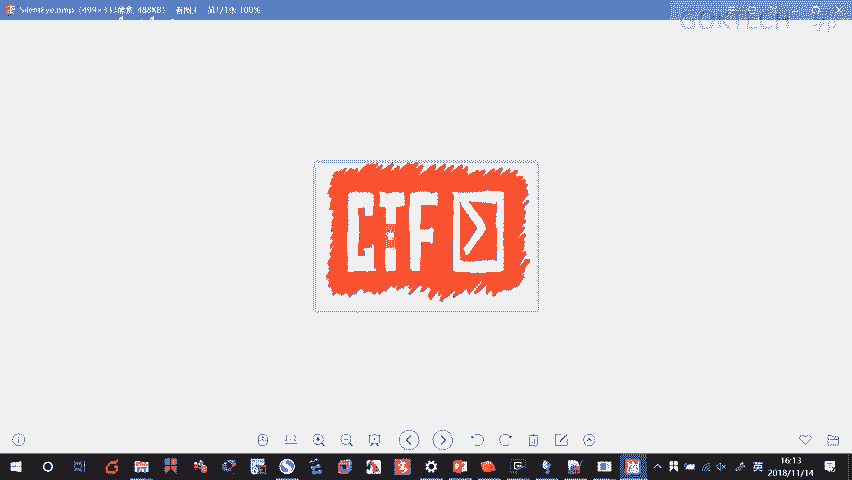

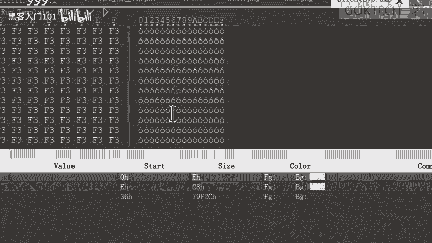

以下是修复步骤：
1.  用 `TweakPNG` 打开损坏的PNG图片，工具会提示CRC校验错误。
2.  错误信息会显示当前错误的校验值和理论正确的校验值。
3.  使用十六进制编辑器（如010 Editor）定位到CRC校验值所在位置（通常位于IHDR块之后），将其修改为正确的值。
4.  如果修改校验值后图片仍显示异常，则可能是**宽度或高度**被篡改。此时需要结合正确的CRC值，通过脚本暴力计算可能的正确宽高值。一个示例的Python脚本逻辑是：已知正确的CRC值，遍历可能的宽度或高度，直到计算出的CRC与已知的正确CRC匹配。

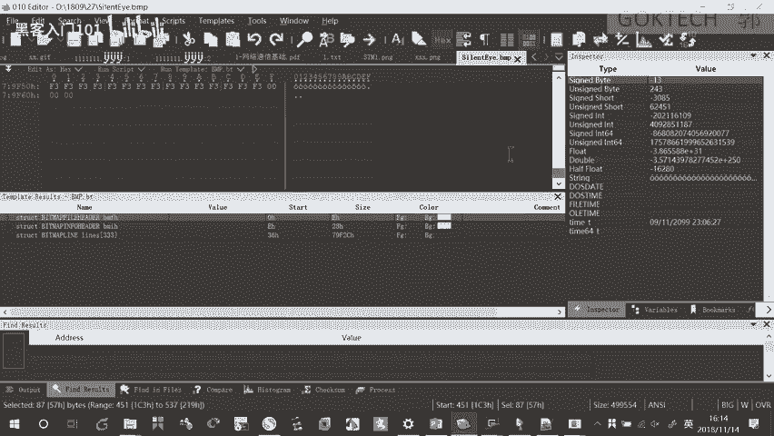

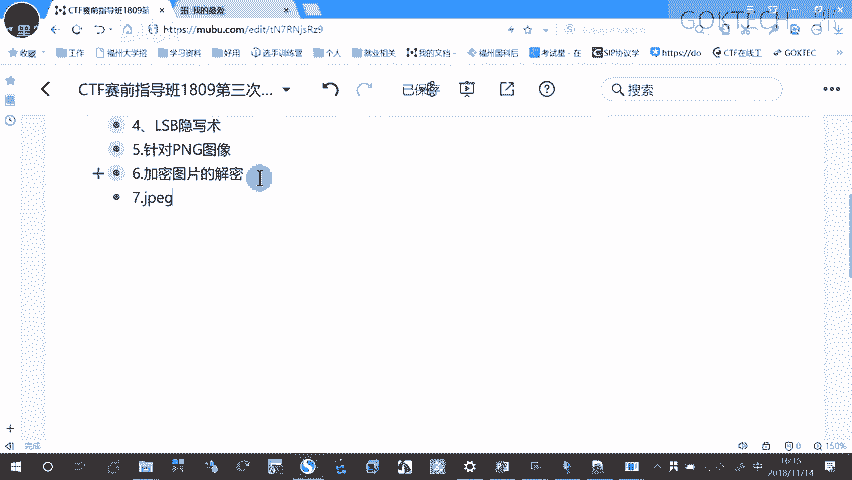

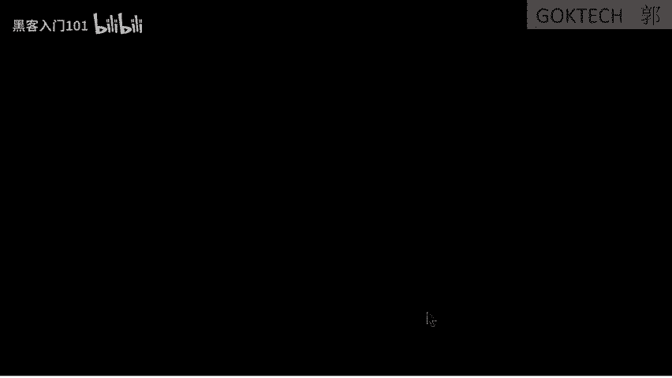

## 加密图片解密 🔐

有些图片隐写后还进行了加密，需要先解密才能看到隐藏信息。

### 工具解密

以下是针对不同加密方式的解密工具：
*   **BF Tools**：一个命令行工具，用于解密某些特定加密的图片。通常需要两步：
    1.  `bftools.exe decode braincopter 加密图片.png -o 输出文件.png`
    2.  然后运行生成的`输出文件.png`，它可能是一个文本或可执行文件，会显示flag。
*   **SilentEye**：一个图形化工具，可将隐藏的文字或文件从图片中分离出来。打开软件后，载入图片，选择“Decode”即可。
*   **JPEG加密分析**：对于JPEG图片，先用 `StegDetect` 分析其隐写加密方式。
    *   命令示例：`stegdetect -s 敏感度 图片名.jpg`
*   **根据加密方式选择工具**：
    *   **JP Hide**：使用 `JPHS`（JP Hide and Seek）的Windows版图形工具进行解密，需要输入密码。
    *   **F5**：使用Java编写的 `F5` 工具进行解密。需要在命令行运行，例如：`java Extract 图片.jpg -p 密码`
    *   **OutGuess**：在Linux环境下安装并运行 `outguess` 工具进行解密。

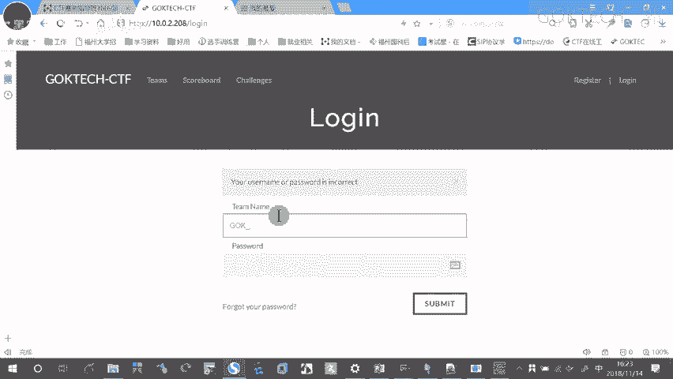

### 二维码处理

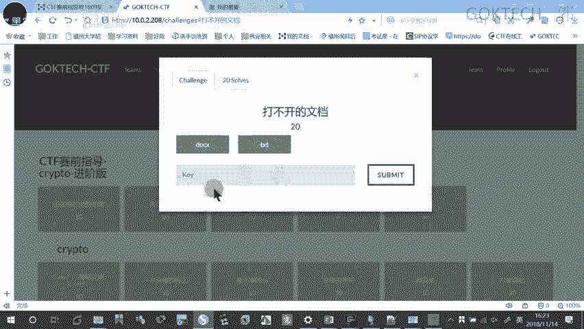

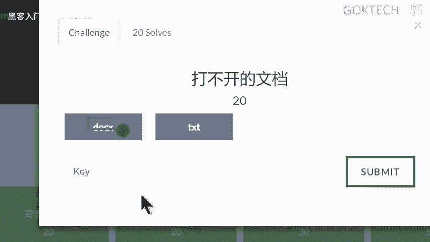

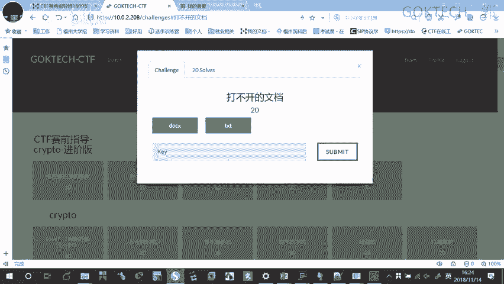

有时二维码会被破坏或缺少定位角标。

以下是处理方法：
1.  如果二维码缺少定位角标（三个角上的方块），可以使用图片编辑工具，从其他正常二维码上抠取定位角标，粘贴到缺失位置。
2.  使用二维码扫描工具（如手机微信、电脑上的“电脑二维码扫描神器”）进行扫描。

## 总结 📝

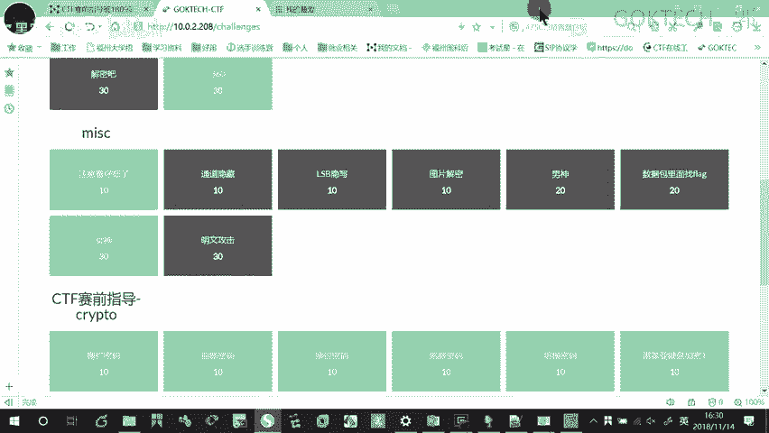

本节课中我们一起学习了CTF杂项中文件与图片隐写的关键技术。我们从**文件头分析**和**内容分离**入手，深入探讨了**图片隐写**的多种形式，包括图层/帧分解、信息查看、通道与LSB分析。我们还学习了如何修复被篡改的**PNG文件头**，以及如何解密**经过加密的图片隐写**。掌握这些工具和方法的核心在于理解其原理，并针对题目提示灵活运用。接下来，请通过实战练习来巩固这些技能。