# CTF夺旗赛教程：P13：CTF赛前指导杂项：压缩+流量分析

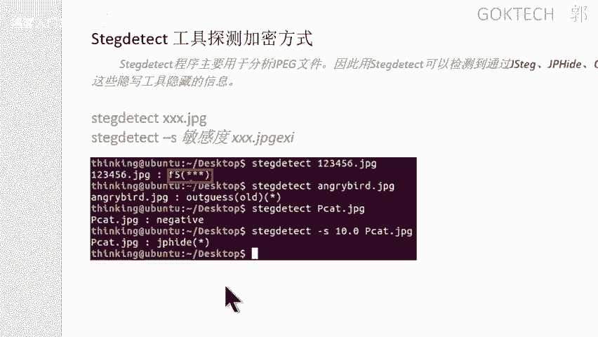

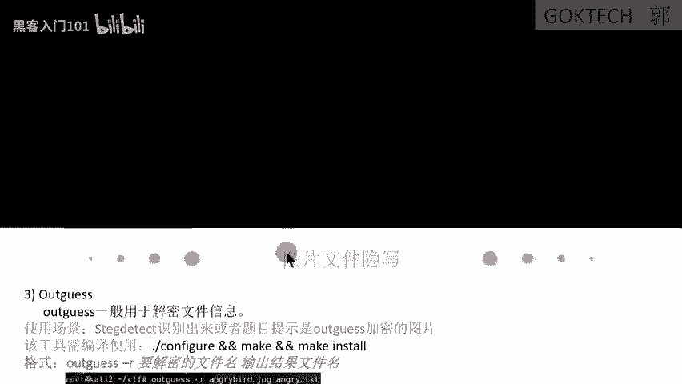

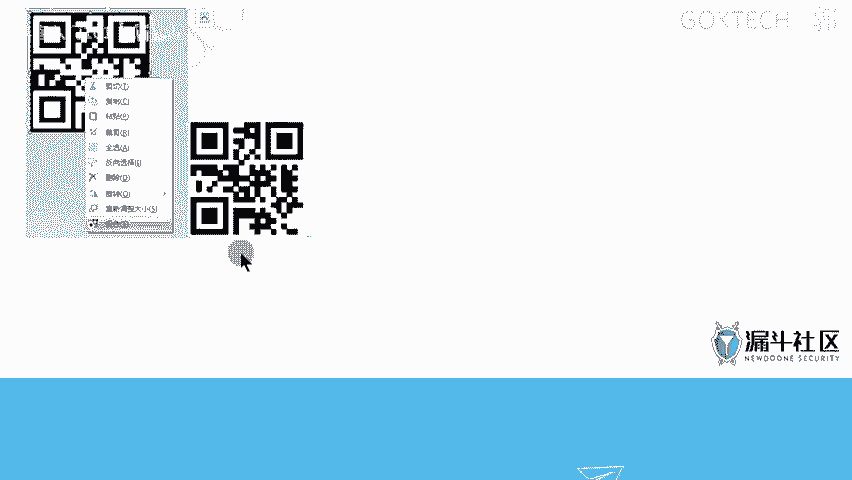


## 概述
在本节课中，我们将学习CTF杂项题目中两个重要的知识点：压缩包分析与网络流量分析。我们将探讨如何识别和处理伪加密、暴力破解、明文攻击等压缩包技术，以及如何使用Wireshark等工具分析网络数据包，从中提取关键信息或flag。

---

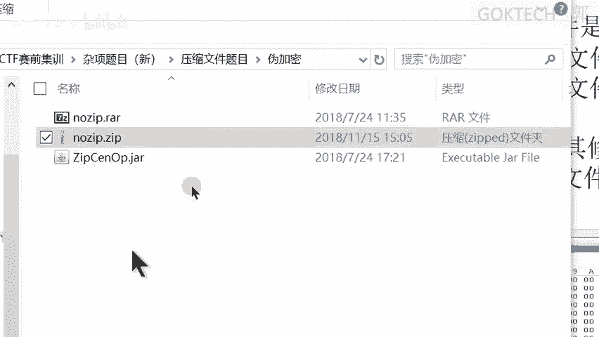

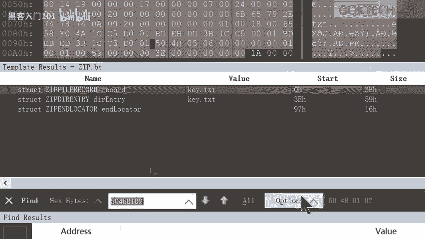

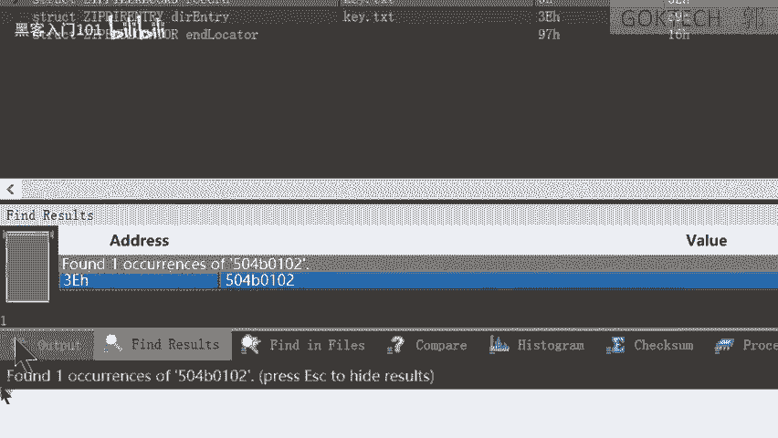

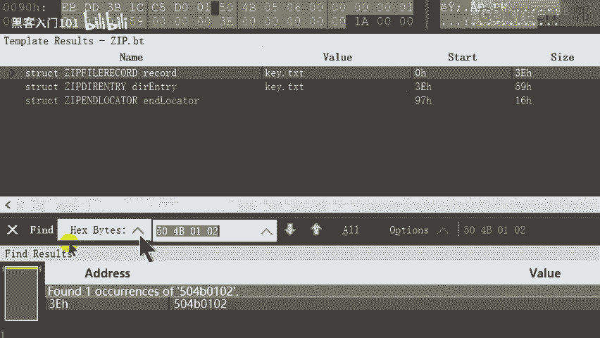

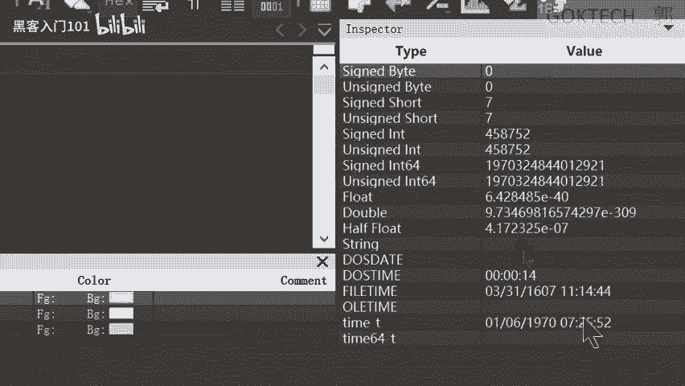

## 压缩包分析技术

上一节我们回顾了F5隐写等知识点，本节中我们来看看CTF中常见的压缩包相关题目。

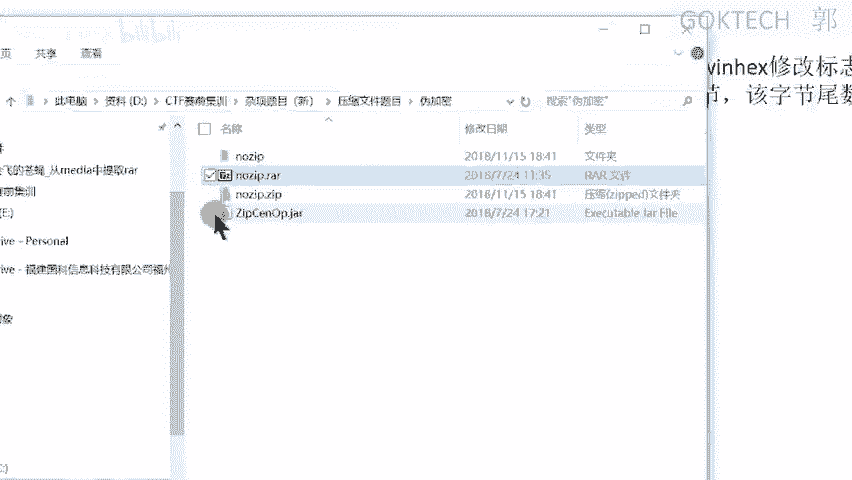

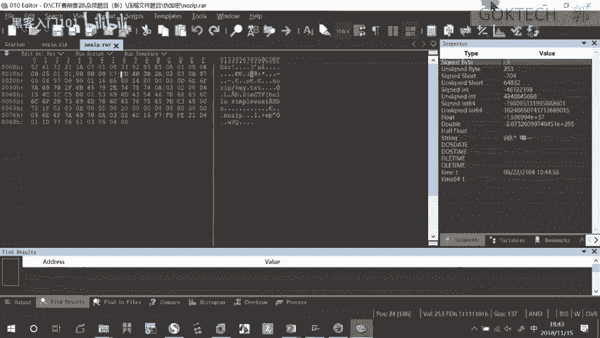

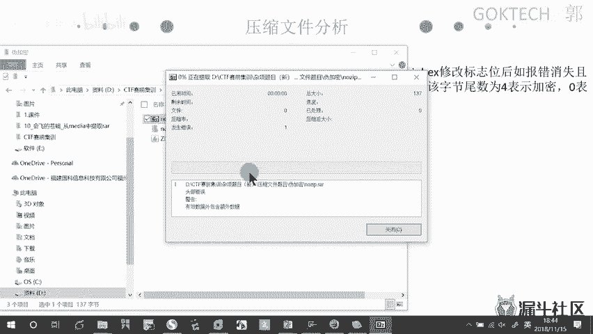

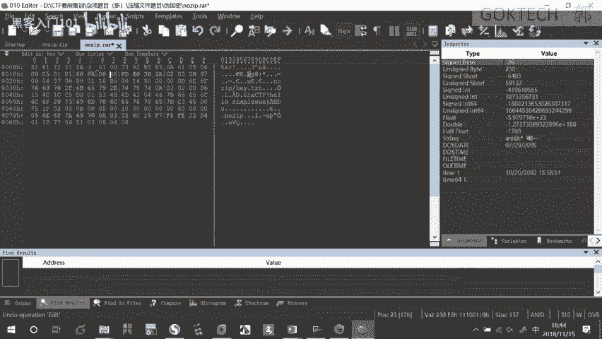

### 伪加密原理与修复
伪加密是指修改压缩包文件头中的特定标志位，使其在解压时要求输入密码，但实际上并未真正加密。早期CTF题目中考察较多。

**ZIP伪加密修复方法：**
1.  使用010 Editor等十六进制编辑器打开ZIP文件。
2.  查找文件头标志 `504B0102`（注意是0102，不是表示压缩包开始的0304）。
3.  在该标志后的第9和第10个字节（即全局加密标志位），将其值修改为 `00 00`。
4.  保存文件后即可正常解压。

**RAR伪加密修复方法：**
1.  使用010 Editor打开RAR文件。
2.  从文件开头（第一个字节）开始，找到第24个字节。
3.  将该字节的**低四位**修改为0（即确保该字节是 `0?` 的形式，`?` 代表任意值）。
4.  保存后尝试解压。如果仍报错，则可能是真加密，需要其他方法。

> **注意**：现代解压软件（如Bandizip、7-Zip新版本）可能已能自动识别并修复简单的伪加密。

### 压缩包暴力破解
当遇到真加密且无其他提示时，可能需要尝试暴力破解。以下是常用方法：

以下是常见的攻击类型：
*   **暴力破解**：遍历指定字符集（如数字、字母、符号）的所有可能组合。
*   **掩码攻击**：已知密码部分字符（如前缀或后缀），针对未知部分进行暴力破解。例如，已知密码前三位是`ABC`，后五位是数字，则掩码可设为 `ABC%%%%%`（`%`代表数字）。
*   **字典攻击**：使用预先准备好的密码字典进行尝试。

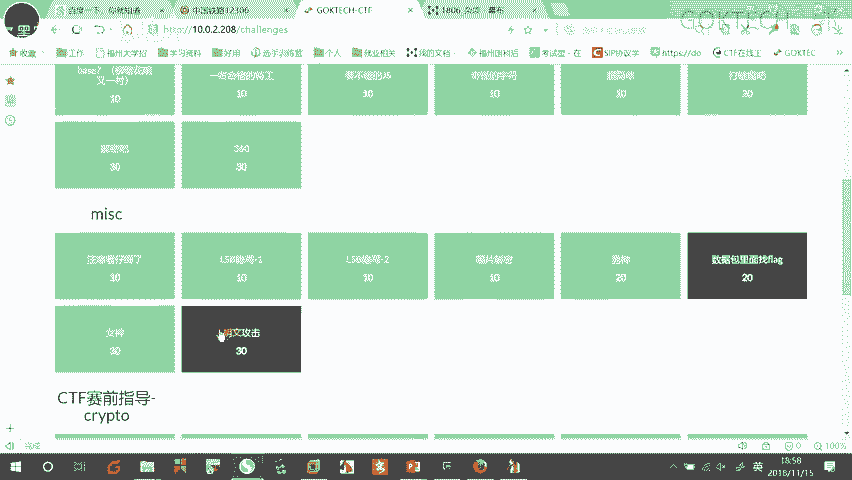

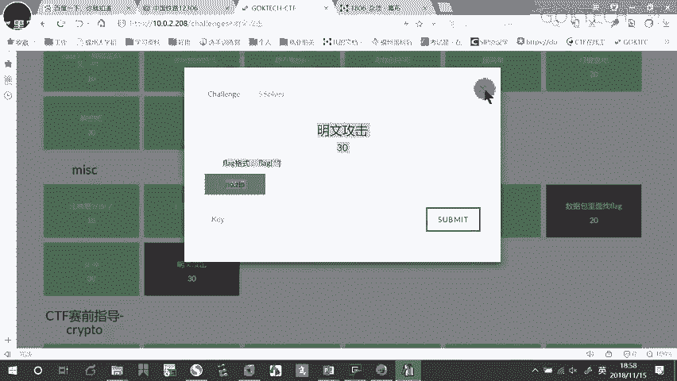

使用工具（如ARCHPR）时，需要正确设置字符集范围和密码长度，以提升破解效率。

### 明文攻击
明文攻击是一种已知部分加密文件明文内容时，利用其推测加密密钥的方法。

**操作步骤：**
1.  获取加密压缩包中某个已知明文文件（如`readme.txt`）。
2.  使用**与加密压缩包完全相同的压缩算法、字典大小、压缩等级**等参数，将该明文文件单独压缩成一个新的ZIP文件。
3.  在破解工具（如`pkcrack`）中，选择“明文攻击”模式，载入加密压缩包和刚生成的明文压缩包。
4.  工具会尝试利用两个压缩包中相同明文部分的差异，计算出加密密钥，从而解密整个压缩包。

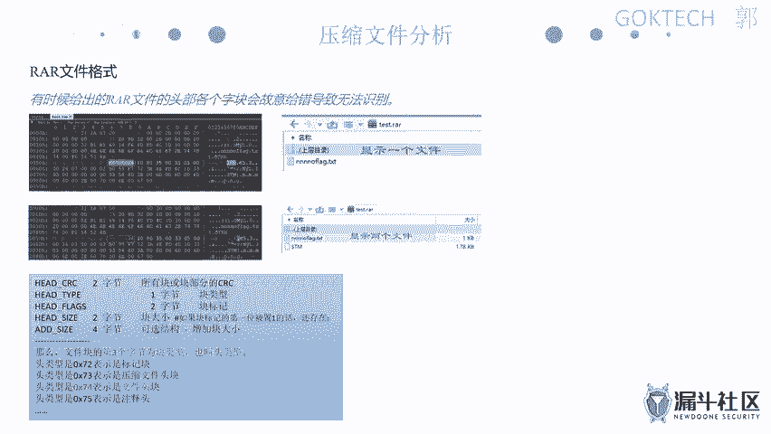

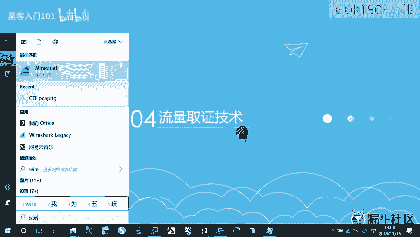

> **提示**：某些题目可能专门考察对`pkcrack`等特定明文攻击工具的使用。

### RAR文件块修复
有时题目会故意破坏RAR文件的文件块头，导致无法正常识别和解压。

**修复思路：**
1.  用十六进制编辑器分析文件，找到疑似被破坏的文件块起始位置。
2.  RAR文件块的第3个字节表示“块类型”，常见值有：`0x72`（标记块）、`0x73`（压缩文件头）、`0x74`（文件头）、`0x75`（注释头）等。
3.  根据上下文判断正确的块类型，修改该字节的值。
4.  保存后尝试用解压软件打开。

通常，修复后可能解压出图片、文档等进一步需要分析的文件。

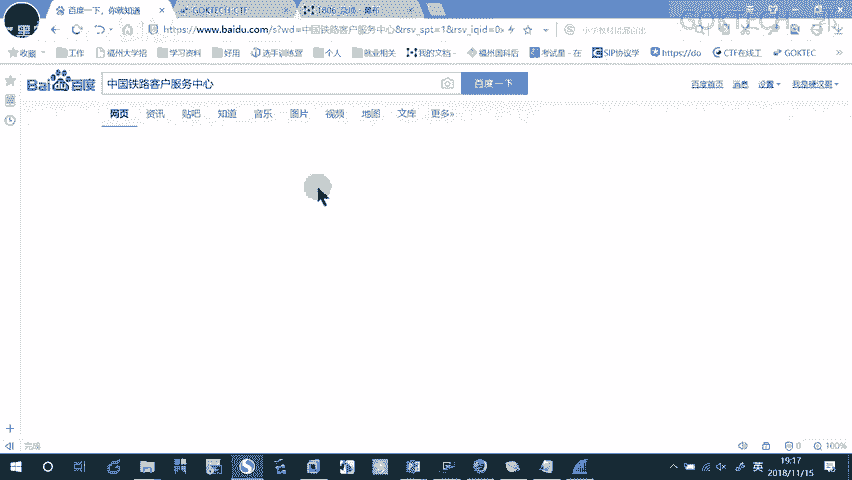


---

## 网络流量分析技术


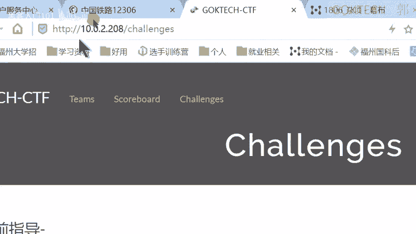

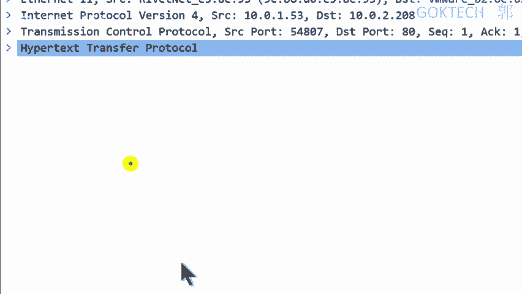

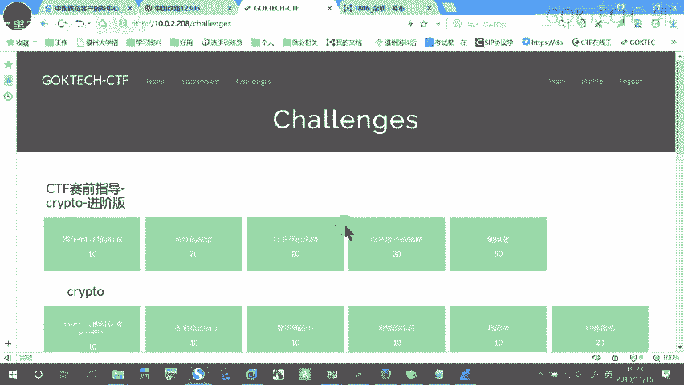

处理完压缩包，我们进入另一个重要领域：网络流量分析。这要求我们能够从捕获的数据包中还原通信过程，发现隐藏信息。

### Wireshark基础与过滤语法
Wireshark是强大的网络协议分析工具。分析流量时，熟练使用过滤表达式是快速定位关键信息的关键。

以下是常用的过滤表达式示例：
*   `ip.src == 10.0.1.53`：过滤源IP为`10.0.1.53`的数据包。
*   `ip.dst == 10.0.2.208`：过滤目的IP为`10.0.2.208`的数据包。
*   `ip.src == 10.0.1.53 and ip.dst == 10.0.2.208`：过滤特定会话的数据包。
*   `tcp.port == 80`：过滤TCP协议且端口为80（HTTP）的数据包。
*   `http.request.method == “GET”`：过滤HTTP GET请求。
*   `tcp contains “flag”`：过滤TCP数据段中包含“flag”字符串的数据包。
*   `http contains “key”`：过滤HTTP协议中包含“key”字符串的数据包。

使用“统计” -> “协议分级”功能，可以快速了解流量中主要包含哪些协议，帮助确定分析方向。

### 数据流追踪与还原
网络通信通常是双向的。Wireshark的“追踪流”功能可以将一次完整的TCP或HTTP会话的数据重组并显示出来，这对于分析交互过程非常方便。

**分析步骤：**
1.  选中一个感兴趣的数据包（如一个HTTP请求或TCP SYN包）。
2.  右键点击，选择“追踪流” -> “TCP流”或“HTTP流”。
3.  在弹出的窗口中，可以看到客户端与服务器之间的完整对话内容，可能包含命令、响应、上传的数据等。
4.  从中寻找flag、密钥或可疑的编码数据（如Base64）。

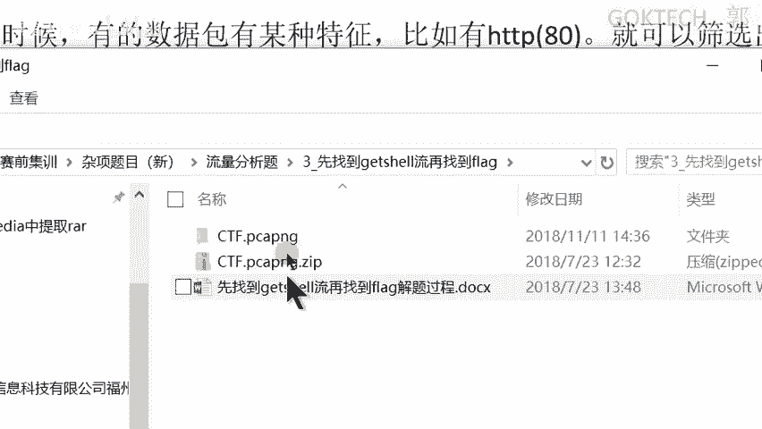

### 文件提取与对象导出
攻击者经常通过网络传输文件。Wireshark可以提取这些文件。

**方法一：手动提取**
1.  发现传输文件的数据包（通常数据段较大）。
2.  在数据包详情面板，展开对应协议的数据层，找到包含文件数据的部分。
3.  右键点击“导出分组字节流”，保存为文件。

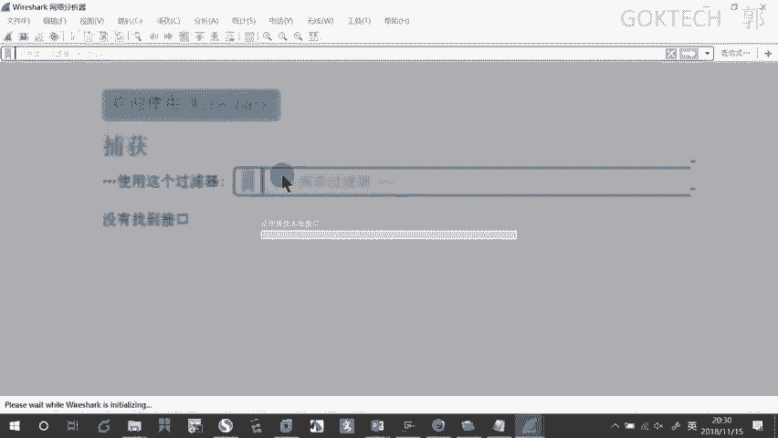

**方法二：导出HTTP对象**
1.  点击“文件” -> “导出对象” -> “HTTP”。
2.  在弹出的列表中，可以看到所有捕获的HTTP传输文件（如图片、脚本、文档）。
3.  选择可疑或较大的文件，将其保存到本地进行分析。

### 特殊协议流量分析
CTF中常考察一些特定协议的流量，这些协议可能以明文传输敏感信息。

*   **FTP/Telnet**：传统文件传输和远程登录协议，认证信息和命令常为明文。
*   **SMTP/POP3**：邮件发送和接收协议，可能包含明文用户名、密码或邮件内容。
*   **DNS**：域名查询协议，有时会用于数据隐蔽传输（DNS隧道）。

分析这类流量时，直接查看数据包的应用层数据部分，往往能有所发现。

### USB流量分析
USB设备（如键盘、鼠标）的通信流量也可以被捕获和分析，从而还原用户的输入操作。

**键盘流量分析：**
1.  USB键盘数据包通常长度为8字节，击键信息集中在第3个字节。
2.  需要将捕获的`.pcap`文件中`USBHID`或`USB CAPTURE DATA`部分的数据导出。
3.  编写或使用现有脚本（如`tshark`命令配合Python脚本），根据`USB HID`键值映射表，将十六进制数据还原为实际的按键字符。
    ```bash
    # 示例：使用tshark提取USB键盘数据
    tshark -r usb.pcapng -T fields -e usb.capdata > usbdata.txt
    ```
4.  注意区分大小写和特殊键（如Shift）。有时输入内容可能是五笔等编码，需要相应解码。

**鼠标流量分析：**
1.  USB鼠标数据包通常为4字节，包含按键状态和X/Y轴位移信息。
2.  提取数据后，通过脚本解析出坐标变化序列。
3.  将坐标点绘制成图，可能得到flag或提示信息。

> **提示**：USB流量分析通常需要结合具体题目的上下文和提示来判断设备类型和编码方式。

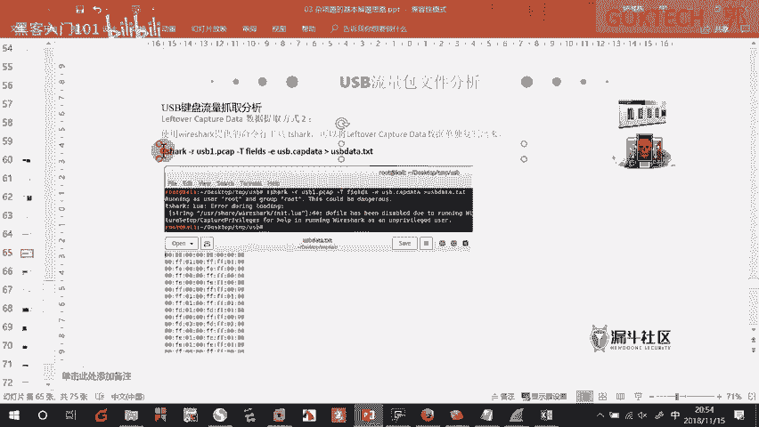

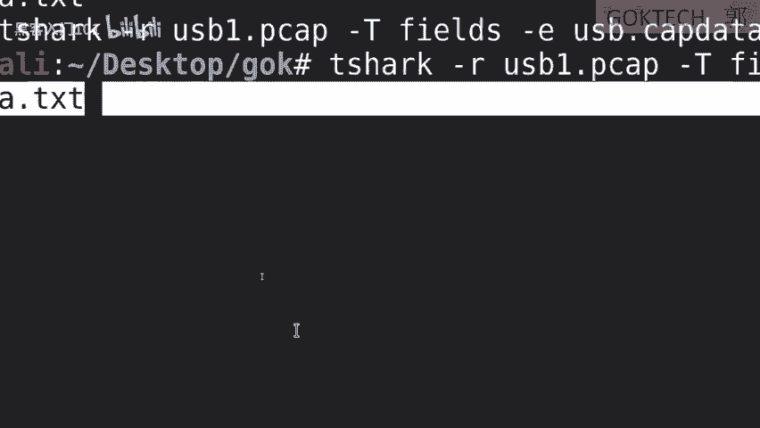

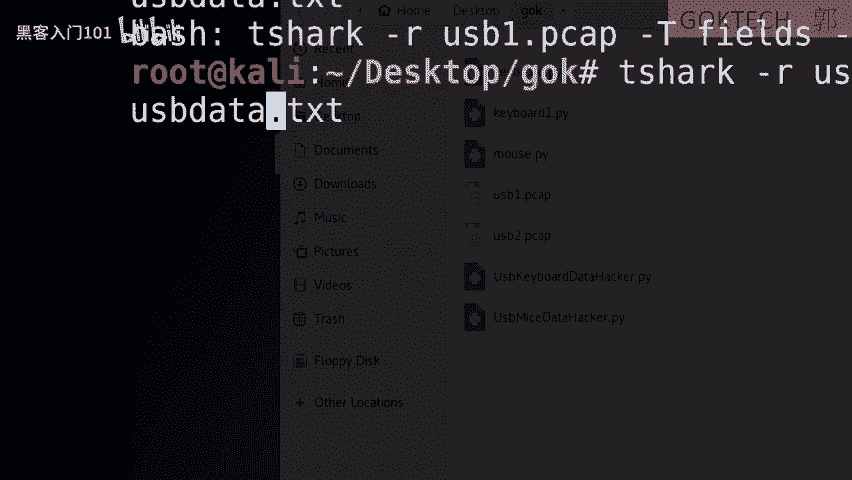

---

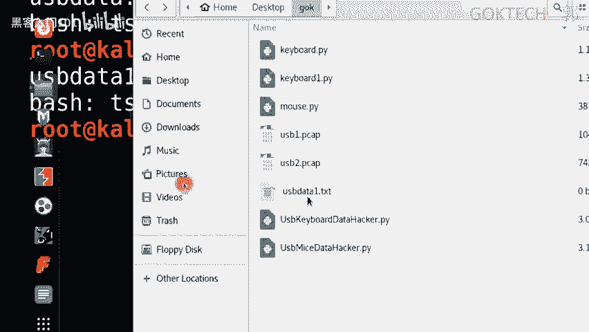

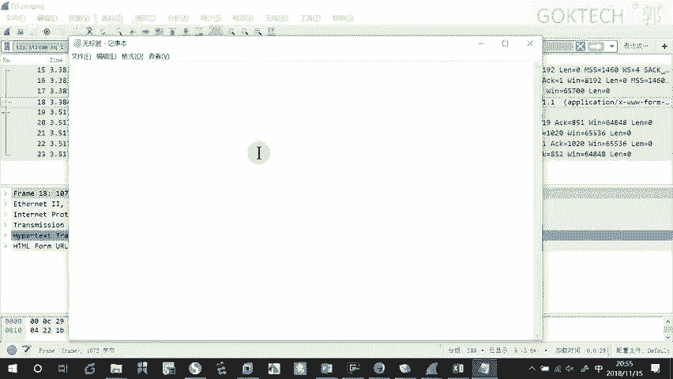

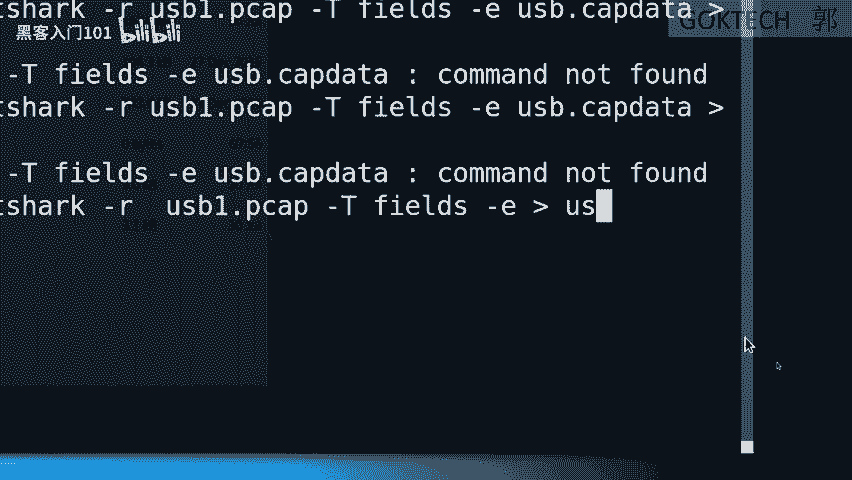

## 总结
本节课我们一起学习了CTF杂项中压缩包和流量分析的核心技术。

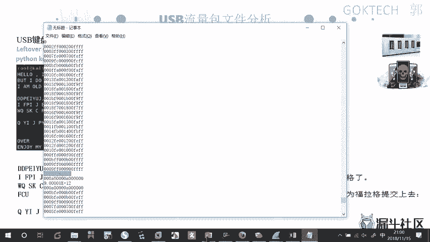

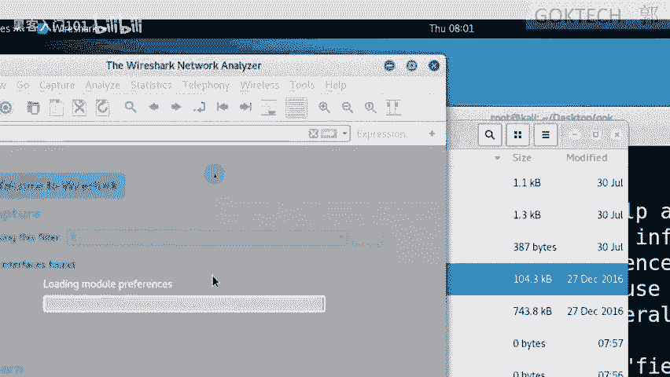

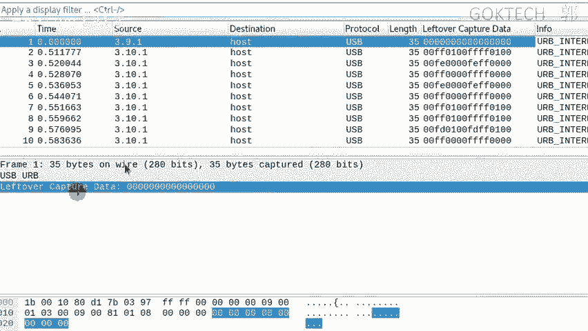

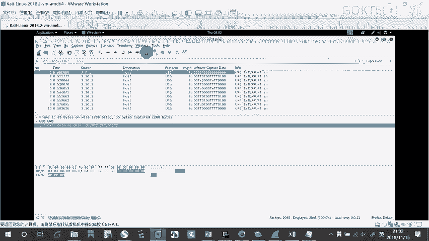

在压缩包部分，我们掌握了：
*   识别和修复**伪加密**（ZIP/RAR）。
*   使用工具进行**暴力破解**和**字典攻击**。
*   在已知部分明文时发动**明文攻击**。
*   修复被破坏的**RAR文件块**。

在流量分析部分，我们学习了：
*   使用**Wireshark过滤表达式**精准定位数据包。
*   **追踪和还原TCP/HTTP流**，分析完整会话。
*   从流量中**提取传输的文件**。
*   分析**FTP、Telnet、SMTP**等明文协议。
*   解析**USB键盘和鼠标流量**，还原用户输入和操作轨迹。

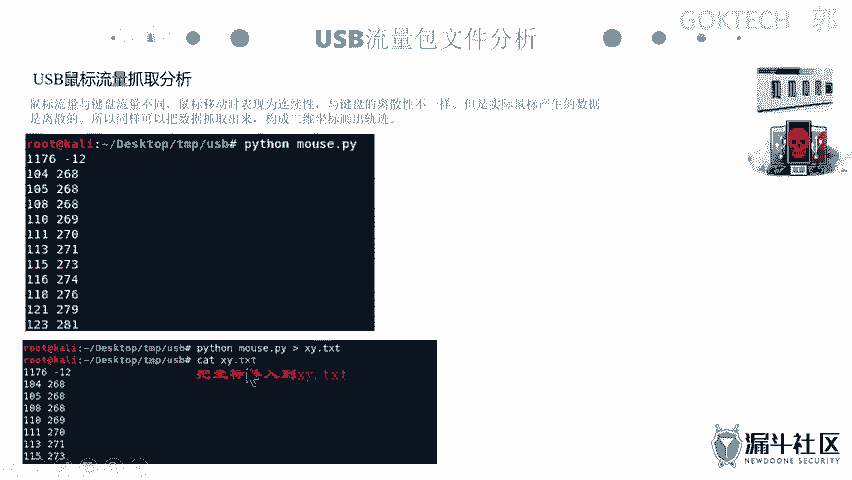

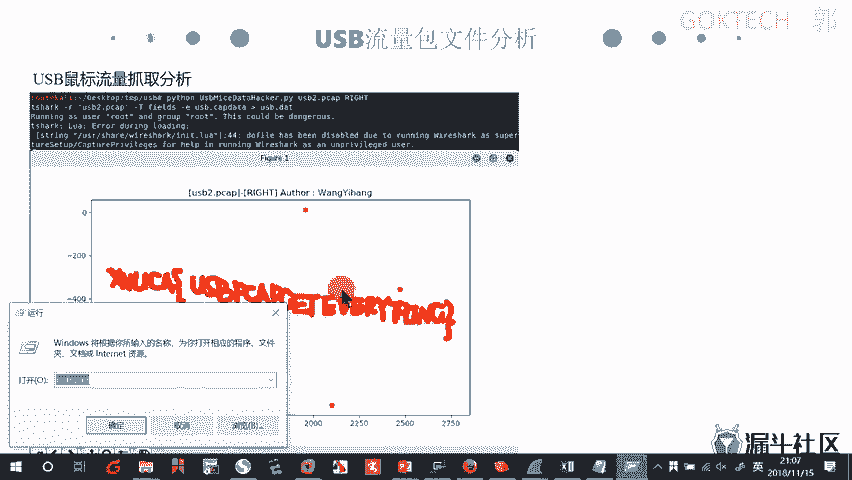

这些技能是解决CTF杂项题目的基础，需要通过大量练习来巩固。请务必完成提供的练习题，并尝试独立分析和解决遇到的问题。