# CTF入门教程：1：CTF赛制与信息安全概述 🔐

在本节课中，我们将要学习CTF比赛的基本概念以及它所处的广阔领域——信息安全。我们将从宏观角度了解信息安全的重要性，并通过真实案例感受网络世界的攻防对抗，最后探讨学习信息安全可以带来的机遇。

## 什么是信息安全？🛡️

我们所说的CTF比赛，涉及到的知识点都属于信息安全方向的范畴。信息安全本身包含非常多的方向，例如传统的网络安全、新兴的云安全、Web安全、工控安全等等。在学习时，树立一个清晰的知识体系框架非常重要，这有助于我们将零散的知识点系统化地填充进去，而非死记硬背。

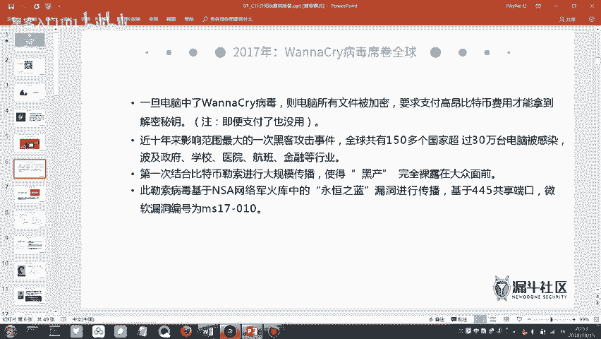

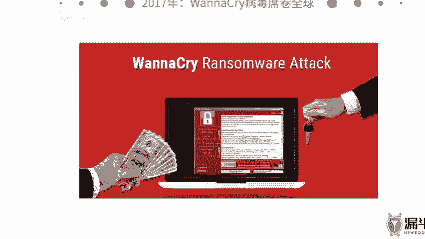

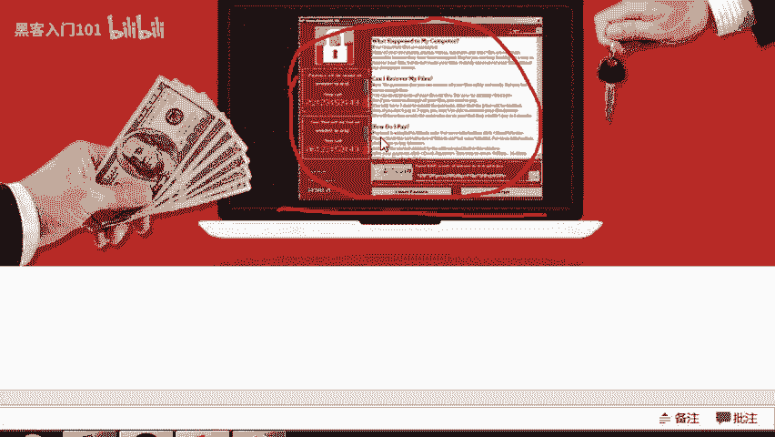

在正式进入课程前，我们先了解两个社区资源。第一个是我们的安全团队“漏斗社区”的微信公众号，会推送信息安全相关的技术文章和CTF赛题解析。第二个是我们在“FreeBuf”安全网站上的专栏，也会持续更新技术内容，欢迎大家关注。

接下来，我们正式进入培训课程。首先要明白一个核心概念：什么是信息安全？很多人可能会联想到黑客或电信诈骗。国际标准化组织ISO对信息安全的官方定义是为了保护数据。但这个定义比较枯燥，我们可以通过真实事件来理解。

## 真实世界中的信息安全事件 💥

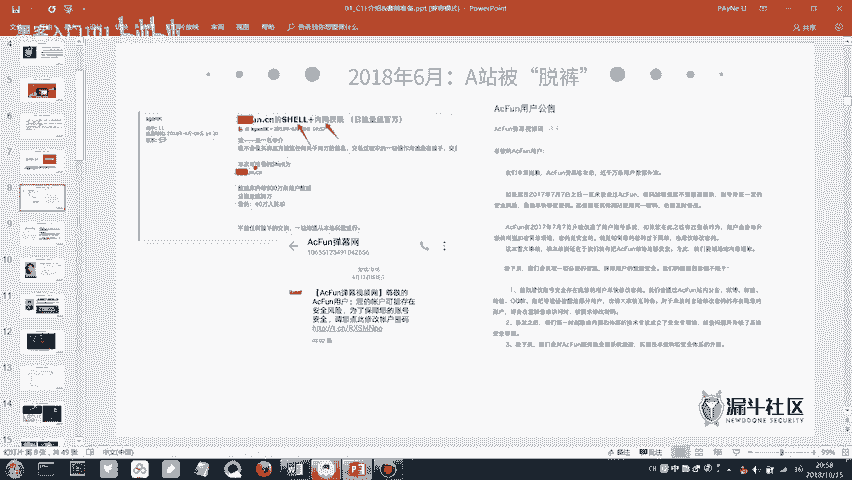

以下是两个著名的信息安全事件，它们能帮助我们更直观地理解信息安全的内涵。

### 1. WannaCry勒索病毒
2017年爆发的WannaCry病毒会加密受害者电脑中的文件，并要求支付比特币来解密。它给全球许多政企单位造成了巨大损失，甚至影响到了一些高校学生的毕业论文资料。该病毒会显示一个倒计时界面，威胁用户在规定时间内支付赎金，否则文件将被永久删除。事实上，即使支付了赎金，文件也往往无法恢复。

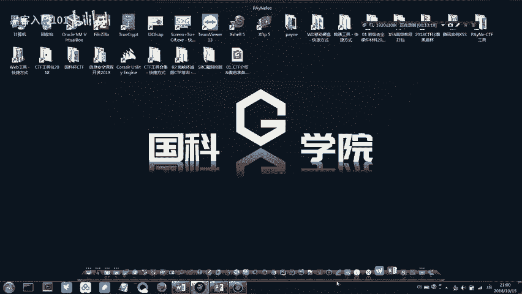

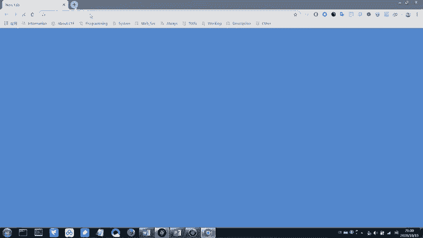

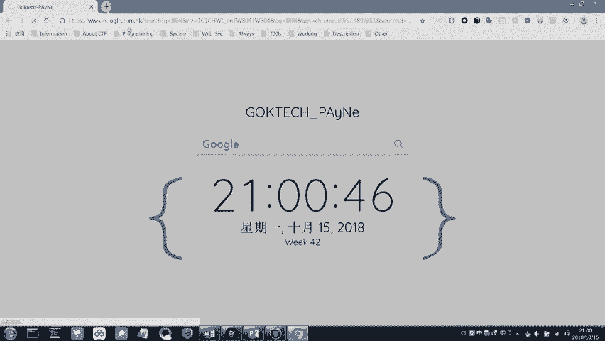

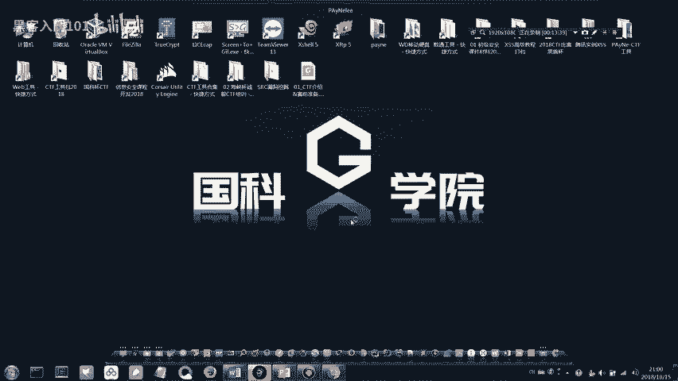

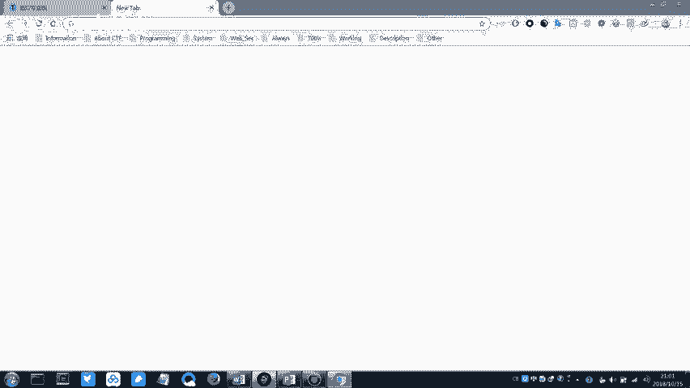

### 2. A站（AcFun）数据泄露
二次元视频网站A站曾发生数据库被盗事件。数据库对于一个网站至关重要，存储了多年积累的所有用户数据。这些数据一旦泄露，黑客会进行“撞库”攻击——即用泄露的用户名和密码，去批量尝试登录该用户在其他网站（如微信、QQ、邮箱）的账号。因为很多人习惯在不同平台使用相同密码，这会导致连锁式的账号失窃。当时，A站约800万条用户数据在暗网标价40万人民币出售。

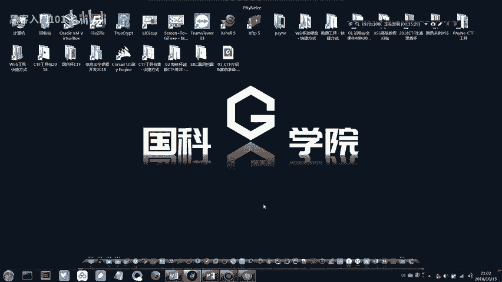

上述事件引出了一个概念：**暗网**。暗网是普通搜索引擎无法抓取到的深层网络，具有高度隐匿性，常使用`.onion`等特殊域名，其流量通过“洋葱路由”等技术难以追踪。暗网中充斥着各种非法交易。比特币等加密货币因其匿名性，常被用作暗网中的交易货币。需要强调的是，暗网内容复杂，大家了解即可，切勿深入探索。

通过这些攻击事件，我们可以理解信息安全的核心：攻与防的持续对抗。防御技术不断提升，攻击手段也随之进化，共同构成了信息安全领域的动态图景。

## 信息安全的重要性与国家战略 🌍

信息安全是**网络空间安全**的核心内容。我们可以将海、陆、空、天之外的网络世界视为“第五空间”。正因如此，国家领导人提出了“没有网络安全就没有国家安全”的重要论断。信息安全事件的影响已从个人层面上升至国家战略高度。

一个著名案例是“震网”病毒事件。美国和以色列的国家级安全团队通过网络攻击，破坏了伊朗地下核设施用于浓缩铀的离心机，严重迟滞了其核计划。这预示着未来的国家间较量可能很大程度上在网络空间展开。

国家对网络安全的重视也体现在各类竞赛中，例如由公安部发起的“网鼎杯”CTF大赛。这是国内规模最大的网络安全赛事，成绩优异者有机会被公安部特招或受到顶尖互联网公司的青睐。我们的课程目标，正是帮助大家打好基础，备战省级CTF赛事，这是一个非常切实可行的起点。

## 白帽子：信息安全领域的守护者 👨💻

在信息安全领域，站在防御一方、维护网络正义的从业者被称为**白帽子**；相反，进行非法攻击破坏的则被称为黑帽子。

国内顶尖的白帽子代表包括：
*   **吴翰清（道哥/刺总）**：阿里巴巴首席安全科学家。传奇事迹包括在面试时黑掉阿里内部网络以证明实力，以及通过“友好”地提醒同事邮箱密码过于简单，从而推动了阿里对信息安全的高度重视。
*   **余弦（钟晨鸣）**：前知道创宇技术VP，404实验室创始人，Web前端安全领域的顶尖专家。著有《Web前端黑客技术揭秘》，后创立专注于区块链安全的“慢雾科技”。

他们的故事告诉我们，掌握信息安全技能，可以走上一条充满挑战与荣耀的正道。

## 学习信息安全可以做什么？🚀

掌握了信息安全技能后，我们可以参与多种有价值的活动：

**1. 提交漏洞获取奖励**
许多公司设有**SRC（安全应急响应中心）**，白帽子可以向其提交旗下产品（如网站、APP）的安全漏洞，并获得现金或实物奖励。例如360SRC、漏洞盒子、腾讯SRC等平台。这不仅能锻炼技术，还能带来实际收益。

**2. 参加各类安全竞赛**
除了CTF比赛（如省赛、国赛、网鼎杯、世界赛），还有由厂商举办的比赛（如百度杯）。经常参与比赛是快速提升技能、获取奖金和荣誉的好方法。

**3. 参与技术交流**
可以参加像**Black Hat（黑帽大会）**、**KCon**这样的全球或国内顶级安全技术峰会，与业界精英交流，了解最前沿的安全技术。

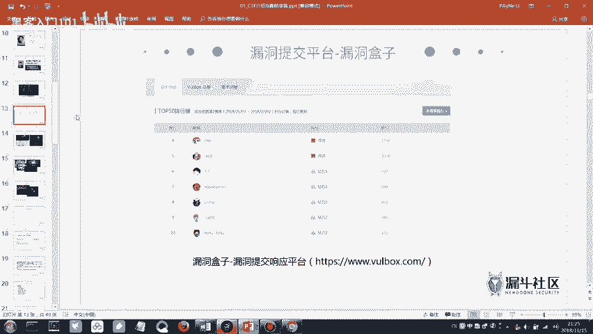

**4. 获得职业发展**
信息安全领域有明确的职业路径，例如**安全服务工程师**、**渗透测试工程师**等岗位需求旺盛。相关招聘信息可以在专业安全招聘网站查看，其技能要求也为我们指明了学习方向。

## 推荐资源与总结 📚

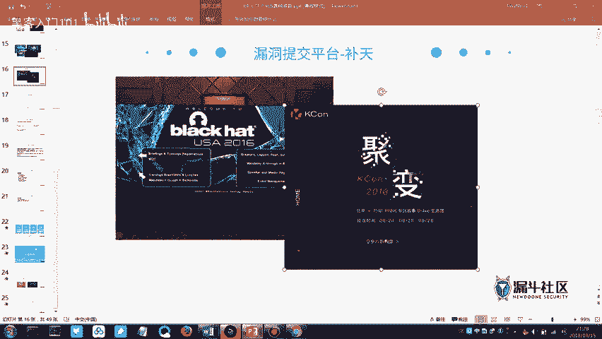

如果你对信息安全技术产生兴趣，可以从以下资源开始深入学习：
*   **书籍**：《白帽子讲Web安全》、《Web前端黑客技术揭秘》、《Metasploit渗透测试指南》等。
*   **导航网站**：一些安全导航站汇总了大量学习网站、工具、博客链接，是宝贵的学习入口。

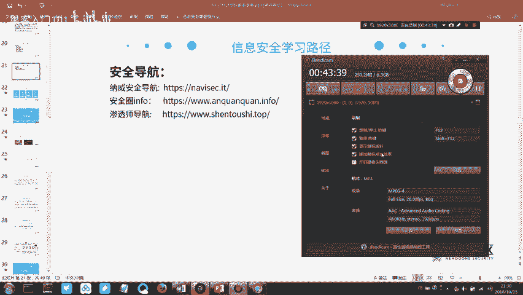

本节课中我们一起学习了CTF与信息安全的基本概念。我们了解了信息安全在当今世界的重要性，认识了网络攻防的真实案例，明确了“白帽子”的职责与榜样，并看到了学习信息安全后广阔的实践与职业前景。从下节课开始，我们将逐步深入CTF比赛的具体知识和工具使用。