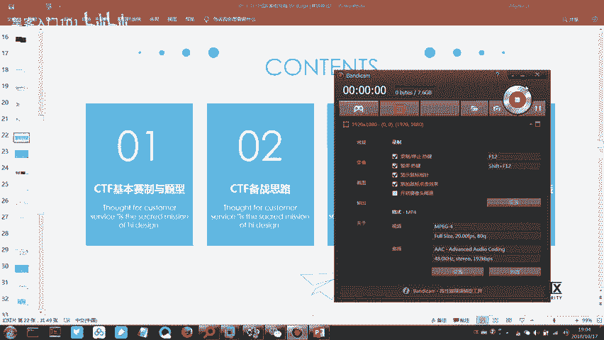
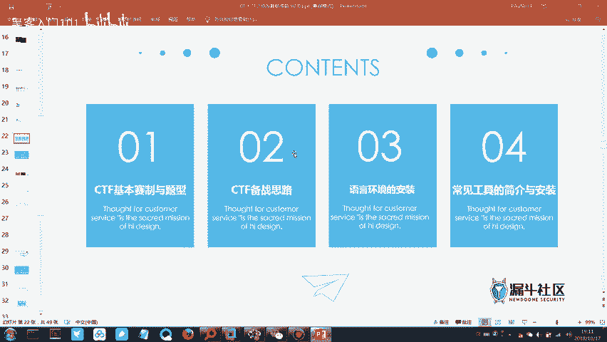
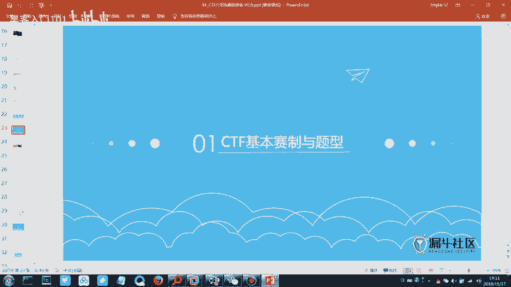
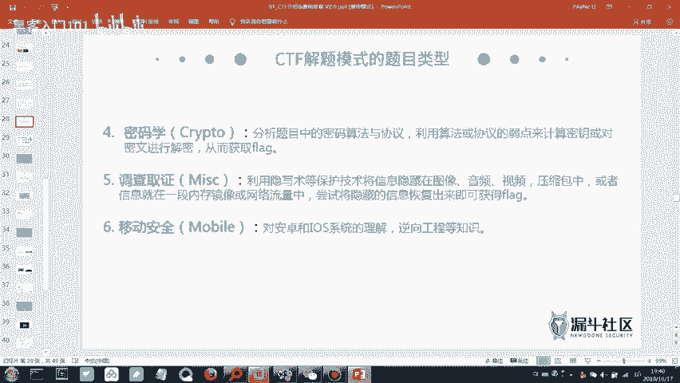
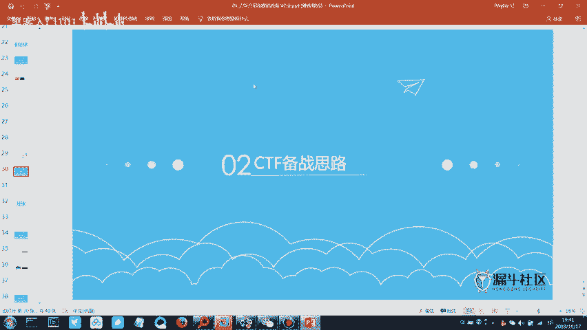

# CTF入门教程：2：CTF赛制与工具介绍

在本节课中，我们将要学习CTF比赛的基本赛制、常见题型以及备赛思路，并介绍一些必备的工具和环境。

## 概述

上节课我们介绍了信息安全的基本概念和行业趋势。本节课中，我们正式进入CTF夺旗赛的学习模块。我们将首先了解CTF是什么，其比赛形式和常见题型，然后梳理针对不同题型的备赛思路，最后介绍并安装一些核心的编程环境和工具。

## CTF赛制与题型介绍

上一节我们介绍了信息安全，本节中我们来看看CTF比赛的具体规则和题目类型。

### CTF基本概念

CTF的全称是**Capture The Flag**，中文译为“夺旗赛”。比赛目标是尽可能多地获取`flag`。`flag`通常是一段特定格式的字符串，例如`flag{this_is_a_flag}`。

比赛方会部署题目服务器，选手通过外网访问平台解题。每道题目对应一个`flag`，提交正确的`flag`即可获得相应分数。题目难度不同，分值也不同。最终根据总分排名。

### 比赛模式

CTF比赛主要有以下几种模式：

以下是三种主要的比赛模式：
*   **解题模式（Jeopardy）**： 经典模式。选手在题目列表中选择题目进行解答，获取`flag`并提交得分。题目分值会随时间推移而降低，第一个解出题目的队伍（一血）通常有额外加分。
*   **攻防模式（Attack-Defense）**： 每个队伍维护自己的服务器（存在漏洞），同时攻击其他队伍的服务器。在获取他人`flag`的同时，也要防御自己的服务器不被攻破。此模式强调攻击与防御的平衡。
*   **综合渗透模式**： 类似于解题模式中的“外部安全”题目升级版。选手攻击一个或多个由比赛方提供的、模拟真实环境的靶机或网络，发现漏洞并获取`flag`。通常没有队伍间的互相攻击。

本次省级比赛的初赛为线上解题模式，决赛通常上午为解题模式，下午为综合渗透模式。决赛环境通常为内网，无法访问外部互联网。

### 题目类型

CTF题目涵盖多个技术领域，主要分为以下几类：

以下是六种主要的题目类型：
*   **外部安全（Web）**： 考察网站相关的安全漏洞。例如：**SQL注入**、**跨站脚本（XSS）**、文件上传漏洞、代码审计等。解题需要理解Web应用的工作原理和常见漏洞的利用方法。
*   **逆向工程（Reverse Engineering）**： 考察对二进制程序的分析能力。给出一个可执行文件（如`.exe`, `.elf`），要求分析其程序逻辑，找到隐藏的`flag`。可能需要使用反汇编、调试等技术。
*   **二进制漏洞利用（Pwn）**： 考察底层软件漏洞的发现和利用能力。通常给出一个存在漏洞（如缓冲区溢出）的服务程序，选手需要编写利用代码（Exploit）来获取服务器权限或直接读取`flag`。这是难度较高的题型。
*   **密码学（Crypto）**： 考察密码学相关知识的应用。题目可能涉及古典密码、现代对称/非对称加密、编码（如Base64）或哈希算法（如MD5）。解题需要对加密算法进行分析或破解。
*   **杂项（Misc）**： 内容非常广泛且“杂乱”的题型。可能涉及信息隐写（图片、音频、视频中隐藏信息）、流量分析、取证分析、编程解题等。它考察综合能力和知识广度，通常是入门首选。
*   **移动安全（Mobile）**： 主要考察Android或iOS应用的安全分析，可视为逆向工程在移动平台的延伸。例如分析APK文件，找出逻辑漏洞或硬编码的`flag`。

### 难度排序与备赛思路

对于初学者，建议按照由易到难的顺序进行学习和备赛。

以下是建议的学习路径：
1.  **杂项（Misc）**： 入门最佳选择，技术门槛相对较低，通过多刷题可以快速积累经验和解题思路。
2.  **密码学（Crypto）**： 需要记忆和理解一些常见的编码、加密方式，配合工具使用，上手较快。
3.  **外部安全（Web）**： 知识点较多，但拥有成熟的学习体系和大量实践资源（如靶场），是CTF的核心题型之一。
4.  **逆向工程（Reverse）**： 需要较强的编程基础和汇编语言理解，学习曲线较陡。
5.  **二进制漏洞利用（Pwn）**： 难度最高，需要深厚的系统底层知识和漏洞利用技巧。

由于本次备赛时间有限，我们将把学习重点放在**杂项、密码学和外部安全**这三个题型上。掌握这三类题目，在省级比赛中已具备很强的竞争力。

## 必备环境与工具介绍

了解了赛制和题型后，本节中我们来看看需要准备哪些工具和环境来辅助我们解题。

我们的课程主要包含以下四个模块：
1.  CTF赛制与题型介绍（已完成）
2.  CTF备赛思路（已介绍）
3.  语言环境安装
4.  常用工具安装

接下来，我们开始安装第三和第四模块的内容。

### 语言环境安装

以下是三种必须安装的编程语言运行环境：
*   **Java环境（JRE/JDK）**： 许多CTF工具（如一些逆向、反编译工具）是基于Java开发的，需要Java环境才能运行。
    *   安装方法：从Oracle官网或OpenJDK项目下载安装包进行安装。
*   **Python环境**： CTF中最常用的脚本语言，用于编写解题脚本、进行密码爆破、处理数据等。
    *   安装方法：从Python官网下载安装包。建议安装Python 3.x版本。安装时务必勾选“Add Python to PATH”。
*   **PHP环境**： 主要用于Web题目本地调试，或运行一些PHP写的题目脚本。
    *   安装方法：可以从PHP官网下载并配置，但更推荐使用集成环境（如XAMPP、PHPStudy）一键安装Apache、PHP和MySQL。

### 常用工具安装

以下是两个至关重要的工具：
*   **虚拟机软件（VMware / VirtualBox）**： 用于创建隔离的测试环境。可以在虚拟机中安装靶场系统（如Kali Linux, Ubuntu），避免对宿主机造成影响。
    *   **VMware Workstation Player** 是功能强大的商用软件（有免费个人版）。
    *   **VirtualBox** 是开源免费的替代品。
*   **抓包与代理工具（Burp Suite）**： Web安全测试的“瑞士军刀”。主要用于拦截、查看和修改浏览器与服务器之间的HTTP/HTTPS流量，是进行SQL注入、XSS等Web漏洞测试的核心工具。
    *   **Burp Suite Community Edition** 是免费版本，功能足够初学者使用。
    *   专业版功能更强大，但需要付费。

除了上述工具，课程提供的CTF工具包中还包含了许多其他专项工具，例如：
*   **Wireshark**： 网络流量分析工具（用于Misc中的流量分析题目）。
*   **Stegsolve**： 图片隐写分析工具。
*   **IDA Pro** / **Ghidra**： 逆向工程中的反汇编和调试工具。
*   各种编码解码、密码破解的在线网站或脚本。

在后续实践中，我们会逐步学习这些工具的具体用法。

## 总结

本节课中我们一起学习了CTF夺旗赛的基础知识。我们首先了解了CTF**Capture The Flag**的含义和基本比赛流程。然后，详细介绍了三种主要的比赛模式：**解题模式**、**攻防模式**和**综合渗透模式**，以及六种核心题目类型：**Web**、**Reverse**、**Pwn**、**Crypto**、**Misc**和**Mobile**。根据难度，我们制定了以**Misc、Crypto、Web**为重点的备赛思路。最后，我们列出了必备的**Java、Python、PHP**语言环境和**虚拟机软件、Burp Suite**等关键工具，为后续的实战操作做好准备。接下来，我们将开始动手搭建这些环境。