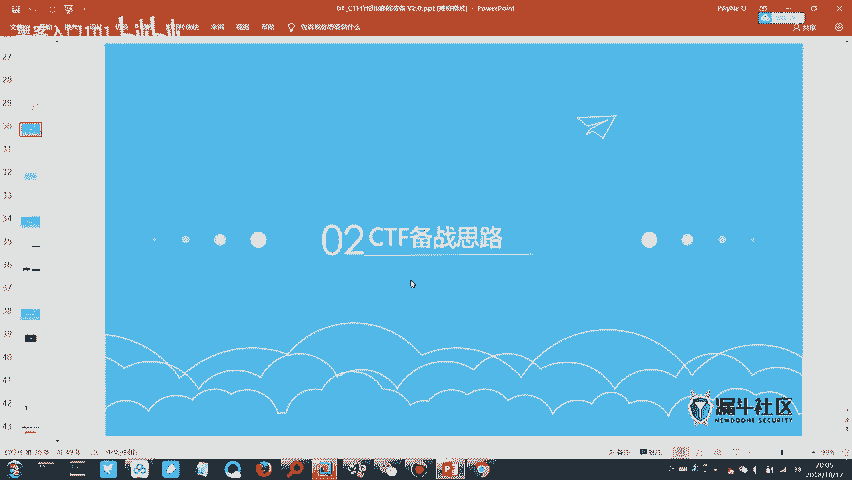
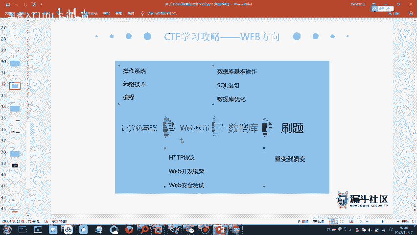
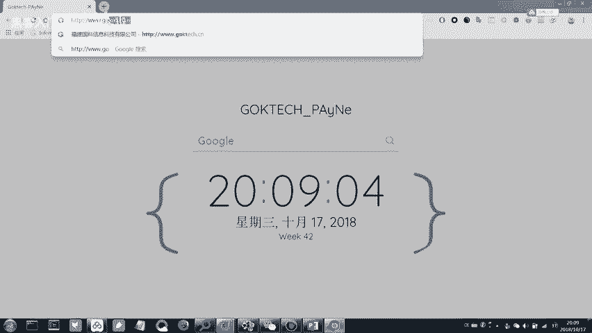
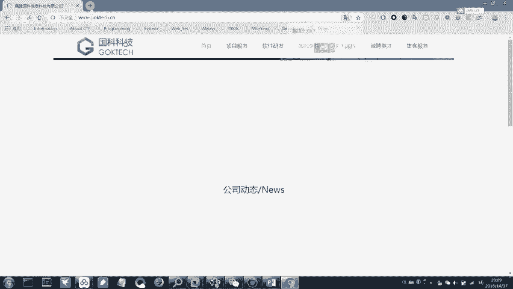
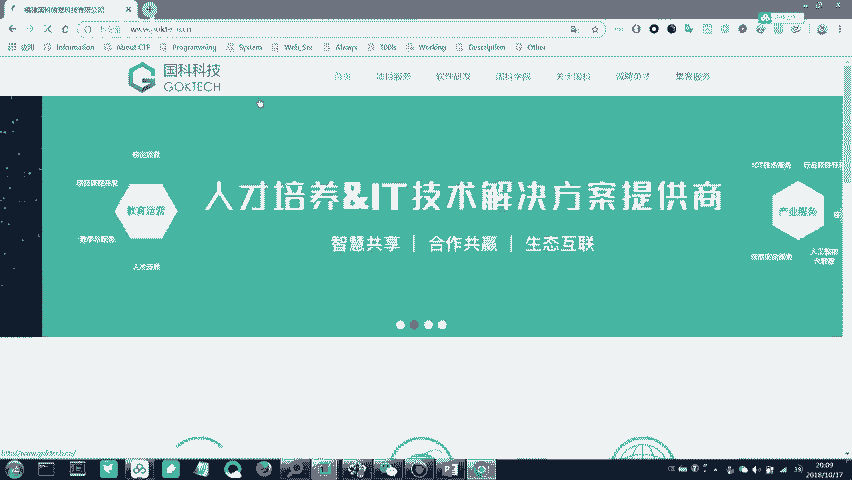
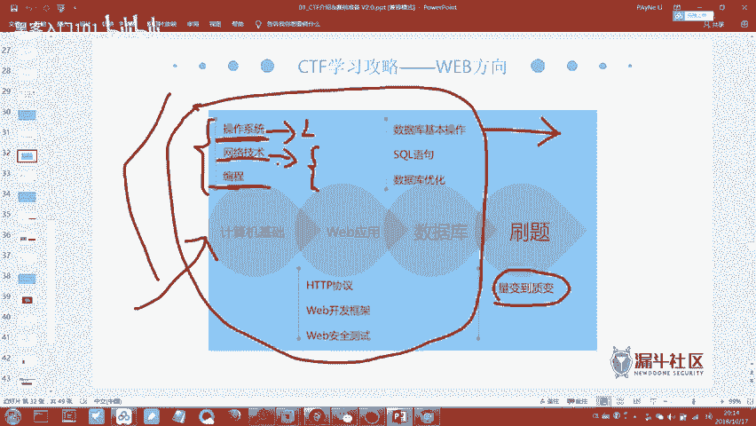
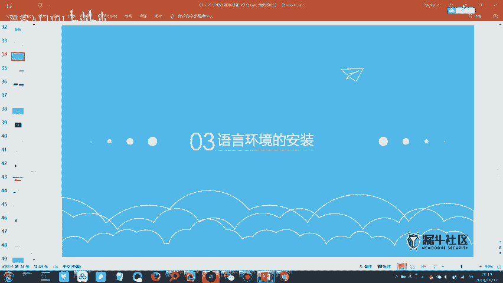
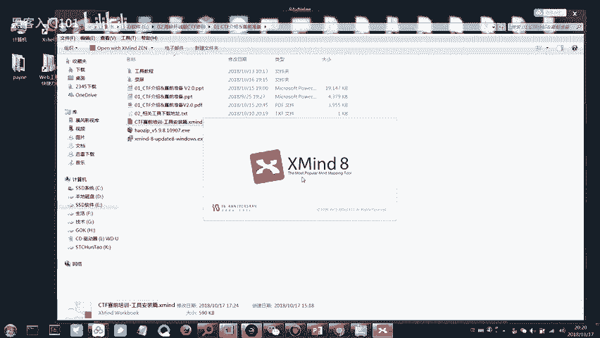
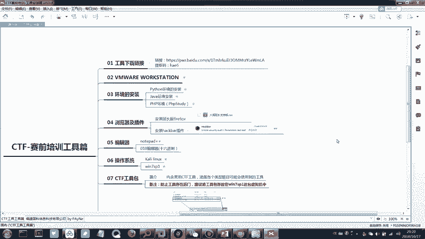

# CTF入门教程：3：CTF赛制介绍与工具准备

在本节课中，我们将学习CTF比赛的备赛思路，并动手安装和配置一些必要的工具，为后续的实战练习打下基础。

上一节我们介绍了CTF的基本概念和模式，本节中我们来看看如何系统地准备一场CTF比赛。

## 备赛知识体系梳理

想要梳理出适合自己的备赛思路，需要对CTF所需的技术知识有一定理解。CTF比赛所需的知识分为两大模块：**基础知识**和**专项知识**。

### 基础知识模块
以下是必须掌握的基础知识，无需精通，但需了解基本概念：
*   **Linux系统基本使用**：掌握基本的Linux命令，例如进入目录（`cd`）、查看文件（`ls`）等。因为很多安全工具（如Kali Linux）都基于Linux系统。
*   **网络协议分析**：了解网络流量数据包的分析方法。需要具备类似HCNA或CCNA水平的网络基础知识，理解IP、通信等基本过程。
*   **编程能力**：此项属于拔高项，并非必须，但掌握编程能力（如Python）对解题有很大帮助。

### 专项知识模块
专项知识主要分为两个方向：
1.  **Pwn（二进制漏洞利用）与逆向工程**：此方向涉及底层知识，难度相对较高。
2.  **Web（网络攻防）与杂项（Misc）**：此方向技术点相对集中，更注重漏洞原理的利用和信息收集能力。

## 核心技能学习路线

以下是具体需要掌握的技能学习路线：

**1. 操作系统**
需要懂一些基本的Linux命令，例如：
*   `cd [目录名]`：切换目录。
*   `ls`：列出目录内容。
*   `cat [文件名]`：查看文件内容。

**2. 网络技术**
需要掌握HTTP/HTTPS协议的基本原理。当你在浏览器访问 `www.baidu.com` 时，完整的URL其实是 `http://www.baidu.com` 或 `https://www.baidu.com`。
*   **HTTP**：超文本传输协议，是Web通信的基础。
*   **HTTPS**：HTTP的安全版本，在HTTP基础上增加了TLS/SSL加密层。浏览器会将纯HTTP网站标记为“不安全”，以提升安全意识。

**3. 数据库**
需要掌握数据库的基本操作和SQL查询语句，重点是“增删查改”（CRUD）。理解SQL语法是学习SQL注入漏洞的基础。

**4. 学习方法**
CTF注重知识的广度而非深度。建议对每个部分稍作了解，然后通过大量刷题来积累经验和思路。在解题过程中遇到不懂的知识点，再针对性搜索学习即可。

## 练习平台推荐

量变引起质变的关键在于刷题。以下是推荐的CTF练习平台：

*   **实验吧**：题目相对友好，适合入门，并且提供题目解析（Writeup）。
*   **BugKu CTF**：题目难度适中，适合初学者练习。
*   **i春秋CTF大本营**：包含大量历年比赛真题，难度较高，适合有一定基础后挑战。

建议初学者从 **实验吧** 和 **BugKu CTF** 开始练习。

## 实战：工具安装与配置

现在进入今晚的实践操作部分，我们将安装并使用思维导图工具来整理学习内容。

1.  请打开群文件中下载的XMind安装包并进行安装。
2.  安装完成后，打开XMind软件。
3.  在XMind中打开群文件中提供的思维导图文件（`.xmind` 格式），该文件包含了本节课的知识脉络。

本节课中我们一起学习了CTF比赛的备赛知识体系、核心技能学习路线、推荐的练习平台，并完成了思维导图工具的安装。掌握这些内容将帮助你更有条理地开始CTF学习之旅。下一节，我们将开始接触具体的题目类型和解题方法。