# CTF入门教程：P4：CTF赛制介绍与工具安装指南 🔧

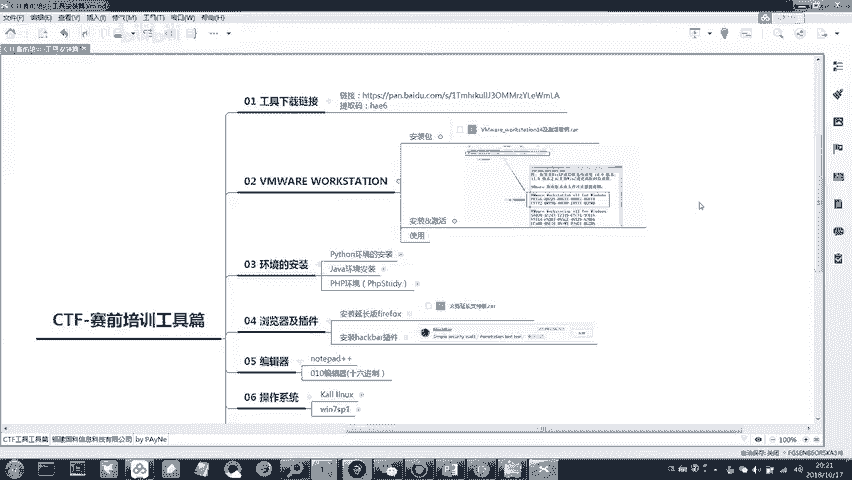

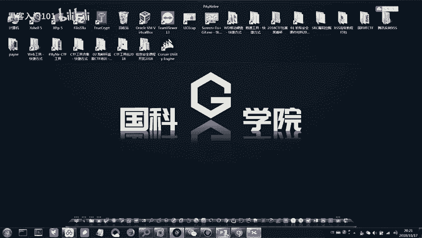

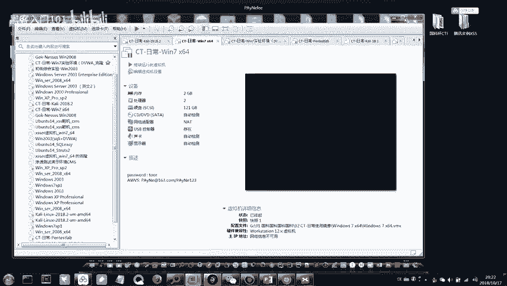

在本节课中，我们将学习CTF比赛的基本赛制，并详细介绍在后续学习和比赛中需要用到的核心工具及其安装配置方法。掌握这些工具是进行CTF实战的基础。

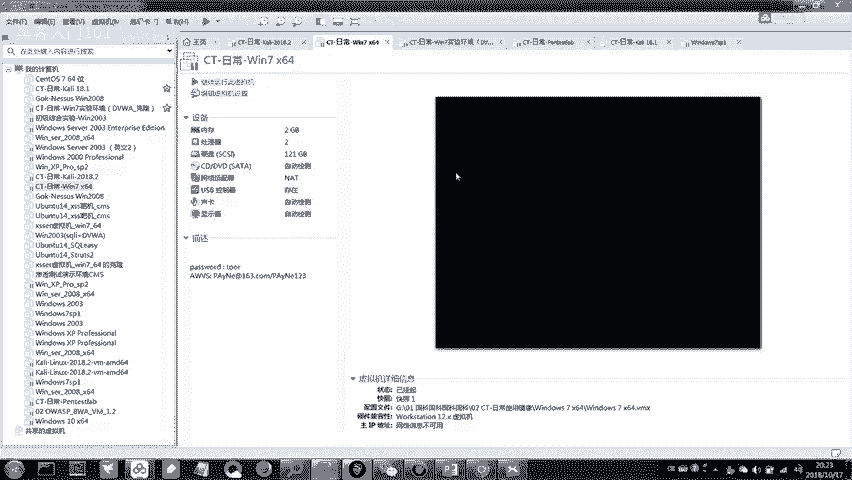

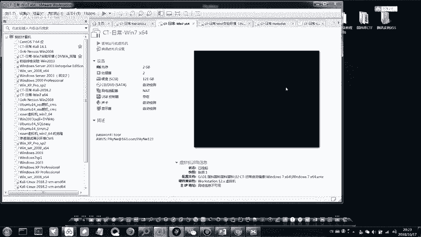

## 虚拟机软件：VMware Workstation 🖥️

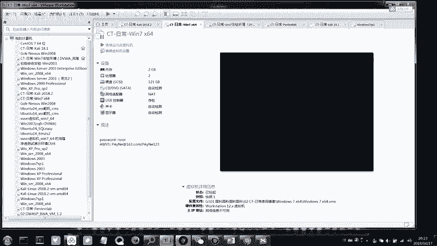

上一节我们介绍了CTF的基本概念，本节中我们来看看如何搭建一个安全、隔离的练习环境。首先需要安装虚拟机软件VMware Workstation。

该软件用于创建和管理虚拟机。虚拟机与真机（您的物理电脑）相互隔离。这意味着即使在虚拟机中运行了有风险的软件或脚本，也不会影响您真实的操作系统。因此，强烈建议将后续所有的CTF工具包都安装在虚拟机内。

### 软件安装与版本

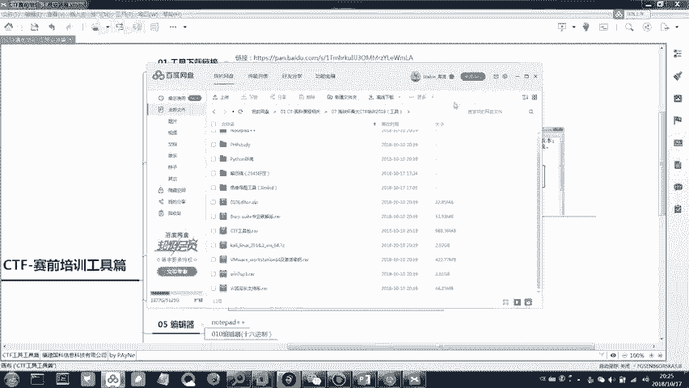

请确保安装的是VMware Workstation 14版本。如果您已安装其他版本，建议卸载后重新安装14版本。
*   您可以在软件“帮助”菜单的“关于”选项中查看当前版本。
*   安装时，遇到任何选项均点击“下一步”或“确定”。
*   激活时，使用提供的“永久许可证激活密钥”文档中，标明的14版本密钥。

### 打开虚拟机文件

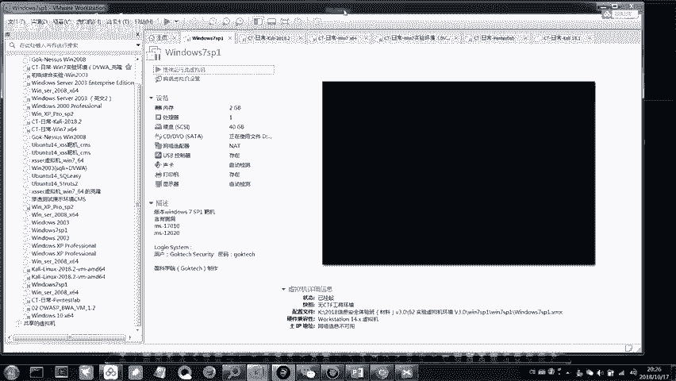

我们提供了两个已安装好的虚拟机系统文件（格式为 `.vmx`），您无需自行安装系统。
*   一个是Kali Linux系统。
*   一个是Windows 7系统。

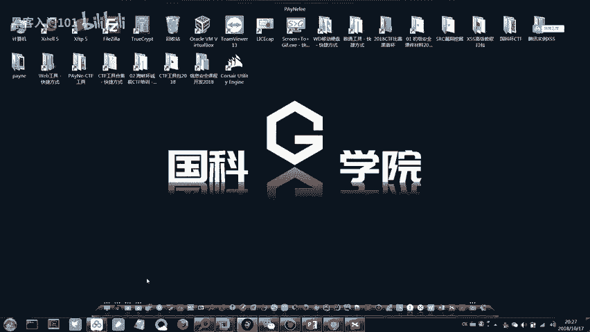

以下是打开虚拟机文件的步骤：
1.  解压提供的虚拟机压缩包。
2.  在VMware软件中，点击“文件”->“打开”。
3.  找到并选择解压后文件夹中的 `.vmx` 文件。
4.  打开后，该虚拟机会显示在VMware的库列表中。

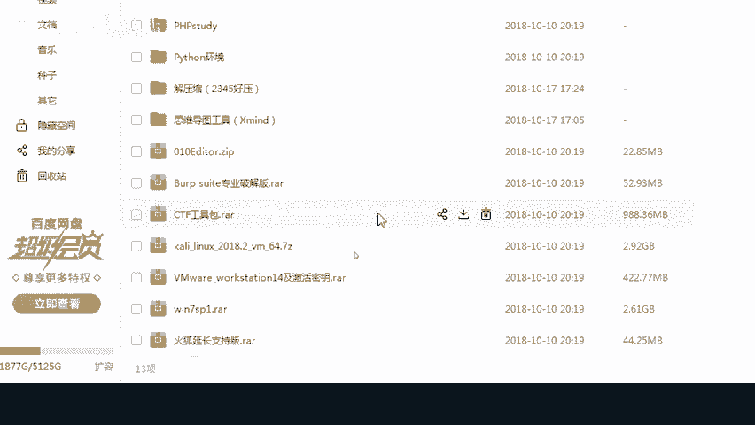

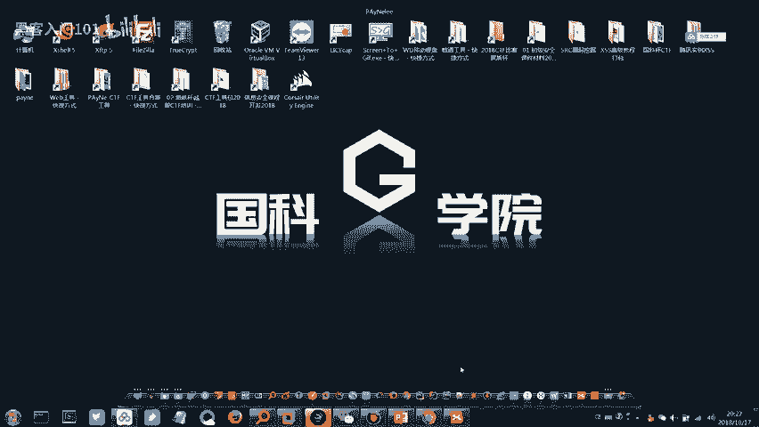

### 基本功能使用

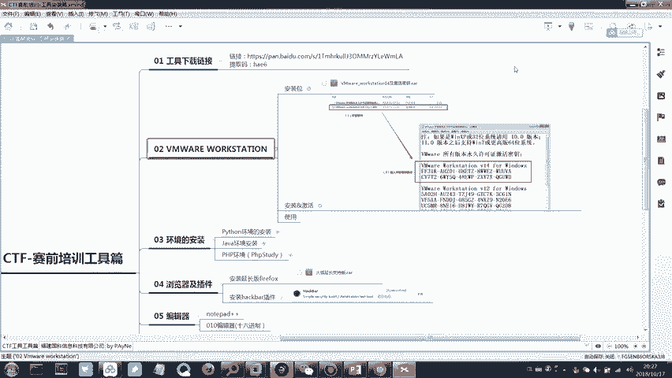

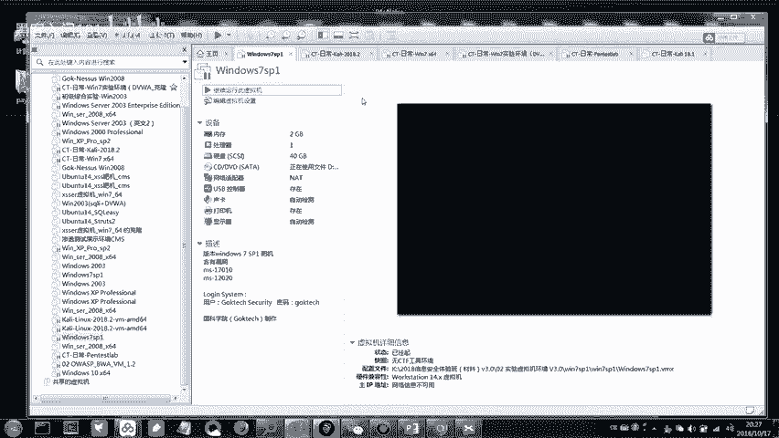

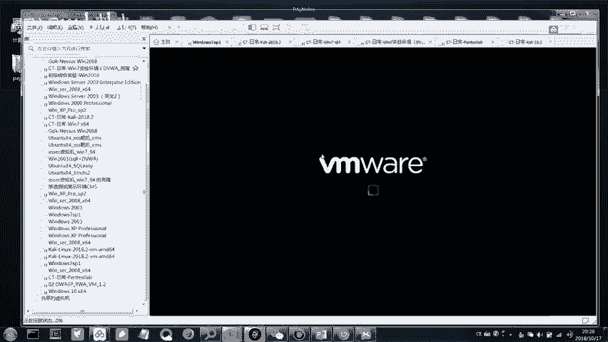

启动虚拟机后，您可以像使用普通电脑一样操作它。以下是一些常用功能：

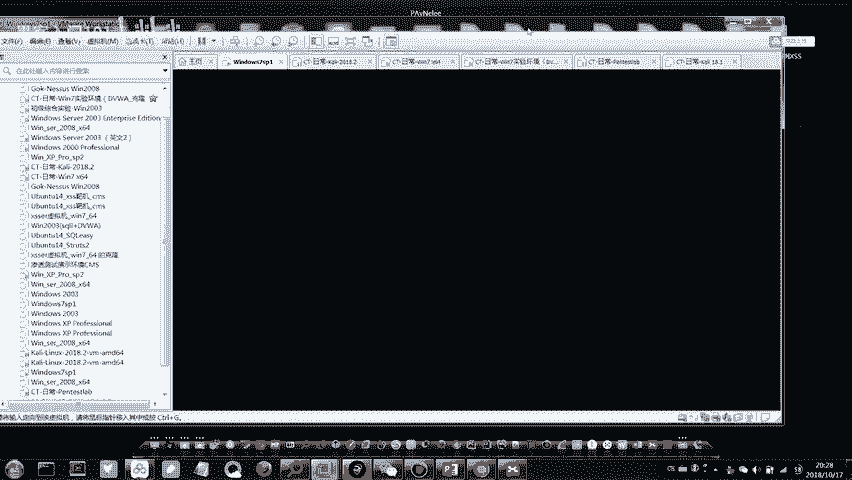

*   **调整显示**：如果虚拟机窗口过小，可以点击菜单栏的“查看”->“立即适应客户机”，窗口会自动匹配大小。
*   **快照功能**：快照可以保存虚拟机在某一时刻的完整状态。例如，在安装某个软件后创建一个快照。如果后续系统出现问题，可以快速恢复到创建快照时的状态。请注意，创建快照会占用更多硬盘空间。
*   **资源配置**：右键点击虚拟机，选择“设置”，可以调整分配给虚拟机的内存、处理器核心数和硬盘大小。请根据您真机的实际配置进行调整（例如，真机内存为8G，虚拟机可分配1-2G）。

### 文件共享：虚拟机与真机之间

在虚拟机和真机之间传输文件，主要有两种方法：

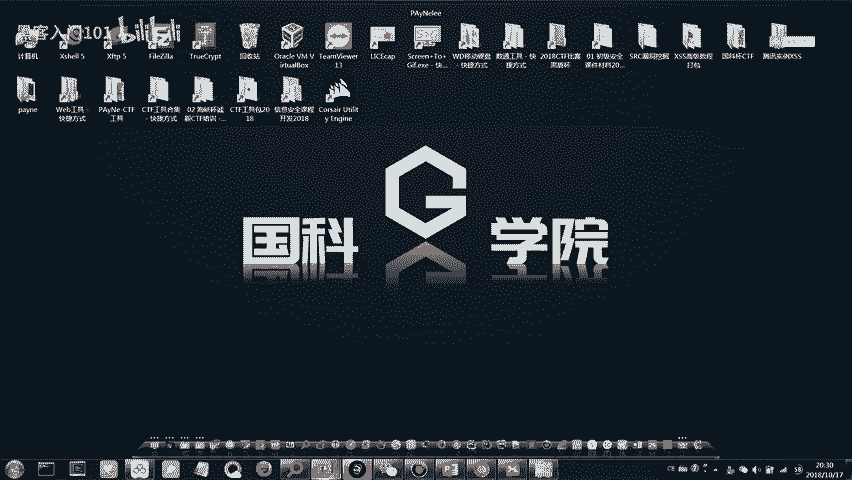

**方法一：安装VMware Tools**
*   该工具在提供的虚拟机中已预装。
*   安装后，您可以直接在虚拟机和真机之间复制、粘贴文件和文本。
*   如果此功能失效，可以尝试重启虚拟机，或在虚拟机设置中重装VMware Tools。

**方法二：设置共享文件夹**
此方法更为稳定可靠，步骤如下：
1.  在真机上创建一个文件夹（例如 `D:\CTF_Share`）。
2.  在VMware中，右键点击已关闭的虚拟机，选择“设置”。
3.  在“选项”标签页中，选择“共享文件夹”，点击“添加”按钮。
4.  按照向导，将真机上创建的文件夹（`D:\CTF_Share`）添加为共享文件夹。
5.  启动虚拟机，打开“计算机”，点击“映射网络驱动器”。
6.  选择步骤4中共享的文件夹，完成映射。
7.  此后，在真机 `D:\CTF_Share` 放入任何文件，在虚拟机的网络驱动器位置都能立即访问。

---

## 编程与脚本环境安装 ⚙️

搭建好虚拟机环境后，我们需要安装一些必要的编程语言环境，以便运行和编写CTF解题脚本。

### Python环境安装

Python在CTF中广泛应用于编写和运行加解密、漏洞利用等脚本。

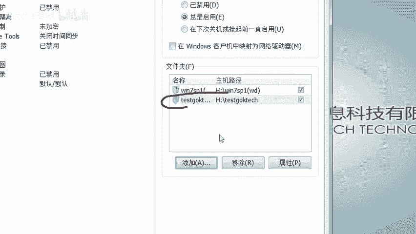

以下是安装步骤：
1.  运行提供的Python安装包（根据系统选择32位或64位），全程使用默认选项进行安装。
2.  **关键步骤：添加环境变量**。安装完成后，需要将Python的安装路径添加到系统环境变量，这样才能在任意位置通过命令行调用Python。
    *   打开命令提示符（Win + R，输入 `cmd`）。
    *   输入以下命令（请将 `C:\Python27` 替换为您的实际安装路径）：
        ```cmd
        set PATH=%PATH%;C:\Python27
        ```
    *   输入 `python` 并回车，如果出现Python交互式命令行界面（显示类似 `>>>` 的提示符），则说明安装成功。

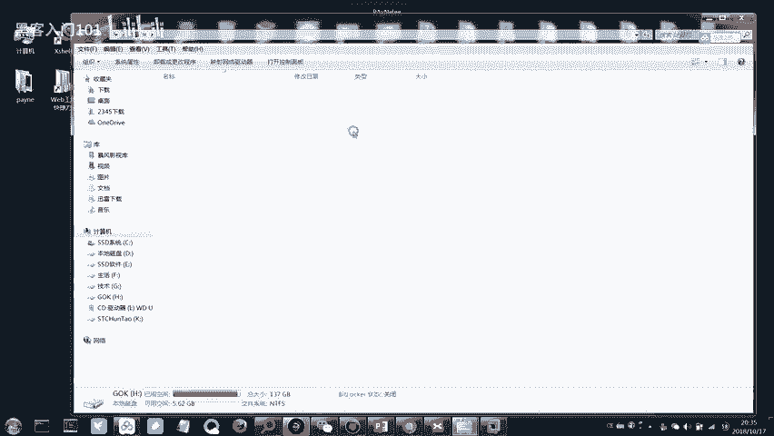

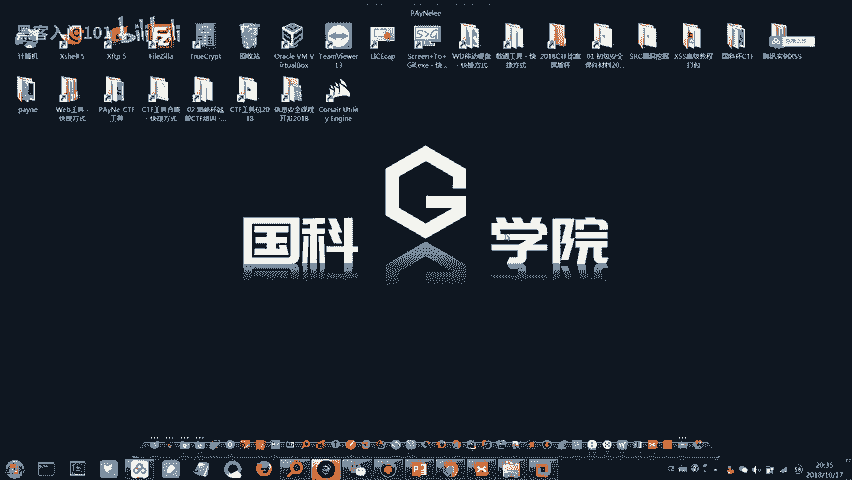

### Java环境安装

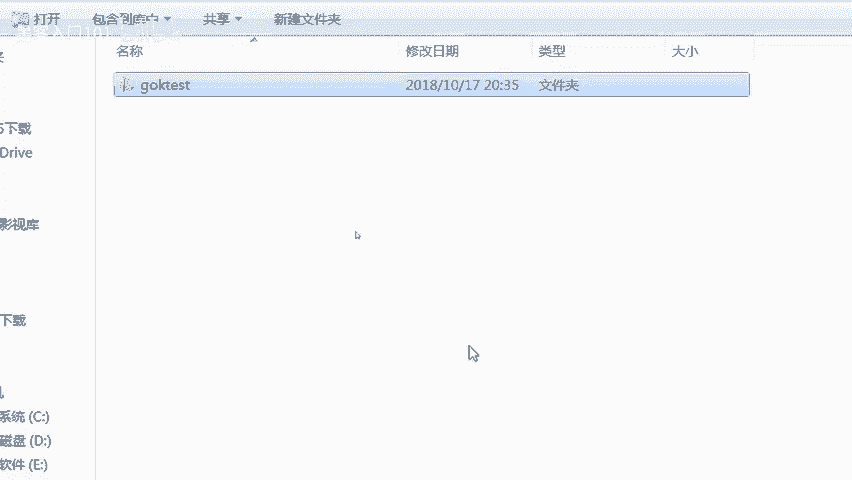

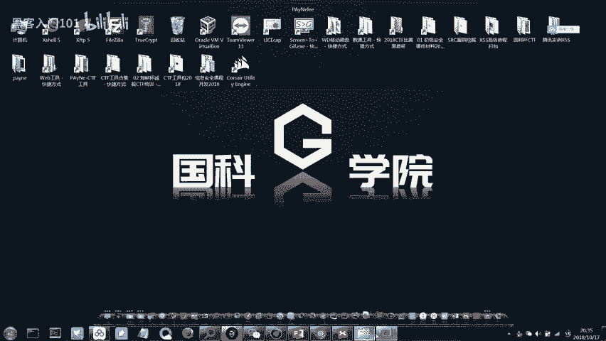

部分CTF工具和题目依赖Java环境。

安装步骤与Python类似：
1.  运行提供的Java安装包，默认安装即可。
2.  安装完成后，打开命令提示符。
3.  输入命令 `java -version`。
4.  如果命令行显示Java的版本信息，则说明安装成功。

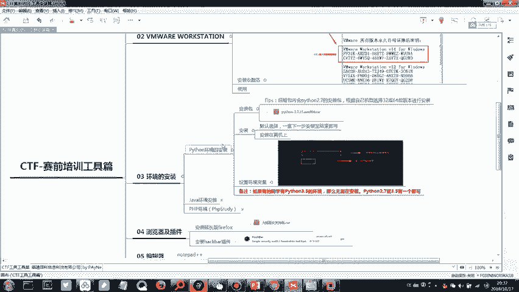

### PHP集成环境：PHPStudy安装

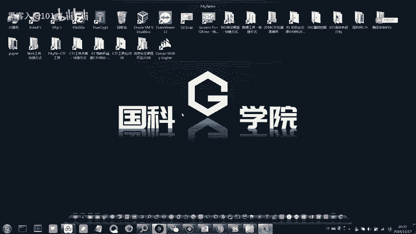

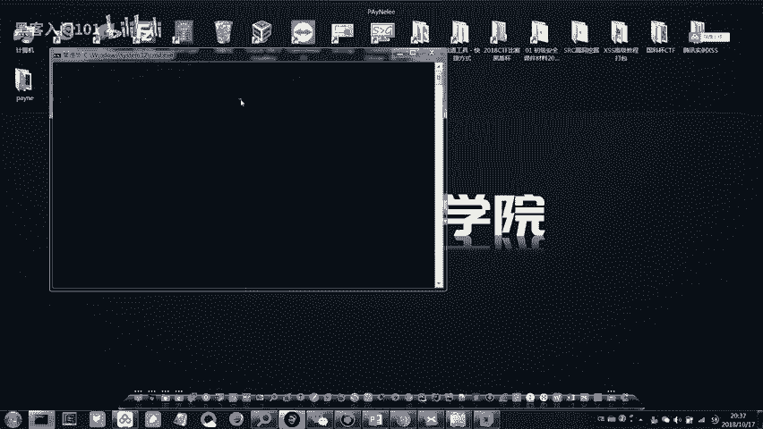

在Web类题目中，我们经常需要在本地搭建网站环境进行测试。PHPStudy集成了Apache、MySQL、PHP等必要组件，可以一键搭建服务器环境。

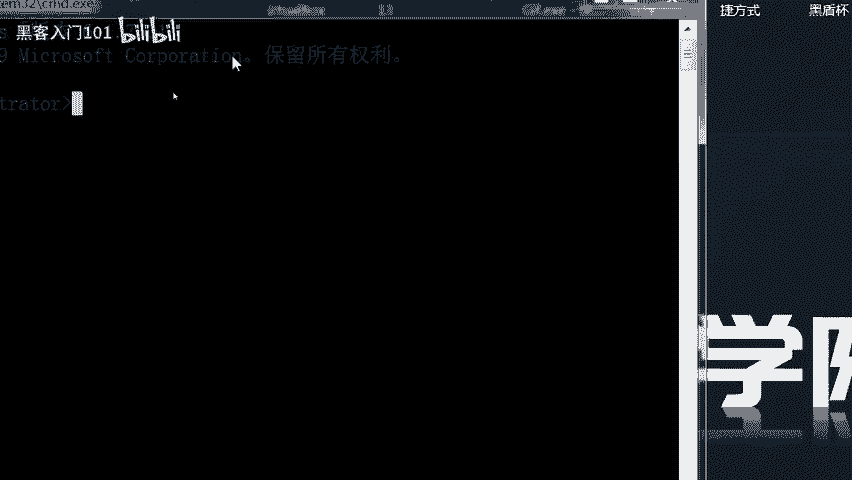

安装注意事项：
1.  解压安装包，运行安装程序，选择中文，按默认选项安装。
2.  安装后如果弹出提示“系统缺少VC运行库”，则需要安装同文件夹下的“32位VC9运行库”。
3.  **重要**：所有安装路径请避免使用中文，以免出现兼容性问题。

---

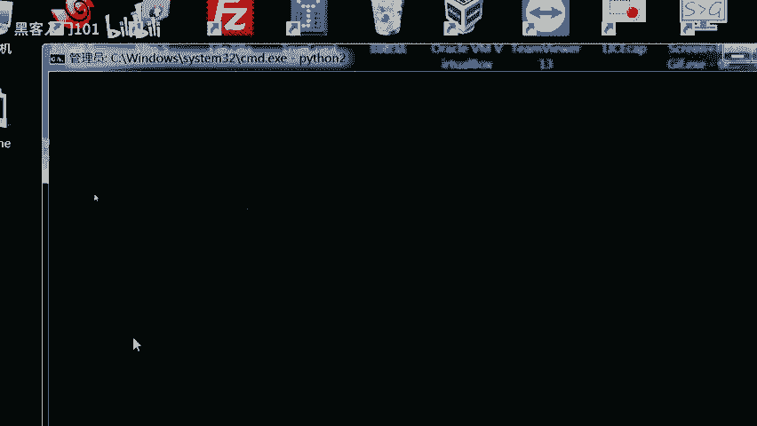

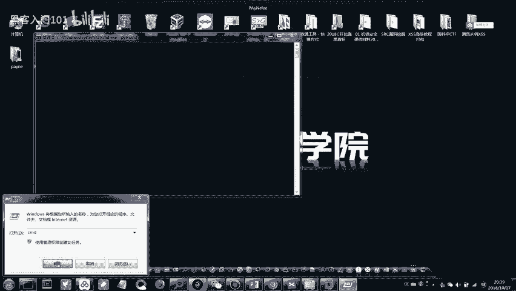

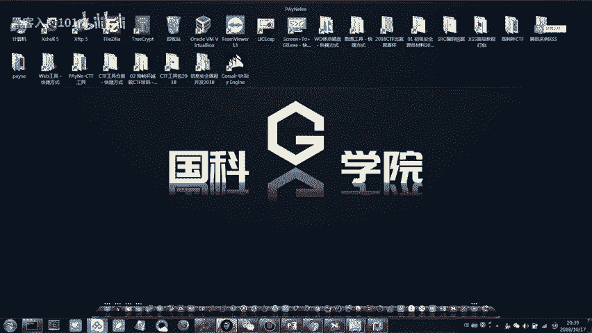

## 浏览器与插件配置 🌐

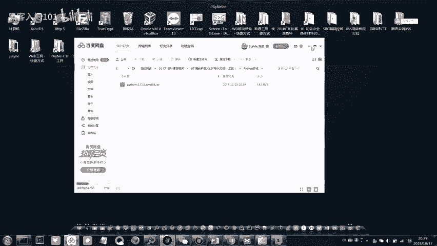

工欲善其事，必先利其器。一个配置好的浏览器能极大提高Web类题目的解题效率。

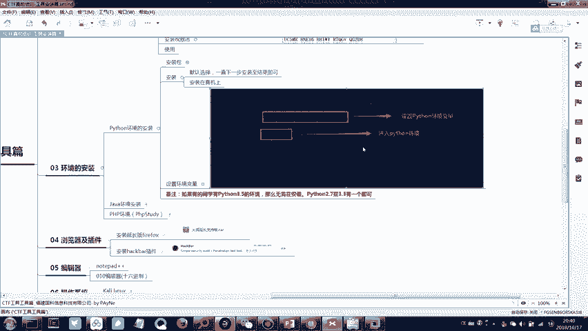

### 火狐浏览器（特定版本）安装

我们需要使用一个特定旧版本的火狐浏览器，因为它兼容一款强大的安全插件。

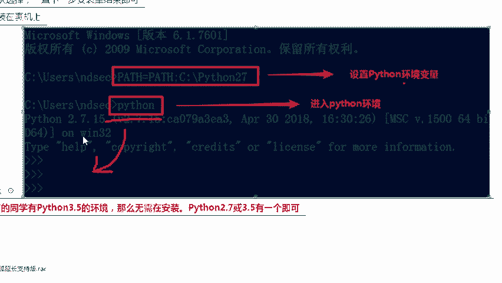

*   请卸载当前可能已安装的新版火狐浏览器。
*   安装我们提供的旧版火狐浏览器安装包。

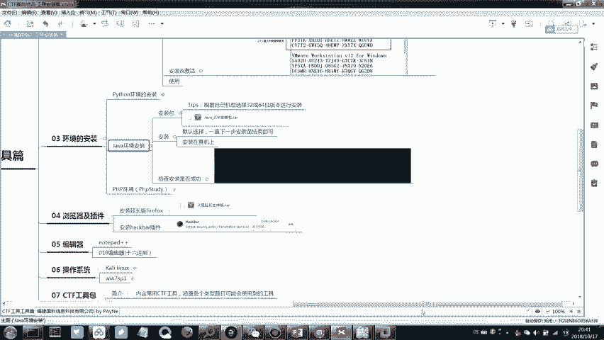

### HackBar插件安装

HackBar是用于测试Web安全的经典插件，可以方便地构造和发送HTTP请求。

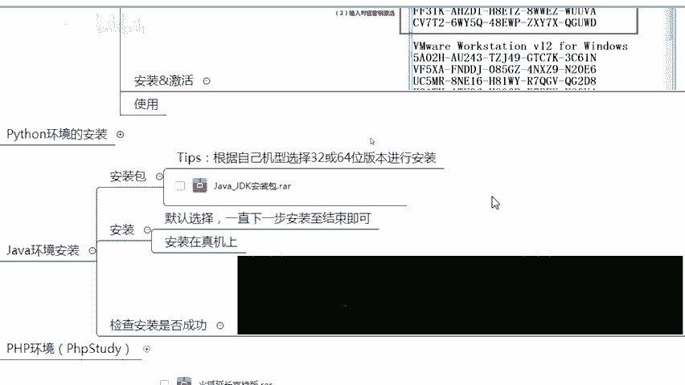

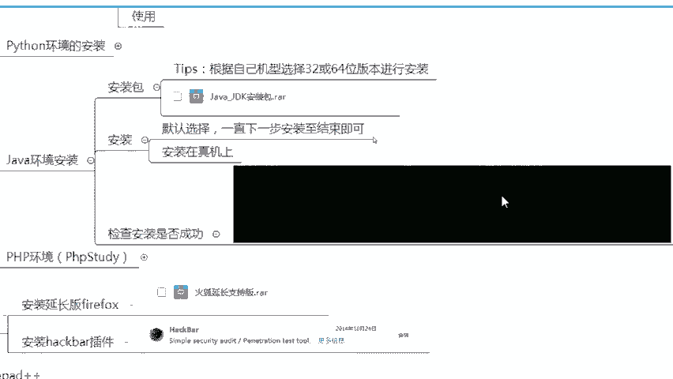

安装步骤如下：
1.  打开已安装的旧版火狐浏览器。
2.  点击浏览器右上角菜单，选择“附加组件”。
3.  在扩展页面，搜索“HackBar”。
4.  在搜索结果中，**请选择安装发布于2014年的那个版本**（这是最好用的版本）。请仔细核对，不要安装2018年等更新版本的HackBar。

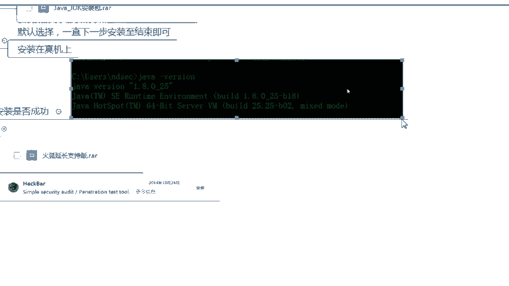

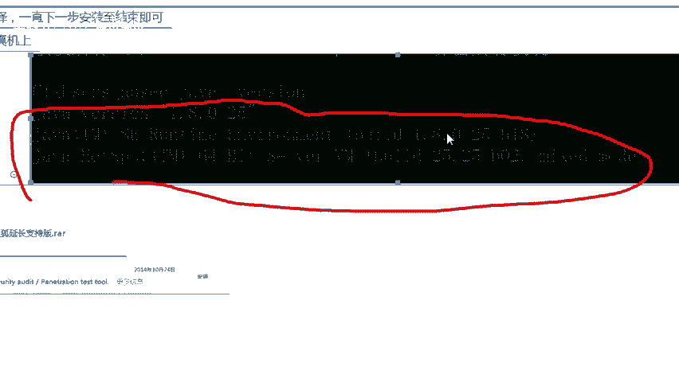

---

## 代码与二进制编辑器 📝

最后，我们需要两款功能强大的编辑器来处理代码和二进制文件。

### Notepad++ 安装

Notepad++ 是Windows记事本的增强版，支持代码高亮、多种编码格式，非常适合查看和编辑脚本、配置文件等。

*   运行提供的安装包，选择对应系统位数（32/64位），按默认选项安装即可。

### 010 Editor 安装

010 Editor 是一款专业的二进制编辑器，在CTF的“杂项”题目中，常用于分析图片、音频、流量包等文件的底层二进制结构，寻找隐藏信息或修复文件头。

*   运行提供的 `010editor` 安装包，按向导完成安装。

---

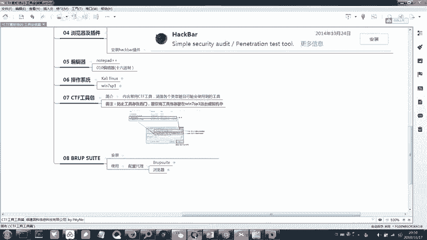

本节课中我们一起学习了CTF必备工具的安装与配置。我们首先利用VMware搭建了安全的虚拟机实验环境，然后安装了Python、Java等脚本运行环境，接着配置了带有HackBar插件的火狐浏览器，最后准备了两款专业的编辑器。请务必在虚拟机中完成这些工具的安装和测试，为接下来的实战学习打下坚实基础。下节课我们将开始介绍这些工具在具体CTF题目中的应用。