# CTF培训：7：密码学下半部分

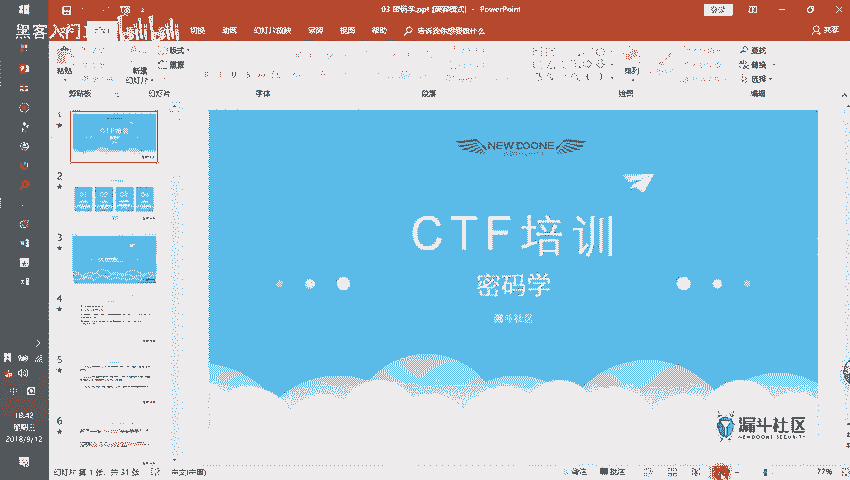

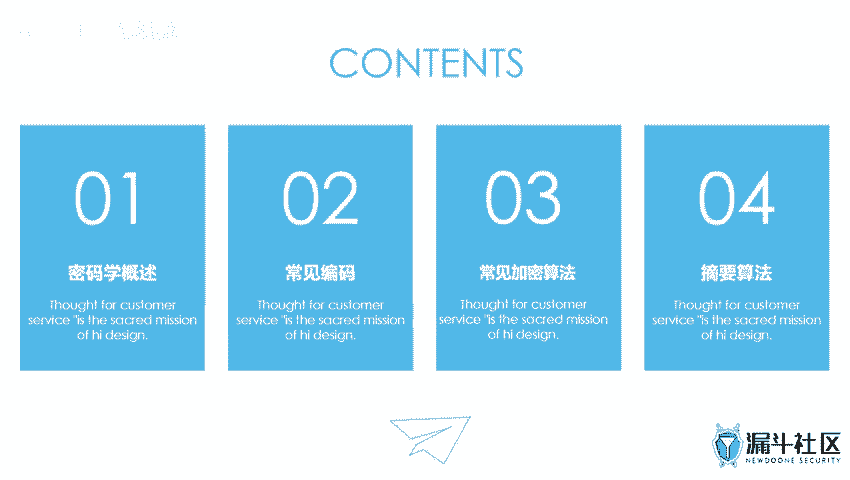

## 概述

在本节课中，我们将继续学习密码学知识。我们将了解密码学的发展历程，区分编码、加密和摘要算法的概念，并学习几种常见的编码方式及其在CTF解题中的应用。

## 密码学概述

上一节我们介绍了密码学的基本分类，本节中我们来看看密码学的发展历程。了解这一点有助于我们理解CTF题目中出现的各种密码类型。

密码学的发展大致分为三个阶段：
*   **古典密码学**：古代时期使用的加密方法，例如凯撒密码、栅栏密码等。CTF入门题目中经常出现。
*   **近代密码学**：近代战争时期（如电报通信）使用的加密方式，其算法相对古典密码更复杂一些。
*   **现代密码学**：基于数学理论设计的强加密算法，具有很高的安全性（不可逆性）。涉及现代密码学的CTF题目通常难度较大。

编码学是密码学的一个分支，但它更侧重于一种**映射关系**。例如，你可以自己创造一套符号来代表特定含义，这更像是一种“翻译”。而加密则侧重于通过特定算法对数据进行**混淆和转换**，使其在没有密钥的情况下难以理解。

加密算法主要分为两大类：
*   **对称密钥算法**：加密和解密使用**同一个密钥**。公式表示为：`C = E(K, P)` 和 `P = D(K, C)`，其中K是密钥，P是明文，C是密文。其特点是加密效率高。常见的算法有DES、3DES、IDEA和**AES**（目前最强的对称加密算法之一）。
*   **非对称密钥算法**：使用一对密钥，即**公钥**和**私钥**。公钥用于加密，私钥用于解密。公式表示为：`C = E(PK, P)` 和 `P = D(SK, C)`，其中PK是公钥，SK是私钥。其安全性更高，但加密效率低于对称加密。最常见的算法是**RSA**，它涉及复杂的数论知识（如费马定理），是CTF中的常考难点。

## 摘要算法

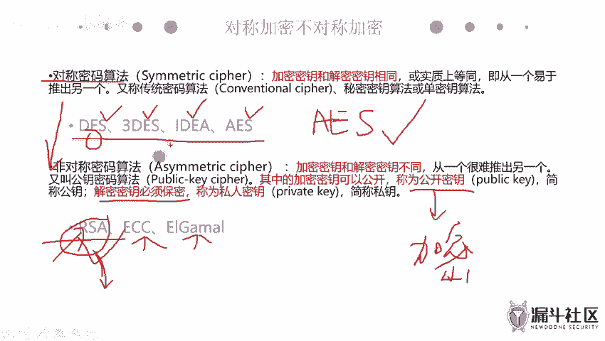

除了编码和加密，还有一种重要的概念叫做**摘要算法**，也称为哈希算法。

摘要算法主要用于验证数据的**完整性**。例如，文件在传输过程中是否被篡改。它的特点是：
*   **不可逆性**：无法从摘要值反推出原始数据。
*   **雪崩效应**：原始数据即使发生微小改变，产生的摘要值也会截然不同。

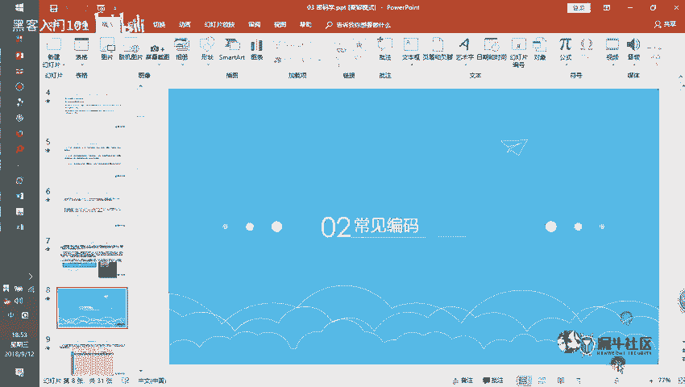

以下是两种最常见的摘要算法：
*   **MD5**：生成128位的哈希值。
*   **SHA系列**：如SHA-1、SHA-256等，生成不同长度的哈希值。

在CTF中，你可能会遇到需要破解MD5哈希的题目（通过碰撞或彩虹表），或者利用哈希特性解题。

## 常见编码

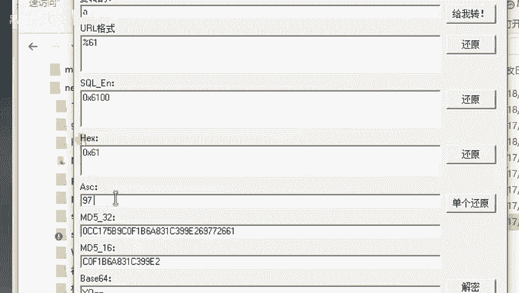

现在，我们来看几种在CTF中极其常见的编码方式。识别它们的特征是解题的第一步。

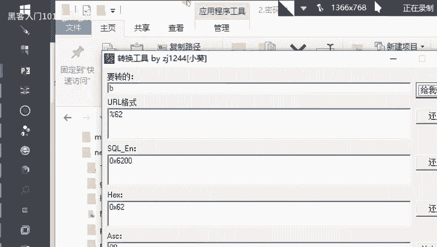

### ASCII编码

ASCII码是计算机最早期的字符编码标准，主要用于表示英文字母、数字和常见符号。

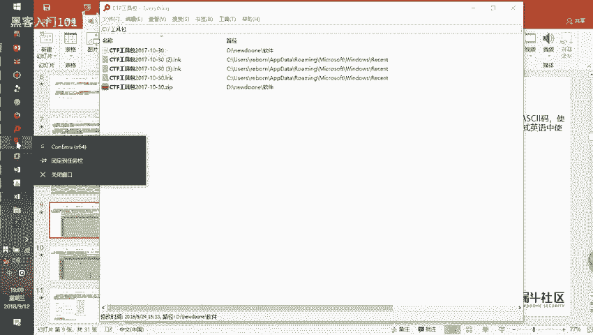

*   **标准ASCII码**：使用7位二进制数，共表示128个字符。
*   **扩展ASCII码**：使用8位二进制数，共表示256个字符。
*   **特征**：在编程中，字符与ASCII码值之间可以互相转换。
    *   在Python中，使用 `ord(‘A’)` 可以得到字符’A’的ASCII码值 **97**。
    *   使用 `chr(97)` 可以将ASCII码值 **97** 转换回字符 ‘A’。

在CTF工具中（如“小葵多功能转换工具”或在线网站），你可以轻松进行ASCII码的编码和解码。

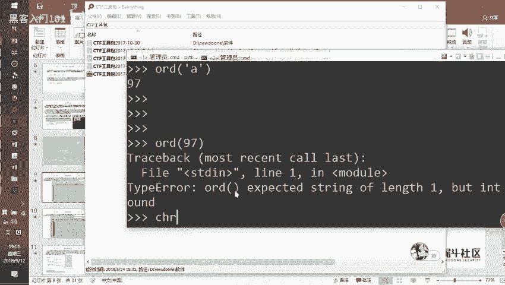

### Base64编码

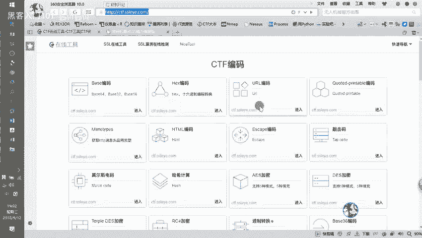

Base64是一种基于64个可打印字符来表示二进制数据的编码方法。

*   **原理**：将每3个字节（24位）的二进制数据，重新分组为4个6位的数据单元，每个单元对应一个Base64字符表中的可打印字符。如果原始数据长度不是3的倍数，会在末尾用`=`号填充。
*   **特征**：编码后的字符串通常包含字母、数字、`+`、`/`，并且**经常以1个或2个`=`号结尾**。
*   **示例**：字符串 `abc` 经过Base64编码后变为 `YWJj`。

如果解码时因`=`号缺失而报错，可以尝试补上`=`号再解码。

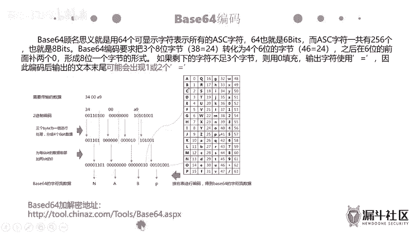

### URL编码

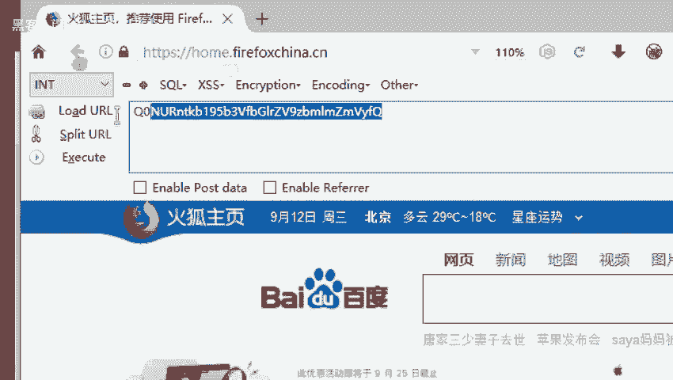

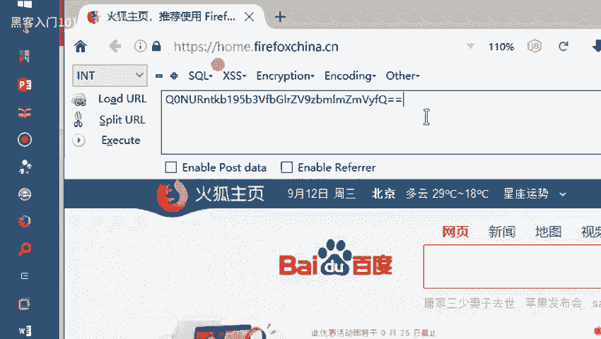

URL编码（百分号编码）主要用于将URL中不能直接传输的特殊字符（如空格、中文、符号）转换为安全格式。

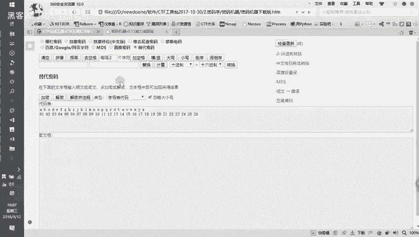

*   **原理**：将字符的ASCII码转换为十六进制，并在前面加上百分号`%`。
*   **特征**：编码后的字符串包含大量 `%XX` 的形式，其中XX是十六进制数字。
*   **示例**：空格字符编码后变为 `%20`，中文“你好”可能被编码为 `%E4%BD%A0%E5%A5%BD`。

浏览器地址栏或CTF工具都可以方便地进行URL编解码。

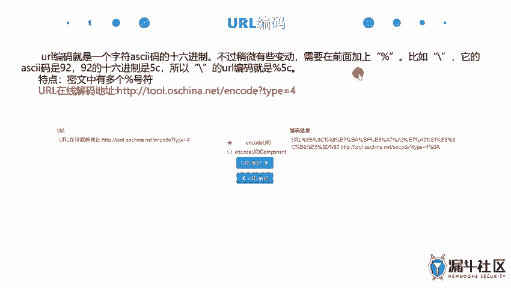

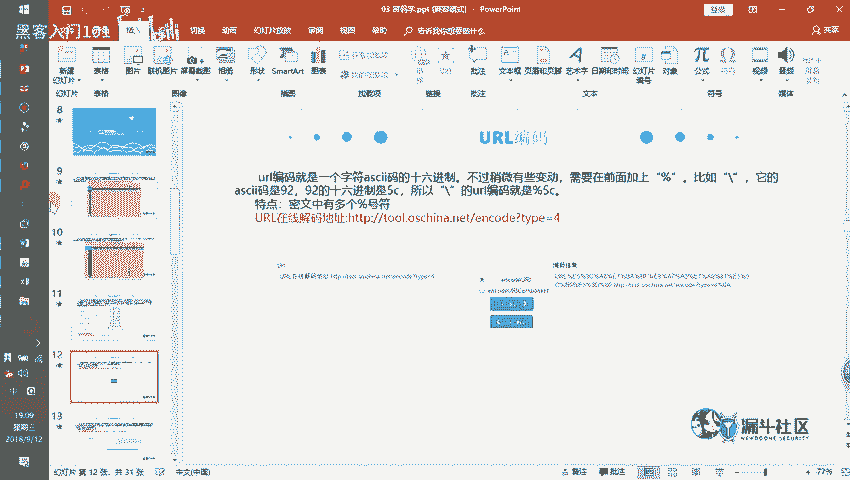

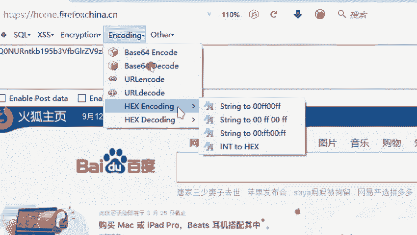

### Unicode编码

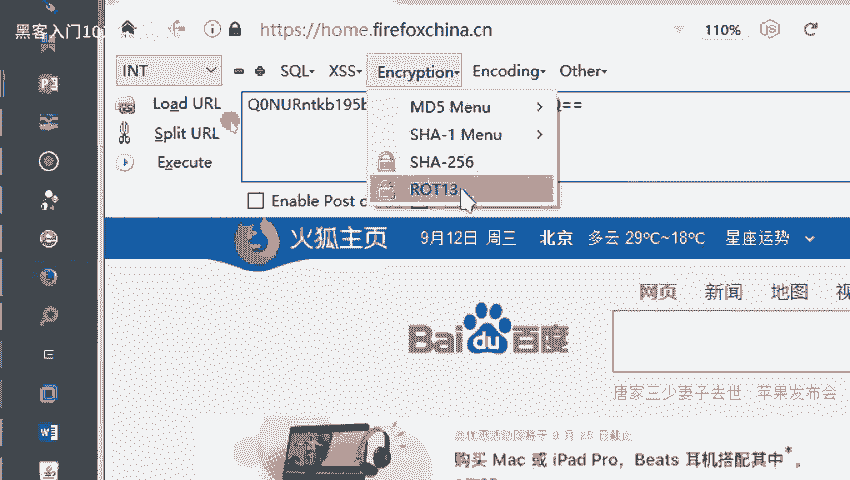

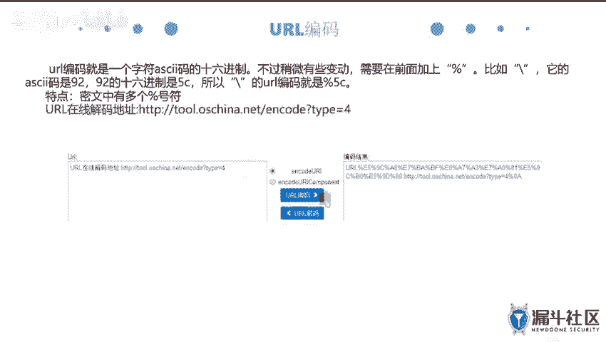

Unicode编码旨在为全世界所有字符提供一个统一的编码方案，以解决ASCII码容量不足的问题。

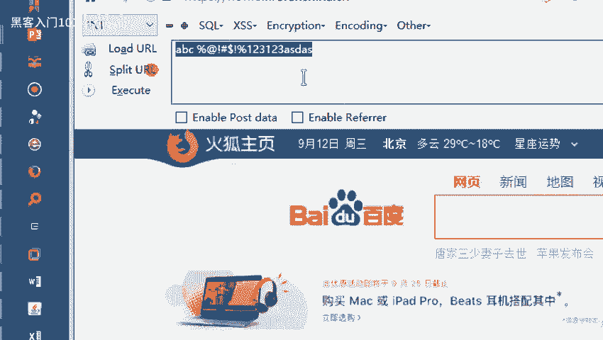

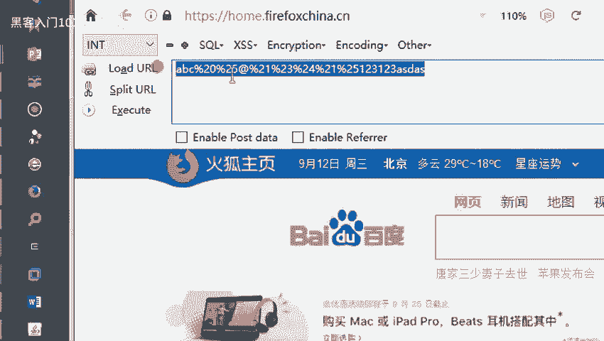

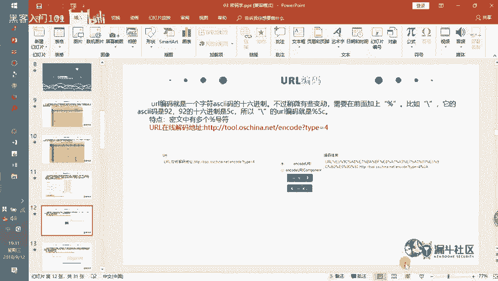

*   **特点**：通常使用两个字节（16位）表示一个字符，兼容ASCII码的前256位。
*   **特征**：在表示非ASCII字符时，常以 `\u` 开头，后跟4位十六进制数。
*   **示例**：汉字“中”的Unicode编码是 `\u4e2d`。

### JavaScript混淆

严格来说，这不是一种编码，而是一种代码保护技术。在CTF的Web类题目中常见。

*   **原理**：将JavaScript代码进行转换（如转换成十六进制、Unicode或使用复杂表达式），使其难以直接阅读，但功能不变。
*   **解法**：浏览器开发者工具的控制台（Console）本身就是JavaScript解析器。你可以将混淆后的代码复制到控制台中执行，通常会直接输出运行结果或弹出提示框（alert）。
*   **示例**：`alert(“XSS”)` 的十六进制混淆形式可能是 `\x61\x6c\x65\x72\x74\x28\x22\x58\x53\x53\x22\x29`。将其粘贴到浏览器控制台执行，会弹出一个显示“XSS”的对话框。

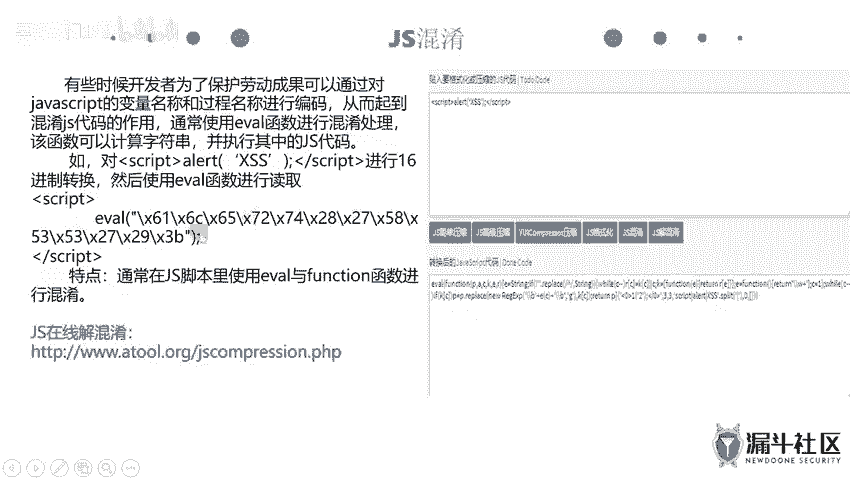

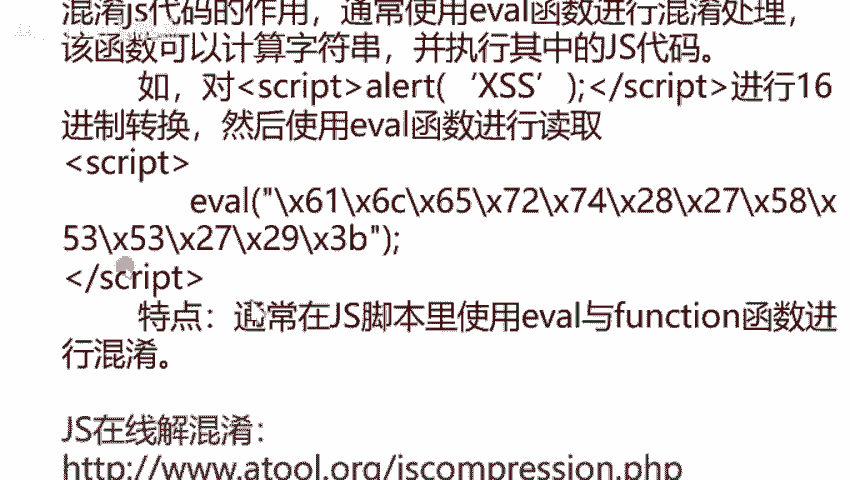

## 总结

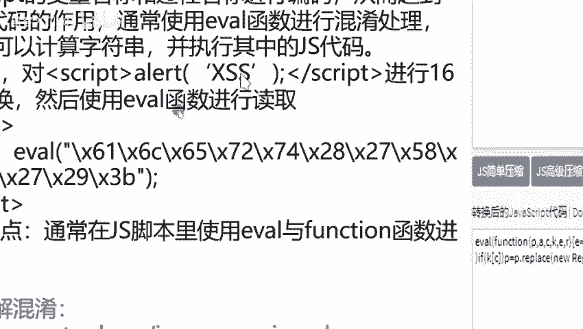

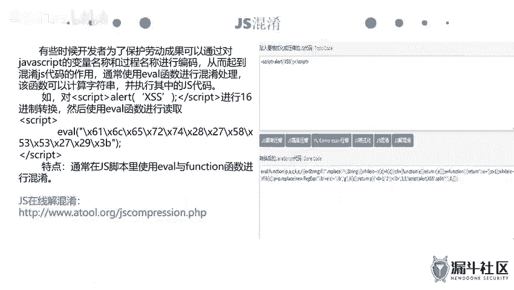

本节课我们一起学习了密码学的下半部分内容。我们回顾了密码学的发展，明确了编码、加密和摘要算法的区别。重点掌握了几种CTF中高频出现的编码：**ASCII**、**Base64**、**URL编码**、**Unicode编码**以及**JavaScript混淆**。记住它们的关键特征和解码工具（如小葵工具、浏览器控制台、在线解密网站），是快速解决相关题目的关键。密码学题目千变万化，但核心思路总是识别、解码或解密。