# CTF赛前指导：9：Linux基础与网络基础入门教程

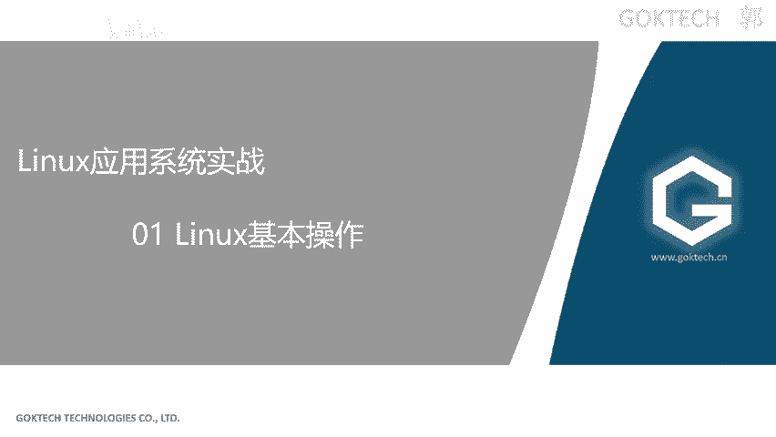

在本节课中，我们将学习CTF比赛前必须掌握的Linux操作系统基础和计算机网络基础知识。这些是安全领域，尤其是CTF竞赛中的核心技能。

## 🐧 Linux操作系统简介

上一节我们概述了课程目标，本节中我们来看看Linux系统的基础知识。

### 系统发展简史

计算机最早诞生于1945年左右，体积庞大。早期计算机使用类似晶体管的元件，只有“亮”和“灭”两种状态，这是二进制被广泛应用的根本原因之一。直到60年代末，世界上第一个真正意义上的操作系统Unix才出现。

Unix是字符界面（或命令界面）的操作系统，对后续系统（如早期的Windows DOS）产生了深远影响。随着图形化界面和鼠标的发明，图形化操作才普及开来。

Linux是一种类似Unix的系统，但底层代码完全不同。它是一款开源免费的操作系统。

**核心概念解释**：
*   **开源**：开放源代码。用户可以查看、修改和分发软件的源代码。
*   **闭源**：不开放源代码。用户无法得知软件内部的具体实现。

Linux因其开源、免费、稳定性强、安全性高和处理多并发能力优秀，被广泛应用于服务器、安全设备（如防火墙）和大型互联网项目（如淘宝）中。

### Linux发行版本

因为Linux是开源的，任何人都可以对其进行二次开发，从而产生了许多不同的发行版本。

以下是常见的Linux发行版分类：

*   **红帽体系**：
    *   **Red Hat Enterprise Linux (RHEL)**：企业版，收费，功能强大。
    *   **CentOS**：RHEL的免费克隆版本，功能与RHEL基本相同，常被视为RHEL的“实验场”。
*   **Debian体系**：
    *   **Debian**：由非商业组织维护，非常稳定。
    *   **Ubuntu**：基于Debian开发，图形化功能强大，用户友好。
*   **其他体系**：
    *   **SUSE / openSUSE**：在欧洲较为流行。
    *   **Kali Linux**：基于Debian/Ubuntu开发，专为渗透测试和安全审计设计，预装了大量安全工具。

**选择建议**：
*   **日常使用/初学者**：推荐Ubuntu体系（如Ubuntu、Deepin、优麒麟），图形化友好。
*   **系统学习**：推荐学习红帽体系（如CentOS），其知识通用性强，学好后操作其他发行版（如Kali）更容易。

### Linux系统基础操作

上一节我们介绍了Linux的概况，本节中我们来看看其基本操作和核心概念。

#### 基本特性与命令

Linux操作与Windows有显著区别：
1.  **严格区分大小写**：文件 `a.txt` 和 `A.txt` 是两个不同的文件。
2.  **隐藏文件**：以点 `.` 开头的文件或目录是隐藏的。使用 `ls -a` 命令可以查看。
3.  **特殊字符**：空格在命令行中有特殊含义（用于分隔参数）。如果文件名包含空格，需要用引号括起来或用反斜杠 `\` 转义，例如 `touch “c d.txt”` 或 `touch c\ d.txt`。

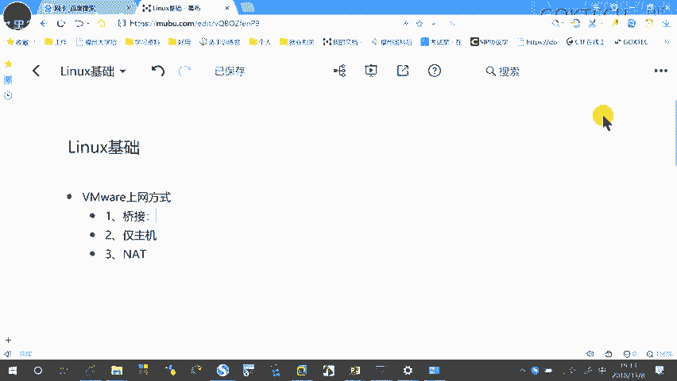

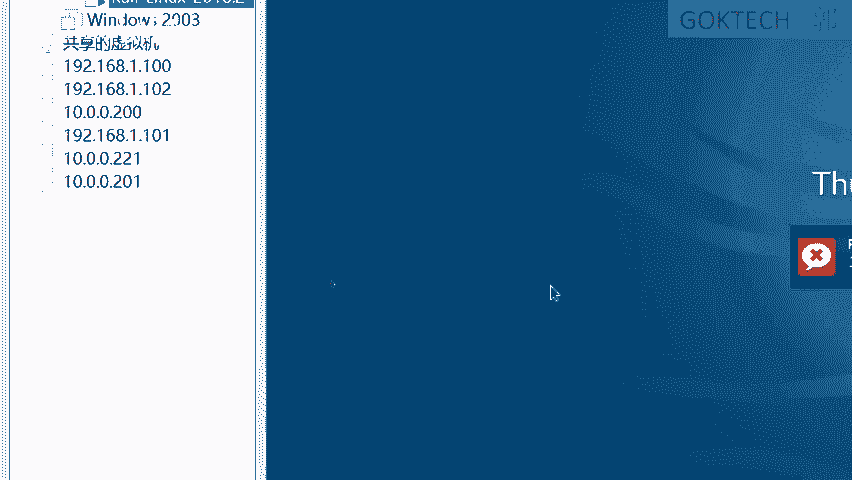

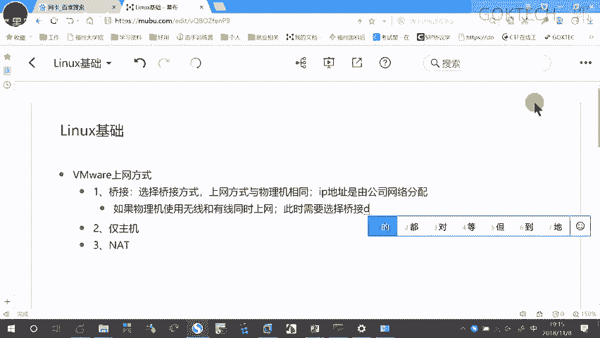

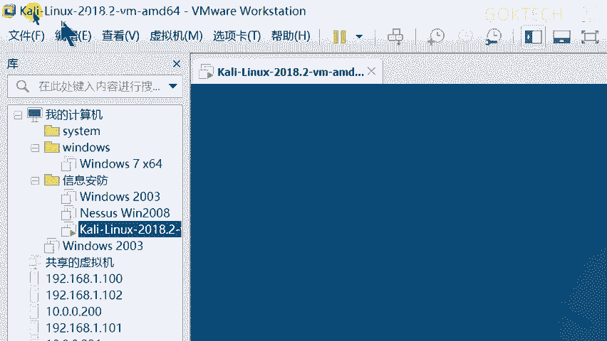

**常用基础命令列表**：

*   **`pwd`**：显示当前所在的工作目录路径。
*   **`cd`**：切换目录。
    *   `cd 目录名`：进入指定目录。
    *   `cd ..`：返回上一级目录（父目录）。
    *   `cd -`：返回上一次所在的目录。
*   **`ls`**：列出目录内容。
    *   `ls -l`：以长格式显示详细信息（权限、大小、时间等）。
    *   `ls -a`：显示所有文件，包括隐藏文件。
*   **`touch 文件名`**：创建一个新的空文件，或更新已有文件的时间戳。
*   **`mkdir 目录名`**：创建一个新目录。
*   **`rm`**：删除文件或目录。
    *   `rm -i 文件名`：交互式删除，会询问确认。
    *   `rm -f 文件名`：强制删除，不提示。
    *   `rm -r 目录名`：递归删除目录及其内部所有内容。
*   **`cp 源文件 目标位置`**：复制文件或目录。
*   **`mv 源文件 目标位置`**：移动文件或目录，也可用于重命名。
*   **`cat 文件名`**：查看文件全部内容。
*   **`less 文件名`**：分页查看文件内容，可上下滚动，按 `q` 键退出。
*   **`head/tail 文件名`**：查看文件开头/末尾的若干行。

#### 文件编辑与VI编辑器

在Linux中，常用 `vi` 或 `vim` 编辑器在终端中编辑文件。

**VI编辑器基本使用流程**：
1.  **启动**：`vi 文件名`，进入**命令模式**。
2.  **进入插入模式**：按 `i` 键，进入**插入模式**，此时可以输入文本。
3.  **退出插入模式**：按 `Esc` 键，返回**命令模式**。
4.  **保存与退出**：在命令模式下，输入 `:` 进入**底行模式**。
    *   `:w` 保存。
    *   `:q` 退出。
    *   `:wq` 保存并退出。
    *   `:q!` 不保存强制退出。

在命令模式下，`dd` 可以删除当前光标所在行。

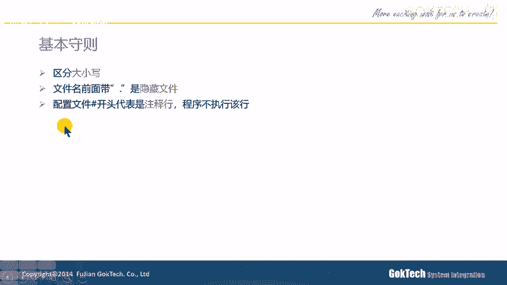

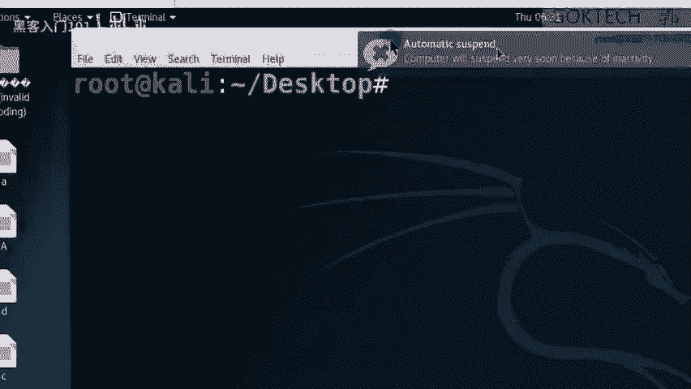

### 网络配置与管理

上一节我们学习了Linux文件操作，本节中我们来看看Linux下的网络基础配置。

#### 查看与配置IP地址

IP地址用于在网络中唯一标识一台设备。

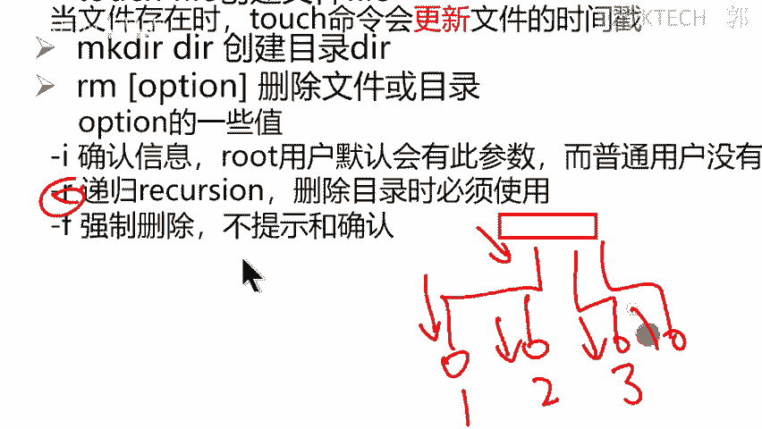

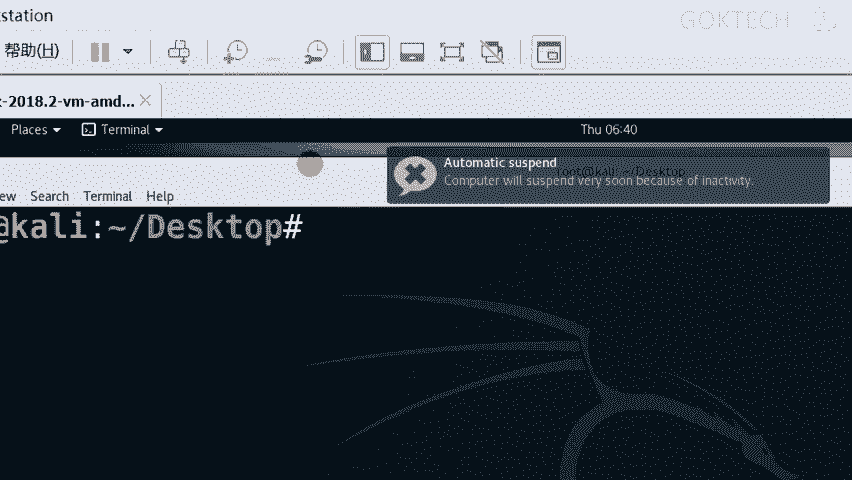

**常用网络命令**：
*   **`ifconfig`**：查看所有网络接口的配置信息（IP地址、MAC地址等）。
*   **`ifconfig 网卡名`**：查看指定网卡信息。
*   **`ifconfig 网卡名 down/up`**：禁用/启用某个网络接口。
*   **`dhclient -r`**：释放当前IP地址。
*   **`dhclient`**：重新获取IP地址。

#### 虚拟机网络模式

在使用VMware等虚拟机软件时，有三种主要的网络连接方式：

*   **桥接模式 (Bridged)**：
    *   虚拟机相当于局域网中的一台独立主机，与物理机并列。
    *   IP地址由所在网络环境（如路由器）分配。
    *   可以与局域网内其他机器互访。
*   **仅主机模式 (Host-Only)**：
    *   虚拟机与物理机形成一个封闭的内部网络。
    *   虚拟机可以物理机通信，但**无法访问外网**。
*   **NAT模式 (Network Address Translation)**：
    *   虚拟机通过物理机“共享”一个IP地址访问外网。
    *   虚拟机可以访问外网，但外网无法直接访问虚拟机，实现了内网隔离。
    *   **内网可以访问外网，外网不能访问内网**。

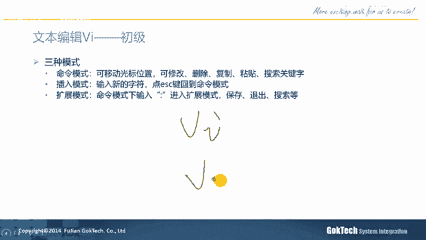

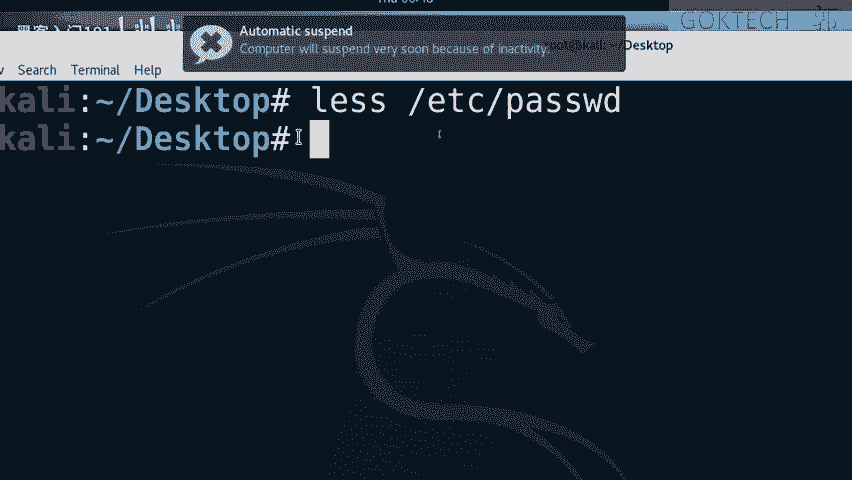

### 文件传输与远程连接

为了解决Linux虚拟机与Windows宿主机之间的文件交换问题，可以使用支持SSH协议的工具，如 `Xshell`、`SecureCRT` 或 `MobaXterm`。

**基本步骤**：
1.  在Linux虚拟机中确保SSH服务已安装并启动（Kali默认已安装）。
2.  在Windows上使用SSH客户端工具，输入虚拟机的IP地址、用户名（如 `root`）和密码进行连接。
3.  连接成功后，通常可以通过拖拽或客户端自带的功能在Windows和Linux之间传输文件。

---

## 🌐 计算机网络基础入门

上一节我们完成了Linux基础的学习，本节中我们将转向计算机网络，这是理解网络流量分析的关键。

### 网络发展概述

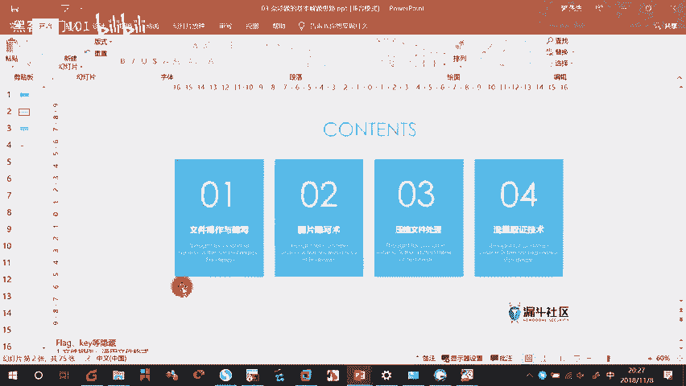

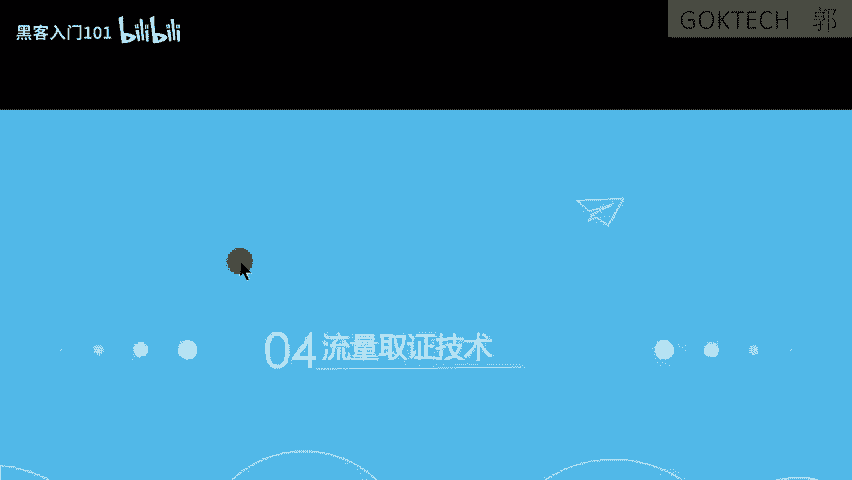

早期信息传递方式（如烽火、鼓声、飞鸽）存在可靠性问题。直到电的发明，电报、电话的出现才改变了通信方式。60年代末，世界上第一个实验型网络“阿帕网”诞生，最初只有4个节点。

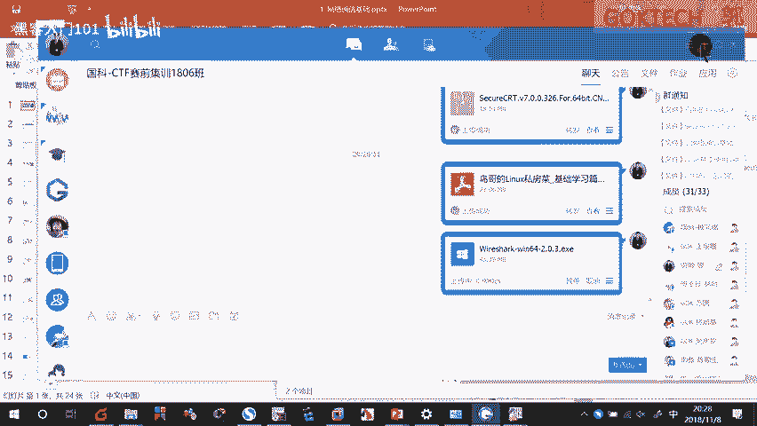

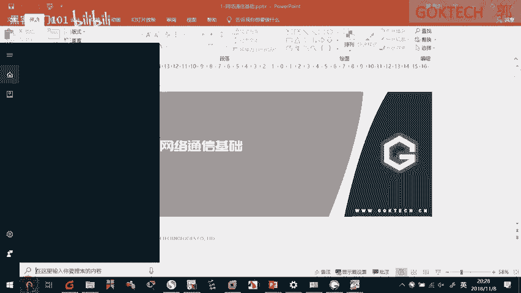

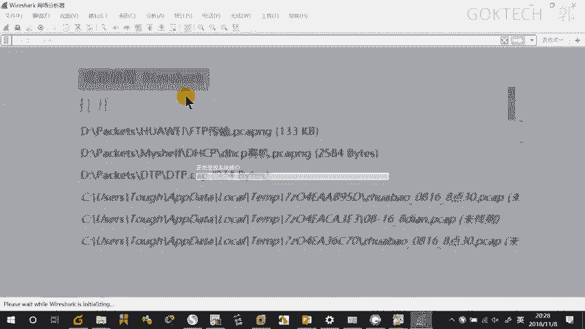

现代网络由各类设备组成：
*   **终端设备**：电脑、手机、Pad等。
*   **互联设备**：交换机（接口多，用于连接多台设备）、路由器（连接不同网络，实现上网）。
*   **传输介质**：双绞线（网线）、光纤、无线电波（无线）。

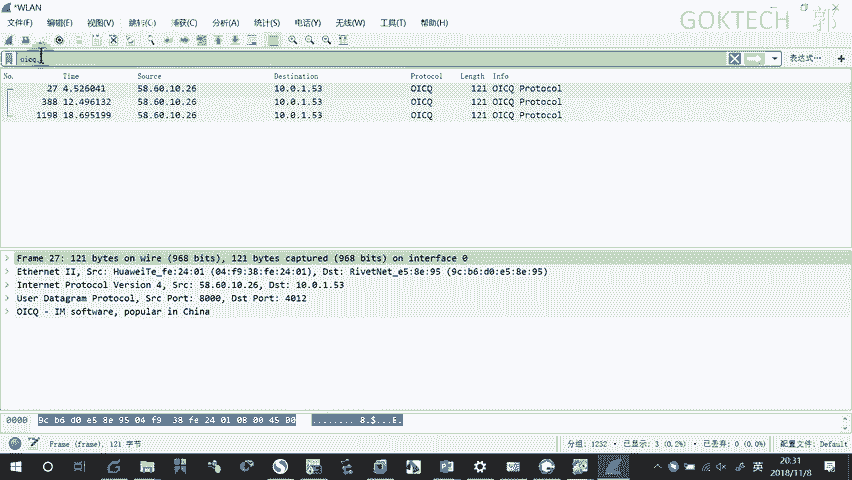

### 网络协议与OSI模型

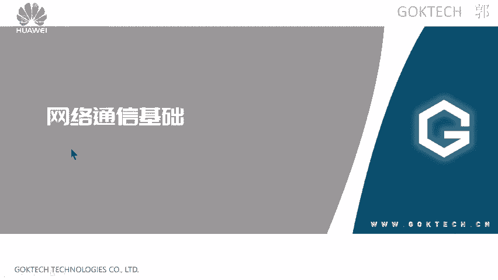

为了让不同厂商的设备能够通信，必须遵循统一的标准，这就是**网络协议**。

**OSI七层参考模型** 是理解网络通信过程的经典框架，它将通信过程分为七层，每一层都有特定的功能：

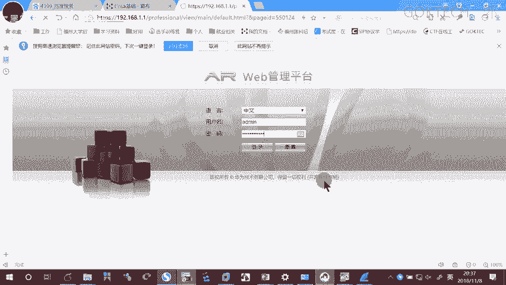

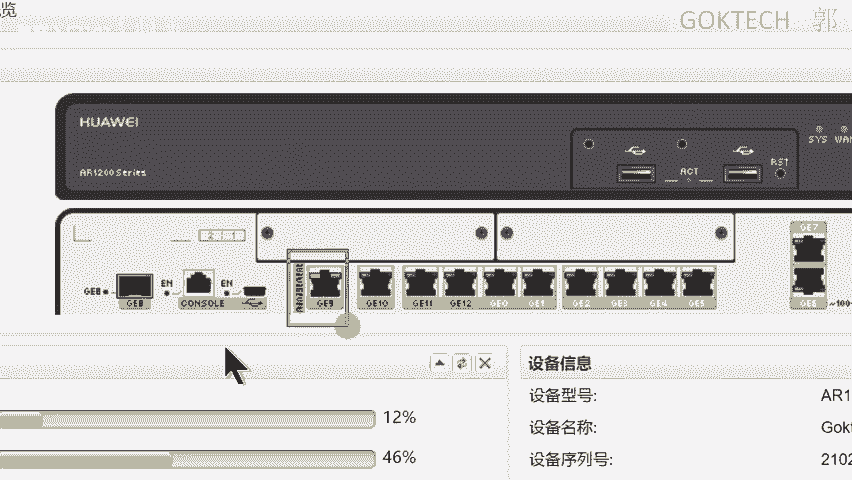

1.  **应用层**：为应用程序提供网络服务接口（如QQ、浏览器）。
2.  **表示层**：负责数据格式转换、加密解密。
3.  **会话层**：建立、管理和终止应用程序之间的会话。
4.  **传输层**：提供端到端的可靠或不可靠数据传输（如TCP、UDP），通过**端口号**区分不同应用。
5.  **网络层**：进行逻辑寻址和路由选择，核心协议是IP。
6.  **数据链路层**：在物理网络之上建立数据链路，进行MAC地址寻址和差错校验。
7.  **物理层**：定义物理介质标准，传输比特流（0和1）。

数据发送时，从上到下层层封装，添加头部信息；数据接收时，从下到上层层解封装，读取头部信息。

在实际中，更常用的是 **TCP/IP五层模型**：应用层、传输层、网络层、数据链路层、物理层。

### 网络抓包初步

抓包是分析网络流量、进行安全审计和CTF流量取证题的基础。`Wireshark` 是一款强大的网络抓包与分析工具。

**抓包核心概念——五元组**：
一个网络连接通常由以下五个元素唯一标识，称为“五元组”：
1.  源IP地址
2.  源端口号
3.  目的IP地址
4.  目的端口号
5.  传输层协议（TCP或UDP）

**在Wireshark中**：
*   可以清晰地看到网络分层结构。
*   可以过滤特定协议（如 `tcp`）、IP地址（如 `ip.addr == 192.168.1.1`）或端口（如 `tcp.port == 80`）的流量。
*   通过分析数据包内容，可以还原HTTP会话、提取文件或分析协议交互过程，这在CTF的流量分析题中至关重要。

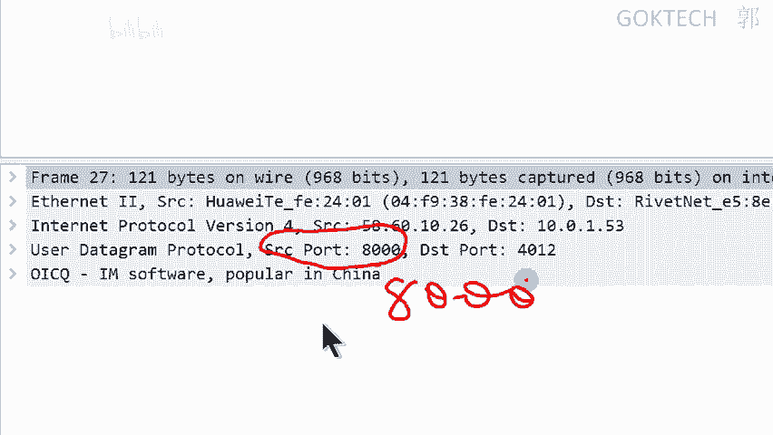

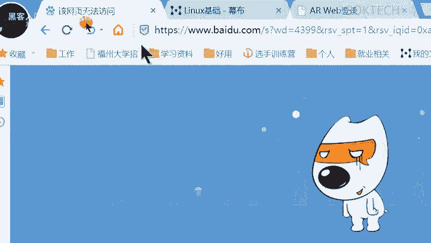

---

## 📚 总结

本节课中我们一起学习了CTF必备的Linux基础和网络基础。

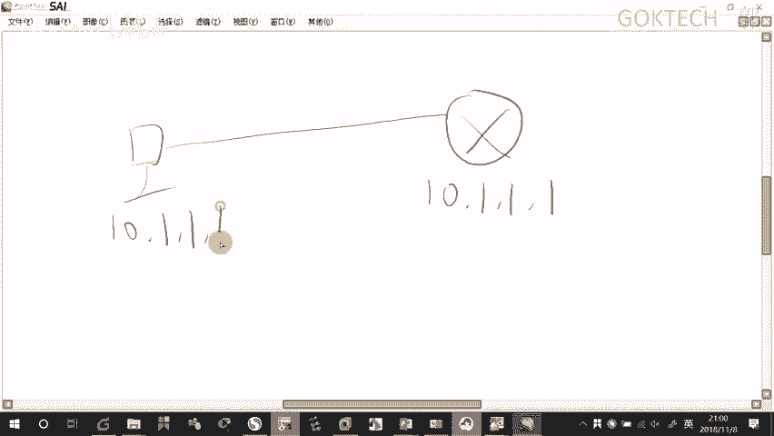

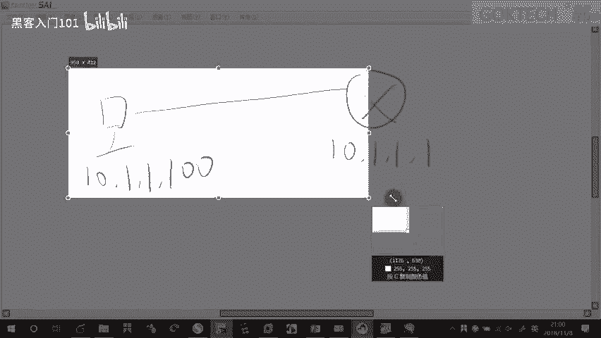

在Linux部分，我们了解了其发展历史、主要发行版、基础文件操作命令、VI编辑器使用以及网络配置。重点是熟悉命令行操作，这是安全工作的基础环境。

在网络部分，我们了解了网络设备构成、OSI/TCP/IP模型的核心思想，并初步接触了使用Wireshark进行网络抓包和分析的方法，理解了“五元组”的概念。

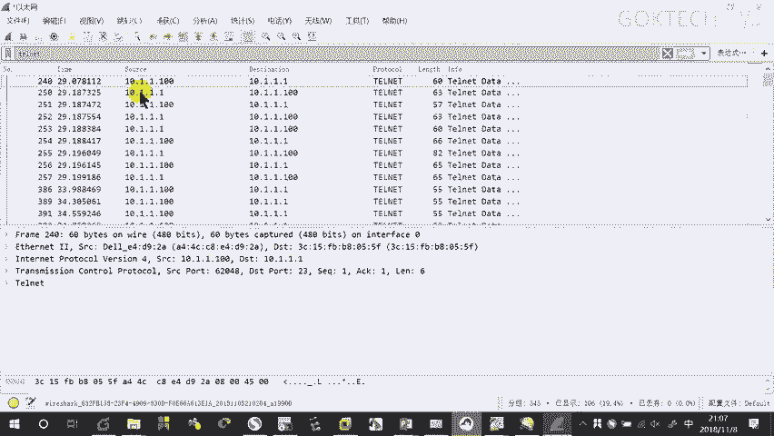

掌握这些基础知识，将为后续学习更高级的CTF技能（如漏洞利用、逆向工程、密码学等）打下坚实的根基。建议多加练习，特别是Linux命令和抓包工具的使用。