# Windows系统安全：1：Windows系统安全基础

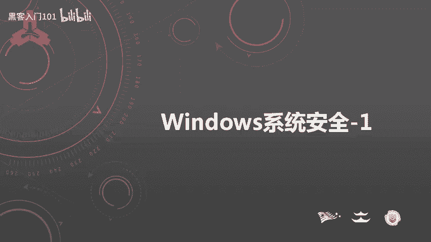

在本节课中，我们将要学习Windows系统安全的基础知识。作为最常用的操作系统，了解其安全机制对于安全工作者至关重要。本节内容将分为四个部分：常用命令、账户安全、本地安全策略和口令安全。

## 常用命令 🛠️

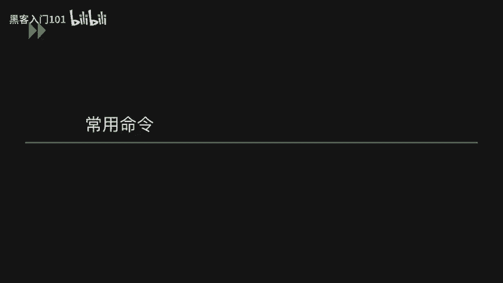

上一节我们介绍了课程概述，本节中我们来看看Windows系统中的常用命令。掌握这些命令不仅能提高操作效率，还能在不同系统版本间快速定位配置。

以下是常用命令列表：

*   **查看系统版本**：`winver`
*   **查看主机名**：`hostname`
*   **查看网络配置**：`ipconfig /all`
*   **查看用户**：`net user`
*   **查看开放端口**：`netstat -ano`
*   **打开注册表**：`regedit`
*   **打开事件查看器**：`eventvwr.msc`
*   **打开系统服务**：`services.msc`
*   **打开组策略编辑器**：`gpedit.msc`
*   **打开本地安全策略**：`secpol.msc`
*   **打开本地用户和组**：`lusrmgr.msc`

## 账户安全 👤

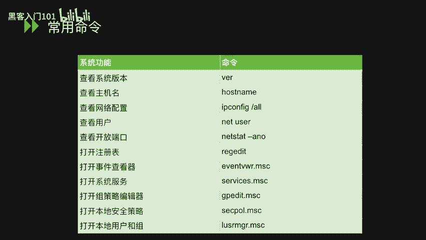

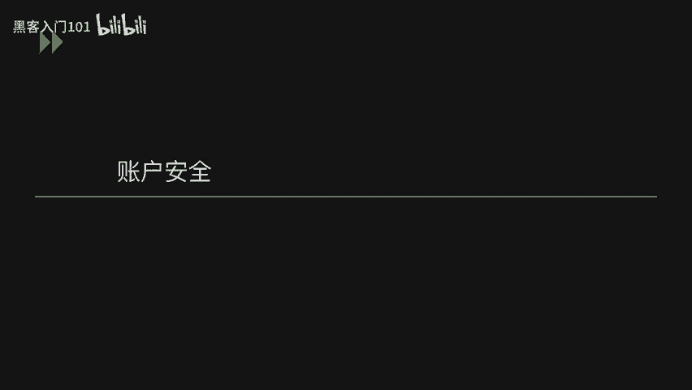

了解了基本命令后，我们进入账户安全部分。账户是系统访问控制的核心，管理好账户是保障安全的第一步。

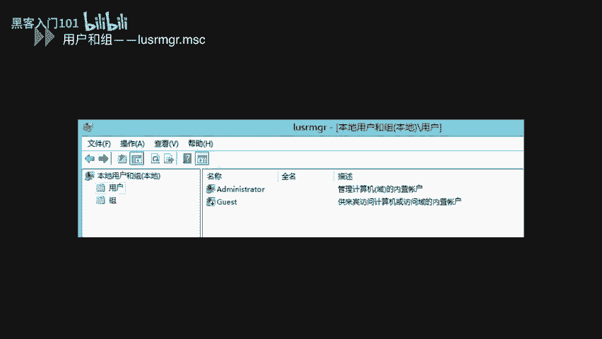

我们可以使用 `lusrmgr.msc` 命令打开本地用户和组管理器。在管理器中，可以查看、创建和管理用户账户。用户图标下的向下箭头表示该账户已被禁用。

在创建用户时，建议为特定应用程序或服务创建独立账户。这样可以在程序出现漏洞时，限制其对整个系统的影响。

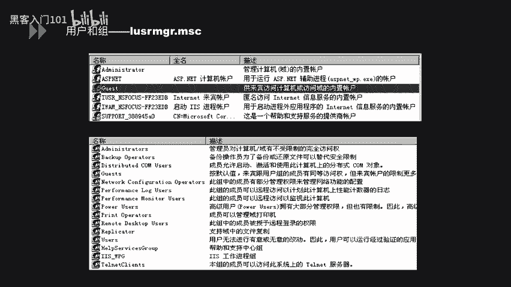

用户可以被添加到不同的用户组中，通过对用户组分配权限，可以批量管理用户权限。

以下是两个常用的账户管理命令：

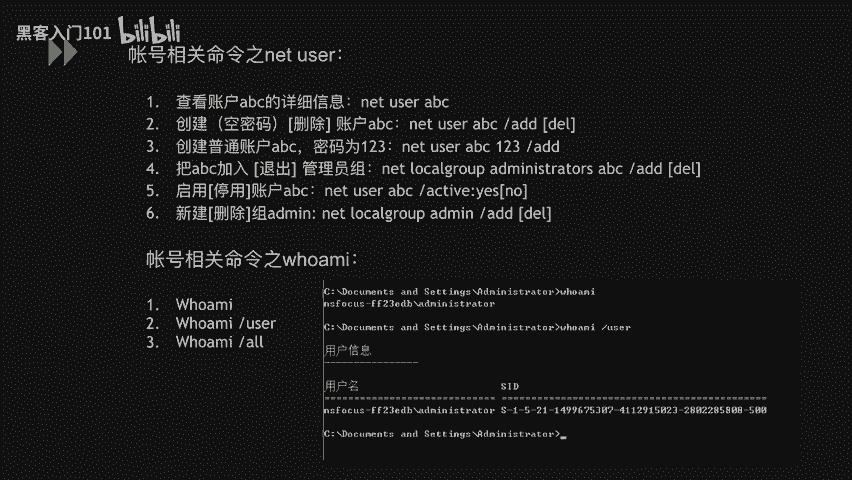

*   **`net user`**：用于查看用户信息、创建用户、设置密码、将用户添加到组、启用/禁用用户以及删除用户。
*   **`whoami`**：查看当前登录用户。使用 `/all` 参数可以查看更详细的用户信息，包括其所属的组。

### 隐藏账户创建示例

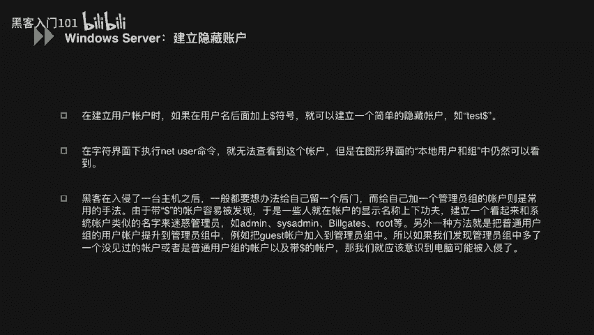

攻击者在获取系统权限后，为了维持长期控制，可能会创建隐藏账户。这可以防止管理员在修复漏洞或更改密码后失去访问权限。

以下是创建隐藏账户的步骤：

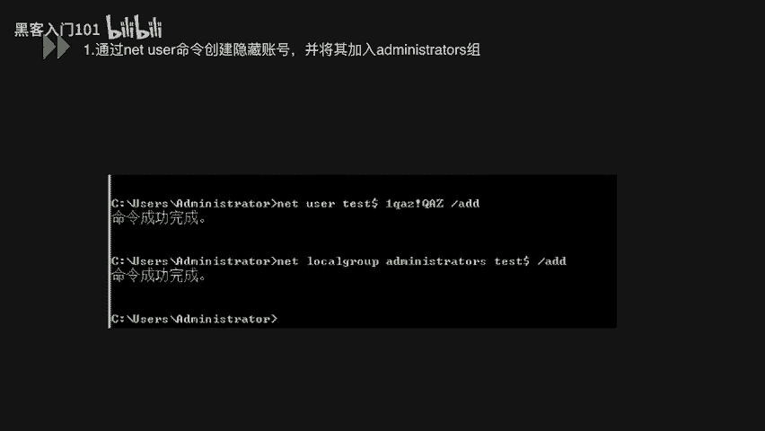

1.  **创建隐藏账户并加入管理员组**：
    ```cmd
    net user test$ Password123 /add
    net localgroup administrators test$ /add
    ```
    账户名后的 `$` 符号是创建隐藏账户的关键。

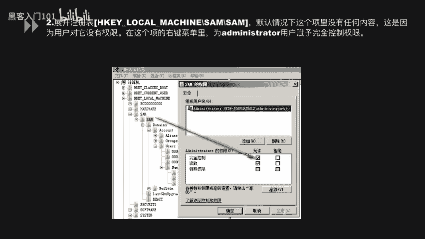

2.  **修改注册表权限**：
    *   运行 `regedit` 打开注册表。
    *   定位到 `HKEY_LOCAL_MACHINE\SAM\SAM`。
    *   默认无权限查看，需右键 `SAM` 文件夹，选择“权限”，为 `Administrators` 组添加“完全控制”权限。

3.  **导出账户注册表信息**：
    *   刷新注册表后，在 `SAM\Domains\Account\Users\Names` 下找到 `test$` 项。
    *   在 `Users` 下找到对应的子项（如 `000003E9`）。
    *   将 `test$` 和其对应的子项（如 `000003E9`）分别导出为 `.reg` 文件。

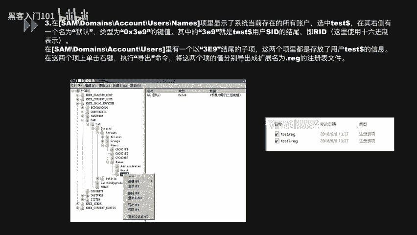

4.  **删除命令行中的账户**：
    ```cmd
    net user test$ /delete
    ```

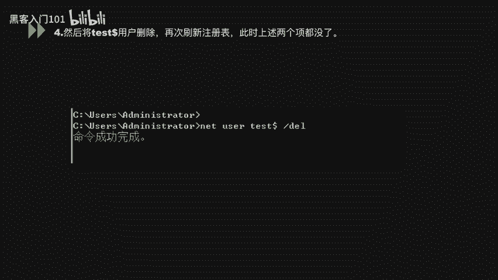

5.  **导入注册表文件**：
    *   在注册表编辑器中，右键选择“导入”，将步骤3中导出的两个 `.reg` 文件导入。
    *   此时，在命令行和用户管理界面中已看不到 `test$` 账户，但该账户仍存在于注册表中并可登录。

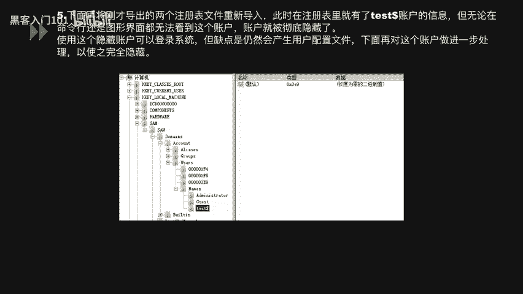

6.  **完全隐藏（克隆管理员）**：
    *   在注册表中找到管理员账户（如 `Administrator`）对应的子项（如 `000001F4`）。
    *   将其 `F` 键值复制。
    *   粘贴到隐藏账户（如 `000003E9`）的 `F` 键值中。
    *   这样，系统会将 `test$` 视为 `Administrator` 的影子账户，共享同一用户配置文件，实现完全隐藏。

验证时，使用 `net user` 命令或图形界面均无法看到 `test$` 账户。

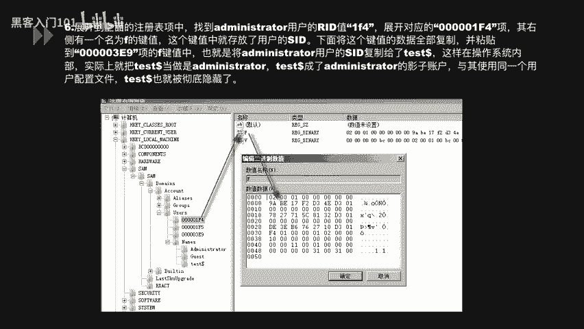

## 本地安全策略 ⚙️

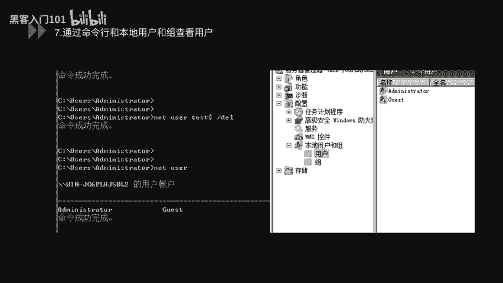

账户管理完成后，我们需要通过策略来约束账户行为。本地安全策略是配置系统安全规则的重要工具。

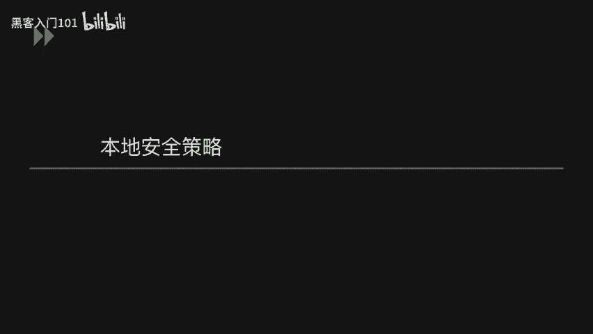

运行 `secpol.msc` 可以打开本地安全策略。其中包含账户策略、本地策略、高级安全Windows防火墙等设置。

在“账户策略” -> “密码策略”中，可以配置以下关键项：

*   **密码必须符合复杂性要求**：启用后，密码需包含大小写字母、数字和符号。
*   **密码长度最小值**：设置密码的最小长度，例如8位或12位。
*   **密码最短使用期限**：设置密码更改后必须使用的最短天数（例如1天），防止频繁改密。
*   **密码最长使用期限**：设置密码的有效期，到期后必须更改。
*   **强制密码历史**：系统记住的旧密码数量，防止重复使用近期密码。
*   **用可还原的加密来存储密码**：通常应禁用，以使用更安全的不可逆加密方式存储密码。

在“账户策略” -> “账户锁定策略”中，可以配置：

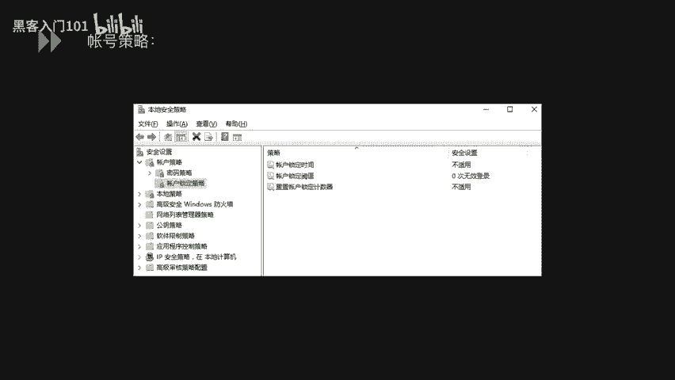

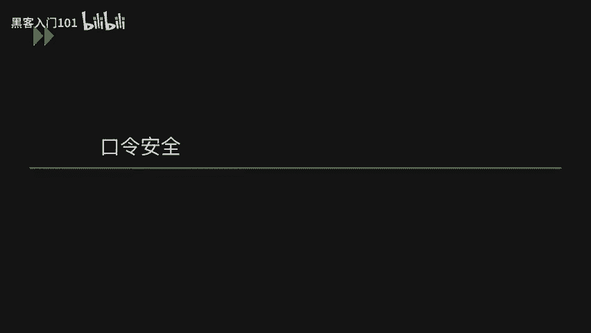

*   **账户锁定阈值**：登录失败尝试次数，超过后账户将被锁定。
*   **账户锁定时间**：账户被锁定的时长。
*   **重置账户锁定计数器**：失败尝试计数器的重置时间间隔。

## 口令安全 🔐

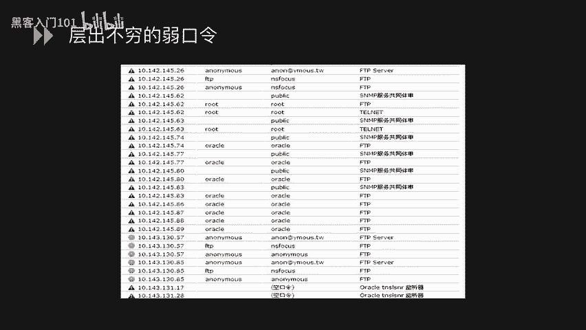

策略配置能规范密码设置，但弱口令仍是主要风险。攻击者常利用弱口令快速获取系统权限。

渗透测试中常会扫描到FTP、数据库、SSH等服务的弱口令。

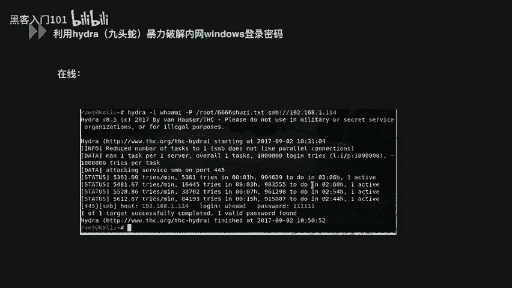

### 弱口令检查方法

了解风险后，我们学习如何检查系统是否存在弱口令。主要有在线和离线两种方式。

**1. 在线检查（使用Hydra）**
Hydra是一款支持多种协议（如SMB、HTTP、FTP、SSH）的在线密码破解工具。
```bash
hydra -l admin -P passlist.txt smb://192.168.1.114
```
*   `-l admin`：指定用户名。
*   `-P passlist.txt`：指定密码字典文件。
*   `smb://192.168.1.114`：指定目标主机和协议。
执行后，若破解成功，会显示用户名和对应的弱密码。

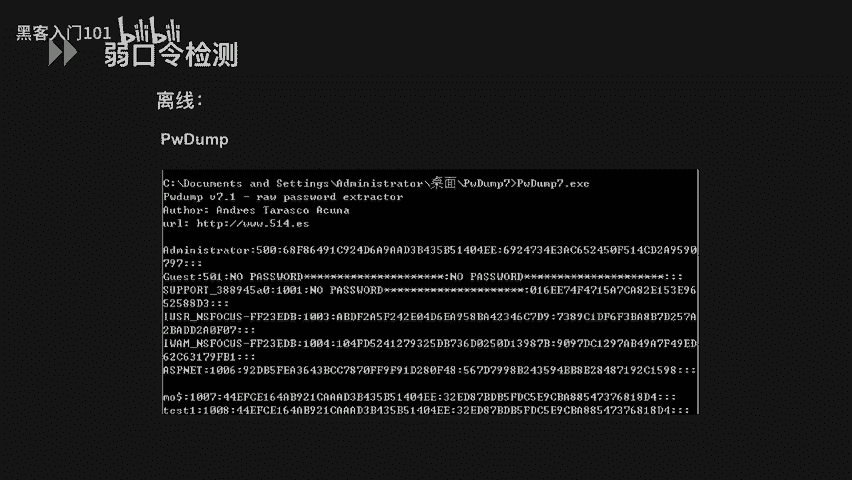

**2. 离线检查（避免触发账户锁定）**
如果系统设置了账户锁定策略，在线暴力破解可能触发锁定。此时应采用离线方式。
*   **提取密码哈希**：使用 `pwdump` 等工具从被锁定的 `SAM` 文件中提取用户密码的哈希值。
*   **使用彩虹表破解**：将提取出的哈希值导入彩虹表工具进行碰撞破解。彩虹表基于预计算的哈希链，可以快速反查出原始弱密码，例如 `admin`、`123456` 等。

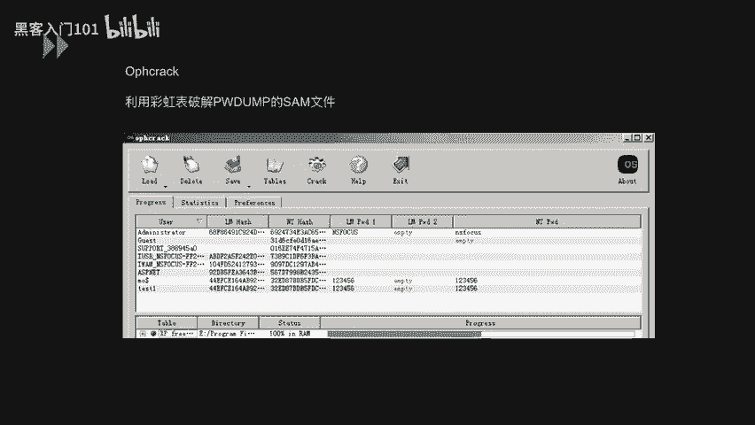

---


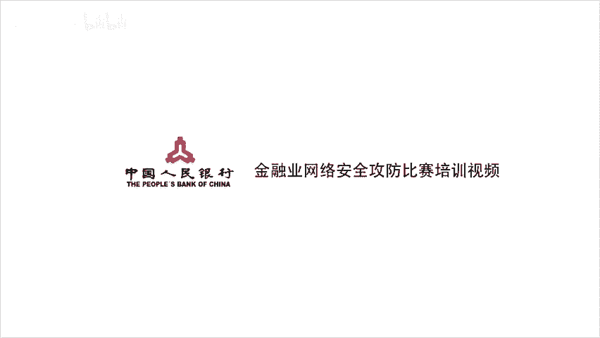

本节课中我们一起学习了Windows系统安全的基础知识。我们首先掌握了一系列常用的系统管理命令。接着，深入探讨了账户安全管理，包括普通账户管理和隐藏账户的创建原理。然后，我们了解了如何通过本地安全策略来规范密码和账户锁定行为。最后，我们学习了弱口令的风险以及如何使用在线和离线两种方法来检查系统是否存在弱口令。这些是构建Windows系统安全防线的第一步。