# Windows系统安全：2：Windows安全配置规范 🔧

在本节课中，我们将学习Windows安全配置规范。主要内容包括系统服务的管理、服务与进程的安全关联、日志审核策略的配置以及NTFS文件权限的控制。掌握这些知识有助于加固Windows系统，提升安全性。

---

## 系统服务 🛠️

上一节我们介绍了Windows系统安全的基础概念，本节中我们来看看如何管理系统服务。系统服务是Windows操作系统中在后台运行的程序，负责执行特定功能。

想查看系统中有哪些服务，可以使用 `services.msc` 命令。在CMD中直接输入此命令，即可打开服务管理界面。该界面会显示系统中所有服务的状态（如“已启动”或“已停止”）和启动类型（如“手动”、“禁用”、“自动”等）。

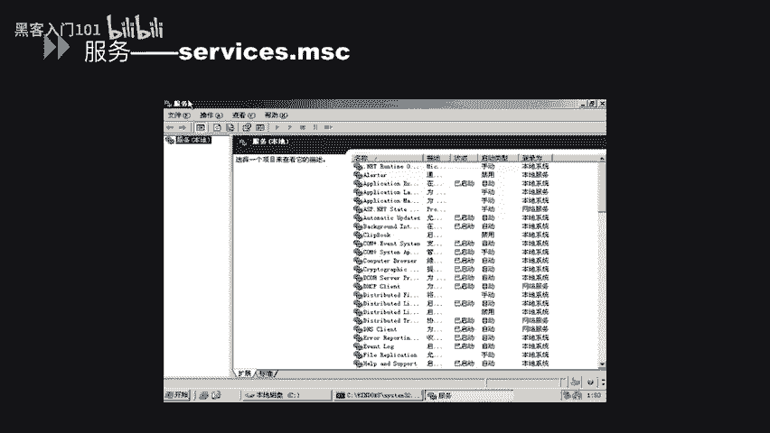

接下来，我们可以查看某个服务的具体属性。以“Apache2.2”服务为例，右键点击该服务并选择“属性”。在“常规”选项卡中，可以看到服务名称、可执行文件路径和启动类型设置。在“登录”选项卡中，可以设置运行此服务的账户身份。“恢复”选项卡允许配置服务失败时计算机的响应操作。“依存关系”选项卡则列出了此服务所依赖的其他服务或组件。

以下是使用系统命令开启和关闭服务的方法：
*   停止服务：`net stop [服务名]`
*   启动服务：`net start [服务名]`

例如，要停止名为“serv”的服务，可在命令行输入 `net stop serv`。系统可能会提示确认是否同时停止依赖服务。要重新启动该服务，则输入 `net start serv`。

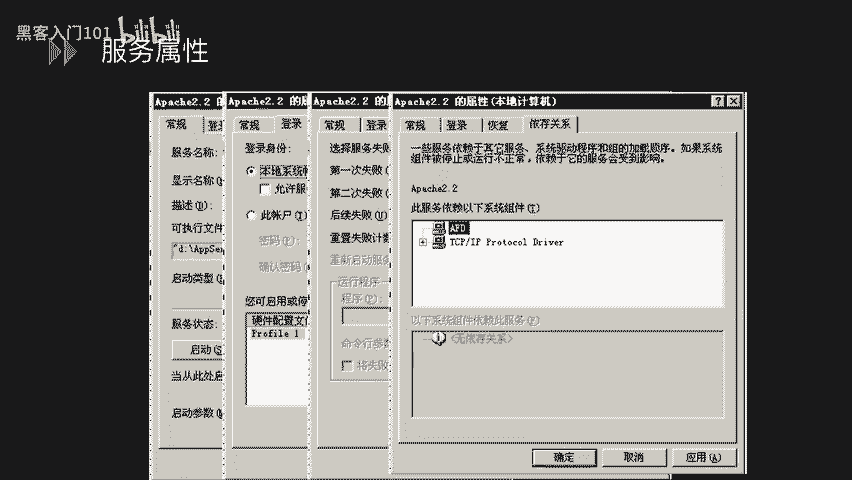

从安全角度考虑，某些不必要或存在已知漏洞的服务应被禁用。建议将以下服务的启动类型修改为“手动”或“禁用”：
*   **serv** 服务：存在MS06-040和MS08-067等缓冲区溢出漏洞，可导致远程代码执行。
*   **print spooler** 服务：存在MS10-061漏洞，是Windows打印机远程服务代码执行漏洞。
*   其他非必需服务。

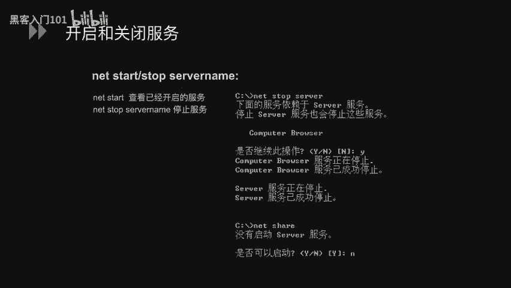

遵循最小化安装原则，停止不使用的服务，可以降低系统被攻击的风险。

服务配置信息存储在Windows注册表中。可以通过 `regedit` 命令打开注册表编辑器，定位到以下路径：
`HKEY_LOCAL_MACHINE\SYSTEM\CurrentControlSet\Services`
每个服务项下都有一个名为 **`Start`** 的数值，它决定了服务的启动方式（例如，2=自动，3=手动，4=禁用）。

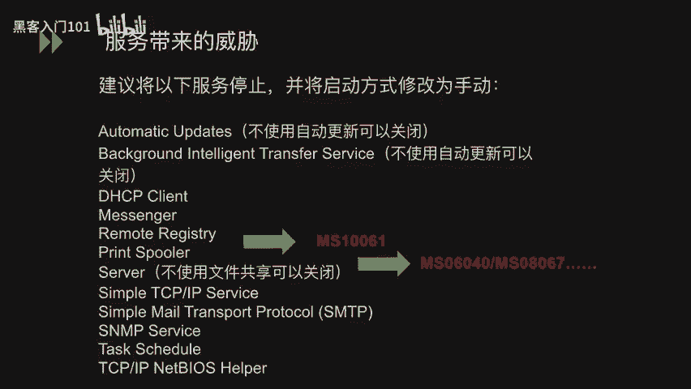

---

## 服务于进程安全 🔄

了解了系统服务的管理后，本节我们来看看服务与进程之间的安全关联。进程是正在运行的程序实例，而服务通常以后台进程的形式运行。

首先，需要熟悉一些基本的系统进程。可以通过任务管理器查看这些进程，了解哪些是系统正常运行所必需的。

有时我们需要排查端口占用问题。以下是查看端口与进程对应关系的方法：
1.  使用 `netstat -ano` 命令查看所有网络连接和监听端口及其对应的进程ID（PID）。
2.  记下占用特定端口（例如443端口）的PID。
3.  打开任务管理器，在“详细信息”或“进程”选项卡中，按PID排序，找到对应的进程名称。

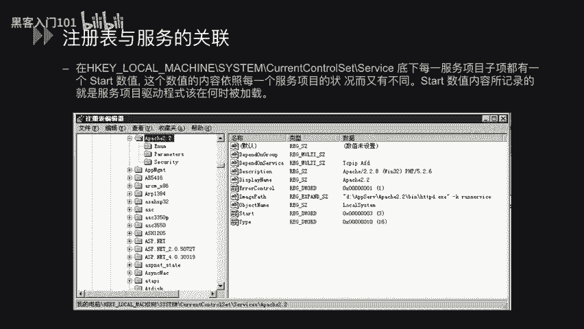

例如，执行 `netstat -ano` 后发现443端口被PID为4368的进程占用。在任务管理器中找到PID 4368，即可看到对应的进程名称为“vmware-hostd.exe”。

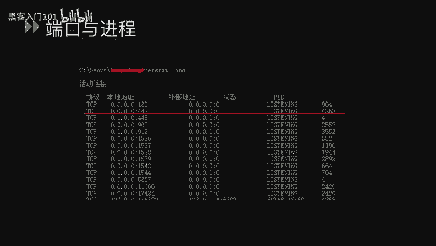

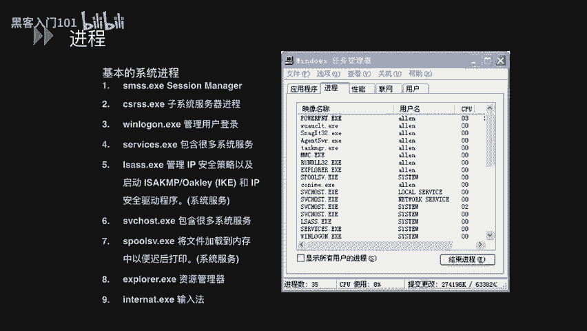

---

## 日志审核 📝

上一节我们探讨了进程安全，本节中我们将学习如何配置Windows的日志审核策略。完善的日志记录是事后审计和追踪安全事件的关键。

Windows日志主要存放在以下位置：
*   **默认日志**：包括“应用程序”、“安全”、“系统”日志，存放于 `%SystemRoot%\System32\Winevt\Logs\`。
*   **其他服务日志**：如IIS的FTP连接日志、HTTP事务日志等，通常存放于 `%SystemRoot%\System32\LogFiles\`。

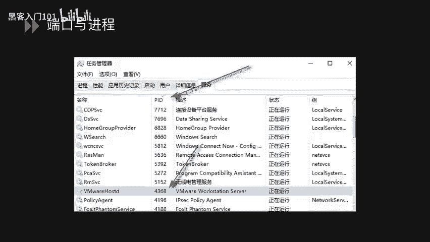

可以通过“事件查看器”（运行 `eventvwr.msc`）来查看和分析这些日志。

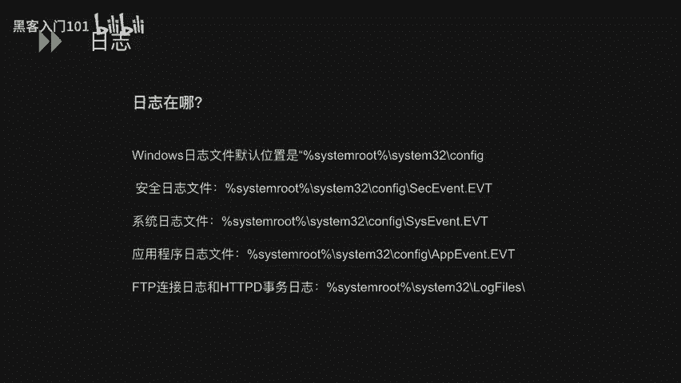

为了确保记录关键安全事件，需要配置审核策略。运行 `secpol.msc` 打开“本地安全策略”，导航至“本地策略”->“审核策略”。这里列出了多项可审核的策略，如“审核账户登录事件”、“审核对象访问”等。对于每项策略，可以设置为“无审核”、“仅审核成功”、“仅审核失败”或“成功和失败都审核”。

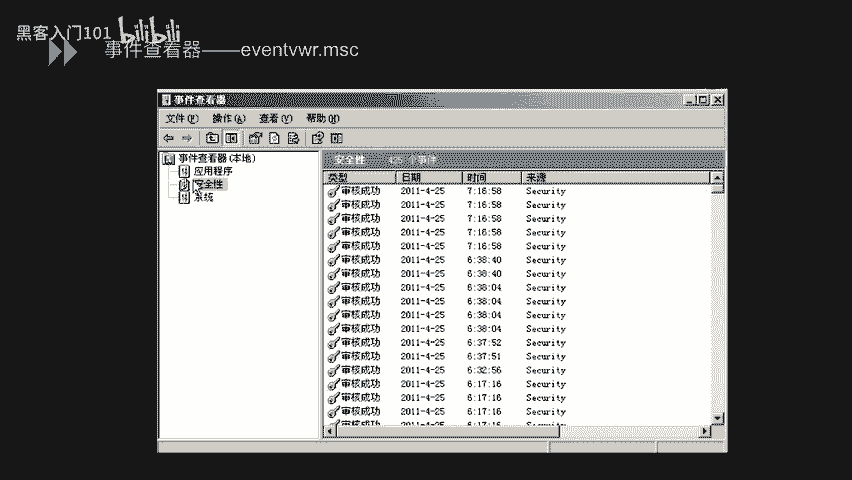

---

## 文件权限控制 🔐

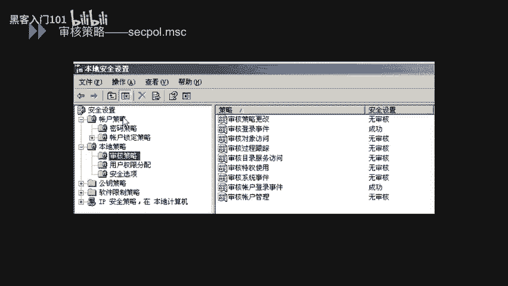

在配置好日志审核后，最后我们来学习Windows文件系统的权限控制。本节内容主要针对NTFS文件系统。

NTFS权限具有以下特点：
1.  权限同时影响网络访问和本地访问。
2.  权限可以分配给驱动器、文件夹、文件、注册表键值等对象。
3.  不同用户或组对同一对象可以拥有不同的权限。

如果磁盘是FAT或FAT32格式，可以使用 `convert [驱动器盘符:] /fs:ntfs` 命令将其转换为NTFS格式（此过程不可逆）。

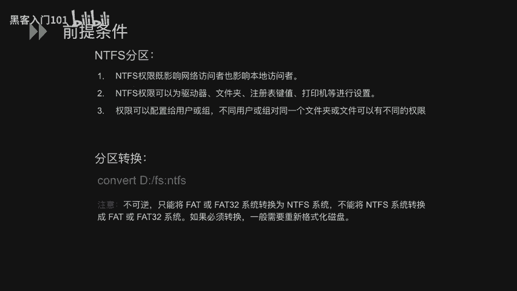

NTFS文件权限可以进行细粒度控制。右键点击文件或文件夹，选择“属性”->“安全”选项卡。在此界面中，“组或用户名”列表显示了对此对象有权限的账户；“权限”列表则显示了选中账户所拥有的具体权限（如“完全控制”、“修改”、“读取和执行”等），每一项都可以设置为“允许”或“拒绝”。

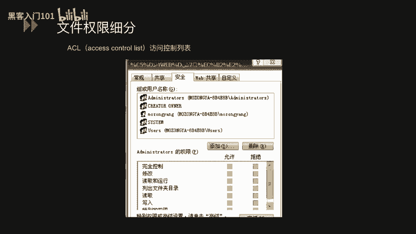

理解权限的优先级和继承规则非常重要：
*   **权限优先级**（从高到低）：直接设置的“拒绝” > 直接设置的“允许” > 继承的“拒绝” > 继承的“允许”。
*   **移动/复制对权限的影响**：
    1.  在同一NTFS分区内移动：保留原权限。
    2.  在不同NTFS分区间移动或复制：继承目标位置的新权限。
    3.  移动或复制到FAT/FAT32分区：所有NTFS权限丢失。

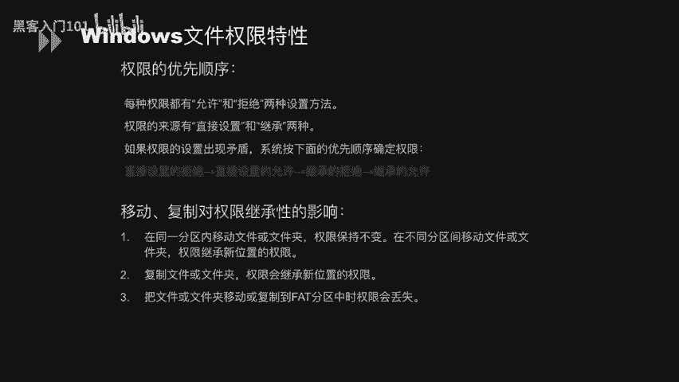

---

## 总结 📚

本节课中我们一起学习了Windows安全配置规范的四个核心部分：
1.  **系统服务管理**：包括服务的查看、配置、启动/停止命令，以及从安全角度禁用高风险服务。
2.  **服务于进程安全**：熟悉系统进程，并掌握通过端口查找对应进程的方法。
3.  **日志审核**：了解日志存放位置，并学会配置审核策略以记录关键安全事件。
4.  **文件权限控制**：掌握NTFS权限的设置方法、优先级规则以及移动/复制操作对权限的影响。

通过合理配置这些方面，可以显著提升Windows系统的整体安全性。

