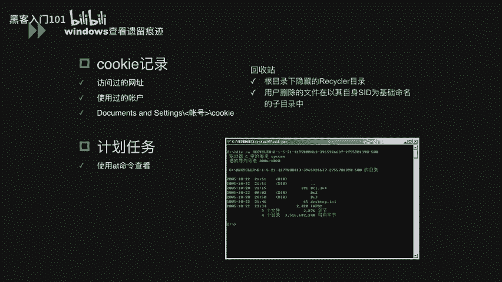
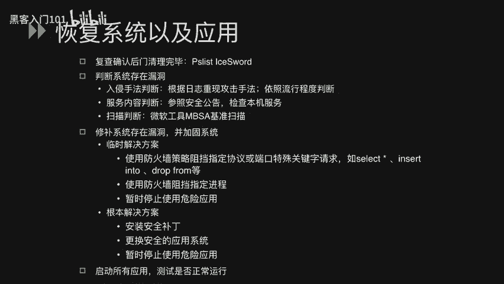

# Windows系统安全：3：Windows入侵调查 🕵️

在本节课中，我们将学习Windows系统安全中关于入侵调查的完整流程。我们将从如何及早发现系统异常开始，接着学习如何查看和分析日志以判断入侵情况，最后探讨如何恢复系统及应用程序的正常运行。

## 及早发现系统异常

上一节我们介绍了Windows安全的基础概念，本节中我们来看看如何主动发现系统被入侵的迹象。及早发现异常是进行有效响应的第一步。

我们可以通过以下几个方面来监控和发现系统异常：

以下是系统层面的监控点：
1.  **系统启动**：检查系统日志中的运行时间、网络连接时间等信息，判断系统是否有非预期的重启记录。
2.  **系统资源**：监控进程是否异常占用大量CPU或物理内存，以及磁盘空间是否被未知文件快速消耗。
3.  **网络流量**：留意是否收到大量SYN、SMP数据包或其他异常流量，这可能是DDoS攻击的迹象。

除了系统本身，还可以借助以下途径：
*   **边界安全产品**：如IDS/IPS、WAF等防火墙的告警信息。
*   **用户反馈**：其他管理员或用户报告的功能异常或使用问题。

发现异常后，需要搜集攻击者可能遗留的痕迹。以下是Windows系统中常见的痕迹位置：

以下是关键痕迹检查点：
*   **IE临时文件**：记录访问过的网页信息。
*   **访问地址记录**：记录访问过的网址和本地文件夹路径，可按日期排序。
*   **使用过的文档记录**：记录近期打开、修改或移动的文档。
*   **Cookie信息**：浏览器保存的访问网址和登录账户信息。
*   **计划任务**：通过 `schtasks` 命令查看，可能包含攻击者设置的定时任务。
*   **回收站**：检查 `$Recycle.Bin` 目录下未彻底清理的文件。
*   **注册表**：查看 `HKEY_LOCAL_MACHINE\SOFTWARE` 和用户账户相关键值，可能发现已删除软件或隐藏账户。
*   **用户目录**：检查 `C:\Users\` 或 `C:\Documents and Settings\` 目录。若存在某用户目录但该用户已不在列表中，说明该账户曾被创建并删除。

## 查看日志分析入侵情况

在发现系统异常后，下一步是深入分析日志，以确定入侵的具体方式和时间。日志是调查过程中最关键的证据来源。

首先，需要查看各类审核日志。以下是主要的日志类型及其作用：

以下是核心日志类型：
1.  **系统日志**：记录驱动程序状态、系统进程与服务状态变更、补丁安装情况。
    *   **关键信息**：系统重启时间、服务异常时间、弹出特定错误对话框（如终端连接数超限）的时间。
2.  **应用程序日志**：记录用户应用程序的活动情况。
    *   **关键信息**：防火墙被关闭、杀毒软件防护被禁用或发出病毒警告、软件被安装或删除的时间。
3.  **安全性日志**：记录登录行为、特权使用及安全审核结果。
    *   **关键信息**：用户成功/失败登录的时间、审核策略被更改的时间。
4.  **Web日志 (如IIS)**：记录Web服务器接收的请求。
    *   **关键请求特征**：
        *   上传/下载请求（如包含 `uploadfile.asp`, `download.php`）。
        *   包含SQL关键字的请求（如 `SELECT`, `INSERT INTO`, `DROP TABLE`）。
        *   包含测试注入的异常参数（如单引号 `‘`、`--`、`OR 1=1`）。
    *   **服务器状态码**：
        *   `2xx`：请求成功。
        *   `4xx`：客户端错误。
        *   `5xx`：服务器端错误。异常数量的 `4xx` 或 `5xx` 错误可能表明攻击尝试。

**注意**：有效分析日志的前提是日志功能已开启并得到妥善保存。建议配置更长的本地日志保留时间或使用专用的远程日志服务器。

Windows安全日志会记录登录类型，这有助于判断攻击者的入侵途径。以下是常见的登录类型代码：

| 登录类型 | 描述 |
| :--- | :--- |
| 2 | 交互式登录（在控制台直接登录） |
| 3 | 网络登录（如访问共享文件夹） |
| 4 | 批处理登录（计划任务） |
| 5 | 服务登录（服务启动） |
| 7 | 解锁屏幕 |
| **10** | **远程交互式登录（通过远程桌面/RDP登录）** |

例如，如果发现攻击者在非工作时间以**类型10**登录，则很可能通过RDP服务入侵。

## 恢复系统以及应用程序

分析完入侵情况后，最终目标是清除威胁并让系统恢复正常。本节我们将学习系统恢复的步骤。

恢复工作应遵循以下流程：

以下是系统恢复的核心步骤：
1.  **清除后门与恶意程序**：根据调查结果，彻底删除攻击者安装的后门、木马或恶意软件。复查系统确保清理完毕。
2.  **判断并修补漏洞**：分析入侵手法，确定系统存在的漏洞。
    *   **服务漏洞**：参照安全公告（如微软安全公告MSRC）检查本机服务是否存在已知漏洞。
    *   **扫描验证**：使用微软官方工具（如 `Microsoft Baseline Security Analyzer`）进行基准安全扫描。
3.  **实施安全加固**：针对发现的漏洞采取修复措施。
    *   **临时解决方案**：作为应急措施，可使用防火墙规则阻止敏感端口、特定进程或危险应用。**此方法并不安全，仅作临时缓解**。
    *   **根本解决方案**：安装系统或服务的安全补丁；升级或更换存在漏洞的应用程序；若无法立即修复，可暂时停止相关危险服务。
4.  **测试验证**：完成修补和加固后，全面测试系统功能，确保业务能够安全、正常运行。

---

本节课中我们一起学习了Windows入侵调查的三个核心阶段：**及早发现系统异常**、**通过日志分析入侵情况**以及**恢复与加固系统**。掌握这套流程，能够帮助你在面对安全事件时，有条不紊地进行响应、分析和恢复，有效提升系统的安全防护与应急响应能力。