# Windows系统安全：4：Windows应急响应 🔍

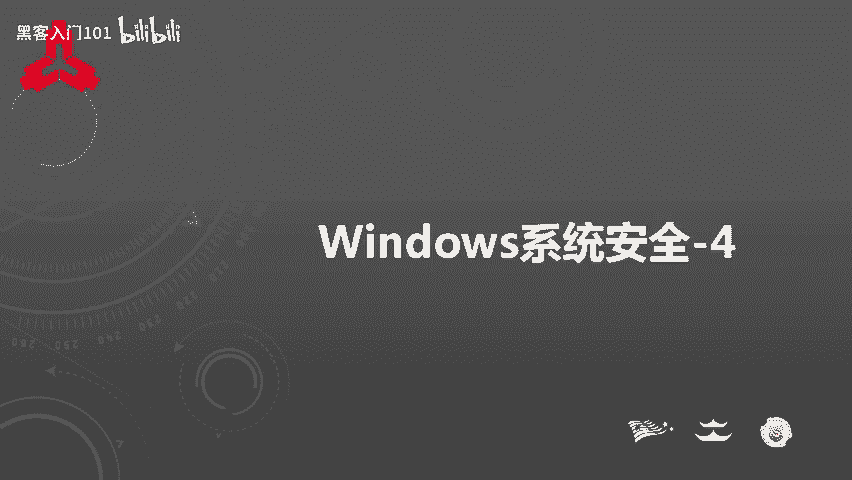

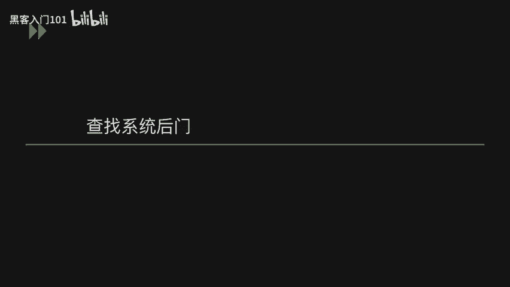

在本节课中，我们将学习Windows应急响应的核心内容。课程分为两个主要部分：第一部分介绍如何查找系统中的后门程序；第二部分讲解如何全面分析系统日志，以追踪攻击者的入侵路径。通过学习，你将掌握识别和应对Windows系统安全威胁的基本方法。

## 查找系统后门 🕵️

上一节我们介绍了Windows系统安全的基础概念，本节中我们来看看如何查找可能隐藏在系统中的后门程序。攻击者在获取系统权限后，通常会留下后门以便再次访问。以下是几种查找后门的方法和工具。

### 按启动项查找后门

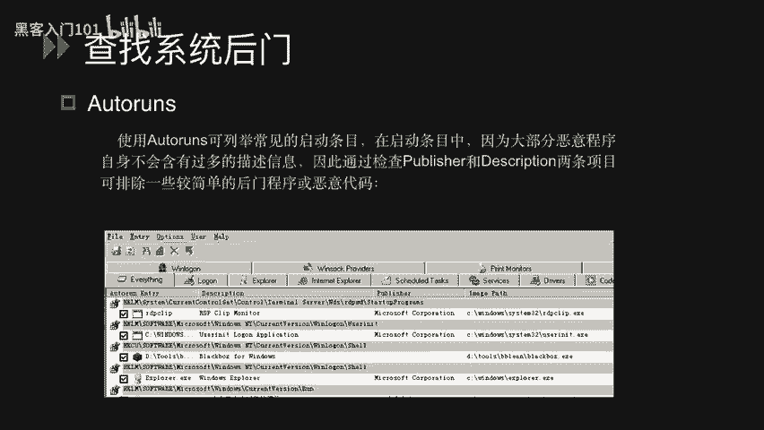

通过检查系统启动时自动加载的程序，可以发现可疑的后门。Windows自带的`MSConfig.exe`功能有限，而`Autoruns`工具更为强大。

`Autoruns`可以检查所有开机自动加载的程序，包括硬件驱动程序、Windows核心启动程序和应用程序。它能列出比`MSConfig`更多的项目，例如`LSA`、`IE`加载的DLL和其他组件。

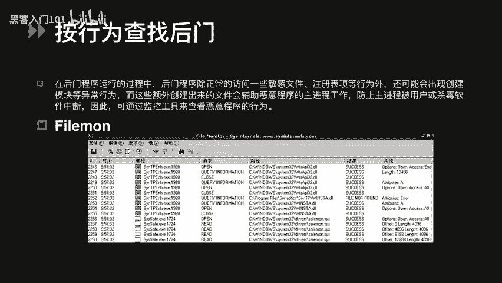

在启动条目中，恶意程序通常缺乏详细的描述信息。因此，可以通过检查`Publisher`和`Description`这两项来初步判断程序是否可疑。正常的程序（如Microsoft发布的）通常有明确的发布者信息，而恶意程序则可能没有。

### 按行为查找后门

后门程序在运行时，除了访问敏感文件和注册表，还可能创建辅助文件或模块。这些异常行为可以帮助我们识别恶意软件。

以下是用于监控系统行为的工具：

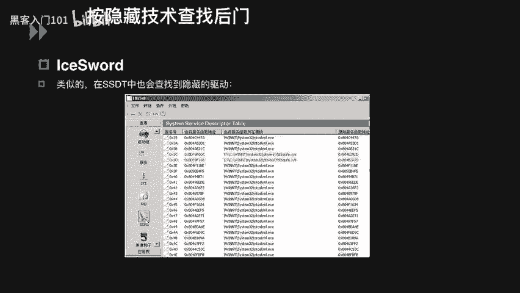

*   **Filemon**：这是一个文件监控工具。它以进程为线索，显示该进程如何访问文件、访问类型以及是否成功。你可以通过点击漏斗图标并输入进程名（例如`C1safe.exe`）来过滤和监视特定进程。
*   **Regmon**：这是一个注册表监控软件。它会记录所有与注册表相关的操作，如读取、修改和删除，并允许用户对记录进行保存、过滤和查找，为系统维护提供便利。

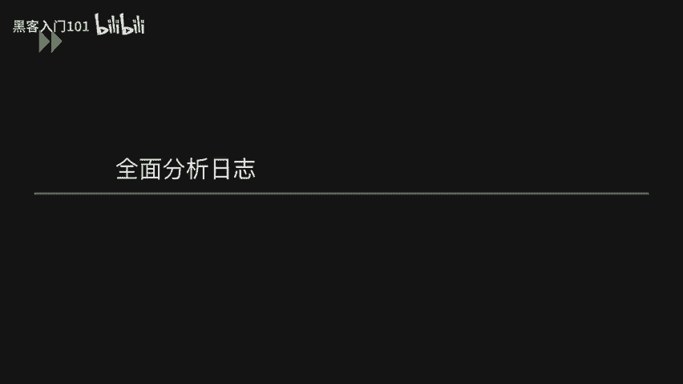

### 按隐藏技术查找后门

攻击者为了隐蔽，常会隐藏其进程或驱动。`IceSword`（冰刃）是一款功能强大的安全检测工具，可以帮助我们发现这些隐藏项。

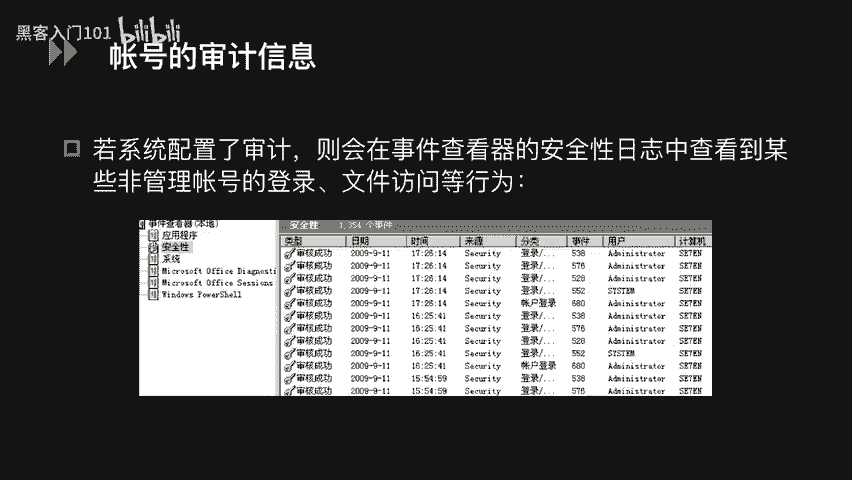

`IceSword`的进程功能可以显示系统中的隐藏进程，并将其标记为红色。同样，在`SSDT`（系统服务描述符表）中，它也能标记出隐藏的驱动程序。系统中正常的常用进程通常不会隐藏，因此被标记为红色的项非常可疑，需要进一步分析。

## 全面分析系统日志 📊

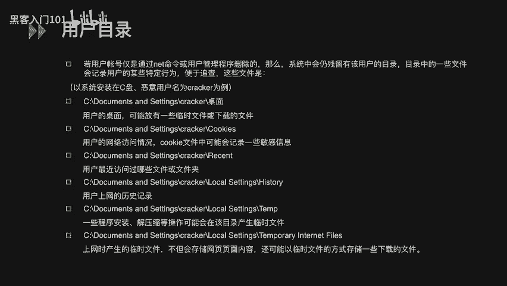

在学习了如何查找后门之后，本节我们将深入探讨如何通过全面分析系统日志来还原攻击事件。日志记录了系统的各种活动，是应急响应中至关重要的信息来源。

### 账号审计信息

如果系统配置了审计策略，可以在“事件查看器”的“安全日志”中查看账号的登录、文件访问等行为。日志会记录事件发生的时间、来源、类别以及登录的用户（如管理员、`SYSTEM`或自定义用户）。

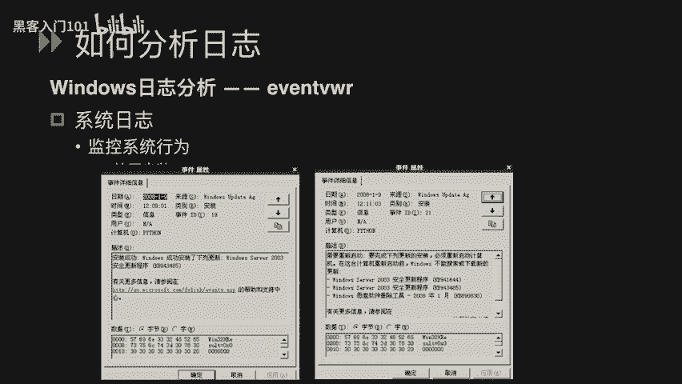

### 用户目录痕迹

无论是正常用户还是攻击者，登录系统后都会留下痕迹。这些痕迹可能存在于：
*   用户桌面上的临时或下载文件。
*   用户访问网络的历史记录，`Cookie`文件中可能包含敏感信息。
*   用户最近访问的文件夹历史。
*   程序安装或解压的操作记录。

### 具体日志分析示例

以下我们通过具体的日志类型来分析如何提取信息。

**1. 安全日志分析**
安全日志记录了与安全相关的事件。例如：
*   **登录/注销事件**：显示哪个用户在何时登录或注销系统。
*   **对象访问事件**：记录用户访问了哪个目录或文件，以及执行了何种操作。
*   **策略更改事件**：显示用户对系统审核策略所做的修改。

**2. 系统日志分析**
系统日志记录了Windows系统组件的事件。例如：
*   **事件日志服务**：记录该服务的启动或停止。
*   **Windows更新**：记录系统成功安装了哪些更新。

**3. 应用程序日志分析（以IIS日志为例）**
IIS日志默认路径为：`%SystemRoot%\system32\LogFiles`，通常按日期（每天一个文件）命名。日志内容包含访问时间、客户端IP、用户名、访问的文件、端口、HTTP方法等信息。

一条典型的IIS日志条目如下：
`2007-12-24 15:42:20 192.168.10.67 GET /NSfocus.html - 8080 192.168.10.61 Mozilla/4.0+(compatible;+MSIE+6.0;+Windows+NT+5.1) 200`

我们可以这样解析：
*   `2007-12-24 15:42:20`：访问时间。
*   `192.168.10.67`：服务器IP。
*   `GET`：HTTP请求方法。
*   `/NSfocus.html`：请求的资源。
*   `8080`：服务器端口。
*   `192.168.10.61`：客户端IP。
*   `Mozilla/4.0...`：客户端浏览器信息。
*   `200`：服务器返回的HTTP状态码（成功）。

**4. 从日志中发现攻击行为**
了解日志格式后，我们可以从中寻找攻击痕迹：

*   **目录遍历/扫描**：如果日志中出现大量对类似`/admin/`、`/backup/`、`/data/`等目录的请求，并且返回码混杂着`200`（成功）和`404`（未找到），这很可能是在进行目录扫描。
*   **SQL注入尝试**：日志中如果出现包含特殊字符和SQL关键字的请求，则可能是SQL注入攻击。例如：
    *   `GET /news.php?id=1`**`and`**`1=1` - 基本的注入测试。
    *   `GET /login.php?user=admin`**`'`**`union`**`select`**`null,`**`database()`**`--` - 尝试获取数据库名。
    *   `GET /profile.php?id=`**`select`**`password`**`from`**`admin` - 直接尝试查询敏感数据。
    如果在日志中发现大量此类请求，就需要立即检查网站是否存在SQL注入漏洞并及时修复。

为了更好地分析日志，还需要了解其他常见攻击的特征，如XSS（跨站脚本）、文件上传/下载漏洞等攻击语句中的关键字符，这有助于快速定位潜在的安全问题。

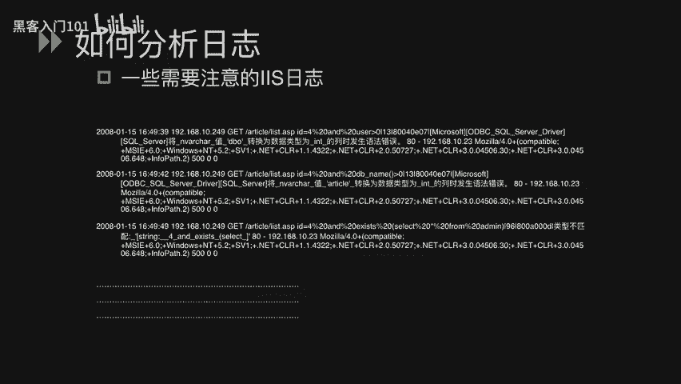

## 总结 📝

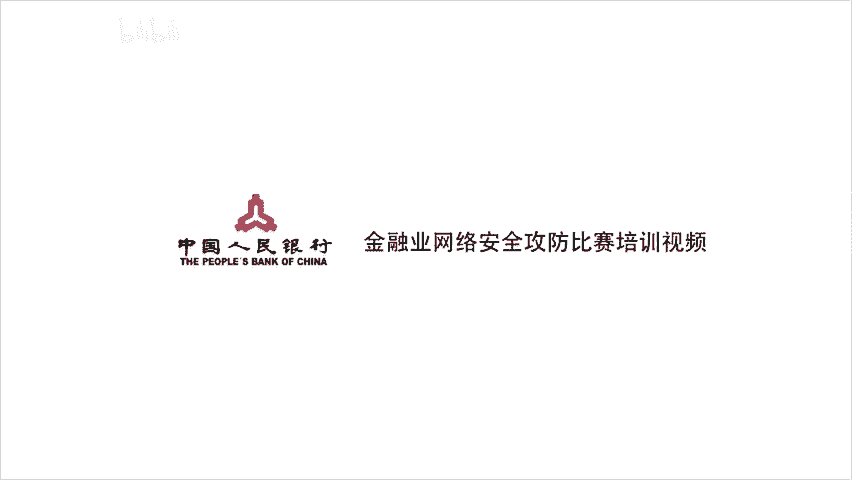

本节课中我们一起学习了Windows应急响应的两个核心部分。首先，我们探讨了如何通过检查启动项、监控系统行为和查找隐藏项来发现系统中的后门程序。接着，我们深入讲解了如何全面分析系统日志，包括安全日志、系统日志和应用程序日志（如IIS日志），并学习了如何从日志中识别目录扫描、SQL注入等常见的攻击行为痕迹。掌握这些技能是进行有效安全防御和事件响应的基础。