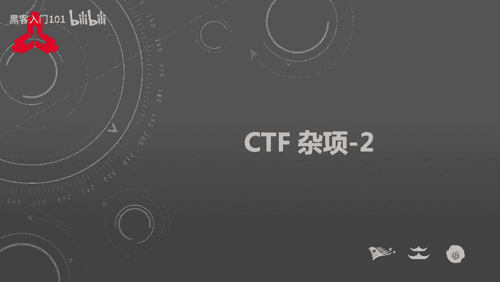
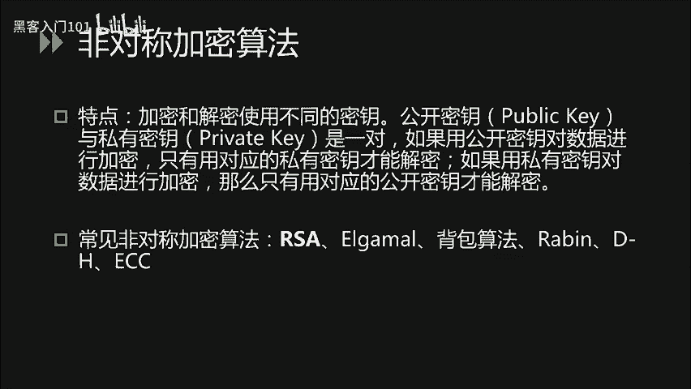
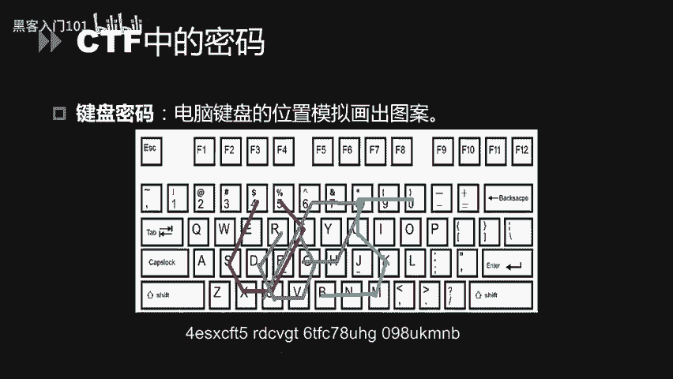
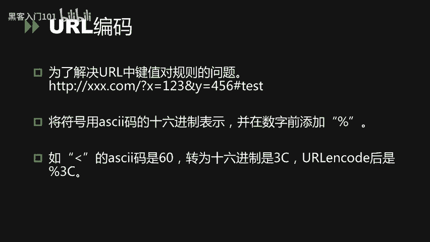
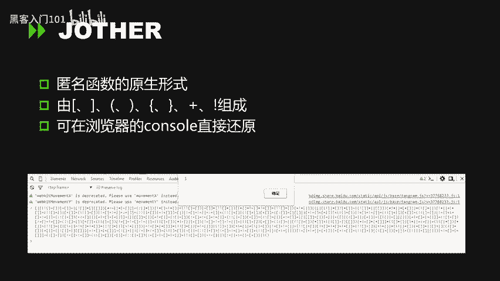
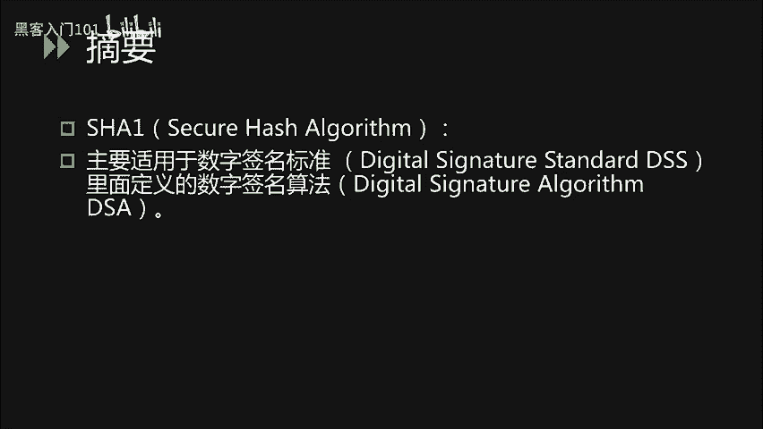
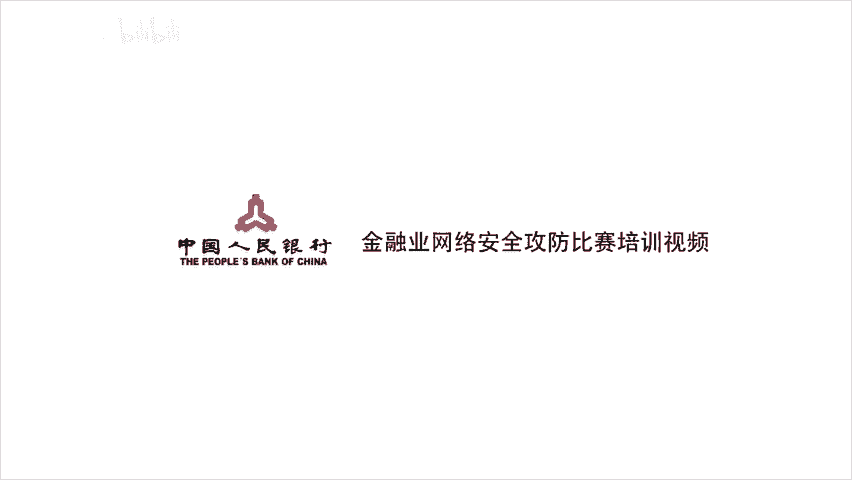

# CTF入门教程：P15：16. CTF杂项_2 - 密码、编码与摘要基础



## 概述
在本节课中，我们将要学习CTF比赛中密码学、编码和摘要算法的基础知识。我们将从核心概念的定义和区别入手，逐步介绍古典密码、现代密码、常见编码格式以及摘要算法，并通过实例帮助初学者理解。

---

## 密码、编码与摘要的区别

在深入学习具体技术之前，我们首先需要明确密码、编码和摘要三者的核心区别。

*   **密码**：其目的是保证信息传输的安全性。通过**加密算法**和**密钥**将明文转化为密文，只有拥有正确密钥才能通过**解密算法**将密文还原为明文。
    *   **公式表示**：`密文 = 加密算法(明文, 密钥)`；`明文 = 解密算法(密文, 密钥)`
*   **编码**：其目的是将数据转化为某种固定格式，以便于在不同系统间传输或存储。编码和解码过程通常是公开的，无需密钥。
    *   **公式表示**：`编码数据 = 编码函数(原始数据)`；`原始数据 = 解码函数(编码数据)`
*   **摘要**：也称为哈希，其目的是验证信息的完整性。摘要算法将任意长度的数据映射为固定长度的哈希值，这个过程是单向的，无法从哈希值反推原始数据。
    *   **公式表示**：`哈希值 = 哈希函数(数据)`

上一节我们介绍了三者的基本概念，本节中我们将分别深入探讨密码学和编码摘要的具体内容。

---

## 密码学基础

CTF中涉及的密码学题目主要分为三类：古典密码、现代密码以及一些CTF特有的图形化密码。

### 古典密码

古典密码通常规则简单，易于手算或通过脚本破解。以下是几种常见的类型。

#### 凯撒密码
凯撒密码是一种位移密码。其原理是将字母表中的每个字母向后（或向前）移动一个固定的位数（即密钥K）。

*   **加密示例**：明文 `HELLO`，密钥 `K=1`，则密文为 `IFMMP`（每个字母后移一位）。
*   **解密方法**：由于字母只有26个，可以尝试所有可能的位移（K=1到25），这种方法称为暴力破解。也可以使用Python脚本或在线工具。

**以下是一个简单的Python凯撒解密脚本示例：**
```python
def caesar_decrypt(ciphertext):
    for shift in range(26):
        plaintext = ''
        for char in ciphertext:
            if char.isalpha():
                start = ord('A') if char.isupper() else ord('a')
                plaintext += chr((ord(char) - start - shift) % 26 + start)
            else:
                plaintext += char
        print(f'Shift {shift}: {plaintext}')

caesar_decrypt("IFMMP") # 尝试解密
```

#### 栅栏密码
栅栏密码是一种分组密码。加密时，将明文分成N栏（组），然后按栏顺序重新组合成密文。

*   **加密示例**：明文 `HELLOWORLD`，栏数 `N=2`。
    1.  分成两栏：`H L O O L` 和 `E L W R D`。
    2.  按栏交错组合：取第一栏第一个`H`，第二栏第一个`E`，第一栏第二个`L`，第二栏第二个`L`... 得到密文：`HLELOWRDL O`（实际中常忽略空格）。
*   **解密方法**：知道栏数后，可以逆向操作还原。也可以使用在线解密工具。

#### 弗吉尼亚密码
弗吉尼亚密码可以看作是凯撒密码的升级版，它使用一个关键词作为密钥，根据关键词的每个字母来决定明文中对应字母的位移量。

*   **加密示例**：明文 `HELLO`，密钥 `KEY`。
    1.  将密钥重复至与明文等长：`KEYKE`。
    2.  查表（维吉尼亚表）或计算：`H` 在密钥 `K` 的作用下位移10位得到 `R`，`E` 在 `E` 的作用下位移4位得到 `I`，以此类推。
*   **解密方法**：需要密钥。在CTF中，有时需要先猜测或破解密钥。

### 现代密码
现代密码学算法复杂，通常需要借助工具或编写程序进行加解密。



*   **对称加密**：加密和解密使用**相同的密钥**。常见算法有 **DES**、**AES**。
    *   **特点**：加解密速度快，适合大量数据加密。挑战在于密钥的安全分发。
*   **非对称加密**：加密和解密使用**一对密钥**（公钥和私钥）。用公钥加密的数据只能用对应的私钥解密，反之亦然。常见算法有 **RSA**。
    *   **特点**：解决了密钥分发问题，但计算速度较慢。

对于现代密码题目，参赛者通常需要利用已知的数学原理（如RSA中的大数分解）、找到泄露的密钥，或使用准备好的加解密工具来解题。

### CTF中的特色密码
这类密码通常将信息隐藏在图形或特殊符号中。

*   **猪圈密码**：使用由点和线构成的基本图形来代表字母。
*   **培根密码**：使用由`A`和`B`组成的五字符序列来代表字母。可以将`A`视为0，`B`视为1，转换为二进制后对应字母序号。
    *   **示例**：`AAAAA` -> 二进制 `00000` -> 字母 `A`；`AAAAB` -> 二进制 `00001` -> 字母 `B`。
*   **键盘密码**：利用键盘上字母的布局形状来编码。例如，用字母在键盘上连续按键所画出的轨迹形状来表示另一个字母。

---



## 常见编码与摘要算法

了解了密码之后，我们来看看CTF中更常见的编码和摘要算法。

### 常见编码

以下是几种必须掌握的编码方式。

#### Base64编码
Base64编码的目的是将二进制数据（如图片、文件）转换成由64个可打印字符（A-Z, a-z, 0-9, +, /）组成的文本，便于在只支持文本的协议（如HTTP、电子邮件）中传输。

*   **原理**：将每3个字节（24位）的数据重新划分为4组，每组6位。每个6位的值（0-63）对应一个Base64字符。
*   **特征**：编码后的字符串长度通常是4的倍数，末尾可能出现一个或两个 `=` 作为填充。
*   **识别**：看到由以上64字符组成，末尾可能有 `=` 的字符串，可考虑Base64。

#### URL编码
URL编码用于在网址中安全地传输特殊字符。它将非安全字符（如空格、中文、`?`、`&`）转换为 `%` 后跟两位十六进制数的形式。

*   **示例**：空格被编码为 `%20`，`<` 被编码为 `%3C`。
*   **识别**：在网址参数或CTF题目中看到大量 `%XX` 形式的组合。

#### 摩斯电码
摩斯电码使用短信号（点 `.`）和长信号（划 `-`）的组合，以及间隔来表示字母和数字。

*   **示例**：`SOS` 的摩斯电码是 `... --- ...`。
*   **识别**：题目中出现由点、划、斜线 `/`（表示单词间隔）或两种明显不同符号（如`01`、`AB`）规律排列的字符串。



#### 其他编码
*   **ASCII码**：字符与数字的对应关系。看到一串十进制或十六进制数，可考虑转换为ASCII字符。
*   **JSFuck/Jother**：仅使用少数几个JavaScript符号（如 `[`、`+`、`!`、`(`、`)`）来编写完整的代码。解密方法通常是直接复制到浏览器开发者工具的Console中执行。
*   **二维码**：使用扫码工具或在线解码网站即可读取信息。

### 常见摘要算法
摘要算法用于验证数据完整性，其输出（哈希值）是固定长度的。

#### MD5
MD5算法会产生一个128位（通常表示为32位十六进制字符串）的哈希值。
*   **特性**：
    1.  压缩性：任意长度输入，输出固定长度。
    2.  易计算性。
    3.  抗修改性：原数据微小变动，哈希值变化巨大。
    4.  （理论上）强抗碰撞性：难以找到两个不同数据具有相同MD5值（已被我国学者王小云教授的研究团队找到方法）。
*   **CTF应用**：常用于密码哈希破解（通过“彩虹表”反查）、文件完整性校验。题目可能要求找到给定MD5值的原始数据。



#### SHA家族
SHA（如SHA-1, SHA-256）算法原理与MD5类似，但安全性更高，输出长度更长（如SHA-256输出256位）。
*   **特性**：与MD5类似，但更安全，碰撞更困难。
*   **CTF应用**：与MD5类似，但破解难度更大。

对于摘要算法题目，如果哈希值较弱（源于常见单词或简单组合），可以尝试使用在线解密网站（如cmd5.com）或暴力破解工具进行反查。

---

## 总结
本节课我们一起学习了CTF中密码、编码和摘要的基础知识。

我们首先明确了三者的核心区别：**密码**用于保密（需要密钥），**编码**用于格式转换（公开规则），**摘要**用于完整性校验（不可逆）。

接着，我们介绍了从简单的**古典密码**（如凯撒、栅栏密码）到复杂的**现代密码**（对称/非对称加密），以及CTF中常见的**图形化密码**（如猪圈、培根密码）的识别与基本解法。

然后，我们探讨了多种**常见编码**，如Base64、URL编码、摩斯电码等，并说明了它们的特征和破解思路。

最后，我们了解了**摘要算法**（如MD5、SHA）的特性及其在CTF中的应用场景。





掌握这些基础知识是解决CTF杂项题目的第一步。在实际比赛中，需要灵活运用这些知识，并结合具体题目提示和工具进行解题。下一节，我们将进入更具体的实战案例分析。