# CTF杂项与密码编码：P16：17.隐写术与密码编码工具详解 🛠️

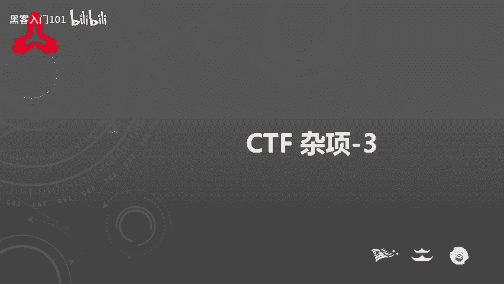

在本节课中，我们将学习CTF比赛中隐写术与密码编码题目常用的解题工具。我们将通过具体实例，演示如何使用这些工具来发现和提取隐藏在图片、音频、文件中的信息，并介绍一些高效的编解码框架。

---

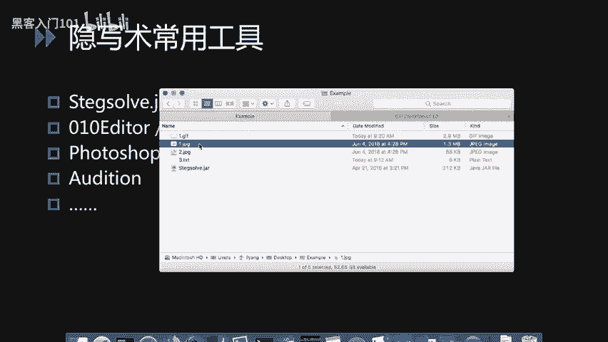

## 图片隐写术工具：Stegsolve 🖼️

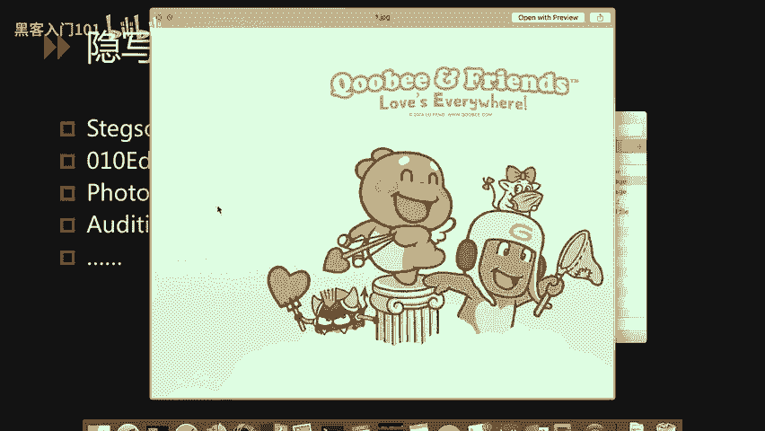

上一节我们介绍了隐写术的基本概念，本节中我们来看看处理图片隐写术的利器——Stegsolve。由于图片隐写术题目没有固定套路，掌握一个强大的工具至关重要。

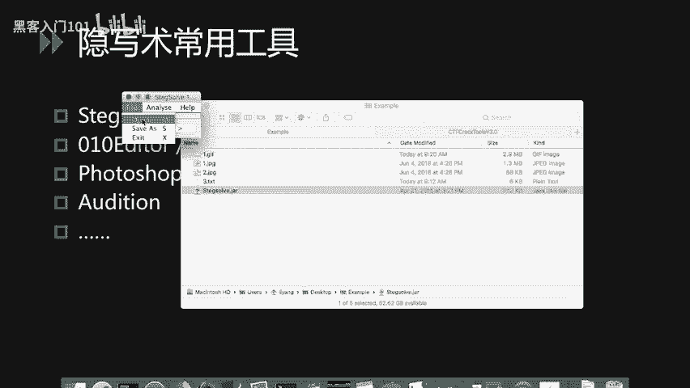

Stegsolve是一个Java编写的图片隐写分析工具，能解决90%以上的图片隐写题目。它是一个JAR包文件，在安装Java环境后可直接运行。

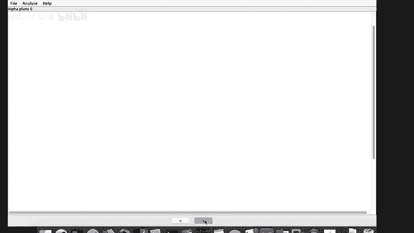

以下是Stegsolve的基本操作流程：

1.  **打开文件**：运行程序后，通过 `File -> Open` 打开目标图片。
2.  **分析通道**：在窗口下方使用箭头按钮，切换不同的颜色通道（如Red, Green, Blue, Alpha）和位平面（Bit Planes），并调整阈值（Threshold）进行查看。
3.  **发现信息**：通过不断切换，可能会发现隐藏的二维码、文字或Flag信息。

**实战示例一：隐藏的二维码**
*   题目给出一张看似普通的图片，直接查看无任何异常。
*   使用Stegsolve打开后，在某个特定的颜色通道和阈值下，屏幕上显示出一个二维码。
*   由于图片杂色干扰，可能无法直接用微信扫码。此时可尝试使用识别能力更强的手机扫码工具（如手机QQ、专业扫码APP）进行识别，从而得到Flag。

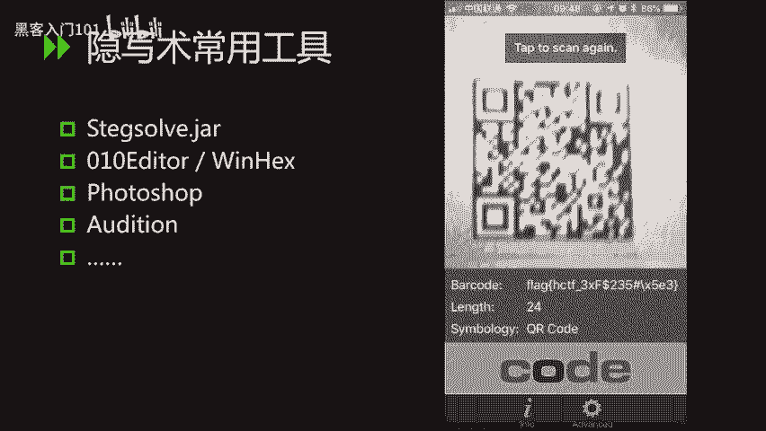

**实战示例二：GIF帧分析**
*   题目是一个GIF动图，直接播放时仅能看到底部有Flag值一闪而过，速度太快无法记录。
*   使用Stegsolve的 `Analyse -> Frame Browser` 功能进行帧预览。
*   逐帧浏览，当找到包含Flag信息的帧时，程序可能会自动将其提取并显示在屏幕左上角。

此外，Stegsolve的 `Analyse` 菜单还提供了文件格式分析、检查文件附加数据等功能，可以便捷地分析图片中可能隐藏的信息。

---

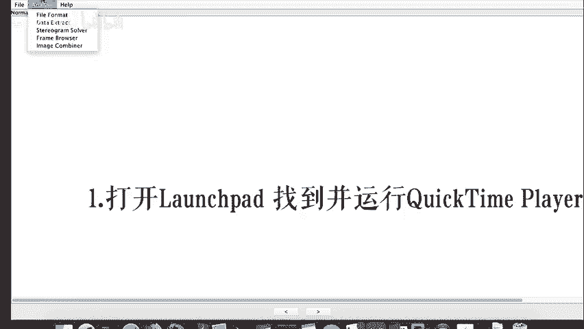

## 十六进制编辑器：010 Editor 🔢

在Windows平台上，010 Editor、WinHex等都是常用的十六进制编辑器。这里重点介绍010 Editor一个非常实用的功能：导入十六进制文本。

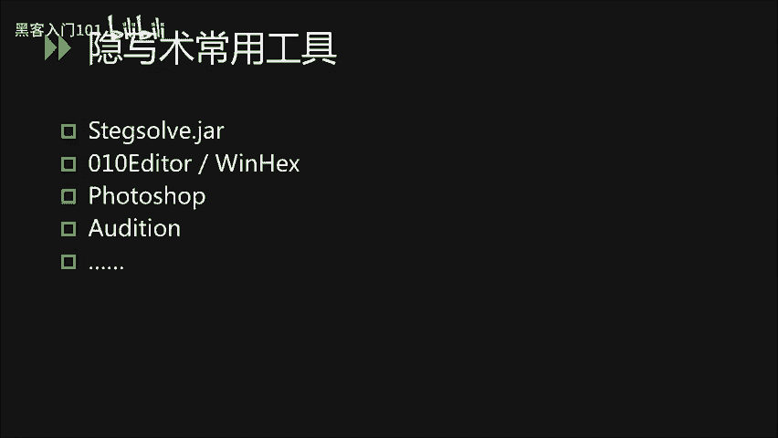

**核心功能**：`Tools -> Hex Conversion -> Import Hex Text`

**实战示例**：
*   题目给出一长串十六进制数字，猜测其是某个文件的十六进制导出形式。
*   在010 Editor中使用上述功能导入这段文本。
*   观察文件头，例如看到 `PK`，这通常是ZIP压缩包的文件头签名。
*   将数据保存为 `.zip` 文件后，成功解压，得到内含的图片等文件，从而继续下一步解题。

---

## 图像处理工具：Photoshop ✂️

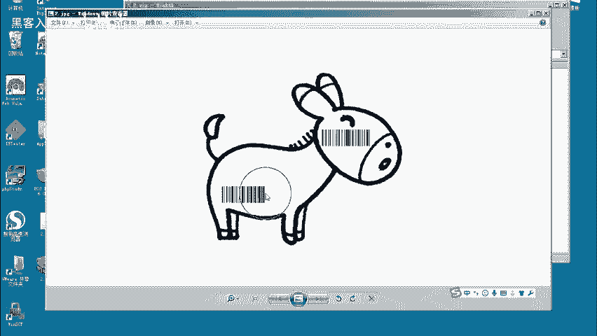

近年来，CTF比赛中出现越来越多需要拼接、修复残缺二维码或条形码的题目。掌握Photoshop的基本操作非常必要。

以下是处理此类题目的基本步骤：

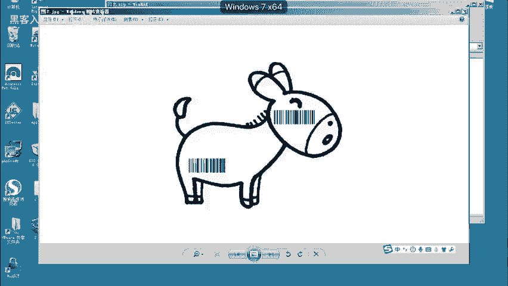

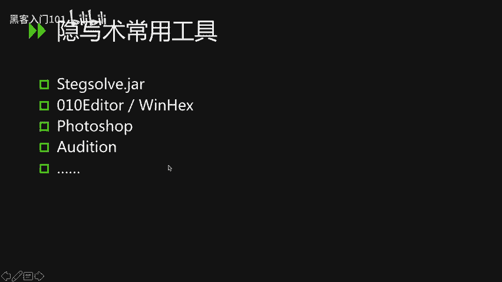

1.  **打开图片**：将题目图片加载到Photoshop中。
2.  **选取有效部分**：使用矩形选框工具，选中图片中有效的条形码或二维码片段。
3.  **复制与新建**：使用 `Ctrl+C` (Windows) / `Cmd+C` (Mac) 复制选区，然后新建一个图层，并粘贴 (`Ctrl+V` / `Cmd+V`)。
4.  **拼接片段**：对另一个有效片段重复上述操作，得到两个包含信息的图层。
5.  **对齐与合并**：使用移动工具，调整两个图层的位置，将条形码片段精确拼接起来。可以调整图层混合模式（如“变暗”）来辅助对齐。
6.  **识别**：将拼接完整的图片保存，使用扫码工具或在线解码网站进行识别，即可得到答案。

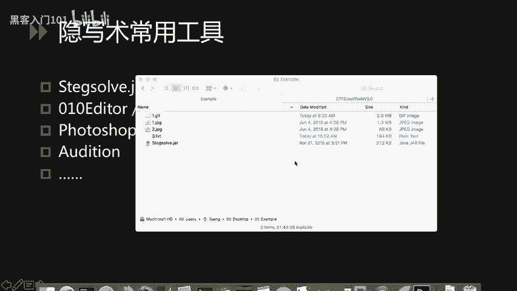

---

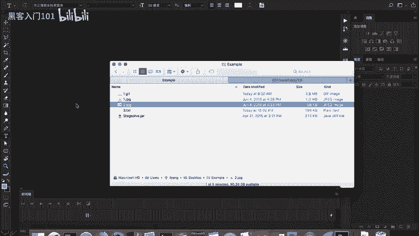

## 音频隐写术工具：Adobe Audition 🎵

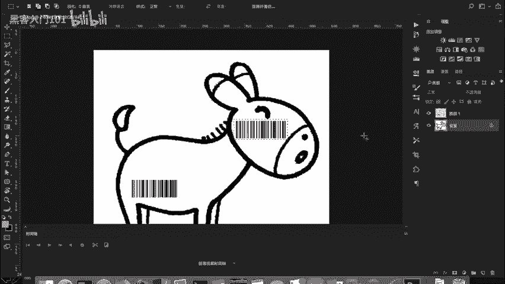

Adobe Audition（简称AU）是处理音频隐写题目的常用软件，它与Photoshop同属Adobe公司。

**基本操作流程**：

1.  **加载文件**：在左侧文件窗口加载CTF音频题目文件。
2.  **编辑视图**：双击文件进入编辑视图。界面中 `L` 代表左声道，`R` 代表右声道，可以单独关闭或开启。
3.  **分析声道**：观察波形，信息可能只隐藏在其中一个声道。关闭无信息的声道可以排除干扰。
4.  **选择与清理**：用光标选取无信息的音频段（如静音或杂音部分）并删除，保留可能包含编码信息的部分。
5.  **放大信号**：使用工具栏的振幅放大功能，增大波形振幅，使得隐藏的摩斯电码、频谱文字等信息更加清晰可见。
6.  **高级处理**：对于更复杂的题目，可能需要在 `Effects` 菜单中使用反转、降噪、频谱分析等高级功能。

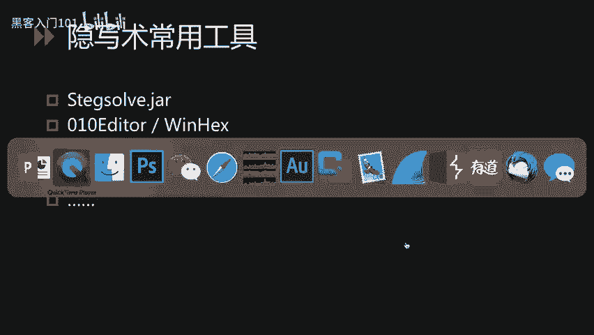

---

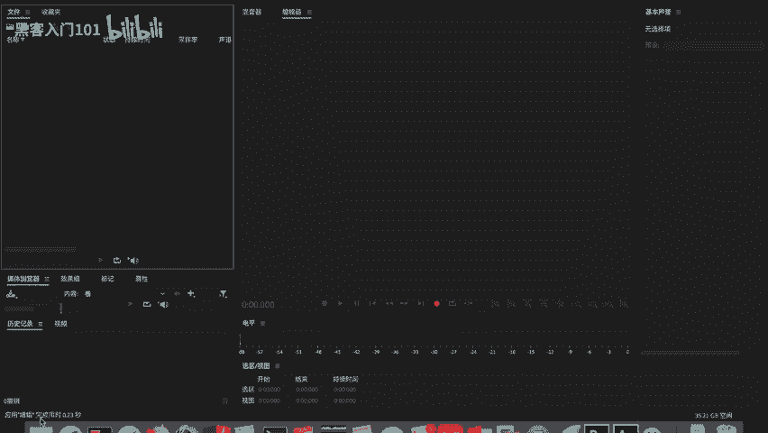

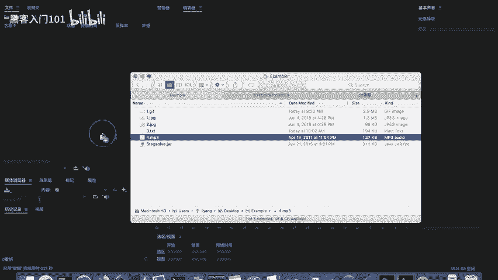

## 密码学与编解码工具 🔐

处理密码编码题目，通常需要借助在线工具或本地脚本。

**在线工具**：
通过搜索引擎查找“在线加解密工具”，可以找到大量网站，集成如Base64、ROT13、AES、RSA等常见编码和加密算法的工具。

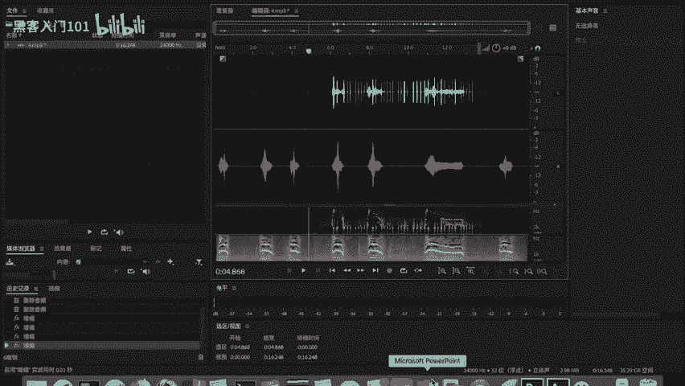

**本地脚本（Python）**：
使用Python脚本进行加解密操作更为灵活。网络上存在大量现成的加解密算法Python代码，可以搜索并下载使用。

**集成化框架推荐：CTFcrackTools**
这是一个由国内安全团队编写的CTF加解密框架，它集成了多种功能模块。

**优点**：
*   **模块化**：将不同加解密、编码解码功能以插件形式集成。
*   **可扩展**：支持用户导入自己编写的Python脚本作为插件。
*   **便捷**：图形化界面，方便在比赛时快速调用多种工具。
工具的GitHub地址可在相关资料中找到并下载。

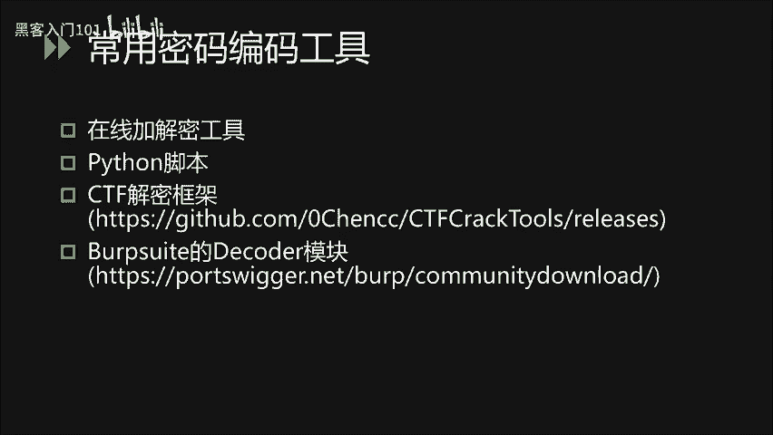

**Burp Suite 插件：Decoder**
对于Web安全方向或经常使用Burp Suite的选手，其 `Decoder` 模块非常实用。

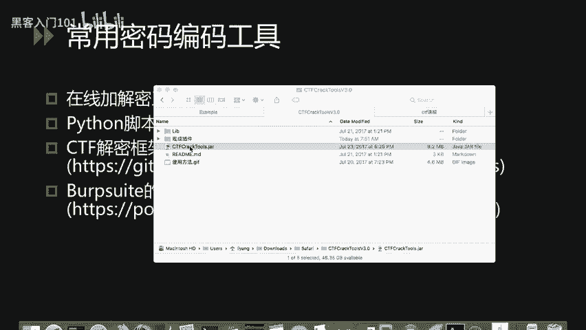

**操作**：
*   在Burp Suite中找到 `Decoder` 模块。
*   在输入框中填入数据（如 `hello world`）。
*   在右侧 `Encode as` 或 `Decode as` 下拉列表中，选择各种编码方式（如URL、HTML、Base64、ASCII十六进制等）进行快速的编码或解码操作。因其内置于常用工具中，使用起来非常方便。

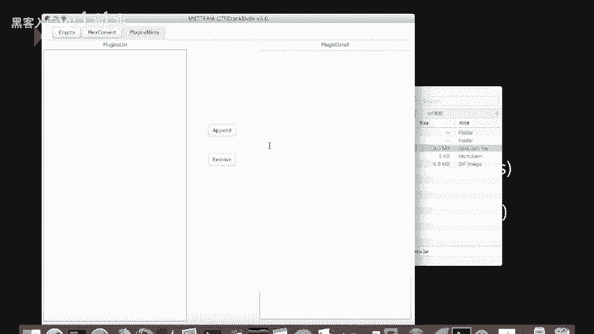

---

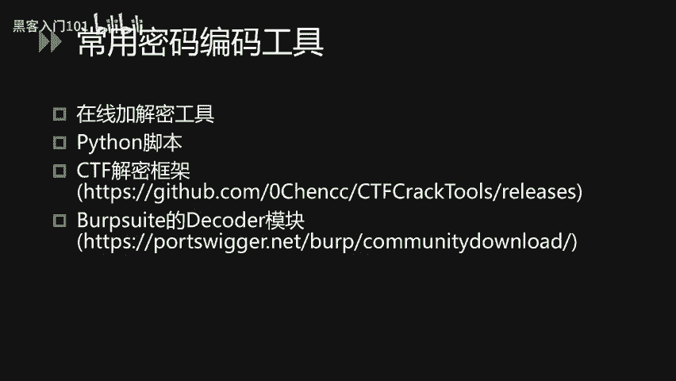

## 总结 📝

本节课我们一起学习了CTF隐写术与密码编码题目中的核心工具链：
1.  使用 **Stegsolve** 分析和提取图片中的隐藏信息。
2.  利用 **010 Editor** 的导入十六进制功能，还原被编码的文件。
3.  通过 **Photoshop** 的基本操作，完成图片的拼接与修复。
4.  借助 **Adobe Audition** 处理和分析音频隐写题目。
5.  利用在线工具、Python脚本、**CTFcrackTools** 框架以及 **Burp Suite Decoder** 模块，高效解决各类密码编码问题。

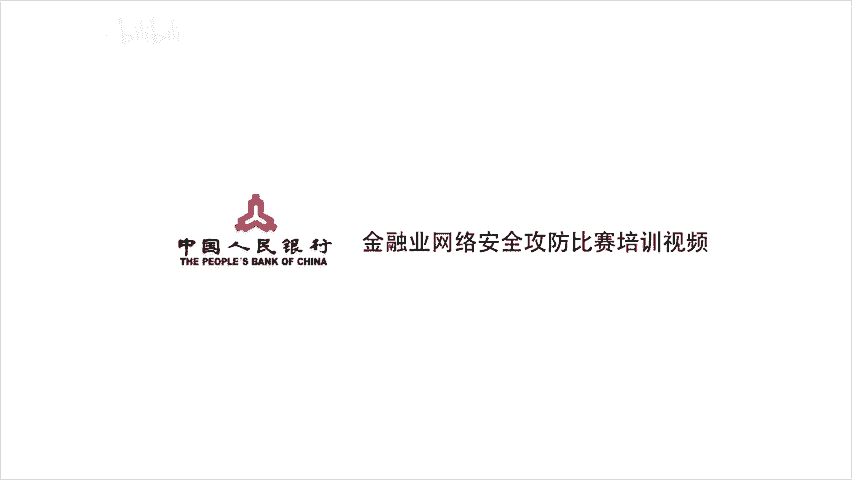

熟练掌握这些工具，能极大提升解决CTF杂项和密码类题目的效率与成功率。