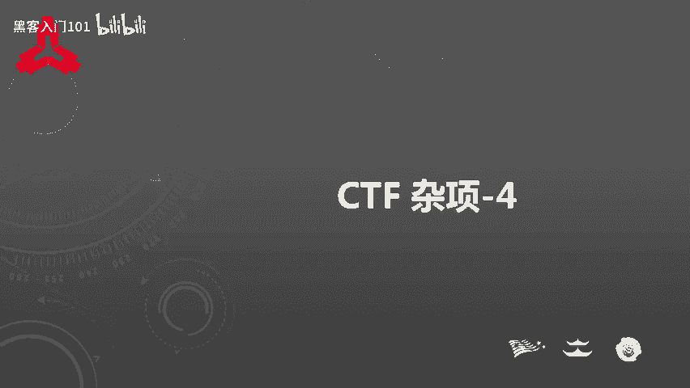
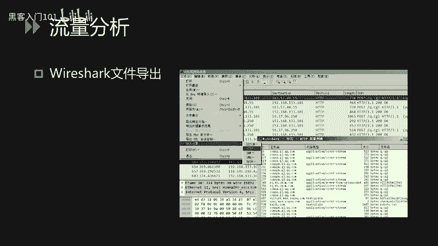
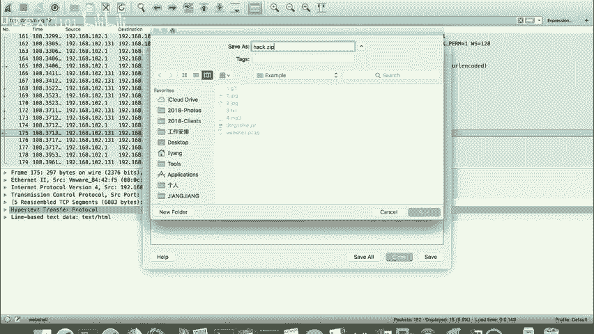
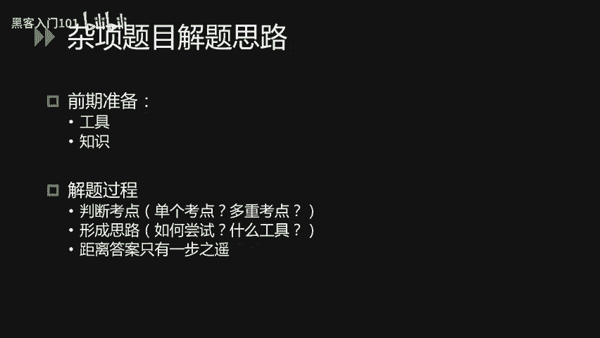
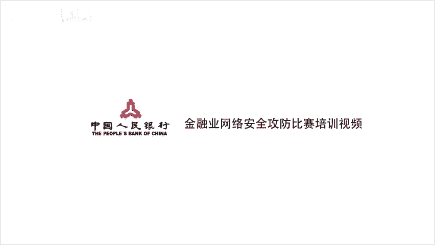

# CTF入门与实战：P17：CTF杂项_4 - 取证技术与解题思路 🕵️



在本节课中，我们将学习CTF比赛中取证技术的基础知识，包括流量分析和日志分析，并探讨杂项题目的通用解题思路与技巧。

---

## 流量分析：Wireshark实战 🔍

上一节我们介绍了多种编码与密码，本节中我们来看看CTF中的取证技术。流量分析是取证技术中的核心部分，而Wireshark是最常用的工具。

Wireshark功能强大，但在CTF中，我们主要使用其筛选器、追踪流和文件导出这几个核心功能。

### 1. 使用筛选器过滤数据

通过Wireshark的筛选器，我们可以根据协议、IP地址等条件过滤数据包，从而清晰地查看目标信息。

以下是筛选器的基本使用方法：
- 点击筛选器右侧的表达式按钮。
- 使用Wireshark内置的表达式进行过滤，例如 `http` 或 `ip.src == 192.168.1.1`。
- 表达式支持逻辑运算符，如等号（`==`）、不等号（`!=`）、大于（`>`）、小于（`<`）或匹配（`contains`）等。

### 2. 追踪TCP/HTTP流

流量分析的本质是分析客户端请求与服务器响应。Wireshark的“追踪流”功能可以清晰地展示每一次通信的完整内容。

操作步骤如下：
1.  右键点击数据包列表中的任意一条记录。
2.  选择“追踪流” -> “TCP流”或“HTTP流”。
3.  在弹出的新窗口中，可以分别查看请求和响应内容。
4.  在该窗口中，可以使用查找功能搜索关键词，也可以选择过滤、打印或保存该数据流。



### 3. 导出文件对象

如果流量中存在文件传输（如HTTP下载或FTP传输），我们可以利用“导出对象”功能将其还原到本地。

以下是操作流程：
1.  点击菜单栏的“文件” -> “导出对象” -> “HTTP…”（或其他协议）。
2.  在列表中找到目标文件（通常可通过大小或内容类型判断）。
3.  将其保存到本地进行分析。

---

## 实战演示：Webshell流量分析 🧩

现在，我们通过一个名为 `webshell.pcap` 的CTF题目实例，来演示如何运用上述功能。

首先，使用筛选器过滤出HTTP协议的数据包。观察发现，攻击者先访问了 `upload.php`，进行了上传操作，随后访问了 `hack.php`。这个 `hack.php` 极有可能是上传的Webshell。

我们重点关注攻击者上传Webshell后的操作。追踪 `hack.php` 的HTTP流，发现其请求内容经过了Base64编码。查看服务器响应，最后部分包含“PK”文件头，这表明响应中隐藏了一个ZIP压缩包。



此时，使用“文件”->“导出对象”->“HTTP…”功能，找到对应会话（编号为175的响应包），将其导出并保存为 `.zip` 文件。

在本地尝试解压时，发现文件头损坏且压缩包被加密。修复文件头后，我们需要找到密码。回顾攻击流量，发现攻击者使用了 `zip -P` 命令进行加密，因此密码很可能出现在之前的操作指令中。找到该密码即可成功解压，获得Flag。

---

## 电子取证：日志分析 📄

除了流量分析，电子取证的另一个重点是日志分析，例如Web服务器的Access日志。

一条标准的Apache Access日志格式如下：
```
192.168.1.100 - - [10/Oct/2023:14:32:01 +0800] "GET /index.php?id=1 HTTP/1.1" 200 1234
```
其各部分含义为：客户端IP、访问时间、请求方法、请求路径、协议版本、**状态码**、响应长度。

在CTF中，参赛者可能需要：
- **通过状态码分析注入点**：例如，在盲注攻击中，攻击者根据页面返回的不同状态码（如200或500）来判断注入是否成功，从而逐位获取数据。
- **搜索敏感文件或路径**：在庞大的日志文件中，全局搜索关键词（如 `webshell`、`admin`、`flag` 等），以定位攻击入口或Flag所在。
- **分析攻击行为序列**：通过梳理日志中的请求顺序，还原攻击者的完整操作链。

由于出题思路多样，没有固定套路，关键在于对日志格式的熟悉、对常见攻击模式的理解以及使用工具（如 `grep`、`Notepad++` 等）高效处理文本的能力。

---

## 杂项题目：综合解题思路 🧠

杂项题目通常融合了多个领域的知识点，考察综合能力。以下是高效的解题流程。

### 1. 识别考察点

首先，判断题目考察的是单个知识点还是多个知识点的组合。例如，题目“困在栅栏里的凯撒”就明确提示了**栅栏密码**和**凯撒密码**两个考点。

### 2. 形成解题思路与尝试顺序

确定考点后，需形成解题思路并选择高效的工具。对于组合型题目，尝试顺序可能影响解题效率。例如，对于“困在栅栏里的凯撒”，需要思考先解栅栏还是先解凯撒，并通过多次尝试验证。

### 3. 调整思路与坚持

如果按初始思路未能解题，不要轻易放弃。此时应：
- 检查每一步操作是否正确。
- 思考是否有遗漏的考点或编码（如Base64、十六进制等）。
- 评估当前思路的可行性，决定继续深入或暂时放弃以节省时间。

### 4. 日常练习与积累

杂项题目能力来源于日常积累：
- **多平台练习**：在CTF在线平台（如CTFHub、BugKu）上大量练习。
- **学习Writeup**：赛后多阅读其他队伍的解题报告（Writeup），学习新思路和技巧。
- **构建工具库**：收集和熟悉各类解题工具（如编码解码工具、隐写分析工具、流量分析工具等）。

---

## 总结 📝



本节课我们一起学习了CTF取证技术的基础和杂项题目的解题方法。
1.  在**流量分析**部分，我们掌握了使用Wireshark进行筛选、追踪流和导出文件的核心操作。
2.  在**日志分析**部分，我们了解了如何从Access日志中寻找注入点、敏感路径和攻击序列。
3.  在**杂项解题**部分，我们梳理了从识别考点、形成思路、调整尝试到日常积累的完整解题框架。



掌握这些基础方法和思维模式，将帮助你更从容地应对CTF比赛中的各类挑战。祝你解题顺利！