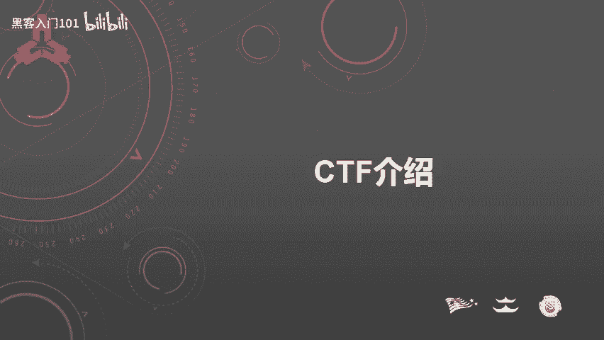
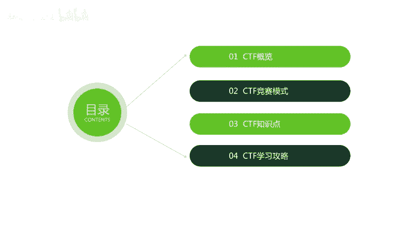
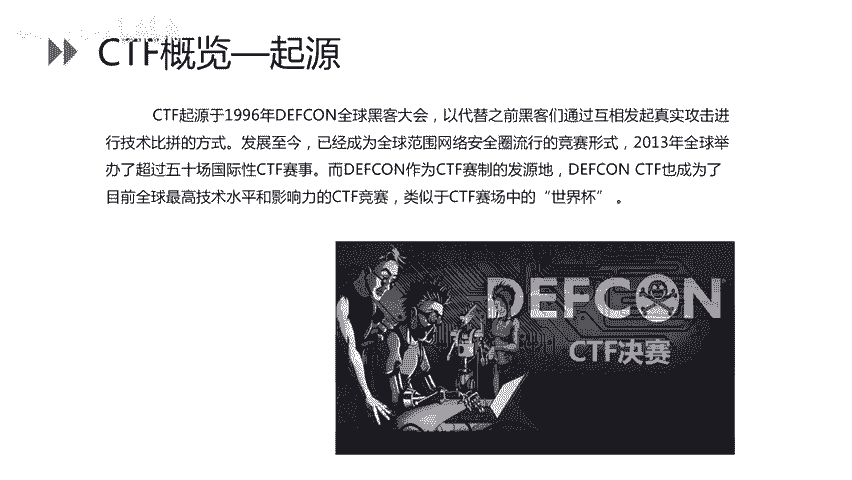
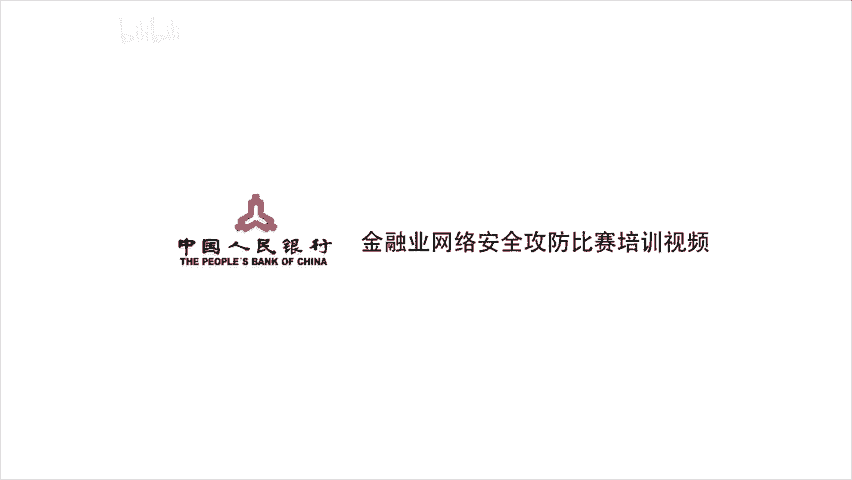

# CTF入门教程：P18：19. CTF介绍 🏴‍☠️

在本节课中，我们将要学习CTF（夺旗赛）的基本概念。主要内容包括CTF的概览、主要竞赛模式、涉及的知识点以及为初学者制定的学习攻略。

## CTF概览

CTF全称是**Capture The Flag**，中文一般译作“夺旗赛”。在网络安全领域中，它指的是网络安全技术人员之间进行技术竞技的一种比赛形式。

CTF起源于1996年的DEFCON全球黑客大会，旨在替代之前黑客们通过互相发起真实攻击进行技术比拼的方式。发展至今，CTF已成为全球网络安全圈流行的竞赛形式。2013年，全球举办了超过50场国际性CTF赛事。DEFCON作为CTF赛制的发源地，**DEFCON CTF**也成为了目前全球技术水平和影响力最高的CTF竞赛，堪称CTF赛场中的“世界杯”。

## CTF竞赛的主要流程

参赛团队通过攻防对抗、程序分析等形式，率先从主办方给出的比赛环境中找到一串具有特定格式的字符串或其他内容，并将其提交给主办方，从而获得分数。为了方便称呼，我们把这样的内容称之为 **`flag`**。

## CTF赛事的三种模式

以下是CTF比赛的三种主要模式。

### 1. 解题模式（Jeopardy）
解题模式主要是由理论题目、杂项、Web、PWN、逆向等各种题目组成，通常由个人参赛解题。

### 2. 攻防模式（Attack-Defense）
攻防模式是团队作战形式，不同团队之间攻击同一套比赛环境（靶机），主要考察Web类题型。在此模式中，团队只需要攻击，不需要防御。针对同一个环境，越早拿到`flag`，获取的分数越高。一台靶机通常会有多个`flag`。

`flag`存放的位置比较常见，例如：
*   Web根目录
*   系统桌面
*   C盘根目录（Windows）
*   `/`、`/tmp`、`/home`目录（Linux）

### 3. 混合模式（Mix）
混合模式相比解题和攻防模式更为复杂，对技术要求也更高。参赛团队既是攻击者，也是防御者。团队通过SSH管理自己的靶机，并且通常只拥有Web权限。`flag`每隔几分钟更新一轮。

各队首先拥有自己的初始分数。己方的`flag`被其他队拿到会被扣分，拿到其他队伍的`flag`会加分。此外，主办方会定期检查每个队伍的服务是否正常运行（服务`check`）。如果检查不通过会被扣分，而被扣除的分数会由服务正常的队伍均分。

上一节我们介绍了CTF的竞赛模式，本节中我们来看看CTF比赛主要涉及哪些技术知识点。

## CTF涉及的知识点

CTF知识点覆盖面广且较为琐碎，主要包含以下几种题型。

### 1. Web（网络攻防）
Web类题目主要考察以下漏洞类型：
*   SQL注入
*   跨站脚本（XSS）
*   文件上传漏洞
*   文件包含漏洞
*   命令执行漏洞
*   代码审计

### 2. PWN（二进制漏洞利用）
PWN类题目主要涉及以下几种攻击模式：
*   攻击远程服务器上的服务
*   分析服务程序的二进制文件
*   分析漏洞并编写利用程序（Exploit）
*   栈溢出、堆溢出等漏洞利用
*   绕过各种保护机制（如ASLR, DEP）

### 3. Reverse（逆向工程）
逆向类题目主要是通过逆向分析，破解程序的算法来得到其中隐藏的`flag`。同时也会考察对抗反调试、代码混淆等技术。

### 4. Mobile（移动安全）
移动安全主要考察选手对Android和iOS系统的理解。在国内比赛中，最常见的是对Android系统的考察。

### 5. Misc（杂项）
杂项类题目覆盖知识面广，基础点较为琐碎，主要考察选手的发散思维和综合能力。主要包括以下几大类：
*   **电子取证**：如使用Wireshark进行流量分析。
*   **编解码/加解密**：通常考核古典密码学和现代密码学。
*   **隐写术**：包括图片隐写、视频隐写、音频隐写。
*   **图片处理**：主要使用工具如Photoshop，需要了解其基本使用方法。
*   **压缩包分析**：除了暴力破解密码，常与隐写术结合考核。
*   **编程**：需要在比赛现场临时编写攻击或解题脚本，考核编程能力。

了解了CTF的知识体系后，接下来我们为初学者制定一份学习攻略。

## CTF学习攻略

在制定学习计划之前，需要明确自己擅长或感兴趣的方向，例如是擅长Web安全还是逆向工程。在明确主攻方向后，可以制定专属的学习计划。

下面以**Web应用安全**的学习路线为例，介绍如何入门。

1.  **学习计算机基础知识**：例如操作系统、网络技术以及编程能力（如Python）。
2.  **全面认识Web应用**：包括HTTP协议、Web开发框架以及**Web安全测试**。Web安全测试在CTF比赛中占比很大，大部分Web题都与此相关。因此需要提前了解Web安全测试的整体流程及常见漏洞。
3.  **了解数据库知识**：学习SQL语句的基本操作及优化。这有助于解决Web题型中的SQL注入题目。
4.  **最关键的一步：刷题**：刷题是通过大量练习实现质变的过程。通过刷题，可以学习到CTF中固有的出题套路和解题技巧。

根据CTF学习路线，这里推荐几个平台：

*   **资讯类平台**：
    *   **XCTF**：国内举办CTF比赛较多且质量较高的官方联赛。
*   **练习平台**：
    *   针对专项题目（如SQL注入、XXS、脚本类）的练习平台。
    *   **HackTheBox**：一个综合性的网络安全学习平台。
*   **Writeup学习**：
    *   CTF Writeup是选手在赛后提交的解题思路报告。通过学习Writeup，可以了解题目的解题思路，拓展思维。这样在比赛时，看到题目就能联想到其考察的技术点。因此，学习Writeup有助于拓宽知识面和增加“题感”。

## 总结

本节课中我们一起学习了CTF（夺旗赛）的基本概念。我们了解了CTF的起源与发展，详细介绍了**解题、攻防、混合**三种主要竞赛模式，并梳理了**Web、PWN、Reverse、Mobile、Misc**五大类知识点。最后，我们以Web安全为例，为初学者规划了从基础到实践的学习路径，并推荐了相关的学习平台和资源。希望本教程能帮助你开启CTF学习之旅。