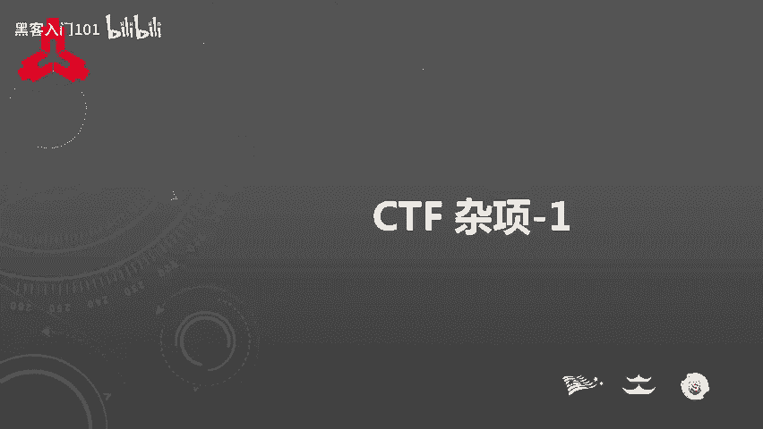
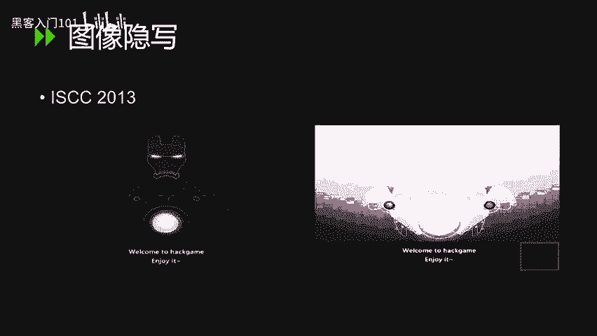
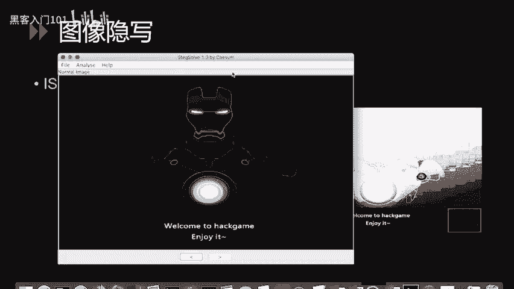
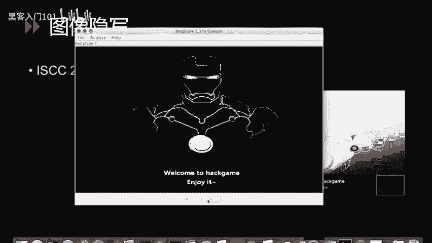
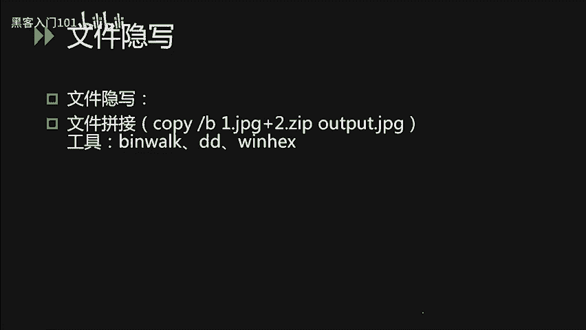
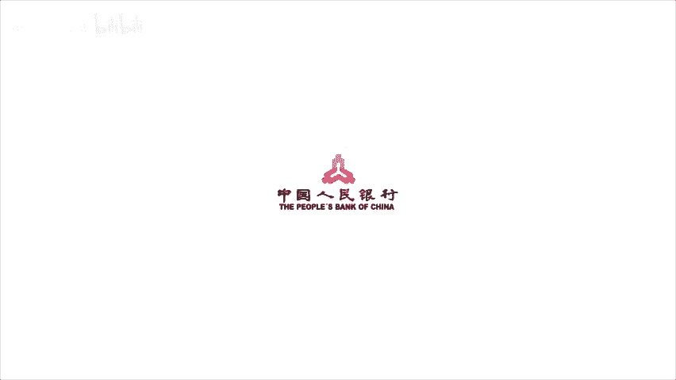

# CTF入门教程：P19：20.CTF杂项-1 🚩

在本节课中，我们将要学习CTF比赛中的隐写术、密码编码以及杂项题目的基础概念与常见解题思路。这些题型在CTF中占有重要地位，是综合考察选手信息提取与分析能力的关键环节。



## 隐写术简介

上一节我们介绍了课程的整体框架，本节中我们来看看什么是隐写术。

隐写术是将信息隐藏在其他载体中，不让计划的接收者之外的人获取到信息的一种技术。古时候，人们将隐写术用于机密信息的传递，例如战争等场景。在电影中经常可以看到，间谍获取到密报后，将纸张在火上烤一下或在水中浸泡，即可显示出隐藏的文字。这是一种基于物理方式的传统隐写术。

我们在CTF中遇到的隐写术，大部分以多媒体文件为载体，可以是图片、音频、视频或压缩包文件等。此类题目的出题非常灵活，可以以各种各样的文件作为载体。因此，在本次课程的讲解中，我们无法枚举所有的出题类型，只能对常见的出题思路进行介绍。

## 常见隐写术类型

CTF中隐写术的题目以两种类型较为常见。

*   **插入法**：即将需要隐藏的消息插入文件中的某个空白部位。例如，常见的图片EXIF隐写。
*   **替换法**：即通过改变原有文件中某部分的文件内容达到隐写的效果。

以下是图像隐写的几种常见分类：





1.  **基于LSB（最低有效位）的隐写**：这种隐写技术利用了像素三原色的原理。显示器上显示的颜色由RGB三种颜色组成。例如，一个纯红色的像素，其红色通道的十进制值为`255`，二进制为`11111111`。如果我们将最后一位的`1`变成`0`（变为`11111110`），肉眼无法看出图像颜色的差距，但最低有效位已经发生了变化。因此可以利用这个像素的颜色值变化来进行图像的隐写。我们可以使用图像隐写术解题工具`Stegsolve`来解此类题目。



2.  **GIF图多帧隐写**：将需要隐写的信息藏在GIF中的某一帧（可能一闪而过，也可能在很长时间后才显示）。此类题目也可以使用`Stegsolve`一帧一帧地查看，或使用图像处理软件如Photoshop进行逐帧查看。

3.  **EXIF信息隐写**：将flag值藏在图片的EXIF信息中。照片的EXIF属性可以保存大量信息，如相机厂商、型号等。解题时，在Windows上右键打开图片的属性，即可查看相应内容。

4.  **图片修复技术**：这类题目会提供一个已经破损的图片文件。我们需要根据各种图片文件格式（如JPG、PNG、GIF、BMP）的文件头构造，对图片进行修复。解决此类问题需要使用十六进制编辑器，如`WinHex`或`010 Editor`。

以上几类隐写方式有可能被重复利用，即一道题目中可能同时需要修复图片，又需要从修复后的图片中读取有效内容。

## 其他载体隐写

音频内容的隐写也非常有趣。这时我们可能需要用到音频分析软件（如`Audition`）对音频内容进行数字分析。例如，一道CTF题目中，左右声道信息可能不同，大部分信息藏在左声道的中间部分。通过将没有隐藏信息的内容删掉、增大左声道功率，可能会听到一段摩斯电码的声音。我们可以手动将其转为摩斯电码值，再解码为英文字母进行解题。

视频的隐写和图像的多帧隐写相似。出题人员习惯将flag值藏在视频的多帧中。因此可以使用视频编辑软件对隐藏的内容进行提取。

文件的隐写在CTF题目中也较为常见。通常简单的题目会使用Windows下的`copy /B`命令将两个文件拼合。例如：
```cmd
copy /B image.jpg + secret.zip output.jpg
```
这个命令将一个图片和一个ZIP压缩包合并输出为一张图片（即“图种”）。直接打开该图片看到的仍然是图片信息，但图片的后半部分实际上是一个ZIP压缩包。此类题目可以直接将图片重命名为`.zip`，使用解压软件打开解压即可。

如果遇到类似题目，无法肉眼识别是由哪两种文件进行拼合的，我们可以使用Linux下的`binwalk`命令对其进行查看。这个命令可以直接将合并后的文件拆分成多个文件的组合。我们也可以使用十六进制查看器，查看文件的特征，找到对应的文件头进行拆分。

## 总结





本节课中我们一起学习了CTF中隐写术的基础概念。我们了解到隐写术是将信息隐藏在各种载体（如图片、音频、视频、文件）中的技术。我们重点介绍了图像隐写的几种常见类型：**LSB隐写**、**GIF多帧隐写**、**EXIF信息隐写**和**图片修复**。此外，还简要介绍了音频、视频和文件拼接等其他形式的隐写术及其基本解题工具和思路。掌握这些基础知识是解决CTF杂项题目的第一步。