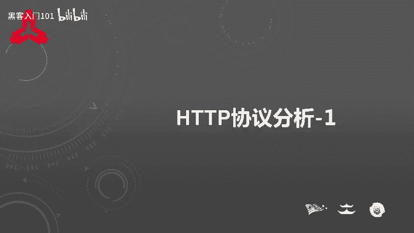
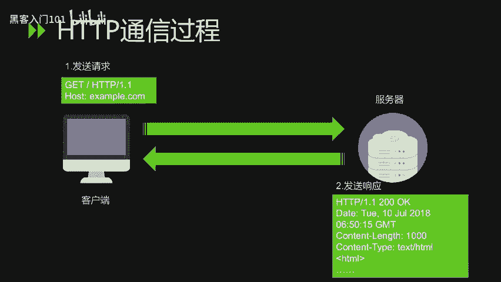
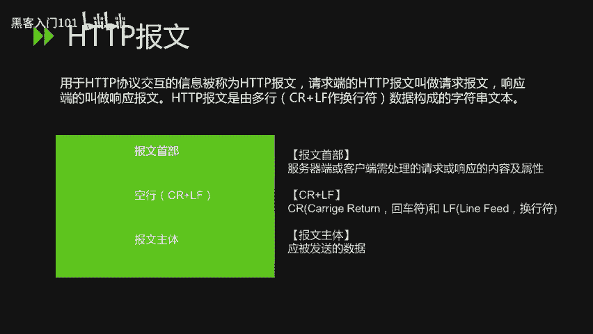
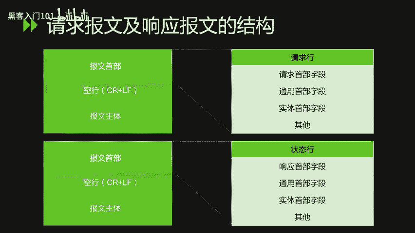
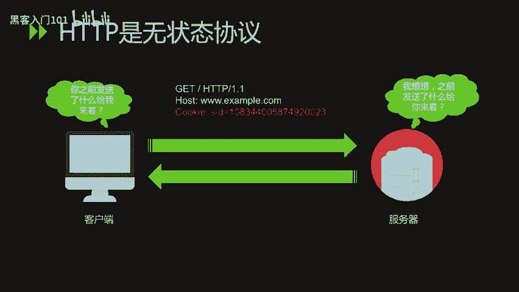
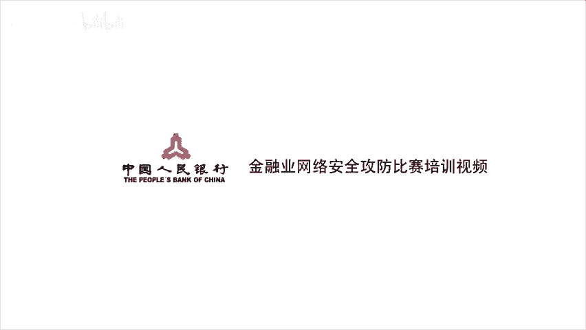

# CTF入门教程：1.1：HTTP协议分析（上）📡



在本节课中，我们将要学习HTTP协议的基础知识，包括其发展历史、协议结构以及核心概念。这是理解Web应用安全和后续CTF挑战的重要基石。

## HTTP协议发展史

HTTP（超文本传输协议）是互联网上应用最广泛的网络协议，所有万维网（WWW）文件都必须遵守这个标准。设计HTTP最初的目的是为了提供一种发布和接收HTML页面的方法。

HTTP协议和TCP/IP协议组内的其他众多协议相同，用于客户端和服务端之间的通信。HTTP是建立在TCP协议上进行通信的。

*   **1989年**：HTTP诞生。最初的设想是借助多文档之间相互关联形成的超文本，连接成可相互浏览的万维网。
*   **1990年**：HTTP/0.9版本问世。
*   **1996年5月**：HTTP正式作为标准被公布，当时是HTTP/1.0版本。
*   **1997年1月**：公布的HTTP/1.1是目前主流的HTTP协议版本。

## HTTP协议结构



上一节我们介绍了HTTP的发展史，本节中我们来看看HTTP的通信过程与报文结构。

HTTP协议规定，通信请求必须由客户端主动发起，服务端在没有接收到请求之前，不会发送响应。

### HTTP报文

HTTP报文是用于HTTP协议交互的信息。请求端的HTTP报文叫**请求报文**，响应端的叫**响应报文**。



HTTP报文是由多行数据构成的字符串文本，多行之间使用CRLF（回车换行符）作为换行符。HTTP报文大致可分为**报文首部**和**报文主体**两块。

*   **报文首部**：包含服务器端或客户端需处理的请求或响应的内容及属性。
*   **空行**：CR（回车）和LF（换行符）组成，用于分隔首部和主体。
*   **报文主体**：应被发送的数据。



### 请求报文与响应报文结构

以下是HTTP请求报文与响应报文的基本结构。

**请求报文**结构如下：
```
请求行
请求首部字段
通用首部字段
实体首部字段
其他
[空行]
报文主体
```

**响应报文**结构如下：
```
状态行
响应首部字段
通用首部字段
实体首部字段
其他
[空行]
报文主体
```

#### 请求报文详解

请求报文主要由**请求方法**、**请求URI**、**协议版本**、可选的**请求首部字段**以及**内容实体**组成。

以下是主要的HTTP请求方法：

*   **GET**：请求访问已被URI识别的资源。
*   **POST**：用于传输实体的主体。
*   **PUT**：用于传输文件。
*   **HEAD**：与GET方法一样，只是不返回报文主体部分。用于确认URI的有效性及资源更新的日期时间等。
*   **DELETE**：删除文件。
*   **OPTIONS**：用于查询针对请求URI指定的资源支持的方法。
*   **TRACE**：让Web服务器端将之前的请求通信环回给客户端。
*   **CONNECT**：用于与代理服务器通信时建立隧道。

虽然用GET方法也可以传输实体的主体，但一般不用GET方法进行传输，通常还是使用POST的方法进行传输。

#### 响应报文详解

响应报文由**协议版本**、**状态码**、用于解释状态码的**原因短语**、可选的**响应首部字段**以及**实体主体**构成。

状态码是表示请求成功或失败的数字代码。状态码主要分为5类：

*   **1xx（信息性状态码）**：接收的请求正在处理。
*   **2xx（成功状态码）**：请求正常处理完毕。
*   **3xx（重定向状态码）**：需要进行附加操作以完成请求。
*   **4xx（客户端错误状态码）**：服务器无法处理请求。
*   **5xx（服务器错误状态码）**：服务器处理请求出错。

HTTP状态码负责表示客户端HTTP请求的返回结果，标记服务器端的处理是否正常，或通知出现的错误。

以下是日常上网或工作中常见的状态码：

*   **200 OK**：从客户端发来的请求在服务器端被正常处理了。
*   **301 Moved Permanently**：永久性重定向。表示请求的资源已被分配了新的URI，以后应使用资源现在所指定的URI。
*   **302 Found**：临时性重定向。表示请求的资源已被分配了新的URI，希望用户本次能使用新的URI进行访问。
*   **304 Not Modified**：客户端发送附带条件的请求时，服务器端允许请求访问资源但未满足条件的情况。304状态码返回时不包含任何响应的主体部分。
    *   “附带条件的请求”是指采用GET方法的请求报文中包含`If-Match`、`If-Modified-Since`等条件。
*   **400 Bad Request**：请求报文中存在语法错误。当错误发生时，需修改请求的内容后，再次发送请求。
*   **401 Unauthorized**：该状态码表示发送的请求需要通过HTTP认证（如BASIC认证、DIGEST认证）。若之前已进行过一次请求，则表示用户认证失败。
*   **403 Forbidden**：表明对请求资源的访问被服务器拒绝了。
*   **404 Not Found**：表明服务器上无法找到请求的资源。
*   **500 Internal Server Error**：表明服务器端在执行请求时发生了错误，也有可能是Web应用存在的bug或某些临时性的故障。
*   **503 Service Unavailable**：表明服务器暂时处于超负载或正在进行停机维护，现在无法处理请求。

## HTTP的无状态性与Cookie

最后我们来看一下，HTTP是一种**无状态协议**。

无状态协议是指HTTP协议自身不对请求和响应之间的通信状态进行保存。也就是说，协议对于发送的请求或响应都不做持久化处理。这是为了更快地处理大量事务，确保协议的可伸缩性。

但是，随着Web的不断发展，因无状态而导致业务处理变得棘手的情况越来越多。为了实现保存状态的功能，引入了**Cookie**技术。有了Cookie技术，再用HTTP协议通信，便可以管理状态。

关于Cookie技术的讲解，将在下一堂课进行详细描述。



---



本节课中我们一起学习了HTTP协议的基础知识，包括其发展历程、通信模型、报文结构（请求与响应）、核心方法、状态码以及无状态特性。理解这些概念是分析Web应用、发现安全漏洞并解决CTF中Web类挑战的第一步。