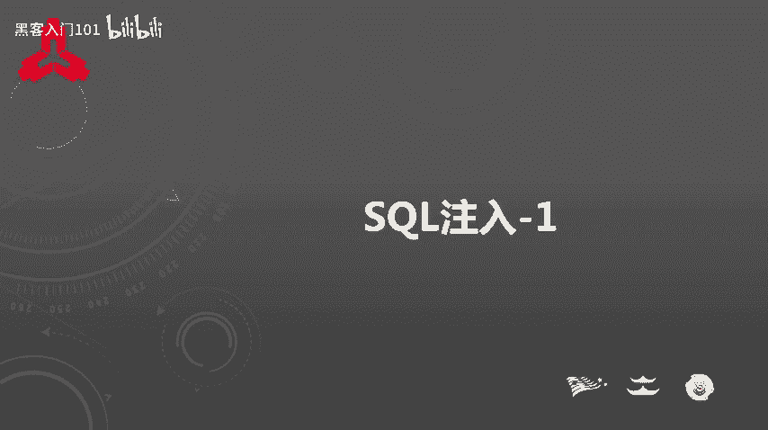
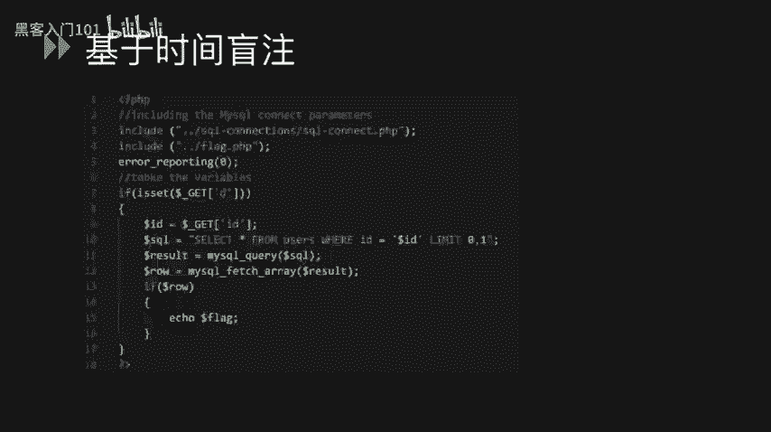
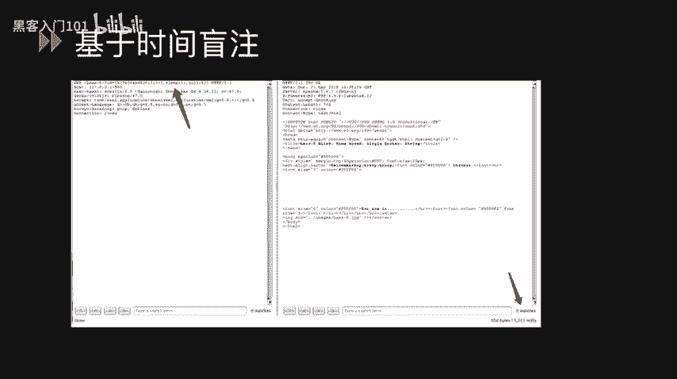
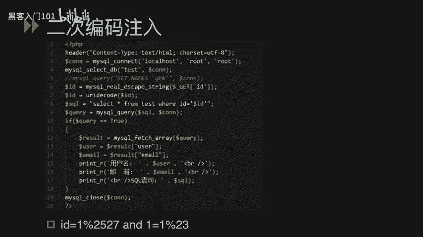

# CTF夺旗赛教程：P20：SQL注入基础与类型

在本节课中，我们将学习SQL注入的基本概念及其在CTF比赛中的常见类型。SQL注入是一种通过将恶意SQL命令插入到Web应用输入参数中，从而操纵后端数据库执行非预期指令的攻击技术。我们将从原理入手，逐步介绍字符型、数字型、布尔盲注、时间盲注、宽字节注入和二次编码注入等类型，并通过简单的示例帮助初学者理解。

## 什么是SQL注入？🔍

SQL注入是攻击者通过将恶意的SQL命令插入到POST提交的数据或URL参数值中，从而造成额外的SQL语句被执行的一种攻击方式。

这些额外的SQL语句通常是攻击者构造的恶意指令，可能是查询语句，也可能是删除或更新数据的语句。这些语句不仅可能导致数据泄露，还可能对数据库造成严重威胁。

在CTF比赛中，我们最常遇到的是MySQL数据库。因此，本教程将重点讲解MySQL数据库的注入技巧及其常见问题。

## SQL注入的主要类型

SQL注入有多种类型，我们将逐一进行讲解。

### 字符型注入

我们来看一个示例。在下面的代码中，第4行有一条SQL语句：`SELECT * FROM users WHERE name = ‘$name’`。其中，`$name`变量是从GET参数中获取的值。

我们可以通过向`name`参数输入特定的值并构造恶意SQL语句，来执行额外的SQL命令。例如，我们可以输入：
`name = test’ UNION SELECT ...`
这里的单引号`’`用于闭合原SQL语句中的引号，然后通过`UNION SELECT`进行联合查询，从而执行额外的SQL语句。

### 数字型注入

我们来看另一个示例。在下面的代码中，有一条SQL语句：`SELECT content FROM test WHERE id = $id`。`$id`变量在第3行从GET参数中获取，并且它是一个数值变量。

因此，我们称之为数字型注入。我们可以通过输入类似`id = 1 UNION SELECT ...`的payload，利用联合查询来执行额外的SQL语句。

### 布尔盲注

接下来，我们介绍第三种类型：布尔盲注。在下面的示例中，第9行的SQL语句在`$id`变量后加上了`LIMIT 0,1`。这意味着我们不能直接使用`UNION SELECT`进行查询。

此时，我们只能通过盲注的方式来判断是否存在SQL注入漏洞，并逐步读取我们想要的数据。

首先，我们输入`id = 1’`。这个单引号会闭合变量前的引号，从而破坏整个SQL语句的结构，导致语句无法执行，因此没有回显。

接着，我们输入`id = 1’ AND 1=1`。由于`1=1`恒为真，整个SQL语句结构完整且条件成立，因此会有正常的回显。

然后，我们输入`id = 1’ AND 1=2`。由于`1=2`恒为假，整个SQL语句的条件不成立，因此不会有回显。

通过这种方式，我们可以判断此处存在SQL注入漏洞。之后，我们需要通过盲注技术来获取敏感信息。

盲注通常用到以下几个函数：
*   `LENGTH()`: 返回字符串的长度。
*   `SUBSTRING()`: 截取字符串，例如`SUBSTRING(str,1,1)`截取字符串的第一个字符。
*   `ASCII()`: 返回字符的ASCII码。
*   `SLEEP()`: 让程序挂起（休眠）一段时间。
*   `IF()`: 条件判断语句。如果第一个参数为真，则执行第二个参数；如果为假，则执行第三个参数。

我们可以利用这些函数来猜测数据的长度和内容。例如，通过`IF(LENGTH(DATABASE())>7,1,0)`来判断数据库名的长度是否大于7，并根据页面回显差异来确认结果。

### 基于时间的盲注

基于时间的盲注与布尔盲注原理相似，都是通过无法直接获得回显的方式来读取数据。

我们使用的示例与之前类似，但这里我们使用基于时间的盲注语句来执行。我们在存在漏洞的`$id`变量中输入包含`SLEEP(5)`函数的payload。

我们发现，加入`SLEEP(5)`的请求与未加入的请求，其响应时间有明显差异。`SLEEP()`函数中的数值越大，响应返回的速度就越慢，时间就越长。通过这种方式，我们可以判断此处存在SQL注入漏洞，并且可以执行`SLEEP()`函数。

### 宽字节注入

宽字节注入通常发生在PHP向MySQL发送请求时，字符集使用了`GBK`这类双字节编码的情况下。

在下面的示例中，第4行将字符集设置为`GBK`。第5行执行SQL语句。第3行使用`addslashes()`函数对`$id`变量进行了安全过滤，该函数会将单引号`’`转义为`\'`（即前面加上反斜杠`\`）。

那么如何绕过这个过滤呢？我们来看下面的payload。
我们输入`id = %df%27`（`%27`是单引号的URL编码）。由于`addslashes()`函数的存在，它会在`%27`前加上一个反斜杠，其URL编码为`%5c`。
由于字符集被设置为`GBK`，`%df%5c`会被解码为一个繁体汉字“運”，从而使后面的单引号`%27`成功“逃逸”出来，形成一个独立的单引号，最终达成SQL注入。

修复此问题的方法是将字符集设置为`UTF-8`。

宽字节注入还可以用于绕过另一个安全函数：`mysql_real_escape_string()`。该函数会对单引号等7个字符进行转义（在前面加上反斜杠）。但在`GBK`等宽字符集下，通过构造特定字符，同样可能实现绕过。

### 二次编码注入

二次编码注入是由于安全函数被冗余使用而导致的问题。

在下面的示例中，第6行使用了`mysql_real_escape_string()`安全函数。由于第2行字符集设置为`UTF-8`，因此无法使用宽字节注入。
但第7行又使用了一个`urldecode()`函数。这两个函数的同时存在导致了绕过可能。

我们输入的payload为：`id = 1%2527 AND 1=1%23`。
关键在于`1%2527`。`%2527`是单引号`%27`经过二次URL编码后的结果（`%25`是`%`的编码）。在第一次经过`mysql_real_escape_string()`函数时，由于字符串中不包含它需要转义的那7个字符之一，因此被安全绕过。
接着，在`urldecode()`函数处理时，`%2527`被解码为`%27`（一个单引号）。这样，一个单引号就被成功引入到第8行的SQL语句中，从而获得了执行额外SQL语句的权限。这就是二次编码注入的问题。

## 总结

本节课我们一起学习了SQL注入的基础概念及其在CTF中的多种常见类型，包括字符型注入、数字型注入、布尔盲注、时间盲注、宽字节注入和二次编码注入。理解这些注入类型的原理和利用方式是CTF比赛中Web安全方向的重要基础。在后续课程中，我们将学习更复杂的注入技巧和实战案例。