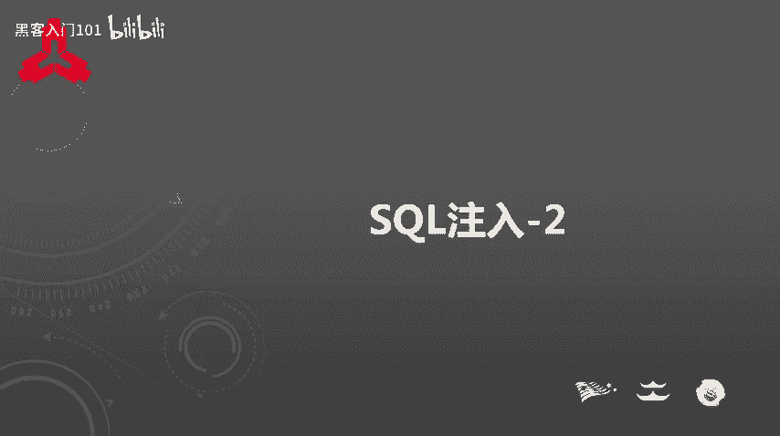
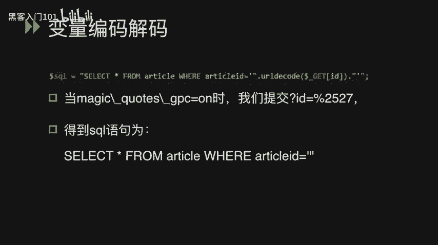
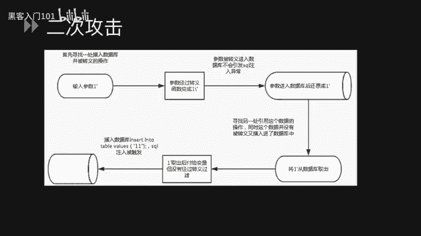
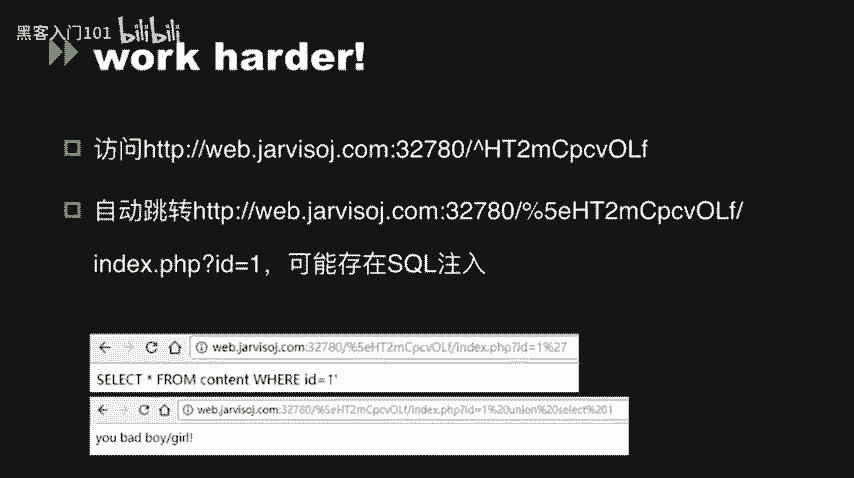
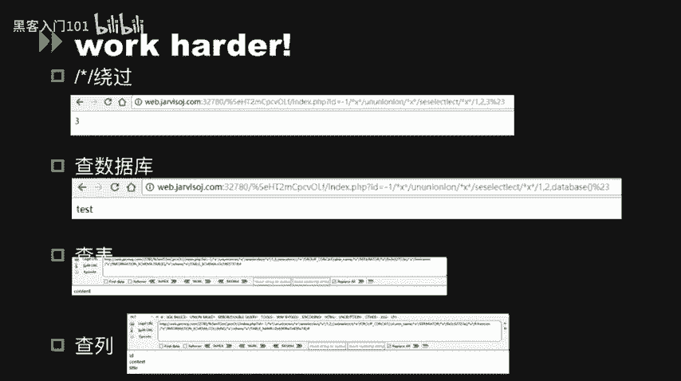
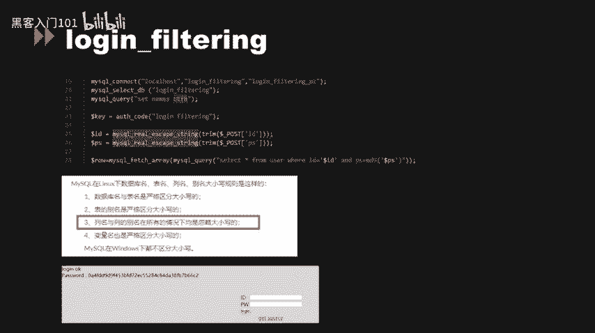
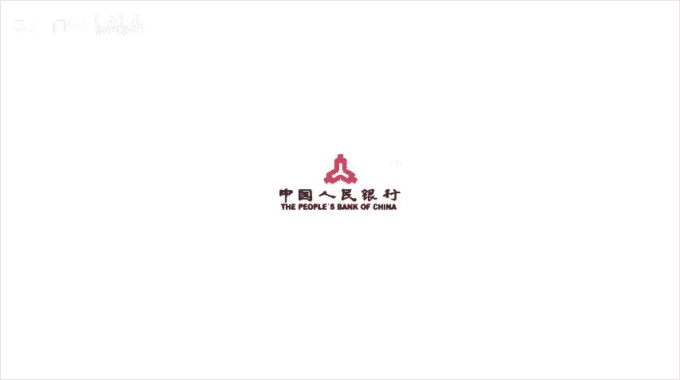

# CTF夺旗赛教程：P21：SQL注入_2 🔐

在本节课中，我们将学习SQL注入在CTF比赛中的几种高级应用场景，包括魔术引号（magic_quotes_gpc）机制、变量编码解码问题、二次攻击原理，并通过三道实战题目来巩固这些知识。

---

## 魔术引号（magic_quotes_gpc）机制 🛡️

上一节我们介绍了SQL注入的基础原理，本节中我们来看看PHP中一个曾用于防御SQL注入的安全机制——魔术引号（`magic_quotes_gpc`）。

当PHP配置选项 `magic_quotes_gpc` 被设置为 `on` 时，所有通过GET、POST、COOKIE传入的单引号（`'`）、双引号（`"`）、反斜线（`\`）和NULL字符都会被自动加上一个反斜线进行转义。其原理与 `addslashes()` 函数完全相同。

**公式**：`用户输入 '` → `转义后 \'`

例如，用户输入一个反斜线，系统会将其转义为两个反斜线，使其失去转义功能，变为普通字符串。单引号和双引号同理。

在PHP版本小于4.2.3时，此选项是全局生效的。自PHP 5.3.0起被废弃，并在PHP 5.4.0中被移除。

### 魔术引号被弃用的原因

以下是其主要缺陷：

1.  **影响程序一致性**：并非所有数据都需要插入数据库，全局转义会影响程序逻辑的一致性。
2.  **降低执行效率**：对所有传入数据进行转义处理会增加不必要的开销。
3.  **导致数据误判**：在不需要转义的地方（如邮件内容）看到被转义的数据（如 `\'`）会造成困扰。此时可使用 `stripslashes()` 函数进行反转义。
4.  **存在安全缺陷**：该机制可能影响`$_SERVER`等超全局变量，导致某些漏洞（如CRLF注入）仍可被利用。

可以通过 `get_magic_quotes_gpc()` 函数检测该选项是否开启。在涉及 `$HTTP_RAW_POST_DATA` 或 `php://input` 流的数据处理中，也常受此选项影响。

在SQL语句的 `IN`、`LIMIT`、`ORDER BY`、`GROUP BY` 等子句中，开发者容易忘记处理用户输入，而魔术引号会在此自动进行转义。

---

## 变量编码与解码问题 🔄

上一节我们提到了`stripslashes()`是`addslashes()`的反函数。在PHP中，存在多组类似的编码与解码函数。

以下是常见的对应关系：

*   **Base64编码/解码**：`base64_encode()` 与 `base64_decode()`
*   **URL编码/解码**：`urlencode()` 与 `urldecode()` （`rawurlencode()` 与 `rawurldecode()` 功能类似）
*   **序列化/反序列化**：`serialize()` 与 `unserialize()`

在变量编码解码过程中，如果顺序或逻辑不当，就可能产生安全漏洞，例如**二次编码注入**。

### 二次编码注入示例

考虑以下代码逻辑：
1.  用户输入的 `id` 参数首先经过开启了 `magic_quotes_gpc` 的PHP环境处理。
2.  随后，代码又使用 `urldecode()` 对 `id` 进行了一次解码。

**攻击过程**：
*   攻击者输入 `id=%2527`（`%25` 是 `%` 的URL编码）。
*   `magic_quotes_gpc` 检查 `%2527`，未发现单引号，故不转义。
*   `urldecode()` 第一次解码：`%2527` → `%27`（`%27` 是单引号 `'` 的URL编码）。
*   如果代码逻辑不当，`%27` 可能被再次解码或直接拼接进SQL语句，最终逃逸出单引号 `'`，引发注入。

**核心绕过思路**：利用多层编码，使敏感字符在初次安全检查时“隐形”，在后续解码步骤中还原。

---

## 二次攻击原理 ⚔️

二次攻击与二次编码攻击不同，它利用了数据“存入-取出”过程中的转义差异。

以下是其业务逻辑过程：

1.  **第一次输入与转义**：用户在某处提交参数 `1'`。由于存在转义（如`magic_quotes_gpc`），它被转换为 `1\'` 后存入数据库，此时不会引发SQL注入。
2.  **数据存储**：数据库实际存储的是转义后的数据 `1\'`。在某些数据库（如MySQL）中，存储时会进行反转义，最终存为 `1'`。
3.  **第二次引用与漏洞触发**：应用程序的另一处功能从数据库中取出该数据（`1'`），并直接赋值给一个变量，**且未经过任何过滤**。
4.  **注入发生**：当这个未被过滤的变量（`1'`）被拼接到新的SQL语句中时，就会成功引发SQL注入漏洞。

**本质原因**：从数据库取出的数据被认为是“安全”的而未被二次过滤，但其中包含的恶意字符在拼接时依然有效。

不同数据库的转义字符：
*   **SQLite/Oracle**：反斜杠（`\`）。`1'` → `1\'` (存入) → `1'` (存储/取出)。
*   **MySQL**：单引号（`'`）。`1'` → `1\'`，MySQL可能直接将其视为普通字符串 `1\'` 处理。

魔术引号还可能引发其他问题，例如反斜杠（`\`）在Windows路径中也是目录分隔符，不当的转义可能为目录遍历漏洞创造条件。

---

## 实战题目解析 🎯

下面我们通过三道CTF题目，将上述理论应用于实践。

### 题目一：基础绕过与注入

首先，我们访问给出的URL并查看源代码，发现提示访问 `index.phps` 获取源码。

**代码分析**：源码中存在关键的条件判断语句需要绕过。主要涉及两个点：
1.  变量 `$data` 的验证。
2.  `eregi()` 函数的匹配。

**绕过方法**：
*   对于 `$data`，可以使用 `php://input` 流来传递数据以绕过常规赋值检查。
*   对于 `eregi()`，可以利用字符串截断或特定字符编码进行绕过。

成功绕过后，获得一个提示路径。访问该路径，发现存在SQL注入点。

**注入与过滤绕过**：测试发现，代码过滤了空格。
*   **绕过方法**：使用注释符 `/**/` 代替空格。
    **Payload示例**：`union/**/select/**/1,2,database()`

**攻击步骤**：
1.  使用 `/**/` 绕过空格过滤，逐步构造联合查询。
2.  查询当前数据库名。
3.  查询数据库中的表名。
4.  查询目标表的列名。
5.  最终读取包含flag的数据。

### 题目二：宽字节注入

第二道题的源代码中使用了 `mysql_real_escape_string()` 函数进行转义，这通常被认为是安全的。然而，当数据库连接字符集设置为 `GBK` 等宽字符集时，可能产生**宽字节注入**漏洞。

**原理简述**：`mysql_real_escape_string()` 会将单引号 `'` 转义为 `\'`（即 `%5C%27`）。如果我们在其前输入一个ASCII码大于128的字符（如 `%df`），数据库在GBK编码下可能会将 `%df%5c` 解析为一个合法的宽字符（如“運”），从而使后面的 `%27`（单引号）逃逸出来。

**解题方法**：
*   手动构造宽字节Payload，例如：`%df' OR 1=1#`
*   使用自动化工具 **SQLMap**，配合 `--tamper` 参数指定 `unmagicquotes.py` 脚本进行自动化注入。

### 题目三：大小写绕过

第三道题同样使用了 `mysql_real_escape_string()`，但代码第21行将字符集设置为 `UTF-8`，因此无法使用宽字节注入。

**新的挑战**：需要绕过 `mysql_real_escape_string()` 对用户名和密码的转义。

**关键发现**：在MySQL（尤其是Linux环境下）的命名规则中，**列名和列别名在所有情况下是忽略大小写的**。而题目中用于验证的“用户名”和“密码”很可能就是表中的列名。

**绕过方法**：在输入用户名和密码时，使用**大写字母**。
*   例如，如果列名为 `admin`，尝试输入 `ADMIN` 或 `AdMiN`。
*   由于列名不区分大小写，查询 `WHERE username='ADMIN'` 会成功匹配到 `username='admin'` 的记录，从而绕过登录验证，获取flag。

---

## 总结 📝

本节课我们一起深入学习了SQL注入的几种高级利用技术：
1.  **魔术引号（magic_quotes_gpc）**：了解了其工作原理、历史作用、被弃用的原因以及可能引发的编码和安全问题。
2.  **变量编码解码**：认识了常见的编码解码函数对，并掌握了通过二次编码绕过转义的攻击思路。
3.  **二次攻击**：理解了数据在存储与读取过程中因转义状态变化而产生的漏洞原理。
4.  **实战应用**：通过三道CTF题目，实践了**注释符绕过空格过滤**、**宽字节注入**以及利用**MySQL列名大小写不敏感**进行绕过的技巧。

这些知识有助于你在CTF比赛中识别和利用更复杂的SQL注入漏洞，同时也强调了在开发中实施多层次、前后端一致的安全过滤的重要性。