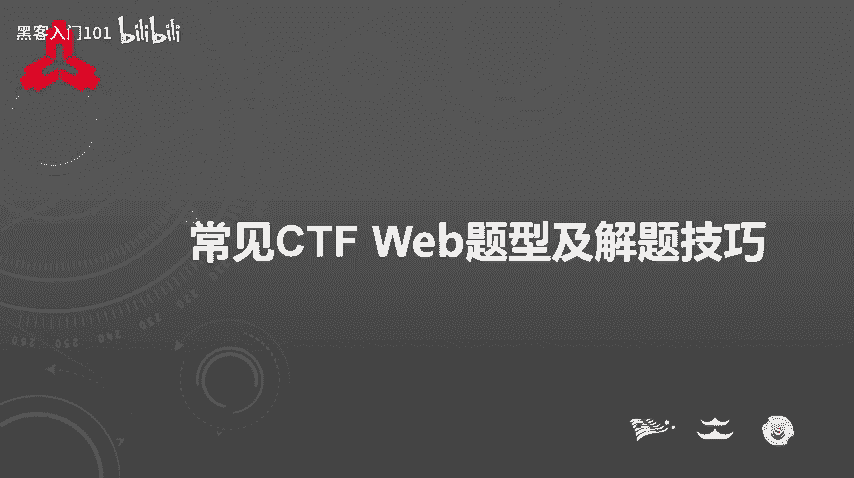
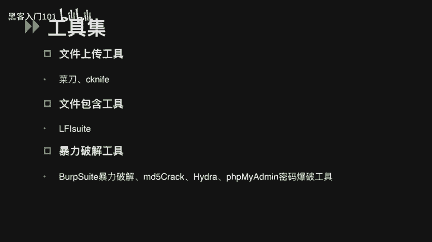
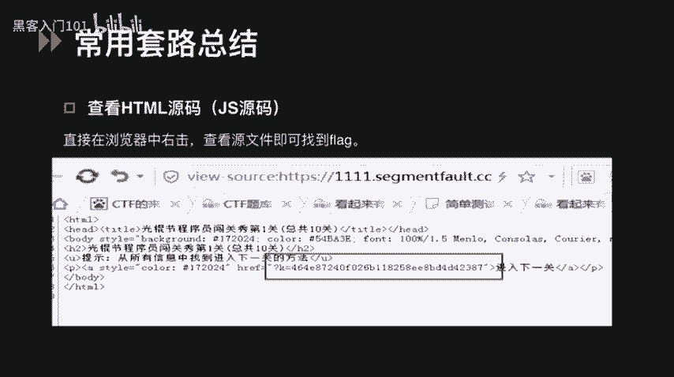
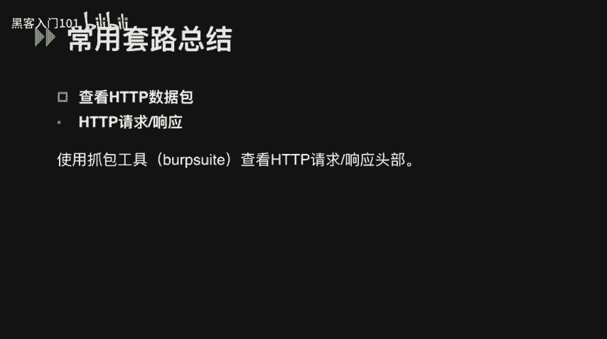
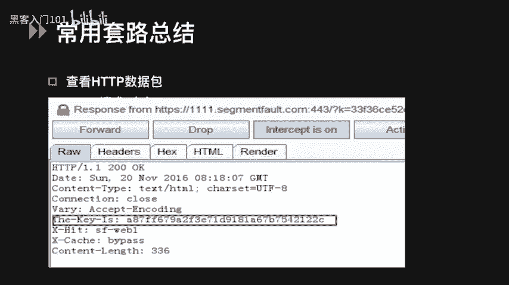
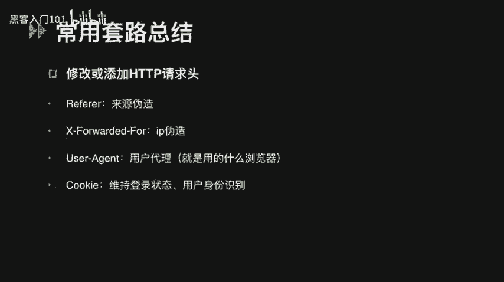
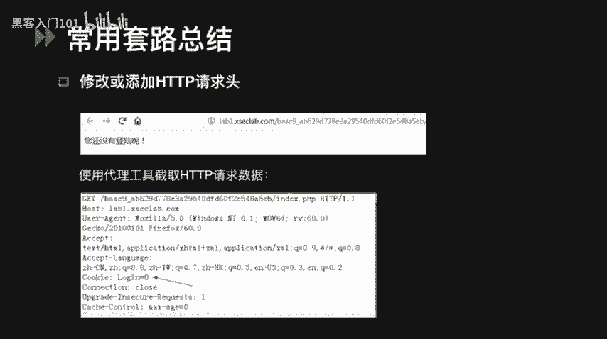
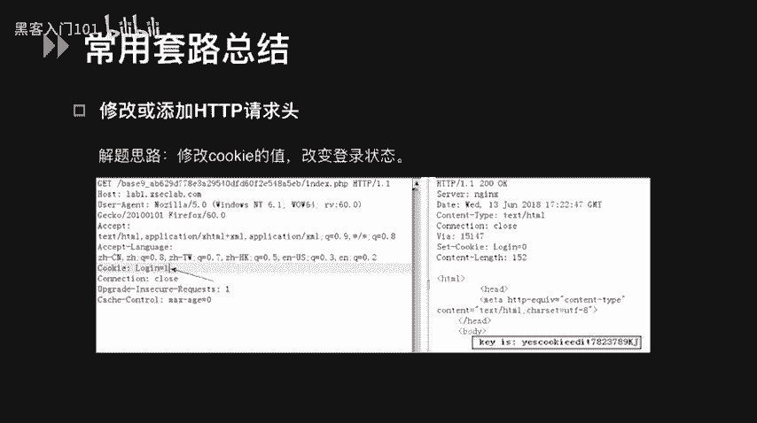
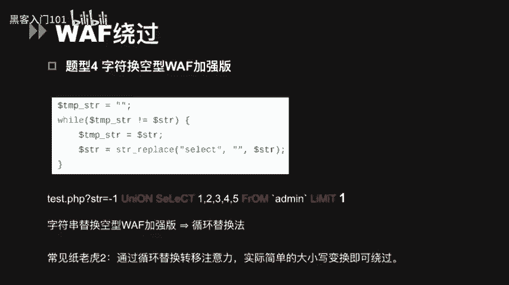
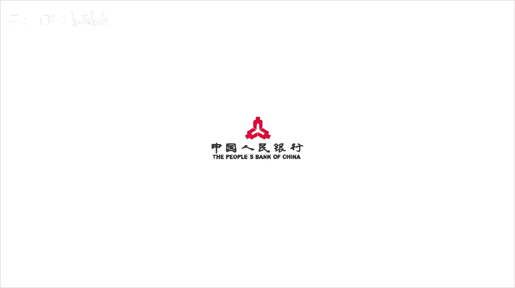

# CTF入门教程：P24：常见CTF Web题型及解题技巧 🚩



在本节课中，我们将要学习CTF比赛中常见的Web题型及其解题技巧。课程内容将分为三个主要部分：常用工具集介绍、解题套路总结以及针对特定题型的技巧分析。通过学习，你将能够掌握识别和解决各类Web安全挑战的基本方法。

## 常用工具集介绍 🛠️

上一节我们概述了课程内容，本节中我们来看看CTF Web题目中常用到的一些工具。熟练使用这些工具是解题的基础。

以下是CTF Web类题目中常用的基础工具列表：
*   **Burp Suite**：一个代理工具，也是用于攻击Web应用程序的集成平台，包含了许多实用功能。
*   **Firefox浏览器及插件**：功能强大，例如HackBar插件可以支持修改POST请求参数，提供SQL注入和XSS工具功能，并能快速对字符串进行各种编码。

以下是常用的扫描工具列表：
*   **御剑/DirBuster**：可以对网站后台目录进行扫描。
*   **Nmap**：用于扫描开放端口，探测服务。
*   **AWVS**：一个Web漏洞扫描工具，可以扫描一些常规的Web漏洞。**注意**：在CTF比赛中，扫描工具要慎用，有的比赛禁止参赛人员进行大批量扫描操作。

以下是其他专项工具列表：
*   **SQL注入工具**：最常用的是`sqlmap`。
*   **XSS平台**：能够通过注入XSS代码获取信息（如Cookie、LocalStorage）。可以自己搭建，比较有名的是`XSStrike`。
*   **文件上传工具**：主要是中国菜刀、Cknife。向网站上传木马文件后，可以在本地连接木马获取甚至控制整个网站的目录。
*   **LFI Suite**：本地文件包含漏洞利用神器，提供了多种不同的攻击模块，使用方法简单。
*   **暴力破解工具**：
    *   Burp Suite里的Intruder模块可用于认证破解。
    *   如果密码是MD5加密，可以使用MD5Crack等软件。
    *   `Hydra`：一款开源的暴力破解工具，支持SSH、FTP、MSSQL、MySQL、POP3等服务。
    *   `PHPMyAdmin`密码爆破工具：可以通过指定账号和密码对MySQL数据库进行登录尝试。



除此之外还有很多其他工具，大家也可以自行搜索下载并尝试使用。



## 解题套路总结 🧩





在CTF比赛中，Pwn、Misc、Reverse、Crypto都是稳扎稳打的题型，而Web题型则更需要一些技巧和套路。

### 套路一：信息查找



最简单的一种套路是直接在浏览器右键查看页面源代码，有时就可以看到flag。



除了在源代码中，有时flag会藏在HTTP请求或响应包的头部。可以通过代理工具（如之前提到的Burp Suite）抓包查看。例如，在HTTP响应包的`The-Key-Is`头部的值，可能就是我们要获取的flag。



### 套路二：请求头伪造

我们还可以通过修改或添加HTTP请求头来伪造客户端信息。
*   修改`Referer`头可以伪造请求来源。
*   修改`X-Forwarded-For`可以伪造客户端IP。
*   修改`User-Agent`可以伪造浏览器标识。
*   修改`Cookie`可以改变用户的登录状态。

**例题**：题目提示当前为“未登录状态”。解题思路是可能需要我们保持一个登录状态。我们可以尝试修改Cookie的值，例如改成`login=1`。当服务器认为用户处于登录状态时，就可以得到flag。

### 套路三：源码泄露

Web源码泄露是线上CTF比较常见的题型。
*   **VIM源码泄露**：如果发现页面有提示vi或vim，说明可能存在.swp文件泄露。直接访问`/.index.php.swp`或`/index.php~`可能获得源码。如果下载的文件有乱码，可以在Linux下执行`vim -r index.php`恢复。
*   **备份文件泄露**：可以尝试访问`index.php.bak`、`www.zip`等后缀的文件。
*   **Git源码泄露**：运行`git init`会在当前目录产生`.git`隐藏文件夹。可以访问`.git/config`获取信息，也可以使用`GitHack`等工具。
*   **SVN源码泄露**：SVN是版本控制系统。可以通过访问`.svn/entries`获取源码，工具有`svnExploit`和`dvcs-ripper`等。

## 常见题型解题技巧 🔍

在Web题型里，也常会出现编码加解密、PHP弱类型、WAF绕过等特定类型的题目。

### 编码与加解密

这类题目主要考察对常见编码方式的识别和破解能力。

**Base64多次加密**：访问页面得到一串末尾带等号的字符串，可能是Base64编码。用Base64解码一次后未得到明文，则猜测可能经过了多次Base64加密。可以用Python写一个循环解密的脚本。

**摩尔斯电码**：一种早期的数字化通信形式，用点（.）和划（-）表示字符。编码后形如`.... . .-.. .-.. ---`。可以使用在线加解密网站快速破解。

**培根密码**：本质上用二进制设计，但用A和B表示。它选取5个字母为一组进行加密。同样可以使用在线工具解密。

**栅栏密码**：CTF中常见的加密方式之一。栅栏密码本身有一个潜规则，就是组成栅栏的字母一般不会太多（一般不超过30个）。

**凯撒密码**：通过把字母移动一定的位数来实现加密和解密。例如，当偏移量为1时，`T`加密后变为`U`。网上可以找到加解密凯撒密码的工具。

**JSFuck编码**：仅用`[`、`]`、`(`、`)`、`+`、`!`这6个字符进行编码。如果碰到类似字符串，可判断为JSFuck编码，也有在线解密地址。

编码类题目主要靠平时积累经验，看到特定格式的字符串能迅速判断其编码方式。

### Windows特性利用

*   **短文件名**：Windows为长文件名生成对应的8.3格式短文件名（如`backup~1.sql`）。可以利用波浪号（`~`）字符猜测暴露的短文件名。
*   **IIS解析漏洞**：可以用来绕过文件上传中的服务端白名单和黑名单检测。

### PHP弱类型

PHP弱类型相关题目往往有一些固定技巧。

**PHP类型比较**：在PHP中，`==`（松散比较）会先将变量转换为相同类型再比较。
*   字符串和整数比较时，字符串会被转换成数值。例如，`"abc" == 0`为真（首字符非数字转为0），`"123a" == 123`为真（取前面数字部分）。
*   空字符串、`NULL`、布尔值`FALSE`均等于0。
*   `"0e123456" == "0e987654"`为真，因为`0e`开头的字符串在比较时会被视为科学计数法（0的任意次方均为0）。

**题型1：`strcmp()`字符串比较绕过**
`strcmp()`函数用于比较两个字符串。如果期望传入字符串类型，但传入一个数组，函数将发生错误并返回`NULL`。在松散比较中，`NULL == 0`为真，从而可能绕过判断。
```php
if (strcmp($_GET['flag'], $secret_flag) == 0) {
    // 传入 flag[]=1 可能绕过
}
```

**题型2：MD5绕过**
题目要求输入两个不同的值，使它们的MD5值相等（`==`比较）。
*   **解法1（科学计数法绕过）**：寻找两个MD5值均为`0e`开头的字符串。在松散比较中，它们都被视为0，从而相等。例如：`0e123...` 和 `0e456...`。
*   **解法2（数组绕过）**：`md5()`函数无法处理数组，传入数组会返回`NULL`。因此，传入两个不同的数组，`md5($a) == md5($b)` 结果为 `NULL == NULL`，为真。
```php
if ($_GET['a'] != $_GET['b'] && md5($_GET['a']) == md5($_GET['b'])) {
    // 传入 a[]=1&b[]=2 可能绕过
}
```

### WAF绕过技巧

WAF（Web应用防火墙）绕过是CTF Web题的常见考点。

以下是几种常见的WAF绕过方式：
*   **大小写混合**：例如`SeLeCt`代替`select`。但若正则表达式使用修饰符`/i`（大小写不敏感）则无法绕过。
*   **编码**：
    *   对关键字进行URL编码，如单引号`%27`，斜杠`%2F`。
    *   使用十六进制编码库名或表名，如`0x7461626c65`（`table`的十六进制）。
*   **注释符**：
    *   常见注释符有`#`、`-- `、`/**/`。`/**/`可用来替代空格或分割关键字，如`uni/**/on`、`sel/**/ect`。
*   **空字节（%00）**：在一些语言中，空字节表示字符串结束。过滤器遇到空字节可能停止处理，从而绕过后面过滤的语句。
*   **嵌套剥离**：前提是WAF只替换或删除一次关键字（如`select`）。可以通过嵌套来绕过，例如`selselectect`，被剥离中间的`select`后，剩下的字符组合成新的`select`。
*   **避开自定义过滤器**：一些过滤器的过滤列表是写死的。只要输入语法不匹配即可绕过，例如将`and`写成`aNd`。

**题型3：字符替换空型WAF**
题目使用`str_replace()`函数将`select`等关键词替换为空。由于只替换一次，故可以使用嵌套剥离法绕过，如输入`selselectect`。

**题型4：字符替换空型WAF加强版**
题目通过`while`语句循环替换关键词。看似严密，但简单的大小写混合（如`SeLeCt`）可能就可以绕过，因为循环替换的可能是小写字符串。

---





本节课中我们一起学习了CTF Web比赛的常见题型与核心解题技巧。我们首先认识了Burp Suite、sqlmap等必备工具，然后总结了信息查找、请求头伪造、源码泄露等通用套路，最后深入分析了编码解密、PHP弱类型比较和WAF绕过等特定题型的解法。掌握这些基础知识和思路，将帮助你更从容地应对CTF中的Web安全挑战。