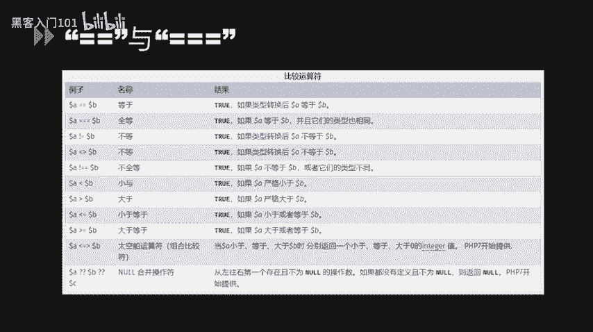
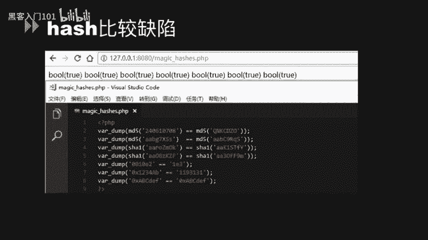
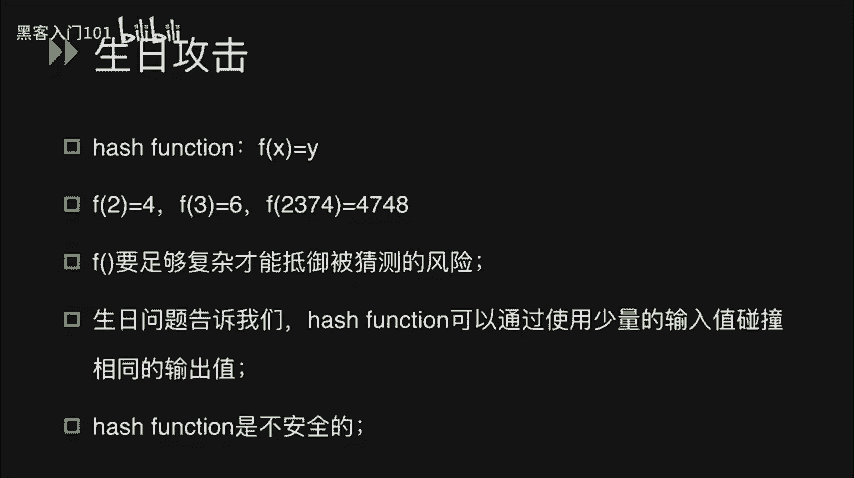
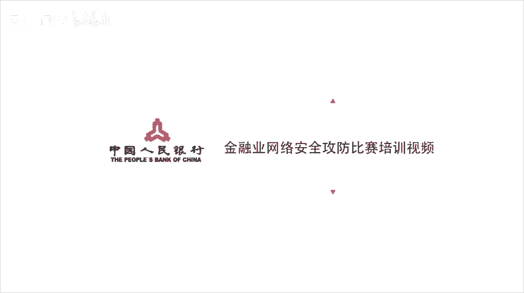

# CTF入门教程：P25：代码审计基础


在本节课中，我们将要学习CTF比赛中PHP代码审计的基础知识。代码审计是发现和利用Web应用程序漏洞的关键技能，通过分析源代码，我们可以找到绕过安全限制或获取系统权限的方法。

## 🧐 核心概念：松散比较与严格比较

在PHP代码审计中，理解比较运算符的差异至关重要。PHP提供了两种主要的比较运算符：双等号 `==`（松散比较）和三个等号 `===`（严格比较）。



*   **严格比较 (`===`)**：首先比较两个值的**类型**，如果类型不同，直接返回 `false`。只有在类型相同的情况下，才会进一步比较它们的值。
*   **松散比较 (`==`)**：在比较之前，会尝试将两个值转换为**相同的类型**，然后再进行比较。这个类型转换过程是许多安全漏洞的根源。

以下是PHP官方手册中的一个对比图表，展示了一些违反直觉的比较结果：


例如，字符串 `"1"` 和整数 `1` 进行松散比较 (`"1" == 1`) 的结果是 `true`，因为字符串 `"1"` 被转换成了整数 `1`。而进行严格比较 (`"1" === 1`) 时，由于类型不同，结果则为 `false`。

## 🔍 热身示例：理解类型转换

为了更好地理解松散比较中的类型转换，我们来看一个简单的示例。

```php
// test.php 示例
var_dump("admin" == 0); // 输出: bool(true)
var_dump("1admin" == 1); // 输出: bool(true)
var_dump("admin1" == 1); // 输出: bool(false)
var_dump("admin1" == 0); // 输出: bool(true)
```

**结果分析：**
1.  `"admin" == 0` 为 `true`：字符串 `"admin"` 在转换为数字时，因为开头不是数字，所以被转为 `0`。`0 == 0` 成立。
2.  `"1admin" == 1` 为 `true`：字符串 `"1admin"` 在转换时，从开头读取数字直到遇到非数字字符，因此转为 `1`。`1 == 1` 成立。
3.  `"admin1" == 1` 为 `false`：字符串 `"admin1"` 开头是字母，转换后为 `0`。`0 == 1` 不成立。
4.  `"admin1" == 0` 为 `true`：同理，`"admin1"` 转为 `0`，`0 == 0` 成立。

## 🎯 利用哈希比较缺陷

上一节我们介绍了类型转换的基本原理，本节中我们来看看如何利用它绕过某些安全检查，特别是哈希值验证。

PHP中存在一个著名的“哈希比较缺陷”（Magic Hash）。当哈希值（如MD5、SHA1）以 `0e` 开头，后面跟随纯数字时（例如 `0e123456`），在松散比较中，它会被解释为科学计数法表示的 `0`（即 `0 * 10^123456 = 0`）。

**示例：**
```php
var_dump("0e123456" == "0e4456789"); // 输出: bool(true)
// 两者都被解释为 0，所以 0 == 0 成立。
```



因此，如果系统使用松散比较来验证用户输入的哈希值是否与预设值相等，攻击者可以寻找两个不同的原始值，使它们的哈希值都符合 `0e[0-9]*` 的格式，从而绕过验证。

以下是几个著名的“魔法哈希”对：

*   `md5(‘240610708’) == md5(‘QNKCDZO’)` 两者结果都是 `0e` 开头的字符串。
*   `sha1(‘aaroZmOk’) == sha1(‘aaK1STfY’)` 同样利用了此缺陷。
*   某些十六进制字符串的MD5值也存在此特性。

## 🎭 布尔欺骗与反序列化

除了直接比较，在数据解析过程中也可能发生类型欺骗。当使用 `json_decode()` 或 `unserialize()` 函数时，部分数据结构可能被意外解释为布尔值 `true`。

**示例1：json_decode**
```php
// demo1.php
$json_string = '{"user":"admin", "pass":"security"}';
$data = json_decode($json_string, true); // 解码为关联数组
// 在某些条件下，$data 可能在与布尔值比较时被当作 true
```

**示例2：unserialize**
```php
// demo2.php
$serialized_string = 'a:2:{s:4:"user";s:5:"admin";s:4:"pass";s:8:"security";}';
$data = unserialize($serialized_string); // 反序列化为数组或对象
// 同样，$data 可能在松散比较中被评估为 true
```

## 🔢 数字转换欺骗

数字转换欺骗是另一种常见漏洞，它发生在字符串被强制转换为整数或浮点数时。

**示例1：intval函数**
```php
echo intval("2"); // 输出: 2
echo intval("3ABCD"); // 输出: 3 (读取到3停止)
echo intval("ABCD"); // 输出: 0 (开头非数字)
```

**示例2：十六进制与十进制比较**
```php
var_dump("123456" == "0x1e240"); // 输出: bool(true)
// 字符串 "0x1e240" 在比较时被转换为十进制整数 123456
```

**示例3：浮点数比较**
```php
$userID = "0.999999";
if ($userID == 1) {
    echo "进入特权分支！"; // 此代码会被执行
    // 执行敏感SQL操作...
}
// 因为 “0.999999” 在比较时被转换为浮点数，与 1 进行近似比较。
```

**示例4：用户输入验证绕过**
```php
// 假设通过 GET 参数接收用户ID
$uid = $_GET['uid']; // 用户输入 1.1
if ($uid == 1) {
    echo "验证通过！"; // 输入 1.1 时，此分支也会被执行
}
// 因为字符串 “1.1” 被转换为浮点数 1.1，在与整数 1 松散比较时，PHP内部转换可能导致非预期结果。
```

## ⚙️ 危险的松散函数

PHP中一些函数在接收非预期类型参数时，行为可能变得松散，从而引入漏洞。

**1. strcmp 函数**
`strcmp($str1, $str2)` 用于比较两个字符串。但它有一个特性：如果 `$str2` 是一个**数组**，函数会返回 `NULL`。在松散比较中，`NULL == 0` 是 `true`。

```php
// test.php
$flag = "secret_key";
$input = $_GET['t']; // 用户传入一个数组，例如 ?t[]
if (strcmp($flag, $input) == 0) {
    echo “Welcome!”; // 传入数组时，strcmp返回NULL，NULL==0 为真，分支被执行。
}
```

**2. md5 函数与数组**
`md5()` 函数期望一个字符串参数。如果传入一个**数组**，它会返回 `NULL` 并产生一个警告，但不会终止执行。因此，任意两个数组的 `md5()` 哈希值在松散比较中都会“相等”。

```php
$arr1 = array(‘a’ => 1);
$arr2 = array(‘b’ => 2);
var_dump(md5($arr1) == md5($arr2)); // 输出: bool(true)
// 因为 md5($arr1) 和 md5($arr2) 都返回 NULL， NULL == NULL 为真。
```

## 🎂 生日攻击与哈希函数安全性

最后，我们来探讨一个理论概念，它说明了为什么哈希函数在密码学上可能是不安全的。

生日攻击源于“生日问题”：在一个房间里，至少需要多少人，才能使得其中两个人生日相同的概率超过50%？答案令人惊讶，只需要23人。当人数达到70时，概率高达99.9%。

将这个原理应用到哈希函数上：对于一个输出长度为 `n` 位的哈希函数，理论上大约需要尝试 `2^(n/2)` 个不同的输入，就有很高的概率找到一对不同的输入，产生相同的哈希输出（即碰撞）。例如，对于MD5（128位输出），找到碰撞的预期尝试次数大约是 `2^64`，这在现代计算能力下是可行的。

因此，**哈希函数在理论上是可能发生碰撞的**。这意味着，即使两个不同的文件或字符串，它们的MD5或SHA1值也有可能相同。在CTF中，可能会遇到需要利用哈希碰撞来解题的场景。




---

**总结：**


本节课中我们一起学习了PHP代码审计的多个基础但核心的概念：
1.  **松散比较 (`==`)** 与**严格比较 (`===`)** 的本质区别及其安全隐患。
2.  如何利用**类型转换**和**哈希比较缺陷**（Magic Hash）绕过条件判断。
3.  在 `json_decode` 和 `unserialize` 过程中可能发生的**布尔欺骗**。
4.  字符串到数字转换时产生的**数字转换欺骗**。
5.  像 `strcmp` 和 `md5` 这类函数在接收数组参数时的**非预期行为**。
6.  从密码学角度理解了**生日攻击**，认识到哈希函数存在碰撞的可能性。


掌握这些知识点是进行有效PHP代码审计的第一步，它们能帮助你在CTF比赛中快速识别常见漏洞模式。在后续课程中，我们将基于这些基础，学习更复杂的代码审计技巧和实战案例。