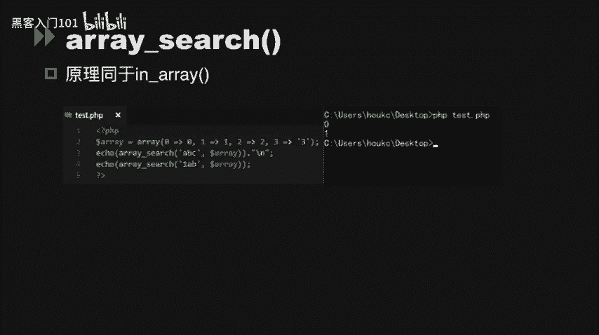
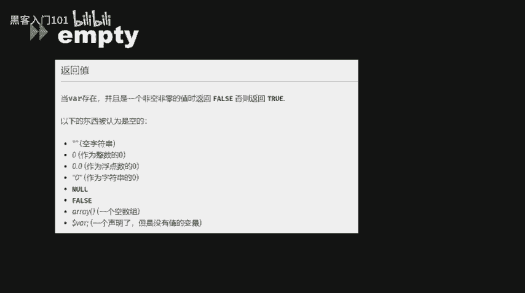
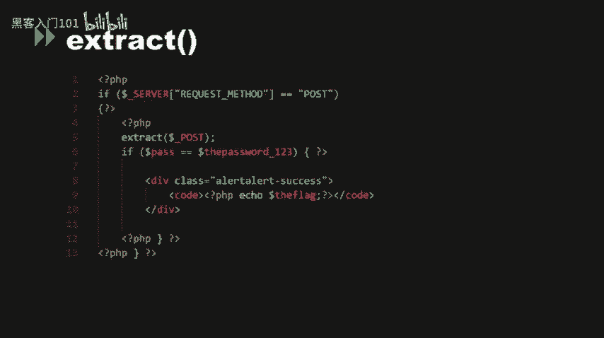
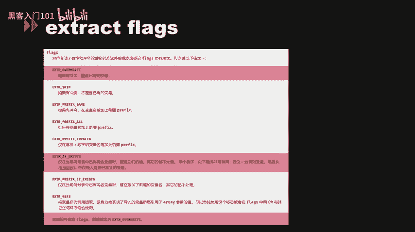
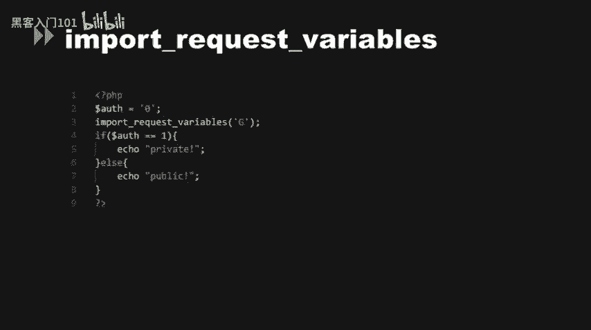

# CTF入门：P26：代码审计实战（二）


在本节课中，我们将继续学习PHP代码审计中的核心技巧，重点分析松散比较、类型转换、变量覆盖等常见漏洞点。通过具体的代码示例，我们将理解这些漏洞的原理及利用方法。

---

## 🔍 松散比较与MD5绕过

上一节我们介绍了代码审计的基本概念，本节中我们来看看PHP中松散比较带来的安全问题。

在CTF题目中，常会遇到使用松散比较（`==`）进行条件判断的环节。松散比较在比较前会尝试进行类型转换，这可能被攻击者利用。

以下是利用松散比较和MD5特性绕过的几种情况：

1.  **第一环节**：当两个参数在MD5处理前需要相等，且使用松散比较时，可以利用“哈希缺陷”直接绕过。
2.  **第二环节**：通过松散比较判断MD5值时，可以输入数组。因为`md5(array())`会返回`NULL`，并且产生一个警告，利用此特性可以绕过比较。
    *代码示例*：`?a[]=1&b[]=2`
3.  **第三环节**：当无法用上述方法绕过时，需要使用**MD5碰撞**。即找到两个不同的输入，但它们的MD5哈希值相同。
    *核心概念*：找到字符串 `$str1` 和 `$str2`，使得 `md5($str1) == md5($str2)` 成立。这可以通过“选择前缀碰撞”攻击实现，网上有现成的碰撞字符串对可用。

---

## 🔄 Switch函数与类型转换

接下来，我们分析`switch`函数中的类型转换问题。

`switch`函数接收一个参数，并根据该参数的值跳转到对应的分支。但PHP的`switch`在进行比较时，使用的是松散比较。



*代码示例*：
```php
$input = “2ABC”;
switch ($input) {
    case 2:
        echo “进入case 2”;
        break;
}
```
在这个例子中，字符串`“2ABC”`在与整数`2`进行松散比较时，会被强制转换为整数`2`，从而进入`case 2`的分支。这揭示了字符串向数值强制转换的过程。

此外，`is_numeric`函数在判断十六进制字符串（如`0x…`）时，会将其判断为数字型（返回`true`）。如果这个值被直接拼接到SQL语句中，数据库（如MySQL）会将其解析为字符串存入。若该字段后续被取出并再次使用，可能造成**二次注入漏洞**。



---

## 🔎 in_array与数组搜索漏洞

现在，我们来看看`in_array`函数可能引发的安全问题。

`in_array($needle, $haystack)`函数用于检查`$needle`是否存在于`$haystack`数组中。其第三个参数`$strict`决定是否进行严格比较（检查类型）。

*   **漏洞原理**：如果未设置`$strict`参数为`true`，`in_array`会使用松散比较。
*   **示例**：
    ```php
    $array = array(0, 1, 2, 3);
    $input = “ABC”;
    var_dump(in_array($input, $array)); // 输出 bool(true)
    ```
    字符串`“ABC”`在松散比较中会被强制转换为整数`0`，而`0`存在于数组中，因此返回`true`。`array_search`函数也存在相同的问题。

---

## ⚠️ 空值判断函数误区

许多用于空值判断的函数也存在类型转换陷阱，容易被绕过。

以下是几个需要警惕的函数：

*   **empty()**：`empty(0)`、`empty(“0”)`、`empty(0.0)`都会返回`true`。开发者若误以为`empty()`只判断`null`或空字符串，可能导致条件判断被绕过。
*   **isset()**：用于检测变量是否已声明且值不为`null`。它不发出警告，但对于不存在的变量返回`false`。
*   **strpos()**：`strpos($haystack, $needle)`返回`$needle`首次出现的位置（从0开始）。如果`$needle`出现在开头，返回`0`，在松散比较中`0 == false`为`true`，可能导致逻辑错误。应使用`===`进行严格比较。
*   **ereg()**（已弃用）：这个正则函数在匹配失败时返回`false`，匹配成功时返回匹配长度（可能为`0`），同样存在`0 == false`的问题。

---

## 🎭 变量覆盖漏洞

变量覆盖是代码审计中的另一类高危漏洞，攻击者可以控制程序变量的值。



### 1. 双美元符号（$$）变量覆盖
`$$`是一种可变变量的写法。例如，`$key = “name”; $$key = “John”;` 等价于 `$name = “John”;`。

*漏洞示例*：
```php
foreach ($_GET as $key => $value) {
    $$key = $value; // 危险操作！
}
```
如果请求`?name=admin`，代码会执行`$name = “admin”;`，从而覆盖了原有的`$name`变量。



### 2. extract() 函数变量覆盖
`extract()`函数从数组中将键名作为变量名，键值作为变量值，导入到当前符号表。

*漏洞原理*：`extract()`的第二个参数`$flags`指定处理冲突的方式。默认是`EXTR_OVERWRITE`，即覆盖已有变量。
*示例*：
```php
$size = “large”;
extract($_GET);
echo $size; // 如果请求 ?size=small， 输出 small
```
通过GET请求，我们覆盖了原有的`$size`变量。

### 3. parse_str() 函数变量覆盖
`parse_str()`函数将查询字符串解析到变量中。
*语法*：`parse_str($str, [$output])`
*漏洞点*：如果未提供第二个数组参数`$output`，解析出的变量会直接覆盖当前作用域中的同名变量。
*示例*：
```php
$flag = “default”;
parse_str($_SERVER[‘QUERY_STRING’]);
// 请求 ?flag=Hacked， 则 $flag 被覆盖为 “Hacked”
```

### 4. import_request_variables() 函数
此函数（已弃用）可将GET、POST、Cookie变量导入全局作用域。在`register_globals`配置关闭时，它提供了一种“后门”来注册全局变量，极易导致变量覆盖。
*示例*：`import_request_variables(“G”)`会导入所有GET参数为全局变量。

---

## 📝 本节总结

本节课中我们一起学习了PHP代码审计中的几个关键漏洞模式：

1.  **松散比较与MD5绕过**：利用`==`的类型转换和MD5对数组的处理、MD5碰撞来绕过条件判断。
2.  **类型转换陷阱**：`switch`、`is_numeric`、`in_array`等函数在类型转换时可能产生非预期行为，导致逻辑绕过或注入。
3.  **空值判断误区**：`empty()`、`strpos()`等函数的返回值在松散比较下可能被误解，从而绕过安全检查。
4.  **变量覆盖漏洞**：`$$`、`extract()`、`parse_str()`、`import_request_variables()`等特性或函数，如果使用不当，允许攻击者覆盖程序内部变量，控制程序流程。




理解这些漏洞的原理是进行有效代码审计和CTF解题的基础。在实战中，需要仔细阅读代码，寻找这些敏感函数和比较逻辑，思考其是否存在被绕过的可能。